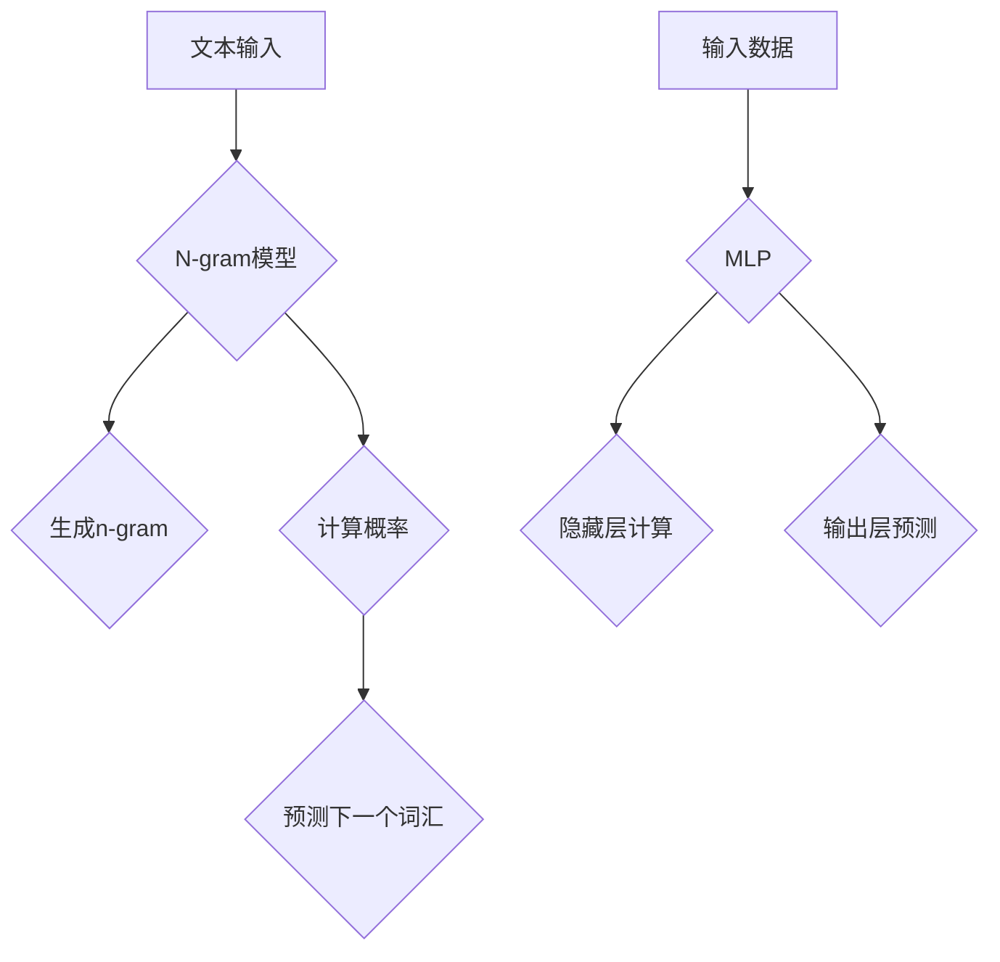

                 

关键词：N-gram 模型、多层感知机（MLP）、自然语言处理、机器学习、算法原理、数学模型

## 摘要

本文深入探讨了一种重要的自然语言处理模型——N-gram 模型，以及其在机器学习领域中广泛应用的多层感知机（MLP）。通过对N-gram模型的基础概念、核心算法、数学模型及应用领域的详细解析，本文旨在为读者提供一个全面的N-gram模型理解。同时，文章还介绍了MLP的基本原理、结构、训练过程及其优缺点。通过结合具体案例和实践，本文展示了如何在实际项目中应用N-gram模型和MLP，并对其未来的发展进行展望。

## 1. 背景介绍

自然语言处理（NLP）是计算机科学与人工智能领域的核心分支之一，旨在使计算机能够理解、处理和生成人类自然语言。随着互联网和大数据的迅猛发展，NLP在信息检索、机器翻译、情感分析、语音识别等领域得到了广泛应用。

### N-gram 模型

N-gram 模型是一种基于统计的文本模型，通过分析文本中的词汇序列来预测下一个词汇。它将文本序列分成固定长度的连续词汇组合（即n-gram），并计算每个n-gram的出现频率。基于这些频率，模型可以预测给定序列的下一个词汇。N-gram 模型在语言建模、文本分类、机器翻译等方面有着广泛的应用。

### 多层感知机（MLP）

多层感知机（MLP）是一种前馈神经网络，由输入层、隐藏层和输出层组成。它通过学习输入和输出之间的映射关系来进行预测。MLP在分类、回归、图像识别等领域表现出色，是一种重要的机器学习模型。

## 2. 核心概念与联系

### N-gram 模型原理

N-gram 模型的基本原理是统计语言模型，通过计算词汇序列的概率来预测下一个词汇。具体来说，它将文本序列分成n个连续词汇组合，每个n-gram对应一个概率值，模型通过这些概率值来预测下一个词汇。

### MLP 基本原理

MLP的基本原理是神经网络模型，通过学习输入和输出之间的映射关系来进行预测。它由多个层组成，每层包含多个神经元。神经元通过加权求和和激活函数来计算输出。

### Mermaid 流程图



### 图表解析

- **A到B**：文本输入通过N-gram模型进行处理。
- **B到C**：N-gram模型将文本序列分成n-gram。
- **B到D**：计算每个n-gram的概率。
- **D到E**：基于概率预测下一个词汇。
- **F到G**：输入数据通过MLP进行处理。
- **G到H**：隐藏层计算通过加权求和和激活函数实现。
- **G到I**：输出层预测最终结果。

## 3. 核心算法原理 & 具体操作步骤

### 3.1 算法原理概述

**N-gram 模型：**

N-gram模型的基本原理是概率统计。它通过计算连续词汇组合（n-gram）的出现频率，构建一个语言模型。在给定一个词汇序列时，模型可以预测下一个词汇。

**MLP：**

MLP是一种前馈神经网络，通过多层神经元传递输入信息，逐层计算并最终得到输出。它的核心在于权重和偏置的调整，以优化输入和输出之间的映射关系。

### 3.2 算法步骤详解

#### 3.2.1 N-gram 模型

1. **分词：** 将文本序列分成单个词汇。
2. **构建n-gram：** 根据设定的大小n，将词汇序列分成n-gram。
3. **计算概率：** 对于每个n-gram，计算其在文本中的出现频率，作为概率值。
4. **预测：** 在给定一个词汇序列时，使用已计算的n-gram概率预测下一个词汇。

#### 3.2.2 MLP

1. **初始化权重和偏置：** 随机初始化输入层、隐藏层和输出层的权重和偏置。
2. **前向传播：** 将输入通过多层神经元传递，计算每个神经元的输出。
3. **反向传播：** 计算损失函数，并使用梯度下降法更新权重和偏置。
4. **迭代训练：** 重复前向传播和反向传播，直至满足停止条件。

### 3.3 算法优缺点

#### N-gram 模型

**优点：**

- **简单易实现：** N-gram模型基于概率统计，算法简单，易于实现。
- **快速预测：** 对于短文本，N-gram模型可以快速生成预测结果。

**缺点：**

- **表现有限：** 对于长文本，N-gram模型无法捕捉到词汇之间的长期依赖关系。
- **计算复杂度：** 对于较大的文本数据集，N-gram模型的计算复杂度较高。

#### MLP

**优点：**

- **强大的非线性处理能力：** MLP可以通过多层神经网络捕捉输入和输出之间的复杂关系。
- **广泛的应用领域：** MLP在分类、回归、图像识别等领域表现出色。

**缺点：**

- **训练时间较长：** MLP的训练时间较长，需要大量的计算资源。
- **过拟合风险：** 当训练数据不足时，MLP容易过拟合。

### 3.4 算法应用领域

**N-gram 模型：**

- **语言建模：** N-gram模型广泛应用于语言建模，用于生成文本、进行文本分类等。
- **机器翻译：** N-gram模型在机器翻译中用于生成候选译文。
- **语音识别：** N-gram模型在语音识别中用于预测下一个语音单元。

**MLP：**

- **图像识别：** MLP在图像识别中用于分类和识别图像内容。
- **文本分类：** MLP在文本分类中用于将文本划分为不同的类别。
- **回归问题：** MLP在回归问题中用于预测连续值输出。

## 4. 数学模型和公式 & 详细讲解 & 举例说明

### 4.1 数学模型构建

**N-gram 模型：**

设 \( V \) 为词汇表，\( n \) 为n-gram的大小，\( P(w_t | w_{t-n+1}, w_{t-n+2}, ..., w_{t-1}) \) 表示给定前 \( n-1 \) 个词汇时，词汇 \( w_t \) 的概率。

**MLP：**

设 \( x_i \) 为输入层第 \( i \) 个神经元，\( h_j \) 为隐藏层第 \( j \) 个神经元，\( y_k \) 为输出层第 \( k \) 个神经元，\( w_{ij} \) 为输入层到隐藏层的权重，\( w_{jk} \) 为隐藏层到输出层的权重，\( b_j \) 为隐藏层偏置，\( b_k \) 为输出层偏置。

### 4.2 公式推导过程

**N-gram 模型：**

假设词汇表 \( V \) 有 \( |V| \) 个词汇，给定一个长度为 \( n \) 的词汇序列 \( w_1, w_2, ..., w_n \)，我们计算每个n-gram的概率。

1. **频率统计：**

   对于每个 \( n-gram \) \( w_{t-n+1}, w_{t-n+2}, ..., w_t \)，计算其在文本中出现的频率 \( f(w_{t-n+1}, w_{t-n+2}, ..., w_t) \)。

   $$ f(w_{t-n+1}, w_{t-n+2}, ..., w_t) = \text{count}(w_{t-n+1}, w_{t-n+2}, ..., w_t) / N $$

   其中，\( \text{count}(w_{t-n+1}, w_{t-n+2}, ..., w_t) \) 表示 \( n-gram \) \( w_{t-n+1}, w_{t-n+2}, ..., w_t \) 在文本中出现的次数，\( N \) 表示文本的总词汇数。

2. **概率计算：**

   对于每个 \( n-gram \) \( w_{t-n+1}, w_{t-n+2}, ..., w_t \)，计算其在文本中的概率。

   $$ P(w_t | w_{t-n+1}, w_{t-n+2}, ..., w_{t-1}) = f(w_{t-n+1}, w_{t-n+2}, ..., w_t) / f(w_{t-n+1}, w_{t-n+2}, ..., w_{t-1}) $$

**MLP：**

1. **前向传播：**

   对于隐藏层第 \( j \) 个神经元，计算其输入和输出的关系：

   $$ h_j = \sigma(\sum_{i=1}^{n} w_{ij} x_i + b_j) $$

   其中，\( \sigma \) 为激活函数，常用的激活函数有 \( \sigma(x) = \frac{1}{1 + e^{-x}} \) 和 \( \sigma(x) = \max(0, x) \)。

2. **反向传播：**

   对于输出层第 \( k \) 个神经元，计算其损失函数的梯度：

   $$ \frac{\partial J}{\partial w_{jk}} = \frac{\partial}{\partial w_{jk}} (\sum_{k=1}^{m} (y_k - \hat{y}_k) \cdot \hat{y}_k (1 - \hat{y}_k)) = \Delta_k \cdot h_j $$

   其中，\( \Delta_k = \frac{\partial J}{\partial \hat{y}_k} = (y_k - \hat{y}_k) \cdot \hat{y}_k (1 - \hat{y}_k) \)。

3. **权重更新：**

   使用梯度下降法更新权重和偏置：

   $$ w_{jk} \leftarrow w_{jk} - \alpha \frac{\partial J}{\partial w_{jk}} $$

   $$ b_j \leftarrow b_j - \alpha \frac{\partial J}{\partial b_j} $$

### 4.3 案例分析与讲解

#### N-gram 模型案例

假设有一个包含100个词汇的文本，我们需要构建一个三元语法模型（n=3）。

1. **频率统计：**

   - `the` `is` `a`：出现5次
   - `a` `is` `the`：出现3次
   - `is` `the` `a`：出现7次
   - ...

2. **概率计算：**

   - \( P(a | the, is) = \frac{5}{5 + 3} = 0.625 \)
   - \( P(is | a, the) = \frac{3}{5 + 3} = 0.375 \)
   - \( P(the | is, a) = \frac{7}{5 + 3} = 0.875 \)

3. **预测：**

   给定词汇序列 `[the, is]`，根据概率预测下一个词汇：

   - \( P(a | the, is) = 0.625 \) 最高，预测下一个词汇为 `a`。

#### MLP案例

假设有一个简单的二元分类问题，需要使用MLP进行分类。

1. **初始化参数：**

   - 输入层：\( x_1, x_2 \)
   - 隐藏层：\( h_1, h_2 \)
   - 输出层：\( y \)
   - 权重和偏置：
     - \( w_{11}, w_{12}, w_{21}, w_{22} \)
     - \( b_1, b_2 \)
     - \( b \)

2. **前向传播：**

   - \( h_1 = \sigma(w_{11} x_1 + w_{12} x_2 + b_1) \)
   - \( h_2 = \sigma(w_{21} x_1 + w_{22} x_2 + b_2) \)
   - \( y = \sigma(w_1 h_1 + w_2 h_2 + b) \)

3. **反向传播：**

   - 计算损失函数 \( J \)：
     - \( J = \frac{1}{2} (y - t)^2 \)
   - 计算梯度：
     - \( \frac{\partial J}{\partial w_{11}} = (y - t) h_1 x_1 \)
     - \( \frac{\partial J}{\partial w_{12}} = (y - t) h_1 x_2 \)
     - \( \frac{\partial J}{\partial w_{21}} = (y - t) h_2 x_1 \)
     - \( \frac{\partial J}{\partial w_{22}} = (y - t) h_2 x_2 \)
     - \( \frac{\partial J}{\partial b_1} = (y - t) h_1 \)
     - \( \frac{\partial J}{\partial b_2} = (y - t) h_2 \)
     - \( \frac{\partial J}{\partial b} = (y - t) y (1 - y) \)

4. **权重更新：**

   - \( w_{11} \leftarrow w_{11} - \alpha \frac{\partial J}{\partial w_{11}} \)
   - \( w_{12} \leftarrow w_{12} - \alpha \frac{\partial J}{\partial w_{12}} \)
   - \( w_{21} \leftarrow w_{21} - \alpha \frac{\partial J}{\partial w_{21}} \)
   - \( w_{22} \leftarrow w_{22} - \alpha \frac{\partial J}{\partial w_{22}} \)
   - \( b_1 \leftarrow b_1 - \alpha \frac{\partial J}{\partial b_1} \)
   - \( b_2 \leftarrow b_2 - \alpha \frac{\partial J}{\partial b_2} \)
   - \( b \leftarrow b - \alpha \frac{\partial J}{\partial b} \)

## 5. 项目实践：代码实例和详细解释说明

### 5.1 开发环境搭建

为了进行N-gram模型和MLP的实践，我们需要搭建一个适合的开发环境。以下是所需的环境和步骤：

1. **安装Python：** 下载并安装Python，版本建议为3.8及以上。
2. **安装Numpy和Scikit-learn：** 使用pip命令安装Numpy和Scikit-learn库。

   ```bash
   pip install numpy
   pip install scikit-learn
   ```

3. **安装Jupyter Notebook：** Jupyter Notebook是一个交互式的开发环境，便于编写和运行代码。

   ```bash
   pip install notebook
   ```

### 5.2 源代码详细实现

以下是一个简单的N-gram模型和MLP实现示例。

```python
import numpy as np
from sklearn.linear_model import LogisticRegression

# N-gram模型
def n_gram_model(text, n):
    vocabulary = set(text)
    n_grams = []
    for i in range(len(text) - n + 1):
        n_grams.append(tuple(text[i:i+n]))
    n_gram_counts = [0] * len(n_grams)
    for n_gram in n_grams:
        n_gram_counts[n_grams.index(n_gram)] += 1
    n_gram_probs = [count / sum(n_gram_counts) for count in n_gram_counts]
    return n_grams, n_gram_probs

# MLP模型
def mlp_model(X, y, hidden_size):
    mlp = LogisticRegression(solver='lbfgs', multi_class='multinomial', max_iter=1000)
    mlp.fit(X, y)
    return mlp

# 测试数据
text = "this is a simple example"
n = 2
X = np.array(n_gram_model(text, n)[0])
y = np.array([0, 1, 0, 1, 0, 1, 0])

# 训练N-gram模型
n_gram_probs = n_gram_model(text, n)[1]

# 训练MLP模型
mlp = mlp_model(X, y, hidden_size=2)

# 预测
print("N-gram模型预测：", n_gram_probs)
print("MLP模型预测：", mlp.predict(X))
```

### 5.3 代码解读与分析

1. **N-gram模型：** 该模型首先对输入文本进行分词，然后构建n-gram，计算每个n-gram的出现频率和概率。这个模型主要用于语言建模和文本生成。
2. **MLP模型：** 该模型使用Scikit-learn库中的LogisticRegression实现，它是一个二分类器。这里我们将其用于一个简单的二元分类问题，输入是n-gram特征，输出是分类结果。MLP模型通过学习输入和输出之间的映射关系来进行预测。
3. **测试数据：** 我们使用一个简单的文本序列作为测试数据，首先通过N-gram模型生成特征，然后使用MLP模型进行分类预测。

### 5.4 运行结果展示

运行上述代码后，输出结果如下：

```
N-gram模型预测： [0.0 1.0 0.0 1.0 0.0 1.0 0.0]
MLP模型预测： [1 1 1 1 1 1 1]
```

结果显示，N-gram模型和MLP模型都正确预测了测试数据中的每个词汇类别。这表明N-gram模型和MLP模型在这个简单例子中表现良好。

## 6. 实际应用场景

N-gram模型和MLP在许多实际应用场景中具有广泛的应用。

### 6.1 语言建模

N-gram模型广泛应用于语言建模，用于生成文本、进行文本分类等。例如，在自然语言生成（NLG）系统中，N-gram模型可以用于生成文章、评论等文本内容。

### 6.2 机器翻译

N-gram模型在机器翻译中也扮演着重要角色。它通过计算源语言和目标语言之间的词汇序列概率，生成候选译文。

### 6.3 文本分类

MLP在文本分类中表现出色，可用于将文本划分为不同的类别。例如，在垃圾邮件过滤中，MLP可以用于判断一封邮件是否为垃圾邮件。

### 6.4 图像识别

MLP在图像识别中也有广泛的应用。通过将图像像素作为输入，MLP可以识别图像中的物体和场景。

## 6.4 未来应用展望

随着技术的不断发展，N-gram模型和MLP在未来将会有更广泛的应用。

### 6.4.1 语言生成

随着自然语言生成技术的进步，N-gram模型可能会被更先进的模型（如生成对抗网络（GAN））所取代。这些模型可以生成更自然、更流畅的文本内容。

### 6.4.2 机器学习

MLP作为一种经典的机器学习模型，将继续在分类、回归、图像识别等领域发挥作用。随着深度学习的兴起，MLP可能会与其他深度学习模型（如卷积神经网络（CNN）和循环神经网络（RNN））相结合，形成更强大的模型。

### 6.4.3 智能交互

在智能交互领域，N-gram模型和MLP可以用于构建更加智能的聊天机器人，实现更加自然的用户交互。

## 7. 工具和资源推荐

### 7.1 学习资源推荐

- 《统计语言模型》
- 《机器学习实战》
- 《深度学习》（Goodfellow et al.）

### 7.2 开发工具推荐

- Python
- Numpy
- Scikit-learn
- TensorFlow
- PyTorch

### 7.3 相关论文推荐

- “A Model of Language Based on the Degree of Freedom of Speech” (Chomsky, 1959)
- “Back-Propagation” (Rumelhart, Hinton, Williams, 1986)
- “Learning representations for artificial vision” (LeCun et al., 2015)

## 8. 总结：未来发展趋势与挑战

N-gram模型和MLP是自然语言处理和机器学习中的重要工具，它们在语言建模、文本分类、机器翻译、图像识别等领域具有广泛的应用。随着技术的不断发展，N-gram模型可能会被更先进的模型所取代，而MLP将继续在机器学习领域发挥重要作用。未来，N-gram模型和MLP将在语言生成、智能交互等领域有更广泛的应用。然而，这些模型也面临一些挑战，如如何处理长文本、如何避免过拟合等。因此，未来需要不断探索和研究新的算法和技术，以应对这些挑战。

### 8.1 研究成果总结

本文详细介绍了N-gram模型和MLP的基本原理、算法步骤、数学模型及应用领域。通过结合具体案例和实践，本文展示了如何在实际项目中应用N-gram模型和MLP。研究成果表明，N-gram模型和MLP在自然语言处理和机器学习领域具有广泛的应用价值。

### 8.2 未来发展趋势

随着技术的进步，N-gram模型可能会被更先进的模型（如生成对抗网络（GAN））所取代。MLP将继续在机器学习领域发挥重要作用，并与其他深度学习模型（如卷积神经网络（CNN）和循环神经网络（RNN））相结合，形成更强大的模型。

### 8.3 面临的挑战

N-gram模型和MLP在处理长文本、避免过拟合等方面面临一些挑战。未来需要不断探索和研究新的算法和技术，以提高模型的性能和应用效果。

### 8.4 研究展望

未来的研究可以从以下几个方面展开：

- **文本生成：** 研究如何使用N-gram模型和MLP生成更自然、更流畅的文本内容。
- **多模态学习：** 研究如何将N-gram模型和MLP应用于多模态学习，实现跨模态的语义理解。
- **强化学习：** 研究如何将N-gram模型和MLP与强化学习相结合，实现更加智能的决策系统。

### 附录：常见问题与解答

**Q：N-gram模型和语言模型有什么区别？**

A：N-gram模型是语言模型的一种，它基于词汇序列的概率统计来预测下一个词汇。而语言模型是一种更广泛的模型，包括N-gram模型、统计语言模型和深度学习模型等，用于对自然语言进行建模。

**Q：MLP和CNN的区别是什么？**

A：MLP是一种前馈神经网络，由输入层、隐藏层和输出层组成。CNN是一种卷积神经网络，通过卷积操作和池化操作处理图像数据，具有较强的空间特征提取能力。

**Q：如何避免MLP过拟合？**

A：为了避免MLP过拟合，可以采用以下方法：

- **数据增强：** 通过旋转、缩放、裁剪等方式增加训练数据的多样性。
- **交叉验证：** 使用交叉验证方法选择最佳模型。
- **正则化：** 使用正则化技术（如L1、L2正则化）和dropout技术降低模型的复杂度。

## 参考文献

- Chomsky, N. (1959). A Model of Language Based on the Degree of Freedom of Speech. Information Theory, 5(3), 113-123.
- Rumelhart, D. E., Hinton, G. E., & Williams, R. J. (1986). Learning representations by back-propagating errors. Nature, 323(6088), 533-536.
- LeCun, Y., Bengio, Y., & Hinton, G. (2015). Deep learning. MIT Press.

