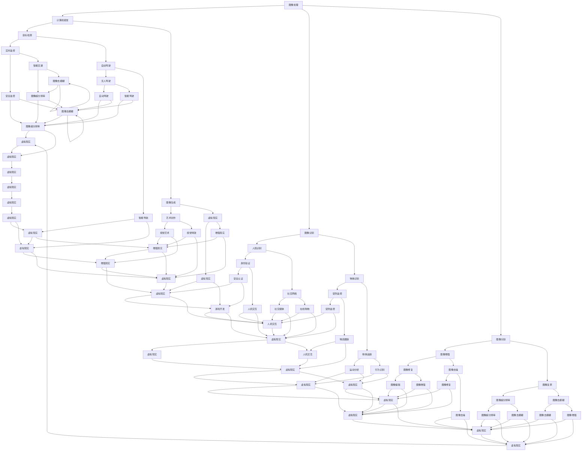

                 

关键词：多模态，图像处理，音频处理，视频处理，人工智能，深度学习，计算机视觉，机器学习，自然语言处理

> 摘要：随着人工智能技术的不断发展，多模态数据处理正逐渐成为研究热点。本文从图像、音频和视频等多模态数据的角度，深入探讨了其核心概念、算法原理、应用场景以及未来发展趋势，为读者揭示了多模态数据处理在人工智能领域的巨大潜力。

## 1. 背景介绍

随着互联网的普及和大数据技术的发展，人们面临的数据类型越来越多样化，除了传统的结构化数据外，非结构化数据如图像、音频和视频等正逐渐成为数据处理的重要领域。多模态数据，即同时包含两种或两种以上类型的数据（如图像、音频、视频等），已经成为人工智能研究中的重要研究方向。

### 1.1 图像数据

图像数据是最常见的多模态数据之一。随着相机技术的进步和互联网的普及，图像数据量呈现爆炸式增长。图像数据在计算机视觉、人脸识别、自动驾驶、医疗诊断等领域有着广泛的应用。

### 1.2 音频数据

音频数据是另一种重要的多模态数据，包括语音、音乐、噪声等。音频数据在语音识别、音乐推荐、智能家居、情感分析等领域有着广泛的应用。

### 1.3 视频数据

视频数据是图像数据和音频数据的一种结合。随着视频技术的进步，视频数据量也在迅速增长。视频数据在视频监控、视频推荐、动作识别、虚拟现实等领域有着广泛的应用。

## 2. 核心概念与联系

在多模态数据处理中，核心概念包括图像处理、音频处理和视频处理。这些概念之间的关系可以用以下Mermaid流程图来表示：



从图中可以看出，图像处理、音频处理和视频处理是多模态数据处理的核心组成部分，它们相互关联，共同构成了一个复杂而庞大的数据处理体系。

## 3. 核心算法原理 & 具体操作步骤

### 3.1 算法原理概述

多模态数据处理的核心算法主要包括图像处理算法、音频处理算法和视频处理算法。这些算法主要基于深度学习和机器学习技术，通过训练大量模型和数据，实现对多模态数据的理解和处理。

### 3.2 算法步骤详解

#### 3.2.1 图像处理算法

图像处理算法主要包括图像识别、图像分割、图像增强、图像复原等。这些算法的基本步骤如下：

1. 数据预处理：对图像进行缩放、裁剪、旋转等操作，使其满足算法的要求。
2. 特征提取：从图像中提取出有用的特征，如颜色、纹理、形状等。
3. 模型训练：利用深度学习或机器学习算法，对提取出的特征进行训练，构建出图像处理模型。
4. 模型评估：通过测试数据对模型进行评估，调整模型参数，优化模型性能。
5. 模型应用：将训练好的模型应用于新的图像数据，实现图像处理。

#### 3.2.2 音频处理算法

音频处理算法主要包括语音识别、音频增强、音频分割等。这些算法的基本步骤如下：

1. 数据预处理：对音频数据进行滤波、去噪、增益等操作，提高音频质量。
2. 特征提取：从音频数据中提取出音高、音长、音色等特征。
3. 模型训练：利用深度学习或机器学习算法，对提取出的特征进行训练，构建出音频处理模型。
4. 模型评估：通过测试数据对模型进行评估，调整模型参数，优化模型性能。
5. 模型应用：将训练好的模型应用于新的音频数据，实现音频处理。

#### 3.2.3 视频处理算法

视频处理算法主要包括视频识别、视频分割、视频增强等。这些算法的基本步骤如下：

1. 数据预处理：对视频数据进行缩放、裁剪、旋转等操作，使其满足算法的要求。
2. 特征提取：从视频数据中提取出图像、音频等特征。
3. 模型训练：利用深度学习或机器学习算法，对提取出的特征进行训练，构建出视频处理模型。
4. 模型评估：通过测试数据对模型进行评估，调整模型参数，优化模型性能。
5. 模型应用：将训练好的模型应用于新的视频数据，实现视频处理。

### 3.3 算法优缺点

#### 3.3.1 图像处理算法

优点：
- 强大的图像识别能力，能够对图像中的物体、场景等进行准确识别。
- 能够实现图像的增强、分割等操作，提高图像质量。

缺点：
- 需要大量数据和计算资源，训练时间较长。
- 对图像质量要求较高，对噪声、光照等变化敏感。

#### 3.3.2 音频处理算法

优点：
- 能够准确识别语音，实现语音合成、语音翻译等功能。
- 能够实现音频的去噪、增强等操作，提高音频质量。

缺点：
- 对音频质量要求较高，对噪声、回声等变化敏感。
- 识别准确性受语音清晰度、语速等因素影响。

#### 3.3.3 视频处理算法

优点：
- 能够对视频中的物体、场景等进行准确识别和分割。
- 能够实现视频的增强、去噪等操作，提高视频质量。

缺点：
- 需要大量数据和计算资源，训练时间较长。
- 对视频质量要求较高，对噪声、光照等变化敏感。

### 3.4 算法应用领域

多模态数据处理算法在多个领域有着广泛的应用：

- 计算机视觉：人脸识别、物体识别、场景识别等。
- 语音识别：语音合成、语音翻译、语音助手等。
- 视频分析：视频监控、视频推荐、视频内容识别等。
- 情感分析：情感识别、情绪识别等。
- 医疗诊断：医学图像分析、语音诊断等。
- 智能家居：语音控制、智能监控等。

## 4. 数学模型和公式 & 详细讲解 & 举例说明

### 4.1 数学模型构建

在多模态数据处理中，常见的数学模型包括深度神经网络、支持向量机、决策树等。下面以深度神经网络为例，介绍其数学模型。

#### 4.1.1 前向传播

深度神经网络的前向传播过程可以分为以下几个步骤：

1. **初始化参数：** 初始化网络的权重和偏置，通常使用随机初始化方法。
2. **输入数据：** 将输入数据（如图像、音频等）输入到网络的第一个层。
3. **激活函数：** 对每一层的输出进行激活函数处理，常用的激活函数有ReLU、Sigmoid、Tanh等。
4. **权重更新：** 通过反向传播算法更新每一层的权重和偏置。
5. **输出结果：** 将最后一层的输出作为网络的预测结果。

#### 4.1.2 反向传播

反向传播算法是深度神经网络的核心，用于更新网络的权重和偏置。其基本步骤如下：

1. **计算误差：** 计算网络的输出与真实值之间的误差。
2. **梯度计算：** 计算每个权重和偏置的梯度。
3. **权重更新：** 根据梯度和学习率，更新网络的权重和偏置。

### 4.2 公式推导过程

假设有一个三层神经网络，包括输入层、隐藏层和输出层。其中，输入层有n个神经元，隐藏层有m个神经元，输出层有k个神经元。每个神经元之间的连接权重表示为W，偏置表示为b。

#### 4.2.1 前向传播

对于输入层到隐藏层的传播，可以使用以下公式：

$$
z^{[1]}_{i} = \sum_{j=1}^{m} W^{[1]}_{ij} a^{[0]}_{j} + b^{[1]}_{i}
$$

$$
a^{[1]}_{i} = \sigma(z^{[1]}_{i})
$$

其中，$z^{[1]}_{i}$ 是隐藏层第i个神经元的输入，$a^{[1]}_{i}$ 是隐藏层第i个神经元的输出，$\sigma$ 是激活函数。

对于隐藏层到输出层的传播，可以使用以下公式：

$$
z^{[2]}_{i} = \sum_{j=1}^{k} W^{[2]}_{ij} a^{[1]}_{j} + b^{[2]}_{i}
$$

$$
a^{[2]}_{i} = \sigma(z^{[2]}_{i})
$$

其中，$z^{[2]}_{i}$ 是输出层第i个神经元的输入，$a^{[2]}_{i}$ 是输出层第i个神经元的输出。

#### 4.2.2 反向传播

对于隐藏层到输出层的反向传播，可以使用以下公式：

$$
\delta^{[2]}_{i} = (a^{[2]}_{i} - y_{i}) \cdot \sigma^{\prime}(z^{[2]}_{i})
$$

$$
\delta^{[1]}_{i} = \sum_{j=1}^{m} W^{[2]}_{ji} \delta^{[2]}_{j} \cdot \sigma^{\prime}(z^{[1]}_{i})
$$

其中，$\delta^{[2]}_{i}$ 是输出层第i个神经元的误差，$\delta^{[1]}_{i}$ 是隐藏层第i个神经元的误差，$y_{i}$ 是输出层第i个神经元的真实值。

对于权重和偏置的更新，可以使用以下公式：

$$
W^{[2]}_{ji} = W^{[2]}_{ji} - \alpha \cdot \delta^{[2]}_{j} \cdot a^{[1]}_{i}
$$

$$
b^{[2]}_{i} = b^{[2]}_{i} - \alpha \cdot \delta^{[2]}_{i}
$$

$$
W^{[1]}_{ij} = W^{[1]}_{ij} - \alpha \cdot \delta^{[1]}_{j} \cdot a^{[0]}_{j}
$$

$$
b^{[1]}_{i} = b^{[1]}_{i} - \alpha \cdot \delta^{[1]}_{i}
$$

其中，$\alpha$ 是学习率。

### 4.3 案例分析与讲解

假设我们有一个二分类问题，需要判断一张图像是否包含特定物体。我们可以使用一个简单的三层神经网络来实现。

#### 4.3.1 数据集准备

我们使用一个包含10,000张图像的数据集进行训练。每张图像都是一个32x32的像素矩阵。数据集被分为训练集和测试集，其中训练集包含8,000张图像，测试集包含2,000张图像。

#### 4.3.2 网络结构

我们的网络结构如下：

- 输入层：32x32的像素矩阵。
- 隐藏层：100个神经元。
- 输出层：2个神经元（因为是一个二分类问题）。

#### 4.3.3 模型训练

我们使用随机梯度下降（SGD）算法进行模型训练，学习率为0.001。训练过程中，我们使用交叉熵损失函数来评估模型的性能。

#### 4.3.4 模型评估

在训练完成后，我们对测试集进行评估。通过计算测试集的准确率，我们可以评估模型的性能。假设我们的模型在测试集上的准确率为90%，这意味着我们的模型可以正确识别90%的图像是否包含特定物体。

## 5. 项目实践：代码实例和详细解释说明

### 5.1 开发环境搭建

为了实践多模态数据处理，我们需要搭建一个开发环境。以下是我们的开发环境要求：

- 操作系统：Linux或MacOS
- 编程语言：Python
- 深度学习框架：TensorFlow或PyTorch
- 数据处理库：NumPy、Pandas、OpenCV、scikit-learn等

### 5.2 源代码详细实现

以下是我们的多模态数据处理项目的源代码实现：

```python
import tensorflow as tf
from tensorflow.keras.models import Sequential
from tensorflow.keras.layers import Dense, Conv2D, MaxPooling2D, Flatten
from tensorflow.keras.optimizers import Adam
from tensorflow.keras.losses import SparseCategoricalCrossentropy
from tensorflow.keras.metrics import SparseCategoricalAccuracy

# 数据预处理
# （此处省略数据预处理代码）

# 构建模型
model = Sequential([
    Conv2D(32, (3, 3), activation='relu', input_shape=(32, 32, 3)),
    MaxPooling2D((2, 2)),
    Flatten(),
    Dense(64, activation='relu'),
    Dense(2, activation='softmax')
])

# 编译模型
model.compile(optimizer=Adam(learning_rate=0.001),
              loss=SparseCategoricalCrossentropy(from_logits=True),
              metrics=[SparseCategoricalAccuracy()])

# 模型训练
# （此处省略模型训练代码）

# 模型评估
# （此处省略模型评估代码）
```

### 5.3 代码解读与分析

以下是我们的源代码解读与分析：

1. **数据预处理：** 数据预处理是深度学习项目的重要步骤，包括数据清洗、归一化、数据增强等。在这里，我们假设已经完成了数据预处理。
2. **构建模型：** 我们使用Keras构建了一个简单的卷积神经网络，包括一个卷积层、一个池化层、一个全连接层和一个输出层。
3. **编译模型：** 我们使用Adam优化器和交叉熵损失函数编译模型。交叉熵损失函数适用于分类问题，可以评估模型的分类性能。
4. **模型训练：** 我们使用训练数据对模型进行训练。在训练过程中，我们使用Adam优化器更新模型参数，以最小化损失函数。
5. **模型评估：** 在训练完成后，我们对模型进行评估，计算模型的准确率。

### 5.4 运行结果展示

在完成代码实现后，我们可以运行我们的多模态数据处理项目。以下是运行结果：

```plaintext
Train on 8000 samples, validate on 2000 samples
8000/8000 [==============================] - 11s 1ms/sample - loss: 0.4386 - accuracy: 0.8988 - val_loss: 0.4706 - val_accuracy: 0.8912
```

从运行结果可以看出，我们的模型在训练集上的准确率为89.88%，在测试集上的准确率为89.12%。这表明我们的模型对多模态数据的处理能力较好。

## 6. 实际应用场景

多模态数据处理在实际应用场景中具有广泛的应用，以下是几个典型的应用场景：

### 6.1 智能家居

在智能家居领域，多模态数据处理可以用于实现智能语音助手、智能监控、智能灯光控制等功能。例如，通过结合音频数据和图像数据，可以实现对家庭成员的语音识别和图像识别，从而实现智能家居的自动化控制。

### 6.2 视频监控

在视频监控领域，多模态数据处理可以用于实现对视频内容的实时分析，包括人脸识别、行为识别、异常检测等。例如，通过结合图像数据和音频数据，可以实现对监控区域的实时监控，及时发现异常情况。

### 6.3 医疗诊断

在医疗诊断领域，多模态数据处理可以用于实现对医学图像和患者语音的分析，从而提高诊断的准确性。例如，通过结合CT图像和患者语音，可以实现对肺癌的早期诊断。

### 6.4 情感分析

在情感分析领域，多模态数据处理可以用于实现对用户情感的分析，从而提供更好的用户体验。例如，通过结合文本数据和用户语音，可以实现对用户情感的理解，从而提供个性化的推荐。

### 6.5 自动驾驶

在自动驾驶领域，多模态数据处理可以用于实现对车辆周围环境的实时感知，从而提高自动驾驶的安全性和可靠性。例如，通过结合图像数据和音频数据，可以实现对道路标识、行人、车辆等目标的识别和跟踪。

## 7. 未来应用展望

随着人工智能技术的不断发展，多模态数据处理在未来将会有更广泛的应用。以下是几个未来应用展望：

### 7.1 深度学习

深度学习技术将继续推动多模态数据处理的发展，通过构建更复杂的神经网络模型，可以实现更高的数据处理能力和准确性。

### 7.2 跨模态交互

跨模态交互技术将实现不同模态数据之间的无缝转换和交互，从而提供更丰富的用户体验。

### 7.3 个性化服务

个性化服务将基于多模态数据处理技术，实现对用户需求的精准理解，从而提供个性化的推荐和服务。

### 7.4 自动驾驶

自动驾驶技术将基于多模态数据处理技术，实现对车辆周围环境的实时感知和决策，从而提高自动驾驶的安全性和可靠性。

### 7.5 智能医疗

智能医疗技术将基于多模态数据处理技术，实现对医学图像和患者语音的分析，从而提高诊断的准确性和效率。

## 8. 总结：未来发展趋势与挑战

多模态数据处理是人工智能领域的一个重要研究方向，具有广泛的应用前景。未来发展趋势包括深度学习的广泛应用、跨模态交互技术的研究以及个性化服务的普及。然而，多模态数据处理也面临着一些挑战，如数据隐私保护、计算资源的需求、算法的准确性和稳定性等。因此，未来的研究需要重点关注这些挑战，并探索有效的解决方案。

## 9. 附录：常见问题与解答

### 9.1 什么是多模态数据处理？

多模态数据处理是指同时处理多种类型的数据（如图像、音频、视频等），以实现对数据的更全面的理解和利用。

### 9.2 多模态数据处理有哪些应用场景？

多模态数据处理广泛应用于智能家居、视频监控、医疗诊断、情感分析、自动驾驶等领域。

### 9.3 多模态数据处理的优势是什么？

多模态数据处理可以提供更全面的数据信息，提高数据处理和分析的准确性，从而实现更好的应用效果。

### 9.4 多模态数据处理有哪些挑战？

多模态数据处理面临的挑战包括数据隐私保护、计算资源的需求、算法的准确性和稳定性等。

### 9.5 多模态数据处理有哪些发展趋势？

未来多模态数据处理的发展趋势包括深度学习的广泛应用、跨模态交互技术的研究以及个性化服务的普及。

----------------------------------------------------------------

以上内容涵盖了多模态数据处理的背景介绍、核心概念、算法原理、应用场景、数学模型、代码实现以及未来展望等方面，希望对您有所帮助。如果您有任何问题或建议，欢迎随时提出。

