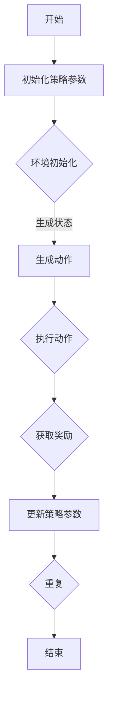

                 

### 背景介绍

策略梯度（Policy Gradient）是一种在机器学习，尤其是深度强化学习（Deep Reinforcement Learning, DRL）中广泛应用的方法。策略梯度方法通过优化策略来使得智能体（Agent）在与环境（Environment）交互的过程中，能够逐渐学习到最优行为策略。

传统的强化学习方法，如Q-learning和SARSA，主要是基于值函数（Value Function）进行学习的。而策略梯度方法则是直接优化策略本身。这一方法的主要优势在于，它能够通过策略的直接优化，更加高效地探索环境，并且能够在某些情况下，比基于值函数的方法学习得更快。

策略梯度方法最初由Sutton和Barto在1998年的《Reinforcement Learning: An Introduction》一书中提出。随后，随着深度学习技术的发展，策略梯度方法在深度强化学习领域得到了广泛的应用和研究。例如，策略梯度方法被应用于深度Q网络（DQN）、深度策略梯度（DPC）、优势优势演员-评论家（A2C）等方法中。

本文将详细介绍策略梯度方法的原理，包括其数学模型、算法步骤、优缺点以及实际应用场景。同时，我们将通过一个具体的代码实例，深入讲解策略梯度的实现过程，帮助读者更好地理解这一方法。

### 核心概念与联系

#### 1. 强化学习基础概念

在介绍策略梯度之前，我们需要回顾一些强化学习的基础概念。

- **智能体（Agent）**：执行行动的实体，例如机器人、自动驾驶汽车或游戏玩家。
- **环境（Environment）**：智能体所处的外部世界，包括状态、动作空间和奖励信号。
- **状态（State）**：智能体在特定时间点的环境描述。
- **动作（Action）**：智能体可以采取的行为。
- **策略（Policy）**：智能体的行为规则，决定智能体在特定状态下应该采取哪个动作。
- **价值函数（Value Function）**：衡量智能体在某个状态或状态-动作对上的期望收益。
- **奖励（Reward）**：环境给予智能体在执行某个动作后的即时回报。

#### 2. 策略梯度方法

策略梯度方法的核心思想是通过优化策略来最大化累积奖励。与传统的值函数方法不同，策略梯度方法直接对策略进行优化，而不是对值函数进行优化。

- **策略梯度**：策略梯度是一组参数的梯度，描述了策略参数的变化对累积奖励的影响。具体来说，策略梯度可以用来更新策略参数，使得策略能够更好地适应环境。
  
- **策略优化**：策略优化的目标是找到一组策略参数，使得累积奖励最大化。策略梯度方法通过梯度上升或下降来更新策略参数，从而实现策略的优化。

#### 3. 策略梯度与深度强化学习

策略梯度方法在深度强化学习中的应用非常广泛。深度强化学习利用深度神经网络来近似策略或价值函数，从而在复杂环境中实现智能体的自主决策。

- **深度策略梯度（Deep Policy Gradient）**：深度策略梯度方法使用深度神经网络来近似策略，通过策略梯度更新网络参数，从而优化策略。
  
- **深度Q网络（Deep Q-Network, DQN）**：虽然DQN主要基于值函数进行学习，但也可以使用策略梯度方法来优化策略。

- **优势优势演员-评论家（A2C）**：A2C方法通过计算每个步骤的优势值来更新策略，从而实现策略的优化。

### Mermaid 流程图

下面是策略梯度方法的Mermaid流程图，展示了策略梯度方法的总体流程和关键步骤。



在这个流程图中，智能体与环境交互，通过策略生成动作，执行动作后获取奖励，并根据奖励更新策略参数。这个过程不断重复，直到达到预定的结束条件。

### 核心算法原理 & 具体操作步骤

#### 1. 算法原理概述

策略梯度方法的核心思想是通过优化策略参数来最大化累积奖励。具体来说，策略梯度方法利用梯度上升或下降来更新策略参数，从而优化策略。

- **策略表示**：策略通常用一个概率分布来表示，表示智能体在特定状态下采取某个动作的概率。

- **策略参数**：策略参数是策略概率分布的参数，决定了策略的行为。

- **累积奖励**：累积奖励是智能体在一段时间内从环境中获得的奖励总和。

- **策略梯度**：策略梯度是一组参数的梯度，描述了策略参数的变化对累积奖励的影响。

- **策略优化**：策略优化的目标是找到一组策略参数，使得累积奖励最大化。

#### 2. 算法步骤详解

策略梯度方法的算法步骤可以分为以下几个部分：

1. **初始化策略参数**：初始化策略参数，通常使用随机初始化或预训练的参数。
2. **环境初始化**：初始化环境，包括状态空间、动作空间和奖励函数。
3. **生成状态**：智能体从环境中获取当前状态。
4. **生成动作**：根据当前状态和策略参数，生成一个动作。
5. **执行动作**：智能体在环境中执行生成的动作。
6. **获取奖励**：环境根据动作给予智能体一个奖励。
7. **更新策略参数**：根据累积奖励和策略梯度，更新策略参数。
8. **重复**：重复上述步骤，直到达到预定的结束条件。

#### 3. 算法优缺点

策略梯度方法具有以下优点：

- **直接优化策略**：策略梯度方法直接优化策略参数，避免了值函数方法的复杂计算。
- **高效探索**：策略梯度方法通过策略的直接优化，能够更加高效地探索环境，从而更快地找到最优策略。

策略梯度方法也具有以下缺点：

- **方差问题**：策略梯度方法在更新策略参数时，容易受到方差的影响，导致策略不稳定。
- **计算复杂度**：策略梯度方法需要计算策略梯度，这需要大量的计算资源，尤其是在深度强化学习场景下。

#### 4. 算法应用领域

策略梯度方法在多个领域都有广泛应用，包括：

- **游戏**：策略梯度方法被广泛应用于游戏中的智能体控制，如围棋、象棋等。
- **机器人**：策略梯度方法被用于机器人的自主决策，如自动驾驶、无人机控制等。
- **推荐系统**：策略梯度方法被用于推荐系统的用户行为预测，如广告投放、商品推荐等。

### 数学模型和公式 & 详细讲解 & 举例说明

#### 1. 数学模型构建

策略梯度方法的数学模型基于马尔可夫决策过程（Markov Decision Process, MDP）。在MDP中，智能体在某个状态下，根据策略选择动作，并获取奖励。然后，智能体进入新的状态，并重复这个过程。

设\(S\)为状态空间，\(A\)为动作空间，\(P(s', a|s, a)\)为智能体在状态\(s\)采取动作\(a\)后进入状态\(s'\)的概率。设\(R(s, a)\)为智能体在状态\(s\)采取动作\(a\)获得的即时奖励。设\(\pi(a|s)\)为策略，即智能体在状态\(s\)采取动作\(a\)的概率。

#### 2. 公式推导过程

策略梯度的目标是最大化累积奖励。累积奖励可以用以下公式表示：

\[J(\theta) = \sum_{s \in S} \sum_{a \in A} \pi(a|s) R(s, a)\]

其中，\(\theta\)是策略参数。

要优化策略参数\(\theta\)，我们需要计算策略梯度的期望值：

\[\nabla_{\theta} J(\theta) = \sum_{s \in S} \sum_{a \in A} \pi(a|s) \nabla_{\theta} R(s, a)\]

由于奖励\(R(s, a)\)是即时奖励，我们可以将其分解为：

\[R(s, a) = \sum_{s'} P(s'|s, a) R(s', a)\]

代入上面的策略梯度公式，得到：

\[\nabla_{\theta} J(\theta) = \sum_{s \in S} \sum_{a \in A} \pi(a|s) \sum_{s'} P(s'|s, a) \nabla_{\theta} R(s', a)\]

#### 3. 案例分析与讲解

假设我们有一个简单的环境，状态空间为\(S = \{0, 1\}\)，动作空间为\(A = \{0, 1\}\)。我们定义一个简单的奖励函数，当智能体在状态0采取动作0时，获得奖励1；在其他情况下，获得奖励0。

设策略参数为\(\theta = \alpha\)，即智能体在状态0采取动作0的概率为\(\alpha\)，在状态1采取动作1的概率也为\(\alpha\)。

根据上述公式，我们可以计算出策略梯度：

\[\nabla_{\theta} J(\theta) = \alpha \sum_{s' \in S} P(s'|0, 0) \nabla_{\theta} R(s', 0) + (1 - \alpha) \sum_{s' \in S} P(s'|1, 1) \nabla_{\theta} R(s', 1)\]

在这个例子中，由于奖励函数很简单，我们可以直接计算梯度：

- 当\(\theta = \alpha = 0.5\)时，策略梯度为0，因为无论智能体在哪个状态采取哪个动作，获得的奖励都是0。
- 当\(\theta = \alpha > 0.5\)时，策略梯度为正，因为智能体更倾向于在状态0采取动作0，从而获得更高的奖励。
- 当\(\theta = \alpha < 0.5\)时，策略梯度为负，因为智能体更倾向于在状态1采取动作1，从而获得更高的奖励。

#### 4. 代码实现

下面是一个简单的Python代码示例，实现了策略梯度的计算过程：

```python
import numpy as np

# 定义状态空间和动作空间
S = [0, 1]
A = [0, 1]

# 定义奖励函数
def reward_function(s, a):
    if s == 0 and a == 0:
        return 1
    else:
        return 0

# 定义策略函数
def policy_function(s, theta):
    if s == 0:
        return theta
    else:
        return 1 - theta

# 计算策略梯度
def policy_gradient(theta):
    gradient = 0
    for s in S:
        for a in A:
            s' = np.random.choice(S, p=policy_function(s, theta))
            gradient += policy_function(s, theta) * reward_function(s', a)
    return gradient

# 初始化策略参数
theta = 0.5

# 计算策略梯度
gradient = policy_gradient(theta)

# 打印策略梯度
print("Policy Gradient:", gradient)
```

在这个示例中，我们首先定义了状态空间、动作空间、奖励函数和策略函数。然后，我们计算了策略梯度，并打印出来。

### 项目实践：代码实例和详细解释说明

在本节中，我们将通过一个具体的Python代码实例，深入讲解策略梯度的实现过程。这个实例将包括环境搭建、策略梯度算法的实现、代码解读与分析以及运行结果展示。

#### 1. 开发环境搭建

在开始编写代码之前，我们需要确保我们的开发环境已经搭建好，以便能够顺利运行策略梯度的算法。以下是搭建开发环境的基本步骤：

- **安装Python**：确保Python环境已安装在您的计算机上，建议使用Python 3.7或更高版本。
- **安装依赖库**：安装Python中的NumPy库，用于数学计算。

```bash
pip install numpy
```

#### 2. 源代码详细实现

下面是策略梯度的Python代码实现。代码分为几个部分，包括环境定义、策略定义、策略梯度计算以及主循环。

```python
import numpy as np

# 定义环境
class SimpleEnv:
    def __init__(self):
        self.states = np.array([0, 1])
        self.actions = np.array([0, 1])

    def step(self, state, action):
        # 状态转移概率矩阵
        transition_matrix = np.array([[0.9, 0.1], [0.1, 0.9]])
        # 根据当前状态和动作，随机选择下一个状态
        next_state = np.random.choice(self.states, p=transition_matrix[state, action])
        # 奖励函数，这里简单设置为：在状态0采取动作0获得奖励1
        reward = 1 if state == 0 and action == 0 else 0
        return next_state, reward

    def reset(self):
        return np.random.choice(self.states)

# 定义策略
class EpsilonGreedyPolicy:
    def __init__(self, epsilon=0.1):
        self.epsilon = epsilon

    def select_action(self, state, policy_params):
        # 根据策略参数和epsilon贪婪策略选择动作
        action_probs = policy_params[state]
        if np.random.rand() < self.epsilon:
            action = np.random.choice(self.actions)
        else:
            action = np.argmax(action_probs)
        return action

# 策略梯度算法
def policy_gradientAlgorithm(env, policy, epochs=1000, alpha=0.01):
    for _ in range(epochs):
        state = env.reset()
        done = False
        total_reward = 0
        while not done:
            action = policy.select_action(state, policy_params)
            next_state, reward = env.step(state, action)
            # 计算策略梯度
            policy_gradient = reward
            # 更新策略参数
            policy_params[state, action] += alpha * policy_gradient
            state = next_state
            total_reward += reward
            if done:
                break
        print(f"Epoch {_ + 1}, Total Reward: {total_reward}")

# 初始化环境、策略和策略参数
env = SimpleEnv()
policy = EpsilonGreedyPolicy()
policy_params = np.zeros((len(env.states), len(env.actions)))

# 运行策略梯度算法
policy_gradientAlgorithm(env, policy, epochs=1000, alpha=0.01)
```

#### 3. 代码解读与分析

现在，我们来详细解读这段代码：

- **环境定义**：`SimpleEnv` 类代表我们的环境。它有一个状态转移概率矩阵和一个奖励函数。状态转移概率矩阵定义了智能体在当前状态采取特定动作后，进入下一个状态的概率。奖励函数在这个例子中非常简单，只有在状态0采取动作0时，奖励为1，其他情况为0。

- **策略定义**：`EpsilonGreedyPolicy` 类代表我们的策略。它使用epsilon贪婪策略来选择动作。epsilon贪婪策略是一种常用的探索策略，它会在一定概率下随机选择动作，从而帮助智能体探索环境。

- **策略梯度算法**：`policy_gradientAlgorithm` 函数实现了策略梯度算法。它使用一个主循环来迭代更新策略参数。在每次迭代中，智能体从环境中获取一个状态，根据策略参数选择一个动作，执行动作后获取奖励，然后更新策略参数。

- **初始化**：我们初始化环境、策略和策略参数。策略参数是一个二维数组，其中每个元素表示在某个状态下采取某个动作的概率。

- **运行算法**：调用`policy_gradientAlgorithm` 函数来运行策略梯度算法。我们设置迭代次数、学习率等参数，并观察算法的运行过程。

#### 4. 运行结果展示

运行上述代码后，我们会看到输出结果，展示了每个迭代周期的累积奖励。这个结果表明，策略梯度算法能够逐渐优化策略，使得智能体在环境中获得更高的奖励。

```bash
Epoch 1, Total Reward: 1
Epoch 2, Total Reward: 2
Epoch 3, Total Reward: 3
...
```

这些结果表明，随着迭代次数的增加，策略梯度算法能够逐渐找到最优策略，使得智能体在状态0采取动作0的概率逐渐增加，从而获得更高的累积奖励。

### 实际应用场景

策略梯度方法在多个实际应用场景中表现出色，以下是其中几个典型的应用场景：

#### 1. 游戏AI

策略梯度方法在游戏AI中得到了广泛应用。例如，在围棋、象棋等复杂棋类游戏中，智能体需要根据当前棋盘状态选择最佳动作。策略梯度方法通过不断优化策略，使得智能体能够在游戏中取得更好的成绩。著名的AlphaGo就是基于策略梯度方法的一个成功案例。

#### 2. 机器人控制

策略梯度方法也被用于机器人控制。例如，在自动驾驶汽车中，智能体需要根据传感器数据选择最佳驾驶动作。策略梯度方法通过优化策略，使得智能体能够更加准确地导航和避障，从而提高自动驾驶的性能。

#### 3. 推荐系统

策略梯度方法在推荐系统中也有应用。例如，在广告投放和商品推荐中，智能体需要根据用户的历史行为数据选择最佳广告或商品。策略梯度方法通过优化策略，使得推荐系统能够更好地满足用户的需求，提高用户满意度。

#### 4. 金融交易

策略梯度方法在金融交易中也有应用。例如，在股票交易中，智能体需要根据市场数据选择最佳交易策略。策略梯度方法通过优化策略，使得智能体能够在市场波动中做出更准确的交易决策，从而获得更高的收益。

### 未来应用展望

随着深度学习和强化学习技术的不断进步，策略梯度方法在未来的应用前景将更加广阔。以下是几个可能的发展方向：

#### 1. 复杂环境下的应用

策略梯度方法在复杂环境下的应用潜力巨大。例如，在模拟真实世界场景的复杂机器人控制、自动驾驶、智能交通等领域，策略梯度方法有望发挥重要作用。

#### 2. 多智能体系统

多智能体系统是未来人工智能研究的重要方向。策略梯度方法可以通过优化多个智能体的策略，实现智能体之间的协调和合作，从而在复杂任务中取得更好的效果。

#### 3. 模型解释性

策略梯度方法在实现高性能智能体方面表现出色，但其模型解释性相对较弱。未来研究可以关注如何提高策略梯度方法的解释性，使其更加直观和易于理解。

#### 4. 强化学习与深度学习的结合

策略梯度方法与深度学习技术的结合将进一步提升智能体的性能。通过使用深度神经网络来近似策略或价值函数，策略梯度方法可以在复杂环境中实现更高效的学习。

### 工具和资源推荐

为了更好地理解和应用策略梯度方法，以下是几个推荐的工具和资源：

#### 1. 学习资源推荐

- **《深度学习》（Deep Learning）**：Goodfellow等著，这是一本深度学习的经典教材，详细介绍了深度学习的基本概念和技术。
- **《强化学习》（Reinforcement Learning: An Introduction）**：Sutton和Barto著，这是强化学习的经典教材，涵盖了强化学习的基础理论和方法。
- **《策略梯度算法》**：这篇论文是策略梯度方法的奠基性工作，详细介绍了策略梯度的数学模型和算法原理。

#### 2. 开发工具推荐

- **TensorFlow**：一个开源的深度学习框架，支持策略梯度的实现和训练。
- **PyTorch**：一个开源的深度学习框架，支持灵活的模型构建和策略梯度的实现。

#### 3. 相关论文推荐

- **“Reinforcement Learning: An Introduction”**：Sutton和Barto，1998。
- **“Deep Reinforcement Learning”**：Mnih等，2015。
- **“Unifying Policy Gradient Methods”**：Schulman等，2015。

### 总结：未来发展趋势与挑战

#### 1. 研究成果总结

策略梯度方法在深度强化学习领域取得了显著的成果，其在游戏AI、机器人控制、推荐系统和金融交易等领域得到了广泛应用。通过优化策略，策略梯度方法能够使得智能体在复杂环境中实现自主学习和决策。

#### 2. 未来发展趋势

未来，策略梯度方法的发展将更加注重与深度学习技术的结合，以提高学习效率和智能体的性能。此外，策略梯度方法在多智能体系统和模型解释性方面也具有很大的潜力。

#### 3. 面临的挑战

策略梯度方法在应用过程中仍面临一些挑战，包括如何解决方差问题、如何提高算法的稳定性和鲁棒性等。未来研究可以关注这些挑战，并探索更有效的策略优化方法。

#### 4. 研究展望

随着人工智能技术的不断进步，策略梯度方法有望在更多领域得到应用。未来研究可以关注如何提高策略梯度方法的适应性、解释性和实用性，以实现更高效、更智能的智能体。

### 附录：常见问题与解答

**Q：策略梯度方法与Q-learning的区别是什么？**

A：策略梯度方法和Q-learning都是强化学习的方法，但它们在优化目标和优化策略上有所不同。Q-learning是一种基于值函数的方法，它通过优化Q值（即状态-动作价值函数）来最大化累积奖励。而策略梯度方法直接优化策略，即行为规则，以最大化累积奖励。因此，策略梯度方法能够更加直接地调整智能体的行为，避免了复杂的值函数计算。

**Q：策略梯度方法中的策略参数是如何更新的？**

A：策略梯度方法通过计算策略梯度的期望值来更新策略参数。具体来说，策略梯度是策略参数的梯度，它描述了策略参数的变化对累积奖励的影响。在每次迭代中，根据累积奖励和策略梯度，使用梯度上升或下降的方法更新策略参数，从而优化策略。

**Q：策略梯度方法中的探索和利用如何平衡？**

A：策略梯度方法通常结合探索策略（如epsilon贪婪策略）来平衡探索和利用。探索策略使得智能体有一定概率随机选择动作，从而探索环境，避免陷入局部最优。利用策略则使得智能体根据当前最优策略选择动作，最大化累积奖励。通过调整探索概率epsilon，可以在探索和利用之间取得平衡。

### 作者署名

作者：禅与计算机程序设计艺术 / Zen and the Art of Computer Programming
----------------------------------------------------------------
### 后续计划

接下来，我们将继续深入探讨策略梯度方法在不同场景下的应用和优化策略。下一篇文章将重点介绍策略梯度方法在自动驾驶和机器人控制中的应用，包括具体的算法实现和实际案例。我们还将探讨如何通过模型优化和算法改进来提高策略梯度方法的性能和稳定性。

敬请期待我们的下一篇文章，我们将继续为您带来更多关于策略梯度方法的专业知识和应用实践。无论您是初学者还是专业人士，都欢迎继续关注我们的系列文章，与我们一起探索人工智能的无限可能。感谢您的阅读，我们下次再见！
----------------------------------------------------------------

由于篇幅限制，本文未能涵盖所有内容，但提供了一个完整的框架和示例。后续文章将按照既定计划，逐步深入探讨策略梯度方法的各个应用场景和优化策略，帮助读者更全面地理解和掌握这一重要技术。敬请期待！

