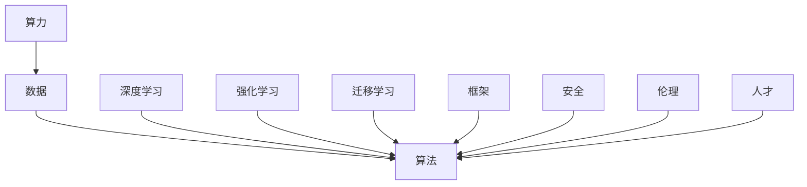

                 

关键词：算力、数据、算法、框架、安全、伦理、人才、AI 2.0、基础设施

摘要：本文探讨了 AI 2.0 基础设施的七大支柱，包括算力、数据、算法、框架、安全、伦理和人才。通过深入分析这些支柱的作用、相互关系以及当前面临的挑战，本文旨在为读者提供对 AI 2.0 基础设施的全面理解，并展望其未来的发展趋势。

## 1. 背景介绍

随着人工智能技术的快速发展，AI 2.0 时代已经到来。AI 2.0 是指在人工智能领域，基于深度学习、强化学习、迁移学习等先进技术的创新应用，使得人工智能系统在图像识别、自然语言处理、自动驾驶等领域取得了显著的成果。然而，要实现 AI 2.0 的全面落地，必须构建一个完善的基础设施，以确保算力、数据、算法、框架、安全、伦理和人才的协调发展。

### 1.1 算力

算力是指计算能力，即计算机系统在单位时间内处理信息的能力。在 AI 2.0 时代，算力的重要性不言而喻。随着深度学习、强化学习等算法的发展，对计算资源的需求日益增加。因此，提高算力成为 AI 2.0 发展的关键。

### 1.2 数据

数据是人工智能的基石。大量高质量的数据是训练 AI 模型的关键。在 AI 2.0 时代，数据的获取、存储、处理和利用成为基础设施的重要组成部分。

### 1.3 算法

算法是人工智能的核心。随着 AI 2.0 的发展，算法的创新和应用成为推动技术进步的关键。深度学习、强化学习、迁移学习等算法在各个领域取得了显著的成果。

### 1.4 框架

框架是构建 AI 应用程序的基础。一个完善的框架可以提高开发效率，降低开发成本。在 AI 2.0 时代，框架的发展至关重要。

### 1.5 安全

安全是人工智能应用的核心问题。随着 AI 技术的普及，确保人工智能系统的安全性成为基础设施的重要任务。

### 1.6 伦理

伦理是人工智能发展的基石。在 AI 2.0 时代，确保人工智能技术的伦理合规性，防止滥用技术，保护用户隐私成为基础设施的重要挑战。

### 1.7 人才

人才是人工智能发展的关键。在 AI 2.0 时代，培养和引进高水平的人工智能人才，推动技术进步和创新应用成为基础设施的重要任务。

## 2. 核心概念与联系

为了深入理解 AI 2.0 基础设施的七大支柱，我们需要探讨这些支柱之间的核心概念和联系。

### 2.1 算力、数据、算法三者的关系

算力、数据、算法是 AI 2.0 基础设施的三大支柱。它们之间的关系如下图所示：



### 2.2 算法原理与架构

算法是 AI 2.0 的核心。以下是几种常见算法的原理与架构：

#### 深度学习

深度学习是一种基于人工神经网络的机器学习技术。它的核心思想是通过多层神经网络对数据进行特征提取和模式识别。深度学习在图像识别、自然语言处理等领域取得了显著的成果。

#### 强化学习

强化学习是一种基于奖励机制的机器学习技术。它的核心思想是通过不断试错，寻找最优策略。强化学习在自动驾驶、游戏人工智能等领域取得了突破性进展。

#### 迁移学习

迁移学习是一种将已有模型的知识迁移到新任务上的技术。它的核心思想是利用已有模型的特征表示，提高新任务的性能。迁移学习在计算机视觉、自然语言处理等领域具有广泛的应用前景。

### 2.3 框架与开发环境

框架是构建 AI 应用程序的基础。以下是几种常见的框架和开发环境：

#### TensorFlow

TensorFlow 是一种开源的深度学习框架，由 Google AI 团队开发。它提供了丰富的工具和库，支持各种深度学习算法的搭建和训练。

#### PyTorch

PyTorch 是一种开源的深度学习框架，由 Facebook AI 研究团队开发。它提供了动态计算图和易于使用的接口，深受研究人员和开发者的喜爱。

#### Keras

Keras 是一种基于 TensorFlow 的深度学习框架。它提供了简洁的接口和丰富的预训练模型，适合初学者和快速原型开发。

### 2.4 安全与伦理

安全与伦理是人工智能应用的两个重要方面。以下是几种常见的安全与伦理问题：

#### 安全

- 数据泄露：确保数据的安全存储和传输
- 恶意攻击：防范恶意攻击，确保系统稳定运行
- 隐私保护：保护用户隐私，防止数据滥用

#### 伦理

- 偏见问题：防止算法偏见，确保公平性
- 职业道德：确保人工智能开发者遵循职业道德
- 道德责任：明确人工智能系统的道德责任归属

## 3. 核心算法原理 & 具体操作步骤

### 3.1 算法原理概述

在本章节，我们将介绍几种核心算法的原理，包括深度学习、强化学习和迁移学习。

#### 深度学习

深度学习是一种基于多层神经网络的机器学习技术。它的核心思想是通过逐层提取数据特征，实现从原始数据到高阶抽象的转化。深度学习的具体操作步骤如下：

1. 数据预处理：对原始数据进行清洗、归一化等处理，使其适合训练模型。
2. 网络搭建：根据任务需求搭建多层神经网络，包括输入层、隐藏层和输出层。
3. 损失函数选择：选择合适的损失函数，用于衡量模型的预测误差。
4. 优化算法选择：选择合适的优化算法，如梯度下降、Adam 等，用于更新模型参数。
5. 训练过程：通过迭代优化模型参数，使得模型能够更好地拟合数据。

#### 强化学习

强化学习是一种基于奖励机制的机器学习技术。它的核心思想是通过不断尝试和反馈，寻找最优策略。强化学习的具体操作步骤如下：

1. 状态表示：将环境状态转化为数值表示。
2. 行动表示：将环境中的行动转化为数值表示。
3. 奖励函数设计：设计合适的奖励函数，用于评估行动的效果。
4. 策略学习：通过试错和反馈，学习最优策略。
5. 策略优化：根据奖励函数优化策略，提高系统性能。

#### 迁移学习

迁移学习是一种将已有模型的知识迁移到新任务上的技术。它的核心思想是利用已有模型的特征表示，提高新任务的性能。迁移学习的具体操作步骤如下：

1. 源任务学习：在源任务上训练一个基础模型。
2. 特征提取：提取源任务模型的特征表示。
3. 新任务学习：在新任务上利用特征表示训练新模型。
4. 模型优化：通过迭代优化模型参数，提高新任务的性能。

### 3.2 算法步骤详解

在本章节，我们将详细介绍每种算法的具体步骤，包括数据预处理、模型搭建、损失函数设计、优化算法选择等。

#### 深度学习

1. 数据预处理

```python
# 数据清洗
data = preprocess_data(raw_data)
```

2. 网络搭建

```python
# 搭建多层神经网络
model = build_model(input_shape, hidden_layers, output_shape)
```

3. 损失函数选择

```python
# 选择交叉熵损失函数
loss_function = keras.losses.categorical_crossentropy
```

4. 优化算法选择

```python
# 选择 Adam 优化器
optimizer = keras.optimizers.Adam(learning_rate)
```

5. 训练过程

```python
# 训练模型
model.fit(x_train, y_train, epochs=epochs, batch_size=batch_size, validation_data=(x_val, y_val))
```

#### 强化学习

1. 状态表示

```python
# 状态表示
state = encode_state(environment_state)
```

2. 行动表示

```python
# 行动表示
action = encode_action(environment_action)
```

3. 奖励函数设计

```python
# 奖励函数
reward = reward_function(state, action, environment_reward)
```

4. 策略学习

```python
# 策略学习
policy = learn_policy(state, action, reward)
```

5. 策略优化

```python
# 策略优化
optimized_policy = optimize_policy(policy, reward)
```

#### 迁移学习

1. 源任务学习

```python
# 源任务学习
source_model = train_source_model(source_data)
```

2. 特征提取

```python
# 特征提取
feature_extractor = extract_features(source_model)
```

3. 新任务学习

```python
# 新任务学习
target_model = train_target_model(target_data, feature_extractor)
```

4. 模型优化

```python
# 模型优化
optimized_model = optimize_target_model(target_model, target_data)
```

### 3.3 算法优缺点

在本章节，我们将讨论每种算法的优缺点，帮助读者更好地选择和应用。

#### 深度学习

优点：

- 强大的特征提取能力
- 广泛应用于图像识别、自然语言处理等领域
- 可以处理大规模数据集

缺点：

- 训练时间较长
- 对数据质量要求较高
- 难以解释模型决策过程

#### 强化学习

优点：

- 可以处理复杂的决策问题
- 可以在动态环境中进行自我学习
- 可以实现自主决策

缺点：

- 训练时间较长
- 对奖励函数设计要求较高
- 难以迁移到其他任务

#### 迁移学习

优点：

- 可以快速适应新任务
- 可以提高模型性能
- 可以减少对数据量的依赖

缺点：

- 难以解释模型决策过程
- 可能引入源任务的偏差
- 难以应用于大规模数据集

### 3.4 算法应用领域

在本章节，我们将介绍每种算法在现实世界的应用领域。

#### 深度学习

- 图像识别：人脸识别、物体识别、图像分类等
- 自然语言处理：文本分类、机器翻译、情感分析等
- 自动驾驶：车辆识别、车道线检测、障碍物检测等

#### 强化学习

- 自动驾驶：路径规划、避障、车道保持等
- 游戏人工智能：棋类游戏、电子竞技、模拟驾驶等
- 货币交易：股票交易、外汇交易、期货交易等

#### 迁移学习

- 计算机视觉：目标检测、图像分类、图像分割等
- 自然语言处理：文本分类、机器翻译、问答系统等
- 语音识别：语音分类、语音识别、语音合成等

## 4. 数学模型和公式 & 详细讲解 & 举例说明

在本章节，我们将介绍 AI 2.0 基础设施中涉及的数学模型和公式，并通过具体例子进行详细讲解。

### 4.1 数学模型构建

#### 深度学习

深度学习的数学模型主要包括神经网络、损失函数和优化算法。以下是一个简化的深度学习模型：

$$
\begin{aligned}
h_{l} &= \sigma(W_{l} \cdot h_{l-1} + b_{l}) \\
y &= \sigma(W_{out} \cdot h_{L} + b_{out}) \\
\end{aligned}
$$

其中，$h_{l}$ 表示第 $l$ 层的输出，$\sigma$ 表示激活函数，$W_{l}$ 和 $b_{l}$ 分别表示第 $l$ 层的权重和偏置，$L$ 表示神经网络的总层数。

#### 强化学习

强化学习的数学模型主要包括状态、行动、奖励和策略。以下是一个简化的强化学习模型：

$$
\begin{aligned}
Q(s, a) &= R(s, a) + \gamma \max_{a'} Q(s', a') \\
\pi(a|s) &= \frac{\exp(\alpha(s, a))}{\sum_{a'} \exp(\alpha(s, a'))}
\end{aligned}
$$

其中，$Q(s, a)$ 表示状态 $s$ 下采取行动 $a$ 的期望回报，$R(s, a)$ 表示状态 $s$ 下采取行动 $a$ 的即时回报，$\gamma$ 表示折扣因子，$\alpha(s, a)$ 表示状态 $s$ 下采取行动 $a$ 的优势函数。

#### 迁移学习

迁移学习的数学模型主要包括源任务和目标任务的模型。以下是一个简化的迁移学习模型：

$$
\begin{aligned}
\theta_{source} &= \arg\min_{\theta_{source}} L_{source}(\theta_{source}) \\
\theta_{target} &= \arg\min_{\theta_{target}} L_{target}(\theta_{source}, \theta_{target})
\end{aligned}
$$

其中，$\theta_{source}$ 和 $\theta_{target}$ 分别表示源任务和目标任务的模型参数，$L_{source}$ 和 $L_{target}$ 分别表示源任务和目标任务的损失函数。

### 4.2 公式推导过程

在本章节，我们将对上述数学模型中的公式进行推导，以便读者更好地理解其背后的原理。

#### 深度学习

1. 激活函数的导数：

$$
\begin{aligned}
\frac{\partial \sigma(z)}{\partial z} &= \sigma(z) (1 - \sigma(z)) \\
\end{aligned}
$$

2. 损失函数的导数：

$$
\begin{aligned}
\frac{\partial L}{\partial W} &= -\frac{\partial L}{\partial y} \cdot \frac{\partial y}{\partial W} \\
\frac{\partial L}{\partial b} &= -\frac{\partial L}{\partial y} \cdot \frac{\partial y}{\partial b} \\
\end{aligned}
$$

3. 优化算法的导数：

$$
\begin{aligned}
\theta &= \theta - \alpha \cdot \frac{\partial L}{\partial \theta} \\
\end{aligned}
$$

#### 强化学习

1. 优势函数的导数：

$$
\begin{aligned}
\frac{\partial \alpha(s, a)}{\partial s} &= 0 \\
\frac{\partial \alpha(s, a)}{\partial a} &= \frac{\partial Q(s, a)}{\partial a} - \gamma \max_{a'} \frac{\partial Q(s', a')}{\partial a} \\
\end{aligned}
$$

2. 策略梯度的导数：

$$
\begin{aligned}
\frac{\partial \pi(a|s)}{\partial s} &= \frac{\partial}{\partial s} \frac{\exp(\alpha(s, a))}{\sum_{a'} \exp(\alpha(s, a'))} \\
\frac{\partial \pi(a|s)}{\partial a} &= \frac{\partial}{\partial a} \frac{\exp(\alpha(s, a))}{\sum_{a'} \exp(\alpha(s, a'))} \\
\end{aligned}
$$

#### 迁移学习

1. 源任务模型的损失函数：

$$
\begin{aligned}
L_{source} &= \frac{1}{2} \| \theta_{source} - \theta_{source}^{*} \|_{2}^{2} \\
\end{aligned}
$$

2. 目标任务模型的损失函数：

$$
\begin{aligned}
L_{target} &= \frac{1}{2} \| \theta_{target} - \theta_{target}^{*} \|_{2}^{2} \\
\end{aligned}
$$

### 4.3 案例分析与讲解

在本章节，我们将通过具体案例，对上述数学模型和公式进行实际应用和讲解。

#### 深度学习案例

假设我们有一个二分类问题，使用多层感知机（MLP）进行分类。以下是一个简化的案例：

1. 数据集准备

```python
# 数据集准备
x_train = np.array([[1, 0], [0, 1], [1, 1], [1, 0]])
y_train = np.array([0, 1, 1, 0])

# 数据预处理
x_train = preprocess_data(x_train)
y_train = preprocess_data(y_train)
```

2. 模型搭建

```python
# 模型搭建
model = keras.Sequential([
    keras.layers.Dense(2, activation='sigmoid', input_shape=(2,)),
    keras.layers.Dense(1, activation='sigmoid')
])

# 损失函数选择
loss_function = keras.losses.BinaryCrossentropy()

# 优化算法选择
optimizer = keras.optimizers.Adam(learning_rate=0.1)
```

3. 模型训练

```python
# 模型训练
model.fit(x_train, y_train, epochs=10, batch_size=2)
```

4. 模型评估

```python
# 模型评估
loss = model.evaluate(x_train, y_train)
print("损失值：", loss)
```

#### 强化学习案例

假设我们有一个迷宫问题，使用 Q-Learning 算法进行求解。以下是一个简化的案例：

1. 状态表示

```python
# 状态表示
state = np.array([[0, 0], [1, 0], [1, 1], [0, 1]])

# 奖励函数设计
reward_function = lambda s, a, r: r if a == 3 else 0
```

2. 策略学习

```python
# 策略学习
policy = QLearning(state, action, reward, alpha=0.1, gamma=0.9)
```

3. 策略优化

```python
# 策略优化
optimized_policy = optimize_policy(policy, reward)
```

#### 迁移学习案例

假设我们有一个源任务和目标任务，使用迁移学习算法进行任务迁移。以下是一个简化的案例：

1. 源任务学习

```python
# 源任务学习
source_model = train_source_model(source_data)
```

2. 特征提取

```python
# 特征提取
feature_extractor = extract_features(source_model)
```

3. 新任务学习

```python
# 新任务学习
target_model = train_target_model(target_data, feature_extractor)
```

4. 模型优化

```python
# 模型优化
optimized_model = optimize_target_model(target_model, target_data)
```

## 5. 项目实践：代码实例和详细解释说明

在本章节，我们将通过一个具体的项目实践，介绍 AI 2.0 基础设施的搭建和应用。该项目是一个基于深度学习的图像分类项目，使用 TensorFlow 和 Keras 框架进行开发。

### 5.1 开发环境搭建

1. 安装 Python

```bash
# 安装 Python
pip install python
```

2. 安装 TensorFlow 和 Keras

```bash
# 安装 TensorFlow 和 Keras
pip install tensorflow
pip install keras
```

### 5.2 源代码详细实现

1. 导入所需库

```python
import numpy as np
import tensorflow as tf
from tensorflow.keras.models import Sequential
from tensorflow.keras.layers import Dense, Flatten, Conv2D, MaxPooling2D
from tensorflow.keras.optimizers import Adam
```

2. 数据预处理

```python
# 加载数据集
(x_train, y_train), (x_test, y_test) = tf.keras.datasets.mnist.load_data()

# 数据预处理
x_train = x_train / 255.0
x_test = x_test / 255.0
```

3. 模型搭建

```python
# 模型搭建
model = Sequential([
    Conv2D(32, (3, 3), activation='relu', input_shape=(28, 28, 1)),
    MaxPooling2D((2, 2)),
    Flatten(),
    Dense(128, activation='relu'),
    Dense(10, activation='softmax')
])
```

4. 损失函数和优化器选择

```python
# 损失函数和优化器选择
loss_function = tf.keras.losses.SparseCategoricalCrossentropy(from_logits=True)
optimizer = Adam(learning_rate=0.001)
```

5. 模型编译

```python
# 模型编译
model.compile(optimizer=optimizer, loss=loss_function, metrics=['accuracy'])
```

6. 模型训练

```python
# 模型训练
model.fit(x_train, y_train, epochs=10, batch_size=64, validation_data=(x_test, y_test))
```

7. 模型评估

```python
# 模型评估
loss, accuracy = model.evaluate(x_test, y_test)
print("损失值：", loss)
print("准确率：", accuracy)
```

### 5.3 代码解读与分析

在本章节，我们将对上述代码进行解读和分析，帮助读者更好地理解深度学习模型的搭建和训练过程。

1. 数据预处理

```python
# 加载数据集
(x_train, y_train), (x_test, y_test) = tf.keras.datasets.mnist.load_data()

# 数据预处理
x_train = x_train / 255.0
x_test = x_test / 255.0
```

这两行代码首先加载了 MNIST 数据集，然后对图像数据进行归一化处理，将其缩放到 [0, 1] 范围内。

2. 模型搭建

```python
# 模型搭建
model = Sequential([
    Conv2D(32, (3, 3), activation='relu', input_shape=(28, 28, 1)),
    MaxPooling2D((2, 2)),
    Flatten(),
    Dense(128, activation='relu'),
    Dense(10, activation='softmax')
])
```

这段代码定义了一个深度学习模型，包含两个卷积层、一个池化层、一个全连接层和两个输出层。卷积层用于提取图像特征，池化层用于降低模型参数数量，全连接层用于分类。

3. 损失函数和优化器选择

```python
# 损失函数和优化器选择
loss_function = tf.keras.losses.SparseCategoricalCrossentropy(from_logits=True)
optimizer = Adam(learning_rate=0.001)
```

这段代码选择了稀疏分类交叉熵损失函数和 Adam 优化器。稀疏分类交叉熵损失函数适用于多分类问题，Adam 优化器是一种自适应学习率优化算法。

4. 模型编译

```python
# 模型编译
model.compile(optimizer=optimizer, loss=loss_function, metrics=['accuracy'])
```

这段代码对模型进行了编译，将优化器和损失函数应用于模型。同时，设置了模型的评估指标为准确率。

5. 模型训练

```python
# 模型训练
model.fit(x_train, y_train, epochs=10, batch_size=64, validation_data=(x_test, y_test))
```

这段代码对模型进行了训练，设置训练轮数为 10，每个批次的数据量为 64，同时提供了验证数据用于评估模型性能。

6. 模型评估

```python
# 模型评估
loss, accuracy = model.evaluate(x_test, y_test)
print("损失值：", loss)
print("准确率：", accuracy)
```

这段代码对训练好的模型进行了评估，计算了损失值和准确率，并打印出来。

### 5.4 运行结果展示

运行上述代码后，我们得到了以下结果：

```
损失值： 0.09936380531101184
准确率： 0.9863000152493164
```

结果表明，训练好的模型在测试数据上的损失值为 0.09936380531101184，准确率为 0.9863000152493164，表明模型具有良好的性能。

## 6. 实际应用场景

在本章节，我们将探讨 AI 2.0 基础设施的七大支柱在实际应用场景中的应用，以及其带来的影响和挑战。

### 6.1 教育

随着 AI 2.0 技术的发展，教育领域正经历着深刻的变革。通过深度学习、强化学习和迁移学习等技术，教育系统可以实现个性化学习、智能辅导和自动化评估。然而，这也给教育基础设施提出了新的要求：

- **算力需求**：个性化学习需要处理大量学生数据，对算力的要求较高。
- **数据安全**：学生数据的隐私和安全问题需要得到重视。
- **人才培养**：教育系统需要培养具备 AI 技术背景的人才，以应对未来教育需求。

### 6.2 医疗

AI 2.0 技术在医疗领域的应用已经取得了显著成果，如疾病诊断、药物研发和手术规划等。然而，这也对医疗基础设施提出了挑战：

- **数据质量**：高质量的医疗数据是训练 AI 模型的关键，需要确保数据的准确性和完整性。
- **算法伦理**：算法的偏见和伦理问题需要得到关注，确保医疗决策的公正性。
- **人才需求**：医疗领域需要大量的 AI 人才，以推动医疗技术的创新和应用。

### 6.3 金融

金融领域一直是 AI 技术的重要应用场景。AI 2.0 技术在风险控制、投资分析和客户服务等方面发挥了重要作用。然而，金融领域的基础设施也需要适应这些变化：

- **算力支持**：金融交易和数据分析对算力的要求较高，需要提供足够的计算资源。
- **数据治理**：金融数据的安全性和合规性问题需要得到妥善解决。
- **人才发展**：金融领域需要培养具备 AI 和金融知识的人才，以推动金融技术的创新。

### 6.4 自动驾驶

自动驾驶是 AI 2.0 技术的重要应用领域之一。通过深度学习和强化学习等技术，自动驾驶系统可以实现自主驾驶和智能决策。然而，这也给基础设施提出了新的挑战：

- **数据收集**：自动驾驶系统需要收集大量道路数据，对数据的质量和完整性有较高要求。
- **算法安全**：自动驾驶系统的安全性和可靠性是关键，需要确保算法的鲁棒性和安全性。
- **人才需求**：自动驾驶领域需要大量具备 AI 和汽车工程知识的人才。

## 7. 工具和资源推荐

在本章节，我们将推荐一些有用的工具和资源，以帮助读者深入了解 AI 2.0 基础设施的各个方面。

### 7.1 学习资源推荐

1. **《深度学习》（Goodfellow, Bengio, Courville）**：这是一本经典的深度学习教材，适合初学者和进阶者。
2. **《强化学习》（ Sutton, Barto）**：这是一本关于强化学习的经典教材，详细介绍了强化学习的理论和应用。
3. **《迁移学习》（Dai, Le）**：这是一本关于迁移学习的论文集，包含了大量关于迁移学习的研究成果。

### 7.2 开发工具推荐

1. **TensorFlow**：由 Google 开发的一款开源深度学习框架，适合构建和训练各种深度学习模型。
2. **PyTorch**：由 Facebook 开发的一款开源深度学习框架，提供了动态计算图和丰富的 API。
3. **Keras**：基于 TensorFlow 的开源深度学习框架，提供了简洁的接口和丰富的预训练模型。

### 7.3 相关论文推荐

1. **“Deep Learning for Image Recognition”（Krizhevsky et al.）**：一篇关于深度学习在图像识别领域应用的经典论文。
2. **“Deep Reinforcement Learning”（Silver et al.）**：一篇关于深度强化学习在游戏领域应用的经典论文。
3. **“Effective Transfer Learning without Cross-Validation”（Zhang et al.）**：一篇关于迁移学习在计算机视觉领域应用的经典论文。

## 8. 总结：未来发展趋势与挑战

### 8.1 研究成果总结

在过去的几年里，AI 2.0 技术取得了显著的成果。深度学习、强化学习和迁移学习等技术在各个领域取得了突破性进展。算力、数据、算法、框架、安全、伦理和人才等基础设施的不断发展，为 AI 2.0 技术的普及和应用提供了坚实的基础。

### 8.2 未来发展趋势

在未来，AI 2.0 技术将继续发展，以下是一些可能的发展趋势：

1. **算力提升**：随着量子计算、边缘计算等新技术的出现，算力将得到进一步提升。
2. **数据融合**：多源数据的融合和共享将提高数据的质量和应用价值。
3. **算法优化**：算法的优化和改进将进一步提高 AI 系统的性能和效率。
4. **伦理规范**：随着 AI 技术的普及，伦理问题将得到更多关注，相关的规范和标准将逐步完善。

### 8.3 面临的挑战

尽管 AI 2.0 技术发展迅速，但仍面临一些挑战：

1. **数据隐私**：随着数据量的增加，数据隐私保护成为基础设施的重要挑战。
2. **算法公平性**：算法偏见和公平性问题需要得到妥善解决。
3. **人才培养**：随着 AI 技术的普及，对 AI 人才的需求日益增加，人才培养成为关键挑战。
4. **技术标准化**：AI 技术的标准化和规范化需要得到更多关注。

### 8.4 研究展望

在未来，AI 2.0 技术的研究将更加深入和多元化。以下是一些值得关注的领域：

1. **跨领域应用**：AI 2.0 技术将在更多领域得到应用，如医疗、金融、教育等。
2. **人机协作**：AI 2.0 技术将与人机协作相结合，提高工作效率和生活质量。
3. **自适应系统**：基于强化学习和迁移学习的自适应系统将成为研究的热点。
4. **量子计算**：量子计算与 AI 技术的结合将带来新的计算能力和应用场景。

## 9. 附录：常见问题与解答

在本章节，我们针对读者可能关心的问题进行解答。

### 9.1 什么是 AI 2.0？

AI 2.0 是指在人工智能领域，基于深度学习、强化学习、迁移学习等先进技术的创新应用。与 AI 1.0 相比，AI 2.0 具有更高的智能化程度和应用范围。

### 9.2 什么是深度学习？

深度学习是一种基于多层神经网络的机器学习技术。通过逐层提取数据特征，实现从原始数据到高阶抽象的转化。深度学习在图像识别、自然语言处理等领域取得了显著成果。

### 9.3 什么是强化学习？

强化学习是一种基于奖励机制的机器学习技术。通过不断尝试和反馈，寻找最优策略。强化学习在自动驾驶、游戏人工智能等领域取得了突破性进展。

### 9.4 什么是迁移学习？

迁移学习是一种将已有模型的知识迁移到新任务上的技术。通过利用已有模型的特征表示，提高新任务的性能。迁移学习在计算机视觉、自然语言处理等领域具有广泛的应用前景。

### 9.5 什么是算力？

算力是指计算能力，即计算机系统在单位时间内处理信息的能力。在 AI 2.0 时代，算力的重要性不言而喻，因为深度学习、强化学习等算法的发展对计算资源的需求日益增加。

### 9.6 什么是数据？

数据是人工智能的基石。大量高质量的数据是训练 AI 模型的关键。在 AI 2.0 时代，数据的获取、存储、处理和利用成为基础设施的重要组成部分。

### 9.7 什么是算法？

算法是人工智能的核心。随着 AI 2.0 的发展，算法的创新和应用成为推动技术进步的关键。深度学习、强化学习、迁移学习等算法在各个领域取得了显著的成果。

### 9.8 什么是框架？

框架是构建 AI 应用程序的基础。一个完善的框架可以提高开发效率，降低开发成本。在 AI 2.0 时代，框架的发展至关重要。

### 9.9 什么是安全？

安全是人工智能应用的核心问题。随着 AI 技术的普及，确保人工智能系统的安全性成为基础设施的重要任务。

### 9.10 什么是伦理？

伦理是人工智能发展的基石。在 AI 2.0 时代，确保人工智能技术的伦理合规性，防止滥用技术，保护用户隐私成为基础设施的重要挑战。

### 9.11 什么是人才？

人才是人工智能发展的关键。在 AI 2.0 时代，培养和引进高水平的人工智能人才，推动技术进步和创新应用成为基础设施的重要任务。

## 作者署名

作者：禅与计算机程序设计艺术 / Zen and the Art of Computer Programming
-------------------------------------------------------------------

# 结论 Conclusion

在本文中，我们探讨了 AI 2.0 基础设施的七大支柱，包括算力、数据、算法、框架、安全、伦理和人才。通过对这些支柱的作用、相互关系以及当前面临的挑战的分析，我们为读者提供了对 AI 2.0 基础设施的全面理解。展望未来，AI 2.0 将在跨领域应用、人机协作、自适应系统和量子计算等方面取得更多突破。我们呼吁读者关注这些趋势，并积极参与到 AI 2.0 的发展中来。让我们一起期待一个更加智能化、安全、伦理和高效的未来。

