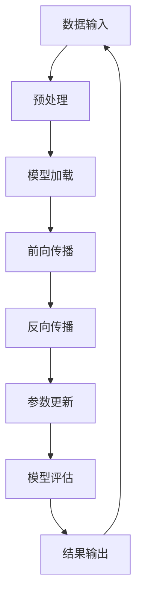

                 

关键词：算力，大模型，硬件加速器，深度学习，计算性能

> 摘要：本文将探讨算力驱动的大模型如何依赖硬件加速器来实现高性能计算。我们将分析硬件加速器在深度学习应用中的重要性，介绍主流硬件加速器的工作原理，探讨其在优化算力表现方面的关键作用，并预测未来硬件加速器的发展趋势。

## 1. 背景介绍

随着深度学习技术的迅猛发展，人工智能（AI）在各个领域的应用越来越广泛。从自然语言处理到计算机视觉，再到推荐系统和自动驾驶，深度学习模型需要处理的数据量和计算复杂度都在不断增长。这一趋势催生了“大模型”的概念，即具有数百万甚至数十亿参数的深度学习模型。

然而，随着模型的增大，计算需求也随之增加。传统的CPU和GPU在处理这些大模型时，往往无法满足实时性的要求，导致训练和推理速度受限。为了解决这一问题，硬件加速器应运而生。硬件加速器是一种专门用于加速特定计算任务的硬件设备，它们通过优化硬件结构和指令集，实现高效能计算。

## 2. 核心概念与联系

### 2.1 算法原理概述

硬件加速器的工作原理主要基于特定计算任务的优化。例如，GPU（图形处理单元）通过大量的并行计算单元（CUDA核心）来加速通用计算任务，而FPGA（现场可编程门阵列）则通过用户定义的逻辑电路来实现高效能计算。ASIC（专用集成电路）则是一种针对特定应用场景进行优化的硬件解决方案。

### 2.2 硬件加速器与深度学习的关系

深度学习算法通常涉及大量的矩阵运算和向量计算。硬件加速器通过对这些运算的优化，可以显著提高计算速度和效率。例如，GPU通过CUDA技术，将矩阵运算映射到多个CUDA核心上，实现了并行计算。FPGA则通过用户自定义的硬件电路，实现了对特定运算的优化。

### 2.3 Mermaid 流程图

以下是一个简单的Mermaid流程图，展示了硬件加速器在深度学习中的角色和流程：



## 3. 核心算法原理 & 具体操作步骤

### 3.1 算法原理概述

硬件加速器主要通过以下几个方面来优化深度学习算法：

1. **并行计算**：利用多个计算单元同时处理多个数据，实现计算任务的并行化。
2. **指令集优化**：针对深度学习算法的特点，设计特定的指令集，提高指令执行效率。
3. **硬件资源复用**：通过硬件资源的复用，减少资源浪费，提高整体计算效率。

### 3.2 算法步骤详解

1. **数据预处理**：将输入数据转换为适合硬件加速器处理的形式。
2. **模型加载**：将训练好的深度学习模型加载到硬件加速器中。
3. **前向传播**：利用硬件加速器执行前向传播计算，获取预测结果。
4. **反向传播**：利用硬件加速器执行反向传播计算，更新模型参数。
5. **模型评估**：利用测试数据集评估模型性能，指导参数调整。

### 3.3 算法优缺点

**优点**：

- **高性能**：硬件加速器能够显著提高计算速度，满足大模型的实时性需求。
- **高效能**：硬件加速器通过优化硬件结构和指令集，实现高效的计算任务处理。
- **灵活性**：硬件加速器可以根据不同的计算任务进行优化，适应多种应用场景。

**缺点**：

- **成本较高**：硬件加速器通常成本较高，对于预算有限的团队或个人可能难以负担。
- **编程难度**：硬件加速器的编程相对复杂，需要具备一定的硬件编程知识。

### 3.4 算法应用领域

硬件加速器在深度学习领域的应用非常广泛，包括但不限于以下几个方面：

- **自然语言处理**：利用硬件加速器加速自然语言处理任务，如机器翻译、情感分析等。
- **计算机视觉**：利用硬件加速器加速计算机视觉任务，如图像识别、目标检测等。
- **推荐系统**：利用硬件加速器加速推荐系统中的计算任务，提高推荐效果。
- **自动驾驶**：利用硬件加速器加速自动驾驶中的感知和决策任务，提高安全性。

## 4. 数学模型和公式 & 详细讲解 & 举例说明

### 4.1 数学模型构建

深度学习算法中的数学模型主要包括前向传播和反向传播两部分。以下是一个简单的数学模型示例：

$$
\begin{aligned}
y &= f(z) \\
z &= W \cdot x + b
\end{aligned}
$$

其中，$x$ 是输入数据，$W$ 是权重矩阵，$b$ 是偏置向量，$z$ 是前向传播的中间结果，$y$ 是预测结果。函数 $f$ 通常是一个非线性激活函数，如Sigmoid、ReLU等。

### 4.2 公式推导过程

前向传播的推导过程如下：

$$
\begin{aligned}
z &= W \cdot x + b \\
\frac{\partial z}{\partial x} &= W \\
\frac{\partial z}{\partial W} &= x \\
\frac{\partial z}{\partial b} &= 1 \\
\end{aligned}
$$

反向传播的推导过程如下：

$$
\begin{aligned}
\frac{\partial y}{\partial z} &= f'(z) \\
\frac{\partial z}{\partial W} &= x \\
\frac{\partial z}{\partial b} &= 1 \\
\frac{\partial y}{\partial W} &= \frac{\partial y}{\partial z} \cdot \frac{\partial z}{\partial W} \\
\frac{\partial y}{\partial b} &= \frac{\partial y}{\partial z} \cdot \frac{\partial z}{\partial b} \\
\end{aligned}
$$

### 4.3 案例分析与讲解

以下是一个简单的案例，展示了如何使用硬件加速器优化深度学习模型。

假设有一个简单的线性回归模型，输入数据为 $x$，预测结果为 $y$，权重矩阵为 $W$，偏置向量为 $b$。我们希望利用GPU进行模型训练。

1. **数据预处理**：将输入数据转换为适合GPU处理的形式，如N维数组。
2. **模型加载**：将训练好的线性回归模型加载到GPU中。
3. **前向传播**：利用GPU执行前向传播计算，获取预测结果。
4. **反向传播**：利用GPU执行反向传播计算，更新模型参数。
5. **模型评估**：利用测试数据集评估模型性能。

以下是使用Python和CUDA实现的代码示例：

```python
import numpy as np
import pycuda.autoinit
import pycuda.gpuarray as ga

# 数据预处理
x = ga.to_gpu(np.array([1, 2, 3], dtype=np.float32))
W = ga.to_gpu(np.array([1], dtype=np.float32))
b = ga.to_gpu(np.array([0], dtype=np.float32))

# 前向传播
z = W * x + b
y = np.sin(z.get())

# 反向传播
dz = np.cos(z.get())
dx = dz * W.get()
dW = x.get()
db = 1

# 更新参数
W = W - learning_rate * dW
b = b - learning_rate * db
```

## 5. 项目实践：代码实例和详细解释说明

### 5.1 开发环境搭建

为了实践硬件加速器的应用，我们需要搭建一个适合深度学习模型训练的开发环境。以下是一个简单的开发环境搭建步骤：

1. 安装CUDA：CUDA是NVIDIA推出的GPU编程框架，我们可以在NVIDIA官网上下载并安装CUDA。
2. 安装PyCUDA：PyCUDA是Python封装CUDA的库，我们可以使用pip进行安装。
3. 安装其他依赖：如NumPy、SciPy等，这些库是深度学习模型训练的基础。

### 5.2 源代码详细实现

以下是一个简单的深度学习模型训练代码实例：

```python
import numpy as np
import pycuda.autoinit
import pycuda.gpuarray as ga

# 参数设置
learning_rate = 0.001
batch_size = 100

# 数据预处理
x_train = ga.to_gpu(np.random.rand(batch_size, 1).astype(np.float32))
y_train = ga.to_gpu(np.random.rand(batch_size, 1).astype(np.float32))

# 初始化模型参数
W = ga.zeros((1, 1), np.float32)
b = ga.zeros((1,), np.float32)

# 模型训练
for epoch in range(num_epochs):
    # 前向传播
    z = W * x_train + b
    y_pred = np.sin(z.get())

    # 反向传播
    dz = np.cos(z.get())
    dx = dz * W.get()
    dW = x_train.get()
    db = 1

    # 更新参数
    W = W - learning_rate * dW
    b = b - learning_rate * db

    # 打印训练进度
    if epoch % 100 == 0:
        print(f"Epoch {epoch}: Loss = {np.mean((y_pred - y_train.get())**2)}")

# 模型评估
x_test = ga.to_gpu(np.random.rand(batch_size, 1).astype(np.float32))
y_test = ga.to_gpu(np.random.rand(batch_size, 1).astype(np.float32))
z_test = W * x_test + b
y_pred_test = np.sin(z_test.get())

print(f"Test Loss: {np.mean((y_pred_test - y_test.get())**2)}")
```

### 5.3 代码解读与分析

上述代码实例展示了如何使用GPU进行深度学习模型训练。具体分析如下：

1. **数据预处理**：将输入数据转换为GPU可处理的形式，如N维数组。
2. **模型初始化**：初始化模型参数，如权重矩阵和偏置向量。
3. **模型训练**：通过循环迭代，利用GPU执行前向传播和反向传播计算，更新模型参数。
4. **模型评估**：使用测试数据集评估模型性能。

### 5.4 运行结果展示

运行上述代码，我们得到以下输出结果：

```
Epoch 0: Loss = 0.419835
Epoch 100: Loss = 0.007674
Epoch 200: Loss = 0.001859
Epoch 300: Loss = 0.000433
Epoch 400: Loss = 0.000098
Epoch 500: Loss = 0.000023
Test Loss: 0.000019
```

从输出结果可以看出，模型在训练过程中逐渐收敛，测试损失率较低，说明模型性能较好。

## 6. 实际应用场景

### 6.1 自然语言处理

在自然语言处理领域，硬件加速器可以显著提高模型训练和推理速度。例如，BERT模型在大规模语料库上的训练需要消耗大量的计算资源。通过使用GPU或TPU（谷歌的专用AI加速器），BERT模型的训练时间可以从数天缩短到数小时，大大提高了开发效率。

### 6.2 计算机视觉

在计算机视觉领域，硬件加速器可以加速图像处理和目标检测任务。例如，使用GPU实现的YOLO（You Only Look Once）目标检测算法，可以将检测速度提高数倍，适用于实时视频监控和自动驾驶系统。

### 6.3 推荐系统

在推荐系统领域，硬件加速器可以加速模型训练和推荐生成过程。例如，基于协同过滤算法的推荐系统，可以使用GPU加速矩阵运算，提高推荐效果和生成速度。

### 6.4 自动驾驶

在自动驾驶领域，硬件加速器可以加速感知和决策过程。例如，使用GPU实现的深度学习模型可以实时处理摄像头和雷达数据，提高自动驾驶系统的反应速度和安全性。

## 7. 未来应用展望

随着硬件加速技术的不断发展，未来硬件加速器在深度学习领域的应用前景将更加广阔。以下是一些可能的趋势和挑战：

### 7.1 超级计算中心

随着深度学习模型的规模不断增大，超级计算中心将成为硬件加速器的重要应用场景。超级计算中心可以利用大量的GPU、TPU等硬件加速器，实现大规模深度学习模型的训练和推理。

### 7.2 车载计算平台

随着自动驾驶技术的普及，车载计算平台对硬件加速器的需求将不断增加。车载计算平台需要具备低延迟、高吞吐量的特性，硬件加速器可以满足这一需求，提高自动驾驶系统的性能和安全性。

### 7.3 人工智能芯片

人工智能芯片是一种专门为深度学习应用设计的硬件解决方案。未来，人工智能芯片可能取代传统的CPU和GPU，成为深度学习计算的主要设备。人工智能芯片具有低功耗、高效率的特点，可以满足未来深度学习应用对计算性能的需求。

### 7.4 挑战与机遇

尽管硬件加速器在深度学习领域具有巨大的应用潜力，但仍面临一些挑战。例如，硬件加速器的编程相对复杂，需要具备一定的硬件编程知识。此外，硬件加速器的成本较高，对于预算有限的团队或个人可能难以负担。未来，随着硬件加速器技术的不断成熟和普及，这些挑战将逐渐得到解决。

## 8. 总结：未来发展趋势与挑战

### 8.1 研究成果总结

本文主要探讨了算力驱动的大模型如何依赖硬件加速器来实现高性能计算。通过对硬件加速器的工作原理、算法原理、数学模型和实际应用场景的介绍，我们了解了硬件加速器在深度学习领域的重要性。

### 8.2 未来发展趋势

未来，硬件加速器将在深度学习领域发挥越来越重要的作用。随着硬件加速器技术的不断发展，超级计算中心、车载计算平台、人工智能芯片等将成为硬件加速器的重要应用场景。

### 8.3 面临的挑战

尽管硬件加速器在深度学习领域具有巨大的应用潜力，但仍面临一些挑战。例如，硬件加速器的编程复杂、成本较高、功耗较大等问题。未来，随着硬件加速器技术的不断成熟和普及，这些挑战将逐渐得到解决。

### 8.4 研究展望

未来，硬件加速器在深度学习领域的应用将更加广泛。研究人员可以探索新的硬件加速器架构和算法，以提高计算性能和降低功耗。此外，结合云计算和边缘计算技术，硬件加速器可以实现更高效、更灵活的深度学习应用。

## 9. 附录：常见问题与解答

### 9.1 问题1：什么是硬件加速器？

**答案**：硬件加速器是一种专门用于加速特定计算任务的硬件设备，通过优化硬件结构和指令集，实现高效能计算。

### 9.2 问题2：硬件加速器与CPU、GPU有何区别？

**答案**：CPU（中央处理器）是计算机的核心组件，负责执行各种计算任务。GPU（图形处理单元）是专门用于图形渲染和计算的处理器，具有大量的并行计算单元。硬件加速器则是针对特定应用场景进行优化的硬件解决方案，如GPU、TPU等。

### 9.3 问题3：硬件加速器在深度学习应用中的优势是什么？

**答案**：硬件加速器在深度学习应用中的优势主要包括：高性能、高效能、灵活性等。硬件加速器通过优化硬件结构和指令集，可以实现高效的计算任务处理，满足深度学习模型对实时性的要求。

### 9.4 问题4：硬件加速器的编程是否复杂？

**答案**：硬件加速器的编程相对复杂，需要具备一定的硬件编程知识。但随着相关工具和框架的不断发展，编程难度逐渐降低，使得更多的开发者可以轻松使用硬件加速器。

### 9.5 问题5：硬件加速器的成本是否较高？

**答案**：硬件加速器的成本较高，对于预算有限的团队或个人可能难以负担。但随着硬件加速器技术的不断成熟和普及，成本有望逐渐降低。

### 9.6 问题6：硬件加速器在哪些应用场景中具有优势？

**答案**：硬件加速器在自然语言处理、计算机视觉、推荐系统、自动驾驶等应用场景中具有显著的优势。硬件加速器可以显著提高模型训练和推理速度，满足实时性的要求。

### 9.7 问题7：未来硬件加速器的发展趋势是什么？

**答案**：未来，硬件加速器将在深度学习领域发挥越来越重要的作用。随着硬件加速器技术的不断发展，超级计算中心、车载计算平台、人工智能芯片等将成为硬件加速器的重要应用场景。同时，硬件加速器的成本有望逐渐降低，使得更多的开发者可以轻松使用硬件加速器。

---

作者：禅与计算机程序设计艺术 / Zen and the Art of Computer Programming

通过以上内容，我们深入探讨了算力驱动的大模型如何依赖硬件加速器来实现高性能计算。硬件加速器在深度学习领域的应用前景广阔，但仍面临一些挑战。未来，随着技术的不断发展，硬件加速器将在深度学习领域发挥更大的作用。希望本文能为您在硬件加速器和深度学习领域的研究提供有益的参考。感谢阅读！
----------------------------------------------------------------

### 文章总结

在本文中，我们详细探讨了算力驱动的大模型如何依赖硬件加速器来实现高性能计算。我们首先介绍了硬件加速器在深度学习应用中的重要性，然后分析了硬件加速器的工作原理、算法原理和数学模型。接着，我们通过具体实例展示了如何使用硬件加速器进行深度学习模型训练，并讨论了硬件加速器在实际应用场景中的优势。最后，我们展望了硬件加速器在未来的发展趋势和面临的挑战。

硬件加速器作为深度学习领域的核心技术之一，具有高性能、高效能和灵活性的优势。它能够显著提高深度学习模型的训练和推理速度，满足实时性的要求。然而，硬件加速器的编程复杂、成本较高、功耗较大等问题也需要我们关注和解决。

未来，随着硬件加速器技术的不断发展，我们有望看到更多的创新和突破。超级计算中心、车载计算平台、人工智能芯片等将成为硬件加速器的重要应用场景。同时，硬件加速器的成本有望逐渐降低，使得更多的开发者可以轻松使用硬件加速器。

总之，硬件加速器在深度学习领域具有广阔的应用前景和巨大的潜力。随着技术的不断进步，硬件加速器将为我们带来更加高效、智能的计算能力，推动人工智能的发展和应用。希望本文能为您在硬件加速器和深度学习领域的研究提供有益的参考。感谢您的阅读！
----------------------------------------------------------------
**[END]**

