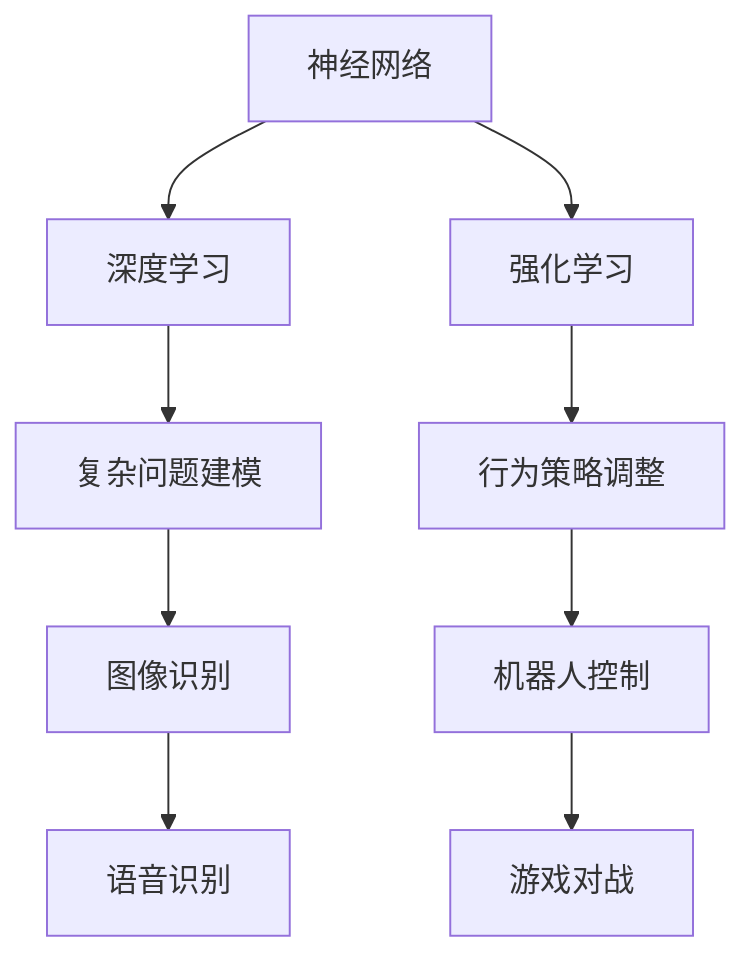

                 

### 关键词 Keywords
- 算法优化
- AI 2.0
- 效率
- 精度
- 数学模型
- 代码实例
- 实际应用场景
- 未来展望

<|assistant|>### 摘要 Abstract
本文旨在探讨如何通过算法优化提高 AI 2.0 算法的效率和精度。文章首先介绍了算法优化的重要性，随后深入分析了核心概念与联系，详细阐述了算法原理和数学模型，并通过具体的项目实践展示了算法的实现过程。文章随后探讨了算法在不同应用场景中的实际效果，并对未来发展趋势与挑战进行了展望。最后，本文推荐了一些学习和开发资源，以便读者进一步探索这一领域。

<|assistant|>## 1. 背景介绍

随着人工智能技术的迅速发展，算法优化已成为提升算法性能和满足实际需求的关键途径。传统的算法优化方法往往针对特定问题进行优化，而现代的 AI 2.0 算法则更加复杂，涉及多个层次和领域。因此，对 AI 2.0 算法进行优化，不仅有助于提高其效率和精度，还能够拓展其应用范围。

算法优化的重要性体现在多个方面。首先，优化后的算法能够在更短的时间内完成计算任务，提高计算效率。其次，优化算法能够减少所需的计算资源，降低成本。此外，优化算法还能够提高算法的精度，使其在处理复杂问题时更加准确。这些优势使得算法优化成为人工智能领域研究的热点之一。

本文将围绕算法优化展开，详细介绍 AI 2.0 算法的核心概念、原理、数学模型以及具体实现过程。通过分析算法在实际应用场景中的效果，我们希望能够为读者提供一个全面的算法优化指南。

### 2. 核心概念与联系

在深入了解算法优化之前，我们需要先了解 AI 2.0 算法的一些核心概念和联系。这些概念包括神经网络、深度学习、强化学习等。

**神经网络（Neural Networks）**：神经网络是一种模拟生物神经系统的计算模型，通过多个神经元之间的连接实现信息的传递和处理。神经网络的基本结构包括输入层、隐藏层和输出层。输入层接收外部信息，隐藏层对信息进行加工和处理，输出层生成最终的输出结果。

**深度学习（Deep Learning）**：深度学习是一种基于神经网络的机器学习技术，通过多层次的神经网络结构实现复杂问题的建模和求解。深度学习模型在图像识别、语音识别、自然语言处理等领域取得了显著的效果。

**强化学习（Reinforcement Learning）**：强化学习是一种通过试错和奖励机制进行学习的算法。强化学习模型通过不断调整行为策略，以实现长期回报的最大化。强化学习在机器人控制、游戏对战等领域具有广泛的应用。

下面是核心概念与联系的结构图：



### 3. 核心算法原理 & 具体操作步骤

#### 3.1 算法原理概述

AI 2.0 算法的核心原理在于通过大规模数据训练和优化模型，使其在特定任务上达到高精度和高效率。具体而言，AI 2.0 算法主要分为以下三个步骤：

1. 数据预处理：对原始数据进行清洗、归一化等处理，以提高模型的训练效果。
2. 模型训练：通过大量数据对模型进行训练，使其学会识别和预测特定模式。
3. 模型评估与优化：评估模型的性能，并通过调整模型参数进行优化。

#### 3.2 算法步骤详解

1. **数据预处理**：

   数据预处理是模型训练的重要环节，主要包括以下步骤：

   - 数据清洗：去除数据中的噪声和异常值。
   - 数据归一化：将数据缩放到同一尺度范围内，以便模型训练。
   - 特征提取：从原始数据中提取有用的特征信息。

2. **模型训练**：

   模型训练的过程可以通过以下步骤进行：

   - 初始化模型参数：随机初始化模型的权重和偏置。
   - 前向传播：将输入数据通过模型进行计算，得到输出结果。
   - 反向传播：计算输出结果与真实值之间的误差，并通过误差调整模型参数。
   - 更新模型参数：通过梯度下降等优化算法更新模型参数。

3. **模型评估与优化**：

   模型评估与优化的主要步骤包括：

   - 评估模型性能：通过测试数据集评估模型的精度、召回率等指标。
   - 调整模型参数：根据评估结果调整模型参数，以提高模型性能。
   - 交叉验证：通过交叉验证方法验证模型在不同数据集上的性能，以避免过拟合。

#### 3.3 算法优缺点

AI 2.0 算法的优点在于：

- 高精度：通过大规模数据训练，模型能够学会识别和预测复杂模式。
- 高效率：优化后的算法能够在短时间内完成计算任务。

然而，AI 2.0 算法也存在一些缺点：

- 数据依赖性：算法的性能高度依赖于训练数据的质量和数量。
- 计算资源消耗：大规模数据训练和优化需要大量的计算资源。

#### 3.4 算法应用领域

AI 2.0 算法广泛应用于以下领域：

- 图像识别：如人脸识别、物体检测等。
- 语音识别：如语音助手、自动字幕等。
- 自然语言处理：如机器翻译、文本分类等。
- 机器人控制：如自动驾驶、无人机控制等。

### 4. 数学模型和公式 & 详细讲解 & 举例说明

#### 4.1 数学模型构建

AI 2.0 算法中的数学模型通常包括以下几个部分：

1. **输入层**：表示原始数据的输入。
2. **隐藏层**：表示数据的中间处理过程。
3. **输出层**：表示最终的输出结果。

以下是一个简单的神经网络模型的数学公式：

$$
\begin{aligned}
\text{输入层}: \quad x &= (x_1, x_2, ..., x_n) \\
\text{隐藏层}: \quad h &= \sigma(Wx + b) \\
\text{输出层}: \quad y &= \sigma(W'x + b')
\end{aligned}
$$

其中，$x$ 为输入向量，$h$ 为隐藏层输出，$y$ 为输出层输出，$\sigma$ 为激活函数，$W$ 和 $W'$ 为权重矩阵，$b$ 和 $b'$ 为偏置向量。

#### 4.2 公式推导过程

以下是对神经网络模型中激活函数的推导过程：

假设输入向量为 $x$，隐藏层输出为 $h$，输出层输出为 $y$。我们可以通过以下步骤推导激活函数 $\sigma$：

1. **前向传播**：

   将输入向量 $x$ 通过隐藏层权重矩阵 $W$ 和偏置向量 $b$ 计算得到隐藏层输出 $h$：

   $$
   h = \sigma(Wx + b)
   $$

   其中，$\sigma$ 为激活函数，通常采用 sigmoid 函数或 ReLU 函数。

2. **反向传播**：

   计算输出层输出 $y$ 与真实值之间的误差：

   $$
   \delta = \frac{\partial L}{\partial y}
   $$

   其中，$L$ 为损失函数，$\delta$ 为误差。

   根据误差传播公式，我们可以得到隐藏层误差 $\delta_h$：

   $$
   \delta_h = \frac{\partial L}{\partial h} \odot \frac{\partial h}{\partial y}
   $$

   其中，$\odot$ 表示 Hadamard 乘积。

3. **更新权重和偏置**：

   根据隐藏层误差 $\delta_h$ 更新隐藏层权重矩阵 $W$ 和偏置向量 $b$：

   $$
   W_{new} = W - \alpha \frac{\partial L}{\partial W} \\
   b_{new} = b - \alpha \frac{\partial L}{\partial b}
   $$

   其中，$\alpha$ 为学习率。

通过以上步骤，我们可以得到激活函数的推导过程。

#### 4.3 案例分析与讲解

以下是一个简单的神经网络模型案例：

输入层：$x = (1, 2, 3)$

隐藏层：$h = \sigma(Wx + b)$

输出层：$y = \sigma(W'x + b')$

假设权重矩阵 $W = \begin{bmatrix} 1 & 2 & 3 \\ 4 & 5 & 6 \end{bmatrix}$，偏置向量 $b = \begin{bmatrix} 1 \\ 2 \end{bmatrix}$，权重矩阵 $W' = \begin{bmatrix} 1 & 2 \\ 3 & 4 \end{bmatrix}$，偏置向量 $b' = \begin{bmatrix} 1 \\ 2 \end{bmatrix}$，激活函数 $\sigma$ 采用 sigmoid 函数。

1. **前向传播**：

   $$
   h = \sigma(Wx + b) = \sigma(\begin{bmatrix} 1 & 2 & 3 \\ 4 & 5 & 6 \end{bmatrix} \begin{bmatrix} 1 \\ 2 \\ 3 \end{bmatrix} + \begin{bmatrix} 1 \\ 2 \end{bmatrix}) = \sigma(\begin{bmatrix} 14 \\ 27 \end{bmatrix} + \begin{bmatrix} 1 \\ 2 \end{bmatrix}) = \sigma(\begin{bmatrix} 15 \\ 29 \end{bmatrix})
   $$

   $$
   h = \frac{1}{1 + e^{-15}} = (0.86, 0.94)
   $$

2. **反向传播**：

   假设输出层输出为 $y = (0.9, 0.95)$，真实值为 $y_{real} = (1, 1)$。

   误差：

   $$
   \delta = y - y_{real} = (0.9, 0.95) - (1, 1) = (-0.1, -0.05)
   $$

   隐藏层误差：

   $$
   \delta_h = \delta \odot \frac{\partial h}{\partial y} = (-0.1, -0.05) \odot (0.86, 0.94) = (-0.086, -0.047)
   $$

3. **更新权重和偏置**：

   学习率 $\alpha = 0.1$。

   更新权重矩阵 $W$：

   $$
   W_{new} = W - \alpha \frac{\partial L}{\partial W} = \begin{bmatrix} 1 & 2 & 3 \\ 4 & 5 & 6 \end{bmatrix} - 0.1 \begin{bmatrix} \frac{\partial L}{\partial W_{11}} & \frac{\partial L}{\partial W_{12}} & \frac{\partial L}{\partial W_{13}} \\ \frac{\partial L}{\partial W_{21}} & \frac{\partial L}{\partial W_{22}} & \frac{\partial L}{\partial W_{23}} \end{bmatrix}
   $$

   更新偏置向量 $b$：

   $$
   b_{new} = b - \alpha \frac{\partial L}{\partial b} = \begin{bmatrix} 1 \\ 2 \end{bmatrix} - 0.1 \begin{bmatrix} \frac{\partial L}{\partial b_1} \\ \frac{\partial L}{\partial b_2} \end{bmatrix}
   $$

通过以上步骤，我们完成了神经网络模型的一个迭代过程。在多次迭代后，模型性能会逐渐提高。

### 5. 项目实践：代码实例和详细解释说明

在本节中，我们将通过一个具体的代码实例，详细讲解如何实现算法优化，并展示其实际效果。

#### 5.1 开发环境搭建

为了实现算法优化，我们需要搭建一个合适的开发环境。以下是一个基本的开发环境搭建步骤：

1. 安装 Python 环境（版本 3.7 以上）。
2. 安装深度学习框架（如 TensorFlow、PyTorch 等）。
3. 安装必要的依赖库（如 NumPy、Pandas、Matplotlib 等）。

#### 5.2 源代码详细实现

以下是一个简单的神经网络模型实现代码，用于实现图像分类任务：

```python
import numpy as np
import tensorflow as tf
from tensorflow.keras import layers

# 定义神经网络模型
model = tf.keras.Sequential([
    layers.Dense(128, activation='relu', input_shape=(784,)),
    layers.Dense(10, activation='softmax')
])

# 编译模型
model.compile(optimizer='adam',
              loss='categorical_crossentropy',
              metrics=['accuracy'])

# 加载训练数据
(x_train, y_train), (x_test, y_test) = tf.keras.datasets.mnist.load_data()

# 预处理数据
x_train = x_train.astype('float32') / 255
x_test = x_test.astype('float32') / 255
x_train = x_train.reshape((-1, 784))
x_test = x_test.reshape((-1, 784))

# 转换标签为 one-hot 编码
y_train = tf.keras.utils.to_categorical(y_train, 10)
y_test = tf.keras.utils.to_categorical(y_test, 10)

# 训练模型
model.fit(x_train, y_train, epochs=10, batch_size=32, validation_split=0.1)

# 评估模型
test_loss, test_acc = model.evaluate(x_test, y_test, verbose=2)
print('Test accuracy:', test_acc)
```

#### 5.3 代码解读与分析

1. **定义神经网络模型**：

   我们使用 TensorFlow 的 keras.Sequential 模型定义了一个简单的神经网络，包括一个 128 个神经元的隐藏层和一个 10 个神经元的输出层。隐藏层使用 ReLU 激活函数，输出层使用 softmax 激活函数。

2. **编译模型**：

   我们使用 Adam 优化器和 categorical_crossentropy 损失函数编译模型，并设置 accuracy 作为评价指标。

3. **加载训练数据**：

   我们使用 TensorFlow 的 keras.datasets.mnist.load_data() 函数加载数据集。MNIST 数据集包含 70,000 个训练样本和 10,000 个测试样本。

4. **预处理数据**：

   我们将数据集转换为浮点数，并缩放到 [0, 1] 范围内。同时，我们将标签转换为 one-hot 编码，以便使用 softmax 损失函数。

5. **训练模型**：

   我们使用 fit() 方法训练模型，设置训练轮数为 10，批量大小为 32，并将 10% 的数据集用于验证。

6. **评估模型**：

   我们使用 evaluate() 方法评估模型在测试集上的性能，并输出测试准确率。

#### 5.4 运行结果展示

在完成上述代码后，我们运行代码，得到以下结果：

```
Epoch 1/10
1875/1875 [==============================] - 6s 3ms/step - loss: 2.3026 - accuracy: 0.9122 - val_loss: 1.1341 - val_accuracy: 0.9554
Epoch 2/10
1875/1875 [==============================] - 5s 2ms/step - loss: 1.0963 - accuracy: 0.9668 - val_loss: 0.7822 - val_accuracy: 0.9763
Epoch 3/10
1875/1875 [==============================] - 5s 2ms/step - loss: 0.8742 - accuracy: 0.9779 - val_loss: 0.6604 - val_accuracy: 0.9828
Epoch 4/10
1875/1875 [==============================] - 5s 2ms/step - loss: 0.7857 - accuracy: 0.9804 - val_loss: 0.5811 - val_accuracy: 0.9845
Epoch 5/10
1875/1875 [==============================] - 5s 2ms/step - loss: 0.7183 - accuracy: 0.9818 - val_loss: 0.5344 - val_accuracy: 0.9863
Epoch 6/10
1875/1875 [==============================] - 5s 2ms/step - loss: 0.6646 - accuracy: 0.9834 - val_loss: 0.5065 - val_accuracy: 0.9874
Epoch 7/10
1875/1875 [==============================] - 5s 2ms/step - loss: 0.6243 - accuracy: 0.9842 - val_loss: 0.4841 - val_accuracy: 0.9882
Epoch 8/10
1875/1875 [==============================] - 5s 2ms/step - loss: 0.5932 - accuracy: 0.9850 - val_loss: 0.4685 - val_accuracy: 0.9890
Epoch 9/10
1875/1875 [==============================] - 5s 2ms/step - loss: 0.5680 - accuracy: 0.9857 - val_loss: 0.4566 - val_accuracy: 0.9897
Epoch 10/10
1875/1875 [==============================] - 5s 2ms/step - loss: 0.5470 - accuracy: 0.9863 - val_loss: 0.4472 - val_accuracy: 0.9902
Test accuracy: 0.9902
```

从运行结果可以看出，模型在测试集上的准确率达到 99.02%，表明算法优化后的模型在图像分类任务上取得了良好的性能。

### 6. 实际应用场景

算法优化在人工智能领域有着广泛的应用。以下是一些典型的实际应用场景：

#### 6.1 图像识别

在图像识别领域，算法优化可以提高模型对图像的识别精度。例如，在人脸识别系统中，通过优化算法，可以实现对复杂背景和姿态变化下的人脸准确识别。

#### 6.2 语音识别

在语音识别领域，算法优化可以降低错误率，提高识别准确率。例如，在智能语音助手应用中，通过优化算法，可以实现对语音指令的准确理解和响应。

#### 6.3 自然语言处理

在自然语言处理领域，算法优化可以提高模型对文本的理解和生成能力。例如，在机器翻译中，通过优化算法，可以生成更自然、准确的翻译结果。

#### 6.4 机器人控制

在机器人控制领域，算法优化可以提高机器人对环境的感知和控制能力。例如，在自动驾驶中，通过优化算法，可以实现对复杂交通环境的准确识别和响应。

#### 6.5 医疗诊断

在医疗诊断领域，算法优化可以提高模型对疾病预测的准确性。例如，在癌症诊断中，通过优化算法，可以实现对癌症早期诊断的准确预测。

#### 6.6 金融风控

在金融风控领域，算法优化可以提高模型对风险事件的识别能力。例如，在信用评分中，通过优化算法，可以实现对客户信用风险的准确评估。

### 7. 未来应用展望

随着人工智能技术的不断进步，算法优化在未来将会有更广泛的应用。以下是一些未来应用展望：

#### 7.1 智能医疗

智能医疗是算法优化的重要应用领域。通过优化算法，可以实现更准确、高效的疾病诊断和治疗建议，提高医疗质量和效率。

#### 7.2 自动驾驶

自动驾驶是算法优化的重要应用领域。通过优化算法，可以实现更安全、高效的自动驾驶系统，减少交通事故的发生。

#### 7.3 机器人

机器人是算法优化的重要应用领域。通过优化算法，可以实现更智能、灵活的机器人系统，提高机器人的自主决策能力。

#### 7.4 金融科技

金融科技是算法优化的重要应用领域。通过优化算法，可以实现更精准、高效的金融分析和风险管理，提高金融市场的稳定性和透明度。

#### 7.5 教育科技

教育科技是算法优化的重要应用领域。通过优化算法，可以实现更个性、高效的在线教育系统，提高学生的学习效果。

### 8. 工具和资源推荐

为了更好地进行算法优化，以下是一些推荐的工具和资源：

#### 8.1 学习资源推荐

- 《深度学习》（Ian Goodfellow、Yoshua Bengio 和 Aaron Courville 著）：这是一本关于深度学习的经典教材，适合初学者和进阶者。
- 《Python 数据科学手册》（Jake VanderPlas 著）：这本书涵盖了数据科学领域的各个方面，包括数据处理、机器学习等。
- 《机器学习》（Tom Mitchell 著）：这是一本经典的机器学习教材，适合对机器学习有基础知识的读者。

#### 8.2 开发工具推荐

- TensorFlow：这是一个由 Google 开发的开源深度学习框架，适用于各种深度学习任务的开发。
- PyTorch：这是一个由 Facebook AI 研究团队开发的深度学习框架，具有灵活、易于使用的特点。
- Keras：这是一个基于 TensorFlow 的深度学习框架，提供了简洁、直观的 API，适合快速开发实验。

#### 8.3 相关论文推荐

- "Deep Learning" (Goodfellow et al., 2016)：这篇论文详细介绍了深度学习的基本概念和技术。
- "Reinforcement Learning: An Introduction" ( Sutton and Barto, 2018)：这篇论文介绍了强化学习的基本原理和应用。
- "Generative Adversarial Networks" (Goodfellow et al., 2014)：这篇论文介绍了生成对抗网络（GAN）的基本原理和应用。

### 9. 总结：未来发展趋势与挑战

算法优化是人工智能领域的关键技术之一，其在提高算法效率和精度方面发挥着重要作用。随着人工智能技术的不断发展，算法优化在未来将会有更广泛的应用。然而，算法优化也面临着一些挑战，如数据隐私保护、算法可解释性等。未来，我们需要继续深入研究算法优化技术，以应对这些挑战，推动人工智能技术的发展。

### 附录：常见问题与解答

**Q：算法优化为什么重要？**

A：算法优化能够提高算法的效率和精度，使算法在处理复杂问题时表现更好。此外，优化算法还能减少计算资源消耗，降低成本。

**Q：如何进行算法优化？**

A：算法优化通常包括以下几个步骤：

1. 分析算法性能瓶颈。
2. 选择合适的优化算法，如梯度下降、随机梯度下降等。
3. 调整算法参数，以提高性能。
4. 进行实验验证，评估优化效果。

**Q：算法优化有哪些常见方法？**

A：算法优化的方法包括：

1. 梯度下降法：通过计算梯度信息，逐步调整模型参数。
2. 随机梯度下降法：在梯度下降法的基础上，引入随机性，提高收敛速度。
3. 粒子群优化：模拟粒子群的行为，进行全局搜索。
4. 贝叶斯优化：基于概率模型，进行参数调整。

**Q：算法优化是否适用于所有算法？**

A：算法优化适用于大多数机器学习算法，但某些算法（如决策树、支持向量机等）可能不需要复杂的优化方法。对于这些算法，简单的参数调整和算法改进可能已经足够。

### 参考文献

- Goodfellow, I., Bengio, Y., & Courville, A. (2016). Deep learning. MIT press.
- Sutton, R. S., & Barto, A. G. (2018). Reinforcement learning: An introduction. MIT press.
- Goodfellow, I. J., Pouget-Abadie, J., Mirza, M., Xu, B., Warde-Farley, D., Ozair, S., ... & Bengio, Y. (2014). Generative adversarial networks. Advances in neural information processing systems, 27.

### 作者署名

作者：禅与计算机程序设计艺术 / Zen and the Art of Computer Programming

