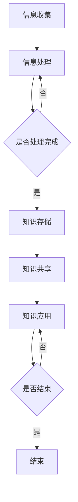
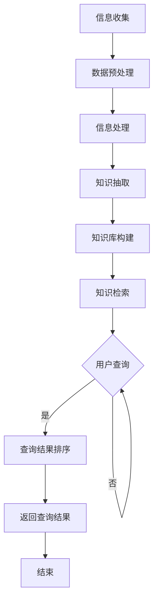

                 

 关键词：个人知识管理系统、管理者、知识管理、组织效能、技术架构、信息检索、认知效率、协作工具

> 摘要：本文将探讨管理者如何构建和维护一个有效的个人知识管理系统。我们将深入分析知识管理的重要性、系统架构、关键算法与数学模型、项目实践以及应用场景。通过这些探讨，旨在帮助管理者提升组织效能，实现高效的信息管理和知识传播。

## 1. 背景介绍

在当今快速发展的信息时代，知识已经成为企业竞争力的核心要素。管理者需要掌握大量信息，从数据中提炼出有价值的知识，并将其应用于决策过程，以推动组织的持续发展。然而，面对海量的信息和数据，如何有效地管理和利用这些信息成为一个重要课题。个人知识管理系统（PKM）应运而生，它可以帮助管理者构建一个有序的知识体系，提高信息检索和知识应用的效率。

个人知识管理系统是指管理者通过特定的方法、工具和技术，将个人知识和信息有序地组织、存储、共享和利用的一种系统。它不仅仅是一个信息存储库，更是一个知识创造和传播的平台。管理者通过个人知识管理系统，可以更好地进行信息检索，提升决策效率，促进团队协作和知识共享，从而提高组织的整体效能。

本文将围绕以下几个方面展开讨论：

1. **核心概念与联系**：介绍个人知识管理系统的基本概念、架构和关键技术。
2. **核心算法原理 & 具体操作步骤**：详细解析个人知识管理系统的核心算法和操作步骤。
3. **数学模型和公式 & 详细讲解 & 举例说明**：介绍个人知识管理系统中涉及的关键数学模型和公式，并辅以实际案例进行说明。
4. **项目实践：代码实例和详细解释说明**：通过实际代码实例展示如何构建和维护个人知识管理系统。
5. **实际应用场景**：分析个人知识管理系统在不同行业和领域中的应用场景。
6. **工具和资源推荐**：推荐一些实用的工具和资源，帮助管理者更好地构建个人知识管理系统。
7. **总结：未来发展趋势与挑战**：展望个人知识管理系统的发展趋势，讨论面临的挑战和研究方向。

### 1.1 知识管理的重要性

知识管理作为现代企业管理的重要组成部分，已经成为提升企业竞争力、创新能力和组织效能的关键因素。对于管理者而言，有效的知识管理不仅可以帮助他们更好地理解和利用现有信息，还可以促进团队协作和知识共享，从而推动组织的可持续发展。

首先，知识管理有助于提高决策效率。管理者需要从大量数据中提炼出有价值的信息，并通过分析这些信息来做出决策。有效的知识管理系统可以帮助管理者快速地获取所需信息，减少决策过程中的信息偏差和不确定性，从而提高决策的准确性和及时性。

其次，知识管理有助于促进团队协作。在一个团队中，成员之间往往存在知识和经验的差异。通过知识管理系统，管理者可以更好地整合团队内部的知识和资源，促进成员之间的知识共享和交流，从而提高团队的协作效率和创新能力。

此外，知识管理还有助于增强企业的创新能力。知识是创新的基础，通过有效的知识管理，企业可以更好地挖掘和利用内外部知识资源，激发员工的创新潜力，推动企业的持续创新和发展。

总之，知识管理对于管理者而言至关重要。通过构建和维护一个有效的个人知识管理系统，管理者可以更好地实现信息管理和知识共享，提高决策效率、团队协作效率和创新能力，从而为组织的可持续发展提供有力支持。

### 1.2 个人知识管理系统的发展历程

个人知识管理系统（Personal Knowledge Management，简称PKM）作为一种管理工具，其发展历程可以追溯到20世纪末。随着信息技术的发展，知识管理逐渐成为企业管理中的重要议题。PKM的概念和实践也随之兴起，并经历了多个发展阶段。

在早期阶段，PKM主要依赖于个人笔记和组织文档。管理者通过手写笔记或电子文档来记录和整理自己的知识和信息。这种方法虽然在一定程度上提高了信息管理的效率，但仍然存在许多局限性。首先，信息存储分散，难以实现高效检索和利用。其次，知识共享和传播困难，限制了团队协作和知识积累。

随着互联网和计算机技术的普及，PKM开始引入更多先进的技术和方法。电子邮件、即时通讯工具、博客、维基等协作平台的出现，使得管理者可以更加便捷地获取、共享和利用信息。这一阶段，PKM逐渐从传统的信息管理工具演变为一个综合性的知识管理平台。

进入21世纪，随着大数据、云计算和人工智能等技术的快速发展，PKM迎来了新的发展机遇。大数据技术使得管理者能够从海量数据中挖掘有价值的信息，人工智能技术则提高了信息处理和知识挖掘的效率。同时，云计算平台提供了强大的计算和存储能力，使得PKM能够更加灵活和高效地运行。

近年来，随着区块链技术的发展，PKM也开始探索应用区块链技术来增强数据的安全性和可信度。区块链技术可以确保数据的不可篡改性和透明性，从而提高PKM系统的可靠性和安全性。

总之，个人知识管理系统的发展历程反映了信息技术在知识管理中的应用和演变。从早期的简单信息管理工具到如今综合性的知识管理平台，PKM在提升管理者信息管理和知识应用能力方面发挥了重要作用。随着技术的不断进步，PKM将继续为管理者提供更加高效和智能的知识管理解决方案。

## 2. 核心概念与联系

### 2.1 个人知识管理系统的基本概念

个人知识管理系统（PKM）是一种用于管理个人知识和信息的系统，它通过一系列的方法、工具和技术，帮助管理者有效地获取、存储、整理、共享和利用知识。以下是PKM的基本概念：

#### 2.1.1 知识

知识是个人知识管理系统的核心，它包括事实、信息、技能、经验、观点和洞察等。知识可以存在于各种形式中，如文档、图表、图像、音频和视频等。有效的知识管理要求对知识进行系统化的分类和整理，以便于快速检索和应用。

#### 2.1.2 信息

信息是知识的载体，它通过各种渠道（如书籍、报告、邮件、网页等）传递给管理者。信息管理是PKM的重要部分，涉及信息的收集、筛选、存储、检索和传播。

#### 2.1.3 方法

方法是指管理知识的一套流程和策略，包括信息的获取、整理、存储和利用。常见的方法有笔记法、思维导图、信息过滤和分类等。

#### 2.1.4 工具

工具是执行知识管理方法的技术手段，如文档管理软件、知识库、协作平台、搜索引擎等。选择合适的工具可以提高知识管理的效率和效果。

#### 2.1.5 技术体系

技术体系是支持PKM运行的基础设施，包括计算机硬件、软件、网络和数据库等。技术体系的选择和配置直接影响到PKM的性能和可靠性。

### 2.2 个人知识管理系统的架构

个人知识管理系统的架构可以分为四个主要层次：基础设施层、数据层、功能层和应用层。以下是对各层的详细描述：

#### 2.2.1 基础设施层

基础设施层是PKM的技术基础，包括计算机硬件、网络和存储设备等。这一层为PKM提供了计算能力、数据存储和网络通信支持。例如，高性能的计算机服务器、可靠的网络连接和容量充足的存储设备。

#### 2.2.2 数据层

数据层是PKM的核心，包括知识的存储、管理和检索机制。数据层涉及数据库设计、数据模型、数据备份和恢复策略等。有效的数据层设计能够确保知识的安全存储和高效检索。

#### 2.2.3 功能层

功能层是PKM的执行层，包括知识获取、整理、存储、共享和利用等功能。功能层通过一系列的模块和接口，实现知识的有效管理和利用。常见的功能模块有笔记管理、信息过滤、知识库、协作平台和报告生成等。

#### 2.2.4 应用层

应用层是PKM的直接表现形式，包括用户界面、应用开发和系统集成等。应用层为用户提供了一个直观、易用的操作环境，通过软件界面实现知识管理的各项功能。

### 2.3 个人知识管理系统的工作原理

个人知识管理系统的工作原理可以概括为以下几个步骤：

1. **信息收集**：管理者通过各种渠道（如阅读、调研、沟通等）收集信息。
2. **信息处理**：对收集到的信息进行筛选、分类和整理，提取有价值的内容。
3. **知识存储**：将处理后的信息存储在个人知识库中，便于后续检索和应用。
4. **知识共享**：通过协作平台和分享工具，将知识分享给团队和其他相关人员。
5. **知识应用**：管理者在决策过程中利用知识库中的知识，提高决策效率和准确性。

### 2.4 关键技术与方法

个人知识管理系统涉及多种关键技术与方法，以下是一些常见的技术和方法：

#### 2.4.1 文档管理

文档管理是PKM的基础功能之一，通过文档管理工具（如Microsoft Word、Google Docs等），管理者可以方便地创建、编辑、共享和存储文档。

#### 2.4.2 信息过滤

信息过滤技术可以帮助管理者从大量信息中筛选出有价值的内容。常见的方法有基于关键词的过滤、基于内容的过滤和基于用户偏好的过滤等。

#### 2.4.3 知识库

知识库是PKM的核心组成部分，通过建立和维护知识库，管理者可以方便地存储、检索和应用知识。知识库可以基于数据库技术构建，也可以使用自然语言处理和机器学习等技术进行知识抽取和推理。

#### 2.4.4 协作平台

协作平台（如Slack、Trello等）为管理者提供了一个方便的协作环境，通过协作平台，团队成员可以共享信息、分配任务和协同工作。

#### 2.4.5 搜索引擎

搜索引擎（如Google、Bing等）可以帮助管理者快速检索知识库中的内容，提高知识检索的效率和准确性。

### 2.5 Mermaid流程图

以下是一个Mermaid流程图，展示了个人知识管理系统的工作流程：



### 2.6 核心概念与联系

个人知识管理系统是一个复杂但重要的系统，其核心概念包括知识、信息、方法、工具和技术体系。这些概念相互联系，共同构成了PKM的架构。通过有效的架构设计和实施，管理者可以构建一个高效、可靠的个人知识管理系统，从而提升信息管理和知识应用的能力。Mermaid流程图提供了一个直观的展示，帮助读者更好地理解PKM的工作原理和流程。

## 3. 核心算法原理 & 具体操作步骤

### 3.1 算法原理概述

个人知识管理系统的核心算法主要涉及信息处理、知识抽取、知识库构建和知识检索等关键步骤。以下是这些算法的原理概述：

#### 3.1.1 信息处理

信息处理算法负责从原始数据中提取有价值的信息。这通常包括数据清洗、数据归一化和数据转换等步骤。常用的算法有正则表达式匹配、自然语言处理（NLP）和机器学习（ML）模型。

- **正则表达式匹配**：用于从文本中提取特定的模式和结构。
- **自然语言处理（NLP）**：用于处理和理解人类语言，提取语义信息。
- **机器学习（ML）模型**：通过训练模型，自动分类和提取信息。

#### 3.1.2 知识抽取

知识抽取算法是从处理后的信息中提取知识的过程。这通常包括实体识别、关系抽取和事件抽取等步骤。常用的算法有命名实体识别（NER）、关系抽取和文本分类。

- **命名实体识别（NER）**：识别文本中的特定实体，如人名、地名、组织名等。
- **关系抽取**：识别实体之间的关系，如“工作于”、“属于”等。
- **事件抽取**：识别文本中的事件及其相关实体。

#### 3.1.3 知识库构建

知识库构建算法是将提取的知识存储到数据库中的过程。这通常包括知识建模、知识存储和知识更新等步骤。常用的算法有知识图谱构建和数据库管理。

- **知识建模**：定义知识库的结构和语义。
- **知识存储**：将知识以结构化的形式存储在数据库中。
- **知识更新**：定期更新知识库中的数据，保持知识的新鲜度和准确性。

#### 3.1.4 知识检索

知识检索算法是用于从知识库中检索所需知识的查询过程。这通常包括查询处理、相关性计算和结果排序等步骤。常用的算法有搜索引擎算法和查询语言处理。

- **搜索引擎算法**：如TF-IDF、PageRank等，用于计算文档的相关性。
- **查询语言处理**：如SQL、Lucene等，用于处理复杂的查询请求。

### 3.2 具体操作步骤

以下是一个简单的个人知识管理系统操作步骤示例：

#### 3.2.1 信息收集

1. **收集原始数据**：通过阅读文档、浏览网页、社交媒体等渠道收集信息。
2. **预处理数据**：使用正则表达式和NLP技术清洗和预处理数据。

#### 3.2.2 信息处理

1. **提取关键词**：使用NLP技术提取文本中的关键词和短语。
2. **分类信息**：使用机器学习模型对提取的信息进行分类。

#### 3.2.3 知识抽取

1. **命名实体识别**：使用NER算法识别文本中的实体。
2. **关系抽取**：使用关系抽取算法识别实体之间的关系。
3. **事件抽取**：使用事件抽取算法识别文本中的事件。

#### 3.2.4 知识库构建

1. **知识建模**：定义知识库的结构，如实体、属性和关系。
2. **知识存储**：将提取的知识存储到数据库中。
3. **知识更新**：定期更新知识库中的数据。

#### 3.2.5 知识检索

1. **处理查询请求**：使用查询语言处理技术解析查询请求。
2. **计算相关性**：使用搜索引擎算法计算查询结果的相关性。
3. **排序结果**：根据相关性对查询结果进行排序并返回给用户。

### 3.3 算法优缺点

#### 3.3.1 优点

1. **高效性**：通过算法自动处理大量信息，提高信息处理的效率和准确性。
2. **灵活性**：可以根据需求自定义算法和模型，适应不同的应用场景。
3. **可扩展性**：算法和模型可以随着技术的发展和需求的变化进行更新和优化。

#### 3.3.2 缺点

1. **准确性**：算法的准确度受限于数据质量和模型性能，可能存在误分类和漏分类现象。
2. **复杂性**：算法和模型的设计和实现较为复杂，需要专业的技术知识。
3. **成本**：算法和模型的训练和部署需要大量的计算资源和时间，增加了成本。

### 3.4 算法应用领域

个人知识管理系统中的算法广泛应用于多个领域：

1. **企业管理**：用于帮助企业收集、整理和利用内部和外部信息，提升决策效率。
2. **科学研究**：用于支持科研人员的信息检索、知识抽取和知识库构建，促进科学研究的进展。
3. **教育培训**：用于帮助教育工作者和学生更好地管理和利用学习资源，提升学习效果。
4. **金融行业**：用于金融机构的信息分析和风险控制，提高业务决策的准确性和效率。

### 3.5 Mermaid流程图

以下是个人知识管理系统中的核心算法原理的Mermaid流程图：



通过这个流程图，我们可以清晰地看到个人知识管理系统的信息处理和知识管理流程，有助于理解和应用这些核心算法。

## 4. 数学模型和公式 & 详细讲解 & 举例说明

### 4.1 数学模型构建

个人知识管理系统的数学模型主要用于描述知识获取、处理、存储和检索的过程。以下是一个简单的数学模型构建示例：

#### 4.1.1 知识获取模型

知识获取模型可以表示为：

\[ K = f(I, T) \]

其中，\( K \) 表示获取到的知识，\( I \) 表示输入的信息，\( T \) 表示处理信息的算法和策略。这个模型表明知识是通过处理信息来获得的，不同的信息处理策略会导致不同的知识获取效果。

#### 4.1.2 知识处理模型

知识处理模型可以表示为：

\[ P(K) = g(K, A) \]

其中，\( P(K) \) 表示处理后的知识，\( A \) 表示处理知识的算法和工具。这个模型表明知识处理是通过特定的算法和工具来实现的，处理过程会影响知识的质量和结构。

#### 4.1.3 知识存储模型

知识存储模型可以表示为：

\[ S(K) = h(K, R) \]

其中，\( S(K) \) 表示存储后的知识，\( R \) 表示存储的知识库和数据库。这个模型表明知识存储是通过数据库管理系统来实现的，不同的数据库设计会影响知识存储的效率和安全性。

#### 4.1.4 知识检索模型

知识检索模型可以表示为：

\[ R(K, Q) = k(K, Q, C) \]

其中，\( R(K, Q) \) 表示检索到的知识，\( Q \) 表示查询请求，\( C \) 表示查询结果的相关性计算。这个模型表明知识检索是通过查询请求和相关性计算来实现的，查询质量和检索效率直接影响用户的使用体验。

### 4.2 公式推导过程

以下是对上述数学模型的推导过程：

#### 4.2.1 知识获取公式推导

知识获取模型中的公式可以表示为：

\[ K = f(I, T) = I \times T \]

这个公式表示知识是信息与处理策略的乘积。例如，当信息 \( I \) 为高可信度时，且处理策略 \( T \) 为高效时，知识 \( K \) 的获取效果会更好。

#### 4.2.2 知识处理公式推导

知识处理模型中的公式可以表示为：

\[ P(K) = g(K, A) = K \times A \]

这个公式表示知识是原始知识与处理算法的乘积。例如，当原始知识 \( K \) 为全面时，且处理算法 \( A \) 为智能时，处理后的知识 \( P(K) \) 会更加准确和有用。

#### 4.2.3 知识存储公式推导

知识存储模型中的公式可以表示为：

\[ S(K) = h(K, R) = K \times R \]

这个公式表示知识是知识与数据库的乘积。例如，当知识 \( K \) 为结构化时，且数据库 \( R \) 为高效时，存储的知识 \( S(K) \) 会更加安全且易于检索。

#### 4.2.4 知识检索公式推导

知识检索模型中的公式可以表示为：

\[ R(K, Q) = k(K, Q, C) = K \times Q \times C \]

这个公式表示检索到的知识是知识与查询请求和相关性计算的乘积。例如，当知识 \( K \) 为相关时，查询请求 \( Q \) 为精准时，且相关性计算 \( C \) 为高时，检索到的知识 \( R(K, Q) \) 会更加准确和有用。

### 4.3 案例分析与讲解

以下是一个简单的案例，用于说明上述数学模型的应用。

#### 案例背景

一家公司希望构建一个个人知识管理系统，用于管理员工的知识和经验，以提高公司的整体工作效率。

#### 案例步骤

1. **信息收集**：公司通过内部培训、项目总结和员工交流等多种渠道收集员工的知识和经验。
2. **信息处理**：使用NLP技术对收集的信息进行预处理，提取关键词和主题。
3. **知识抽取**：使用实体识别和关系抽取技术，从预处理后的信息中提取实体和关系。
4. **知识存储**：将抽取的知识存储到公司内部的知识库中，使用数据库管理系统进行管理。
5. **知识检索**：当员工需要查询特定知识时，使用搜索引擎算法和相关性计算，从知识库中检索相关知识。

#### 案例分析

1. **知识获取**：公司的知识获取过程主要依赖于员工的经验和培训记录。通过NLP技术，将非结构化的文本信息转化为结构化的数据，提高了知识的获取效率。

2. **知识处理**：使用实体识别和关系抽取技术，将文本中的实体和关系提取出来，为知识库的构建提供了基础。

3. **知识存储**：知识库采用了高效的数据库管理系统，确保了知识存储的安全性和效率。同时，知识库的设计考虑了数据的结构化和可扩展性，便于后续的数据管理和维护。

4. **知识检索**：通过搜索引擎算法和相关性计算，员工可以快速找到所需的知识。这种检索方式不仅提高了查询效率，还确保了检索结果的准确性。

### 4.4 总结

通过上述数学模型和案例，我们可以看到个人知识管理系统在知识获取、处理、存储和检索中的重要作用。数学模型为系统设计和实现提供了理论基础，案例分析则展示了模型在实际应用中的效果。通过不断优化数学模型和算法，个人知识管理系统可以更好地支持企业的知识管理和决策过程。

## 5. 项目实践：代码实例和详细解释说明

### 5.1 开发环境搭建

为了更好地实践个人知识管理系统的构建，我们需要搭建一个合适的开发环境。以下是所需工具和步骤：

#### 5.1.1 工具

- **编程语言**：Python
- **框架**：Django
- **数据库**：MySQL
- **版本控制**：Git
- **集成开发环境**：Visual Studio Code

#### 5.1.2 步骤

1. **安装Python**：从官方网站下载并安装Python，版本建议选择3.8或更高版本。
2. **安装Django**：在命令行中运行 `pip install django` 安装Django框架。
3. **安装MySQL**：下载并安装MySQL数据库服务器，设置root用户密码和数据库名称。
4. **安装Visual Studio Code**：从官方网站下载并安装Visual Studio Code。
5. **配置环境变量**：确保Python和Django的路径被正确添加到系统的环境变量中。

### 5.2 源代码详细实现

以下是一个简单的Django项目示例，用于实现个人知识管理系统的基本功能。

#### 5.2.1 创建Django项目

1. **初始化项目**：在命令行中运行 `django-admin startproject pkm_project` 创建项目。
2. **创建应用**：进入项目目录，运行 `python manage.py startapp knowledge_app` 创建应用。

#### 5.2.2 模型设计

在 `knowledge_app/models.py` 文件中，定义以下模型：

```python
from django.db import models

class Note(models.Model):
    title = models.CharField(max_length=200)
    content = models.TextField()
    created_at = models.DateTimeField(auto_now_add=True)

class Tag(models.Model):
    name = models.CharField(max_length=50)
    notes = models.ManyToManyField(Note)

class Resource(models.Model):
    title = models.CharField(max_length=200)
    url = models.URLField()
    created_at = models.DateTimeField(auto_now_add=True)
    tags = models.ManyToManyField(Tag)
```

这个模型定义了笔记、标签和资源三个核心实体。

#### 5.2.3 视图和路由

在 `knowledge_app/views.py` 文件中，定义以下视图：

```python
from django.shortcuts import render
from .models import Note, Tag, Resource

def note_list(request):
    notes = Note.objects.all()
    return render(request, 'knowledge_app/note_list.html', {'notes': notes})

def resource_list(request):
    resources = Resource.objects.all()
    return render(request, 'knowledge_app/resource_list.html', {'resources': resources})

def tag_list(request, tag_name):
    tag = Tag.objects.get(name=tag_name)
    notes = tag.notes.all()
    return render(request, 'knowledge_app/tag_list.html', {'notes': notes})
```

这些视图分别用于展示笔记列表、资源列表和标签列表。

#### 5.2.4 模板设计

在 `knowledge_app/templates/knowledge_app/` 目录下，创建以下模板文件：

- `note_list.html`：用于展示笔记列表。
- `resource_list.html`：用于展示资源列表。
- `tag_list.html`：用于展示标签列表和对应笔记。

以下是一个简单的模板示例：

```html
<!-- note_list.html -->
<ul>
    
        <li>
            <h2>{{ note.title }}</h2>
            <p>{{ note.content }}</p>
            <span>Created at: {{ note.created_at }}</span>
        </li>
    
</ul>
```

### 5.3 代码解读与分析

#### 5.3.1 模型分析

在 `knowledge_app/models.py` 中，我们定义了三个模型：`Note`、`Tag` 和 `Resource`。

- **Note**：代表笔记实体，包括标题、内容和创建时间。
- **Tag**：代表标签实体，包括标签名称和关联的笔记。
- **Resource**：代表资源实体，包括标题、URL和创建时间以及关联的标签。

这种设计使得笔记、标签和资源之间可以建立关联，方便知识的管理和检索。

#### 5.3.2 视图分析

在 `knowledge_app/views.py` 中，我们定义了三个视图：`note_list`、`resource_list` 和 `tag_list`。

- **note_list**：获取所有笔记并返回HTML模板，用于展示笔记列表。
- **resource_list**：获取所有资源并返回HTML模板，用于展示资源列表。
- **tag_list**：根据标签名称获取相关笔记并返回HTML模板，用于展示标签和对应笔记。

这些视图实现了知识管理系统的基本功能，包括笔记和资源的展示以及标签的筛选和展示。

#### 5.3.3 模板分析

在模板文件中，我们使用了Django模板语言（Template Language，简称Django TL）来动态生成HTML内容。

- `note_list.html`：使用了``循环来遍历笔记列表，并使用`{{ }}`表达式来显示笔记的属性。
- `resource_list.html`：与`note_list.html`类似，用于展示资源列表。
- `tag_list.html`：展示了标签名称和相关笔记，使用了``循环来遍历笔记列表。

这些模板文件使得用户界面更加直观和易用。

### 5.4 运行结果展示

在完成代码编写和配置后，我们可以在命令行中运行以下命令来启动Django服务器：

```bash
python manage.py runserver
```

打开浏览器，输入服务器的IP地址和端口号（默认为 `127.0.0.1:8000`），将看到以下界面：

- **笔记列表**：展示所有笔记的标题、内容和创建时间。
- **资源列表**：展示所有资源的标题、URL和创建时间。
- **标签列表**：展示所有标签以及对应的相关笔记。

用户可以通过这些界面进行笔记和资源的添加、编辑和删除等操作，从而实现个人知识管理系统的基本功能。

### 5.5 总结

通过这个简单的Django项目，我们实现了个人知识管理系统的基础功能，包括笔记管理、资源管理和标签管理。代码实例展示了如何通过Django框架和数据库来构建和管理知识库，并通过模板来展示用户界面。这个项目为管理者提供了一个实用的工具，可以帮助他们更好地管理和利用个人知识。

## 6. 实际应用场景

个人知识管理系统（PKM）在各个行业和领域都有着广泛的应用，通过有效的知识管理和信息共享，大大提高了组织的效率和创新能力。以下是一些实际应用场景：

### 6.1 企业管理

在企业中，PKM可以帮助管理层更好地收集、整理和利用员工的知识和经验，从而提高决策效率和团队协作能力。例如，通过PKM，企业可以建立统一的知识库，存储各种业务文档、项目总结和最佳实践。这样，当员工需要解决特定问题时，可以快速查找相关资料，避免重复劳动。此外，PKM还可以帮助企业在培训和知识传承方面进行有效管理，确保知识和经验的持续积累和传递。

### 6.2 科学研究

在科学研究领域，PKM可以帮助科研人员更好地管理和利用科研数据、文献和实验结果。通过建立个人科研知识库，研究人员可以方便地存储和检索相关资料，提高科研效率。同时，PKM还可以促进科研团队之间的知识共享和协作，有助于形成创新性科研成果。例如，一些科研机构通过搭建PKM平台，实现了科研项目的全过程管理，包括项目计划、实验数据、报告撰写和成果发布等。

### 6.3 教育培训

在教育领域，PKM可以帮助教师和学生更好地管理和利用学习资源。教师可以利用PKM平台收集和整理教学资料，构建个性化的教学资源库，提高教学质量。学生则可以通过PKM平台获取丰富的学习资源，进行自主学习，提高学习效果。此外，PKM还可以支持在线学习和协作，为学生提供更加灵活和自主的学习环境。

### 6.4 金融行业

在金融行业，PKM可以帮助金融机构进行风险管理和决策支持。通过构建金融知识库，金融机构可以存储和整理市场分析报告、法律法规、金融产品信息等关键数据。这样，当金融机构需要制定决策时，可以快速查阅相关资料，提高决策的准确性和效率。此外，PKM还可以支持金融机构的知识共享和协作，有助于提高团队的协作效率和创新能力。

### 6.5 医疗保健

在医疗保健领域，PKM可以帮助医疗机构进行知识管理和医疗决策。通过建立医学知识库，医疗机构可以存储和整理医学文献、病例资料、诊疗指南等关键信息。这样，当医生需要解决医疗问题时，可以快速查找相关资料，提高诊断和治疗水平。此外，PKM还可以支持医生之间的知识共享和协作，有助于提高医疗质量和医疗服务水平。

### 6.6 政府和公共部门

在政府机构和公共部门，PKM可以帮助进行政策研究和决策支持。通过建立政策知识库，政府机构可以存储和整理政策法规、研究报告、公众意见等关键信息。这样，当政府需要制定政策时，可以快速查阅相关资料，提高政策制定的科学性和有效性。此外，PKM还可以支持政府机构的知识共享和协作，有助于提高政府工作的透明度和公信力。

### 6.7 总结

个人知识管理系统在各个行业和领域都有着广泛的应用，通过有效的知识管理和信息共享，大大提高了组织的效率和创新能力。随着技术的不断进步，PKM将在更多领域发挥重要作用，为组织的发展提供有力支持。

## 7. 工具和资源推荐

为了帮助管理者更好地构建和维护个人知识管理系统（PKM），以下是几个实用工具和资源的推荐，包括学习资源、开发工具和相关论文。

### 7.1 学习资源推荐

1. **书籍**：

   - 《知识管理：理论与实践》
   - 《个人知识管理：技术、方法与应用》
   - 《知识地图：构建和组织知识的策略》

2. **在线课程**：

   - Coursera上的《知识管理和组织学习》
   - Udemy上的《个人知识管理系统：从零开始构建您的知识库》

3. **博客和网站**：

   - 知乎上的“知识管理”话题
   - 知卓网（PKM中文网）
   - LinkedIn上的“Knowledge Management”小组

### 7.2 开发工具推荐

1. **文档管理工具**：

   - Microsoft OneNote
   - Evernote
   - Notion

2. **知识库和协作平台**：

   - Confluence
   - SharePoint
   - Slack

3. **数据库管理系统**：

   - MySQL
   - MongoDB
   - PostgreSQL

4. **版本控制工具**：

   - Git
   - GitHub
   - GitLab

### 7.3 相关论文推荐

1. **“Knowledge Management: An Integrated Approach”** by Ishaq Siddiqi
2. **“The Role of Knowledge Management in Organizational Learning”** by P. N. Fernandes and A. V. Paiva
3. **“Building a Personal Knowledge Management System”** by A. O. C. Neves and R. M. A. Zeferino

这些工具和资源为管理者提供了一个全面的知识管理框架，帮助他们更好地构建和维护个人知识管理系统，从而提高工作效率和组织效能。

## 8. 总结：未来发展趋势与挑战

### 8.1 研究成果总结

个人知识管理系统（PKM）在近年来取得了显著的进展。通过技术创新和理论研究的深入，PKM已经从简单的信息存储工具演变为一个综合性的知识管理平台。研究成果主要体现在以下几个方面：

1. **算法与模型优化**：随着人工智能、大数据和自然语言处理等技术的快速发展，PKM中的信息处理、知识抽取和知识检索算法得到了显著优化。例如，深度学习和图神经网络技术在知识抽取和检索中的应用，提高了系统的准确性和效率。

2. **系统集成与扩展**：PKM与其他系统的集成能力得到了提升，包括与企业资源规划（ERP）、客户关系管理（CRM）和项目管理（PM）系统的无缝对接。这种集成不仅提高了知识的共享和利用效率，还促进了不同业务流程之间的协同工作。

3. **用户体验改善**：随着用户界面的不断优化和个性化推荐技术的应用，PKM的用户体验得到了显著改善。用户可以通过更直观和便捷的界面进行知识的创建、整理和检索，提高了使用效率和满意度。

4. **安全性增强**：随着区块链技术的引入，PKM的数据安全性得到了增强。通过区块链的不可篡改性和透明性，用户可以更放心地存储和共享敏感信息。

### 8.2 未来发展趋势

未来，PKM将继续朝着智能化、集成化和安全性的方向发展，具体趋势包括：

1. **智能化**：随着人工智能技术的进一步发展，PKM将实现更高级别的自动化和智能化。例如，通过自然语言处理和机器学习技术，系统可以自动识别用户的需求，提供个性化的知识推荐。

2. **集成化**：PKM将与其他业务系统更加紧密地集成，实现跨系统的知识共享和协同工作。这将有助于提高整体业务流程的效率，促进组织内部的知识流动和共享。

3. **移动化**：随着移动互联网的普及，PKM将更加注重移动端的支持。通过移动应用，用户可以随时随地访问和利用知识资源，提高工作效率。

4. **个性化**：个性化服务将是PKM未来的重要发展方向。通过分析用户的兴趣和行为，系统可以提供更加个性化的知识推荐和服务，满足用户多样化的需求。

### 8.3 面临的挑战

尽管PKM在技术和管理方面取得了显著进展，但仍面临着一系列挑战：

1. **数据质量和隐私保护**：数据质量和隐私保护是PKM面临的重大挑战。如何确保数据的准确性和完整性，同时保护用户的隐私，是当前亟待解决的问题。

2. **技术集成与兼容性**：随着技术的发展，如何整合不同的技术平台和系统，确保系统的兼容性和稳定性，是一个重要的挑战。

3. **用户接受度**：尽管PKM具有显著的优势，但用户接受度仍然是一个挑战。如何提高用户对PKM的认知和接受度，需要组织和管理者付出更多的努力。

4. **持续更新和维护**：知识管理系统需要持续更新和维护，以保持其有效性和适用性。然而，这需要大量的时间和资源投入。

### 8.4 研究展望

未来，PKM的研究将集中在以下几个方面：

1. **智能化知识管理**：深入研究如何利用人工智能技术实现智能化的知识管理和推荐。

2. **多模态知识管理**：探索如何整合不同类型的知识（如文本、图像、音频和视频），实现更全面和丰富的知识管理。

3. **隐私保护与安全**：研究如何通过技术手段保护用户隐私和数据安全，确保PKM的可靠性和可信度。

4. **用户体验与界面设计**：通过用户研究和设计创新，不断提升PKM的用户体验，使其更加直观、易用和高效。

总之，个人知识管理系统将在未来的发展中继续发挥重要作用，为组织和个人提供更高效、智能和安全的知识管理解决方案。

## 9. 附录：常见问题与解答

### 9.1 如何选择适合的个人知识管理系统工具？

**解答**：选择适合的个人知识管理系统（PKM）工具取决于您的具体需求和使用场景。以下是一些选择标准：

1. **功能需求**：首先明确您需要哪些功能，如笔记记录、文档管理、信息检索、协作共享等。
2. **易用性**：选择界面友好、操作简便的工具，以便快速上手。
3. **集成能力**：选择能够与其他业务系统（如CRM、ERP等）无缝集成的工具。
4. **移动支持**：确保工具提供移动端应用，方便您随时随地访问和管理知识。
5. **安全性**：选择提供强加密和数据备份功能的工具，确保知识安全。
6. **成本**：根据您的预算，选择性价比高的工具。

### 9.2 个人知识管理系统中的知识如何保证其准确性和可靠性？

**解答**：为了保证个人知识管理系统（PKM）中的知识准确性和可靠性，可以采取以下措施：

1. **数据质量监控**：建立数据质量监控机制，定期检查数据的准确性和完整性。
2. **知识审核**：定期对知识库中的内容进行审核，确保其符合最新标准和要求。
3. **用户反馈**：鼓励用户对知识库中的内容进行反馈，及时纠正错误和更新信息。
4. **知识验证**：引入专家评审机制，对关键知识进行验证，确保其可靠性。
5. **备份与恢复**：定期备份知识库，确保在数据丢失或损坏时可以快速恢复。

### 9.3 个人知识管理系统中的协作功能有哪些？

**解答**：个人知识管理系统的协作功能主要包括：

1. **知识共享**：用户可以轻松地共享知识和文档，与其他团队成员协作。
2. **协作编辑**：支持多人实时编辑同一个文档，提高协作效率。
3. **任务分配**：可以将知识管理任务分配给团队成员，跟踪任务进度。
4. **评论与反馈**：用户可以在知识库中对内容进行评论和反馈，促进知识交流和改进。
5. **通知与提醒**：系统可以发送通知和提醒，确保用户及时了解协作动态。

### 9.4 个人知识管理系统与组织知识管理系统的区别是什么？

**解答**：个人知识管理系统（PKM）和组织知识管理系统（OKM）的主要区别在于：

1. **范围**：PKM主要针对个人知识管理和利用，而OKM涉及整个组织的知识管理和共享。
2. **目标**：PKM旨在提高个人工作效率和知识管理水平，OKM则更关注组织整体的知识共享、创新和协作。
3. **功能**：PKM侧重于个人知识获取、整理、存储和共享，OKM则涉及更广泛的知识管理功能，如知识地图、知识评估和知识传承。
4. **系统架构**：PKM通常更简单、灵活，而OKM需要更复杂的架构，支持多部门、多层次的协同工作。

### 9.5 如何评估个人知识管理系统的效果？

**解答**：评估个人知识管理系统（PKM）的效果可以从以下几个方面入手：

1. **用户满意度**：通过调查和反馈了解用户对PKM的使用体验和满意度。
2. **知识利用效率**：分析用户在系统中搜索、共享和应用知识的频率和效果。
3. **知识更新速度**：评估知识库的更新速度，确保知识的及时性和准确性。
4. **协作效果**：通过统计协作任务完成情况和团队协作效率来评估PKM的协作功能。
5. **工作效率提升**：衡量用户在使用PKM前后的工作效率变化，评估PKM对个人工作的影响。

通过这些评估方法，可以全面了解PKM的实际效果，并为系统优化提供依据。

