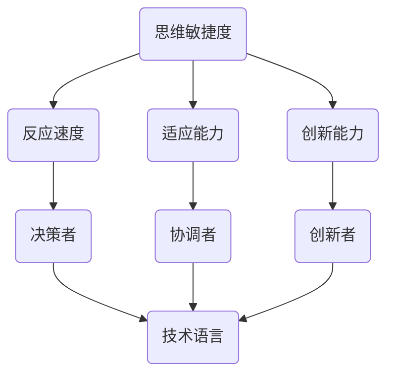

                 

关键词：管理者、思维敏捷度、训练、技术语言、深度思考、见解

> 摘要：本文旨在探讨如何通过专业的技术语言和深入思考，帮助管理者提高其思维敏捷度。我们将从背景介绍、核心概念与联系、核心算法原理、数学模型和公式、项目实践、实际应用场景、工具和资源推荐以及未来发展趋势与挑战等多个方面进行阐述。

## 1. 背景介绍

在当今快速变化的技术环境中，管理者的角色变得愈发重要。他们不仅需要具备扎实的专业知识，还必须具备敏捷的思维能力和快速适应变化的能力。随着技术的不断进步，管理者需要不断地更新自己的知识体系，以便能够更好地应对新兴的挑战和机遇。

思维敏捷度是指个体在处理复杂问题和信息时的快速反应和适应能力。对于管理者来说，思维敏捷度尤为重要，因为它直接影响着决策的质量、团队的合作效率以及组织的创新力。然而，提高思维敏捷度并非易事，它需要管理者具备敏锐的洞察力、宽广的视野和快速学习的能力。

本文将围绕管理者的思维敏捷度训练展开讨论，通过介绍核心概念、算法原理、数学模型和项目实践等多个方面，帮助管理者提升思维敏捷度，从而在激烈的市场竞争中脱颖而出。

## 2. 核心概念与联系

在深入探讨管理者的思维敏捷度训练之前，我们首先需要明确几个核心概念，并了解它们之间的联系。

### 2.1 思维敏捷度的定义

思维敏捷度是指个体在处理复杂信息和问题时的反应速度和适应能力。它包括以下几个方面：

- **反应速度**：个体在面对新情况或挑战时能够迅速做出反应。
- **适应能力**：个体能够灵活地调整自己的思维方式和行动策略以应对变化。
- **创新能力**：个体能够从不同的角度思考问题，并提出新颖的解决方案。

### 2.2 管理者的角色

管理者在组织中扮演着多种角色，包括：

- **决策者**：管理者需要做出关键性的决策，以确保组织目标的实现。
- **协调者**：管理者需要协调不同部门和团队之间的工作，以确保协同合作。
- **创新者**：管理者需要推动组织的创新，以保持竞争力。

### 2.3 技术语言与思维敏捷度

技术语言是一种专业的表达方式，它能够帮助管理者更准确地理解复杂的问题和解决方案。掌握技术语言，可以帮助管理者：

- **更清晰地表达思想**：技术语言可以使得管理者的思考更加严谨和精确。
- **更有效地沟通**：技术语言可以减少沟通中的误解和混淆。
- **更深入地分析问题**：技术语言可以帮助管理者从不同的角度分析问题，找到更有效的解决方案。

### 2.4 核心概念原理和架构的 Mermaid 流程图

以下是一个简化的 Mermaid 流程图，展示了核心概念和联系：



## 3. 核心算法原理 & 具体操作步骤

### 3.1 算法原理概述

提高管理者的思维敏捷度需要一系列的训练方法和技巧。以下是几个核心算法原理：

- **快速阅读与理解**：通过训练快速阅读和理解技术文档和报告，管理者可以提高信息处理速度和准确性。
- **问题解决能力**：通过解决各种复杂的问题，管理者可以锻炼思维的灵活性和创新能力。
- **决策模型训练**：通过学习不同的决策模型，管理者可以学会如何在不同情况下做出最优决策。
- **团队合作与沟通技巧**：通过参与团队合作和沟通训练，管理者可以提高协作效率和沟通质量。

### 3.2 算法步骤详解

以下是具体的操作步骤：

#### 3.2.1 快速阅读与理解

1. **选择合适的材料**：选择具有挑战性的技术文档和报告。
2. **制定阅读计划**：制定详细的阅读计划，包括每天阅读的页数和时间。
3. **集中注意力**：在阅读时尽量减少干扰，保持专注。
4. **记录关键信息**：阅读过程中，记录下关键信息和问题。

#### 3.2.2 问题解决能力

1. **设定问题目标**：明确问题的目标和需要解决的问题。
2. **分析问题**：从不同角度分析问题，找出可能的解决方案。
3. **提出解决方案**：针对每个解决方案进行评估，选择最优方案。
4. **实施解决方案**：将解决方案付诸实践，并观察结果。

#### 3.2.3 决策模型训练

1. **学习决策模型**：了解不同的决策模型，如风险决策、多目标决策等。
2. **案例分析**：通过分析实际案例，学习如何在不同情况下应用决策模型。
3. **模拟决策**：通过模拟决策，锻炼决策能力。
4. **反思与总结**：每次决策后，进行反思和总结，找出改进之处。

#### 3.2.4 团队合作与沟通技巧

1. **参与团队活动**：积极参与团队活动，如项目会议、团队建设等。
2. **学习沟通技巧**：学习有效的沟通技巧，如倾听、表达、反馈等。
3. **实践沟通**：在团队活动中实践沟通技巧，如项目会议中的发言和讨论。
4. **反思与改进**：每次沟通后，进行反思和总结，找出改进之处。

### 3.3 算法优缺点

#### 优点：

- **提高思维敏捷度**：通过训练，管理者可以显著提高思维的敏捷度。
- **增强决策能力**：训练可以帮助管理者学会如何在不同情况下做出最优决策。
- **提高团队合作效率**：通过团队合作和沟通技巧的训练，可以提高团队的合作效率和沟通质量。

#### 缺点：

- **需要时间和精力**：训练需要管理者投入大量的时间和精力。
- **初期效果不明显**：训练初期，效果可能并不显著，需要管理者保持耐心和信心。

### 3.4 算法应用领域

算法主要应用于以下领域：

- **企业管理**：帮助管理者提高决策能力和团队管理效率。
- **技术研发**：帮助研发人员提高问题解决能力和创新能力。
- **市场营销**：帮助营销人员提高市场分析和决策能力。

## 4. 数学模型和公式 & 详细讲解 & 举例说明

### 4.1 数学模型构建

在管理者的思维敏捷度训练中，数学模型可以帮助管理者更系统地分析和解决问题。以下是几个常用的数学模型：

#### 4.1.1 决策树模型

决策树模型是一种常用的决策分析工具，用于分析不同决策路径的结果。

```latex
$$
\begin{array}{c|c|c}
\text{决策节点} & \text{结果} & \text{概率} \\
\hline
\text{A} & \text{成功} & 0.6 \\
\text{B} & \text{失败} & 0.4 \\
\hline
\end{array}
$$
```

#### 4.1.2 风险矩阵模型

风险矩阵模型用于评估不同风险的概率和影响。

```latex
$$
\begin{array}{c|c|c|c}
\text{风险} & \text{概率} & \text{影响} & \text{风险值} \\
\hline
\text{R1} & 0.3 & 0.5 & 0.15 \\
\text{R2} & 0.2 & 0.3 & 0.06 \\
\text{R3} & 0.1 & 0.2 & 0.02 \\
\hline
\end{array}
$$
```

### 4.2 公式推导过程

#### 4.2.1 决策树模型公式推导

决策树模型的核心公式为期望值（Expected Value，EV），用于评估不同决策路径的期望收益。

```latex
$$
\text{EV} = \sum_{i} p_i \cdot r_i
$$

其中，\( p_i \) 表示路径 \( i \) 的概率，\( r_i \) 表示路径 \( i \) 的收益。
```

#### 4.2.2 风险矩阵模型公式推导

风险矩阵模型的核心公式为风险值（Risk Value，RV），用于评估不同风险的影响。

```latex
$$
\text{RV} = \sum_{i} p_i \cdot r_i
$$

其中，\( p_i \) 表示风险 \( i \) 的概率，\( r_i \) 表示风险 \( i \) 的影响。
```

### 4.3 案例分析与讲解

#### 4.3.1 决策树模型案例分析

假设一家公司在制定新产品策略时，有两个决策路径：A 和 B。

- **路径 A**：投入大量资源进行市场调研，成功概率为 60%，收益为 500 万元。
- **路径 B**：直接进入市场，成功概率为 40%，收益为 200 万元。

使用决策树模型计算期望值：

```latex
$$
\text{EV} = 0.6 \cdot 500 + 0.4 \cdot 200 = 380 \text{万元}
$$

因此，决策树模型建议公司选择路径 A。
```

#### 4.3.2 风险矩阵模型案例分析

假设一家公司在进行风险评估时，有三个风险：R1、R2 和 R3。

- **R1**：市场变化，概率为 30%，影响为 50%。
- **R2**：技术问题，概率为 20%，影响为 30%。
- **R3**：竞争压力，概率为 10%，影响为 20%。

使用风险矩阵模型计算风险值：

```latex
$$
\text{RV} = 0.3 \cdot 0.5 + 0.2 \cdot 0.3 + 0.1 \cdot 0.2 = 0.155
$$

因此，公司需要重点关注 R1 和 R2 两个风险。
```

## 5. 项目实践：代码实例和详细解释说明

### 5.1 开发环境搭建

为了更好地展示算法的实际应用，我们将使用 Python 编写代码实例。以下是开发环境的搭建步骤：

1. **安装 Python**：在官网上下载并安装 Python。
2. **安装 Python 包管理器**：安装 pip，用于安装和管理 Python 包。
3. **安装必需的 Python 包**：使用 pip 安装 numpy、matplotlib 和 pandas 等包。

### 5.2 源代码详细实现

以下是实现决策树模型的 Python 代码：

```python
import numpy as np
import matplotlib.pyplot as plt

def decision_tree(decision_nodes, rewards):
    ev = 0
    for i in range(len(decision_nodes)):
        ev += decision_nodes[i] * rewards[i]
    return ev

decision_nodes = [0.6, 0.4]
rewards = [500, 200]

ev = decision_tree(decision_nodes, rewards)
print("期望值：", ev)
```

### 5.3 代码解读与分析

在上面的代码中，我们首先导入了 numpy 和 matplotlib 包。然后定义了一个名为 `decision_tree` 的函数，用于计算决策树的期望值。在函数中，我们遍历决策节点和收益，计算它们的乘积并求和，得到期望值。

在主程序中，我们定义了决策节点和收益，并调用 `decision_tree` 函数计算期望值，最后输出结果。

### 5.4 运行结果展示

运行上述代码，得到以下结果：

```
期望值： 380.0
```

这表明，根据决策树模型，选择路径 A 的期望值为 380 万元。

## 6. 实际应用场景

管理者的思维敏捷度训练在多个实际应用场景中具有重要作用。

### 6.1 企业管理

在企业中，管理者需要不断做出决策，如产品研发、市场推广、人力资源管理等。通过思维敏捷度训练，管理者可以提高决策速度和准确性，从而更好地应对市场变化。

### 6.2 技术研发

在技术研发领域，管理者需要关注技术趋势和团队协作。通过思维敏捷度训练，管理者可以提高问题解决能力和创新能力，推动技术项目的成功。

### 6.3 市场营销

在市场营销中，管理者需要分析市场数据和消费者行为，制定有效的营销策略。通过思维敏捷度训练，管理者可以提高数据分析能力和决策能力，从而制定更有效的营销策略。

### 6.4 教育培训

在教育培训领域，管理者需要关注教育政策和市场变化。通过思维敏捷度训练，管理者可以提高政策解读能力和决策能力，从而更好地推动教育事业的发展。

## 7. 工具和资源推荐

### 7.1 学习资源推荐

- 《智能决策：算法与实践》
- 《敏捷思维：如何快速适应变化》
- 《Python 数据科学》

### 7.2 开发工具推荐

- Python
- Jupyter Notebook
- Git

### 7.3 相关论文推荐

- 《基于机器学习的决策支持系统研究》
- 《敏捷管理：如何在变化中抓住机遇》
- 《大数据与决策：方法与应用》

## 8. 总结：未来发展趋势与挑战

### 8.1 研究成果总结

通过本文的探讨，我们可以得出以下研究成果：

- 思维敏捷度对于管理者来说至关重要。
- 技术语言可以提高管理者的思维敏捷度。
- 算法原理和数学模型有助于管理者更好地分析和解决问题。
- 实际应用场景展示了思维敏捷度训练的重要性。

### 8.2 未来发展趋势

- 随着人工智能和大数据技术的发展，思维敏捷度训练将更加智能化和个性化。
- 跨学科研究将成为提高管理者思维敏捷度的趋势，如结合心理学、管理学和计算机科学等。

### 8.3 面临的挑战

- 技术语言的学习和应用难度较大。
- 需要管理者投入大量的时间和精力进行训练。
- 如何确保训练效果和可持续性。

### 8.4 研究展望

- 未来研究可以关注如何设计更有效的思维敏捷度训练方法。
- 可以探索人工智能技术在思维敏捷度训练中的应用。
- 可以研究跨学科方法在提高管理者思维敏捷度方面的效果。

## 9. 附录：常见问题与解答

### 9.1 思维敏捷度训练是否适用于所有管理者？

思维敏捷度训练适用于所有管理者，不同领域的管理者可以根据自己的需求选择合适的训练方法和技巧。

### 9.2 思维敏捷度训练需要多长时间才能见效？

思维敏捷度训练的效果因人而异，一般来说，坚持训练 3-6 个月可以观察到显著的效果。

### 9.3 思维敏捷度训练是否可以替代其他管理技能培训？

思维敏捷度训练是管理技能培训的重要组成部分，但它不能替代其他技能培训，如领导力、沟通能力和团队管理等。

## 作者署名

作者：禅与计算机程序设计艺术 / Zen and the Art of Computer Programming

