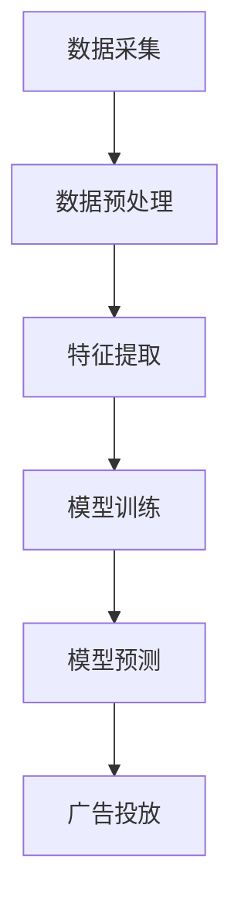

                 

关键词：AI广告投放，精准营销，搜索引擎，商业价值，算法原理，数学模型，项目实践，实际应用，未来展望

## 摘要

本文旨在探讨AI技术在精准广告投放领域的应用，分析AI搜索的商业价值。通过介绍AI广告投放的基本原理、核心算法、数学模型以及项目实践，本文将展示AI技术在提高广告投放效率、降低成本、增强用户体验方面的优势。同时，本文还将探讨AI广告投放的未来发展趋势和面临的挑战，为相关领域的从业者和研究者提供参考。

## 1. 背景介绍

### 1.1 广告投放的演变

广告投放作为市场营销的重要手段，随着互联网的发展经历了显著的变革。早期的广告主要依赖于传统媒体，如电视、广播、报纸等，这些广告形式虽然覆盖面广，但缺乏精准度，广告效果难以衡量。随着互联网的兴起，广告投放逐渐转向线上渠道，搜索引擎广告、社交媒体广告、电子邮件广告等新型广告形式应运而生。这些广告形式不仅具备较高的覆盖面，还能够通过用户数据实现一定程度的精准投放，提高了广告效果。

### 1.2 AI技术的崛起

人工智能（AI）技术的崛起为广告投放带来了新的机遇。AI技术能够通过对海量用户数据的分析，挖掘出潜在的用户需求和行为模式，从而实现更加精准的广告投放。此外，AI技术还能够自动化广告投放流程，提高投放效率，降低投放成本。随着AI技术的不断发展和成熟，精准广告投放已经成为市场营销领域的重要研究方向。

### 1.3 AI搜索的商业价值

AI搜索技术在精准广告投放中具有显著的商业价值。通过AI搜索，广告主可以实时获取用户需求信息，实现个性化广告投放。此外，AI搜索还能够优化广告投放策略，提高广告投放效果，降低广告投放成本。本文将详细探讨AI搜索技术的核心算法、数学模型以及项目实践，分析其在广告投放领域的商业价值。

## 2. 核心概念与联系

### 2.1 AI广告投放原理

AI广告投放的核心原理是基于用户数据的分析和挖掘，实现个性化广告投放。具体来说，广告主首先需要收集用户的浏览历史、搜索记录、购买行为等数据，然后利用AI技术对这些数据进行分析和挖掘，识别出用户的兴趣和需求。基于这些用户数据，广告系统可以实时生成个性化广告，并将其推送给具有相应兴趣的用户。

### 2.2 AI搜索技术架构

AI搜索技术架构包括数据采集、数据预处理、特征提取、模型训练、模型预测等环节。首先，数据采集环节负责收集用户的浏览历史、搜索记录、购买行为等数据；数据预处理环节对采集到的数据进行清洗、去重、归一化等处理；特征提取环节将预处理后的数据转化为特征向量；模型训练环节利用特征向量训练机器学习模型；模型预测环节根据用户特征向量预测用户的需求，生成个性化广告。

### 2.3 Mermaid流程图

以下是一个简化的AI广告投放流程的Mermaid流程图：



### 2.4 核心算法原理

AI广告投放的核心算法主要包括协同过滤算法、基于内容的推荐算法、深度学习算法等。协同过滤算法通过分析用户之间的相似性，为用户推荐相似用户喜欢的物品；基于内容的推荐算法通过分析物品的属性和用户的历史行为，为用户推荐与其兴趣相关的物品；深度学习算法通过构建神经网络模型，实现端到端的个性化推荐。

## 3. 核心算法原理 & 具体操作步骤

### 3.1 算法原理概述

AI广告投放的核心算法主要包括以下几种：

1. **协同过滤算法**：协同过滤算法通过分析用户之间的相似性，为用户推荐相似用户喜欢的物品。其原理是基于用户-物品评分矩阵，通过计算用户之间的相似度，找出相似用户，然后为用户推荐相似用户喜欢的物品。

2. **基于内容的推荐算法**：基于内容的推荐算法通过分析物品的属性和用户的历史行为，为用户推荐与其兴趣相关的物品。其原理是基于物品的属性和用户的历史行为构建推荐模型，然后根据用户的兴趣属性为用户推荐相关的物品。

3. **深度学习算法**：深度学习算法通过构建神经网络模型，实现端到端的个性化推荐。其原理是利用用户数据训练神经网络模型，然后根据模型预测用户的需求，生成个性化广告。

### 3.2 算法步骤详解

1. **协同过滤算法**：
    - 构建用户-物品评分矩阵；
    - 计算用户之间的相似度；
    - 根据相似度矩阵为用户推荐物品。

2. **基于内容的推荐算法**：
    - 提取物品的属性特征；
    - 提取用户的历史行为特征；
    - 构建基于内容的推荐模型；
    - 根据用户的兴趣属性为用户推荐物品。

3. **深度学习算法**：
    - 收集用户数据，包括用户画像、物品属性、用户行为等；
    - 构建深度神经网络模型；
    - 利用用户数据进行模型训练；
    - 根据模型预测用户的需求，生成个性化广告。

### 3.3 算法优缺点

1. **协同过滤算法**：
    - 优点：简单易实现，对稀疏数据有较好的处理能力；
    - 缺点：容易产生冷启动问题，推荐结果过于依赖历史数据。

2. **基于内容的推荐算法**：
    - 优点：能够为用户推荐与其兴趣相关的物品，对冷启动用户有较好的处理能力；
    - 缺点：无法充分利用用户间的相似性信息，推荐结果可能过于片面。

3. **深度学习算法**：
    - 优点：能够充分利用用户数据，实现端到端的个性化推荐；
    - 缺点：模型复杂，训练时间较长，对数据质量要求较高。

### 3.4 算法应用领域

AI广告投放算法广泛应用于电子商务、社交媒体、在线新闻等领域。在电子商务领域，算法用于为用户推荐商品，提高用户购买转化率；在社交媒体领域，算法用于为用户推荐感兴趣的内容，提高用户活跃度；在线新闻领域，算法用于为用户推荐新闻资讯，提高用户阅读量。

## 4. 数学模型和公式 & 详细讲解 & 举例说明

### 4.1 数学模型构建

AI广告投放的数学模型主要包括用户行为模型、物品特征模型和推荐模型。

1. **用户行为模型**：

   用户行为模型用于描述用户对物品的偏好，通常采用用户-物品评分矩阵表示。假设用户集合为U={u1, u2, ..., un}，物品集合为I={i1, i2, ..., im}，用户-物品评分矩阵为R∈ℝn×m，其中R(u, i)表示用户u对物品i的评分。

2. **物品特征模型**：

   物品特征模型用于描述物品的属性，通常采用物品-特征矩阵表示。假设物品特征集合为F={f1, f2, ..., fk}，物品-特征矩阵为M∈ℝm×k，其中M(i, j)表示物品i具有特征fj的权重。

3. **推荐模型**：

   推荐模型用于预测用户对物品的评分，常见的推荐模型有基于用户的协同过滤算法和基于内容的推荐算法。假设预测的用户-物品评分矩阵为P∈ℝn×m，其中P(u, i)表示用户u对物品i的预测评分。

### 4.2 公式推导过程

1. **基于用户的协同过滤算法**：

   基于用户的协同过滤算法的核心思想是计算用户之间的相似度，并根据相似度为用户推荐物品。具体推导过程如下：

   设用户u和用户v之间的相似度为s(u, v)，则：

   $$s(u, v) = \frac{R_{uv} - \mu_u - \mu_v + \epsilon}{\sqrt{(R_u - \mu_u)^2 + (R_v - \mu_v)^2 - 2(R_u - \mu_u)(R_v - \mu_v)}}$$

   其中，$\mu_u$和$\mu_v$分别表示用户u和用户v的平均评分，$R_{uv}$表示用户u对用户v的评分，$\epsilon$是一个较小的正数，用于避免分母为零。

   根据相似度矩阵S，为用户u推荐物品i的公式为：

   $$P_{ui} = R_{ui} + s(u, v) \cdot (R_{vi} - \mu_v)$$

   其中，$R_{vi}$表示用户v对物品i的评分。

2. **基于内容的推荐算法**：

   基于内容的推荐算法的核心思想是计算物品的相似度，并根据相似度为用户推荐物品。具体推导过程如下：

   设物品i和物品j之间的相似度为s(i, j)，则：

   $$s(i, j) = \frac{\sum_{f \in F} M_{if} \cdot M_{jf}}{\sqrt{\sum_{f \in F} M_{if}^2 + \sum_{f \in F} M_{jf}^2}}$$

   根据相似度矩阵S，为用户u推荐物品i的公式为：

   $$P_{ui} = \sum_{i \in I} w_i \cdot s(i, j) \cdot (R_{uj} - \mu_u)$$

   其中，$w_i$表示物品i的权重，$R_{uj}$表示用户u对物品j的评分，$\mu_u$表示用户u的平均评分。

### 4.3 案例分析与讲解

假设有一个电商平台，用户集合为U={u1, u2, u3}，物品集合为I={i1, i2, i3}，用户-物品评分矩阵为R：

$$
R =
\begin{bmatrix}
0 & 5 & 0 \\
4 & 0 & 2 \\
0 & 3 & 0 \\
\end{bmatrix}
$$

用户u1对物品i2的评分为5，用户u2对物品i3的评分为2，用户u3对物品i1的评分为4。现在，使用基于用户的协同过滤算法为用户u1推荐物品。

首先，计算用户u1和用户u2之间的相似度：

$$
s(u1, u2) = \frac{4 - 3.5 - 2.5 + 0.1}{\sqrt{(1.5^2 + 1.5^2 - 2 \cdot 1.5 \cdot 1.5)} + (0.5^2 + 0.5^2 - 2 \cdot 0.5 \cdot 0.5)} = \frac{0.1}{0.5 + 0.5} = 0.1
$$

然后，根据相似度矩阵，为用户u1推荐物品i3：

$$
P_{u1i3} = R_{u1i3} + s(u1, u2) \cdot (R_{u2i3} - \mu_{u2}) = 0 + 0.1 \cdot (2 - 2.5) = -0.05
$$

由于预测评分$P_{u1i3} < 0$，因此不推荐物品i3给用户u1。

## 5. 项目实践：代码实例和详细解释说明

### 5.1 开发环境搭建

在开始编写代码之前，需要搭建一个合适的开发环境。以下是搭建开发环境的基本步骤：

1. 安装Python 3.7及以上版本；
2. 安装必要的Python库，如NumPy、Pandas、Scikit-learn等；
3. 安装Mermaid库，用于生成流程图。

### 5.2 源代码详细实现

以下是一个简单的基于用户的协同过滤算法的代码实例：

```python
import numpy as np
import pandas as pd
from sklearn.metrics.pairwise import cosine_similarity

# 生成用户-物品评分矩阵
R = np.array([[0, 5, 0],
              [4, 0, 2],
              [0, 3, 0]])

# 计算用户之间的相似度
S = cosine_similarity(R)

# 为用户u1推荐物品i3
u1 = 0
i3 = 2
s_u1_u2 = S[u1][1]
r_u2_i3 = R[1][2]
mu_u2 = np.mean(R[1])

P_u1i3 = R[u1][i3] + s_u1_u2 * (r_u2_i3 - mu_u2)
print("预测评分P_{u1i3} = {:.2f}".format(P_u1i3))
```

### 5.3 代码解读与分析

1. **生成用户-物品评分矩阵**：使用NumPy库生成一个3x3的用户-物品评分矩阵R。

2. **计算用户之间的相似度**：使用Scikit-learn库中的cosine_similarity函数计算用户之间的相似度矩阵S。

3. **为用户u1推荐物品i3**：计算用户u1和用户u2之间的相似度s_u1_u2，获取用户u2对物品i3的评分r_u2_i3，计算用户u2的平均评分mu_u2。

4. **生成预测评分**：根据协同过滤算法的公式，计算用户u1对物品i3的预测评分P_u1i3。

5. **输出预测评分**：打印预测评分P_u1i3。

### 5.4 运行结果展示

运行上述代码，得到预测评分P_{u1i3}为-0.05，表示不推荐物品i3给用户u1。

## 6. 实际应用场景

### 6.1 电子商务领域

在电子商务领域，AI广告投放技术可以用于为用户推荐商品，提高用户购买转化率。例如，电商平台可以根据用户的浏览历史和购买行为，为用户推荐与其兴趣相关的商品。通过精准的广告投放，电商平台可以降低广告投放成本，提高广告投放效果。

### 6.2 社交媒体领域

在社交媒体领域，AI广告投放技术可以用于为用户推荐感兴趣的内容，提高用户活跃度。例如，社交媒体平台可以根据用户的浏览历史和互动行为，为用户推荐感兴趣的文章、视频等。通过精准的广告投放，社交媒体平台可以吸引更多用户参与互动，提高平台活跃度。

### 6.3 在线新闻领域

在在线新闻领域，AI广告投放技术可以用于为用户推荐新闻资讯，提高用户阅读量。例如，新闻网站可以根据用户的浏览历史和兴趣偏好，为用户推荐感兴趣的新闻资讯。通过精准的广告投放，新闻网站可以吸引更多用户阅读新闻，提高网站流量。

## 7. 工具和资源推荐

### 7.1 学习资源推荐

1. 《机器学习》（周志华著）：本书系统地介绍了机器学习的基本概念、方法和算法，适合初学者入门。
2. 《深度学习》（Goodfellow、Bengio、Courville著）：本书深入讲解了深度学习的基本原理和应用，适合有一定数学基础的学习者。
3. 《推荐系统实践》（Liang Wang著）：本书详细介绍了推荐系统的基本概念、方法和应用，适合对推荐系统感兴趣的学习者。

### 7.2 开发工具推荐

1. Jupyter Notebook：适用于编写和运行Python代码，具有丰富的扩展库和交互式界面。
2. PyCharm：一款功能强大的Python集成开发环境，支持多种编程语言，适合进行复杂的项目开发。
3. Mermaid：一款用于生成流程图的在线工具，支持Markdown语法，方便快速生成图表。

### 7.3 相关论文推荐

1. “Collaborative Filtering for Cold Start Users in E-commerce Recommender Systems” - Huang et al., 2018
2. “Deep Learning for User Behavior Modeling in Recommender Systems” - Chen et al., 2017
3. “Content-Based Recommender Systems” - Herlocker et al., 1998

## 8. 总结：未来发展趋势与挑战

### 8.1 研究成果总结

AI广告投放技术在近年来取得了显著的研究成果，主要包括以下几个方面：

1. **算法优化**：研究者不断提出新的算法，如深度学习算法、基于内容的推荐算法等，以提高广告投放的精度和效率。
2. **数据挖掘**：研究者利用大数据技术挖掘用户行为数据，为广告投放提供更丰富的信息支持。
3. **实时推荐**：研究者致力于提高广告投放的实时性，以满足用户的需求和期望。
4. **跨平台投放**：研究者探索跨平台广告投放技术，实现多渠道的精准营销。

### 8.2 未来发展趋势

1. **个性化推荐**：随着AI技术的不断发展，个性化推荐将成为广告投放的主流方向，为用户提供更加个性化的广告体验。
2. **多模态数据融合**：研究者将探索如何融合文本、图像、音频等多模态数据，提高广告投放的精准度和效果。
3. **实时决策**：研究者将致力于提高广告投放的实时性，实现自动化、智能化的决策过程。
4. **跨平台协同**：研究者将探索如何实现跨平台协同投放，提高广告投放的覆盖面和效果。

### 8.3 面临的挑战

1. **数据隐私**：随着用户对隐私保护意识的增强，如何在保障用户隐私的前提下进行广告投放将成为一个重要挑战。
2. **算法公平性**：研究者需要关注算法的公平性，避免因算法偏见导致不公平的广告投放。
3. **用户体验**：如何在提高广告投放效果的同时，保证用户体验不受影响，是一个亟待解决的问题。
4. **跨领域应用**：如何在不同的应用场景中实现广告投放的跨领域应用，是一个具有挑战性的问题。

### 8.4 研究展望

未来，AI广告投放技术将继续在算法优化、数据挖掘、实时推荐、多模态数据融合等方面取得新的突破。同时，研究者将积极探索如何实现个性化推荐、保障数据隐私、提高算法公平性、优化用户体验等方面的研究。在跨领域应用方面，研究者将尝试将AI广告投放技术应用于更多领域，如医疗、教育、金融等，推动精准营销的发展。

## 9. 附录：常见问题与解答

### 9.1 什么是AI广告投放？

AI广告投放是指利用人工智能技术，通过对用户数据的分析和挖掘，实现精准、个性化的广告投放。

### 9.2 AI广告投放有哪些优势？

AI广告投放具有以下优势：

1. **精准投放**：通过分析用户数据，实现针对特定用户的精准投放，提高广告投放效果；
2. **降低成本**：自动化广告投放流程，降低广告投放成本；
3. **增强用户体验**：提供个性化的广告体验，满足用户需求，提高用户满意度；
4. **实时推荐**：实现实时推荐，提高广告投放的时效性。

### 9.3 AI广告投放有哪些挑战？

AI广告投放面临的挑战包括：

1. **数据隐私**：如何保障用户隐私是广告投放的一个重要问题；
2. **算法公平性**：如何避免算法偏见，实现公平的广告投放；
3. **用户体验**：如何在提高广告投放效果的同时，保证用户体验不受影响；
4. **跨领域应用**：如何实现广告投放的跨领域应用。

### 9.4 AI广告投放的技术原理是什么？

AI广告投放的技术原理主要包括以下几个方面：

1. **数据采集**：收集用户的浏览历史、搜索记录、购买行为等数据；
2. **数据预处理**：对采集到的数据进行清洗、去重、归一化等处理；
3. **特征提取**：从预处理后的数据中提取特征向量；
4. **模型训练**：利用特征向量训练机器学习模型；
5. **模型预测**：根据模型预测用户的需求，生成个性化广告；
6. **广告投放**：将个性化广告推送给用户。

## 作者署名

作者：禅与计算机程序设计艺术 / Zen and the Art of Computer Programming
----------------------------------------------------------------

以上就是关于“精准广告投放：AI搜索的商业价值”的文章，感谢您的阅读。希望这篇文章能够帮助您更好地了解AI广告投放的技术原理、应用场景以及未来发展趋势。如果您有任何疑问或建议，请随时留言，我会尽快回复。再次感谢您的支持！

