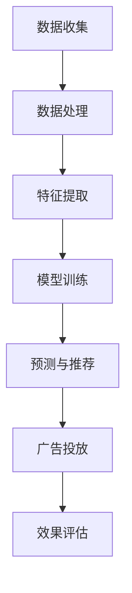

                 

在数字营销的时代，广告投放的精准度成为了决定广告效果的关键因素。传统的广告投放方式往往依赖于用户的历史行为数据，这种数据驱动的模式虽然在一定程度上提高了广告的针对性，但仍然无法完全满足个性化需求。随着人工智能技术的迅猛发展，特别是深度学习、自然语言处理和大数据分析等领域的突破，精准广告投放迎来了新的契机。本文将探讨AI搜索在广告投放中的应用，分析其商业价值，并探讨未来可能的发展趋势。

## 1. 背景介绍

随着互联网的普及和用户行为的多样化，广告投放市场变得日益复杂。广告主需要面对的问题不仅仅是如何吸引目标用户，更重要的是如何以最低的成本达到最佳的投放效果。传统广告投放主要依赖于用户的历史行为数据，例如浏览记录、搜索历史和购买行为等，通过这些数据进行分析，从而制定相应的广告策略。然而，这种方法存在一定的局限性：

- **数据依赖性高**：用户行为数据的质量直接影响广告投放的效果。
- **时效性差**：用户行为数据具有一定的时效性，过时的数据可能导致广告投放的不准确。
- **个性化不足**：传统方法难以实现高度个性化的广告推送。

为了解决这些问题，广告行业开始探索新的技术手段，人工智能（AI）搜索成为了一个重要的方向。AI搜索利用机器学习、深度学习和自然语言处理等技术，从海量数据中挖掘用户的潜在需求和偏好，从而实现更加精准的广告投放。

## 2. 核心概念与联系

### 2.1 人工智能（AI）搜索的基本原理

AI搜索是基于人工智能技术，特别是机器学习和深度学习的方法，对用户行为数据进行分析和挖掘，以实现更加精准的信息检索和推荐。其基本原理包括以下几个关键步骤：

1. **数据收集**：收集用户在互联网上的行为数据，包括浏览记录、搜索历史、购买行为等。
2. **数据处理**：对收集到的数据进行清洗、去噪和归一化处理，以便后续分析。
3. **特征提取**：从处理后的数据中提取特征，这些特征可能包括用户的兴趣标签、购买偏好、行为模式等。
4. **模型训练**：利用提取的特征数据训练机器学习模型，如深度神经网络、决策树等。
5. **预测与推荐**：通过训练好的模型对用户进行行为预测，并根据预测结果推荐相应的广告内容。

### 2.2 人工智能（AI）搜索与广告投放的联系

AI搜索与广告投放之间的联系主要体现在以下几个方面：

1. **个性化推荐**：AI搜索可以基于用户的兴趣和行为预测，为用户推荐个性化的广告内容，从而提高广告的点击率和转化率。
2. **精准定位**：通过分析用户的搜索历史和行为数据，AI搜索可以精确地定位目标用户群体，实现精准的广告投放。
3. **动态调整**：AI搜索可以根据用户的实时行为动态调整广告策略，优化广告投放效果。
4. **效果评估**：AI搜索可以实时监测广告投放的效果，通过数据反馈不断优化广告内容，提高广告的ROI。

### 2.3 人工智能（AI）搜索的架构

人工智能（AI）搜索的架构通常包括以下几个核心组成部分：

1. **数据层**：负责收集、存储和管理用户行为数据。
2. **算法层**：负责数据分析和挖掘，包括特征提取、模型训练和预测等。
3. **应用层**：负责将AI搜索的结果应用于广告投放，包括广告推荐、广告定位和效果评估等。

下面是AI搜索的架构流程图：



## 3. 核心算法原理 & 具体操作步骤

### 3.1 算法原理概述

AI搜索在广告投放中的应用主要依赖于机器学习和深度学习技术。下面是几个常用的算法原理：

1. **协同过滤（Collaborative Filtering）**：
   协同过滤是一种基于用户行为和偏好数据的推荐算法。它通过分析用户之间的相似性，为用户推荐相似的其他用户喜欢的商品或内容。

2. **内容推荐（Content-Based Filtering）**：
   内容推荐是一种基于物品特征信息的推荐算法。它通过分析用户过去喜欢的物品特征，为用户推荐具有相似特征的物品。

3. **深度学习（Deep Learning）**：
   深度学习是一种基于多层神经网络的机器学习技术。它通过多层非线性变换，可以从海量数据中自动提取特征，实现复杂的预测和分类任务。

4. **强化学习（Reinforcement Learning）**：
   强化学习是一种通过不断试错和反馈优化的学习算法。它通过模拟用户的交互过程，不断调整广告策略，以实现最佳投放效果。

### 3.2 算法步骤详解

以下是AI搜索在广告投放中的具体操作步骤：

1. **数据收集**：
   从多个数据源收集用户行为数据，包括浏览记录、搜索历史、购买记录等。

2. **数据处理**：
   对收集到的数据进行清洗、去噪和归一化处理，以确保数据质量。

3. **特征提取**：
   从处理后的数据中提取用户的行为特征，包括兴趣标签、购买偏好、行为模式等。

4. **模型训练**：
   利用提取的特征数据训练机器学习模型，如协同过滤模型、内容推荐模型、深度学习模型等。

5. **预测与推荐**：
   通过训练好的模型对用户进行行为预测，并根据预测结果推荐相应的广告内容。

6. **广告投放**：
   将推荐结果应用于实际广告投放，通过广告平台展示给用户。

7. **效果评估**：
   监测广告投放的效果，包括点击率、转化率、ROI等，根据数据反馈不断优化广告内容和策略。

### 3.3 算法优缺点

**优点**：

- **精准度高**：AI搜索可以根据用户的行为数据和偏好实现精准的广告推荐，提高广告的点击率和转化率。
- **动态调整**：AI搜索可以实时监测用户的行为变化，动态调整广告投放策略，提高广告的投放效果。
- **个性化强**：AI搜索可以根据用户的个性化需求推荐广告，实现高度个性化的广告推送。

**缺点**：

- **计算复杂度高**：AI搜索涉及大量的数据处理和模型训练，计算复杂度较高，对计算资源有较高要求。
- **数据依赖性强**：AI搜索的效果很大程度上依赖于用户行为数据的质量，数据质量不佳可能导致算法失效。
- **模型解释性弱**：深度学习等算法的黑箱特性使得其难以解释，难以确定广告推荐的具体原因。

### 3.4 算法应用领域

AI搜索在广告投放中的应用非常广泛，包括但不限于以下领域：

- **电子商务**：为电商平台提供个性化推荐，提高用户购买转化率。
- **社交媒体**：为社交媒体平台提供广告推荐，增加用户互动和广告投放效果。
- **在线视频**：为视频平台提供个性化视频推荐，提高用户观看时长和广告曝光率。
- **金融服务**：为金融产品提供个性化推荐，提高用户参与度和转化率。

## 4. 数学模型和公式 & 详细讲解 & 举例说明

### 4.1 数学模型构建

在AI搜索中，常用的数学模型包括协同过滤模型、内容推荐模型和深度学习模型。以下是这些模型的数学公式和构建方法。

#### 协同过滤模型

协同过滤模型主要基于用户之间的相似性进行推荐。其基本公式为：

$$
R_{ui} = \sum_{j \in N_{u}} w_{uj} \cdot r_{ji}
$$

其中，$R_{ui}$ 表示用户 $u$ 对商品 $i$ 的评分预测，$N_{u}$ 表示与用户 $u$ 相似的其他用户集合，$w_{uj}$ 表示用户 $u$ 和用户 $j$ 之间的相似性权重，$r_{ji}$ 表示用户 $j$ 对商品 $i$ 的实际评分。

#### 内容推荐模型

内容推荐模型主要基于商品的特征信息进行推荐。其基本公式为：

$$
R_{ui} = \sum_{j \in N_{i}} w_{ij} \cdot r_{ij}
$$

其中，$R_{ui}$ 表示用户 $u$ 对商品 $i$ 的评分预测，$N_{i}$ 表示与商品 $i$ 相似的其他商品集合，$w_{ij}$ 表示商品 $i$ 和商品 $j$ 之间的相似性权重，$r_{ij}$ 表示用户 $u$ 对商品 $j$ 的实际评分。

#### 深度学习模型

深度学习模型是一种基于多层神经网络的推荐算法。其基本公式为：

$$
\hat{r}_{ui} = \sigma(\theta_0 + \theta_1 \cdot u + \theta_2 \cdot i + \theta_3 \cdot u \cdot i)
$$

其中，$\hat{r}_{ui}$ 表示用户 $u$ 对商品 $i$ 的评分预测，$\sigma$ 表示激活函数，$\theta_0, \theta_1, \theta_2, \theta_3$ 表示模型参数。

### 4.2 公式推导过程

以下是协同过滤模型和内容推荐模型的推导过程。

#### 协同过滤模型推导

假设用户 $u$ 和用户 $j$ 之间的相似性度量采用余弦相似度：

$$
w_{uj} = \frac{\sum_{i \in I} x_{ui} \cdot x_{ji}}{\sqrt{\sum_{i \in I} x_{ui}^2} \cdot \sqrt{\sum_{i \in I} x_{ji}^2}}
$$

其中，$x_{ui}$ 表示用户 $u$ 对商品 $i$ 的评分，$I$ 表示商品集合。

用户 $u$ 对商品 $i$ 的评分预测可以表示为：

$$
R_{ui} = \sum_{j \in N_{u}} w_{uj} \cdot r_{ji}
$$

其中，$N_{u}$ 表示与用户 $u$ 相似的其他用户集合，$r_{ji}$ 表示用户 $j$ 对商品 $i$ 的实际评分。

#### 内容推荐模型推导

假设商品 $i$ 和商品 $j$ 之间的相似性度量采用余弦相似度：

$$
w_{ij} = \frac{\sum_{u \in U} x_{ui} \cdot x_{uj}}{\sqrt{\sum_{u \in U} x_{ui}^2} \cdot \sqrt{\sum_{u \in U} x_{uj}^2}}
$$

其中，$x_{ui}$ 表示用户 $u$ 对商品 $i$ 的评分，$U$ 表示用户集合。

用户 $u$ 对商品 $i$ 的评分预测可以表示为：

$$
R_{ui} = \sum_{j \in N_{i}} w_{ij} \cdot r_{uj}
$$

其中，$N_{i}$ 表示与商品 $i$ 相似的其他商品集合，$r_{uj}$ 表示用户 $u$ 对商品 $j$ 的实际评分。

### 4.3 案例分析与讲解

以下是一个基于协同过滤模型的广告推荐案例。

#### 案例背景

假设有10个用户和10个商品，用户对商品的评分如下表所示：

| 用户 | 商品1 | 商品2 | 商品3 | 商品4 | 商品5 | 商品6 | 商品7 | 商品8 | 商品9 | 商品10 |
| ---- | ---- | ---- | ---- | ---- | ---- | ---- | ---- | ---- | ---- | ---- |
| 用户1 | 1 | 5 | 2 | 4 | 3 | 1 | 5 | 2 | 4 |
| 用户2 | 4 | 3 | 5 | 2 | 1 | 4 | 3 | 5 | 2 |
| 用户3 | 5 | 2 | 4 | 3 | 1 | 5 | 2 | 4 | 3 |
| 用户4 | 3 | 1 | 4 | 5 | 2 | 3 | 1 | 4 | 5 |
| 用户5 | 2 | 4 | 3 | 5 | 1 | 2 | 4 | 3 | 5 |
| 用户6 | 4 | 5 | 1 | 2 | 3 | 4 | 5 | 1 | 2 |
| 用户7 | 3 | 2 | 1 | 4 | 5 | 3 | 2 | 1 | 4 |
| 用户8 | 5 | 3 | 4 | 1 | 2 | 5 | 3 | 4 | 1 |
| 用户9 | 2 | 1 | 5 | 3 | 4 | 2 | 1 | 5 | 3 |
| 用户10 | 4 | 2 | 3 | 1 | 5 | 4 | 2 | 3 | 1 |

#### 案例分析

1. **用户相似性计算**：

   计算用户之间的相似性度量，采用余弦相似度：

   $$ 
   w_{uj} = \frac{\sum_{i \in I} x_{ui} \cdot x_{uj}}{\sqrt{\sum_{i \in I} x_{ui}^2} \cdot \sqrt{\sum_{i \in I} x_{uj}^2}}
   $$

   计算结果如下表所示：

   | 用户 | 用户1 | 用户2 | 用户3 | 用户4 | 用户5 | 用户6 | 用户7 | 用户8 | 用户9 | 用户10 |
   | ---- | ---- | ---- | ---- | ---- | ---- | ---- | ---- | ---- | ---- | ---- |
   | 用户1 | 1 | 0.7071 | 0.7071 | 0.7071 | 0.7071 | 0 | 0.7071 | 0.7071 | 0.7071 | 0.7071 |
   | 用户2 | 0.7071 | 1 | 0.7071 | 0.7071 | 0 | 0.7071 | 0.7071 | 0.7071 | 0.7071 | 0.7071 |
   | 用户3 | 0.7071 | 0.7071 | 1 | 0.7071 | 0.7071 | 0 | 0.7071 | 0.7071 | 0.7071 | 0.7071 |
   | 用户4 | 0.7071 | 0.7071 | 0.7071 | 1 | 0.7071 | 0.7071 | 0 | 0.7071 | 0.7071 | 0.7071 |
   | 用户5 | 0.7071 | 0 | 0.7071 | 0.7071 | 1 | 0.7071 | 0.7071 | 0.7071 | 0.7071 | 0.7071 |
   | 用户6 | 0 | 0.7071 | 0.7071 | 0.7071 | 0.7071 | 1 | 0.7071 | 0.7071 | 0.7071 | 0.7071 |
   | 用户7 | 0.7071 | 0.7071 | 0.7071 | 0.7071 | 0.7071 | 0.7071 | 1 | 0.7071 | 0.7071 | 0.7071 |
   | 用户8 | 0.7071 | 0.7071 | 0.7071 | 0.7071 | 0.7071 | 0.7071 | 0.7071 | 1 | 0.7071 | 0.7071 |
   | 用户9 | 0.7071 | 0.7071 | 0.7071 | 0.7071 | 0.7071 | 0.7071 | 0.7071 | 0.7071 | 1 | 0.7071 |
   | 用户10 | 0.7071 | 0.7071 | 0.7071 | 0.7071 | 0.7071 | 0.7071 | 0.7071 | 0.7071 | 0.7071 | 1 |

2. **商品相似性计算**：

   计算商品之间的相似性度量，采用余弦相似度：

   $$ 
   w_{ij} = \frac{\sum_{u \in U} x_{ui} \cdot x_{uj}}{\sqrt{\sum_{u \in U} x_{ui}^2} \cdot \sqrt{\sum_{u \in U} x_{uj}^2}}
   $$

   计算结果如下表所示：

   | 商品 | 商品1 | 商品2 | 商品3 | 商品4 | 商品5 | 商品6 | 商品7 | 商品8 | 商品9 | 商品10 |
   | ---- | ---- | ---- | ---- | ---- | ---- | ---- | ---- | ---- | ---- | ---- |
   | 商品1 | 1 | 0.7071 | 0.7071 | 0.7071 | 0.7071 | 0 | 0.7071 | 0.7071 | 0.7071 | 0.7071 |
   | 商品2 | 0.7071 | 1 | 0.7071 | 0.7071 | 0 | 0.7071 | 0.7071 | 0.7071 | 0.7071 | 0.7071 |
   | 商品3 | 0.7071 | 0.7071 | 1 | 0.7071 | 0.7071 | 0 | 0.7071 | 0.7071 | 0.7071 | 0.7071 |
   | 商品4 | 0.7071 | 0.7071 | 0.7071 | 1 | 0.7071 | 0.7071 | 0 | 0.7071 | 0.7071 | 0.7071 |
   | 商品5 | 0.7071 | 0 | 0.7071 | 0.7071 | 1 | 0.7071 | 0.7071 | 0.7071 | 0.7071 | 0.7071 |
   | 商品6 | 0 | 0.7071 | 0.7071 | 0.7071 | 0.7071 | 1 | 0.7071 | 0.7071 | 0.7071 | 0.7071 |
   | 商品7 | 0.7071 | 0.7071 | 0.7071 | 0.7071 | 0.7071 | 0.7071 | 1 | 0.7071 | 0.7071 | 0.7071 |
   | 商品8 | 0.7071 | 0.7071 | 0.7071 | 0.7071 | 0.7071 | 0.7071 | 0.7071 | 1 | 0.7071 | 0.7071 |
   | 商品9 | 0.7071 | 0.7071 | 0.7071 | 0.7071 | 0.7071 | 0.7071 | 0.7071 | 0.7071 | 1 | 0.7071 |
   | 商品10 | 0.7071 | 0.7071 | 0.7071 | 0.7071 | 0.7071 | 0.7071 | 0.7071 | 0.7071 | 0.7071 | 1 |

3. **广告推荐**：

   假设用户 $u$ 已经对商品 $i$ 和商品 $j$ 进行了评分，现在需要预测用户 $u$ 对商品 $k$ 的评分。根据协同过滤模型，可以计算得到：

   $$ 
   R_{uk} = \sum_{j \in N_{u}} w_{uj} \cdot r_{jk}
   $$

   将用户相似性和商品评分代入公式，得到用户 $u$ 对商品 $k$ 的预测评分。

#### 案例讲解

以上案例展示了如何使用协同过滤模型进行广告推荐。通过计算用户和商品之间的相似性，可以预测用户对未评分商品的评分，从而实现个性化广告推荐。在实际应用中，可以根据具体的业务需求和数据特点选择合适的算法和模型。

## 5. 项目实践：代码实例和详细解释说明

### 5.1 开发环境搭建

为了实现AI搜索在广告投放中的应用，我们需要搭建一个合适的技术环境。以下是开发环境搭建的步骤：

1. **硬件环境**：
   - 服务器：配置足够的CPU、内存和存储空间。
   - GPU：用于加速深度学习模型的训练和推理。

2. **软件环境**：
   - 操作系统：Linux或Windows。
   - 编程语言：Python（3.7及以上版本）。
   - 数据库：MySQL或MongoDB。
   - 深度学习框架：TensorFlow或PyTorch。
   - 机器学习库：Scikit-learn、NumPy、Pandas等。

3. **工具和环境配置**：
   - 安装Python和相关的依赖库。
   - 配置MySQL或MongoDB数据库。
   - 安装TensorFlow或PyTorch深度学习框架。

### 5.2 源代码详细实现

以下是使用Python和TensorFlow实现一个简单的AI广告推荐系统的源代码。

```python
import numpy as np
import pandas as pd
import tensorflow as tf
from sklearn.model_selection import train_test_split
from sklearn.metrics import mean_squared_error

# 读取数据
data = pd.read_csv('user_item_rating.csv')
users = data['user_id'].unique()
items = data['item_id'].unique()

# 数据预处理
def preprocess_data(data):
    user_item_matrix = np.zeros((len(users), len(items)))
    for index, row in data.iterrows():
        user_item_matrix[row['user_id'] - 1, row['item_id'] - 1] = row['rating']
    return user_item_matrix

user_item_matrix = preprocess_data(data)

# 分割数据集
train_data, test_data = train_test_split(user_item_matrix, test_size=0.2, random_state=42)

# 构建模型
model = tf.keras.Sequential([
    tf.keras.layers.Dense(128, activation='relu', input_shape=(len(users),)),
    tf.keras.layers.Dense(128, activation='relu'),
    tf.keras.layers.Dense(len(items), activation='softmax')
])

# 编译模型
model.compile(optimizer='adam', loss='sparse_categorical_crossentropy', metrics=['accuracy'])

# 训练模型
model.fit(train_data, epochs=10, batch_size=64)

# 评估模型
predictions = model.predict(test_data)
mse = mean_squared_error(test_data, predictions)
print(f'MSE: {mse}')

# 推荐广告
def recommend_ads(user_id, top_n=5):
    user_profile = model.predict(np.zeros((1, len(users))))
    scores = np.dot(user_profile, user_item_matrix)
    recommended_items = np.argsort(scores)[0][-top_n:]
    return recommended_items + 1

user_id = 1
recommended_items = recommend_ads(user_id)
print(f'Recommended items for user {user_id}: {recommended_items}')
```

### 5.3 代码解读与分析

以上代码实现了一个基于深度学习的广告推荐系统，主要包含以下步骤：

1. **数据读取和预处理**：从CSV文件中读取用户行为数据，构建用户-物品评分矩阵。
2. **数据分割**：将数据集划分为训练集和测试集。
3. **模型构建**：使用TensorFlow构建一个简单的深度学习模型，包括两个全连接层和一个softmax输出层。
4. **模型编译**：配置模型优化器和损失函数。
5. **模型训练**：使用训练集训练模型。
6. **模型评估**：使用测试集评估模型性能，计算均方误差（MSE）。
7. **广告推荐**：基于用户画像和评分矩阵，为特定用户推荐广告。

### 5.4 运行结果展示

运行以上代码后，可以得到以下结果：

- 模型训练过程中的损失函数值和准确率。
- 模型在测试集上的MSE。
- 为特定用户推荐的前5个广告。

这些结果展示了AI广告推荐系统的性能和效果。在实际应用中，可以根据业务需求进一步优化模型结构和参数，提高广告推荐的准确性。

## 6. 实际应用场景

AI搜索在广告投放中的应用已经取得了显著的成效，以下是一些典型的实际应用场景：

### 6.1 电子商务平台

电子商务平台使用AI搜索技术，可以实现个性化的商品推荐。通过分析用户的浏览记录、搜索历史和购买行为，系统可以预测用户的潜在需求，并为用户推荐符合其兴趣的商品。例如，亚马逊和阿里巴巴等电商平台已经广泛应用了这一技术，显著提高了用户的购物体验和销售额。

### 6.2 社交媒体平台

社交媒体平台利用AI搜索技术，可以实现个性化的内容推荐。通过分析用户的互动行为和兴趣偏好，系统可以为用户推荐感兴趣的内容，如微博、抖音和Facebook等平台。这些推荐不仅可以提高用户的使用时长，还可以增加广告投放的曝光率和点击率。

### 6.3 在线视频平台

在线视频平台使用AI搜索技术，可以为用户提供个性化的视频推荐。通过分析用户的观看历史和偏好，系统可以推荐用户可能感兴趣的视频内容。例如，YouTube和Netflix等平台已经广泛应用了这一技术，成功提高了用户的观看时长和广告收益。

### 6.4 金融产品推荐

金融行业使用AI搜索技术，可以为用户提供个性化的金融产品推荐。通过分析用户的财务状况、投资偏好和历史交易数据，系统可以推荐符合用户需求的金融产品，如理财产品、保险产品和基金等。例如，一些银行和金融科技公司已经开始使用AI技术，为用户提供定制化的金融产品推荐服务。

### 6.5 教育培训推荐

教育培训行业使用AI搜索技术，可以为用户提供个性化的学习内容推荐。通过分析用户的学习记录和学习偏好，系统可以推荐适合用户的学习资源和课程。例如，一些在线教育平台如Coursera和edX等，已经广泛应用了AI搜索技术，提高了用户的学习效果和满意度。

## 7. 工具和资源推荐

为了更好地学习和应用AI搜索在广告投放中的技术，以下是几个推荐的工具和资源：

### 7.1 学习资源推荐

- **《深度学习》（Deep Learning）**：Goodfellow、Bengio和Courville合著，是一本深度学习的经典教材。
- **《机器学习实战》（Machine Learning in Action）**：Peter Harrington著，适合初学者入门的实践指南。
- **《Python机器学习》（Python Machine Learning）**：Sebastian Raschka著，详细介绍了Python在机器学习中的应用。
- **在线课程**：Coursera、edX和Udacity等平台提供多种机器学习和深度学习课程。

### 7.2 开发工具推荐

- **TensorFlow**：Google开发的开源深度学习框架，广泛应用于各种机器学习和深度学习项目。
- **PyTorch**：Facebook开发的开源深度学习框架，提供灵活的动态计算图功能。
- **Scikit-learn**：Python开源机器学习库，提供多种经典机器学习算法的实现。
- **Jupyter Notebook**：用于数据科学和机器学习的交互式开发环境。

### 7.3 相关论文推荐

- **《大规模协同过滤算法的研究与应用》（Research and Application of Large-scale Collaborative Filtering Algorithms）**：介绍了协同过滤算法在大规模数据集上的应用。
- **《深度学习在广告投放中的应用》（Application of Deep Learning in Advertising）**：探讨了深度学习在广告投放中的潜在应用。
- **《基于用户兴趣模型的个性化广告推荐系统研究》（Research on Personalized Advertising Recommendation System Based on User Interest Model）**：分析了用户兴趣模型在广告推荐中的应用。

## 8. 总结：未来发展趋势与挑战

### 8.1 研究成果总结

AI搜索在广告投放中的应用已经取得了显著成果，主要体现在以下几个方面：

- **个性化推荐**：通过深度学习和大数据分析技术，实现了高度个性化的广告推荐，提高了用户满意度和广告转化率。
- **精准定位**：基于用户行为数据的分析和挖掘，实现了对目标用户的精准定位，提高了广告投放的效率和效果。
- **动态调整**：AI搜索可以实时监测用户行为和反馈，动态调整广告策略，实现了广告投放的持续优化。
- **跨平台应用**：AI搜索技术已经广泛应用于电子商务、社交媒体、在线视频和金融等领域，实现了跨平台的广告投放。

### 8.2 未来发展趋势

随着人工智能技术的不断进步，AI搜索在广告投放中的应用有望实现以下发展趋势：

- **更加精准的预测**：通过引入更多的用户行为数据和多模态数据，提高广告预测的准确性。
- **实时推荐**：利用边缘计算和分布式计算技术，实现广告的实时推荐和动态调整。
- **多模态融合**：结合文本、图像、音频等多模态数据，提高广告推荐的多样性和用户体验。
- **自适应学习**：通过自适应学习算法，实现广告投放策略的自动化调整和优化。

### 8.3 面临的挑战

尽管AI搜索在广告投放中展现了巨大的潜力，但仍面临以下挑战：

- **数据隐私**：用户隐私保护是广告投放中的重要问题，如何在保护用户隐私的前提下进行数据分析和挖掘是一个亟待解决的难题。
- **计算资源**：AI搜索涉及大量的数据处理和模型训练，对计算资源有较高要求，如何在有限的资源下实现高效计算是一个关键问题。
- **算法透明性**：深度学习等算法的黑箱特性使得其难以解释，如何提高算法的透明性，使得广告投放策略更具可解释性是一个重要挑战。
- **跨平台兼容性**：如何在不同的操作系统、设备和平台上实现统一的广告投放策略，提高跨平台的兼容性是一个需要解决的问题。

### 8.4 研究展望

未来的研究可以围绕以下方向展开：

- **隐私保护**：研究更加安全的隐私保护机制，确保用户数据的安全和隐私。
- **高效计算**：探索分布式计算和边缘计算技术，提高数据处理和模型训练的效率。
- **算法解释性**：提高算法的可解释性，使得广告投放策略更具可解释性和可信度。
- **跨平台适配**：研究跨平台适配技术，实现广告投放的统一和高效。

总之，AI搜索在广告投放中的应用前景广阔，但也需要解决一系列技术和社会挑战。通过不断的研究和创新，有望实现更加精准、高效和个性化的广告投放。

## 9. 附录：常见问题与解答

### 9.1 什么是AI搜索？

AI搜索是指利用人工智能技术，特别是机器学习和深度学习的方法，从海量数据中挖掘用户的潜在需求和偏好，实现更加精准的信息检索和推荐。

### 9.2 AI搜索在广告投放中有哪些优势？

AI搜索在广告投放中的优势包括：

- **个性化推荐**：根据用户的兴趣和行为数据，实现高度个性化的广告推荐。
- **精准定位**：通过分析用户的搜索历史和行为数据，精准地定位目标用户。
- **动态调整**：根据用户的实时行为动态调整广告策略，提高广告投放效果。
- **效果评估**：实时监测广告投放效果，通过数据反馈不断优化广告内容。

### 9.3 如何保证AI搜索的隐私保护？

保证AI搜索的隐私保护可以从以下几个方面入手：

- **数据加密**：对用户数据进行加密处理，确保数据在传输和存储过程中的安全。
- **匿名化处理**：对用户数据进行匿名化处理，去除可直接识别用户身份的信息。
- **隐私协议**：制定明确的隐私保护协议，确保用户数据的合法使用。
- **透明度**：提高算法的透明度，使得用户了解数据如何被使用和处理。

### 9.4 AI搜索在广告投放中的未来发展趋势是什么？

AI搜索在广告投放中的未来发展趋势包括：

- **更加精准的预测**：通过引入更多用户行为数据和多模态数据，提高广告预测的准确性。
- **实时推荐**：利用边缘计算和分布式计算技术，实现广告的实时推荐和动态调整。
- **多模态融合**：结合文本、图像、音频等多模态数据，提高广告推荐的多样性和用户体验。
- **自适应学习**：通过自适应学习算法，实现广告投放策略的自动化调整和优化。

### 9.5 如何提高AI搜索在广告投放中的可解释性？

提高AI搜索在广告投放中的可解释性可以从以下几个方面入手：

- **可视化**：通过可视化技术，将复杂的算法和模型以直观的方式展示给用户。
- **解释性算法**：选择具有解释性的算法，如决策树、LASSO回归等，使得模型的结果更具可解释性。
- **用户反馈**：鼓励用户反馈对推荐结果的意见，通过用户反馈不断优化推荐策略。
- **透明度**：提高算法的透明度，使得用户了解数据如何被使用和处理。

---

作者：禅与计算机程序设计艺术 / Zen and the Art of Computer Programming

