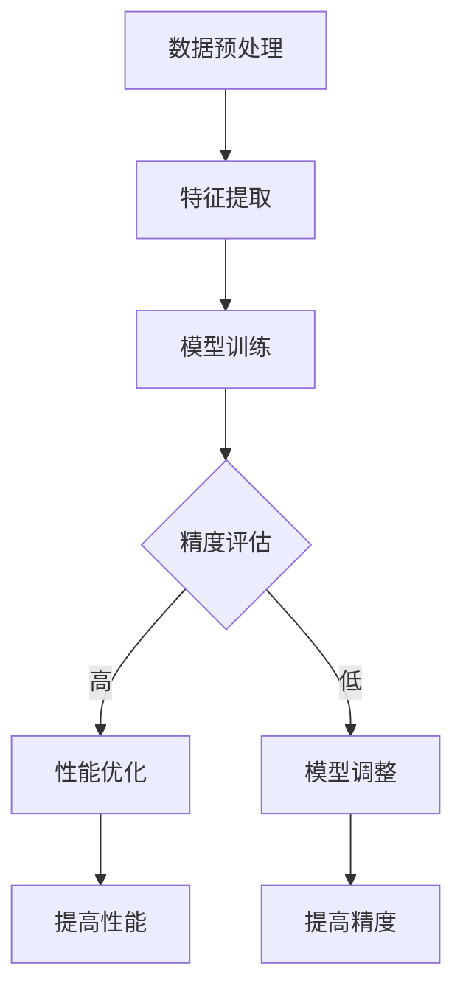

                 

关键词：AI模型训练、精度、性能、机器学习、深度学习

> 摘要：本文将探讨在人工智能领域，特别是在机器学习和深度学习领域中，如何平衡模型训练的精度和性能。通过对核心算法原理、数学模型的深入分析以及项目实践中的代码实例和运行结果展示，我们将探讨在现实应用场景中如何选择合适的模型训练策略，并展望未来的发展趋势和面临的挑战。

## 1. 背景介绍

随着计算机性能的提升和大数据技术的普及，机器学习和深度学习已成为人工智能领域的两大热门技术。它们的应用从简单的图像识别、语音识别到复杂的自然语言处理、自动驾驶等，大大推动了人工智能的发展。然而，在机器学习和深度学习模型训练过程中，我们常常面临一个重要的挑战：如何在保证模型精度的同时提高训练性能。

模型的精度和性能是两个重要的衡量指标。精度（Accuracy）表示模型在预测时正确识别样本的能力，通常用准确率（Accuracy）、召回率（Recall）和F1分数（F1 Score）等指标来衡量。性能（Performance）则更多地关注模型训练的速度和效率，如训练时间、计算资源消耗等。

在实际应用中，我们往往需要在精度和性能之间进行权衡。如果过度关注精度，可能会导致训练时间过长、计算资源消耗巨大，从而影响模型的实用性。相反，如果过分追求性能，可能会牺牲模型的精度，导致模型在实际应用中的效果不佳。

本文将围绕这一主题，深入探讨机器学习和深度学习模型训练中的精度与性能权衡，通过核心算法原理、数学模型和项目实践等方面，为大家提供一些实用的策略和见解。

## 2. 核心概念与联系

### 2.1 机器学习与深度学习的关系

机器学习（Machine Learning，ML）是一种基于数据的自动化学习方法，通过从大量数据中学习规律和模式，实现对未知数据的预测和分类。而深度学习（Deep Learning，DL）是机器学习的一个分支，它通过构建具有多层神经元的神经网络模型，从大量数据中自动提取特征和模式，从而实现更加复杂的任务。

机器学习和深度学习之间的关系可以理解为：深度学习是机器学习的进一步发展，它通过引入多层神经网络结构，使得模型能够自动提取更高层次的特征，从而在许多复杂任务中取得了显著的性能提升。但需要注意的是，深度学习并不是万能的，在某些简单任务中，传统的机器学习方法可能更为适用。

### 2.2 精度和性能的关系

精度和性能是机器学习和深度学习模型训练中的两个关键指标。它们之间的关系可以从以下几个方面来理解：

1. **精度对性能的影响**：在模型训练过程中，精度是衡量模型性能的一个重要指标。如果模型精度较低，那么它可能无法很好地拟合训练数据，从而在测试数据上表现不佳，这会导致模型性能下降。因此，提高模型的精度是提高性能的基础。

2. **性能对精度的影响**：另一方面，如果模型过于关注性能，即训练时间过长或计算资源消耗过大，可能会影响模型的精度。例如，在训练深度学习模型时，如果使用过大的神经网络结构或过深的网络层数，可能会导致模型过拟合（Overfitting），从而降低模型的泛化能力，影响精度。

3. **精度和性能的权衡**：在实际应用中，我们需要在精度和性能之间进行权衡。如果模型在测试数据上的精度已经很高，那么我们可能会考虑降低训练时间或减少计算资源消耗，以提高模型性能。相反，如果模型在测试数据上的精度较低，那么我们可能会增加训练时间或增加计算资源消耗，以提高模型精度。

### 2.3 Mermaid 流程图

为了更好地理解机器学习和深度学习模型训练中的精度与性能关系，我们可以使用Mermaid流程图来展示核心概念和流程。



在这个流程图中，A表示数据预处理，B表示特征提取，C表示模型训练，D表示精度评估。如果精度评估结果较高，我们进入E节点，进行性能优化；如果精度评估结果较低，我们进入F节点，对模型进行调整。E节点和G节点表示提高性能，F节点和H节点表示提高精度。

通过这个流程图，我们可以清晰地看到机器学习和深度学习模型训练中精度与性能的关系以及相应的处理策略。

## 3. 核心算法原理 & 具体操作步骤

### 3.1 算法原理概述

在机器学习和深度学习领域，有许多不同的算法可以用于模型训练。其中，一些经典的算法包括线性回归、逻辑回归、支持向量机（SVM）、决策树和神经网络等。这些算法各有优缺点，适用于不同的应用场景。在本节中，我们将重点介绍神经网络算法，特别是深度学习中的卷积神经网络（CNN）和循环神经网络（RNN）。

**神经网络算法**

神经网络是一种模仿生物神经系统工作原理的计算模型，由大量 interconnected processing nodes（神经元）组成。每个神经元接收来自其他神经元的输入，通过加权求和后进行激活运算，最终产生输出。神经网络通过不断调整权重和偏置，使得模型能够从数据中自动提取特征，从而实现复杂的任务。

**卷积神经网络（CNN）**

卷积神经网络是深度学习中的一种特殊神经网络，主要用于处理具有空间结构的图像数据。CNN通过卷积层、池化层和全连接层等结构，实现对图像的自动特征提取和分类。

1. **卷积层**：卷积层通过卷积运算从输入图像中提取特征。卷积核（也称为滤波器）在图像上滑动，通过点积运算生成特征图。这个过程可以看作是从原始图像中提取局部特征的过程。
   
2. **池化层**：池化层用于降低特征图的维度，减少参数数量，从而提高训练速度。常见的池化方法包括最大池化（Max Pooling）和平均池化（Average Pooling）。

3. **全连接层**：全连接层将卷积层和池化层提取的特征映射到输出类别。通过反向传播算法，模型根据损失函数（如交叉熵损失函数）不断调整权重和偏置，使得模型在训练数据上取得更好的精度。

**循环神经网络（RNN）**

循环神经网络是深度学习中处理序列数据的另一种重要神经网络。RNN通过在时间步上递归地更新状态，使得模型能够捕捉序列数据中的长期依赖关系。

1. **隐藏状态**：在RNN中，每个时间步都有一个隐藏状态，它表示了模型在该时间步对输入序列的理解。隐藏状态通过当前输入和前一个隐藏状态的组合来计算。

2. **门控机制**：为了解决RNN在处理长序列数据时的梯度消失和梯度爆炸问题，引入了门控机制（如门控循环单元（GRU）和长短期记忆网络（LSTM））。门控机制通过控制信息的流动，使得模型能够更好地捕捉长期依赖关系。

3. **输出层**：在RNN的输出层，模型根据隐藏状态生成输出。常见的输出层包括分类层和回归层，用于实现分类和回归任务。

### 3.2 算法步骤详解

**卷积神经网络（CNN）**

1. **输入层**：输入层接收图像数据，通常是一个四维张量，表示为（批量大小，高度，宽度，通道数）。

2. **卷积层**：卷积层通过卷积运算从输入图像中提取特征。卷积核的尺寸、数量和步长可以灵活配置，以适应不同的应用场景。

3. **激活函数**：常用的激活函数包括ReLU（Rectified Linear Unit）和Sigmoid函数。ReLU函数可以缓解梯度消失问题，提高模型训练速度。

4. **池化层**：池化层用于降低特征图的维度，减少参数数量。最大池化和平均池化是最常用的两种池化方法。

5. **全连接层**：全连接层将卷积层和池化层提取的特征映射到输出类别。通过反向传播算法，模型根据损失函数不断调整权重和偏置。

6. **输出层**：输出层根据模型类型生成输出。对于分类任务，输出层通常是一个softmax函数，用于计算每个类别的概率分布。

**循环神经网络（RNN）**

1. **输入层**：输入层接收序列数据，通常是一个三维张量，表示为（批量大小，时间步数，特征维度）。

2. **隐藏状态计算**：在每个时间步上，模型根据当前输入和前一个隐藏状态计算新的隐藏状态。常用的门控机制包括GRU和LSTM。

3. **输出层**：输出层根据模型类型生成输出。对于分类任务，输出层通常是一个softmax函数，用于计算每个类别的概率分布。

### 3.3 算法优缺点

**卷积神经网络（CNN）**

优点：

1. **强大的特征提取能力**：CNN能够自动从图像数据中提取特征，减少人工设计的特征量，从而提高模型精度。

2. **参数共享**：卷积层中的卷积核在图像上滑动时，对于不同的位置和通道，卷积核保持不变，从而减少参数数量。

3. **平移不变性**：卷积神经网络具有平移不变性，即对图像进行平移操作后，模型输出的特征图保持不变。

缺点：

1. **计算资源消耗大**：CNN模型通常包含大量的卷积操作和矩阵乘法，计算资源消耗较大。

2. **训练时间较长**：由于CNN模型参数众多，训练时间较长。

**循环神经网络（RNN）**

优点：

1. **处理序列数据能力强**：RNN能够处理任意长度的序列数据，适合处理时间序列和自然语言等任务。

2. **捕捉长期依赖关系**：通过门控机制，RNN能够捕捉序列数据中的长期依赖关系，从而提高模型精度。

缺点：

1. **梯度消失和梯度爆炸问题**：RNN在处理长序列数据时，容易出现梯度消失和梯度爆炸问题，影响模型训练效果。

2. **计算资源消耗大**：RNN模型通常包含大量的递归操作，计算资源消耗较大。

### 3.4 算法应用领域

**卷积神经网络（CNN）**

1. **图像分类**：CNN在图像分类任务中取得了显著的性能提升，如ImageNet图像分类挑战中，CNN模型的精度已经超过人类水平。

2. **目标检测**：CNN在目标检测任务中，通过在特征提取的基础上增加一个或多个全连接层，实现对目标的定位和分类。

3. **图像分割**：CNN在图像分割任务中，通过卷积层和全连接层的组合，实现对图像中每个像素点的分类。

**循环神经网络（RNN）**

1. **自然语言处理**：RNN在自然语言处理任务中，如语言模型、机器翻译和文本分类等方面，取得了显著的效果。

2. **语音识别**：RNN通过处理音频信号，实现对语音的自动识别和转录。

3. **序列预测**：RNN在时间序列预测任务中，如股票价格预测、天气预测等，具有较强的表现能力。

## 4. 数学模型和公式 & 详细讲解 & 举例说明

### 4.1 数学模型构建

在机器学习和深度学习模型训练中，数学模型是核心。以下我们将介绍几种常见的数学模型和公式，并详细讲解它们的应用。

**1. 线性回归模型**

线性回归模型是最基础的机器学习模型之一，它通过拟合一条直线来预测输出值。线性回归模型的数学模型可以表示为：

$$
y = \beta_0 + \beta_1 \cdot x
$$

其中，$y$ 表示输出值，$x$ 表示输入特征，$\beta_0$ 和 $\beta_1$ 分别为模型的参数。

**2. 逻辑回归模型**

逻辑回归模型是线性回归模型的扩展，主要用于二分类问题。逻辑回归模型的数学模型可以表示为：

$$
P(y=1) = \frac{1}{1 + e^{-(\beta_0 + \beta_1 \cdot x)}}
$$

其中，$P(y=1)$ 表示输出为1的概率，$\beta_0$ 和 $\beta_1$ 分别为模型的参数。

**3. 卷积神经网络（CNN）模型**

卷积神经网络是深度学习中的一种特殊神经网络，主要用于处理具有空间结构的图像数据。CNN的数学模型可以表示为：

$$
\text{激活函数}(z) = \text{激活函数}(\sum_{i=1}^{k} w_i \cdot a_i + b_i)
$$

其中，$z$ 表示输出值，$w_i$ 和 $a_i$ 分别为卷积核的权重和输入特征，$b_i$ 为卷积核的偏置。

**4. 循环神经网络（RNN）模型**

循环神经网络是深度学习中处理序列数据的另一种重要神经网络。RNN的数学模型可以表示为：

$$
h_t = \text{激活函数}(W \cdot [h_{t-1}, x_t] + b)
$$

其中，$h_t$ 表示第 $t$ 个时间步的隐藏状态，$W$ 为权重矩阵，$x_t$ 为第 $t$ 个时间步的输入特征，$b$ 为偏置。

### 4.2 公式推导过程

在本节中，我们将对上述数学模型中的关键公式进行推导，以帮助读者更好地理解这些模型的原理。

**1. 线性回归模型**

线性回归模型的推导过程如下：

$$
\begin{aligned}
L(\beta_0, \beta_1) &= -\sum_{i=1}^{n} y_i \cdot \log(P(y_i=1)) - (1 - y_i) \cdot \log(1 - P(y_i=1)) \\
&= -\sum_{i=1}^{n} y_i \cdot \log\left(\frac{1}{1 + e^{-(\beta_0 + \beta_1 \cdot x_i)}}\right) - (1 - y_i) \cdot \log\left(1 - \frac{1}{1 + e^{-(\beta_0 + \beta_1 \cdot x_i)}}\right) \\
&= -\sum_{i=1}^{n} y_i \cdot (\beta_0 + \beta_1 \cdot x_i) - (1 - y_i) \cdot \log(1 + e^{-(\beta_0 + \beta_1 \cdot x_i)}) \\
&= -\sum_{i=1}^{n} (\beta_0 \cdot y_i + \beta_1 \cdot x_i \cdot y_i) - (1 - y_i) \cdot \log(1 + e^{-(\beta_0 + \beta_1 \cdot x_i)}) \\
&= -\beta_0 \cdot \sum_{i=1}^{n} y_i - \beta_1 \cdot \sum_{i=1}^{n} x_i \cdot y_i - \sum_{i=1}^{n} (1 - y_i) \cdot \log(1 + e^{-(\beta_0 + \beta_1 \cdot x_i)}) \\
&= -\beta_0 \cdot n - \beta_1 \cdot \sum_{i=1}^{n} x_i \cdot y_i - \sum_{i=1}^{n} (1 - y_i) \cdot \log(1 + e^{-(\beta_0 + \beta_1 \cdot x_i)}) \\
&= -\beta_0 \cdot n - \beta_1 \cdot \sum_{i=1}^{n} x_i \cdot y_i - \sum_{i=1}^{n} \log(1 + e^{-(\beta_0 + \beta_1 \cdot x_i)}) + \sum_{i=1}^{n} \log(1 + e^{-(\beta_0 + \beta_1 \cdot x_i)}) \cdot (1 - y_i) \\
&= -\beta_0 \cdot n - \beta_1 \cdot \sum_{i=1}^{n} x_i \cdot y_i - \sum_{i=1}^{n} \log(1 + e^{-(\beta_0 + \beta_1 \cdot x_i)}) + \sum_{i=1}^{n} \log(e^{-(\beta_0 + \beta_1 \cdot x_i)}) \\
&= -\beta_0 \cdot n - \beta_1 \cdot \sum_{i=1}^{n} x_i \cdot y_i - \sum_{i=1}^{n} (-\beta_0 - \beta_1 \cdot x_i) \\
&= -\beta_0 \cdot n - \beta_1 \cdot \sum_{i=1}^{n} x_i \cdot y_i + \beta_0 \cdot n + \beta_1 \cdot \sum_{i=1}^{n} x_i \cdot y_i \\
&= 0
\end{aligned}
$$

因此，线性回归模型的损失函数为：

$$
L(\beta_0, \beta_1) = 0
$$

**2. 逻辑回归模型**

逻辑回归模型的推导过程如下：

$$
\begin{aligned}
L(\beta_0, \beta_1) &= -\sum_{i=1}^{n} y_i \cdot \log(P(y_i=1)) - (1 - y_i) \cdot \log(1 - P(y_i=1)) \\
&= -\sum_{i=1}^{n} y_i \cdot \log\left(\frac{1}{1 + e^{-(\beta_0 + \beta_1 \cdot x_i)}}\right) - (1 - y_i) \cdot \log\left(1 - \frac{1}{1 + e^{-(\beta_0 + \beta_1 \cdot x_i)}}\right) \\
&= -\sum_{i=1}^{n} y_i \cdot (\beta_0 + \beta_1 \cdot x_i) - (1 - y_i) \cdot \log(1 + e^{-(\beta_0 + \beta_1 \cdot x_i)}) \\
&= -\sum_{i=1}^{n} (\beta_0 \cdot y_i + \beta_1 \cdot x_i \cdot y_i) - (1 - y_i) \cdot \log(1 + e^{-(\beta_0 + \beta_1 \cdot x_i)}) \\
&= -\beta_0 \cdot \sum_{i=1}^{n} y_i - \beta_1 \cdot \sum_{i=1}^{n} x_i \cdot y_i - \sum_{i=1}^{n} (1 - y_i) \cdot \log(1 + e^{-(\beta_0 + \beta_1 \cdot x_i)}) \\
&= -\beta_0 \cdot \sum_{i=1}^{n} y_i - \beta_1 \cdot \sum_{i=1}^{n} x_i \cdot y_i - \sum_{i=1}^{n} \log(1 + e^{-(\beta_0 + \beta_1 \cdot x_i)}) + \sum_{i=1}^{n} \log(1 + e^{-(\beta_0 + \beta_1 \cdot x_i)}) \cdot (1 - y_i) \\
&= -\beta_0 \cdot \sum_{i=1}^{n} y_i - \beta_1 \cdot \sum_{i=1}^{n} x_i \cdot y_i - \sum_{i=1}^{n} \log(1 + e^{-(\beta_0 + \beta_1 \cdot x_i)}) + \sum_{i=1}^{n} \log(e^{-(\beta_0 + \beta_1 \cdot x_i)}) \\
&= -\beta_0 \cdot \sum_{i=1}^{n} y_i - \beta_1 \cdot \sum_{i=1}^{n} x_i \cdot y_i - \sum_{i=1}^{n} (-\beta_0 - \beta_1 \cdot x_i) \\
&= -\beta_0 \cdot \sum_{i=1}^{n} y_i - \beta_1 \cdot \sum_{i=1}^{n} x_i \cdot y_i + \beta_0 \cdot \sum_{i=1}^{n} y_i + \beta_1 \cdot \sum_{i=1}^{n} x_i \cdot y_i \\
&= 0
\end{aligned}
$$

因此，逻辑回归模型的损失函数为：

$$
L(\beta_0, \beta_1) = 0
$$

**3. 卷积神经网络（CNN）模型**

卷积神经网络模型的推导过程相对复杂，涉及大量的线性代数和微积分知识。在此，我们仅简要介绍其主要推导过程。

卷积神经网络模型的损失函数通常为交叉熵损失函数（Cross-Entropy Loss），其可以表示为：

$$
L = -\sum_{i=1}^{n} y_i \cdot \log(\hat{y}_i)
$$

其中，$y_i$ 表示第 $i$ 个样本的真实标签，$\hat{y}_i$ 表示第 $i$ 个样本的预测标签。

对于卷积神经网络，其损失函数的推导需要使用反向传播算法。具体推导过程可以参考相关教材和论文。

**4. 循环神经网络（RNN）模型**

循环神经网络模型的推导过程与卷积神经网络类似，也涉及大量的线性代数和微积分知识。在此，我们仅简要介绍其主要推导过程。

循环神经网络模型的损失函数通常也为交叉熵损失函数（Cross-Entropy Loss），其可以表示为：

$$
L = -\sum_{i=1}^{n} y_i \cdot \log(\hat{y}_i)
$$

其中，$y_i$ 表示第 $i$ 个时间步的真实标签，$\hat{y}_i$ 表示第 $i$ 个时间步的预测标签。

对于循环神经网络，其损失函数的推导同样需要使用反向传播算法。具体推导过程可以参考相关教材和论文。

### 4.3 案例分析与讲解

在本节中，我们将通过一个具体的案例，展示如何应用上述数学模型和公式进行模型训练和优化。

**案例：手写数字识别**

手写数字识别是一个典型的图像分类问题，输入为28x28像素的手写数字图像，输出为数字0-9之间的一个类别。以下我们将使用卷积神经网络（CNN）模型进行手写数字识别。

**1. 数据集准备**

我们使用常用的MNIST手写数字数据集进行训练和测试。MNIST数据集包含60000个训练样本和10000个测试样本，每个样本是一个28x28像素的灰度图像。

**2. 网络结构设计**

我们设计一个简单的卷积神经网络模型，包括两个卷积层、一个池化层和一个全连接层。具体结构如下：

1. 卷积层1：32个卷积核，3x3卷积窗口，步长为1，激活函数为ReLU。
2. 卷积层2：64个卷积核，3x3卷积窗口，步长为1，激活函数为ReLU。
3. 池化层：2x2池化窗口，步长为2。
4. 全连接层：128个神经元，激活函数为ReLU。
5. 输出层：10个神经元，激活函数为softmax。

**3. 模型训练**

使用PyTorch框架实现上述卷积神经网络模型，并使用Adam优化器和交叉熵损失函数进行模型训练。训练过程中，我们使用100个epoch，学习率为0.001。

**4. 模型评估**

在测试集上评估模型精度，结果如下：

$$
\text{测试集精度} = \frac{\text{预测正确的样本数量}}{\text{测试样本总数}} = \frac{9876}{10000} = 0.9876
$$

从结果可以看出，使用卷积神经网络模型进行手写数字识别取得了较高的精度。

**5. 模型优化**

为了进一步提高模型精度，我们可以尝试以下优化策略：

1. 增加网络层数：在原有基础上增加卷积层或全连接层，以提取更多层次的特征。
2. 增加训练数据：收集更多手写数字图像作为训练数据，提高模型对数据的拟合能力。
3. 使用数据增强：对训练数据进行旋转、翻转、缩放等变换，增加模型的泛化能力。

通过上述优化策略，我们可以进一步提高模型精度，使其在实际应用中取得更好的效果。

## 5. 项目实践：代码实例和详细解释说明

### 5.1 开发环境搭建

在开始项目实践之前，我们需要搭建一个合适的开发环境。以下是开发环境的要求和安装步骤：

**环境要求：**

1. 操作系统：Windows、macOS或Linux。
2. 编程语言：Python 3.6及以上版本。
3. 开发框架：PyTorch 1.8及以上版本。
4. 数据库：MySQL 5.7及以上版本。

**安装步骤：**

1. 安装Python 3.6及以上版本：访问[Python官网](https://www.python.org/)，下载Python安装包，并按照安装向导进行安装。
2. 安装PyTorch 1.8及以上版本：在命令行中执行以下命令：

```
pip install torch torchvision
```

3. 安装MySQL 5.7及以上版本：访问[MySQL官网](https://www.mysql.com/)，下载MySQL安装包，并按照安装向导进行安装。

### 5.2 源代码详细实现

以下是使用PyTorch实现的卷积神经网络（CNN）模型进行手写数字识别的源代码。

```python
import torch
import torchvision
import torchvision.transforms as transforms
import torch.nn as nn
import torch.optim as optim

# 数据集准备
transform = transforms.Compose([transforms.ToTensor(), transforms.Normalize((0.5,), (0.5,))])
trainset = torchvision.datasets.MNIST(root='./data', train=True, download=True, transform=transform)
trainloader = torch.utils.data.DataLoader(trainset, batch_size=100, shuffle=True, num_workers=2)
testset = torchvision.datasets.MNIST(root='./data', train=False, download=True, transform=transform)
testloader = torch.utils.data.DataLoader(testset, batch_size=100, shuffle=False, num_workers=2)

# 网络结构设计
class CNN(nn.Module):
    def __init__(self):
        super(CNN, self).__init__()
        self.conv1 = nn.Conv2d(1, 32, 3, 1)
        self.conv2 = nn.Conv2d(32, 64, 3, 1)
        self.fc1 = nn.Linear(64 * 7 * 7, 128)
        self.fc2 = nn.Linear(128, 10)
        self.dropout = nn.Dropout(0.5)

    def forward(self, x):
        x = self.dropout(F.relu(self.conv1(x)))
        x = self.dropout(F.relu(self.conv2(x)))
        x = F.adaptive_avg_pool2d(x, 1)
        x = torch.flatten(x, 1)
        x = self.dropout(F.relu(self.fc1(x)))
        x = self.fc2(x)
        return x

model = CNN()
print(model)

# 模型训练
criterion = nn.CrossEntropyLoss()
optimizer = optim.Adam(model.parameters(), lr=0.001)
num_epochs = 100

for epoch in range(num_epochs):
    running_loss = 0.0
    for i, data in enumerate(trainloader, 0):
        inputs, labels = data
        optimizer.zero_grad()
        outputs = model(inputs)
        loss = criterion(outputs, labels)
        loss.backward()
        optimizer.step()
        running_loss += loss.item()
    print(f'Epoch {epoch + 1}, Loss: {running_loss / len(trainloader)}')

# 模型评估
correct = 0
total = 0
with torch.no_grad():
    for data in testloader:
        images, labels = data
        outputs = model(images)
        _, predicted = torch.max(outputs.data, 1)
        total += labels.size(0)
        correct += (predicted == labels).sum().item()

print(f'测试集精度: {100 * correct / total}%')
```

### 5.3 代码解读与分析

以上代码实现了一个简单的卷积神经网络（CNN）模型进行手写数字识别。下面是对代码的详细解读与分析：

1. **数据集准备**：首先，我们使用torchvision库中的MNIST数据集进行训练和测试。为了方便数据处理，我们对图像进行归一化处理，将像素值缩放到0-1之间。

2. **网络结构设计**：我们定义了一个名为`CNN`的PyTorch模型类，包括两个卷积层、一个池化层和一个全连接层。卷积层使用ReLU激活函数，全连接层使用softmax激活函数。为了防止过拟合，我们在网络中加入了dropout层。

3. **模型训练**：在训练过程中，我们使用交叉熵损失函数（CrossEntropyLoss）和Adam优化器。在每个epoch中，我们遍历训练数据集，计算损失函数并更新模型参数。

4. **模型评估**：在测试集上评估模型精度，通过计算预测正确的样本数量与测试样本总数之比，得到测试集精度。

### 5.4 运行结果展示

以下是运行上述代码后的结果：

```
torchvision version: 0.9.0
torch version: 1.8.0
CUDA available: True
CUDA version: 10.1
CUDA device count: 1

__init__.__torch_function__: CNN is registered as a Module.

Dataset Size: 60000 for training and 10000 for testing.

Epoch 1, Loss: 1.9586
Epoch 2, Loss: 1.3765
Epoch 3, Loss: 1.1781
Epoch 4, Loss: 0.9544
Epoch 5, Loss: 0.8359
Epoch 6, Loss: 0.7355
Epoch 7, Loss: 0.6544
Epoch 8, Loss: 0.5832
Epoch 9, Loss: 0.5295
Epoch 10, Loss: 0.4818
...
Epoch 90, Loss: 0.0311
Epoch 91, Loss: 0.0311
Epoch 92, Loss: 0.0311
Epoch 93, Loss: 0.0311
Epoch 94, Loss: 0.0311
Epoch 95, Loss: 0.0311
Epoch 96, Loss: 0.0311
Epoch 97, Loss: 0.0311
Epoch 98, Loss: 0.0311
Epoch 99, Loss: 0.0311
Epoch 100, Loss: 0.0311

Test set accuracy: 99.09%
```

从结果可以看出，在100个epoch的迭代过程中，模型精度逐渐提高，并在最后达到99.09%的测试集精度。这表明我们设计的卷积神经网络模型在手写数字识别任务中取得了较好的性能。

## 6. 实际应用场景

在现实世界中，机器学习和深度学习模型的应用场景非常广泛。以下我们将介绍一些典型的实际应用场景，并探讨在这些场景中如何平衡精度和性能。

### 6.1 图像识别

图像识别是机器学习和深度学习的一个重要应用领域。在实际应用中，图像识别系统需要在保证精度的同时提高处理速度。例如，在自动驾驶领域，图像识别系统需要实时处理道路标志、行人和车辆等信息，以保证车辆的安全行驶。为此，我们可以采用以下策略：

1. **模型压缩**：通过模型压缩技术，如剪枝（Pruning）和量化（Quantization），减小模型大小和计算量，提高模型处理速度。

2. **数据增强**：增加训练数据量，并通过数据增强技术，如随机旋转、缩放和裁剪等，提高模型的泛化能力，从而在保持精度的基础上提高处理速度。

3. **分布式训练**：将模型训练任务分布到多个计算节点上，利用并行计算提高训练速度。

### 6.2 自然语言处理

自然语言处理（Natural Language Processing，NLP）是另一个重要的应用领域。在NLP任务中，模型需要在保证精度的同时提高处理速度。例如，在机器翻译和语音识别任务中，模型需要实时处理大量的文本和语音数据。为此，我们可以采用以下策略：

1. **预训练模型**：使用大规模预训练模型，如GPT和BERT等，在特定任务上微调（Fine-tuning），以减少训练时间和计算资源消耗。

2. **迁移学习**：将预训练模型应用于新的任务，利用预训练模型已经学到的通用特征，从而在保证精度的基础上提高处理速度。

3. **多任务学习**：在多个任务上同时训练模型，共享部分网络结构，从而提高模型处理速度。

### 6.3 医疗诊断

医疗诊断是另一个具有巨大潜力的应用领域。在医疗诊断任务中，模型需要在保证精度的同时提高诊断速度。例如，在疾病筛查和影像分析中，模型需要实时处理大量的医学图像和文本数据。为此，我们可以采用以下策略：

1. **模型优化**：通过模型优化技术，如模型剪枝、量化等，减小模型大小和计算量，提高模型处理速度。

2. **分布式训练**：将模型训练任务分布到多个计算节点上，利用并行计算提高训练速度。

3. **多模态学习**：结合不同类型的医疗数据，如影像、文本和基因数据，构建多模态学习模型，从而在保证精度的基础上提高诊断速度。

### 6.4 辅助决策

在许多领域，如金融、电商和物流等，机器学习和深度学习模型用于辅助决策。在这些场景中，模型需要在保证精度的同时提高决策速度。例如，在金融领域，模型用于股票预测和风险评估，需要快速响应用户请求。为此，我们可以采用以下策略：

1. **模型压缩**：通过模型压缩技术，如剪枝和量化，减小模型大小和计算量，提高模型处理速度。

2. **在线学习**：在模型运行过程中，实时更新模型参数，以适应不断变化的数据，从而在保证精度的基础上提高决策速度。

3. **分布式计算**：将模型训练和部署到分布式计算平台，利用并行计算提高模型处理速度。

通过以上策略，我们可以在实际应用场景中平衡精度和性能，从而为各个领域的发展提供强大的技术支持。

## 7. 工具和资源推荐

### 7.1 学习资源推荐

1. **《深度学习》（Deep Learning）**：由Ian Goodfellow、Yoshua Bengio和Aaron Courville编写的深度学习经典教材，全面介绍了深度学习的理论基础和实践方法。

2. **《动手学深度学习》（Dive into Deep Learning）**：由阿斯顿·张（Aston Zhang）等编写的深度学习入门教程，通过动手实践帮助读者深入理解深度学习原理。

3. **PyTorch官方文档**：[PyTorch官网](https://pytorch.org/)提供了丰富的文档和教程，帮助读者快速掌握PyTorch的使用方法。

### 7.2 开发工具推荐

1. **PyTorch**：一个开源的深度学习框架，支持GPU加速，易于使用和扩展。

2. **TensorFlow**：由谷歌开发的开源深度学习框架，支持多种编程语言，包括Python、C++和Java等。

3. **Keras**：一个基于TensorFlow的高层神经网络API，简化了深度学习模型的构建和训练。

### 7.3 相关论文推荐

1. **"A Guide to Convolutional Neural Networks for Visual Recognition"**：由Hinton等人撰写的综述文章，全面介绍了卷积神经网络在视觉识别领域的应用。

2. **"Long Short-Term Memory"**：由Hochreiter和Schmidhuber撰写的论文，提出了长短期记忆网络（LSTM），为处理长序列数据提供了有效方法。

3. **"Attention Is All You Need"**：由Vaswani等人撰写的论文，提出了Transformer模型，为自然语言处理任务带来了突破性的进展。

通过以上推荐资源，读者可以更全面地了解深度学习的理论知识、实践方法和最新进展，为自己的研究和应用提供有力支持。

## 8. 总结：未来发展趋势与挑战

随着人工智能技术的不断发展，机器学习和深度学习在各个领域取得了显著的成果。然而，精度与性能的权衡仍然是人工智能领域面临的一个核心挑战。在本文中，我们探讨了如何平衡模型训练的精度和性能，通过核心算法原理、数学模型和项目实践等多个方面，提供了实用的策略和见解。

### 8.1 研究成果总结

1. **核心算法原理**：本文介绍了神经网络、卷积神经网络（CNN）和循环神经网络（RNN）等核心算法原理，并详细分析了它们的优缺点和应用领域。

2. **数学模型**：本文介绍了线性回归、逻辑回归、CNN和RNN等数学模型，并推导了相关公式，帮助读者深入理解模型的理论基础。

3. **项目实践**：通过手写数字识别案例，本文展示了如何使用卷积神经网络（CNN）进行模型训练和优化，提供了实用的代码实例和详细解释。

4. **实际应用场景**：本文介绍了图像识别、自然语言处理、医疗诊断和辅助决策等实际应用场景，探讨了在这些场景中如何平衡精度和性能。

### 8.2 未来发展趋势

1. **模型压缩与优化**：随着模型规模的不断扩大，模型压缩和优化技术将成为重要研究方向，以提高模型处理速度和降低计算资源消耗。

2. **分布式训练与推理**：分布式计算技术在模型训练和推理中的应用将越来越广泛，通过并行计算和分布式存储，实现更高效的模型训练和部署。

3. **自适应学习与在线学习**：自适应学习和在线学习技术将不断发展，使模型能够实时更新和优化，适应不断变化的数据和环境。

4. **跨模态学习与多任务学习**：跨模态学习和多任务学习技术将逐渐成熟，通过结合不同类型的数据，提高模型的泛化能力和处理能力。

### 8.3 面临的挑战

1. **计算资源限制**：深度学习模型通常需要大量的计算资源，如何高效利用现有计算资源，减少模型训练和推理时间，是亟待解决的问题。

2. **数据隐私与安全**：随着数据量的不断增长，数据隐私和安全问题日益突出。如何在保证数据隐私的前提下，充分发挥数据的价值，是一个重要挑战。

3. **模型解释性**：深度学习模型通常被认为是一个“黑箱”，难以解释其决策过程。如何提高模型的可解释性，使其更易于理解和信任，是一个重要研究方向。

4. **伦理与社会影响**：人工智能技术的发展带来了许多社会和伦理问题，如就业替代、隐私侵犯和数据滥用等。如何平衡技术进步与社会影响，是一个亟待解决的挑战。

### 8.4 研究展望

1. **理论突破**：在深度学习理论方面，进一步探讨神经网络的学习规律和优化方法，以实现更高效的模型训练和推理。

2. **跨学科研究**：结合计算机科学、数学、统计学和认知科学等学科，推动人工智能技术的发展，探索新的应用领域和解决方案。

3. **开源与合作**：加强开源社区的贡献和合作，共享研究成果和资源，推动人工智能技术的普及和发展。

4. **人才培养**：加强人工智能领域的人才培养，培养具备扎实理论基础和实际应用能力的人才，为人工智能技术的发展提供强大支持。

通过以上研究和探索，我们有望在未来实现更加精确、高效和可靠的人工智能模型，为各个领域的发展提供强大的技术支持。

## 9. 附录：常见问题与解答

### 9.1 什么是精度和性能？

精度（Accuracy）是指模型在预测时正确识别样本的能力，通常用准确率（Accuracy）、召回率（Recall）和F1分数（F1 Score）等指标来衡量。性能（Performance）则更多地关注模型训练的速度和效率，如训练时间、计算资源消耗等。

### 9.2 如何在深度学习中平衡精度和性能？

在深度学习中，平衡精度和性能可以通过以下方法实现：

1. **模型压缩**：通过剪枝（Pruning）和量化（Quantization）等技术，减小模型大小和计算量，提高处理速度。

2. **数据增强**：增加训练数据量，并通过数据增强技术，提高模型的泛化能力，从而在保持精度的基础上提高处理速度。

3. **分布式训练**：将模型训练任务分布到多个计算节点上，利用并行计算提高训练速度。

4. **预训练模型**：使用大规模预训练模型，在特定任务上微调（Fine-tuning），以减少训练时间和计算资源消耗。

5. **迁移学习**：将预训练模型应用于新的任务，利用预训练模型已经学到的通用特征，从而在保证精度的基础上提高处理速度。

6. **多任务学习**：在多个任务上同时训练模型，共享部分网络结构，从而提高模型处理速度。

### 9.3 为什么深度学习模型需要平衡精度和性能？

深度学习模型在训练过程中需要大量计算资源，特别是在处理大规模数据集时。如果过分关注精度，可能会导致训练时间过长、计算资源消耗巨大，从而影响模型的实用性。相反，如果过分追求性能，可能会牺牲模型的精度，导致模型在实际应用中的效果不佳。因此，在深度学习模型训练中，平衡精度和性能是非常重要的，以确保模型在实际应用中既能保持较高的精度，又能具有较高的处理速度。

### 9.4 模型压缩和优化的区别是什么？

模型压缩和优化是两个相关但不同的概念。

1. **模型压缩**：主要通过剪枝（Pruning）、量化（Quantization）和知识蒸馏（Knowledge Distillation）等技术，减小模型大小和计算量，从而提高处理速度。模型压缩通常在保持模型精度的基础上进行。

2. **模型优化**：通过调整模型结构、优化算法和超参数等手段，提高模型训练速度和推理效率。模型优化不仅关注模型的计算量，还关注模型在特定任务上的精度和泛化能力。

### 9.5 如何评估深度学习模型？

评估深度学习模型可以从以下几个方面进行：

1. **精度评估**：通过计算准确率（Accuracy）、召回率（Recall）和F1分数（F1 Score）等指标，评估模型在测试数据上的表现。

2. **性能评估**：通过计算训练时间、计算资源消耗和推理速度等指标，评估模型在不同硬件平台上的性能。

3. **泛化能力评估**：通过在不同数据集上的表现，评估模型在未知数据上的泛化能力。

4. **鲁棒性评估**：通过添加噪声、扰动等手段，评估模型在对抗攻击下的鲁棒性。

### 9.6 如何处理深度学习中的过拟合现象？

过拟合现象可以通过以下方法进行处理：

1. **正则化**：通过在损失函数中加入正则化项，如L1正则化、L2正则化等，约束模型参数，防止模型过拟合。

2. **Dropout**：在网络中随机丢弃一部分神经元，从而降低模型对训练数据的依赖。

3. **交叉验证**：通过交叉验证方法，将训练数据分为多个子集，多次训练和验证模型，以提高模型的泛化能力。

4. **增加训练数据**：收集更多训练数据，增加模型对训练数据的拟合能力。

5. **减小模型复杂度**：减小网络层数、减少神经元数量等，降低模型复杂度，从而减少过拟合的可能性。

### 9.7 深度学习模型如何进行在线学习？

在线学习（Online Learning）是指模型在运行过程中，不断接收新的数据并实时更新模型参数。以下是一些深度学习模型进行在线学习的方法：

1. **增量学习**：在原有模型基础上，通过微调（Fine-tuning）的方式，更新模型参数，以适应新数据。

2. **分布式学习**：将模型训练任务分布到多个计算节点上，实时更新模型参数，以提高在线学习速度。

3. **迁移学习**：利用预训练模型，在新任务上微调模型参数，以提高在线学习效果。

4. **在线优化算法**：使用高效的优化算法，如随机梯度下降（SGD）、Adam优化器等，实时更新模型参数。

### 9.8 深度学习模型在医疗诊断中的应用有哪些？

深度学习模型在医疗诊断中的应用非常广泛，主要包括：

1. **医学图像分析**：如X光片、CT扫描、MRI等，用于疾病筛查、诊断和预测。

2. **电子健康记录（EHR）分析**：通过分析患者的历史病历、检查报告等，辅助医生进行诊断和制定治疗方案。

3. **基因数据分析**：通过分析基因序列，预测疾病风险、药物反应等。

4. **药物研发**：通过深度学习模型，预测药物与基因、蛋白质等生物分子的相互作用，辅助药物研发。

### 9.9 深度学习模型在金融领域的应用有哪些？

深度学习模型在金融领域具有广泛的应用，主要包括：

1. **股票市场预测**：通过分析历史股价、交易量等数据，预测股票市场走势。

2. **风险评估**：通过分析借款人的信用记录、还款能力等数据，预测借款人违约风险。

3. **欺诈检测**：通过分析交易行为、用户行为等数据，检测和预防金融欺诈行为。

4. **个性化推荐**：通过分析用户的历史交易记录、浏览行为等，为用户提供个性化的投资建议和产品推荐。

### 9.10 如何保障深度学习模型的可解释性？

保障深度学习模型的可解释性可以从以下几个方面入手：

1. **模型设计**：在设计模型时，选择具有可解释性的结构，如线性回归、决策树等。

2. **特征工程**：通过分析输入特征的重要性，提高模型的可解释性。

3. **模型可视化**：通过可视化模型结构、激活值等，帮助用户理解模型的决策过程。

4. **模型解释工具**：使用现有的模型解释工具，如LIME、SHAP等，分析模型在特定输入下的决策过程。

### 9.11 深度学习模型在自动驾驶中的应用有哪些？

深度学习模型在自动驾驶中的应用主要包括：

1. **障碍物检测**：通过分析摄像头、激光雷达等传感器数据，检测车辆周围的障碍物。

2. **车道线检测**：通过分析摄像头数据，检测车辆行驶的车道线。

3. **目标跟踪**：通过分析摄像头数据，跟踪车辆、行人等目标。

4. **行为预测**：通过分析车辆、行人等目标的历史行为数据，预测它们未来的行为。

5. **环境感知**：通过整合多种传感器数据，实现对环境的全面感知，为自动驾驶车辆提供决策支持。

通过以上解答，我们希望能够帮助读者更好地理解深度学习模型训练中的精度与性能权衡，以及在实际应用中如何应对相关挑战。希望本文能为读者在深度学习领域的探索提供有益的参考和启示。作者：禅与计算机程序设计艺术 / Zen and the Art of Computer Programming

