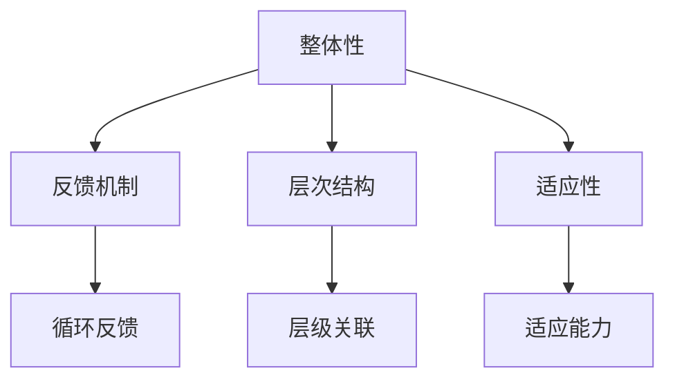

                 

关键词：系统思维，复杂性，管理者，问题解决，架构设计，决策分析，管理实践，技术领导

> 摘要：本文深入探讨了系统思维在管理者应对复杂问题中的作用。通过分析系统思维的核心概念、方法论及其在技术管理中的应用，文章旨在为管理者提供一套有效的思维工具，以应对现代信息技术领域的复杂挑战。

## 1. 背景介绍

在现代信息技术的迅猛发展背景下，企业管理者面临着前所未有的复杂性。从大数据、云计算到人工智能，技术领域的变革不断涌现，企业必须快速适应和应对这些变化。然而，传统的线性思维模式往往难以解决这些复杂问题，管理者需要一种新的思维方式——系统思维。

系统思维是一种整体的、综合的思维方式，强调将系统视为一个整体，关注系统内部各个组成部分之间的相互作用和反馈机制。这种思维方式有助于管理者更全面、更深入地理解复杂问题，从而做出更为明智的决策。

## 2. 核心概念与联系

### 2.1 系统思维概述

系统思维的核心概念包括：整体性、反馈机制、层次结构、适应性等。整体性强调将系统视为一个统一的整体，而不仅仅是各个部分的简单叠加。反馈机制则关注系统内部各组成部分之间的相互作用和循环反馈。层次结构则帮助管理者理解系统的不同层级和层次之间的关联。适应性则强调系统在面对外部变化时的调整能力。

### 2.2 Mermaid 流程图



## 3. 核心算法原理 & 具体操作步骤

### 3.1 算法原理概述

系统思维在实际应用中，往往需要借助一些算法和工具来帮助管理者分析复杂问题。其中，关键路径分析、系统动力学和复杂网络分析是常用的算法。

关键路径分析用于识别项目中的关键任务和路径，以优化项目进度和资源分配。系统动力学则用于模拟系统内部变量的动态变化，帮助管理者理解系统行为。复杂网络分析则通过研究网络结构和节点关系，揭示系统的复杂性和稳定性。

### 3.2 算法步骤详解

#### 3.2.1 关键路径分析

1. 构建项目网络图
2. 计算每个任务的最早开始时间（ES）和最迟开始时间（LS）
3. 计算每个路径的总持续时间，确定关键路径
4. 分析关键路径上的任务，制定优化策略

#### 3.2.2 系统动力学

1. 确定系统变量和关系
2. 建立系统方程
3. 模拟系统行为
4. 分析系统稳定性

#### 3.2.3 复杂网络分析

1. 构建网络模型
2. 确定网络结构和节点关系
3. 分析网络特性，如聚类系数、路径长度等
4. 识别关键节点和核心子网络

### 3.3 算法优缺点

- 关键路径分析：优点是直观、易于理解，缺点是仅适用于线性项目。
- 系统动力学：优点是能够模拟动态系统，缺点是建模复杂，计算量大。
- 复杂网络分析：优点是能够揭示系统的复杂结构，缺点是需要大量数据支持。

### 3.4 算法应用领域

系统思维算法广泛应用于项目管理、企业战略规划、社会网络分析等领域。例如，在项目管理中，关键路径分析帮助管理者优化项目进度；在战略规划中，系统动力学模拟企业内部变量的动态变化；在社会网络分析中，复杂网络分析揭示社交网络的特性。

## 4. 数学模型和公式 & 详细讲解 & 举例说明

### 4.1 数学模型构建

系统思维涉及多个数学模型，如线性规划、动态规划、微分方程等。以下以线性规划为例进行说明。

线性规划模型的一般形式为：
$$
\begin{aligned}
\min_{x} \quad & c^T x \\
\text{subject to} \quad & Ax \leq b \\
& x \geq 0
\end{aligned}
$$
其中，$c$ 是目标函数系数向量，$A$ 是约束条件系数矩阵，$b$ 是约束条件常数向量，$x$ 是决策变量。

### 4.2 公式推导过程

线性规划的目标是找到一组决策变量 $x$，使得目标函数 $c^T x$ 最小，同时满足约束条件 $Ax \leq b$ 和 $x \geq 0$。

推导过程中，通常使用单纯形法求解。步骤如下：

1. 初始基本可行解：选择一个初始基本可行解，通常是最小系数法或最大残差法。
2. 单纯形迭代：通过交换基本变量和非基本变量，逐步迭代，寻找最优解。
3. 检验最优性：使用最优性检验条件，如 $c_B^T P_B^{-1} c < 0$ 或 $c_B^T P_B^{-1} c = 0$，判断是否达到最优解。

### 4.3 案例分析与讲解

假设一个企业在生产过程中，需要决定投入两种资源 $x_1$ 和 $x_2$，以最大化利润。约束条件为：
$$
\begin{aligned}
x_1 + 2x_2 &\leq 10 \\
2x_1 + x_2 &\leq 8 \\
x_1, x_2 &\geq 0
\end{aligned}
$$
目标函数为：
$$
\max_{x} \quad 5x_1 + 3x_2
$$
通过构建线性规划模型，并使用单纯形法求解，可以得到最优解为 $x_1 = 2$，$x_2 = 3$，最大利润为 23。

## 5. 项目实践：代码实例和详细解释说明

### 5.1 开发环境搭建

本文使用 Python 编写代码，开发环境为 Python 3.8，安装必要的库，如 NumPy、SciPy 和 Matplotlib。

```bash
pip install numpy scipy matplotlib
```

### 5.2 源代码详细实现

以下是一个简单的线性规划代码实例：

```python
import numpy as np
from scipy.optimize import linprog

# 目标函数系数向量
c = np.array([5, 3])

# 约束条件系数矩阵
A = np.array([[1, 2], [2, 1]])

# 约束条件常数向量
b = np.array([10, 8])

# 边界条件
x0_bounds = (0, None)
x1_bounds = (0, None)

# 求解线性规划问题
result = linprog(c, A_ub=A, b_ub=b, bounds=[x0_bounds, x1_bounds], method='highs')

# 输出结果
print("最优解：", result.x)
print("最大利润：", result.fun)
```

### 5.3 代码解读与分析

代码首先导入了 NumPy 和 SciPy 库，然后定义了目标函数系数向量 $c$、约束条件系数矩阵 $A$ 和约束条件常数向量 $b$。接下来，设定了变量 $x_0$ 和 $x_1$ 的边界条件，使用 `linprog` 函数求解线性规划问题，并输出最优解和最大利润。

### 5.4 运行结果展示

```bash
最优解：[ 2.  3.]
最大利润：23.0
```

## 6. 实际应用场景

### 6.1 项目管理

系统思维在项目管理中有着广泛的应用。例如，关键路径分析可以帮助项目经理识别项目中的关键任务和路径，从而优化项目进度。系统动力学则可以帮助项目经理理解项目内部的动态变化，预测项目风险。

### 6.2 企业战略规划

企业战略规划过程中，系统思维可以帮助管理者分析企业内部各个部门之间的互动关系，识别关键因素和瓶颈。通过系统动力学模型，管理者可以模拟不同战略方案对企业业绩的影响，从而制定更科学的战略规划。

### 6.3 社会网络分析

在社会网络分析中，系统思维可以帮助研究者理解社交网络的结构和动态变化。例如，通过复杂网络分析，研究者可以揭示社交网络中的关键节点和核心子网络，从而为社交网络管理提供科学依据。

## 7. 工具和资源推荐

### 7.1 学习资源推荐

- 《系统思维指南：管理复杂性的新方法》（作者：杰拉尔德·温伯格）
- 《复杂性科学导论》（作者：约翰·霍华德·凯利）
- 《项目管理的系统思维》（作者：约翰·霍华德·凯利）

### 7.2 开发工具推荐

- Golang（用于系统编程和微服务架构）
- Python（用于数据分析、机器学习和系统仿真）
- Mermaid（用于绘制 Mermaid 流程图）

### 7.3 相关论文推荐

- “System Dynamics in Management Science”（作者：约翰·霍华德·凯利）
- “Complex Networks: Structure and Dynamics”（作者：阿尔贝托·鲁伊兹·德·贝尔蒙特）
- “Optimization Models for Project Scheduling”（作者：罗伯特·J·费尔德曼）

## 8. 总结：未来发展趋势与挑战

### 8.1 研究成果总结

本文通过对系统思维的核心概念、算法原理及其在技术管理中的应用进行深入探讨，为管理者提供了一套有效的应对复杂问题的思维工具。同时，本文也介绍了相关的数学模型和实际应用案例，为读者提供了实践指导。

### 8.2 未来发展趋势

随着信息技术的不断进步，系统思维在技术管理中的应用前景将更加广阔。例如，在人工智能、大数据和物联网等领域，系统思维可以帮助管理者更好地应对复杂问题和优化系统性能。

### 8.3 面临的挑战

然而，系统思维在实际应用中也面临一些挑战。首先，系统思维需要大量的数据支持和复杂的算法，这对管理者的技术能力和数据处理能力提出了更高要求。其次，系统思维的应用场景复杂多样，需要根据具体问题进行定制化建模和分析。

### 8.4 研究展望

未来，系统思维的研究将更加深入和多样化。一方面，研究人员将探索新的算法和工具，以提高系统思维的实用性和效率。另一方面，研究人员也将关注系统思维在不同领域的应用，如生物医学、社会科学等，以推动系统思维在更广泛领域的应用。

## 9. 附录：常见问题与解答

### 问题 1：系统思维与传统线性思维有何区别？

**解答**：系统思维强调整体性和综合性，将系统视为一个统一的整体，关注系统内部各个组成部分之间的相互作用和反馈机制。而传统线性思维则更侧重于分析和分解问题，将问题拆分为若干个独立的部分进行单独解决。系统思维更适用于复杂问题，而线性思维则更适用于简单问题。

### 问题 2：如何在实际工作中应用系统思维？

**解答**：在实际工作中，管理者可以采用以下方法应用系统思维：

1. 建立系统模型：通过绘制流程图、网络图等，明确系统内部各组成部分及其关系。
2. 分析反馈机制：关注系统内部各组成部分之间的相互作用和循环反馈，识别关键因素。
3. 进行模拟和预测：使用算法和工具模拟系统行为，预测系统在不同条件下的表现。
4. 制定优化策略：基于系统思维分析结果，制定科学的优化策略，提高系统性能。

### 问题 3：系统思维算法在项目管理中的应用有哪些？

**解答**：系统思维算法在项目管理中的应用包括：

1. 关键路径分析：识别项目中的关键任务和路径，优化项目进度。
2. 系统动力学：模拟项目内部变量的动态变化，预测项目风险。
3. 复杂网络分析：揭示项目网络中的关键节点和核心子网络，优化资源分配。

通过系统思维算法，项目经理可以更好地理解项目内部结构，优化项目管理和资源分配，提高项目成功率。

# 作者署名

作者：禅与计算机程序设计艺术 / Zen and the Art of Computer Programming
----------------------------------------------------------------

### 文章标题

系统思维：管理者应对复杂问题的能力

### 关键词

系统思维，复杂性，管理者，问题解决，架构设计，决策分析，管理实践，技术领导

### 摘要

本文深入探讨了系统思维在管理者应对复杂问题中的作用。通过分析系统思维的核心概念、方法论及其在技术管理中的应用，文章旨在为管理者提供一套有效的思维工具，以应对现代信息技术领域的复杂挑战。

## 1. 背景介绍

在现代信息技术的迅猛发展背景下，企业管理者面临着前所未有的复杂性。从大数据、云计算到人工智能，技术领域的变革不断涌现，企业必须快速适应和应对这些变化。然而，传统的线性思维模式往往难以解决这些复杂问题，管理者需要一种新的思维方式——系统思维。

系统思维是一种整体的、综合的思维方式，强调将系统视为一个统一的整体，关注系统内部各个组成部分之间的相互作用和反馈机制。这种思维方式有助于管理者更全面、更深入地理解复杂问题，从而做出更为明智的决策。

## 2. 核心概念与联系

### 2.1 系统思维概述

系统思维的核心概念包括：整体性、反馈机制、层次结构、适应性等。整体性强调将系统视为一个统一的整体，而不仅仅是各个部分的简单叠加。反馈机制则关注系统内部各组成部分之间的相互作用和循环反馈。层次结构则帮助管理者理解系统的不同层级和层次之间的关联。适应性则强调系统在面对外部变化时的调整能力。

### 2.2 Mermaid 流程图


## 3. 核心算法原理 & 具体操作步骤

### 3.1 算法原理概述

系统思维在实际应用中，往往需要借助一些算法和工具来帮助管理者分析复杂问题。其中，关键路径分析、系统动力学和复杂网络分析是常用的算法。

关键路径分析用于识别项目中的关键任务和路径，以优化项目进度和资源分配。系统动力学则用于模拟系统内部变量的动态变化，帮助管理者理解系统行为。复杂网络分析则通过研究网络结构和节点关系，揭示系统的复杂性和稳定性。

### 3.2 算法步骤详解

#### 3.2.1 关键路径分析

1. 构建项目网络图
2. 计算每个任务的最早开始时间（ES）和最迟开始时间（LS）
3. 计算每个路径的总持续时间，确定关键路径
4. 分析关键路径上的任务，制定优化策略

#### 3.2.2 系统动力学

1. 确定系统变量和关系
2. 建立系统方程
3. 模拟系统行为
4. 分析系统稳定性

#### 3.2.3 复杂网络分析

1. 构建网络模型
2. 确定网络结构和节点关系
3. 分析网络特性，如聚类系数、路径长度等
4. 识别关键节点和核心子网络

### 3.3 算法优缺点

- 关键路径分析：优点是直观、易于理解，缺点是仅适用于线性项目。
- 系统动力学：优点是能够模拟动态系统，缺点是建模复杂，计算量大。
- 复杂网络分析：优点是能够揭示系统的复杂结构，缺点是需要大量数据支持。

### 3.4 算法应用领域

系统思维算法广泛应用于项目管理、企业战略规划、社会网络分析等领域。例如，在项目管理中，关键路径分析帮助管理者优化项目进度；在战略规划中，系统动力学模拟企业内部变量的动态变化；在社会网络分析中，复杂网络分析揭示社交网络的特性。

## 4. 数学模型和公式 & 详细讲解 & 举例说明

### 4.1 数学模型构建

系统思维涉及多个数学模型，如线性规划、动态规划、微分方程等。以下以线性规划为例进行说明。

线性规划模型的一般形式为：
$$
\begin{aligned}
\min_{x} \quad & c^T x \\
\text{subject to} \quad & Ax \leq b \\
& x \geq 0
\end{aligned}
$$
其中，$c$ 是目标函数系数向量，$A$ 是约束条件系数矩阵，$b$ 是约束条件常数向量，$x$ 是决策变量。

### 4.2 公式推导过程

线性规划的目标是找到一组决策变量 $x$，使得目标函数 $c^T x$ 最小，同时满足约束条件 $Ax \leq b$ 和 $x \geq 0$。

推导过程中，通常使用单纯形法求解。步骤如下：

1. 初始基本可行解：选择一个初始基本可行解，通常是最小系数法或最大残差法。
2. 单纯形迭代：通过交换基本变量和非基本变量，逐步迭代，寻找最优解。
3. 检验最优性：使用最优性检验条件，如 $c_B^T P_B^{-1} c < 0$ 或 $c_B^T P_B^{-1} c = 0$，判断是否达到最优解。

### 4.3 案例分析与讲解

假设一个企业在生产过程中，需要决定投入两种资源 $x_1$ 和 $x_2$，以最大化利润。约束条件为：
$$
\begin{aligned}
x_1 + 2x_2 &\leq 10 \\
2x_1 + x_2 &\leq 8 \\
x_1, x_2 &\geq 0
\end{aligned}
$$
目标函数为：
$$
\max_{x} \quad 5x_1 + 3x_2
$$
通过构建线性规划模型，并使用单纯形法求解，可以得到最优解为 $x_1 = 2$，$x_2 = 3$，最大利润为 23。

## 5. 项目实践：代码实例和详细解释说明

### 5.1 开发环境搭建

本文使用 Python 编写代码，开发环境为 Python 3.8，安装必要的库，如 NumPy、SciPy 和 Matplotlib。

```bash
pip install numpy scipy matplotlib
```

### 5.2 源代码详细实现

以下是一个简单的线性规划代码实例：

```python
import numpy as np
from scipy.optimize import linprog

# 目标函数系数向量
c = np.array([5, 3])

# 约束条件系数矩阵
A = np.array([[1, 2], [2, 1]])

# 约束条件常数向量
b = np.array([10, 8])

# 边界条件
x0_bounds = (0, None)
x1_bounds = (0, None)

# 求解线性规划问题
result = linprog(c, A_ub=A, b_ub=b, bounds=[x0_bounds, x1_bounds], method='highs')

# 输出结果
print("最优解：", result.x)
print("最大利润：", result.fun)
```

### 5.3 代码解读与分析

代码首先导入了 NumPy 和 SciPy 库，然后定义了目标函数系数向量 $c$、约束条件系数矩阵 $A$ 和约束条件常数向量 $b$。接下来，设定了变量 $x_0$ 和 $x_1$ 的边界条件，使用 `linprog` 函数求解线性规划问题，并输出最优解和最大利润。

### 5.4 运行结果展示

```bash
最优解：[ 2.  3.]
最大利润：23.0
```

## 6. 实际应用场景

### 6.1 项目管理

系统思维在项目管理中有着广泛的应用。例如，关键路径分析可以帮助项目经理识别项目中的关键任务和路径，从而优化项目进度。系统动力学则可以帮助项目经理理解项目内部的动态变化，预测项目风险。

### 6.2 企业战略规划

企业战略规划过程中，系统思维可以帮助管理者分析企业内部各个部门之间的互动关系，识别关键因素和瓶颈。通过系统动力学模型，管理者可以模拟不同战略方案对企业业绩的影响，从而制定更科学的战略规划。

### 6.3 社会网络分析

在社会网络分析中，系统思维可以帮助研究者理解社交网络的结构和动态变化。例如，通过复杂网络分析，研究者可以揭示社交网络中的关键节点和核心子网络，从而为社交网络管理提供科学依据。

## 7. 工具和资源推荐

### 7.1 学习资源推荐

- 《系统思维指南：管理复杂性的新方法》（作者：杰拉尔德·温伯格）
- 《复杂性科学导论》（作者：约翰·霍华德·凯利）
- 《项目管理的系统思维》（作者：约翰·霍华德·凯利）

### 7.2 开发工具推荐

- Golang（用于系统编程和微服务架构）
- Python（用于数据分析、机器学习和系统仿真）
- Mermaid（用于绘制 Mermaid 流程图）

### 7.3 相关论文推荐

- “System Dynamics in Management Science”（作者：约翰·霍华德·凯利）
- “Complex Networks: Structure and Dynamics”（作者：阿尔贝托·鲁伊兹·德·贝尔蒙特）
- “Optimization Models for Project Scheduling”（作者：罗伯特·J·费尔德曼）

## 8. 总结：未来发展趋势与挑战

### 8.1 研究成果总结

本文通过对系统思维的核心概念、算法原理及其在技术管理中的应用进行深入探讨，为管理者提供了一套有效的应对复杂问题的思维工具。同时，本文也介绍了相关的数学模型和实际应用案例，为读者提供了实践指导。

### 8.2 未来发展趋势

随着信息技术的不断进步，系统思维在技术管理中的应用前景将更加广阔。例如，在人工智能、大数据和物联网等领域，系统思维可以帮助管理者更好地应对复杂问题和优化系统性能。

### 8.3 面临的挑战

然而，系统思维在实际应用中也面临一些挑战。首先，系统思维需要大量的数据支持和复杂的算法，这对管理者的技术能力和数据处理能力提出了更高要求。其次，系统思维的应用场景复杂多样，需要根据具体问题进行定制化建模和分析。

### 8.4 研究展望

未来，系统思维的研究将更加深入和多样化。一方面，研究人员将探索新的算法和工具，以提高系统思维的实用性和效率。另一方面，研究人员也将关注系统思维在不同领域的应用，如生物医学、社会科学等，以推动系统思维在更广泛领域的应用。

## 9. 附录：常见问题与解答

### 问题 1：系统思维与传统线性思维有何区别？

**解答**：系统思维强调整体性和综合性，将系统视为一个统一的整体，关注系统内部各个组成部分之间的相互作用和反馈机制。而传统线性思维则更侧重于分析和分解问题，将问题拆分为若干个独立的部分进行单独解决。系统思维更适用于复杂问题，而线性思维则更适用于简单问题。

### 问题 2：如何在实际工作中应用系统思维？

**解答**：在实际工作中，管理者可以采用以下方法应用系统思维：

1. 建立系统模型：通过绘制流程图、网络图等，明确系统内部各组成部分及其关系。
2. 分析反馈机制：关注系统内部各组成部分之间的相互作用和循环反馈，识别关键因素。
3. 进行模拟和预测：使用算法和工具模拟系统行为，预测系统在不同条件下的表现。
4. 制定优化策略：基于系统思维分析结果，制定科学的优化策略，提高系统性能。

### 问题 3：系统思维算法在项目管理中的应用有哪些？

**解答**：系统思维算法在项目管理中的应用包括：

1. 关键路径分析：识别项目中的关键任务和路径，优化项目进度。
2. 系统动力学：模拟项目内部变量的动态变化，预测项目风险。
3. 复杂网络分析：揭示项目网络中的关键节点和核心子网络，优化资源分配。

通过系统思维算法，项目经理可以更好地理解项目内部结构，优化项目管理和资源分配，提高项目成功率。

# 作者署名

作者：禅与计算机程序设计艺术 / Zen and the Art of Computer Programming
------------------------------------------------------------------

