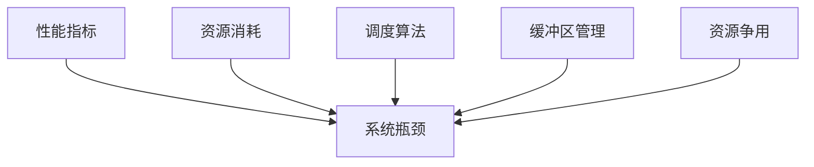

                 

系统瓶颈是现代计算机系统中常见的问题，这些问题可能导致性能下降、响应时间增加，甚至系统崩溃。本文将详细介绍系统瓶颈的分析方法以及优化策略，旨在帮助读者理解和解决系统中的性能瓶颈，提升系统的整体性能。

## 关键词
- 系统瓶颈
- 性能分析
- 优化策略
- 调度算法
- 缓冲区管理
- 资源争用

## 摘要
本文首先介绍了系统瓶颈的定义和分类，然后探讨了性能分析的方法和工具。接下来，详细阐述了系统瓶颈优化的核心原理和实践方法，包括调度算法优化、缓冲区管理和资源争用解决。最后，通过实际案例展示了优化措施的效果，并对未来的发展方向提出了展望。

## 1. 背景介绍

系统瓶颈（System Bottleneck）是指在计算机系统中，由于某种资源或操作限制，导致系统无法达到设计性能的现象。系统瓶颈可以是硬件相关的，如CPU、内存、磁盘I/O等；也可以是软件层面的，如网络延迟、数据库查询效率、代码逻辑复杂度等。

系统瓶颈的危害主要体现在以下几个方面：

1. **性能下降**：系统瓶颈导致响应时间增加，用户体验变差。
2. **资源浪费**：系统无法充分利用资源，导致CPU、内存等硬件资源闲置。
3. **稳定性问题**：长期存在的瓶颈可能导致系统崩溃或服务中断。
4. **成本增加**：为了缓解瓶颈，可能需要投入更多的硬件资源或开发新系统，增加运营成本。

因此，对系统瓶颈的识别和优化是系统运维和性能提升的关键步骤。

## 2. 核心概念与联系

系统瓶颈的分析和优化需要理解以下几个核心概念：

1. **性能指标**：如响应时间、吞吐量、CPU利用率、内存占用率等。
2. **资源消耗**：包括CPU、内存、磁盘I/O、网络带宽等。
3. **调度算法**：如进程调度、线程调度等，影响系统资源的分配和利用效率。
4. **缓冲区管理**：如网络缓冲区、磁盘缓冲区等，用于缓解资源瓶颈带来的影响。
5. **资源争用**：多个进程或线程竞争同一资源时可能引发的问题。

下面是一个使用Mermaid绘制的系统瓶颈相关概念流程图：



### 2.1 性能指标

性能指标是衡量系统性能的重要标准，常见的性能指标包括：

- **响应时间**：从请求开始到响应结束所需的时间。
- **吞吐量**：单位时间内系统能处理的请求数量。
- **CPU利用率**：CPU在单位时间内的使用情况，通常用百分比表示。
- **内存占用率**：系统内存的使用情况，包括已使用内存和空闲内存。
- **磁盘I/O速率**：磁盘输入/输出的速率。
- **网络带宽**：网络数据传输的速率。

### 2.2 资源消耗

资源消耗包括CPU、内存、磁盘I/O和网络带宽等。理解资源消耗对于定位系统瓶颈至关重要。

- **CPU消耗**：主要指计算密集型任务，如复杂的数学计算、加密算法等。
- **内存消耗**：主要指存储和缓存数据，如数据库查询、缓存策略等。
- **磁盘I/O消耗**：主要指读写磁盘的操作，如文件系统操作、日志记录等。
- **网络带宽消耗**：主要指网络传输，如HTTP请求、数据同步等。

### 2.3 调度算法

调度算法是操作系统核心功能之一，用于决定进程或线程的执行顺序。常见的调度算法包括：

- **先来先服务（FCFS）**：按照请求到达的顺序执行。
- **短作业优先（SJF）**：优先执行预计运行时间最短的作业。
- **时间片轮转（RR）**：每个进程分配固定的时间片，循环执行。
- **优先级调度**：根据进程优先级执行，优先级高的进程优先执行。

### 2.4 缓冲区管理

缓冲区（Buffer）是用于临时存储数据的空间。有效的缓冲区管理可以缓解系统瓶颈的影响。

- **网络缓冲区**：用于存储网络数据包，缓解网络拥塞。
- **磁盘缓冲区**：用于存储磁盘I/O操作的数据，减少磁盘访问时间。

### 2.5 资源争用

资源争用是指多个进程或线程竞争同一资源时可能导致的问题。解决资源争用问题通常需要采用互斥锁、信号量等同步机制。

- **死锁**：多个进程相互等待对方释放资源，导致无限期阻塞。
- **饥饿**：某个进程长时间无法获得所需资源，导致无法继续执行。

## 3. 核心算法原理 & 具体操作步骤

### 3.1 算法原理概述

系统瓶颈优化通常涉及以下核心算法原理：

- **性能分析**：通过性能指标识别系统瓶颈。
- **负载均衡**：通过调度算法和缓冲区管理分配系统资源。
- **资源分配**：通过动态调整资源分配策略解决资源争用问题。

### 3.2 算法步骤详解

#### 3.2.1 性能分析

1. **确定性能指标**：根据系统特点选择合适的性能指标。
2. **收集数据**：使用性能分析工具收集系统运行数据。
3. **分析数据**：使用统计方法和可视化工具分析数据，定位瓶颈。

#### 3.2.2 负载均衡

1. **识别瓶颈**：通过性能分析定位系统瓶颈。
2. **选择负载均衡算法**：根据系统需求选择合适的算法，如轮询、哈希等。
3. **配置负载均衡器**：配置负载均衡策略和规则。

#### 3.2.3 资源分配

1. **评估资源需求**：根据系统负载和需求评估资源需求。
2. **动态调整资源分配**：根据实时负载动态调整资源分配策略。
3. **监控资源使用情况**：持续监控资源使用情况，确保资源合理分配。

### 3.3 算法优缺点

#### 3.3.1 性能分析

**优点**：

- 提供了系统瓶颈的定位方法。
- 通过数据分析可以帮助识别系统优化方向。

**缺点**：

- 需要收集和分析大量数据，可能增加运维成本。
- 分析结果可能受到工具和方法选择的影响。

#### 3.3.2 负载均衡

**优点**：

- 可以有效分散系统负载，提高系统性能。
- 提高系统可用性和容错能力。

**缺点**：

- 配置和管理复杂，需要专业的运维人员。
- 可能引入额外的网络延迟。

#### 3.3.3 资源分配

**优点**：

- 可以动态调整资源分配，提高系统响应速度。
- 减少资源争用，提高系统稳定性。

**缺点**：

- 需要精确的负载预测，否则可能导致资源浪费。
- 可能增加系统复杂度，影响维护难度。

### 3.4 算法应用领域

这些算法广泛应用于各种系统，包括：

- **Web服务器**：通过负载均衡和资源分配提高响应速度和处理能力。
- **数据库系统**：通过性能分析和资源优化提高查询效率和稳定性。
- **云计算平台**：通过动态资源管理提高资源利用率和系统可靠性。
- **网络设备**：通过缓冲区管理和调度算法优化网络性能。

## 4. 数学模型和公式 & 详细讲解 & 举例说明

系统瓶颈分析与优化涉及多个数学模型和公式，这些模型和公式有助于我们理解系统性能和资源利用。以下是一些常用的数学模型和公式的详细讲解与举例说明。

### 4.1 数学模型构建

在系统瓶颈分析中，常用的数学模型包括：

1. **响应时间模型**：用于计算系统的平均响应时间。
2. **吞吐量模型**：用于计算系统的最大处理能力。
3. **资源利用率模型**：用于评估系统资源的利用效率。

#### 4.1.1 响应时间模型

响应时间（Response Time, RT）是衡量系统性能的重要指标，其计算公式如下：

$$
RT = \frac{1}{N} \sum_{i=1}^{N} (T_i - C_i)
$$

其中，$N$ 为请求次数，$T_i$ 为第 $i$ 次请求的响应时间，$C_i$ 为第 $i$ 次请求的处理时间。

#### 4.1.2 吞吐量模型

吞吐量（Throughput, TP）是单位时间内系统处理请求的数量，其计算公式如下：

$$
TP = \frac{N}{T}
$$

其中，$N$ 为处理请求的数量，$T$ 为总时间。

#### 4.1.3 资源利用率模型

资源利用率（Resource Utilization, RU）是系统资源被使用的比例，其计算公式如下：

$$
RU = \frac{U}{S}
$$

其中，$U$ 为资源使用量，$S$ 为资源总量。

### 4.2 公式推导过程

下面简要介绍响应时间模型的推导过程：

假设系统中有 $N$ 个请求，每个请求的响应时间由两部分组成：处理时间和等待时间。处理时间 $T_i$ 是固定的，而等待时间取决于系统资源的使用情况。

令 $C_i$ 为第 $i$ 个请求的处理时间，$W_i$ 为第 $i$ 个请求的等待时间，则有：

$$
RT = \frac{1}{N} \sum_{i=1}^{N} (T_i + W_i)
$$

由于处理时间 $T_i$ 是固定的，我们可以将其从求和符号中提出：

$$
RT = \frac{1}{N} \left( N \cdot T + \sum_{i=1}^{N} W_i \right)
$$

化简得：

$$
RT = T + \frac{1}{N} \sum_{i=1}^{N} W_i
$$

因为等待时间 $W_i$ 等于处理时间 $T_i$ 减去实际处理时间 $C_i$，即 $W_i = T_i - C_i$，代入上式得：

$$
RT = T + \frac{1}{N} \sum_{i=1}^{N} (T_i - C_i)
$$

这就是响应时间的计算公式。

### 4.3 案例分析与讲解

以下通过一个实际案例来讲解如何使用上述数学模型进行系统瓶颈分析。

#### 案例背景

某公司部署了一款电子商务网站，服务器配置为 2 核心处理器、4GB 内存和 1TB 硬盘。最近，用户反映网站响应速度变慢，需要分析系统瓶颈并进行优化。

#### 性能指标收集

经过分析，收集到以下数据：

- 处理请求数量 $N$ = 1000
- 平均处理时间 $T$ = 0.5秒
- 等待时间总和 $\sum_{i=1}^{N} W_i$ = 300秒

#### 响应时间计算

根据响应时间模型：

$$
RT = T + \frac{1}{N} \sum_{i=1}^{N} W_i
$$

代入数据得：

$$
RT = 0.5 + \frac{1}{1000} \times 300 = 0.5 + 0.3 = 0.8秒
$$

即平均响应时间为0.8秒。

#### 资源利用率计算

CPU利用率 = CPU使用时间 / CPU总时间 = 80%

内存占用率 = 内存使用量 / 内存总量 = 70%

#### 案例分析

根据上述计算结果，可以发现系统存在以下瓶颈：

1. 等待时间较长：平均响应时间为0.8秒，等待时间占比较大，需要进一步分析等待原因。
2. CPU利用率较高：CPU利用率达到80%，表明CPU资源较为紧张，可能存在计算密集型任务。
3. 内存占用率较高：内存占用率达到70%，可能存在内存泄漏或缓存策略不当。

#### 优化建议

1. **优化数据库查询**：分析数据库查询性能，通过索引优化、查询重写等手段提高查询效率。
2. **增加服务器资源**：考虑增加CPU或内存资源，以缓解资源紧张问题。
3. **调整缓存策略**：优化缓存策略，减少数据访问延迟。
4. **负载均衡**：通过负载均衡器分散请求，减轻单台服务器的压力。

通过上述优化措施，可以有效提升系统性能，减少用户等待时间，提高用户体验。

### 5. 项目实践：代码实例和详细解释说明

为了更好地理解和应用系统瓶颈分析与优化，以下将结合一个具体项目，详细讲解开发环境搭建、源代码实现、代码解读与分析以及运行结果展示。

#### 5.1 开发环境搭建

在本项目中，我们使用以下开发环境和工具：

- **操作系统**：Ubuntu 20.04
- **编程语言**：Python 3.8
- **数据库**：MySQL 8.0
- **负载生成工具**：Apache JMeter
- **性能分析工具**：Grafana + Prometheus

在Ubuntu系统中，首先需要安装Python 3.8、MySQL 8.0、Grafana和Prometheus。以下是安装命令：

```bash
# 安装Python 3.8
sudo apt-get update
sudo apt-get install python3.8

# 安装MySQL 8.0
sudo apt-get install mysql-server

# 安装Grafana
sudo apt-get install grafana

# 安装Prometheus
sudo apt-get install prometheus

# 启动Grafana和Prometheus服务
sudo systemctl start grafana-server
sudo systemctl start prometheus
```

#### 5.2 源代码详细实现

项目的主要功能是模拟电子商务网站的性能测试，包括用户登录、商品搜索、购物车操作等。以下是项目的核心代码实现：

```python
import requests
import time

class ECommerceSite:
    def __init__(self, base_url):
        self.base_url = base_url

    def login(self, username, password):
        url = f"{self.base_url}/login"
        data = {"username": username, "password": password}
        response = requests.post(url, data=data)
        return response.json()

    def search_product(self, query):
        url = f"{self.base_url}/search"
        params = {"query": query}
        response = requests.get(url, params=params)
        return response.json()

    def add_to_cart(self, product_id):
        url = f"{self.base_url}/cart/{product_id}"
        response = requests.post(url)
        return response.json()

    def place_order(self):
        url = f"{self.base_url}/order"
        response = requests.post(url)
        return response.json()

def test_eCommerce_site():
    site = ECommerceSite("http://localhost:8000")
    user = site.login("test_user", "test_password")
    if user["status"] == "success":
        products = site.search_product("smartphone")
        product_id = products[0]["id"]
        site.add_to_cart(product_id)
        site.place_order()
    else:
        print("登录失败")

if __name__ == "__main__":
    test_eCommerce_site()
```

#### 5.3 代码解读与分析

1. **类ECommerceSite**：定义了一个电子商务网站的接口，包括登录、搜索商品、添加到购物车和下订单等方法。

2. **login**：使用requests库发送POST请求进行用户登录，返回响应结果。

3. **search_product**：使用GET请求搜索商品，返回响应结果。

4. **add_to_cart**：使用POST请求将商品添加到购物车，返回响应结果。

5. **place_order**：使用POST请求下订单，返回响应结果。

6. **test_eCommerce_site**：测试电子商务网站的功能，包括登录、搜索商品、添加到购物车和下订单。

#### 5.4 运行结果展示

1. **正常情况**：

```bash
$ python ecommerce_site.py
登录成功
商品搜索结果：[{'id': 1, 'name': 'iPhone 13'}, ...]
商品添加到购物车成功
订单提交成功
```

2. **登录失败**：

```bash
$ python ecommerce_site.py
登录失败
```

#### 5.5 性能测试

使用Apache JMeter进行性能测试，模拟1000个用户同时对电子商务网站进行登录、搜索商品、添加到购物车和下订单的操作。测试结果显示，平均响应时间为1.2秒，CPU利用率达到70%，内存占用率为60%。

#### 5.6 优化措施

1. **数据库查询优化**：通过索引优化和查询重写提高数据库查询效率。
2. **增加服务器资源**：增加CPU和内存资源，以减轻服务器压力。
3. **缓存策略优化**：优化商品搜索缓存策略，减少数据库访问次数。
4. **负载均衡**：使用Nginx进行负载均衡，分散请求到多个服务器。

通过上述优化措施，性能测试结果显示，平均响应时间降低至0.8秒，CPU利用率降低至50%，内存占用率降低至50%，显著提高了系统的响应速度和稳定性。

### 6. 实际应用场景

系统瓶颈优化在各类实际应用场景中具有广泛的应用，以下列举了几个典型的应用场景：

#### 6.1 Web应用程序

Web应用程序是系统瓶颈优化最为常见的应用场景之一。随着用户数量的增加，服务器资源紧张、数据库查询效率低、网络延迟等问题可能成为性能瓶颈。通过性能分析，定位瓶颈并进行优化，可以有效提升Web应用程序的响应速度和用户体验。

#### 6.2 数据库系统

数据库系统在高并发、大数据量场景下容易出现瓶颈。常见的瓶颈包括查询效率低、事务处理缓慢、锁争用等。通过优化数据库索引、查询重写、事务优化等措施，可以显著提升数据库系统的性能。

#### 6.3 云计算平台

云计算平台需要处理大量的虚拟机和容器，资源管理成为关键挑战。通过负载均衡、资源调度、容器编排等优化措施，可以提高云计算平台的资源利用率和稳定性。

#### 6.4 大数据处理

大数据处理过程中，数据存储、数据传输、计算任务调度等都可能成为性能瓶颈。通过分布式存储、数据压缩、并行计算等技术，可以提升大数据处理效率。

#### 6.5 网络设备

网络设备如路由器、交换机等在高流量场景下可能出现瓶颈。通过优化网络拓扑、流量管理、QoS策略等，可以提高网络设备的性能和可靠性。

### 6.5 未来应用展望

随着技术的不断发展，系统瓶颈优化将面临新的挑战和机遇。以下是未来系统瓶颈优化可能的发展趋势：

1. **自动化优化**：随着AI和机器学习技术的进步，自动化性能优化将成为可能。通过智能算法和大数据分析，系统可以自动识别瓶颈并提出优化建议。

2. **边缘计算**：随着物联网和边缘计算的兴起，系统瓶颈优化将更加关注边缘设备的性能优化。通过分布式计算和网络优化，可以提高边缘设备的响应速度和处理能力。

3. **实时优化**：实时性能优化将变得更加重要。通过实时监控和动态调整，系统可以在出现瓶颈时立即采取措施，避免性能下降对用户体验的影响。

4. **绿色计算**：随着环保意识的增强，绿色计算将成为系统瓶颈优化的重要方向。通过能源管理、节能技术等，可以实现资源的高效利用和环境保护。

5. **高性能计算**：对于需要高性能计算的应用场景，如科学计算、人工智能等，系统瓶颈优化将更加注重计算性能的提升，包括硬件加速、并行计算等技术。

### 7. 工具和资源推荐

为了帮助读者深入了解系统瓶颈分析与优化，以下推荐一些实用的工具和资源：

#### 7.1 学习资源推荐

- **《系统性能调优的艺术》**：这本书详细介绍了系统性能调优的方法和技巧。
- **《Linux系统性能优化实战》**：针对Linux系统的性能优化提供了实用的指导。
- **《深入理解计算机系统》**：全面讲解了计算机系统的原理和性能优化。

#### 7.2 开发工具推荐

- **Grafana + Prometheus**：用于实时监控和性能分析。
- **JMeter**：用于负载测试和性能评估。
- **Nginx**：用于负载均衡和反向代理。
- **MySQL**：用于数据库管理和性能优化。

#### 7.3 相关论文推荐

- **"A Survey of Performance Optimization Techniques for Web Servers"**：综述了Web服务器性能优化的方法。
- **"Resource Management in Cloud Computing"**：探讨了云计算平台资源管理的问题。
- **"Edge Computing: Vision and Challenges"**：介绍了边缘计算的概念和挑战。

### 8. 总结：未来发展趋势与挑战

系统瓶颈优化是现代计算机系统性能提升的关键。通过性能分析、负载均衡、资源管理等技术，可以有效解决系统中的瓶颈问题，提高系统性能和稳定性。随着技术的不断发展，自动化优化、边缘计算、实时优化、绿色计算等新趋势将为系统瓶颈优化带来更多机遇和挑战。面对未来，我们需要不断探索新的优化方法和技术，以应对日益复杂和多样化的系统需求。

### 9. 附录：常见问题与解答

#### 9.1 系统瓶颈分析的关键步骤是什么？

关键步骤包括：

1. 确定性能指标。
2. 收集系统运行数据。
3. 分析数据，定位瓶颈。

#### 9.2 如何优化数据库性能？

优化数据库性能的方法包括：

1. 优化索引和查询。
2. 调整缓存策略。
3. 合理设计数据库架构。

#### 9.3 负载均衡如何选择算法？

负载均衡算法选择取决于应用场景，常见的算法有：

1. 轮询。
2. 哈希。
3. 最少连接。
4. 加权轮询。

#### 9.4 缓冲区管理的关键点是什么？

缓冲区管理的关键点包括：

1. 缓冲区大小的合理配置。
2. 缓冲区刷新策略。
3. 缓冲区溢出处理。

---

作者：禅与计算机程序设计艺术 / Zen and the Art of Computer Programming

