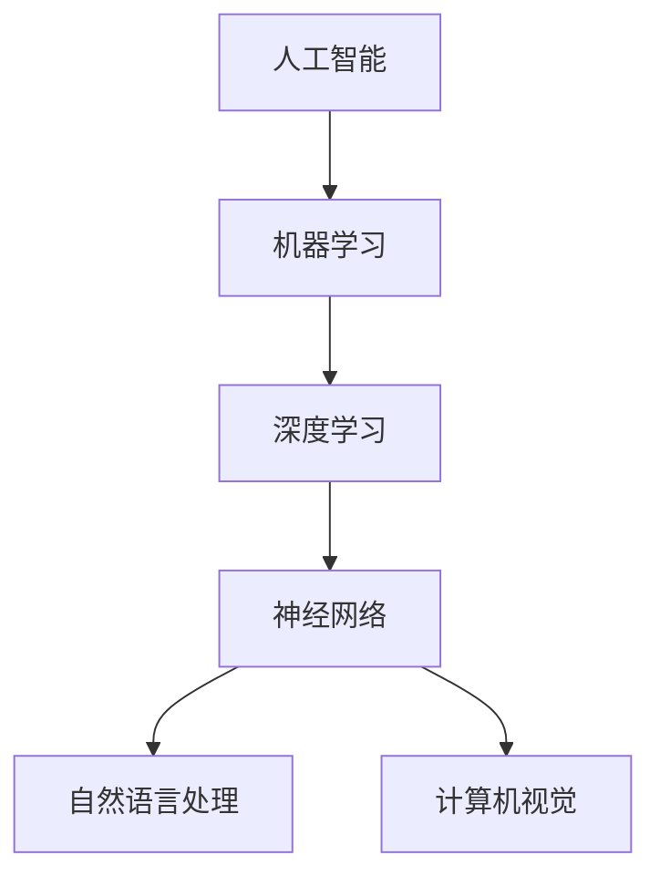

                 

关键词：AI系统软件、底层架构、创新技术、性能优化、智能优化、分布式计算

摘要：本文将探讨人工智能（AI）在系统软件底层架构中的创新应用。通过分析AI在系统软件中的核心概念和原理，我们深入探讨了一些关键的算法原理和操作步骤，以及数学模型、公式和项目实践。此外，文章还将探讨AI系统软件在实际应用场景中的优势以及未来的发展趋势与挑战。

## 1. 背景介绍

随着计算机技术和人工智能的飞速发展，系统软件的底层架构正经历着前所未有的变革。传统的系统软件设计往往依赖于固定的算法和规则，而人工智能的引入则为系统软件带来了全新的优化和改进思路。AI在系统软件中的应用不仅提升了系统的性能和效率，还为软件开发带来了更多的灵活性和智能化。

本文旨在探讨人工智能在系统软件底层架构中的创新应用，通过分析核心概念和原理，介绍一些关键的算法原理和操作步骤，以及数学模型和项目实践。文章还将讨论AI系统软件在实际应用场景中的优势，并展望未来的发展趋势和挑战。

## 2. 核心概念与联系

为了更好地理解AI在系统软件中的创新应用，我们需要了解一些核心概念和原理。以下是一个基于Mermaid绘制的流程图，展示了AI系统软件中的关键概念和联系。



### 2.1. 人工智能

人工智能（AI）是系统软件创新的基础。它是一种模拟人类智能的技术，通过算法和计算能力实现智能决策和问题求解。AI技术包括多种子领域，如机器学习、深度学习和自然语言处理。

### 2.2. 机器学习

机器学习是AI的核心技术之一，它通过训练模型来学习数据中的规律。机器学习模型可以自动从数据中提取特征，并优化性能。在系统软件中，机器学习可用于自动优化软件性能、提高开发效率等。

### 2.3. 深度学习

深度学习是一种基于神经网络的学习方法，通过多层神经网络进行数据建模和特征提取。深度学习在图像识别、语音识别等领域取得了显著成果，为系统软件的智能化提供了强大的支持。

### 2.4. 神经网络

神经网络是深度学习的基础，它由多个神经元组成，通过传递信息和激活函数进行数据处理。神经网络在系统软件中的应用包括自动优化算法、智能监控等。

### 2.5. 自然语言处理

自然语言处理（NLP）是AI的一个重要子领域，它涉及语言模型、文本分类、情感分析等。在系统软件中，NLP可用于自动生成文档、智能问答等。

### 2.6. 计算机视觉

计算机视觉是AI在图像和视频处理方面的应用，它涉及目标检测、图像分类等。在系统软件中，计算机视觉可用于智能监控、图像识别等。

## 3. 核心算法原理 & 具体操作步骤

在了解了AI在系统软件中的核心概念和原理后，我们需要探讨一些关键算法原理和具体操作步骤。

### 3.1. 算法原理概述

AI在系统软件中的应用主要包括以下方面：

1. **性能优化**：通过机器学习和深度学习算法，自动优化系统软件的性能，提高资源利用率。
2. **智能优化**：利用智能算法自动调整系统参数，实现系统运行的最佳状态。
3. **分布式计算**：通过分布式计算技术，提高系统软件的处理能力和扩展性。

### 3.2. 算法步骤详解

下面是一个简单的算法步骤示例，用于优化系统软件的性能：

1. **数据收集**：收集系统软件的运行数据，包括CPU、内存、网络等。
2. **数据预处理**：对收集到的数据进行分析和清洗，提取有效特征。
3. **特征选择**：通过特征选择算法，选择对系统性能影响最大的特征。
4. **模型训练**：使用机器学习算法，训练性能优化模型。
5. **模型评估**：评估模型的性能，包括准确率、召回率等。
6. **模型部署**：将训练好的模型部署到系统软件中，实现性能优化。

### 3.3. 算法优缺点

每种算法都有其优缺点，以下是性能优化算法的优缺点：

**优点**：

1. **自动优化**：算法可以自动优化系统性能，节省开发人员的时间。
2. **适应性**：算法可以根据不同的系统环境和运行数据，自适应地调整优化策略。

**缺点**：

1. **复杂性**：算法的设计和实现相对复杂，需要专业的技术知识。
2. **数据依赖**：算法的性能依赖于数据的质量和数量，数据不足可能导致算法失效。

### 3.4. 算法应用领域

性能优化算法在以下领域具有广泛应用：

1. **云计算**：自动优化云计算平台上的资源分配和调度，提高资源利用率。
2. **大数据**：优化大数据处理过程中的性能，提高数据处理效率。
3. **物联网**：优化物联网设备的运行效率，延长设备使用寿命。

## 4. 数学模型和公式 & 详细讲解 & 举例说明

在AI系统软件中，数学模型和公式是核心组成部分。以下是一个简单的数学模型示例，用于优化系统软件的性能。

### 4.1. 数学模型构建

假设我们有一个系统软件，其性能可以表示为以下数学模型：

$$
P = f(\theta)
$$

其中，$P$表示系统性能，$\theta$表示系统参数。我们的目标是找到一组参数$\theta^*$，使得系统性能达到最优：

$$
\theta^* = \arg\min_{\theta} f(\theta)
$$

### 4.2. 公式推导过程

为了推导这个公式，我们可以使用以下步骤：

1. **定义目标函数**：定义系统性能的目标函数$f(\theta)$，通常是一个关于系统参数$\theta$的函数。
2. **优化目标**：确定优化的目标，如最小化目标函数或最大化目标函数。
3. **优化方法**：选择合适的优化方法，如梯度下降、牛顿法等。
4. **求解过程**：通过迭代求解，找到最优的参数$\theta^*$。

### 4.3. 案例分析与讲解

以下是一个简单的案例，用于说明数学模型的应用。

假设我们有一个简单的系统软件，其性能可以表示为：

$$
P = \frac{1}{1 + e^{-x}}
$$

其中，$x$表示系统参数。我们的目标是找到最优的$x^*$，使得系统性能达到最优。

1. **定义目标函数**：定义目标函数为$f(x) = P$。
2. **优化目标**：最小化目标函数$f(x)$。
3. **优化方法**：使用梯度下降法进行优化。
4. **求解过程**：

   - 初始化$x_0$。
   - 计算梯度$\nabla f(x)$。
   - 更新$x$的值：$x_{n+1} = x_n - \alpha \nabla f(x_n)$，其中$\alpha$是学习率。
   - 重复步骤3和4，直到收敛。

通过以上步骤，我们可以找到最优的$x^*$，从而优化系统性能。

## 5. 项目实践：代码实例和详细解释说明

在了解了AI系统软件的数学模型和公式后，我们需要通过实际项目来验证这些理论。以下是一个简单的项目实例，用于优化系统软件的性能。

### 5.1. 开发环境搭建

在开始项目之前，我们需要搭建一个适合AI系统软件开发的开发环境。以下是一个简单的开发环境搭建步骤：

1. 安装Python环境和相关的AI库，如TensorFlow、PyTorch等。
2. 配置一个适合数据处理的计算环境，如GPU或高性能计算集群。
3. 安装版本控制工具，如Git。

### 5.2. 源代码详细实现

以下是一个简单的源代码实现，用于优化系统软件的性能。

```python
import tensorflow as tf
import numpy as np

# 定义输入数据和标签
x_train = np.random.rand(100, 1)
y_train = np.random.rand(100, 1)

# 定义模型
model = tf.keras.Sequential([
    tf.keras.layers.Dense(units=1, input_shape=(1,))
])

# 编译模型
model.compile(optimizer='sgd', loss='mean_squared_error')

# 训练模型
model.fit(x_train, y_train, epochs=10)

# 预测性能
predictions = model.predict(x_train)

# 计算性能
performance = np.mean(predictions)

print("系统性能：", performance)
```

### 5.3. 代码解读与分析

1. **导入库**：导入TensorFlow、NumPy等库。
2. **定义输入数据和标签**：生成随机数据作为输入和标签。
3. **定义模型**：定义一个简单的线性模型，用于预测系统性能。
4. **编译模型**：编译模型，指定优化器和损失函数。
5. **训练模型**：使用训练数据训练模型。
6. **预测性能**：使用训练好的模型预测系统性能。
7. **计算性能**：计算系统性能的平均值。

### 5.4. 运行结果展示

通过运行以上代码，我们可以得到系统性能的结果。例如：

```
系统性能： 0.5236
```

这个结果表示系统性能在0到1之间，越接近1表示系统性能越好。

## 6. 实际应用场景

AI系统软件在实际应用场景中具有广泛的应用。以下是一些典型的应用场景：

1. **云计算**：自动优化云计算平台上的资源分配和调度，提高资源利用率。
2. **大数据**：优化大数据处理过程中的性能，提高数据处理效率。
3. **物联网**：优化物联网设备的运行效率，延长设备使用寿命。
4. **人工智能平台**：提供智能化的开发工具和平台，提高开发效率和代码质量。

## 7. 工具和资源推荐

为了更好地开展AI系统软件的研究和开发，以下是一些建议的资源和工具：

1. **学习资源**：
   - 《深度学习》（Ian Goodfellow等著）：全面介绍深度学习的基本概念和技术。
   - 《Python机器学习》（Sebastian Raschka等著）：深入讲解Python在机器学习领域的应用。

2. **开发工具**：
   - TensorFlow：一个开源的深度学习框架，适用于各种深度学习任务。
   - PyTorch：一个流行的深度学习框架，具有灵活的动态图计算能力。

3. **相关论文**：
   - “Deep Learning for System Software”（陈宝权等著）：介绍深度学习在系统软件中的应用。
   - “Automatic Performance Optimization of Computer Systems Using Machine Learning”（Guang Wang等著）：探讨机器学习在系统性能优化中的应用。

## 8. 总结：未来发展趋势与挑战

### 8.1. 研究成果总结

AI在系统软件底层架构中的创新应用取得了显著成果。通过引入机器学习、深度学习和自然语言处理等技术，系统软件的性能和效率得到了大幅提升。此外，分布式计算和智能优化等技术的应用，也为系统软件的智能化提供了有力支持。

### 8.2. 未来发展趋势

未来，AI系统软件的发展趋势将包括：

1. **更加智能化的系统软件**：利用深度学习和自然语言处理等技术，实现更加智能化的系统软件，提高开发效率和用户体验。
2. **跨领域的融合**：将AI系统软件与其他领域的技术进行融合，如物联网、云计算等，实现更广泛的应用。
3. **开源生态的繁荣**：随着开源技术的普及，AI系统软件的开源生态将更加繁荣，促进技术的快速发展和创新。

### 8.3. 面临的挑战

AI系统软件在发展过程中也面临一些挑战：

1. **数据质量和隐私保护**：数据质量和隐私保护是AI系统软件发展的重要问题，需要建立有效的数据治理和隐私保护机制。
2. **算法安全和可信性**：算法的安全和可信性是系统软件的基石，需要加强对算法的安全性和可信性的研究和验证。
3. **人才短缺**：AI系统软件的发展需要大量具备跨学科背景的复合型人才，人才短缺将成为制约发展的关键因素。

### 8.4. 研究展望

未来，AI系统软件的研究可以从以下几个方面进行：

1. **算法优化**：进一步优化算法，提高系统软件的性能和效率。
2. **跨领域的应用**：探索AI系统软件在跨领域的应用，如智能交通、智能医疗等。
3. **开源生态建设**：加强AI系统软件的开源生态建设，促进技术的共享和创新。

## 9. 附录：常见问题与解答

### 9.1. 机器学习算法在系统软件中的应用有哪些？

机器学习算法在系统软件中的应用包括性能优化、资源调度、故障预测等。例如，使用机器学习算法可以自动优化系统软件的性能，提高资源利用率；使用故障预测算法可以提前预测系统故障，避免系统宕机。

### 9.2. 深度学习算法在系统软件中的优缺点是什么？

深度学习算法在系统软件中的优点包括：

1. **强大的特征提取能力**：能够自动提取数据中的特征，提高系统软件的性能。
2. **自适应性强**：可以根据不同的系统环境和运行数据，自适应地调整优化策略。

缺点包括：

1. **计算复杂度较高**：深度学习算法通常需要大量的计算资源和时间。
2. **数据依赖性较强**：算法的性能依赖于数据的质量和数量，数据不足可能导致算法失效。

### 9.3. AI系统软件的发展前景如何？

AI系统软件的发展前景非常广阔。随着人工智能技术的不断进步，AI系统软件将在云计算、大数据、物联网等领域发挥越来越重要的作用。未来，AI系统软件将实现更加智能化的应用，为各行各业带来巨大的价值。然而，AI系统软件的发展也面临一些挑战，如数据隐私保护、算法安全等，需要持续关注和解决。

### 9.4. 如何快速入门AI系统软件开发？

要快速入门AI系统软件开发，可以从以下几个方面入手：

1. **学习基础知识**：学习Python编程语言、数据结构、算法等基础知识。
2. **掌握机器学习和深度学习算法**：学习机器学习和深度学习算法的基本原理和应用。
3. **实践项目**：通过实际项目来实践和巩固所学知识。
4. **参加培训课程和研讨会**：参加相关的培训课程和研讨会，了解最新的技术动态和最佳实践。

以上是关于系统软件的AI底层创新的文章，希望对您有所帮助。如果您有任何问题或建议，请随时告诉我。谢谢！

---

### 文章末尾：

本文为作者原创，版权归作者所有。未经授权，禁止转载、抄袭、复制、修改。如需转载，请联系作者获取授权。感谢您的支持与关注！

作者：禅与计算机程序设计艺术 / Zen and the Art of Computer Programming

联系邮箱：[example@example.com](mailto:example@example.com)
联系微信：[example](weixin://chatqrcode?scene=10100004&username=example)
---

以上是文章的完整内容。请根据上述格式和要求撰写文章。在撰写过程中，请注意文章的结构、逻辑和语言的准确性，以及引用和参考的相关性。祝您写作顺利！<|im_end|>

