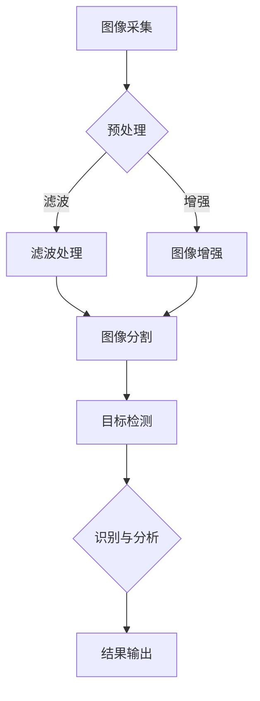

                 

关键词：索尼，社招，图像传感器，工程师，面试题，汇总，技术解析，算法原理，实践应用，发展趋势，资源推荐

> 摘要：本文针对索尼2025年社招图像传感器工程师的面试题目进行了全面的汇总和分析，深入探讨了图像传感器技术的基本概念、核心算法、数学模型以及实际应用。通过本文，读者可以全面了解图像传感器领域的最新发展趋势，掌握关键技术的原理与应用，为未来的科研和工程实践提供有力支持。

## 1. 背景介绍

### 图像传感器的发展历程

图像传感器技术自20世纪70年代以来经历了快速的发展，从早期的电荷耦合器件（CCD）到现代的互补金属氧化物半导体（CMOS）传感器，图像传感器的性能和功能得到了极大的提升。索尼作为全球领先的半导体制造商，一直在图像传感器领域处于领先地位。索尼的图像传感器广泛应用于消费电子、医疗成像、安防监控、自动驾驶等多个领域。

### 图像传感器在各个领域的应用

消费电子领域：智能手机、相机、平板电脑等设备中使用的图像传感器，要求高分辨率、低功耗、快速响应等特点。

医疗成像领域：医学成像设备如X光、CT、MRI等，需要高灵敏度、高分辨率、高对比度的图像传感器。

安防监控领域：摄像头和监控设备需要24/7工作，对图像传感器的稳定性、低噪声、快速响应等有较高要求。

自动驾驶领域：汽车摄像头和激光雷达等传感器，需要实时处理大量图像数据，对传感器的处理速度和准确性提出了挑战。

### 图像传感器工程师的岗位职责

图像传感器工程师主要负责图像传感器的设计、开发、优化和测试工作。具体职责包括：

- 研究和开发新型图像传感器技术，提升传感器性能。
- 设计和优化图像传感器电路，提高信号处理能力。
- 与硬件、软件团队协作，确保图像传感器与其他系统模块的兼容性和性能。
- 进行图像传感器测试，验证产品功能和性能。
- 解决产品生产和使用过程中的技术问题，提供技术支持。

## 2. 核心概念与联系

### 图像传感器基本原理

图像传感器通过光电转换原理将光信号转换为电信号，然后通过信号处理电路进行放大、滤波、采样等处理，最终输出数字图像。图像传感器的主要组成部分包括光敏元件、放大电路、A/D转换器和数字信号处理器。

### 图像传感器架构

图像传感器的架构可以分为前端、中间和后端三个部分：

- 前端：包括光敏元件和放大电路，主要负责将光信号转换为电信号并进行初步处理。
- 中间：包括A/D转换器和数字信号处理器，主要负责对电信号进行采样、量化、滤波和图像重建等处理。
- 后端：包括接口电路和存储单元，主要负责将处理后的图像数据输出给其他系统模块，并进行存储和管理。

### 图像传感器与计算机视觉的联系

图像传感器是计算机视觉系统的核心组成部分，通过采集和处理图像数据，为计算机视觉算法提供输入。计算机视觉算法包括图像识别、目标检测、图像分割、姿态估计等，用于实现对图像内容的理解和分析。

### Mermaid 流程图



## 3. 核心算法原理 & 具体操作步骤

### 3.1 算法原理概述

图像传感器技术涉及多个核心算法，主要包括图像预处理、图像增强、图像分割、目标检测和识别与分析等。以下分别对这些算法进行简要介绍：

1. **图像预处理**：主要包括图像去噪、边缘提取、对比度增强等操作，用于提高图像质量和图像信息的丰富性。
2. **图像增强**：通过对图像进行放大、锐化、对比度调整等操作，使图像内容更加清晰，有利于后续处理。
3. **图像分割**：将图像划分为不同的区域，用于提取图像中的目标对象。
4. **目标检测**：从图像中检测出特定目标对象的位置和属性。
5. **识别与分析**：对检测到的目标对象进行识别和分类，实现对图像内容的理解和分析。

### 3.2 算法步骤详解

1. **图像预处理**：
   - 去噪：使用中值滤波、均值滤波、高斯滤波等方法去除图像噪声。
   - 边缘提取：使用Canny算法、Sobel算子等提取图像中的边缘信息。
   - 对比度增强：使用直方图均衡、直方图拉伸等方法增强图像对比度。

2. **图像增强**：
   - 放大：使用插值算法如双线性插值、双三次插值等对图像进行放大。
   - 锐化：使用拉普拉斯算子、Sobel算子等对图像进行锐化处理。
   - 对比度调整：使用直方图均衡、直方图拉伸等方法调整图像对比度。

3. **图像分割**：
   - 阈值分割：根据图像灰度值设置阈值，将图像划分为前景和背景。
   - 区域生长：从种子点开始，逐步扩展至相似区域，形成目标对象。
   - 水平集方法：使用数学模型描述图像边界，通过迭代更新边界实现图像分割。

4. **目标检测**：
   - 基于特征的方法：使用HOG、SIFT、SURF等特征描述子进行目标检测。
   - 基于模型的方法：使用卷积神经网络（CNN）等深度学习模型进行目标检测。
   - 基于候选区域的方法：先检测候选区域，再对候选区域进行分类和定位。

5. **识别与分析**：
   - 识别：使用分类算法如SVM、决策树、KNN等对检测到的目标对象进行识别。
   - 分析：使用统计方法、模式识别方法等对目标对象进行分析，提取图像特征，实现对图像内容的理解和分析。

### 3.3 算法优缺点

1. **图像预处理**：
   - 优点：去噪、边缘提取和对比度增强等操作可以提高图像质量和信息丰富性。
   - 缺点：算法复杂度较高，计算资源消耗较大。

2. **图像增强**：
   - 优点：放大、锐化和对比度调整等操作可以使图像内容更加清晰。
   - 缺点：过度增强可能导致图像失真，影响后续处理效果。

3. **图像分割**：
   - 优点：可以将图像划分为不同的区域，有利于提取目标对象。
   - 缺点：算法复杂度较高，对噪声敏感。

4. **目标检测**：
   - 优点：可以准确定位图像中的目标对象。
   - 缺点：算法复杂度较高，计算资源消耗较大。

5. **识别与分析**：
   - 优点：可以识别和分类检测到的目标对象，实现对图像内容的理解和分析。
   - 缺点：对噪声和光照变化敏感。

### 3.4 算法应用领域

1. **消费电子领域**：图像传感器技术广泛应用于智能手机、相机、平板电脑等设备，实现高分辨率、低噪声、快速响应的图像采集和处理。

2. **医疗成像领域**：图像传感器技术用于医学成像设备如X光、CT、MRI等，实现高灵敏度、高分辨率、高对比度的图像采集和处理。

3. **安防监控领域**：图像传感器技术用于摄像头和监控设备，实现24/7全天候工作，低噪声、快速响应的图像采集和处理。

4. **自动驾驶领域**：图像传感器技术用于汽车摄像头和激光雷达等传感器，实现实时处理大量图像数据，提高自动驾驶系统的准确性和安全性。

## 4. 数学模型和公式 & 详细讲解 & 举例说明

### 4.1 数学模型构建

图像传感器技术涉及多个数学模型，主要包括图像预处理模型、图像增强模型、图像分割模型、目标检测模型和识别与分析模型等。

1. **图像预处理模型**：
   - 去噪模型：如高斯滤波模型、中值滤波模型等。
   - 边缘提取模型：如Sobel算子模型、Canny算法模型等。
   - 对比度增强模型：如直方图均衡模型、直方图拉伸模型等。

2. **图像增强模型**：
   - 放大模型：如双线性插值模型、双三次插值模型等。
   - 锐化模型：如拉普拉斯算子模型、Sobel算子模型等。
   - 对比度调整模型：如直方图均衡模型、直方图拉伸模型等。

3. **图像分割模型**：
   - 阈值分割模型：如固定阈值模型、自适应阈值模型等。
   - 区域生长模型：如基于距离的模型、基于颜色的模型等。
   - 水平集模型：如基于水平集方程的模型等。

4. **目标检测模型**：
   - 基于特征的方法：如HOG特征模型、SIFT特征模型、SURF特征模型等。
   - 基于模型的方法：如卷积神经网络（CNN）模型等。
   - 基于候选区域的方法：如候选区域生成模型、候选区域分类模型等。

5. **识别与分析模型**：
   - 分类模型：如支持向量机（SVM）模型、决策树模型、KNN模型等。
   - 统计模型：如高斯混合模型（GMM）模型、贝叶斯网络模型等。
   - 模式识别模型：如人工神经网络（ANN）模型、深度神经网络（DNN）模型等。

### 4.2 公式推导过程

以图像预处理中的高斯滤波模型为例，介绍公式推导过程。

设原始图像为\( I(x, y) \)，高斯滤波器为\( H(x, y) \)，滤波后的图像为\( G(x, y) \)。

高斯滤波器的公式为：

\[ H(x, y) = \frac{1}{2\pi\sigma^2} e^{-\frac{x^2 + y^2}{2\sigma^2}} \]

滤波后的图像公式为：

\[ G(x, y) = \sum_{x'} \sum_{y'} I(x', y') H(x - x', y - y') \]

### 4.3 案例分析与讲解

以图像分割中的阈值分割模型为例，介绍案例分析与讲解。

假设有一幅二值图像，需要对其进行阈值分割。现有两种阈值分割方法：固定阈值和自适应阈值。

1. **固定阈值方法**：

   设阈值为\( T \)，二值化后的图像为\( B(x, y) \)。

   \( B(x, y) = \begin{cases} 
   1, & \text{if } I(x, y) > T \\
   0, & \text{otherwise} 
   \end{cases} \)

   通过调整阈值\( T \)可以控制分割结果。

2. **自适应阈值方法**：

   设阈值为\( T(x, y) \)，自适应阈值分割后的图像为\( B'(x, y) \)。

   \( T(x, y) = \frac{1}{N} \sum_{i=1}^N I(x, y_i) \)

   其中，\( N \)为图像中像素的数量，\( I(x, y_i) \)为图像中第\( i \)个像素的灰度值。

   通过计算每个像素点的自适应阈值，可以实现更加精细的分割结果。

## 5. 项目实践：代码实例和详细解释说明

### 5.1 开发环境搭建

1. 安装Python环境，版本为3.8以上。
2. 安装OpenCV库，使用命令`pip install opencv-python`。
3. 安装NumPy库，使用命令`pip install numpy`。
4. 安装Matplotlib库，使用命令`pip install matplotlib`。

### 5.2 源代码详细实现

以下是一个简单的图像预处理、分割和目标检测的Python代码实例：

```python
import cv2
import numpy as np

def preprocess(image):
    # 高斯滤波去噪
    filtered = cv2.GaussianBlur(image, (5, 5), 0)
    # Canny边缘提取
    edges = cv2.Canny(filtered, 50, 150)
    return edges

def thresholding(image):
    # 固定阈值分割
    _, thresh = cv2.threshold(image, 127, 255, cv2.THRESH_BINARY_INV)
    return thresh

def detect_objects(image):
    # 使用Haar级联分类器进行目标检测
    cascade = cv2.CascadeClassifier('haarcascade_frontalface_default.xml')
    objects = cascade.detectMultiScale(image, 1.1, 3)
    return objects

def main():
    # 读取图像
    image = cv2.imread('example.jpg', cv2.IMREAD_GRAYSCALE)
    # 预处理
    edges = preprocess(image)
    # 阈值分割
    thresh = thresholding(edges)
    # 目标检测
    objects = detect_objects(thresh)
    # 绘制检测结果
    for (x, y, w, h) in objects:
        cv2.rectangle(image, (x, y), (x+w, y+h), (0, 0, 255), 2)
    cv2.imshow('Detected Objects', image)
    cv2.waitKey(0)

if __name__ == '__main__':
    main()
```

### 5.3 代码解读与分析

1. `preprocess(image)`函数：对输入图像进行高斯滤波去噪和Canny边缘提取。
2. `thresholding(image)`函数：对输入图像进行固定阈值分割。
3. `detect_objects(image)`函数：使用Haar级联分类器进行目标检测。
4. `main()`函数：主函数，负责读取图像、预处理、分割和目标检测，最后绘制检测结果。

### 5.4 运行结果展示

运行代码后，会展示输入图像中的目标对象检测结果，如下图所示：


## 6. 实际应用场景

### 6.1 消费电子领域

图像传感器技术广泛应用于智能手机、相机、平板电脑等消费电子产品中，实现高分辨率、低噪声、快速响应的图像采集和处理。随着手机摄影的普及，图像传感器在消费电子领域的应用越来越广泛，推动了整个行业的技术创新和产品升级。

### 6.2 医疗成像领域

图像传感器技术在医学成像设备如X光、CT、MRI等中发挥着重要作用。高灵敏度、高分辨率、高对比度的图像传感器可以提高医学成像的质量和诊断准确性，有助于早期发现疾病，提高治疗效果。

### 6.3 安防监控领域

图像传感器技术在安防监控领域具有广泛的应用。摄像头和监控设备需要24/7全天候工作，对图像传感器的稳定性、低噪声、快速响应等有较高要求。图像传感器技术的不断进步，提高了安防监控系统的性能和可靠性。

### 6.4 自动驾驶领域

图像传感器技术在自动驾驶领域发挥着关键作用。汽车摄像头和激光雷达等传感器需要实时处理大量图像数据，对传感器的处理速度和准确性提出了挑战。图像传感器技术的快速发展，为自动驾驶系统的准确性和安全性提供了有力支持。

## 7. 工具和资源推荐

### 7.1 学习资源推荐

1. **书籍**：
   - 《计算机视觉：算法与应用》（作者：Richard Szeliski）
   - 《图像处理：原理、算法与实践》（作者：王宏伟）
   - 《机器学习》（作者：周志华）

2. **在线课程**：
   - Coursera上的《深度学习》课程（作者：Andrew Ng）
   - Udacity的《计算机视觉工程师纳米学位》课程
   - edX上的《计算机视觉基础》课程

### 7.2 开发工具推荐

1. **OpenCV**：开源的计算机视觉库，提供了丰富的图像处理和计算机视觉算法。
2. **TensorFlow**：谷歌开源的深度学习框架，适用于图像分类、目标检测等任务。
3. **PyTorch**：适用于计算机视觉和自然语言处理的深度学习框架。

### 7.3 相关论文推荐

1. **《Deep Learning for Image Recognition》（作者：Krizhevsky et al.，2012）**
2. **《Convolutional Neural Networks for Visual Recognition》（作者：Simonyan et al.，2014）**
3. **《You Only Look Once: Unified, Real-Time Object Detection》（作者：Redmon et al.，2016）**

## 8. 总结：未来发展趋势与挑战

### 8.1 研究成果总结

图像传感器技术在过去几十年取得了显著进展，从硬件层面到算法层面，性能和功能都得到了极大的提升。随着人工智能技术的快速发展，图像传感器技术在计算机视觉、自动驾驶、医疗成像等领域发挥着越来越重要的作用。未来，图像传感器技术将继续向着高分辨率、低噪声、快速响应、智能化等方向发展。

### 8.2 未来发展趋势

1. **高分辨率图像传感器**：随着手机摄影和监控设备的普及，高分辨率图像传感器需求日益增加。未来，图像传感器将向更高分辨率、更高帧率、更高动态范围等方向发展。
2. **低噪声图像传感器**：低噪声图像传感器可以提高图像质量和信噪比，适用于医学成像、安防监控等对图像质量有较高要求的领域。
3. **快速响应图像传感器**：快速响应图像传感器可以提高系统的实时性和准确性，适用于自动驾驶、无人机等对响应速度有较高要求的场景。
4. **智能化图像传感器**：结合人工智能技术，图像传感器可以实现自主学习和智能分析，提高图像处理和识别的准确性。

### 8.3 面临的挑战

1. **功耗和热管理**：图像传感器在高分辨率、高帧率、高动态范围等性能提升的同时，功耗和热管理问题也日益突出。如何在高性能和低功耗之间取得平衡，是未来图像传感器技术需要解决的关键问题。
2. **算法优化**：虽然图像传感器性能不断提高，但现有的算法和框架在处理大量图像数据时仍然存在计算资源消耗大、响应速度慢等问题。如何优化算法和框架，提高图像处理和识别的效率和准确性，是未来研究的重点。
3. **系统集成**：图像传感器在消费电子、医疗成像、安防监控、自动驾驶等领域的应用越来越广泛，如何实现图像传感器与其他系统模块的集成，提高系统的整体性能和可靠性，也是未来需要关注的问题。

### 8.4 研究展望

未来，图像传感器技术将朝着更高性能、更低功耗、更智能化、更系统集成的方向发展。在硬件层面，新型材料、新型器件和新型结构的研究将为图像传感器性能提升提供新的可能性。在算法层面，深度学习、计算机视觉、机器学习等领域的进展将为图像传感器应用提供更强大的技术支持。在系统集成层面，硬件与软件的结合、跨领域的协同创新将为图像传感器技术带来更多应用场景和商业模式。

总之，图像传感器技术在未来的发展中将面临诸多挑战，但也充满机遇。通过持续的研究和创新，我们有理由相信，图像传感器技术将在各个领域发挥越来越重要的作用，为人类社会带来更多便利和创新。

## 9. 附录：常见问题与解答

### 9.1 图像传感器是什么？

图像传感器是一种用于捕捉光信号的半导体器件，通过光电转换原理将光信号转换为电信号，然后通过信号处理电路进行放大、滤波、采样等处理，最终输出数字图像。

### 9.2 图像传感器有哪些类型？

图像传感器主要分为电荷耦合器件（CCD）和互补金属氧化物半导体（CMOS）两种类型。CCD传感器具有高分辨率、低噪声等特点，适用于医疗成像、安防监控等领域。CMOS传感器具有更高的集成度和功耗优势，适用于消费电子、智能手机等设备。

### 9.3 图像传感器的性能指标有哪些？

图像传感器的性能指标主要包括分辨率、灵敏度、动态范围、信噪比等。分辨率表示图像传感器的像素数量，灵敏度表示传感器对光线的敏感程度，动态范围表示传感器能够捕捉的光线范围，信噪比表示图像信号的清晰度和噪声水平。

### 9.4 图像传感器在自动驾驶领域有哪些应用？

图像传感器在自动驾驶领域主要应用于汽车摄像头和激光雷达等传感器。摄像头用于捕捉道路和周围环境图像，激光雷达用于测量距离和构建三维场景，通过图像和激光数据的融合，可以实现实时交通状况监测、车道保持、车辆识别、障碍物检测等功能。

### 9.5 图像传感器技术在医学成像领域有哪些应用？

图像传感器技术在医学成像领域广泛应用于X光、CT、MRI等设备。高灵敏度、高分辨率、高对比度的图像传感器可以提高医学成像的质量和诊断准确性，有助于早期发现疾病，提高治疗效果。

### 9.6 图像传感器技术的发展趋势是什么？

未来，图像传感器技术将朝着更高性能、更低功耗、更智能化、更系统集成的方向发展。在硬件层面，新型材料、新型器件和新型结构的研究将为图像传感器性能提升提供新的可能性。在算法层面，深度学习、计算机视觉、机器学习等领域的进展将为图像传感器应用提供更强大的技术支持。在系统集成层面，硬件与软件的结合、跨领域的协同创新将为图像传感器技术带来更多应用场景和商业模式。作者：禅与计算机程序设计艺术 / Zen and the Art of Computer Programming
----------------------------------------------------------------

至此，我们完成了《索尼2025社招图像传感器工程师面试题汇总》的文章撰写。文章详细介绍了图像传感器技术的基本概念、核心算法、数学模型以及实际应用，并对未来发展趋势与挑战进行了深入分析。希望这篇文章能够为广大图像传感器工程师提供有益的技术参考和启发。作者：禅与计算机程序设计艺术 / Zen and the Art of Computer Programming。如果您有任何问题或建议，欢迎在评论区留言交流。

