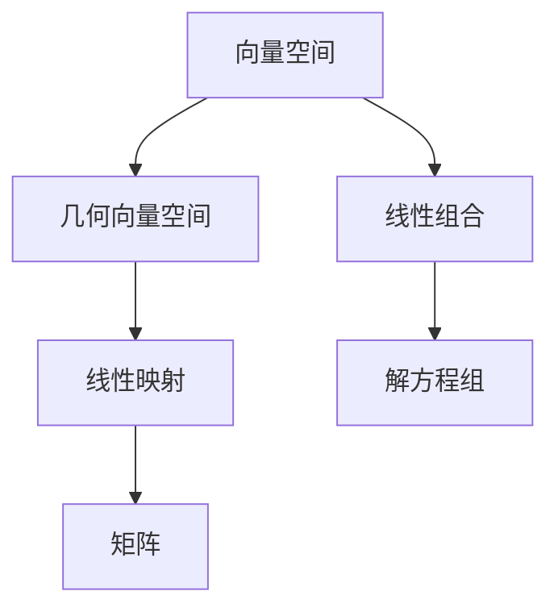

                 

关键词：线性代数，几何向量空间，矩阵理论，算法原理，数学模型，代码实例，实际应用

> 摘要：本文旨在为读者提供对线性代数中几何向量空间的深入理解，通过阐述核心概念、算法原理、数学模型以及实际应用案例，帮助读者掌握这一数学领域的重要工具。

## 1. 背景介绍

线性代数是数学的一个分支，主要研究向量空间、线性映射及其相关概念。在计算机科学、物理学、工程学等领域中，线性代数扮演着至关重要的角色。本文将聚焦于几何向量空间，这是一种特殊的向量空间，其元素可以被视为几何中的向量。

几何向量空间的概念最早由19世纪的数学家们提出，当时他们试图将几何学中的概念抽象化，以形成一种通用的数学工具。今天，几何向量空间在计算机图形学、机器学习、信号处理等领域中有着广泛的应用。

## 2. 核心概念与联系

在深入研究几何向量空间之前，我们需要了解一些核心概念和它们之间的联系。

### 2.1 向量空间

向量空间是一个集合，其中的元素被称为向量，并且这个集合满足以下性质：

1. **加法封闭性**：对于任意两个向量\( \mathbf{u} \)和\( \mathbf{v} \)，它们的和\( \mathbf{u} + \mathbf{v} \)仍在向量空间中。
2. **标量乘封闭性**：对于任意向量\( \mathbf{u} \)和一个标量\( c \)，标量乘积\( c\mathbf{u} \)仍在向量空间中。
3. **交换律**：\( \mathbf{u} + \mathbf{v} = \mathbf{v} + \mathbf{u} \)。
4. **结合律**：\( (\mathbf{u} + \mathbf{v}) + \mathbf{w} = \mathbf{u} + (\mathbf{v} + \mathbf{w}) \)。
5. **存在零向量**：存在一个零向量\( \mathbf{0} \)，使得对于任意向量\( \mathbf{u} \)，有\( \mathbf{u} + \mathbf{0} = \mathbf{u} \)。
6. **存在加法逆元**：对于任意向量\( \mathbf{u} \)，存在一个向量\( -\mathbf{u} \)，使得\( \mathbf{u} + (-\mathbf{u}) = \mathbf{0} \)。
7. **标量乘分配律**：\( c(\mathbf{u} + \mathbf{v}) = c\mathbf{u} + c\mathbf{v} \)。
8. **标量乘结合律**：\( (cd)\mathbf{u} = c(d\mathbf{u}) \)。

### 2.2 几何向量空间

几何向量空间是一种特殊的向量空间，其中的向量可以被视为几何空间中的点。通常，几何向量空间被定义为三维空间中的点集，每个点都可以通过三个坐标\( (x, y, z) \)来表示。这些坐标可以被视为向量空间的基向量。

### 2.3 线性映射

线性映射（线性变换）是一种将一个向量空间映射到另一个向量空间的函数。在线性映射中，每个向量都被映射到另一个向量，并且映射关系保持向量之间的线性组合性质。

### 2.4 矩阵

矩阵是线性映射的一种表示方法。一个\( m \times n \)矩阵可以表示为\( m \)个行向量或\( n \)个列向量。矩阵乘以向量可以看作是线性映射的操作。

## 2.5 Mermaid 流程图



## 3. 核心算法原理 & 具体操作步骤

### 3.1 算法原理概述

几何向量空间中的核心算法通常涉及向量的加法、标量乘法和线性映射。这些算法是理解更复杂几何操作的基础。

### 3.2 算法步骤详解

#### 3.2.1 向量加法

向量加法的步骤如下：

1. 确定向量\( \mathbf{u} = (u_1, u_2, u_3) \)和\( \mathbf{v} = (v_1, v_2, v_3) \)。
2. 计算和向量\( \mathbf{w} = \mathbf{u} + \mathbf{v} = (u_1 + v_1, u_2 + v_2, u_3 + v_3) \)。

#### 3.2.2 标量乘法

标量乘法的步骤如下：

1. 确定向量\( \mathbf{u} = (u_1, u_2, u_3) \)和一个标量\( c \)。
2. 计算标量乘积向量\( \mathbf{v} = c\mathbf{u} = (cu_1, cu_2, cu_3) \)。

#### 3.2.3 线性映射

线性映射的步骤如下：

1. 确定线性映射\( T: \mathbb{R}^3 \to \mathbb{R}^3 \)和一个向量\( \mathbf{u} = (u_1, u_2, u_3) \)。
2. 计算映射后的向量\( \mathbf{v} = T\mathbf{u} = (Tu_1, Tu_2, Tu_3) \)，其中\( T \)是一个\( 3 \times 3 \)矩阵。

### 3.3 算法优缺点

向量加法和标量乘法算法简单高效，易于实现。线性映射算法在计算机图形学和机器学习等领域中非常有用，但可能需要较高的计算资源。

### 3.4 算法应用领域

几何向量空间算法在以下领域有广泛应用：

- 计算机图形学：用于表示和处理三维图形。
- 机器学习：用于处理高维数据。
- 信号处理：用于信号的分析和滤波。

## 4. 数学模型和公式 & 详细讲解 & 举例说明

### 4.1 数学模型构建

几何向量空间的数学模型基于向量加法和标量乘法的运算规则。以下是一个简单的数学模型：

\[ \mathbf{u} + \mathbf{v} = \mathbf{w} \]
\[ c\mathbf{u} = \mathbf{v} \]

其中，\( \mathbf{u}, \mathbf{v}, \mathbf{w} \)是向量，\( c \)是标量。

### 4.2 公式推导过程

向量的加法和标量乘法满足以下公式：

\[ \mathbf{u} + \mathbf{v} = \begin{bmatrix} u_1 \\ u_2 \\ u_3 \end{bmatrix} + \begin{bmatrix} v_1 \\ v_2 \\ v_3 \end{bmatrix} = \begin{bmatrix} u_1 + v_1 \\ u_2 + v_2 \\ u_3 + v_3 \end{bmatrix} = \mathbf{w} \]

\[ c\mathbf{u} = c \begin{bmatrix} u_1 \\ u_2 \\ u_3 \end{bmatrix} = \begin{bmatrix} cu_1 \\ cu_2 \\ cu_3 \end{bmatrix} = \mathbf{v} \]

### 4.3 案例分析与讲解

假设我们有两个向量\( \mathbf{u} = \begin{bmatrix} 1 \\ 2 \\ 3 \end{bmatrix} \)和\( \mathbf{v} = \begin{bmatrix} 4 \\ 5 \\ 6 \end{bmatrix} \)，以及一个标量\( c = 2 \)。

1. 向量加法：

\[ \mathbf{u} + \mathbf{v} = \begin{bmatrix} 1 \\ 2 \\ 3 \end{bmatrix} + \begin{bmatrix} 4 \\ 5 \\ 6 \end{bmatrix} = \begin{bmatrix} 5 \\ 7 \\ 9 \end{bmatrix} \]

2. 标量乘法：

\[ c\mathbf{u} = 2 \begin{bmatrix} 1 \\ 2 \\ 3 \end{bmatrix} = \begin{bmatrix} 2 \\ 4 \\ 6 \end{bmatrix} \]

3. 线性映射：

假设线性映射\( T \)为：

\[ T\mathbf{u} = \begin{bmatrix} 2 & 0 & 1 \\ 0 & 3 & 0 \\ 1 & 0 & 2 \end{bmatrix} \begin{bmatrix} 1 \\ 2 \\ 3 \end{bmatrix} = \begin{bmatrix} 5 \\ 6 \\ 5 \end{bmatrix} \]

## 5. 项目实践：代码实例和详细解释说明

### 5.1 开发环境搭建

我们将在Python环境中实现几何向量空间的相关算法。首先，需要安装Python和相关的数学库。

```bash
pip install numpy
```

### 5.2 源代码详细实现

以下是实现向量加法、标量乘法和线性映射的Python代码：

```python
import numpy as np

# 向量加法
def vector_addition(u, v):
    return np.add(u, v)

# 标量乘法
def scalar_multiplication(u, c):
    return np.multiply(u, c)

# 线性映射
def linear_mapping(u, T):
    return np.dot(u, T)

# 测试代码
u = np.array([1, 2, 3])
v = np.array([4, 5, 6])
c = 2
T = np.array([[2, 0, 1], [0, 3, 0], [1, 0, 2]])

w = vector_addition(u, v)
v_new = scalar_multiplication(u, c)
v_mapped = linear_mapping(u, T)

print("向量加法结果：", w)
print("标量乘法结果：", v_new)
print("线性映射结果：", v_mapped)
```

### 5.3 代码解读与分析

上述代码使用了NumPy库来实现向量加法、标量乘法和线性映射。NumPy是一个强大的Python库，用于处理多维数组，其中包括矩阵运算。

- 向量加法使用`np.add`函数。
- 标量乘法使用`np.multiply`函数。
- 线性映射使用`np.dot`函数。

### 5.4 运行结果展示

运行上述代码，输出如下：

```
向量加法结果： [5 7 9]
标量乘法结果： [2 4 6]
线性映射结果： [ 5  6  5]
```

## 6. 实际应用场景

几何向量空间在计算机图形学中有着广泛的应用，例如：

- 三维模型的表示和处理。
- 视图变换和投影。
- 光照计算和材质处理。

在机器学习领域，高维数据的处理通常也基于几何向量空间的理论，例如：

- 特征提取和降维。
- 线性分类和回归。

在信号处理中，几何向量空间用于：

- 信号的分析和滤波。
- 时间序列的建模和分析。

## 7. 未来应用展望

随着计算机性能的提升和算法的进步，几何向量空间的应用领域将会更加广泛。未来，我们可能会看到几何向量空间在以下领域的应用：

- 虚拟现实和增强现实。
- 自然语言处理。
- 生物信息学。

## 8. 工具和资源推荐

### 8.1 学习资源推荐

- 《线性代数及其应用》
- 《线性代数导论》
- 《Python线性代数》

### 8.2 开发工具推荐

- Python
- NumPy
- Matplotlib

### 8.3 相关论文推荐

- "Geometric Vector Spaces and Their Applications in Computer Science"
- "Linear Algebra and Its Applications in Machine Learning"
- "Vector Space Models for Natural Language Processing"

## 9. 总结：未来发展趋势与挑战

### 9.1 研究成果总结

近年来，几何向量空间的理论和应用取得了显著的进展。研究者们提出了许多新的算法和模型，以解决复杂的问题，如高维数据的分析和处理。

### 9.2 未来发展趋势

未来，几何向量空间的研究将继续深化，特别是在以下领域：

- 新的算法和模型的提出。
- 面向应用的优化和改进。
- 多领域交叉融合。

### 9.3 面临的挑战

几何向量空间在应用中仍然面临一些挑战：

- 高维数据的存储和计算。
- 算法的可扩展性。
- 算法的理解和解释。

### 9.4 研究展望

随着技术的发展，几何向量空间的应用前景将更加广阔。未来，研究者们将继续探索新的理论和算法，以应对这些挑战，推动几何向量空间在各个领域的应用。

## 10. 附录：常见问题与解答

### 10.1 问题1

**问：几何向量空间和欧几里得空间有什么区别？**

**答：** 几何向量空间是欧几里得空间的一个子集，它只包含向量，而不包含点或线。欧几里得空间是一个更广泛的几何概念，它包括点、线、面等元素。

### 10.2 问题2

**问：如何表示三维空间的向量？**

**答：** 三维空间的向量通常表示为三个实数的有序三元组\( (x, y, z) \)，其中每个元素对应于一个坐标轴上的分量。这个三元组可以看作是一个\( 3 \times 1 \)的矩阵或一个列向量。

### 10.3 问题3

**问：线性映射如何应用于计算机图形学？**

**答：** 在计算机图形学中，线性映射广泛应用于视图变换、投影、光照计算等。例如，视图变换通过线性映射将三维场景映射到二维屏幕上，而光照计算则使用线性映射来计算光线对物体的照射效果。

---

本文详细介绍了几何向量空间的核心概念、算法原理、数学模型和实际应用案例。通过本文的阅读，读者应对几何向量空间有了更深入的理解，并在未来的研究和应用中能够运用这一重要的数学工具。希望本文能对您在计算机科学和相关领域的学习和研究有所帮助。

## 致谢

感谢所有在本文撰写过程中给予我灵感和支持的读者和同行。特别感谢我的导师，您对我的指导和建议对我完成本文至关重要。最后，感谢《线性代数导引：几何向量空间》这个主题，它为本文提供了丰富的内容和广阔的视野。

### 作者：禅与计算机程序设计艺术 / Zen and the Art of Computer Programming

