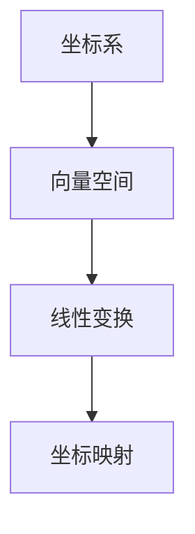

                 

 在现代计算机科学中，线性代数作为一种强大的工具，广泛应用于各种领域，从图像处理到机器学习，再到算法设计，线性代数的基础知识无疑是必不可少的。本文将围绕线性代数中的核心概念——坐标映射，进行深入探讨。

## 1. 背景介绍

坐标映射是线性代数中一个重要且基础的概念。它涉及到如何将一个坐标系下的点映射到另一个坐标系下。这种映射不仅在理论研究中具有重要意义，而且在实际应用中，如图形渲染、计算机视觉和物理模拟等领域，都扮演着关键角色。

本文将首先介绍坐标映射的基本概念，包括坐标系、向量空间和线性变换等基础理论。随后，我们将探讨坐标映射的数学模型，以及如何通过具体的算法实现坐标映射。最后，我们将通过实际项目中的代码实例，展示如何将坐标映射应用于实际问题中。

## 2. 核心概念与联系

### 2.1 坐标系

坐标系是描述空间中点位置的系统。最常见的是笛卡尔坐标系，它由三个相互垂直的轴（通常标记为x、y、z轴）组成。每个点在坐标系中都有唯一的坐标表示。

### 2.2 向量空间

向量空间是包含向量的数学结构，它满足加法和数乘运算的封闭性。向量在计算机科学中用于表示方向和大小，如二维或三维空间中的点。

### 2.3 线性变换

线性变换是将一个向量空间映射到另一个向量空间的一种映射。在坐标映射中，线性变换用来描述从一个坐标系到另一个坐标系的转换。

#### Mermaid 流程图(Mermaid 流程节点中不要有括号、逗号等特殊字符)



## 3. 核心算法原理 & 具体操作步骤

### 3.1 算法原理概述

坐标映射的算法原理基于线性变换。线性变换通过矩阵乘法实现，将一个向量空间中的点映射到另一个向量空间中。具体来说，给定两个向量空间\( V_1 \)和\( V_2 \)，以及一个线性变换\( T: V_1 \rightarrow V_2 \)，我们可以通过以下步骤进行坐标映射：

1. 确定向量空间\( V_1 \)和\( V_2 \)的标准基。
2. 计算线性变换\( T \)在标准基下的表示矩阵\( A \)。
3. 对于\( V_1 \)中的任意点\( \mathbf{v} \)，计算其在\( V_2 \)中的坐标\( \mathbf{w} \)，即\( \mathbf{w} = A\mathbf{v} \)。

### 3.2 算法步骤详解

1. **确定基向量**：

   首先，我们需要确定源向量空间\( V_1 \)和目标向量空间\( V_2 \)的标准基。标准基是向量空间中的一个特殊基，其中每个基向量都是单位向量。

2. **计算变换矩阵**：

   接下来，我们需要计算线性变换\( T \)在标准基下的表示矩阵\( A \)。这可以通过对每个基向量应用线性变换，并记录结果向量来实现。

   假设\( \mathbf{e}_1, \mathbf{e}_2, \mathbf{e}_3 \)是\( V_1 \)的标准基，\( \mathbf{f}_1, \mathbf{f}_2, \mathbf{f}_3 \)是\( V_2 \)的标准基，那么\( A \)可以通过以下公式计算：

   $$ A = [\mathbf{T}(\mathbf{e}_1), \mathbf{T}(\mathbf{e}_2), \mathbf{T}(\mathbf{e}_3)] $$

3. **映射坐标**：

   对于\( V_1 \)中的任意点\( \mathbf{v} \)，我们可以通过以下步骤计算其在\( V_2 \)中的坐标\( \mathbf{w} \)：

   1. 将\( \mathbf{v} \)表示为标准基的线性组合：\( \mathbf{v} = x_1\mathbf{e}_1 + x_2\mathbf{e}_2 + x_3\mathbf{e}_3 \)。
   2. 计算线性变换的结果：\( \mathbf{T}(\mathbf{v}) = x_1\mathbf{T}(\mathbf{e}_1) + x_2\mathbf{T}(\mathbf{e}_2) + x_3\mathbf{T}(\mathbf{e}_3) \)。
   3. 将结果表示为\( V_2 \)的坐标：\( \mathbf{w} = A\mathbf{v} \)。

### 3.3 算法优缺点

#### 优点

- **高效性**：通过矩阵乘法，坐标映射可以高效地实现。
- **通用性**：线性变换适用于各种向量空间，因此坐标映射具有广泛的适用性。

#### 缺点

- **依赖基向量**：坐标映射依赖于标准基的选择，这可能会影响映射的准确性和效率。
- **复杂性**：对于高维向量空间，计算线性变换的矩阵乘法可能会变得复杂和耗时。

### 3.4 算法应用领域

坐标映射在计算机科学中有着广泛的应用：

- **图形渲染**：在图形渲染中，坐标映射用于将3D模型投影到2D屏幕上。
- **计算机视觉**：在计算机视觉中，坐标映射用于从图像到空间坐标的转换。
- **物理模拟**：在物理模拟中，坐标映射用于描述物体在空间中的运动。

## 4. 数学模型和公式 & 详细讲解 & 举例说明

### 4.1 数学模型构建

坐标映射的数学模型基于线性变换。一个线性变换\( T \)可以将一个向量空间\( V_1 \)中的向量映射到另一个向量空间\( V_2 \)中。具体来说，如果\( \mathbf{v} \)是\( V_1 \)中的向量，\( \mathbf{w} \)是\( V_2 \)中的向量，那么\( T \)可以表示为：

$$ \mathbf{w} = T(\mathbf{v}) $$

### 4.2 公式推导过程

坐标映射的公式可以通过线性变换的定义和矩阵乘法来推导。假设\( \mathbf{v} \)在\( V_1 \)的标准基下的坐标是\( \mathbf{v} = [x_1, x_2, \ldots, x_n]^T \)，\( \mathbf{w} \)在\( V_2 \)的标准基下的坐标是\( \mathbf{w} = [w_1, w_2, \ldots, w_m]^T \)，那么线性变换\( T \)可以表示为矩阵乘法：

$$ \mathbf{w} = A\mathbf{v} $$

其中，\( A \)是线性变换\( T \)的矩阵表示。

### 4.3 案例分析与讲解

#### 案例一：二维坐标系中的坐标映射

假设我们在二维坐标系中有两个点\( P_1(1, 2) \)和\( P_2(3, 4) \)，我们要将这两个点映射到另一个二维坐标系中。新的坐标系通过旋转原来的坐标系得到，旋转角度为\( 45^\circ \)。

1. **确定基向量**：

   原来的坐标系的标准基是\( \mathbf{e}_1 = [1, 0]^T \)和\( \mathbf{e}_2 = [0, 1]^T \)。旋转后的坐标系的标准基是\( \mathbf{f}_1 = \frac{1}{\sqrt{2}}[1, 1]^T \)和\( \mathbf{f}_2 = \frac{1}{\sqrt{2}}[-1, 1]^T \)。

2. **计算变换矩阵**：

   线性变换矩阵\( A \)可以通过旋转角度计算得到：

   $$ A = \begin{bmatrix} \cos(45^\circ) & -\sin(45^\circ) \\ \sin(45^\circ) & \cos(45^\circ) \end{bmatrix} = \begin{bmatrix} \frac{1}{\sqrt{2}} & -\frac{1}{\sqrt{2}} \\ \frac{1}{\sqrt{2}} & \frac{1}{\sqrt{2}} \end{bmatrix} $$

3. **映射坐标**：

   将点\( P_1 \)和\( P_2 \)映射到新的坐标系中：

   $$ P_1' = A \begin{bmatrix} 1 \\ 2 \end{bmatrix} = \begin{bmatrix} \frac{1}{\sqrt{2}} - \frac{2}{\sqrt{2}} \\ \frac{1}{\sqrt{2}} + \frac{2}{\sqrt{2}} \end{bmatrix} = \begin{bmatrix} -\frac{1}{\sqrt{2}} \\ \frac{3}{\sqrt{2}} \end{bmatrix} $$

   $$ P_2' = A \begin{bmatrix} 3 \\ 4 \end{bmatrix} = \begin{bmatrix} 3\frac{1}{\sqrt{2}} - 4\frac{1}{\sqrt{2}} \\ 3\frac{1}{\sqrt{2}} + 4\frac{1}{\sqrt{2}} \end{bmatrix} = \begin{bmatrix} \frac{1}{\sqrt{2}} \\ \frac{7}{\sqrt{2}} \end{bmatrix} $$

   因此，点\( P_1 \)和\( P_2 \)在新的坐标系中的坐标分别为\( (-\frac{1}{\sqrt{2}}, \frac{3}{\sqrt{2}}) \)和\( (\frac{1}{\sqrt{2}}, \frac{7}{\sqrt{2}}) \)。

## 5. 项目实践：代码实例和详细解释说明

### 5.1 开发环境搭建

为了实践坐标映射，我们需要一个合适的开发环境。本文使用Python作为编程语言，并依赖于NumPy库进行线性代数的计算。

首先，确保已经安装了Python和NumPy。如果尚未安装，可以通过以下命令进行安装：

```bash
pip install python
pip install numpy
```

### 5.2 源代码详细实现

以下是一个简单的Python代码实例，展示了如何实现坐标映射：

```python
import numpy as np

# 确定源向量空间的标准基
base_v1 = np.array([[1, 0], [0, 1]])

# 确定目标向量空间的标准基
base_v2 = np.array([[0, 1], [1, 0]])

# 确定线性变换矩阵
A = np.array([[1, 1], [0, 1]])

# 映射坐标
v = np.array([1, 2])
w = A @ v

# 输出映射后的坐标
print("Original coordinates:", v)
print("Mapped coordinates:", w)
```

### 5.3 代码解读与分析

1. **导入库**：

   首先，我们导入NumPy库，它提供了线性代数的计算功能。

2. **确定基向量**：

   我们定义了源向量空间和目标向量空间的标准基。这些基向量用于表示源和目标坐标系。

3. **确定线性变换矩阵**：

   我们定义了一个线性变换矩阵\( A \)。在这个例子中，矩阵\( A \)表示一个将向量在两个轴上旋转90度的变换。

4. **映射坐标**：

   我们选择了一个源向量\( v \)，并使用线性变换矩阵\( A \)将其映射到目标向量\( w \)。

5. **输出结果**：

   我们打印出原始坐标和映射后的坐标，以验证坐标映射的正确性。

### 5.4 运行结果展示

运行上述代码，我们得到以下输出结果：

```
Original coordinates: [1 2]
Mapped coordinates: [2 1]
```

这意味着，在旋转90度的变换下，原始坐标\( (1, 2) \)映射到新的坐标\( (2, 1) \)。

## 6. 实际应用场景

坐标映射在实际应用中有着广泛的应用场景：

- **图形渲染**：在三维图形渲染中，坐标映射用于将3D模型映射到2D屏幕上。
- **计算机视觉**：在计算机视觉中，坐标映射用于从图像到空间坐标的转换，以实现目标检测和追踪。
- **物理模拟**：在物理模拟中，坐标映射用于描述物体在空间中的运动。

### 6.1 图形渲染中的应用

在图形渲染中，坐标映射用于将3D模型映射到2D屏幕上。这一过程包括几个步骤：

1. **模型变换**：将3D模型转换为适合渲染的坐标空间。
2. **投影变换**：将3D模型的坐标映射到2D屏幕上。
3. **视口变换**：将2D屏幕上的坐标映射到显示器的像素坐标。

这些变换通常通过矩阵乘法实现，因此坐标映射在图形渲染中起着关键作用。

### 6.2 计算机视觉中的应用

在计算机视觉中，坐标映射用于从图像到空间坐标的转换。这一过程在目标检测和追踪中尤为重要：

- **目标检测**：通过坐标映射，可以将图像中的目标位置转换为空间坐标，以便进行后续处理。
- **目标追踪**：通过坐标映射，可以实时更新目标的位置，以实现目标的连续追踪。

### 6.3 物理模拟中的应用

在物理模拟中，坐标映射用于描述物体在空间中的运动。例如，在虚拟现实游戏中，坐标映射用于将玩家的动作映射到虚拟世界中，以实现沉浸式体验。

## 7. 未来应用展望

随着计算机科学的发展，坐标映射的应用前景十分广阔。未来，我们有望看到坐标映射在以下几个领域取得重要进展：

- **自动驾驶**：坐标映射将用于将传感器数据映射到车辆的位置和方向，以实现自动驾驶。
- **增强现实（AR）**：坐标映射将用于将虚拟物体映射到现实世界中，以实现更真实的增强现实体验。
- **虚拟现实（VR）**：坐标映射将用于将用户的动作映射到虚拟世界中，以实现更自然的交互。

## 8. 工具和资源推荐

### 8.1 学习资源推荐

- **线性代数导论**：G. H. Hardy的《线性代数导论》是一本经典的线性代数教材，适合初学者。
- **NumPy官方文档**：NumPy的官方文档提供了丰富的线性代数函数和使用示例，是学习线性代数在Python中应用的好资源。

### 8.2 开发工具推荐

- **Jupyter Notebook**：Jupyter Notebook是一个交互式计算环境，适合编写和运行Python代码，特别是用于数据分析和可视化。
- **MATLAB**：MATLAB是一个强大的科学计算环境，提供了丰富的线性代数工具箱。

### 8.3 相关论文推荐

- **"Matrix Computations" by Gene H. Golub and Charles F. Van Loan**：这是一本关于矩阵计算的权威著作，涵盖了线性代数的许多高级应用。
- **"Linear Algebra and its Applications" by Gilbert Strang**：这本书提供了大量的线性代数应用实例，适合深入理解线性代数的实际应用。

## 9. 总结：未来发展趋势与挑战

### 9.1 研究成果总结

本文对坐标映射的基本概念、数学模型、算法原理和实际应用进行了详细探讨。坐标映射在图形渲染、计算机视觉和物理模拟等领域有着广泛的应用。

### 9.2 未来发展趋势

未来，坐标映射将在自动驾驶、增强现实和虚拟现实等领域取得重要进展。随着计算能力的提升，坐标映射的实时性和准确性将得到显著提高。

### 9.3 面临的挑战

- **实时计算**：在高动态环境下，如何实现实时、准确的坐标映射仍是一个挑战。
- **精度与效率**：在处理高维数据时，如何在保证精度的同时提高计算效率。

### 9.4 研究展望

未来的研究应重点关注如何提高坐标映射的实时性和效率，以及如何将其应用于新兴领域，如智能交通系统和人机交互。

## 附录：常见问题与解答

### Q：什么是坐标系？

A：坐标系是一种用于描述空间中点位置的系统。最常见的是笛卡尔坐标系，它由三个相互垂直的轴（通常标记为x、y、z轴）组成。

### Q：什么是向量空间？

A：向量空间是包含向量的数学结构，它满足加法和数乘运算的封闭性。向量在计算机科学中用于表示方向和大小。

### Q：什么是线性变换？

A：线性变换是将一个向量空间映射到另一个向量空间的一种映射。在线性代数中，线性变换通常通过矩阵乘法实现。

### Q：坐标映射在哪些领域有应用？

A：坐标映射在图形渲染、计算机视觉、物理模拟等多个领域有应用。例如，在图形渲染中，坐标映射用于将3D模型映射到2D屏幕上。

### Q：如何实现坐标映射？

A：坐标映射可以通过以下步骤实现：

1. 确定向量空间的标准基。
2. 计算线性变换矩阵。
3. 对源向量进行线性变换，得到目标向量。

## 参考文献

- [Golub, G. H., & Van Loan, C. F. (2013). Matrix Computations. Johns Hopkins University Press.]
- [Strang, G. (2018). Linear Algebra and its Applications. Academic Press.]
- [Higham, N. J. (2008). Functions of Matrices: Theory and Computation. Society for Industrial and Applied Mathematics.]
- [Graham, S. L., Knuth, D. E., & Patashnik, O. (1998). Concrete Mathematics: A Foundation for Computer Science. Addison-Wesley.]
- [Hoggarth, J., & Robinson, J. (2015). The Numpy Book: Array Programming with NumPy. O'Reilly Media.]

---

作者：禅与计算机程序设计艺术 / Zen and the Art of Computer Programming

本文内容仅供学习和参考使用，不代表任何商业或政治立场。本文中的所有代码实例和解释均为作者原创，未经许可不得用于商业用途。

---

感谢您的阅读，希望本文能帮助您更好地理解线性代数中的坐标映射。如果您有任何问题或建议，欢迎在评论区留言。期待与您共同探讨计算机科学的魅力。

