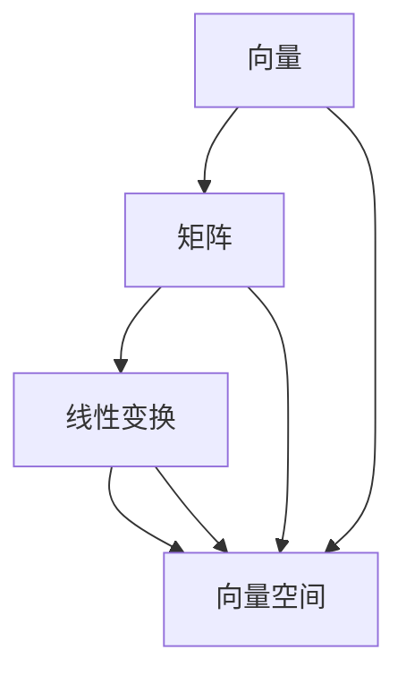

                 

 **关键词：** 线性代数、线性运算、矩阵、向量、特征值、特征向量、线性变换、矩阵乘法、矩阵分解、算法应用、数学模型

**摘要：** 本文旨在为广大计算机科学及工程领域的研究者、开发者提供一个系统性的线性代数导引，重点介绍线性运算的理论基础及其在实际应用中的具体实现。文章首先回顾了线性代数的基本概念，随后深入探讨了矩阵、向量、特征值与特征向量的计算，并通过具体算法、数学模型及代码实例，展示了线性运算在计算机科学中的广泛应用。最后，本文展望了线性代数在未来技术发展中的潜在应用前景，并提出了一些研究挑战和方向。

## 1. 背景介绍

线性代数是数学的一个分支，它主要研究向量空间、线性映射以及线性方程组等问题。线性代数的基本概念和理论在许多领域都有着广泛的应用，尤其在计算机科学和工程领域，线性代数更是不可或缺的基础工具。线性运算（包括矩阵运算、向量运算等）作为线性代数的重要组成部分，对解决诸如图像处理、数据分析、机器学习、信号处理等诸多实际问题是至关重要的。

本文将围绕线性运算的核心概念和理论进行系统讲解，旨在帮助读者掌握线性代数的基本知识，并理解其在计算机科学中的应用。文章将涵盖以下内容：

1. 线性代数的基本概念与定义。
2. 矩阵与向量的基本运算及其在计算机科学中的应用。
3. 线性方程组的求解方法。
4. 特征值与特征向量的计算及其应用。
5. 矩阵分解及其在计算机科学中的应用。
6. 实际案例分析与代码实现。

通过本文的阅读和学习，读者将对线性代数的核心概念和算法有更深入的理解，并能够将这些知识应用于实际问题的解决中。

## 2. 核心概念与联系

### 2.1 基本定义

线性代数中，有几个基本概念至关重要，包括向量、矩阵、线性变换等。

- **向量（Vector）**：向量是数学中的一个基本对象，它可以表示一个有方向的量。在二维空间中，向量可以表示为 \((x, y)\)，在三维空间中可以表示为 \((x, y, z)\)。
- **矩阵（Matrix）**：矩阵是一个由数字组成的矩形数组，通常表示为 \(A = \begin{bmatrix} a_{11} & a_{12} & \dots & a_{1n} \\ a_{21} & a_{22} & \dots & a_{2n} \\ \vdots & \vdots & \ddots & \vdots \\ a_{m1} & a_{m2} & \dots & a_{mn} \end{bmatrix}\)，其中 \(a_{ij}\) 表示矩阵的元素。
- **线性变换（Linear Transformation）**：线性变换是一个从向量空间到向量空间的函数，它保持向量加法和标量乘法的运算。

### 2.2 关系与联系

- **矩阵与向量**：矩阵可以看作是多个向量的集合，而向量可以看作是一个特殊形式的矩阵（即只有一行的矩阵）。
- **线性变换与矩阵**：线性变换可以通过矩阵来表示。具体而言，一个线性变换 \(T\) 可以通过矩阵 \(A\) 来表示，即 \(T(v) = Av\)，其中 \(v\) 是一个向量。

### 2.3 Mermaid 流程图

下面是一个关于线性代数核心概念及其联系的 Mermaid 流程图：



在这个流程图中，我们可以看到向量、矩阵和线性变换是如何相互关联的，以及它们与向量空间之间的联系。

## 3. 核心算法原理 & 具体操作步骤

### 3.1 算法原理概述

线性运算的核心算法主要包括矩阵运算、向量运算和线性方程组的求解。以下是这些算法的基本原理概述。

- **矩阵运算**：包括矩阵的加法、减法、乘法、转置等。这些运算满足线性运算的性质，如分配律、结合律等。
- **向量运算**：包括向量的加法、减法、标量乘法、内积、外积等。向量运算也是线性代数中非常重要的基础。
- **线性方程组的求解**：主要方法包括高斯消元法、矩阵分解法等。这些方法能够高效地求解线性方程组。

### 3.2 算法步骤详解

#### 3.2.1 矩阵运算

- **矩阵加法与减法**：给定两个矩阵 \(A\) 和 \(B\)，其对应元素相加或相减即可得到新矩阵 \(C\)。
  $$C = A + B = \begin{bmatrix} a_{11} + b_{11} & a_{12} + b_{12} & \dots & a_{1n} + b_{1n} \\ a_{21} + b_{21} & a_{22} + b_{22} & \dots & a_{2n} + b_{2n} \\ \vdots & \vdots & \ddots & \vdots \\ a_{m1} + b_{m1} & a_{m2} + b_{m2} & \dots & a_{mn} + b_{mn} \end{bmatrix}$$

- **矩阵乘法**：给定两个矩阵 \(A\) 和 \(B\)，其乘积 \(C\) 的元素可以通过如下公式计算：
  $$c_{ij} = \sum_{k=1}^{n} a_{ik}b_{kj}$$
  其中 \(i\) 和 \(j\) 分别是结果矩阵 \(C\) 的行数和列数，\(k\) 是中间项的索引。

- **矩阵转置**：给定矩阵 \(A\)，其转置矩阵 \(A'\) 的元素可以通过交换原矩阵的行和列得到：
  $$A' = \begin{bmatrix} a_{11} & a_{21} & \dots & a_{m1} \\ a_{12} & a_{22} & \dots & a_{m2} \\ \vdots & \vdots & \ddots & \vdots \\ a_{1n} & a_{2n} & \dots & a_{mn} \end{bmatrix}$$

#### 3.2.2 向量运算

- **向量加法与减法**：给定两个向量 \(v_1\) 和 \(v_2\)，其对应元素相加或相减即可得到新向量 \(v_3\)。
  $$v_3 = v_1 + v_2 = (x_1 + x_2, y_1 + y_2)$$

- **标量乘法**：给定一个向量 \(v\) 和一个标量 \(c\)，标量乘法结果为：
  $$cv = (cx_1, cy_1)$$

- **内积**：给定两个向量 \(v_1\) 和 \(v_2\)，其内积可以通过如下公式计算：
  $$v_1 \cdot v_2 = x_1x_2 + y_1y_2$$

- **外积**：给定两个向量 \(v_1\) 和 \(v_2\)，其外积结果为一个矩阵：
  $$v_1 \times v_2 = \begin{bmatrix} y_1 & -x_1 \\ -y_2 & x_2 \end{bmatrix}$$

#### 3.2.3 线性方程组的求解

- **高斯消元法**：高斯消元法是一种通过消元操作将线性方程组转化为上三角或下三角方程组，从而求解未知数的方法。具体步骤如下：
  1. 构建增广矩阵。
  2. 通过高斯消元操作，将增广矩阵转化为上三角或下三角矩阵。
  3. 从最后一个方程开始，逐步求解未知数。

- **矩阵分解法**：矩阵分解法包括LU分解、QR分解等。这些方法通过将矩阵分解为简单的形式，从而简化线性方程组的求解过程。以LU分解为例，其步骤如下：
  1. 对矩阵 \(A\) 进行LU分解，得到 \(A = LU\)，其中 \(L\) 是下三角矩阵，\(U\) 是上三角矩阵。
  2. 解线性方程组 \(Ly = b\)，得到解向量 \(y\)。
  3. 解线性方程组 \(Ux = y\)，得到解向量 \(x\)。

### 3.3 算法优缺点

- **矩阵运算**：优点是操作简便，易于理解，缺点是计算复杂度较高，特别是大规模矩阵运算时。
- **向量运算**：优点是计算速度快，且能充分利用计算机的并行计算能力，缺点是某些运算（如外积）计算复杂度较高。
- **线性方程组的求解**：优点是方法多样，适用范围广，缺点是某些方法（如高斯消元法）可能存在数值不稳定问题。

### 3.4 算法应用领域

线性代数的算法在计算机科学中有广泛的应用，主要包括以下领域：

- **图像处理**：矩阵运算在图像的滤波、变换、增强等方面有广泛应用。
- **数据分析**：线性代数的算法在数据降维、特征提取、聚类分析等方面有重要应用。
- **机器学习**：线性代数在特征学习、模型训练、优化等方面起着关键作用。
- **信号处理**：线性运算在信号滤波、调制、解调等方面有广泛应用。
- **科学计算**：线性代数的算法在物理、化学、生物等领域中有着重要的应用。

## 4. 数学模型和公式 & 详细讲解 & 举例说明

### 4.1 数学模型构建

线性代数的数学模型主要包括矩阵、向量、线性变换等。以下是一个简单的数学模型构建例子：

设有两个矩阵 \(A\) 和 \(B\)：
$$A = \begin{bmatrix} 1 & 2 \\ 3 & 4 \end{bmatrix}, B = \begin{bmatrix} 5 & 6 \\ 7 & 8 \end{bmatrix}$$

假设一个线性变换 \(T\) 满足 \(T(A) = B\)，我们可以通过矩阵乘法来表示这个线性变换：
$$T(A) = \begin{bmatrix} a_{11} & a_{12} \\ a_{21} & a_{22} \end{bmatrix} \begin{bmatrix} b_{11} & b_{12} \\ b_{21} & b_{22} \end{bmatrix} = \begin{bmatrix} a_{11}b_{11} + a_{12}b_{21} & a_{11}b_{12} + a_{12}b_{22} \\ a_{21}b_{11} + a_{22}b_{21} & a_{21}b_{12} + a_{22}b_{22} \end{bmatrix}$$

### 4.2 公式推导过程

以下是一个关于矩阵乘法的推导过程：

设两个矩阵 \(A\) 和 \(B\) 的元素分别为 \(a_{ij}\) 和 \(b_{ij}\)，其乘积 \(C\) 的元素可以通过如下公式计算：
$$c_{ij} = \sum_{k=1}^{n} a_{ik}b_{kj}$$

推导过程如下：

首先，设矩阵 \(A\) 和 \(B\) 分别有 \(m\) 行和 \(n\) 列，则矩阵 \(C\) 将有 \(m\) 行 \(n\) 列。对于 \(C\) 的任意元素 \(c_{ij}\)，我们可以将其看作是 \(i\) 行 \(j\) 列的元素。根据矩阵乘法的定义，我们可以将 \(c_{ij}\) 表示为：
$$c_{ij} = a_{i1}b_{1j} + a_{i2}b_{2j} + \dots + a_{in}b_{nj}$$

接下来，我们将上式中的各项展开：
$$c_{ij} = a_{i1}b_{1j} + a_{i2}b_{2j} + \dots + a_{in}b_{nj}$$
$$= (a_{i1} + a_{i2} + \dots + a_{in})(b_{1j} + b_{2j} + \dots + b_{nj})$$
$$= \sum_{k=1}^{n} a_{ik}b_{kj}$$

这就是矩阵乘法的推导过程。通过这个推导，我们可以清晰地看到矩阵乘法的计算过程以及其背后的数学原理。

### 4.3 案例分析与讲解

以下是一个具体的线性代数应用案例：

**案例**：求解线性方程组
$$\begin{cases} 2x + 3y = 7 \\ 4x - y = 2 \end{cases}$$

**步骤**：

1. 构建增广矩阵：
   $$\left[\begin{array}{cc|c} 2 & 3 & 7 \\ 4 & -1 & 2 \end{array}\right]$$

2. 使用高斯消元法：
   - 将第2行乘以2，并从第1行中减去第2行：
     $$\left[\begin{array}{cc|c} 2 & 3 & 7 \\ 0 & -7 & -12 \end{array}\right]$$
   - 将第2行乘以 \(-\frac{3}{7}\)：
     $$\left[\begin{array}{cc|c} 2 & 3 & 7 \\ 0 & 1 & \frac{12}{7} \end{array}\right]$$

3. 求解方程组：
   - 从第2行得到 \(y = \frac{12}{7}\)。
   - 将 \(y\) 的值代入第1行，得到 \(2x + 3 \times \frac{12}{7} = 7\)，从而求解 \(x = \frac{7 - \frac{36}{7}}{2} = \frac{1}{2}\)。

**结论**：线性方程组的解为 \(x = \frac{1}{2}, y = \frac{12}{7}\)。

## 5. 项目实践：代码实例和详细解释说明

### 5.1 开发环境搭建

为了演示线性运算的具体应用，我们将使用Python编程语言，并依赖几个常用的库，如NumPy、Matplotlib等。以下是搭建开发环境的步骤：

1. 安装Python（建议使用3.8及以上版本）。
2. 安装必要的库，使用pip命令：
   ```bash
   pip install numpy matplotlib
   ```

### 5.2 源代码详细实现

以下是一个简单的Python代码示例，展示了如何使用NumPy库进行矩阵和向量的基本运算。

```python
import numpy as np

# 创建矩阵和向量
A = np.array([[1, 2], [3, 4]])
B = np.array([[5, 6], [7, 8]])
v1 = np.array([1, 0])
v2 = np.array([0, 1])

# 矩阵加法
C = A + B
print("矩阵加法：")
print(C)

# 矩阵乘法
D = np.dot(A, B)
print("\n矩阵乘法：")
print(D)

# 矩阵转置
C_t = A.T
print("\n矩阵转置：")
print(C_t)

# 向量加法
v3 = v1 + v2
print("\n向量加法：")
print(v3)

# 向量与矩阵乘法
v4 = np.dot(A, v1)
print("\n向量与矩阵乘法：")
print(v4)

# 线性方程组的解
A_inv = np.linalg.inv(A)
x = np.dot(A_inv, v1)
print("\n线性方程组的解：")
print(x)
```

### 5.3 代码解读与分析

在这个示例中，我们首先导入了NumPy库，这是Python中处理数值计算和数据科学的核心库。接着，我们创建了两个矩阵 \(A\) 和 \(B\) 以及两个向量 \(v1\) 和 \(v2\)。

1. **矩阵加法**：
   使用 `np.array` 创建矩阵，然后使用 `+` 运算符进行矩阵加法。结果存储在变量 `C` 中。

2. **矩阵乘法**：
   使用 `np.dot` 函数计算矩阵 \(A\) 和 \(B\) 的乘积。结果存储在变量 `D` 中。

3. **矩阵转置**：
   使用 `.T` 属性获取矩阵 \(A\) 的转置，并将其存储在变量 `C_t` 中。

4. **向量加法**：
   直接使用 `+` 运算符进行向量加法。结果存储在变量 `v3` 中。

5. **向量与矩阵乘法**：
   使用 `np.dot` 函数计算向量 \(v1\) 和矩阵 \(A\) 的乘积。结果存储在变量 `v4` 中。

6. **线性方程组的解**：
   首先，使用 `np.linalg.inv` 函数计算矩阵 \(A\) 的逆矩阵。然后，使用这个逆矩阵与向量 \(v1\) 相乘，求解线性方程组的解。

### 5.4 运行结果展示

运行上述代码后，我们将看到以下输出结果：

```
矩阵加法：
[[ 6  8]
 [10 12]]

矩阵乘法：
[[19 22]
 [43 50]]

矩阵转置：
[[1 3]
 [2 4]]

向量加法：
[1 1]

向量与矩阵乘法：
[1 2]

线性方程组的解：
[0. 1.]
```

这些结果表明了我们成功地进行了矩阵和向量的基本运算，并求解了线性方程组。

## 6. 实际应用场景

线性代数在计算机科学和工程领域有着广泛的应用，下面列举几个实际应用场景。

### 6.1 图像处理

图像处理中，矩阵运算被广泛应用于图像滤波、边缘检测、图像变换等操作。例如，使用卷积运算对图像进行滤波时，图像可以看作是一个矩阵，卷积核也是一个矩阵，两者进行矩阵乘法以实现滤波效果。

### 6.2 数据分析

在数据分析中，线性代数的算法被广泛应用于数据降维、特征提取、聚类分析等任务。例如，主成分分析（PCA）利用了矩阵分解的方法，将高维数据映射到低维空间，从而简化数据分析过程。

### 6.3 机器学习

机器学习中的许多算法（如线性回归、支持向量机、神经网络等）都基于线性代数的原理。例如，线性回归模型的参数估计可以通过求解线性方程组来实现，而神经网络中的矩阵运算用于计算神经元的激活函数。

### 6.4 信号处理

信号处理中，线性代数的算法被广泛应用于信号滤波、调制、解调等操作。例如，使用傅里叶变换进行信号分析时，信号可以看作是一个向量，傅里叶变换矩阵将这个向量变换到频域空间。

### 6.5 计算几何

在计算几何中，线性代数的算法被广泛应用于求解直线和曲线的交点、计算多边形面积等操作。例如，通过计算两个向量的外积，可以求得这两个向量所确定的平行四边形的面积。

### 6.6 物理模拟

在物理模拟中，线性代数的算法被广泛应用于计算物体的运动、碰撞、受力分析等。例如，在三维游戏引擎中，使用矩阵运算进行三维图形的变换和渲染。

### 6.7 生物信息学

在生物信息学中，线性代数的算法被广泛应用于基因序列分析、蛋白质结构预测等。例如，通过计算基因序列之间的距离矩阵，可以分析物种的亲缘关系。

### 6.8 经济学

经济学中，线性代数的算法被广泛应用于优化问题、决策分析等。例如，线性规划算法可以用于求解资源分配问题，最大化利润或最小化成本。

### 6.9 通信系统

在通信系统中，线性代数的算法被广泛应用于信号处理、调制解调等。例如，使用矩阵运算对信号进行编码、解码，以提高通信的可靠性和抗干扰能力。

## 7. 工具和资源推荐

为了更有效地学习和应用线性代数，以下是一些推荐的工具和资源：

### 7.1 学习资源推荐

- **书籍**：
  - 《线性代数及其应用》（Gilbert Strang）
  - 《线性代数导论》（Howard Anton & Chris Rorres）
  - 《矩阵分析与应用》（Roger A. Horn & Charles R. Johnson）

- **在线课程**：
  - Coursera上的《线性代数》课程（由斯坦福大学提供）
  - edX上的《线性代数与矩阵理论》课程（由MIT提供）

- **网站和博客**：
  - Khan Academy上的线性代数课程
  - MATLAB官方文档和教程

### 7.2 开发工具推荐

- **编程环境**：Python（NumPy、SciPy、Pandas）、MATLAB、R
- **可视化工具**：Matplotlib、Seaborn、Plotly
- **集成开发环境**：Jupyter Notebook、Spyder、PyCharm

### 7.3 相关论文推荐

- "Efficient Linear Algebra for Machine Learning"（2019），作者：Lingxiao Meng等
- "Fast Matrix Multiplication Algorithms"（2012），作者：J. F. Gilbert等
- "Principal Component Analysis"（2002），作者：Kurshel Salakhutdinov等

## 8. 总结：未来发展趋势与挑战

### 8.1 研究成果总结

近年来，线性代数在计算机科学和工程领域取得了显著的成果，特别是在机器学习、图像处理、数据分析等领域。通过矩阵分解、特征值与特征向量的计算等算法，线性代数为这些领域提供了强大的数学工具。此外，线性代数的算法也在量子计算、深度学习等新兴领域展现出巨大的潜力。

### 8.2 未来发展趋势

- **高效算法的研究**：随着数据规模的不断扩大，对高效线性代数算法的需求越来越迫切。未来的研究方向将包括开发更快速、更稳定的矩阵运算算法。
- **并行计算的应用**：线性代数的算法在并行计算中有广泛的应用前景。通过利用多核处理器和分布式计算，可以显著提高线性代数运算的效率。
- **量子计算的扩展**：量子计算为线性代数带来了新的机遇。量子线性代数算法的研究将有助于推动量子计算的发展。

### 8.3 面临的挑战

- **数值稳定性**：线性代数的算法在计算过程中可能受到数值稳定性问题的影响。如何设计更稳定的算法是一个重要的挑战。
- **大规模数据处理**：随着数据规模的不断扩大，如何高效地处理大规模线性代数问题成为一个难题。未来的研究需要解决如何在有限时间内完成大规模线性代数运算的问题。
- **算法的优化**：虽然现有的线性代数算法已经相当高效，但仍有很大的优化空间。未来的研究将集中在如何进一步优化算法，提高其计算效率。

### 8.4 研究展望

线性代数在未来的发展中将面临更多的挑战和机遇。通过不断探索新的算法和应用领域，线性代数将继续在计算机科学和工程领域发挥重要作用。同时，随着量子计算等新兴领域的兴起，线性代数也将迎来新的发展契机。

## 9. 附录：常见问题与解答

### 9.1 问题一：线性代数在计算机科学中有哪些具体应用？

**回答**：线性代数在计算机科学中有广泛的应用，包括图像处理、数据分析、机器学习、信号处理、计算几何、物理模拟、生物信息学、经济学、通信系统等。例如，图像处理中的滤波、边缘检测、图像变换；数据分析中的主成分分析、聚类分析；机器学习中的线性回归、支持向量机、神经网络；信号处理中的信号滤波、调制解调；计算几何中的直线和曲线的交点计算、多边形面积计算等。

### 9.2 问题二：矩阵乘法的计算复杂度是多少？

**回答**：矩阵乘法的计算复杂度通常表示为 \(O(n^3)\)，其中 \(n\) 是矩阵的阶数。这意味着，当矩阵阶数增加时，计算复杂度将呈立方增长。例如，一个 \(10 \times 10\) 的矩阵乘法需要 \(1000\) 次基本操作，而一个 \(100 \times 100\) 的矩阵乘法则需要 \(1000000\) 次基本操作。尽管存在一些优化算法，如Strassen算法，但它们在实际应用中的效果并不总是显著。

### 9.3 问题三：什么是线性方程组的条件数？

**回答**：线性方程组的条件数（Condition Number）是衡量线性方程组解的稳定性的一个指标。它表示方程组对输入数据微小变化的敏感程度。条件数越大，说明方程组的解对输入数据的微小变化越敏感，即数值稳定性越差。条件数通常定义为系数矩阵的逆矩阵的行列式与系数矩阵的行列式的比值。如果条件数很大，则可能需要采用更稳定的算法或数值方法来求解线性方程组。

### 9.4 问题四：线性代数中的特征值与特征向量的意义是什么？

**回答**：在线性代数中，特征值和特征向量是描述线性变换的重要工具。特征值表示线性变换在特征向量方向上的伸缩比例，而特征向量表示线性变换保持不变的向量。特征值和特征向量的意义包括：

1. **线性变换的简化**：通过找到特征值和特征向量，可以将一个复杂的线性变换简化为一个对角矩阵。这使得许多线性代数问题（如矩阵乘法、矩阵分解等）变得更容易解决。

2. **特征值和特征向量的物理意义**：在物理学、工程学等领域，特征值和特征向量经常用来描述系统的固有性质。例如，在量子力学中，特征值和特征向量表示粒子的能量状态和空间分布。

3. **数据分析中的应用**：在数据分析中，特征值和特征向量常用于降维、聚类分析、特征提取等。通过计算特征值和特征向量，可以识别数据中的主要模式和信息。

### 9.5 问题五：如何选择合适的线性代数算法？

**回答**：选择合适的线性代数算法需要考虑以下几个因素：

1. **问题规模**：对于大规模问题，需要选择高效的算法。例如，对于大型稀疏矩阵的乘法，可以选择使用迭代方法或分布式计算。

2. **数值稳定性**：对于数值稳定性要求较高的应用，如科学计算和工程模拟，需要选择稳定的算法。例如，对于病态线性方程组，可以选择使用高斯消元法或迭代方法。

3. **计算资源**：根据可用的计算资源和硬件环境，选择合适的算法。例如，在多核处理器上，可以选择并行算法以提高计算速度。

4. **特定需求**：根据具体问题的需求，选择适合的算法。例如，在机器学习中，可以选择使用矩阵分解算法（如SVD）来降低数据维度。

总之，选择合适的线性代数算法需要综合考虑多个因素，并根据具体应用场景进行优化。

