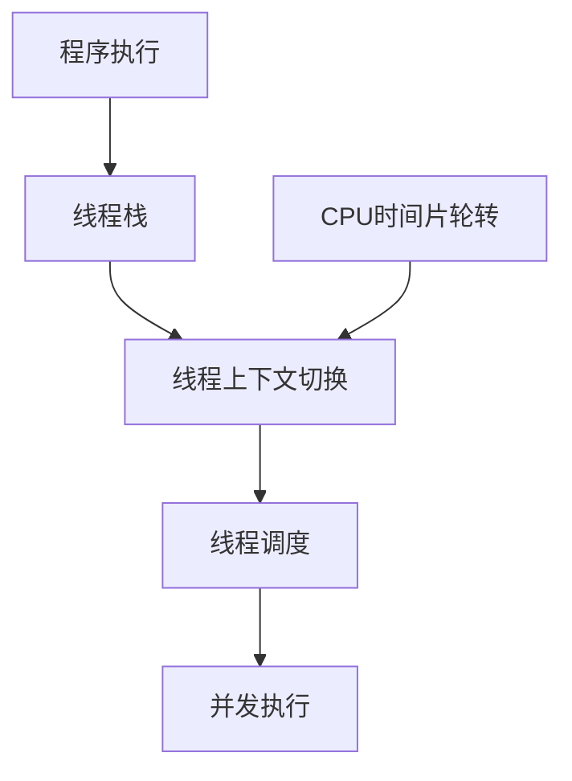

                 

关键词：线程、并发、并行、性能优化、操作系统、调度、同步、互斥

> 摘要：本文将深入探讨线程的概念、作用和实现，解析线程作为并发执行的基本单位的运行机制。通过对线程的原理、算法、实践应用以及未来发展趋势的全面分析，旨在为读者提供关于线程的全面理解和深入思考。

## 1. 背景介绍

在计算机科学中，线程是执行程序的基本单元。随着多核处理器的普及和并行计算的重要性日益增加，线程成为了现代操作系统和应用程序设计的关键组成部分。并发执行是指计算机系统在同一时间段内执行多个任务的能力，而线程则是实现并发执行的基本单位。线程通过在多核处理器上并行执行，显著提高了计算机的性能和效率。

线程的出现解决了单线程程序在执行过程中由于CPU时间片轮转导致的低效问题。在单线程程序中，程序执行是串行的，即一个任务执行完毕后，才能开始执行下一个任务。这种串行执行方式在单核处理器上运行效率较低，无法充分利用CPU的资源。而引入线程后，多个线程可以并行执行，每个线程都占用一部分CPU资源，从而提高了程序的执行速度。

线程还可以减少程序之间的阻塞和等待时间。在多线程程序中，如果一个线程需要等待某个资源（如数据库连接、网络通信等），其他线程可以继续执行，从而提高了程序的响应速度。此外，线程还可以提高程序的模块化和可维护性，使得程序更加灵活和易于扩展。

## 2. 核心概念与联系

线程作为并发执行的基本单位，涉及到多个核心概念，如线程栈、线程上下文切换、线程调度等。为了更好地理解线程的工作原理，我们可以通过以下Mermaid流程图展示这些概念之间的联系。



### 2.1 线程栈

线程栈是线程在执行过程中用于存储函数调用栈、局部变量、返回地址等信息的数据结构。线程栈随着线程的创建而创建，随着线程的销毁而销毁。线程栈的栈顶指向当前执行的函数，栈底指向线程创建时分配的初始栈空间。

### 2.2 线程上下文切换

线程上下文切换是指操作系统在执行多个线程时，为了在多个线程之间切换而保存和恢复线程上下文的过程。线程上下文包括程序计数器、寄存器、内存指针等关键信息。线程上下文切换的过程如下：

1. 保存当前线程的上下文信息，包括程序计数器、寄存器等。
2. 选择下一个要执行的线程。
3. 恢复下一个线程的上下文信息。
4. 执行下一个线程。

线程上下文切换是操作系统实现并发执行的关键技术，其效率直接影响到系统的性能。

### 2.3 线程调度

线程调度是指操作系统在多个线程之间分配CPU资源的过程。线程调度策略可以分为两种：抢占式调度和非抢占式调度。抢占式调度允许操作系统强制暂停当前执行的线程，切换到其他线程执行。非抢占式调度则让线程按照一定顺序执行，直到执行完毕或主动让出CPU资源。

常见的线程调度算法有：

1. **先来先服务（FCFS）**：按照线程到达的顺序进行调度，先到达的线程先执行。
2. **短作业优先（SJF）**：根据线程执行时间进行调度，执行时间较短的线程优先执行。
3. **优先级调度**：根据线程的优先级进行调度，优先级较高的线程优先执行。
4. **时间片轮转（RR）**：每个线程分配一个固定的时间片，依次执行，时间片用完后，线程被暂停，下一个线程开始执行。

### 2.4 并发执行

并发执行是指计算机系统在同一时间段内执行多个任务的能力。在多核处理器上，多个线程可以并行执行，从而提高了程序的执行速度。并发执行可以通过线程的并行执行、线程间的资源共享以及线程间的通信等方式实现。

## 3. 核心算法原理 & 具体操作步骤

### 3.1 算法原理概述

线程的实现涉及到多个核心算法，包括线程创建、线程终止、线程同步、线程互斥等。这些算法共同协作，实现了线程的并发执行。

### 3.2 算法步骤详解

#### 3.2.1 线程创建

线程创建是线程实现的第一步。操作系统为每个线程分配独立的线程栈、线程控制块（TCB）等资源，并初始化线程状态。线程创建的过程如下：

1. 分配线程栈空间。
2. 初始化线程控制块（TCB），包括线程标识、状态、调度信息等。
3. 将线程添加到线程队列，等待调度执行。

#### 3.2.2 线程终止

线程终止是指线程执行完毕或被操作系统强制终止。线程终止的过程如下：

1. 保存当前线程的上下文信息。
2. 清理线程资源，包括线程栈、线程控制块等。
3. 从线程队列中删除线程。

#### 3.2.3 线程同步

线程同步是指多个线程在执行过程中，为了协调共享资源的使用而采取的措施。线程同步的常见方法包括互斥锁、信号量、条件变量等。

1. **互斥锁**：互斥锁用于保证共享资源在任意时刻只被一个线程访问。线程在访问共享资源前，需要获得互斥锁，访问完成后释放互斥锁。

2. **信号量**：信号量是一种用于线程同步的同步原语，它包含两个原子操作：P操作（等待）和V操作（发送）。P操作使信号量的值减1，如果值为负，则线程进入等待状态；V操作使信号量的值加1，如果等待队列中有线程，则唤醒一个等待线程。

3. **条件变量**：条件变量用于线程之间的通信，线程在满足条件时才能继续执行。条件变量通常与互斥锁一起使用，线程在等待条件满足时释放互斥锁，条件变量满足后重新获取互斥锁。

#### 3.2.4 线程互斥

线程互斥是指多个线程在访问共享资源时，为了防止资源竞争而采取的措施。线程互斥的常见方法包括互斥锁、读写锁、信号量等。

1. **互斥锁**：互斥锁是一种简单的线程互斥机制，它用于保证共享资源在任意时刻只被一个线程访问。

2. **读写锁**：读写锁是一种更高级的线程互斥机制，它允许多个线程同时读取共享资源，但在写操作时需要互斥访问。

3. **信号量**：信号量是一种用于线程互斥的同步原语，它包含两个原子操作：P操作（等待）和V操作（发送）。P操作使信号量的值减1，如果值为负，则线程进入等待状态；V操作使信号量的值加1，如果等待队列中有线程，则唤醒一个等待线程。

### 3.3 算法优缺点

线程算法在提高程序并发执行性能方面具有显著优势，但也存在一定的缺点。

#### 3.3.1 优点

1. **提高程序性能**：通过线程并行执行，充分利用了多核处理器的资源，提高了程序的执行速度。
2. **提高程序模块化**：线程使得程序更加模块化，易于维护和扩展。
3. **降低程序阻塞和等待时间**：线程之间的资源共享和通信机制降低了程序的阻塞和等待时间，提高了程序的响应速度。

#### 3.3.2 缺点

1. **增加系统开销**：线程的创建、销毁和上下文切换等操作增加了系统的开销，对系统性能有一定影响。
2. **线程竞争和死锁**：多个线程在访问共享资源时容易产生竞争和死锁问题，需要采取相应的同步机制进行解决。
3. **调试和测试困难**：线程程序在调试和测试过程中容易产生线程安全问题，需要投入更多的时间和精力进行调试和测试。

### 3.4 算法应用领域

线程算法广泛应用于各个领域，如操作系统、数据库、网络通信、图形渲染等。

1. **操作系统**：操作系统通过线程实现进程的并发执行，提高了系统的性能和响应速度。
2. **数据库**：数据库系统通过线程实现并发访问和事务处理，提高了数据库的并发性能和可靠性。
3. **网络通信**：网络通信系统通过线程实现并发处理多个网络请求，提高了网络通信的性能和稳定性。
4. **图形渲染**：图形渲染系统通过线程实现图形渲染任务的并行处理，提高了图形渲染的效率和性能。

## 4. 数学模型和公式 & 详细讲解 & 举例说明

### 4.1 数学模型构建

线程的并发执行可以通过以下数学模型进行描述：

$$
\text{并发执行速度} = \frac{\text{线程数量} \times \text{每个线程的执行速度}}{\text{线程间通信开销} + \text{线程调度开销}}
$$

其中，线程数量、每个线程的执行速度、线程间通信开销和线程调度开销是影响并发执行速度的关键因素。

### 4.2 公式推导过程

根据上述数学模型，我们可以推导出以下公式：

1. **线程数量与并发执行速度的关系**：

$$
\text{并发执行速度} \propto \text{线程数量}
$$

这意味着线程数量越多，并发执行速度越快。但在实际应用中，线程数量过多会导致线程竞争和死锁问题，需要权衡线程数量与并发执行速度之间的关系。

2. **每个线程的执行速度与并发执行速度的关系**：

$$
\text{并发执行速度} \propto \text{每个线程的执行速度}
$$

这意味着提高每个线程的执行速度可以提高并发执行速度。为了提高每个线程的执行速度，可以采用以下方法：

- **优化算法**：优化线程算法，减少线程间的通信开销和调度开销。
- **提高CPU性能**：采用高性能的CPU，提高每个线程的执行速度。
- **线程级并行**：在单个线程内部实现并行计算，提高每个线程的执行速度。

3. **线程间通信开销与并发执行速度的关系**：

$$
\text{并发执行速度} \propto \frac{1}{\text{线程间通信开销}}
$$

这意味着降低线程间通信开销可以提高并发执行速度。为了降低线程间通信开销，可以采用以下方法：

- **减少线程间通信频率**：尽量减少线程间的通信次数，避免频繁的数据传输。
- **使用高效通信协议**：采用高效的通信协议，减少数据传输的开销。
- **共享内存**：使用共享内存机制，减少线程间的数据复制和传输。

4. **线程调度开销与并发执行速度的关系**：

$$
\text{并发执行速度} \propto \frac{1}{\text{线程调度开销}}
$$

这意味着降低线程调度开销可以提高并发执行速度。为了降低线程调度开销，可以采用以下方法：

- **减少线程切换频率**：尽量减少线程的切换次数，避免频繁的线程上下文切换。
- **使用高效调度算法**：采用高效的调度算法，减少线程切换的开销。
- **线程池**：使用线程池机制，复用线程，减少线程创建和销毁的开销。

### 4.3 案例分析与讲解

假设有一个应用程序，需要处理100个并发请求。根据上述数学模型，我们可以分析以下因素对并发执行速度的影响。

1. **线程数量**：假设每个线程的执行速度为1，线程间通信开销为1，线程调度开销为1。当线程数量为10时，并发执行速度为10。当线程数量增加到100时，并发执行速度增加到100。这说明线程数量对并发执行速度有显著影响。

2. **每个线程的执行速度**：假设线程数量为10，线程间通信开销为1，线程调度开销为1。当每个线程的执行速度为2时，并发执行速度为20。当每个线程的执行速度为3时，并发执行速度为30。这说明提高每个线程的执行速度可以提高并发执行速度。

3. **线程间通信开销**：假设线程数量为10，每个线程的执行速度为1，线程调度开销为1。当线程间通信开销为1时，并发执行速度为10。当线程间通信开销减少到0.5时，并发执行速度增加到20。这说明降低线程间通信开销可以提高并发执行速度。

4. **线程调度开销**：假设线程数量为10，每个线程的执行速度为1，线程间通信开销为1。当线程调度开销为1时，并发执行速度为10。当线程调度开销减少到0.5时，并发执行速度增加到20。这说明降低线程调度开销可以提高并发执行速度。

通过这个案例，我们可以看到数学模型和公式如何帮助我们分析和优化线程并发执行速度。

## 5. 项目实践：代码实例和详细解释说明

### 5.1 开发环境搭建

为了更好地展示线程的实现和应用，我们使用Python作为编程语言。在Python中，可以使用`threading`模块实现线程的创建、启动和同步。以下是开发环境的搭建步骤：

1. 安装Python环境：在官方网站下载并安装Python 3.x版本。
2. 安装IDE：推荐使用PyCharm或VS Code等IDE。
3. 创建Python虚拟环境：使用`venv`模块创建Python虚拟环境，确保项目依赖的库在本环境中安装。

```bash
python -m venv myenv
source myenv/bin/activate  # Windows: myenv\Scripts\activate
```

4. 安装依赖库：在虚拟环境中安装`threading`模块。

```bash
pip install threading
```

### 5.2 源代码详细实现

以下是一个简单的Python线程示例，展示了线程的创建、启动和同步：

```python
import threading

# 线程函数
def thread_function(name):
    print(f"线程 {name}: 开始执行")
    # 执行一些任务
    for i in range(3):
        print(f"线程 {name}: {i}")
        time.sleep(1)
    print(f"线程 {name}: 结束执行")

# 创建线程
thread1 = threading.Thread(target=thread_function, args=("Thread-1",))
thread2 = threading.Thread(target=thread_function, args=("Thread-2",))

# 启动线程
thread1.start()
thread2.start()

# 等待线程完成
thread1.join()
thread2.join()

print("主线程：所有线程已执行完毕")
```

### 5.3 代码解读与分析

1. **线程函数**：`thread_function`是一个线程函数，用于线程的执行任务。函数接收一个参数`name`，用于标识线程。

2. **创建线程**：使用`threading.Thread`类创建线程。`target`参数指定线程执行的函数，`args`参数传递给线程函数的参数。

3. **启动线程**：使用`start()`方法启动线程。

4. **等待线程完成**：使用`join()`方法等待线程执行完毕。

5. **主线程执行**：在所有线程执行完毕后，主线程继续执行。

### 5.4 运行结果展示

```python
线程 Thread-1: 开始执行
线程 Thread-1: 0
线程 Thread-2: 开始执行
线程 Thread-2: 0
线程 Thread-1: 1
线程 Thread-2: 1
线程 Thread-1: 2
线程 Thread-2: 2
线程 Thread-1: 结束执行
线程 Thread-2: 结束执行
主线程：所有线程已执行完毕
```

从运行结果可以看出，线程`Thread-1`和线程`Thread-2`并行执行，分别执行3次循环，然后结束。最后，主线程打印“所有线程已执行完毕”，表示所有线程已完成执行。

## 6. 实际应用场景

线程在实际应用场景中具有广泛的应用，如以下案例：

1. **Web服务器**：Web服务器使用线程处理并发请求，提高响应速度和并发性能。每个线程负责处理一个客户端请求，并发处理多个请求。

2. **数据库查询**：数据库查询操作可以使用线程并行执行，提高查询速度和性能。多个线程同时查询数据库，减少查询时间。

3. **图形渲染**：图形渲染系统可以使用线程并行处理图形渲染任务，提高渲染效率和性能。多个线程同时渲染不同的图形元素，提高渲染速度。

4. **大数据处理**：大数据处理任务可以使用线程并行执行，提高处理速度和性能。多个线程同时处理不同的数据子集，减少处理时间。

## 7. 未来应用展望

随着计算机技术的发展，线程的应用前景广阔。以下是对线程未来应用的展望：

1. **量子计算**：量子计算具有并行计算的优势，可以大幅提高计算性能。线程技术可以与量子计算相结合，实现高效的量子计算。

2. **边缘计算**：边缘计算将计算能力从云端转移到边缘设备，提高实时性和响应速度。线程技术可以优化边缘设备的计算性能，实现高效的边缘计算。

3. **AI应用**：AI应用具有大量并行计算需求，线程技术可以提高AI应用的计算速度和性能，推动AI技术的发展。

4. **虚拟现实和增强现实**：虚拟现实和增强现实应用对实时性和性能有较高要求，线程技术可以优化渲染和处理过程，提高用户体验。

## 8. 总结：未来发展趋势与挑战

线程作为并发执行的基本单位，在现代计算机系统中具有重要意义。未来，随着多核处理器、量子计算、边缘计算等技术的发展，线程的应用将越来越广泛。然而，线程也面临着以下挑战：

1. **线程安全**：线程安全是线程应用的重要问题，需要采取相应的同步机制和编程技巧确保线程的安全性。
2. **线程竞争和死锁**：线程竞争和死锁是线程应用中的常见问题，需要合理设计和优化线程调度策略。
3. **线程性能优化**：线程性能优化是提高程序执行速度的关键，需要采用高效的线程算法和编程方法。

未来，随着计算机技术的发展，线程技术将不断优化和改进，为计算机科学和工程领域带来更多创新和突破。

## 9. 附录：常见问题与解答

### 问题 1：什么是线程？

线程是执行程序的基本单元，它包含了程序计数器、寄存器、栈等执行所需的信息。线程可以与操作系统进行交互，执行操作系统分配的任务。

### 问题 2：线程与进程有什么区别？

线程和进程是计算机系统中两个重要的概念。进程是程序在计算机中的一次执行过程，拥有独立的内存空间、系统资源等。线程是进程中的执行单元，共享进程的内存空间和其他资源。简单来说，进程是程序在计算机中的运行实例，线程是进程内的执行单元。

### 问题 3：什么是线程同步？

线程同步是指在多线程环境中，线程之间为了协调对共享资源的使用而采取的措施。线程同步的常见方法包括互斥锁、信号量、条件变量等。

### 问题 4：什么是线程互斥？

线程互斥是指多个线程在访问共享资源时，为了防止资源竞争而采取的措施。线程互斥的常见方法包括互斥锁、读写锁、信号量等。

### 问题 5：如何避免线程竞争和死锁？

为了避免线程竞争和死锁，可以采取以下措施：

1. 限制线程数量：合理设置线程数量，避免过多线程导致资源竞争和死锁。
2. 采用高效的同步机制：选择合适的同步机制，如互斥锁、信号量等，确保线程安全。
3. 避免线程循环等待：设计合理的线程调度策略，避免线程循环等待导致死锁。
4. 避免共享资源的依赖关系：尽量避免线程之间的共享资源依赖关系，降低死锁的可能性。

## 结束语

线程作为并发执行的基本单位，在现代计算机系统中具有重要意义。本文通过对线程的概念、原理、算法和实践应用等方面的深入探讨，旨在为读者提供关于线程的全面理解和深入思考。随着计算机技术的发展，线程的应用前景将更加广阔，我们将不断优化和改进线程技术，推动计算机科学和工程领域的创新和发展。作者：禅与计算机程序设计艺术 / Zen and the Art of Computer Programming。

