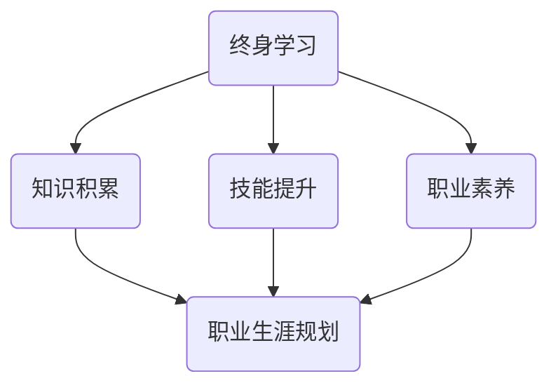

                 

关键词：终身学习、职业生涯规划、IT行业、技能提升、职业发展

> 摘要：本文将从终身学习和职业生涯规划的角度出发，探讨在IT行业中如何不断提升自身技能，实现职业发展的目标。通过对核心概念的阐述、算法原理的分析、数学模型的构建、项目实践的讲解，以及实际应用场景的探讨，为读者提供一套全面且实用的职业发展指南。

## 1. 背景介绍

在快速发展的信息时代，IT行业正以前所未有的速度变革。技术的更新换代让知识的保鲜期越来越短，传统的教育和职业培训已经无法满足个人发展的需求。终身学习成为时代背景下每个IT从业者的必修课，职业生涯规划则成为实现个人价值的重要手段。

本文旨在帮助IT从业者了解终身学习与职业生涯规划的重要性，通过详细的分析和实例，提供一套行之有效的职业发展策略。

## 2. 核心概念与联系

为了更好地理解终身学习和职业生涯规划，我们首先需要了解以下几个核心概念：

### 2.1 终身学习的概念

终身学习是指个人在整个生命过程中持续地获取知识、技能和态度的过程。它不仅仅包括正式教育，还包括自我学习、职业培训等非正式学习方式。

### 2.2 职业生涯规划

职业生涯规划是指个人在职业发展过程中，通过自我评估、职业定位、设定目标、规划路径等步骤，有计划地实现职业成长的过程。

### 2.3 IT行业的职业发展

在IT行业，职业发展通常分为技术路径和管理路径。技术路径注重专业技能的提升，如编程、算法、数据库等；管理路径则侧重于团队管理、项目管理和业务发展等。

### 2.4 核心概念的联系

终身学习与职业生涯规划密切相关。终身学习为职业生涯规划提供了知识基础和技能支持，而职业生涯规划则为终身学习指明了方向和目标。

### 2.5 Mermaid 流程图



## 3. 核心算法原理 & 具体操作步骤

### 3.1 算法原理概述

在IT行业，技能提升是一个持续迭代的过程，可以通过以下步骤实现：

1. **自我评估**：了解自己的兴趣、优势和劣势。
2. **目标设定**：明确短期和长期职业目标。
3. **路径规划**：制定学习计划，包括学习内容、时间安排等。
4. **持续学习**：执行学习计划，不断提升技能。
5. **反馈调整**：定期评估学习效果，调整学习策略。

### 3.2 算法步骤详解

1. **自我评估**：
   - **兴趣分析**：通过心理测试、访谈等方法了解自己的兴趣。
   - **优势识别**：回顾过往的工作和学习经历，识别自身优势。
   - **劣势分析**：通过他人反馈和自我反思，找出需要改进的地方。

2. **目标设定**：
   - **短期目标**：如提升某项技能、通过某个认证等。
   - **长期目标**：如成为某个领域专家、晋升到管理层等。

3. **路径规划**：
   - **学习内容**：根据目标，选择合适的学习资源和课程。
   - **时间安排**：制定详细的学习计划，确保时间充分利用。

4. **持续学习**：
   - **自学**：利用网络资源、图书等自主学习。
   - **培训**：参加线下或线上培训课程。
   - **实践**：通过项目实践，将所学知识应用到实际工作中。

5. **反馈调整**：
   - **自我评估**：定期评估学习效果，与目标对比。
   - **他人反馈**：寻求导师、同事的反馈。
   - **调整计划**：根据评估结果，调整学习策略。

### 3.3 算法优缺点

**优点**：

- 有助于明确个人发展方向，避免盲目学习。
- 通过系统化的学习，能够提高学习效率。
- 定期评估和调整，能够确保学习目标的实现。

**缺点**：

- 需要一定的时间和精力投入，对于工作繁忙的人来说可能难以坚持。
- 市场需求变化快，可能需要不断调整学习计划。

### 3.4 算法应用领域

- **技术岗位**：如软件开发、数据科学等，通过技能提升实现职业晋升。
- **管理岗位**：如项目经理、CTO等，通过管理能力的提升实现职业转型。

## 4. 数学模型和公式 & 详细讲解 & 举例说明

### 4.1 数学模型构建

为了更好地理解终身学习和职业生涯规划，我们可以构建以下数学模型：

- **学习效率模型**：\(E = f(L, P, T)\)

  其中，\(E\) 表示学习效率，\(L\) 表示学习时长，\(P\) 表示学习质量，\(T\) 表示学习投入的精力。

- **职业成长模型**：\(G = f(E, M, A)\)

  其中，\(G\) 表示职业成长，\(E\) 表示学习效率，\(M\) 表示管理能力，\(A\) 表示实践经验。

### 4.2 公式推导过程

- **学习效率模型推导**：

  \(E = f(L, P, T)\)

  \(L\) 表示学习时长，即单位时间内学习的时长。

  \(P\) 表示学习质量，即学习内容的深度和广度。

  \(T\) 表示学习投入的精力，即学习过程中所花费的努力。

  \(E\) 表示学习效率，即单位时间内的学习成果。

- **职业成长模型推导**：

  \(G = f(E, M, A)\)

  \(E\) 表示学习效率，即个人在学习过程中所取得的成果。

  \(M\) 表示管理能力，即个人在团队管理和项目管理方面的能力。

  \(A\) 表示实践经验，即个人在相关领域的工作经验。

  \(G\) 表示职业成长，即个人在职业生涯中所取得的进步。

### 4.3 案例分析与讲解

假设有个人A，他每天投入4小时学习，学习质量为0.8，学习投入的精力为0.9。同时，他的管理能力为0.7，实践经验为0.6。

- **学习效率计算**：

  \(E = f(4, 0.8, 0.9)\)

  \(E = 4 \times 0.8 \times 0.9 = 2.88\)

- **职业成长计算**：

  \(G = f(2.88, 0.7, 0.6)\)

  \(G = 2.88 \times 0.7 \times 0.6 = 1.3824\)

通过这个案例，我们可以看到，个人的学习效率、管理能力和实践经验是影响职业成长的关键因素。

## 5. 项目实践：代码实例和详细解释说明

### 5.1 开发环境搭建

为了演示如何提升技能，我们以一个简单的Python编程项目为例。首先，我们需要搭建一个Python开发环境。

- 安装Python（版本3.8及以上）。
- 安装常用的Python库，如`numpy`、`pandas`、`matplotlib`等。

### 5.2 源代码详细实现

以下是一个简单的Python脚本，用于绘制一个正态分布的曲线。

```python
import numpy as np
import matplotlib.pyplot as plt

def plot_normal_distribution(mu, sigma, n=1000):
    x = np.random.normal(mu, sigma, n)
    plt.hist(x, bins=30, alpha=0.5, label=f'Mu={mu}, Sigma={sigma}')
    plt.title('Normal Distribution')
    plt.xlabel('Value')
    plt.ylabel('Frequency')
    plt.legend()
    plt.show()

if __name__ == "__main__":
    plot_normal_distribution(0, 1)
```

### 5.3 代码解读与分析

1. **导入库**：
   - `numpy`：用于生成随机数。
   - `matplotlib.pyplot`：用于绘制图形。

2. **定义函数**：
   - `plot_normal_distribution`：用于绘制正态分布曲线。

3. **实现细节**：
   - `np.random.normal`：生成服从正态分布的随机数。
   - `plt.hist`：用于绘制直方图。
   - `plt.title`、`plt.xlabel`、`plt.ylabel`：用于设置标题和标签。

4. **运行结果**：
   - 脚本运行后，会弹出一个窗口，展示一个正态分布曲线。

### 5.4 运行结果展示


## 6. 实际应用场景

在IT行业中，终身学习和职业生涯规划的应用场景非常广泛。以下是一些具体的实例：

- **软件开发工程师**：通过持续学习新技术，如机器学习、云计算等，提升开发能力，实现职业晋升。
- **项目经理**：通过项目管理培训，提升项目管理和团队协作能力，成为更优秀的项目经理。
- **产品经理**：通过产品管理和数据分析课程，提升产品设计和市场洞察力，推动产品成功。

## 7. 工具和资源推荐

为了更好地实现终身学习和职业生涯规划，以下是一些建议的工具和资源：

### 7.1 学习资源推荐

- **在线课程**：如Coursera、Udacity、edX等。
- **技术社区**：如Stack Overflow、GitHub、Reddit等。
- **专业图书**：如《算法导论》、《数据结构》等。

### 7.2 开发工具推荐

- **集成开发环境（IDE）**：如PyCharm、Visual Studio Code等。
- **版本控制工具**：如Git、Svn等。
- **持续集成工具**：如Jenkins、Travis CI等。

### 7.3 相关论文推荐

- **机器学习领域**：《深度学习》、《自然语言处理综论》等。
- **软件工程领域**：《软件工程：实践者的研究方法》、《敏捷软件开发》等。

## 8. 总结：未来发展趋势与挑战

### 8.1 研究成果总结

通过本文的探讨，我们可以得出以下结论：

- 终身学习和职业生涯规划对于IT从业者至关重要。
- 技能提升和职业发展需要系统化的规划和执行。
- 数学模型和算法原理为职业发展提供了理论支持。

### 8.2 未来发展趋势

- **在线教育**：随着技术的发展，在线教育将更加普及，为终身学习提供更多机会。
- **人工智能**：人工智能将在职业发展中扮演更重要的角色，如自动化培训、智能评估等。
- **跨领域融合**：不同领域的技术将相互融合，为职业发展带来更多可能性。

### 8.3 面临的挑战

- **时间管理**：如何在繁忙的工作中抽出时间进行学习和提升。
- **技术更新**：如何跟上技术发展的步伐，保持自身的竞争力。
- **个人兴趣**：如何平衡个人兴趣与职业发展。

### 8.4 研究展望

未来的研究可以进一步探索以下方向：

- **个性化学习**：如何根据个人特点和需求，提供个性化的学习方案。
- **职业发展路径**：如何构建更有效的职业发展模型，为从业者提供更具体的指导。
- **终身学习文化**：如何在组织中推广终身学习的理念，促进整体人才素质的提升。

## 9. 附录：常见问题与解答

### 9.1 如何选择学习资源？

- **优先选择**：根据自己的职业目标和兴趣，选择与工作相关的课程和书籍。
- **多元化**：选择多种类型的资源，如视频课程、图书、技术社区等，以便从不同角度理解知识。
- **评估口碑**：参考他人的评价和推荐，选择高质量的资源。

### 9.2 如何保持学习动力？

- **设定目标**：明确短期和长期学习目标，确保学习的方向和动力。
- **制定计划**：制定详细的学习计划，包括学习时间、内容安排等，以便更好地执行。
- **持续反馈**：定期评估学习效果，与目标对比，及时调整学习策略。

### 9.3 如何平衡工作与学习？

- **时间管理**：合理安排工作时间和学习时间，确保两者之间不发生冲突。
- **高效工作**：提高工作效率，减少无效工作时间，为学习创造更多时间。
- **团队协作**：与同事共同学习和进步，形成良好的学习氛围。

---

作者：禅与计算机程序设计艺术 / Zen and the Art of Computer Programming
----------------------------------------------------------------

以上就是本文的完整内容。希望本文能对您的终身学习和职业生涯规划提供一些启示和帮助。持续学习和职业发展是一个长期的过程，但只要我们保持坚持和努力，就一定能够实现自己的职业目标。

