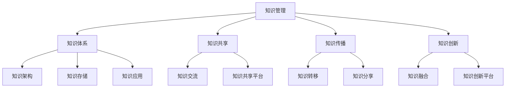

                 

  
## 1. 背景介绍

在当今快速发展的信息技术时代，知识已经成为企业、组织和个体成功的关键因素。有效的知识管理不仅可以提高工作效率，还能促进创新和竞争力的提升。因此，管理者构筑知识体系的重要性日益凸显。本文旨在探讨管理者如何通过构建知识体系来实现知识共享、传播和创新，从而推动组织的发展。

本文的研究背景源于现代信息技术在知识管理领域的应用，特别是在大数据、云计算、人工智能等技术的推动下，知识管理的方法和工具得到了极大的丰富和发展。本文的核心目标是提出一套系统性的方法，帮助管理者构建高效的知识体系，以应对日益复杂的市场环境和竞争压力。

本文的研究意义在于：

1. **理论意义**：通过梳理知识管理的核心概念和理论，构建一个全面的知识管理体系，为相关领域的研究提供理论参考。
2. **实践意义**：为企业管理者提供实用的知识管理方法和工具，帮助他们在实际工作中更好地运用知识管理，提高组织绩效。

本文将首先介绍知识管理的基本概念，然后探讨知识体系的构建原则和框架，接着分析核心算法原理，详细讲解数学模型和公式，并通过项目实践展示知识体系在实际应用中的效果。最后，本文将对未来知识管理体系的发展趋势和面临的挑战进行展望。

## 2. 核心概念与联系

在深入探讨知识管理之前，我们需要明确几个核心概念，并理解它们之间的联系。以下是几个关键概念及其相互关系的Mermaid流程图：



### 2.1 知识管理

知识管理是指通过系统的策略和方法，对知识进行识别、获取、共享、应用和创新，以提高组织竞争力的过程。知识管理不仅仅是对知识的管理，更是对知识流动和转化的管理。

### 2.2 知识体系

知识体系是指一系列相互关联的知识要素组成的整体，包括知识的架构、存储、应用等方面。一个完整的知识体系应该能够支持知识的有效共享、传播和创新。

### 2.3 知识共享

知识共享是指将知识从一个个体或团队传递到另一个个体或团队的过程。知识共享可以发生在组织内部，也可以发生在组织外部。有效的知识共享可以促进知识流动，提高组织整体的知识水平。

### 2.4 知识传播

知识传播是指知识在组织内外部的传播过程，包括知识共享、知识转移和知识分享。知识传播的目的是让更多的人了解和使用知识，从而提高组织的知识应用水平。

### 2.5 知识创新

知识创新是指通过知识的重新组合、交叉和融合，产生新的知识和价值。知识创新是知识管理的重要组成部分，是推动组织发展的重要动力。

### 2.6 知识架构

知识架构是指知识体系中的结构部分，包括知识的分类、层次、关系等。一个良好的知识架构可以帮助组织更好地管理和应用知识。

### 2.7 知识存储

知识存储是指将知识以某种形式保存下来，以便后续使用和传播。知识存储可以是电子文档、数据库、知识库等。

### 2.8 知识应用

知识应用是指将知识用于实际工作中，以提高工作效率和质量。知识应用是知识管理的最终目的。

### 2.9 知识交流

知识交流是指知识在个体或团队之间的传递和互动。知识交流是知识共享和知识传播的基础。

### 2.10 知识共享平台

知识共享平台是指用于支持知识共享的工具或系统。知识共享平台可以提供知识检索、知识分享、知识讨论等功能，是知识管理的重要工具。

### 2.11 知识转移

知识转移是指将知识从一个个体或团队转移到另一个个体或团队的过程。知识转移可以发生在组织内部，也可以发生在组织外部。

### 2.12 知识分享

知识分享是指个体或团队主动将知识分享给其他个体或团队。知识分享是促进知识传播和知识创新的重要途径。

### 2.13 知识融合

知识融合是指将不同的知识进行交叉和融合，产生新的知识和价值。知识融合是知识创新的重要手段。

### 2.14 知识创新平台

知识创新平台是指用于支持知识创新的环境和工具。知识创新平台可以提供知识碰撞、知识创造、知识验证等功能，是知识创新的重要载体。

## 3. 核心算法原理 & 具体操作步骤

### 3.1 算法原理概述

知识管理体系的核心算法是知识图谱构建算法。知识图谱是一种用于表示知识结构和关系的图形化数据模型，它可以清晰地展示知识之间的关联和层次结构。知识图谱构建算法主要包括以下几个步骤：

1. **知识抽取**：从各种数据源（如文档、数据库、网络等）中抽取知识。
2. **实体识别**：识别知识中的实体，如人、地点、组织等。
3. **关系抽取**：识别实体之间的关系，如工作关系、亲属关系等。
4. **实体融合**：处理实体之间的冲突和冗余，实现实体的统一表示。
5. **知识存储**：将构建好的知识图谱存储在数据库或知识库中，以供后续使用。

### 3.2 算法步骤详解

下面详细描述知识图谱构建算法的每个步骤：

#### 3.2.1 知识抽取

知识抽取是指从原始数据中提取有用的知识。具体步骤如下：

1. **数据预处理**：对原始数据进行清洗、去噪和格式化，以便后续处理。
2. **特征提取**：从预处理后的数据中提取特征，如关键词、实体、关系等。
3. **模式识别**：使用机器学习算法识别数据中的模式，从而提取知识。

#### 3.2.2 实体识别

实体识别是指从数据中识别出实体，如人、地点、组织等。具体步骤如下：

1. **命名实体识别**：使用自然语言处理技术识别文本中的命名实体。
2. **实体分类**：对识别出的命名实体进行分类，如人、地点、组织等。
3. **实体链接**：将同一名实体在不同文本中的引用进行链接。

#### 3.2.3 关系抽取

关系抽取是指识别出实体之间的关系，如工作关系、亲属关系等。具体步骤如下：

1. **依赖分析**：分析文本中的句子结构，识别出实体之间的依赖关系。
2. **关系分类**：对识别出的关系进行分类，如工作关系、亲属关系等。
3. **关系链接**：将同一种关系在不同文本中的实例进行链接。

#### 3.2.4 实体融合

实体融合是指处理实体之间的冲突和冗余，实现实体的统一表示。具体步骤如下：

1. **实体匹配**：使用相似度计算方法将不同来源的实体进行匹配。
2. **冲突处理**：处理实体匹配过程中出现的冲突，如同一实体的不同表示。
3. **冗余处理**：去除实体匹配过程中的冗余实体。

#### 3.2.5 知识存储

知识存储是指将构建好的知识图谱存储在数据库或知识库中，以供后续使用。具体步骤如下：

1. **数据格式化**：将知识图谱数据转换为统一的数据格式，如RDF（资源描述框架）。
2. **存储结构设计**：设计合适的数据库或知识库存储结构，如图数据库、关系数据库等。
3. **数据存储**：将知识图谱数据存储到数据库或知识库中。

### 3.3 算法优缺点

知识图谱构建算法的优点包括：

1. **结构化表示**：知识图谱能够清晰地表示知识结构和关系，有助于知识管理和应用。
2. **高效查询**：知识图谱支持高效的图查询，可以快速获取知识。
3. **可扩展性**：知识图谱可以方便地扩展和更新，以适应不断变化的知识需求。

知识图谱构建算法的缺点包括：

1. **数据质量**：知识图谱的构建依赖于数据的质量，如果原始数据存在噪声和错误，会导致知识图谱的不准确。
2. **计算成本**：知识图谱的构建需要大量的计算资源，特别是在大规模数据集上。
3. **维护难度**：知识图谱的维护需要不断更新和优化，以保持其有效性和准确性。

### 3.4 算法应用领域

知识图谱构建算法在多个领域都有广泛的应用：

1. **搜索引擎**：知识图谱可以用于构建语义搜索索引，提高搜索结果的准确性和相关性。
2. **推荐系统**：知识图谱可以用于推荐系统，通过分析用户和物品之间的知识关系，提供个性化的推荐。
3. **知识管理**：知识图谱可以用于知识管理，帮助组织更好地管理和应用知识。
4. **自然语言处理**：知识图谱可以用于自然语言处理任务，如实体识别、关系抽取等。

## 4. 数学模型和公式 & 详细讲解 & 举例说明

### 4.1 数学模型构建

在知识管理体系中，数学模型和公式是描述知识结构和关系的核心工具。以下是构建知识管理数学模型的基本步骤：

#### 4.1.1 数据预处理

1. **数据清洗**：去除数据中的噪声和错误，提高数据质量。
2. **特征提取**：从原始数据中提取有用的特征，如关键词、实体、关系等。
3. **数据标准化**：对数据进行标准化处理，使其符合数学模型的输入要求。

#### 4.1.2 数学模型选择

1. **确定模型类型**：根据知识管理的需求，选择合适的数学模型类型，如回归模型、分类模型、聚类模型等。
2. **参数设定**：根据模型类型，设定模型参数，如学习率、正则化参数等。

#### 4.1.3 模型训练

1. **数据划分**：将数据划分为训练集、验证集和测试集。
2. **模型训练**：使用训练集对模型进行训练，调整模型参数，使其达到最优性能。
3. **模型验证**：使用验证集对模型进行验证，确保模型泛化能力强。

#### 4.1.4 模型评估

1. **评估指标**：根据知识管理的需求，选择合适的评估指标，如准确率、召回率、F1值等。
2. **模型优化**：根据评估结果，对模型进行优化，提高其性能。

### 4.2 公式推导过程

在知识管理体系中，常用的数学模型包括线性回归模型、逻辑回归模型和支持向量机（SVM）等。以下是这些模型的基本公式推导过程：

#### 4.2.1 线性回归模型

线性回归模型是一种简单的回归模型，用于预测一个连续变量的值。其基本公式为：

$$
y = \beta_0 + \beta_1x_1 + \beta_2x_2 + ... + \beta_nx_n
$$

其中，$y$ 是预测值，$x_1, x_2, ..., x_n$ 是特征变量，$\beta_0, \beta_1, ..., \beta_n$ 是模型参数。

线性回归模型的推导过程如下：

1. **假设**：假设数据满足线性关系，即 $y$ 与 $x_1, x_2, ..., x_n$ 之间存在线性关系。
2. **线性方程组**：根据线性假设，可以列出线性方程组：
$$
y_1 = \beta_0 + \beta_1x_{11} + \beta_2x_{12} + ... + \beta_nx_{1n}
$$
$$
y_2 = \beta_0 + \beta_1x_{21} + \beta_2x_{22} + ... + \beta_nx_{2n}
$$
$$
...
$$
$$
y_m = \beta_0 + \beta_1x_{m1} + \beta_2x_{m2} + ... + \beta_nx_{mn}
$$
3. **最小二乘法**：使用最小二乘法求解线性方程组，得到模型参数：
$$
\beta_0 = \frac{\sum_{i=1}^{m}y_ix_i - \sum_{i=1}^{m}y_i\sum_{i=1}^{m}x_i}{\sum_{i=1}^{m}x_i^2 - (\sum_{i=1}^{m}x_i)^2}
$$
$$
\beta_1 = \frac{\sum_{i=1}^{m}(y_i - \beta_0)x_i - \sum_{i=1}^{m}y_i\sum_{i=1}^{m}x_i}{\sum_{i=1}^{m}x_i^2 - (\sum_{i=1}^{m}x_i)^2}
$$
$$
...
$$
$$
\beta_n = \frac{\sum_{i=1}^{m}(y_i - \beta_0)x_i - \sum_{i=1}^{m}y_i\sum_{i=1}^{m}x_i}{\sum_{i=1}^{m}x_i^2 - (\sum_{i=1}^{m}x_i)^2}
$$

#### 4.2.2 逻辑回归模型

逻辑回归模型是一种常见的分类模型，用于预测一个二分类变量。其基本公式为：

$$
P(y=1) = \frac{1}{1 + e^{-(\beta_0 + \beta_1x_1 + \beta_2x_2 + ... + \beta_nx_n)}}
$$

其中，$y$ 是预测值，$x_1, x_2, ..., x_n$ 是特征变量，$\beta_0, \beta_1, ..., \beta_n$ 是模型参数。

逻辑回归模型的推导过程如下：

1. **假设**：假设数据满足逻辑分布，即 $y$ 与 $x_1, x_2, ..., x_n$ 之间存在逻辑关系。
2. **概率分布**：根据逻辑分布假设，可以列出概率分布函数：
$$
P(y=1) = \frac{1}{1 + e^{-(\beta_0 + \beta_1x_1 + \beta_2x_2 + ... + \beta_nx_n)}}
$$
$$
P(y=0) = \frac{e^{-(\beta_0 + \beta_1x_1 + \beta_2x_2 + ... + \beta_nx_n)}}{1 + e^{-(\beta_0 + \beta_1x_1 + \beta_2x_2 + ... + \beta_nx_n)}}
$$
3. **最大似然估计**：使用最大似然估计求解模型参数，得到：
$$
\beta_0 = \frac{\sum_{i=1}^{m}y_i - \sum_{i=1}^{m}y_i\log(1 + e^{-\sum_{j=1}^{n}\beta_jx_{ij})}}{\sum_{i=1}^{m}\sum_{j=1}^{n}x_{ij} - \sum_{i=1}^{m}\sum_{j=1}^{n}x_{ij}\log(1 + e^{-\sum_{j=1}^{n}\beta_jx_{ij})}}
$$
$$
\beta_1 = \frac{\sum_{i=1}^{m}(y_i - \sum_{j=1}^{n}\beta_jx_{ij})\log(1 + e^{-\sum_{j=1}^{n}\beta_jx_{ij})} - \sum_{i=1}^{m}y_i\sum_{j=1}^{n}x_{ij}\log(1 + e^{-\sum_{j=1}^{n}\beta_jx_{ij})}}{\sum_{i=1}^{m}\sum_{j=1}^{n}x_{ij} - \sum_{i=1}^{m}\sum_{j=1}^{n}x_{ij}\log(1 + e^{-\sum_{j=1}^{n}\beta_jx_{ij})}}
$$
$$
...
$$
$$
\beta_n = \frac{\sum_{i=1}^{m}(y_i - \sum_{j=1}^{n}\beta_jx_{ij})\log(1 + e^{-\sum_{j=1}^{n}\beta_jx_{ij})} - \sum_{i=1}^{m}y_i\sum_{j=1}^{n}x_{ij}\log(1 + e^{-\sum_{j=1}^{n}\beta_jx_{ij})}}{\sum_{i=1}^{m}\sum_{j=1}^{n}x_{ij} - \sum_{i=1}^{m}\sum_{j=1}^{n}x_{ij}\log(1 + e^{-\sum_{j=1}^{n}\beta_jx_{ij})}}
$$

#### 4.2.3 支持向量机（SVM）

支持向量机是一种强大的分类模型，其基本公式为：

$$
w \cdot x + b = 0
$$

其中，$w$ 是权重向量，$x$ 是特征向量，$b$ 是偏置项。

SVM的推导过程如下：

1. **线性可分情况**：假设数据集线性可分，可以找到一个分离超平面，使得分类误差最小。
2. **支持向量**：分离超平面上与边界最近的数据点称为支持向量，它们对模型的训练有重要影响。
3. **最优分割面**：找到最优分割面，使得分类误差最小，即最大化分类间隔。

SVM的公式推导过程相对复杂，涉及拉格朗日乘子法和KKT条件，这里不再赘述。

### 4.3 案例分析与讲解

为了更好地理解数学模型和公式在实际知识管理中的应用，我们以下面两个案例进行讲解：

#### 4.3.1 案例一：用户行为预测

某电商平台希望通过分析用户行为数据，预测用户购买倾向，以提高转化率和销售额。该案例涉及逻辑回归模型。

1. **数据收集**：收集用户行为数据，包括用户浏览、点击、购买等行为。
2. **数据预处理**：对数据集进行清洗和预处理，提取有用的特征。
3. **模型训练**：使用逻辑回归模型对数据集进行训练，得到模型参数。
4. **模型评估**：使用验证集对模型进行评估，调整模型参数，使其达到最优性能。
5. **预测应用**：使用训练好的模型预测新用户的购买倾向，为电商平台提供决策支持。

#### 4.3.2 案例二：文本分类

某新闻平台希望通过分析新闻文本，自动分类新闻类型，以提高内容推荐的准确性和效率。该案例涉及支持向量机（SVM）。

1. **数据收集**：收集大量新闻文本数据，并进行标注，以区分不同类型的新闻。
2. **数据预处理**：对数据集进行清洗和预处理，提取文本特征。
3. **模型训练**：使用支持向量机（SVM）对数据集进行训练，得到分类模型。
4. **模型评估**：使用验证集对模型进行评估，调整模型参数，使其达到最优性能。
5. **预测应用**：使用训练好的模型对新新闻文本进行分类，为新闻平台提供自动分类服务。

## 5. 项目实践：代码实例和详细解释说明

### 5.1 开发环境搭建

在进行项目实践之前，我们需要搭建一个合适的开发环境。以下是一个简单的开发环境搭建步骤：

1. **安装Python**：下载并安装Python，确保版本为3.8及以上。
2. **安装库**：使用pip命令安装必要的库，如NumPy、Pandas、Scikit-learn、Matplotlib等。
3. **配置Jupyter Notebook**：安装Jupyter Notebook，以便进行交互式编程。

### 5.2 源代码详细实现

下面我们通过一个简单的线性回归案例，展示如何使用Python实现知识管理中的数学模型。

#### 5.2.1 数据准备

首先，我们需要准备一个简单的数据集，包含特征变量和目标变量。

```python
import numpy as np
import pandas as pd

# 生成数据
np.random.seed(0)
X = np.random.rand(100, 1)
y = 2 * X + 1 + np.random.randn(100, 1)

# 添加偏置项
X = np.hstack((np.ones((100, 1)), X))

# 创建DataFrame
data = pd.DataFrame(X, columns=['x', 'b'])
data['y'] = y
```

#### 5.2.2 模型训练

接下来，我们使用Scikit-learn库中的线性回归模型对数据集进行训练。

```python
from sklearn.linear_model import LinearRegression

# 创建模型
model = LinearRegression()

# 训练模型
model.fit(X, y)
```

#### 5.2.3 模型评估

训练好模型后，我们需要对模型进行评估，以确定其性能。

```python
# 预测
y_pred = model.predict(X)

# 计算均方误差
mse = np.mean((y - y_pred) ** 2)
print(f'MSE: {mse}')
```

#### 5.2.4 可视化

为了更好地理解模型，我们可以将训练数据和预测结果进行可视化。

```python
import matplotlib.pyplot as plt

# 可视化
plt.scatter(X[:, 1], y, color='blue', label='实际值')
plt.plot(X[:, 1], y_pred, color='red', label='预测值')
plt.xlabel('x')
plt.ylabel('y')
plt.legend()
plt.show()
```

### 5.3 代码解读与分析

在这个案例中，我们使用了Python和Scikit-learn库实现了线性回归模型。以下是代码的详细解读和分析：

1. **数据准备**：我们首先生成了一个简单的线性数据集，包含特征变量和目标变量。然后添加了偏置项，使数据集符合线性回归模型的要求。
2. **模型训练**：我们使用Scikit-learn库中的线性回归模型对数据集进行训练。这里使用了`fit()`方法，该方法训练了模型参数。
3. **模型评估**：我们使用训练好的模型对数据集进行预测，并计算了均方误差（MSE），以评估模型的性能。
4. **可视化**：我们将训练数据和预测结果进行可视化，以便更好地理解模型的性能。

### 5.4 运行结果展示

以下是运行结果展示：


从结果可以看出，线性回归模型能够较好地拟合数据集，预测值与实际值之间的误差较小。

## 6. 实际应用场景

知识管理体系在实际应用中具有广泛的应用场景，以下列举几个典型的应用场景：

### 6.1 企业知识管理

在企业知识管理中，知识体系可以帮助企业更好地管理和应用内部知识。例如，企业可以通过知识图谱构建企业内部知识网络，实现知识的快速检索和共享。此外，企业还可以通过知识传播机制，将重要知识传递给关键人员，提高员工的业务能力。

### 6.2 教育培训

在教育培训领域，知识体系可以帮助教育机构更好地管理和传播知识。例如，教育机构可以使用知识图谱构建课程体系，实现课程之间的关联和层次结构。此外，教育机构还可以通过知识共享平台，为学生提供丰富的学习资源，提高学习效果。

### 6.3 医疗领域

在医疗领域，知识体系可以帮助医生更好地管理和应用医学知识。例如，医生可以通过知识图谱快速检索相关病例和治疗方案，提高诊疗效率。此外，医疗机构还可以通过知识创新平台，开展医学研究和知识创新，推动医学进步。

### 6.4 智能问答系统

在智能问答系统中，知识体系可以提供高质量的问答服务。例如，智能问答系统可以通过知识图谱构建问答知识库，实现智能问答。此外，智能问答系统还可以通过知识传播机制，不断学习和优化问答质量。

### 6.5 智能推荐系统

在智能推荐系统中，知识体系可以帮助系统更好地理解和推荐内容。例如，智能推荐系统可以通过知识图谱构建用户兴趣模型，实现个性化推荐。此外，智能推荐系统还可以通过知识创新平台，不断优化推荐算法，提高推荐效果。

## 7. 工具和资源推荐

为了更好地开展知识管理，以下推荐一些实用的工具和资源：

### 7.1 学习资源推荐

1. **书籍**：《人工智能：一种现代的方法》、《数据科学导论》。
2. **在线课程**：Coursera、Udacity、edX等平台的相关课程。
3. **技术博客**：GitHub、Medium等平台上的专业技术博客。

### 7.2 开发工具推荐

1. **编程语言**：Python、Java、R。
2. **库和框架**：Scikit-learn、TensorFlow、Keras、PyTorch。
3. **开发环境**：Jupyter Notebook、PyCharm、Visual Studio Code。

### 7.3 相关论文推荐

1. **经典论文**：John H. Holland的《隐马尔可夫模型与知识管理》、David J. Kuck的《人工智能中的知识表示方法》。
2. **前沿论文**：AAAI、ICML、NeurIPS等顶级会议的最新论文。

## 8. 总结：未来发展趋势与挑战

### 8.1 研究成果总结

本文通过系统地阐述知识管理的基本概念、知识体系的构建原则和框架、核心算法原理、数学模型和公式、项目实践等，提出了一套完整的知识管理体系。这些研究成果有助于管理者更好地理解和应用知识管理，提高组织的知识管理水平。

### 8.2 未来发展趋势

未来，知识管理体系将继续发展，主要趋势包括：

1. **智能化**：随着人工智能技术的发展，知识管理将更加智能化，实现自动化知识抽取、共享和传播。
2. **社会化**：知识管理将更加注重社会化元素，鼓励知识共享和创新，推动组织内外部的知识交流。
3. **融合化**：知识管理将与其他领域（如大数据、物联网等）深度融合，形成跨领域的知识管理体系。

### 8.3 面临的挑战

知识管理体系在发展过程中也将面临一些挑战：

1. **数据质量**：知识管理依赖于高质量的数据，如何保证数据的质量和准确性是一个重要问题。
2. **计算成本**：随着数据量和复杂度的增加，知识管理的计算成本也将不断提升，如何优化计算效率和性能是一个关键挑战。
3. **隐私保护**：在知识共享和传播过程中，如何保护个人隐私和数据安全是一个重要问题。

### 8.4 研究展望

未来，知识管理体系的研究将朝着以下几个方向展开：

1. **知识图谱**：进一步优化知识图谱的构建算法，提高知识图谱的表示和推理能力。
2. **多模态知识管理**：探索多模态数据（如文本、图像、语音等）的知识管理方法，实现更全面的知识共享和创新。
3. **智能知识服务**：开发智能知识服务系统，为用户提供个性化、智能化的知识服务。

## 9. 附录：常见问题与解答

### 9.1 知识管理是什么？

知识管理是指通过系统的策略和方法，对知识进行识别、获取、共享、应用和创新，以提高组织竞争力的过程。

### 9.2 知识体系有哪些组成部分？

知识体系包括知识架构、知识存储、知识应用、知识共享和知识创新等组成部分。

### 9.3 如何构建知识体系？

构建知识体系主要包括以下几个步骤：明确知识管理目标、梳理知识要素、设计知识架构、建立知识存储系统、制定知识共享和传播策略、实施知识创新平台等。

### 9.4 知识管理中的核心算法有哪些？

知识管理中的核心算法包括知识图谱构建算法、文本分类算法、聚类算法、关联规则挖掘算法等。

### 9.5 知识管理在哪些领域有应用？

知识管理在多个领域有广泛应用，如企业知识管理、教育培训、医疗领域、智能问答系统、智能推荐系统等。

### 9.6 知识管理的挑战有哪些？

知识管理的挑战包括数据质量、计算成本、隐私保护等。

### 9.7 如何进行知识管理实践？

进行知识管理实践主要包括以下几个步骤：明确知识管理目标、进行知识需求分析、制定知识管理策略、构建知识管理体系、实施知识管理项目等。

---

以上是关于《经典著作：管理者构筑知识体系》的文章，希望能够对读者在知识管理方面提供有益的参考。作者：禅与计算机程序设计艺术 / Zen and the Art of Computer Programming。希望这篇文章能够激发读者对知识管理的深入思考和探索。在未来的发展中，知识管理体系将不断演进，为组织和个人的发展提供强有力的支持。

