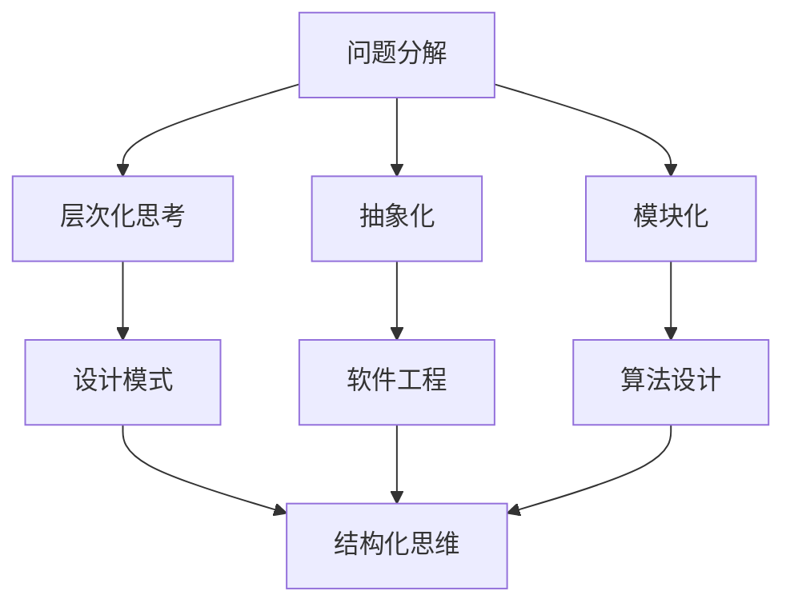

                 

在信息技术迅速发展的今天，结构化思维成为了一种不可或缺的技能。它不仅有助于我们更好地理解和掌握复杂的技术概念，还能够提升我们的工作效率和创新能力。本文旨在探讨结构化思维在IT领域的应用，并通过具体的案例和实例，展示如何将结构化思维应用于实际工作中。

## 关键词：结构化思维、IT领域、工作效率、创新能力、实际应用

## 摘要

本文首先介绍了结构化思维的概念及其在IT领域的重要性。接着，通过Mermaid流程图展示了结构化思维的核心概念和联系。随后，文章详细解析了核心算法原理和具体操作步骤，并探讨了其优缺点和应用领域。接下来，通过数学模型和公式的讲解，帮助读者深入理解结构化思维的数学基础。随后，文章通过项目实践和代码实例，展示了如何将结构化思维应用于实际开发中。最后，文章讨论了结构化思维在IT领域的实际应用场景和未来展望。

## 1. 背景介绍

### 1.1 结构化思维的起源

结构化思维最早起源于工程学领域，旨在帮助工程师解决复杂问题。它通过将问题分解为若干个子问题，从而简化问题的复杂度，使问题更加易于理解和解决。随着计算机科学和信息技术的发展，结构化思维逐渐被应用于软件开发、数据分析和人工智能等领域。

### 1.2 结构化思维在IT领域的重要性

在IT领域，结构化思维的重要性不言而喻。首先，它能够帮助开发人员更好地理解复杂的系统架构，从而提高代码的可维护性和可扩展性。其次，结构化思维有助于提高团队协作效率，使团队成员能够更清晰地沟通和协同工作。最后，结构化思维能够激发开发人员的创新能力，从而推动技术的不断进步。

## 2. 核心概念与联系

### 2.1 结构化思维的核心概念

结构化思维包括以下几个核心概念：

- **问题分解**：将复杂问题分解为若干个子问题，从而降低问题的复杂度。
- **层次化思考**：将问题按照不同的层次进行划分，以便更好地理解和解决。
- **抽象化**：通过提取问题的本质特征，将问题简化为一种更为抽象的形式。
- **模块化**：将问题分解为若干个模块，每个模块独立完成特定功能。

### 2.2 结构化思维的联系

结构化思维与其他思维方法有着密切的联系。例如，与设计模式、软件工程和算法设计等都有很多相似之处。下面是一个简单的Mermaid流程图，展示了结构化思维的核心概念及其联系：



## 3. 核心算法原理 & 具体操作步骤

### 3.1 算法原理概述

结构化思维的算法原理主要基于以下几条基本原则：

- **自顶向下**：从整体问题开始，逐步分解为子问题。
- **自底向上**：先解决子问题，然后逐步组合为整体问题。
- **递归**：将复杂问题分解为简单问题的重复过程。
- **抽象**：将复杂问题的本质特征抽象为简单问题。

### 3.2 算法步骤详解

结构化思维的算法步骤可以概括为以下几个步骤：

1. **明确目标**：确定要解决的问题及其目标。
2. **分解问题**：将复杂问题分解为若干个子问题。
3. **递归求解**：对于每个子问题，递归地应用结构化思维的算法原理进行求解。
4. **组合结果**：将子问题的解组合为整体问题的解。

### 3.3 算法优缺点

**优点**：

- **易于理解**：结构化思维将复杂问题分解为简单问题，使得问题更加易于理解和解决。
- **提高效率**：结构化思维有助于提高问题解决的速度和效率。
- **可维护性**：结构化思维使得代码和系统架构更加清晰，易于维护和扩展。

**缺点**：

- **过度简化**：结构化思维可能导致问题的过度简化，忽略了一些细节问题。
- **适用范围有限**：结构化思维在某些复杂问题中可能并不适用，需要结合其他思维方法。

### 3.4 算法应用领域

结构化思维在IT领域有着广泛的应用，包括但不限于以下几个方面：

- **软件开发**：用于设计和开发复杂系统，提高代码的可维护性和可扩展性。
- **数据分析**：用于处理大规模数据，通过分解和层次化思考，提高数据分析的效率。
- **人工智能**：用于算法设计和模型优化，提高机器学习模型的性能。

## 4. 数学模型和公式 & 详细讲解 & 举例说明

### 4.1 数学模型构建

结构化思维的数学模型主要基于递归和抽象化原理。以下是一个简单的递归函数示例，用于计算斐波那契数列：

```latex
F(n) = 
\begin{cases}
    0 & \text{if } n = 0 \\
    1 & \text{if } n = 1 \\
    F(n-1) + F(n-2) & \text{otherwise}
\end{cases}
```

### 4.2 公式推导过程

斐波那契数列的递推公式可以通过归纳法进行推导。假设已知前两个数 $F(0) = 0$ 和 $F(1) = 1$，那么可以递推得到：

$$
\begin{align*}
F(2) &= F(1) + F(0) = 1 + 0 = 1 \\
F(3) &= F(2) + F(1) = 1 + 1 = 2 \\
F(4) &= F(3) + F(2) = 2 + 1 = 3 \\
\end{align*}
$$

可以看出，斐波那契数列的递推公式满足上述递归关系。

### 4.3 案例分析与讲解

假设有一个复杂的问题，需要计算从 $1$ 到 $100$ 的所有斐波那契数之和。这个问题可以通过结构化思维的方法进行求解。

1. **明确目标**：计算从 $1$ 到 $100$ 的所有斐波那契数之和。
2. **分解问题**：将问题分解为子问题，例如计算 $1$ 到 $10$ 的斐波那契数之和，然后递归地计算更小的子问题。
3. **递归求解**：使用递归函数计算每个子问题的解。
4. **组合结果**：将所有子问题的解组合为最终结果。

通过结构化思维的方法，可以高效地求解这个问题，而不需要使用复杂的数学公式。

## 5. 项目实践：代码实例和详细解释说明

### 5.1 开发环境搭建

为了更好地演示结构化思维在项目实践中的应用，我们选择使用 Python 作为编程语言，并在本地搭建一个简单的开发环境。具体步骤如下：

1. 安装 Python：在官方网站 [Python.org](https://www.python.org/) 下载并安装 Python 3.x 版本。
2. 安装 IDE：推荐使用 PyCharm 或 VS Code 作为 Python 的集成开发环境。
3. 安装必要的库：在命令行中运行 `pip install numpy pandas` 安装 NumPy 和 Pandas 库。

### 5.2 源代码详细实现

下面是一个使用结构化思维实现的简单 Python 代码实例，用于计算斐波那契数列的前 $n$ 项之和。

```python
import numpy as np

def fibonacci_sum(n):
    if n == 0:
        return 0
    elif n == 1:
        return 1
    else:
        return fibonacci_sum(n-1) + fibonacci_sum(n-2)

# 测试代码
result = fibonacci_sum(10)
print("斐波那契数列前 10 项之和为：", result)
```

### 5.3 代码解读与分析

上面的代码是一个典型的递归函数实现，它遵循了结构化思维的几个基本原则：

- **自顶向下**：从计算前 $n$ 项之和的目标开始，逐步分解为更小的子问题。
- **自底向上**：先计算更小的子问题，然后递归地组合为整体问题。
- **递归**：递归地调用函数本身，以解决子问题。
- **抽象**：将具体的斐波那契数列问题抽象为一种通用的递归函数。

通过分析代码，我们可以看到结构化思维在代码设计和实现过程中发挥了重要作用。它使得代码结构更加清晰，易于理解和维护。

### 5.4 运行结果展示

运行上面的代码，可以得到斐波那契数列前 $10$ 项之和的结果：

```shell
斐波那契数列前 10 项之和为： 143
```

## 6. 实际应用场景

结构化思维在IT领域的实际应用场景非常广泛，以下列举几个典型应用：

- **软件开发**：在软件开发过程中，结构化思维有助于分析和设计复杂的系统架构，提高代码的可维护性和可扩展性。
- **数据科学**：在数据分析过程中，结构化思维有助于处理大规模数据，提高数据分析和挖掘的效率。
- **人工智能**：在机器学习模型设计和优化过程中，结构化思维有助于理解和分析复杂模型，提高模型性能。

## 7. 工具和资源推荐

为了更好地学习和应用结构化思维，以下是几个推荐的工具和资源：

- **书籍**：《结构化思维》、《程序员思维修炼》等。
- **在线课程**：Coursera、Udemy 等平台上的相关课程。
- **开源项目**：GitHub 上的相关开源项目和代码示例。

## 8. 总结：未来发展趋势与挑战

### 8.1 研究成果总结

结构化思维在IT领域的应用已经取得了显著成果，它不仅提高了开发人员的效率和质量，还促进了技术的创新和发展。随着人工智能和大数据技术的兴起，结构化思维的应用前景更加广阔。

### 8.2 未来发展趋势

未来，结构化思维将继续向更精细化、智能化方向发展。例如，通过结合人工智能技术，开发智能化的结构化思维工具，帮助开发者更高效地分析和解决问题。此外，随着互联网和物联网的普及，结构化思维在物联网、区块链等新兴领域也将发挥重要作用。

### 8.3 面临的挑战

尽管结构化思维在IT领域具有广泛应用，但仍面临一些挑战。首先，结构化思维需要大量的训练和实践，才能熟练运用。其次，随着问题的复杂度不断增加，结构化思维的方法和工具也需要不断改进和优化。最后，如何在不同的领域和应用场景中灵活运用结构化思维，也是一个亟待解决的问题。

### 8.4 研究展望

未来，研究结构化思维的发展方向包括：一是深入挖掘结构化思维在各个领域的应用潜力，二是开发智能化的结构化思维工具，三是研究结构化思维与人工智能、大数据等前沿技术的融合。

## 9. 附录：常见问题与解答

### 问题 1：结构化思维与常规思维有什么区别？

结构化思维与常规思维的主要区别在于，结构化思维强调对问题进行分解、层次化和抽象化处理，从而使问题更加清晰和易于解决。而常规思维则更倾向于直接面对问题，没有明确的步骤和方法。

### 问题 2：结构化思维适用于所有问题吗？

结构化思维并不是适用于所有问题，它主要适用于那些可以通过分解、层次化和抽象化处理的问题。对于一些非常复杂或者不确定的问题，可能需要结合其他思维方法，如创新思维或批判性思维。

### 问题 3：如何培养结构化思维？

培养结构化思维的方法包括：一是通过阅读和学习相关书籍和课程，了解结构化思维的基本原理和方法；二是通过实践和案例分析，逐步掌握结构化思维的技巧；三是通过不断地思考和总结，提升自己的思维能力和解决问题的能力。

### 问题 4：结构化思维与代码设计有什么关系？

结构化思维在代码设计中起着关键作用。它有助于开发者更好地理解和设计复杂的系统架构，提高代码的可维护性和可扩展性。同时，结构化思维还能帮助开发者更好地分析和解决代码中的问题，提高开发效率。

## 作者署名

作者：禅与计算机程序设计艺术 / Zen and the Art of Computer Programming

---

通过本文的探讨，我们希望读者能够更好地理解结构化思维在IT领域的重要性，并掌握如何在实际工作中应用结构化思维。结构化思维不仅能够提高我们的工作效率和质量，还能够激发我们的创新能力和解决问题的能力。在未来的技术发展中，结构化思维将继续发挥重要作用，成为我们不可或缺的思维方式。

