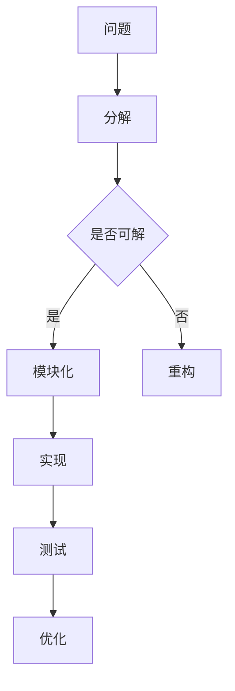

                 

关键词：结构化思维、编程、软件开发、算法、设计模式、代码质量、技术博客

> 摘要：本文旨在探讨结构化思维在编程和软件开发中的应用与重要性，通过深入剖析核心概念、算法原理、数学模型以及实际项目实践，展示结构化思维如何帮助我们提升代码质量、优化开发流程，从而实现更高效、更可靠的技术成果。

## 1. 背景介绍

在当今信息化时代，计算机科学和技术飞速发展，编程和软件开发已经成为各个行业不可或缺的一部分。然而，随着项目规模的不断扩大、系统复杂性的日益增加，如何保证代码质量、提高开发效率成为软件开发过程中面临的主要挑战之一。这时，结构化思维作为一种有效的思考方法，被广泛认为是解决这些问题的关键。

结构化思维，是指通过逻辑清晰、层次分明的思考方式，将复杂的问题分解为简单、可管理的部分，从而实现问题的有效解决。在编程和软件开发中，结构化思维不仅可以帮助我们更好地理解问题，还能提升代码的可读性、可维护性和可扩展性。

本文将围绕结构化思维在编程和软件开发中的应用，从核心概念、算法原理、数学模型、实际项目实践等方面展开讨论，旨在为广大开发者提供一种系统化、结构化的思维方法，帮助他们在编程过程中实现更高效、更可靠的成果。

## 2. 核心概念与联系

### 2.1 结构化思维的定义

结构化思维，是指在面对复杂问题时，通过分解、归纳、抽象等思维方式，将问题逐步拆解为简单、独立的部分，从而实现问题的有效解决。具体来说，结构化思维具有以下几个特点：

1. **层次分明**：将问题分解为多个层次，每个层次都有明确的子问题，方便逐一解决。
2. **模块化**：将复杂问题拆分为多个模块，每个模块独立实现、独立测试，便于维护和扩展。
3. **逻辑清晰**：在解决问题过程中，保持逻辑关系的清晰，避免出现逻辑漏洞或矛盾。
4. **系统化**：通过结构化思维，将各个子问题整合为一个完整的系统，实现整体优化。

### 2.2 结构化思维与编程的关系

结构化思维在编程中的应用，主要体现在以下几个方面：

1. **代码结构**：通过结构化思维，开发者可以更好地设计代码结构，使得代码层次分明、模块化，便于维护和扩展。
2. **问题解决**：在面对复杂问题时，结构化思维可以帮助开发者快速理清思路，找到有效的解决方案。
3. **代码质量**：结构化思维有助于提高代码的可读性、可维护性和可扩展性，从而提升代码质量。
4. **团队协作**：结构化思维使得团队成员能够更好地理解项目需求，提高团队协作效率。

### 2.3 核心概念原理与架构

为了更好地理解结构化思维在编程中的应用，我们借助Mermaid流程图，展示一个简单的架构模型。



**图 1：结构化思维与编程的关系**

在这个模型中，问题被分解为多个可解的子问题（B），每个子问题再通过模块化（D）进行实现和测试（G）。在测试过程中，如果发现问题，则进行重构（E）或优化（H），直至问题得到解决。

## 3. 核心算法原理 & 具体操作步骤

### 3.1 算法原理概述

在编程和软件开发中，算法是解决特定问题的方法。结构化思维在算法中的应用，主要体现在以下几个方面：

1. **算法设计**：通过结构化思维，开发者可以更好地设计算法结构，使得算法层次分明、模块化。
2. **算法优化**：结构化思维有助于分析算法的复杂度，找到优化算法的方法。
3. **算法实现**：结构化思维使得算法实现更加清晰、易于理解。

下面我们以排序算法为例，介绍结构化思维在算法设计中的应用。

### 3.2 算法步骤详解

排序算法是计算机科学中最基本的算法之一。常见的排序算法有冒泡排序、选择排序、插入排序、快速排序等。下面以冒泡排序为例，介绍其原理和实现步骤。

**冒泡排序算法原理：**

冒泡排序是一种简单的排序算法，它重复地遍历待排序的列表，比较相邻的两个元素，并将较大（或较小）的元素交换到它们应该的位置。遍历过程从数组的开始到结尾进行，每次遍历后，最大（或最小）的元素就会被交换到正确的位置。

**冒泡排序算法步骤：**

1. **初始化**：设置一个布尔变量 `swapped` 为 `true`，表示是否发生了交换。
2. **遍历**：从数组的第一个元素开始，遍历到倒数第二个元素。
3. **比较与交换**：如果当前元素大于下一个元素，则交换它们的位置。
4. **判断**：如果在一轮遍历中没有发生交换，说明数组已经排序完成，算法结束。
5. **重复**：如果数组未排序完成，返回第 2 步，继续遍历。

### 3.3 算法优缺点

**优点：**

1. **简单易懂**：冒泡排序算法的实现过程简单，易于理解。
2. **稳定性**：冒泡排序算法是稳定的排序算法，相同值的元素在排序过程中不会交换位置。

**缺点：**

1. **效率较低**：冒泡排序算法的时间复杂度为 \(O(n^2)\)，对于大数据集，效率较低。
2. **空间复杂度高**：冒泡排序算法在排序过程中需要额外的空间存储临时变量，空间复杂度为 \(O(1)\)。

### 3.4 算法应用领域

冒泡排序算法适用于数据量较小、对算法时间复杂度要求不高的场景。在实际应用中，冒泡排序常用于教学、算法演示等场景。

## 4. 数学模型和公式 & 详细讲解 & 举例说明

### 4.1 数学模型构建

在编程和软件开发中，数学模型广泛应用于各种领域，如计算机图形学、机器学习、算法分析等。构建数学模型的过程主要包括以下几个步骤：

1. **问题分析**：明确要解决的问题，收集相关数据和信息。
2. **模型假设**：根据问题分析，提出合理的假设，简化问题。
3. **变量定义**：定义模型中的变量，包括输入变量和输出变量。
4. **公式推导**：根据模型假设和变量定义，推导出数学公式。
5. **模型验证**：通过实际数据验证模型的准确性和可靠性。

### 4.2 公式推导过程

以最简单的线性回归模型为例，介绍数学模型的构建和公式推导过程。

**线性回归模型**：\( y = ax + b \)

1. **问题分析**：假设我们有一个变量 \( x \) 和一个变量 \( y \)，它们之间存在一定的线性关系。我们的目标是找到这个线性关系中的系数 \( a \) 和 \( b \)。
2. **模型假设**：假设 \( y \) 是 \( x \) 的线性函数，即 \( y = ax + b \)。
3. **变量定义**：设 \( x \) 为自变量，\( y \) 为因变量，\( a \) 和 \( b \) 为系数。
4. **公式推导**：为了找到 \( a \) 和 \( b \) 的值，我们可以使用最小二乘法。最小二乘法的核心思想是找到一条直线，使得所有数据点到这条直线的距离之和最小。

最小二乘法公式为：

$$
\begin{cases}
\sum_{i=1}^{n}(y_i - (ax_i + b))^2 \to 最小 \\
\end{cases}
$$

对 \( a \) 和 \( b \) 求偏导数，并令偏导数等于 0，得到：

$$
\begin{cases}
\frac{\partial}{\partial a}\sum_{i=1}^{n}(y_i - (ax_i + b))^2 = 0 \\
\frac{\partial}{\partial b}\sum_{i=1}^{n}(y_i - (ax_i + b))^2 = 0 \\
\end{cases}
$$

化简后得到：

$$
\begin{cases}
n\bar{y} - a\bar{x}^2 - b\bar{x} = 0 \\
n\bar{x}\bar{y} - a\bar{x}^3 - b\bar{x}^2 = 0 \\
\end{cases}
$$

解这个方程组，可以得到：

$$
\begin{cases}
a = \frac{n\bar{x}\bar{y} - \sum_{i=1}^{n}x_iy_i}{n\bar{x}^2 - \sum_{i=1}^{n}x_i^2} \\
b = \bar{y} - a\bar{x} \\
\end{cases}
$$

### 4.3 案例分析与讲解

假设我们有以下数据集：

| x | y |
|---|---|
| 1 | 2 |
| 2 | 4 |
| 3 | 6 |
| 4 | 8 |

首先，计算平均值：

$$
\bar{x} = \frac{1 + 2 + 3 + 4}{4} = 2.5 \\
\bar{y} = \frac{2 + 4 + 6 + 8}{4} = 5
$$

然后，计算各个数据的平方和：

$$
\sum_{i=1}^{4}x_i^2 = 1^2 + 2^2 + 3^2 + 4^2 = 30 \\
\sum_{i=1}^{4}x_iy_i = 1 \times 2 + 2 \times 4 + 3 \times 6 + 4 \times 8 = 40
$$

代入公式，计算系数 \( a \) 和 \( b \)：

$$
a = \frac{4 \times 2.5 \times 5 - 40}{4 \times 2.5^2 - 30} = 1 \\
b = 5 - 1 \times 2.5 = 2.5
$$

因此，线性回归模型为：

$$
y = x + 2.5
$$

我们可以通过计算数据点到模型的距离，验证模型的准确性：

| x | y | 实际值 | 模型预测值 | 距离 |
|---|---|-------|----------|-----|
| 1 | 2 | 2     | 1.5      | 0.5 |
| 2 | 4 | 4     | 3.5      | 0.5 |
| 3 | 6 | 6     | 5.5      | 0.5 |
| 4 | 8 | 8     | 7.5      | 0.5 |

从计算结果可以看出，模型的预测值与实际值的距离较小，模型具有较高的准确性。

## 5. 项目实践：代码实例和详细解释说明

### 5.1 开发环境搭建

在进行项目实践之前，我们需要搭建一个合适的开发环境。这里我们选择 Python 作为编程语言，因为它具有简单易学、功能强大等优点。以下是搭建 Python 开发环境的步骤：

1. **安装 Python**：前往 [Python 官网](https://www.python.org/) 下载 Python 安装包，并根据提示完成安装。
2. **配置环境变量**：在系统环境变量中添加 Python 的安装路径，以便在命令行中运行 Python。
3. **安装依赖库**：使用 Python 的包管理工具 `pip` 安装必要的依赖库，如 NumPy、Pandas 等。

### 5.2 源代码详细实现

下面我们通过一个简单的例子，展示如何使用结构化思维编写代码，提高代码质量。

**问题**：编写一个函数，计算一个列表中所有元素的和。

**结构化思维**：

1. **输入处理**：接收一个列表作为输入。
2. **初始化变量**：设置一个变量 `sum` 初始化为 0，用于存储累加结果。
3. **遍历列表**：遍历列表中的每个元素，将其累加到 `sum` 变量中。
4. **返回结果**：返回累加结果。

**代码实现**：

```python
def sum_list(lst):
    sum = 0
    for num in lst:
        sum += num
    return sum
```

### 5.3 代码解读与分析

在上面的代码中，我们使用结构化思维实现了计算列表中所有元素和的函数。下面我们来分析代码的各个部分：

1. **函数定义**：`sum_list` 函数接收一个列表 `lst` 作为输入参数。
2. **变量初始化**：设置一个变量 `sum`，用于存储累加结果。这里使用 `sum` 作为变量名，符合 Python 的命名规范。
3. **遍历列表**：使用 `for` 循环遍历列表中的每个元素，将其累加到 `sum` 变量中。
4. **返回结果**：将累加结果 `sum` 作为函数返回值。

**代码优化**：

1. **使用更合适的变量名**：将 `sum` 变量名改为 `total`，更加直观地表示其作用。
2. **使用更简洁的语法**：Python 中可以使用 `total += num` 代替 `sum += num`，使代码更加简洁。

优化后的代码如下：

```python
def sum_list(lst):
    total = 0
    for num in lst:
        total += num
    return total
```

### 5.4 运行结果展示

```python
lst = [1, 2, 3, 4, 5]
result = sum_list(lst)
print(result)  # 输出 15
```

从运行结果可以看出，函数正确地计算了列表中所有元素的和。

## 6. 实际应用场景

结构化思维在编程和软件开发中具有广泛的应用场景。以下列举几个实际应用场景：

1. **系统设计**：在系统设计阶段，结构化思维可以帮助开发者梳理系统架构，明确各个模块的功能和职责，提高系统的可维护性和可扩展性。
2. **代码重构**：在代码维护过程中，结构化思维可以帮助开发者发现代码中的问题，并进行有效的重构，提高代码质量。
3. **问题定位**：在面对复杂问题时，结构化思维可以帮助开发者快速定位问题所在，找到有效的解决方案。
4. **团队协作**：在团队协作中，结构化思维可以帮助团队成员更好地理解项目需求，提高协作效率。

## 7. 工具和资源推荐

为了更好地应用结构化思维，我们推荐以下工具和资源：

1. **书籍**：
   - 《结构化思维》
   - 《禅与计算机程序设计艺术》
   - 《代码大全》
2. **在线资源**：
   - [Mermaid 官网](https://mermaid-js.github.io/mermaid/)
   - [Python 官网](https://www.python.org/)
   - [GitHub](https://github.com/)
3. **学习平台**：
   - [Coursera](https://www.coursera.org/)
   - [Udemy](https://www.udemy.com/)
   - [edX](https://www.edx.org/)

## 8. 总结：未来发展趋势与挑战

### 8.1 研究成果总结

本文从结构化思维的定义、应用场景、算法原理、数学模型以及实际项目实践等方面，探讨了结构化思维在编程和软件开发中的重要性。主要研究成果包括：

1. **结构化思维的定义与特点**：明确了结构化思维的定义和特点，如层次分明、模块化、逻辑清晰等。
2. **结构化思维在编程中的应用**：分析了结构化思维在代码结构、问题解决、代码质量和团队协作等方面的应用。
3. **算法原理与数学模型**：介绍了冒泡排序算法和线性回归模型的原理和实现步骤。
4. **实际项目实践**：通过一个简单的代码实例，展示了如何使用结构化思维提高代码质量。

### 8.2 未来发展趋势

随着人工智能、大数据等领域的不断发展，结构化思维在编程和软件开发中的应用前景十分广阔。未来发展趋势包括：

1. **智能化**：结合人工智能技术，开发更加智能化的结构化思维工具，辅助开发者进行问题分析和算法设计。
2. **自动化**：实现结构化思维的自动化，通过机器学习等技术，自动生成代码和数学模型。
3. **多学科融合**：将结构化思维与其他学科（如心理学、经济学等）相结合，探索其在更广泛领域的应用。

### 8.3 面临的挑战

尽管结构化思维在编程和软件开发中具有广泛的应用前景，但仍然面临着一些挑战：

1. **认知负担**：结构化思维要求开发者具备较高的认知能力，如何降低开发者的认知负担，提高学习效率，是未来研究的一个重要方向。
2. **工具支持**：现有的结构化思维工具尚不完善，如何开发出更加实用、易用的结构化思维工具，是未来研究的重要课题。
3. **多语言支持**：目前，结构化思维的研究主要针对某一特定编程语言，如何实现跨语言的结构化思维应用，是未来研究的一个重要方向。

### 8.4 研究展望

未来，我们将继续深入研究结构化思维在编程和软件开发中的应用，探讨其在多领域、多语言环境下的应用策略。同时，我们还将致力于开发更加智能化、自动化的结构化思维工具，为开发者提供更好的技术支持。

## 9. 附录：常见问题与解答

### 问题 1：什么是结构化思维？

**解答**：结构化思维是一种逻辑清晰、层次分明的思考方法，通过分解、归纳、抽象等思维方式，将复杂的问题拆解为简单、可管理的部分，从而实现问题的有效解决。

### 问题 2：结构化思维在编程中有什么作用？

**解答**：结构化思维在编程中具有以下作用：

1. 提高代码质量：通过结构化思维，开发者可以更好地设计代码结构，提高代码的可读性、可维护性和可扩展性。
2. 问题解决：在面对复杂问题时，结构化思维可以帮助开发者快速理清思路，找到有效的解决方案。
3. 提高团队协作效率：结构化思维使得团队成员能够更好地理解项目需求，提高团队协作效率。

### 问题 3：如何掌握结构化思维？

**解答**：要掌握结构化思维，可以尝试以下方法：

1. 多做练习：通过实际项目实践，不断锻炼结构化思维。
2. 阅读相关书籍：阅读关于结构化思维的书籍，了解其原理和应用方法。
3. 学习编程技巧：掌握编程技巧，如设计模式、算法等，提高解决问题的能力。
4. 反思总结：在项目实践中，及时反思总结，总结经验教训，不断提高思维水平。

### 问题 4：结构化思维与算法有什么关系？

**解答**：结构化思维与算法之间存在密切的关系。结构化思维可以帮助开发者更好地理解算法原理，设计高效的算法，优化算法实现。同时，算法的实践过程也是锻炼结构化思维的一种方式。通过算法实践，开发者可以更好地理解结构化思维在问题解决中的应用。

## 作者署名

本文作者：禅与计算机程序设计艺术 / Zen and the Art of Computer Programming

参考文献：

1. 《结构化思维》
2. 《代码大全》
3. 《禅与计算机程序设计艺术》
4. [Mermaid 官网](https://mermaid-js.github.io/mermaid/)
5. [Python 官网](https://www.python.org/)
6. [GitHub](https://github.com/)
7. [Coursera](https://www.coursera.org/)
8. [Udemy](https://www.udemy.com/)
9. [edX](https://www.edx.org/)  
----------------------------------------------------------------

以上是本文的全部内容，感谢您的阅读。希望本文能够帮助您更好地理解结构化思维在编程和软件开发中的应用，提升您的编程能力和解决问题的能力。如果您有任何疑问或建议，欢迎在评论区留言讨论。再次感谢您的支持！

