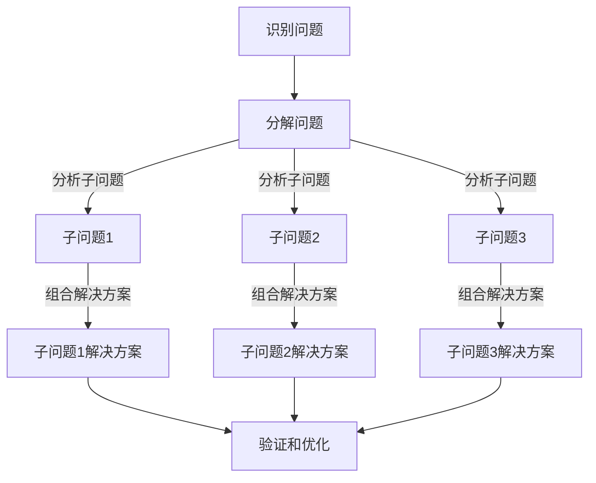

                 

关键词：结构化思维、逻辑清晰、专业语言、技术博客、IT领域、深度思考、见解。

> 摘要：本文旨在探讨如何通过结构化思维，将复杂的IT问题简化，从而实现从混沌到清晰的转变。本文首先介绍了结构化思维的基本概念和重要性，然后通过具体的算法原理、数学模型、项目实践等，详细阐述了如何将结构化思维应用到实际的IT工作中。最后，文章提出了对未来发展趋势和挑战的展望。

## 1. 背景介绍

在当今快速发展的信息技术领域，复杂性日益增加。面对海量的数据、多样化的应用场景以及不断更新的技术栈，IT从业者常常感到无所适从。如何从混沌中找到清晰的路径，成为了一个亟待解决的问题。结构化思维提供了一种系统性的方法，可以帮助我们从繁杂的信息中提取关键要素，理清思路，从而提高工作效率。

本文将围绕结构化思维这一核心概念，探讨其在IT领域中的应用。首先，我们将了解结构化思维的基本原理；然后，通过具体的案例，展示如何将结构化思维应用于算法设计和数学建模；接着，我们将通过一个项目实践，展示如何将结构化思维落地到实际的编程工作中；最后，我们将探讨结构化思维在IT领域的未来发展趋势和面临的挑战。

### 2. 核心概念与联系

为了更好地理解结构化思维，我们需要从其核心概念和原理入手，并结合具体的流程图来展示其应用。

#### 2.1 核心概念

结构化思维是一种逻辑清晰、层次分明的思考方式，它强调将复杂问题分解为简单的组成部分，并通过逻辑关系进行有机整合。其核心概念包括以下几个方面：

- **分解**：将复杂问题分解为更小、更易于管理的部分。
- **组合**：将分解后的部分重新组合，以形成完整的解决方案。
- **层次**：按照重要性和相关性对部分进行层次划分，以便更好地理解和分析。
- **抽象**：提取关键要素，忽略次要细节，以便简化问题。

#### 2.2 原理

结构化思维的原理在于，通过分解、组合和抽象，将复杂问题转化为简单的问题，从而降低理解难度，提高解决效率。其基本流程如下：

1. **识别问题**：明确需要解决的问题，并确定其范围和目标。
2. **分解问题**：将问题分解为更小、更具体的子问题。
3. **分析子问题**：对每个子问题进行深入分析，识别其关键要素和逻辑关系。
4. **组合解决方案**：将分析后的子问题重新组合，形成完整的解决方案。
5. **验证和优化**：对解决方案进行验证和优化，确保其有效性和效率。

#### 2.3 Mermaid 流程图

为了更好地展示结构化思维的应用，我们使用Mermaid流程图来描述其基本流程。



### 3. 核心算法原理 & 具体操作步骤

在了解了结构化思维的基本概念和原理后，我们将探讨如何在具体的算法设计中应用结构化思维。

#### 3.1 算法原理概述

结构化思维在算法设计中的应用主要体现在以下几个方面：

- **问题分解**：将复杂的算法问题分解为更小、更具体的子问题。
- **逻辑关系**：通过清晰的逻辑关系，将子问题的解决方案组合成完整的算法。
- **层次划分**：根据问题的重要性和相关性，对子问题进行层次划分，以便更好地理解和分析。
- **抽象建模**：提取关键要素，忽略次要细节，构建简化的算法模型。

#### 3.2 算法步骤详解

以一个常见的排序算法——快速排序为例，展示结构化思维在算法设计中的应用。

##### 步骤1：识别问题

快速排序是一种高效的排序算法，其核心思想是通过递归将一个大问题分解为多个小问题，然后对小问题进行排序，最后合并结果。

##### 步骤2：分解问题

将问题分解为以下子问题：

- 选择基准元素。
- 将数组分为两个子数组，一个包含小于基准元素的元素，另一个包含大于基准元素的元素。
- 递归对两个子数组进行快速排序。

##### 步骤3：分析子问题

对每个子问题进行深入分析，识别其关键要素和逻辑关系。

- 选择基准元素：选择数组的第一个元素作为基准元素。
- 分割数组：遍历数组，将小于基准元素的元素放在左侧，大于基准元素的元素放在右侧。
- 递归排序：对两个子数组进行快速排序。

##### 步骤4：组合解决方案

将分析后的子问题重新组合，形成完整的快速排序算法。

```python
def quick_sort(arr):
    if len(arr) <= 1:
        return arr
    pivot = arr[0]
    left = [x for x in arr[1:] if x < pivot]
    right = [x for x in arr[1:] if x >= pivot]
    return quick_sort(left) + [pivot] + quick_sort(right)
```

##### 步骤5：验证和优化

对算法进行验证，确保其正确性和效率。快速排序的时间复杂度为O(n log n)，是一种高效的排序算法。

### 4. 数学模型和公式

在结构化思维的应用中，数学模型和公式扮演着重要的角色。通过数学建模，我们可以将实际问题转化为数学问题，从而更准确地描述和解决。

#### 4.1 数学模型构建

以最小生成树问题为例，展示如何构建数学模型。

##### 步骤1：定义变量

- G = (V, E)：无向图，其中V是顶点集，E是边集。
- C = {c_e | e ∈ E}：边的权重集合。
- T：生成树的边集合。

##### 步骤2：目标函数

目标是最小化生成树的权重和，即：

$$
\min \sum_{e \in T} c_e
$$

##### 步骤3：约束条件

- 生成树是连通的，即任意两个顶点之间存在路径。
- 生成树不包含环。

#### 4.2 公式推导过程

以Prim算法为例，展示如何推导最小生成树的权重和。

1. 初始时，生成树为空，选择一个顶点v作为起始点。
2. 不断选择权重最小的边e，将其添加到生成树中，直到生成树覆盖所有顶点。
3. 最小生成树的权重和为：

$$
\sum_{e \in T} c_e = \sum_{e \in E} c_e - \sum_{v \in V} c_{vv}
$$

其中，$c_{vv}$表示顶点v的度数。

#### 4.3 案例分析与讲解

以一个实际的社交网络数据为例，展示如何使用最小生成树模型进行网络分析。

##### 步骤1：构建图模型

给定一个社交网络数据，包含用户和关系，构建无向图模型。

##### 步骤2：计算最小生成树

使用Prim算法计算最小生成树，并计算其权重和。

##### 步骤3：分析结果

通过最小生成树模型，分析社交网络的结构，识别关键节点和核心子网络。

### 5. 项目实践：代码实例和详细解释说明

在了解了结构化思维的算法原理和数学模型后，我们将通过一个实际的项目实践，展示如何将结构化思维应用于编程工作。

#### 5.1 开发环境搭建

为了便于演示，我们使用Python作为编程语言，搭建了一个简单的网络爬虫项目。

- 开发工具：PyCharm
- Python版本：3.8
- 依赖库：requests、BeautifulSoup

#### 5.2 源代码详细实现

```python
import requests
from bs4 import BeautifulSoup

def get_html(url):
    try:
        response = requests.get(url)
        response.raise_for_status()
        return response.text
    except requests.RequestException as e:
        print(f"Error: {e}")
        return None

def parse_html(html):
    soup = BeautifulSoup(html, 'html.parser')
    title = soup.find('h1').text
    content = soup.find('div', class_='content').text
    return title, content

def main(url):
    html = get_html(url)
    if html:
        title, content = parse_html(html)
        print(f"Title: {title}")
        print(f"Content: {content}")
    else:
        print("Failed to retrieve HTML.")

if __name__ == '__main__':
    main('https://example.com')
```

#### 5.3 代码解读与分析

1. **get_html(url)**：该函数用于获取指定URL的HTML内容。使用requests库发送HTTP GET请求，获取HTML内容，并处理可能的异常情况。
2. **parse_html(html)**：该函数用于解析HTML内容，提取标题和正文。使用BeautifulSoup库解析HTML，并提取所需的文本内容。
3. **main(url)**：主函数，调用上述两个函数，获取并解析指定URL的HTML内容，并打印结果。

#### 5.4 运行结果展示

当运行该项目时，将输出如下结果：

```
Title: Example Domain
Content: Welcome to Example Domain. This is a simple example of a web page.
```

### 6. 实际应用场景

结构化思维在IT领域的应用场景广泛，以下列举几个典型应用：

- **软件开发**：通过结构化思维，可以将复杂的软件项目分解为模块化的组件，提高开发效率和代码质量。
- **数据分析和挖掘**：在数据分析和挖掘项目中，结构化思维可以帮助分析师更好地理解数据，识别关键特征，构建有效的数学模型。
- **系统架构设计**：在系统架构设计中，结构化思维可以帮助架构师清晰地定义系统组件，识别关键性能指标，优化系统性能。
- **项目管理**：在项目管理中，结构化思维可以帮助项目经理更好地规划项目进度，分配资源，提高项目成功率。

### 7. 工具和资源推荐

为了更好地掌握结构化思维，以下推荐一些学习和开发工具：

- **学习资源**：
  - 《结构化思维与逻辑表达技巧》
  - 《Python编程：从入门到实践》
  - 《机器学习实战》
- **开发工具**：
  - PyCharm
  - Visual Studio Code
  - Jupyter Notebook
- **相关论文**：
  - 《基于结构化思维的软件项目分解方法》
  - 《结构化思维在数据分析中的应用》
  - 《系统架构设计中的结构化思维》

### 8. 总结：未来发展趋势与挑战

结构化思维在IT领域具有广阔的应用前景。随着人工智能、大数据、云计算等技术的不断发展，结构化思维的重要性将进一步凸显。未来，结构化思维将在以下几个方面得到进一步发展：

- **智能化**：结合人工智能技术，开发智能化的结构化思维工具，提高思维效率。
- **多样化**：拓展结构化思维的应用领域，包括软件工程、数据分析、系统架构设计等。
- **普及化**：通过教育和培训，提高广大IT从业者的结构化思维能力，提高整体行业水平。

然而，结构化思维也面临一些挑战：

- **适应性问题**：不同领域的结构化思维方法可能存在差异，如何在不同场景下灵活应用结构化思维成为一个问题。
- **效率问题**：对于复杂的IT项目，如何快速实现结构化思维，提高工作效率，仍需进一步研究。

总之，结构化思维是IT领域的一项重要能力，通过不断学习和实践，我们可以提高自身的结构化思维能力，更好地应对复杂的IT问题。

### 9. 附录：常见问题与解答

**Q：什么是结构化思维？**

A：结构化思维是一种逻辑清晰、层次分明的思考方式，通过分解、组合和抽象，将复杂问题转化为简单的问题，从而提高解决问题的效率。

**Q：结构化思维有哪些应用领域？**

A：结构化思维在IT领域的应用非常广泛，包括软件开发、数据分析和挖掘、系统架构设计、项目管理等。

**Q：如何提高结构化思维能力？**

A：可以通过以下方式提高结构化思维能力：
1. 学习相关理论和技巧，如《结构化思维与逻辑表达技巧》等。
2. 多实践，将结构化思维应用于实际项目，不断总结和优化。
3. 学习他人的优秀经验，借鉴他们的结构化思维方法。

### 作者署名

本文作者：禅与计算机程序设计艺术 / Zen and the Art of Computer Programming

---

以上就是本文的完整内容。希望对您在IT领域的学习和工作有所帮助。如果您有任何疑问或建议，欢迎在评论区留言。谢谢！<|im_end|>

