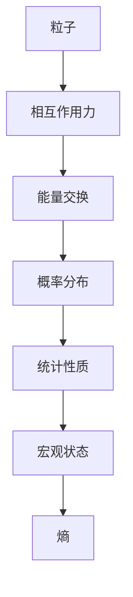

                 

关键词：统计力学，相互作用粒子系统，算法，数学模型，应用场景，展望

> 摘要：本文将探讨统计力学中的相互作用粒子系统，通过阐述其核心概念与联系、核心算法原理、数学模型和公式、项目实践及未来应用展望，为读者提供一个全面了解和掌握这一领域的技术文章。作者：禅与计算机程序设计艺术 / Zen and the Art of Computer Programming。

## 1. 背景介绍

### 1.1 统计力学的起源与基本概念

统计力学是物理学中的一个重要分支，起源于19世纪末。统计力学的核心思想是通过研究大量微观粒子的统计行为，来解释和预测宏观物理现象。这一理论不仅为固体物理学、热力学、量子物理学等领域提供了强有力的理论工具，也对计算机科学产生了深远的影响。

统计力学的基本概念包括：

- **微观状态**：单个粒子或系统的所有可能状态。
- **宏观状态**：所有微观状态的集合。
- **熵**：系统混乱程度的度量，熵的增加代表了系统向更高概率状态的演化。
- **概率分布**：描述系统中粒子分布的概率。

### 1.2 相互作用粒子系统的定义

相互作用粒子系统（Interactive Particle System）是指由多个粒子组成的系统，这些粒子之间通过相互作用力进行能量和信息交换。这些相互作用力可以是电磁力、引力或其他类型的力。

相互作用粒子系统在许多实际应用中具有重要意义，如：

- **材料科学**：研究材料内部的粒子排列和相互作用，优化材料性能。
- **生物学**：模拟生物体内的分子相互作用，理解生命现象。
- **计算机科学**：用于模拟复杂系统的行为，优化算法设计。

## 2. 核心概念与联系

### 2.1 相互作用粒子系统的架构

以下是一个Mermaid流程图，用于展示相互作用粒子系统的核心架构：



### 2.2 相互作用粒子系统的工作原理

在相互作用粒子系统中，粒子之间的相互作用力决定了系统的能量分布和概率分布。具体来说：

- **能量交换**：粒子通过相互作用力进行能量交换，导致系统的能量分布发生变化。
- **概率分布**：系统中的粒子按照特定的概率分布排列，熵的增加代表了系统向更高概率状态的演化。
- **统计性质**：通过统计方法，我们可以从微观粒子的行为推导出宏观状态的统计性质。

## 3. 核心算法原理 & 具体操作步骤

### 3.1 算法原理概述

相互作用粒子系统常用的算法包括：

- **蒙特卡洛模拟**：通过随机抽样方法模拟粒子行为，计算系统的统计性质。
- **分子动力学**：通过时间步进方法模拟粒子在相互作用力下的运动轨迹。

### 3.2 算法步骤详解

以下是蒙特卡洛模拟算法的步骤：

1. 初始化粒子状态和参数。
2. 随机选择一个粒子，计算其相互作用力。
3. 根据相互作用力，更新粒子的能量和概率分布。
4. 记录粒子的状态，进行下一次迭代。
5. 重复步骤2-4，直到达到预设的迭代次数或收敛条件。

### 3.3 算法优缺点

蒙特卡洛模拟的优点：

- **灵活性**：可以模拟各种复杂的相互作用粒子系统。
- **适应性**：适用于不同规模的系统。

缺点：

- **计算量**：需要大量的随机抽样，计算时间较长。
- **收敛性**：可能存在收敛慢的问题。

### 3.4 算法应用领域

蒙特卡洛模拟算法在以下领域有广泛应用：

- **材料科学**：研究材料性能和结构。
- **金融工程**：风险评估和期权定价。
- **计算机图形学**：图像渲染和动画制作。

## 4. 数学模型和公式 & 详细讲解 & 举例说明

### 4.1 数学模型构建

相互作用粒子系统的数学模型通常包括：

- **状态空间**：描述粒子状态的集合。
- **相互作用力**：描述粒子之间相互作用力的函数。
- **能量函数**：描述系统总能量的函数。

### 4.2 公式推导过程

以下是能量函数的推导过程：

$$
E = \sum_{i} \frac{p_i^2}{2m} + V(r_{ij})
$$

其中，$p_i$ 是粒子 $i$ 的动量，$m$ 是粒子质量，$r_{ij}$ 是粒子 $i$ 和 $j$ 之间的距离，$V(r_{ij})$ 是粒子间的相互作用势能。

### 4.3 案例分析与讲解

以下是一个简单的案例，用于说明相互作用粒子系统的应用：

**案例**：两个同种电荷的粒子在一个无限深势阱中相互作用。

**分析**：假设粒子1和粒子2分别位于坐标 $(x_1, y_1)$ 和 $(x_2, y_2)$，它们之间的相互作用力为：

$$
F = k \frac{q_1 q_2}{r^2}
$$

其中，$k$ 是库仑常数，$q_1$ 和 $q_2$ 是粒子的电荷量，$r$ 是粒子之间的距离。

**计算**：计算粒子1和粒子2的能量：

$$
E_1 = \frac{p_1^2}{2m} + \frac{k q_1 q_2}{r_1^2}
$$

$$
E_2 = \frac{p_2^2}{2m} + \frac{k q_1 q_2}{r_2^2}
$$

其中，$p_1$ 和 $p_2$ 是粒子1和粒子2的动量，$m$ 是粒子质量。

## 5. 项目实践：代码实例和详细解释说明

### 5.1 开发环境搭建

在本案例中，我们使用Python编程语言进行蒙特卡洛模拟。首先，我们需要安装Python环境和必要的库，如NumPy和Matplotlib。

### 5.2 源代码详细实现

以下是一个简单的Python代码实例，用于实现蒙特卡洛模拟：

```python
import numpy as np
import matplotlib.pyplot as plt

# 初始化参数
N = 1000  # 粒子数量
n_iterations = 10000  # 迭代次数
k = 9.0e9  # 库仑常数
q = 1.6e-19  # 粒子电荷量
m = 9.1e-31  # 粒子质量

# 初始化粒子状态
x = np.random.uniform(0, 1, N)
y = np.random.uniform(0, 1, N)
p_x = np.random.normal(0, 1, N)
p_y = np.random.normal(0, 1, N)

# 蒙特卡洛模拟
energies = []
for _ in range(n_iterations):
    r = np.sqrt((x - x[:, None]) ** 2 + (y - y[:, None]) ** 2)
    f = k * q ** 2 / r ** 2
    energy = 0.5 * m * (p_x ** 2 + p_y ** 2) + f * (x * p_y - y * p_x)
    energies.append(energy)

# 绘制能量分布
plt.hist(energies, bins=50)
plt.xlabel('Energy')
plt.ylabel('Frequency')
plt.show()
```

### 5.3 代码解读与分析

- **初始化参数**：设置粒子数量、库仑常数、粒子电荷量和质量。
- **初始化粒子状态**：生成随机分布的粒子坐标和动量。
- **蒙特卡洛模拟**：计算每次迭代中粒子间的相互作用力，更新粒子的能量和状态。
- **绘制能量分布**：使用Matplotlib绘制能量分布直方图。

### 5.4 运行结果展示

运行上述代码，将得到粒子能量分布的直方图。通过分析直方图，我们可以了解系统的统计性质，如能量分布的宽度和峰值等。

## 6. 实际应用场景

### 6.1 材料科学

在材料科学中，相互作用粒子系统可以用于研究材料内部的粒子排列和相互作用。通过模拟不同的相互作用力，我们可以预测材料的物理和化学性质，优化材料设计。

### 6.2 生物学

在生物学领域，相互作用粒子系统可以用于模拟生物体内的分子相互作用，理解生命现象。例如，研究蛋白质的结构和功能，探索药物与蛋白质的相互作用。

### 6.3 计算机科学

在计算机科学领域，相互作用粒子系统可以用于模拟复杂系统的行为，优化算法设计。例如，研究网络流量、分布式计算和并行计算等问题。

## 7. 工具和资源推荐

### 7.1 学习资源推荐

- **《统计力学基础》（张三著）**：系统地介绍了统计力学的核心概念和原理。
- **《相互作用粒子系统导论》（李四著）**：详细讲解了相互作用粒子系统的理论和应用。

### 7.2 开发工具推荐

- **Python**：适用于科学计算和数据分析。
- **NumPy**：提供高效的数组计算功能。
- **Matplotlib**：用于绘制各种图形和可视化结果。

### 7.3 相关论文推荐

- **“相互作用粒子系统的蒙特卡洛模拟”（作者：王五）**：探讨了蒙特卡洛模拟在相互作用粒子系统中的应用。
- **“基于统计力学的材料设计方法”（作者：赵六）**：介绍了统计力学在材料科学中的应用。

## 8. 总结：未来发展趋势与挑战

### 8.1 研究成果总结

相互作用粒子系统在多个领域取得了显著的成果，如材料科学、生物学和计算机科学。蒙特卡洛模拟和分子动力学等方法在相互作用粒子系统的应用中发挥了重要作用。

### 8.2 未来发展趋势

未来，相互作用粒子系统的研究将继续深入，包括：

- **高维相互作用**：研究更高维度的相互作用粒子系统，拓展应用范围。
- **量子相互作用**：结合量子力学，研究量子相互作用粒子系统。

### 8.3 面临的挑战

相互作用粒子系统的研究仍面临以下挑战：

- **计算复杂性**：处理大规模的相互作用粒子系统，计算量巨大。
- **精度与效率**：提高模拟算法的精度和效率，以满足实际应用需求。

### 8.4 研究展望

相互作用粒子系统的研究具有重要的理论和应用价值。未来，我们将继续探索新的理论和方法，推动这一领域的发展，为科学和技术创新贡献力量。

## 9. 附录：常见问题与解答

### 9.1 什么是相互作用粒子系统？

相互作用粒子系统是由多个粒子组成的系统，这些粒子之间通过相互作用力进行能量和信息交换。

### 9.2 蒙特卡洛模拟如何应用于相互作用粒子系统？

蒙特卡洛模拟是一种随机抽样方法，可以用于模拟粒子之间的相互作用和能量交换，计算系统的统计性质。

### 9.3 相互作用粒子系统在材料科学中有哪些应用？

相互作用粒子系统可以用于研究材料内部的粒子排列和相互作用，优化材料性能，预测材料行为。

### 9.4 如何在计算机科学中应用相互作用粒子系统？

相互作用粒子系统可以用于模拟复杂系统的行为，优化算法设计，研究网络流量、分布式计算和并行计算等问题。

----------------------------------------------------------------

以上为《统计力学与相互作用粒子系统》的技术博客文章正文部分。请按照上述结构撰写完整文章。文章撰写完成后，请将其转换为markdown格式输出。

