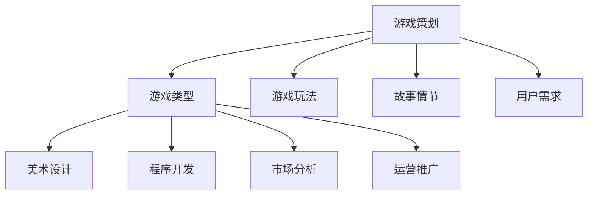

                 

关键词：网易、社招、游戏策划师、面试题、详解、游戏设计、策划理念、案例分析

> 摘要：本文详细解析了网易2025年社会招聘游戏策划师的面试题目，从游戏设计理念、策划案例分析到实际操作步骤，全方位解读了游戏策划师所需具备的核心技能和素质。本文旨在为广大游戏策划从业者提供有益的参考和启示。

## 1. 背景介绍

随着游戏产业的快速发展，游戏策划师作为游戏开发团队中的核心角色，其重要性愈发凸显。游戏策划师不仅需要具备丰富的游戏知识和深厚的策划功底，还需要具备敏锐的市场洞察力和创新思维。网易作为中国领先的游戏开发与运营商，每年都会进行大规模的社招活动，其中游戏策划师的岗位备受关注。本文将围绕网易2025年社招游戏策划师的面试题目，进行详细解析。

## 2. 核心概念与联系

### 2.1 游戏策划的基本概念

游戏策划是指根据游戏主题、玩法、画面、音效等要素，设计出一款具有独特风格和玩法的游戏。游戏策划师需要具备以下核心概念：

- **游戏类型**：了解不同游戏类型的定义、特点和设计原则。
- **游戏玩法**：理解游戏的互动性、策略性、挑战性等元素，设计出引人入胜的玩法。
- **故事情节**：构建游戏世界观、背景故事和角色发展，提升玩家的沉浸感。
- **用户需求**：分析玩家需求，设计符合玩家心理和行为的游戏系统。

### 2.2 游戏策划与相关领域的联系

游戏策划不仅涉及游戏本身的设计，还需要与多个相关领域紧密联系：

- **美术设计**：游戏画面和角色设计是游戏策划的重要组成部分，需要与美术设计师紧密合作。
- **程序开发**：游戏策划需要与程序员合作，确保游戏系统的稳定性和可玩性。
- **市场分析**：游戏策划需要了解市场动态，分析玩家需求，为游戏设计提供指导。
- **运营推广**：游戏策划需要关注游戏运营和推广，提升游戏的市场竞争力。

### 2.3 Mermaid 流程图



## 3. 核心算法原理 & 具体操作步骤

### 3.1 算法原理概述

游戏策划的核心算法主要包括以下几个方面：

- **玩家行为分析**：通过数据分析了解玩家行为，为游戏设计提供依据。
- **游戏平衡性设计**：确保游戏难度适中，提升玩家的游戏体验。
- **玩家留存率优化**：通过数据分析优化游戏系统，提升玩家的留存率。
- **市场推广策略**：根据市场数据制定有效的推广策略，提升游戏知名度。

### 3.2 算法步骤详解

#### 3.2.1 玩家行为分析

1. 收集玩家数据：通过游戏内数据、用户反馈等方式收集玩家行为数据。
2. 数据预处理：对收集到的数据进行清洗、筛选和转换。
3. 数据分析：利用统计分析、机器学习等方法分析玩家行为特点。

#### 3.2.2 游戏平衡性设计

1. 确定游戏难度：根据玩家行为数据，确定游戏难度范围。
2. 调整游戏机制：根据游戏难度，调整游戏内各种机制的设置。
3. 测试与优化：进行游戏测试，收集反馈，不断优化游戏平衡性。

#### 3.2.3 玩家留存率优化

1. 分析玩家留存数据：了解玩家在不同时间段的留存情况。
2. 优化游戏系统：根据留存数据，调整游戏系统，提升玩家留存率。
3. 设计留存活动：推出限时活动、奖励机制等，吸引玩家回归。

#### 3.2.4 市场推广策略

1. 分析市场数据：了解竞争对手、市场动态等。
2. 制定推广策略：根据市场数据，制定有效的推广策略。
3. 监测与调整：根据推广效果，不断调整推广策略。

### 3.3 算法优缺点

**优点**：

- 提高游戏设计质量和用户体验。
- 提升游戏市场竞争力。
- 优化游戏运营效果。

**缺点**：

- 需要大量数据支持，数据质量直接影响算法效果。
- 算法模型和策略需要不断优化，以适应市场变化。

### 3.4 算法应用领域

游戏策划算法广泛应用于游戏设计、运营和推广等多个领域，如：

- **游戏设计**：通过玩家行为分析，设计出符合玩家需求的游戏系统。
- **游戏运营**：通过数据分析，优化游戏运营策略，提升玩家留存率。
- **市场推广**：根据市场数据，制定有效的推广策略，提升游戏知名度。

## 4. 数学模型和公式 & 详细讲解 & 举例说明

### 4.1 数学模型构建

游戏策划中的数学模型主要包括以下几个方面：

- **概率模型**：用于计算游戏中的概率事件，如掉率、胜率等。
- **线性规划模型**：用于优化游戏系统的配置，如角色技能、装备属性等。
- **神经网络模型**：用于分析玩家行为，预测玩家留存等。

### 4.2 公式推导过程

以概率模型为例，推导一个简单的概率公式：

设事件A发生的概率为P(A)，事件B发生的概率为P(B)，则事件A与事件B同时发生的概率为：

P(A ∩ B) = P(A) × P(B | A)

其中，P(B | A) 表示在事件A发生的条件下，事件B发生的概率。

### 4.3 案例分析与讲解

以一款热门MOBA游戏为例，分析游戏策划中的概率模型应用：

1. **英雄掉率**：游戏中的英雄掉率通常采用概率模型计算。例如，某英雄的掉率为5%，则玩家在完成相应任务后，有5%的概率获得该英雄。

2. **胜率计算**：游戏中的胜率计算也采用概率模型。例如，某英雄在对抗某敌方英雄时的胜率为60%，则在该对战中，玩家有60%的概率获胜。

3. **装备掉率**：游戏中的装备掉率也采用概率模型。例如，某装备的掉率为1%，则玩家在击败敌对玩家时，有1%的概率获得该装备。

## 5. 项目实践：代码实例和详细解释说明

### 5.1 开发环境搭建

本文使用的开发环境为Python 3.8，Anaconda发行版。具体安装步骤如下：

1. 下载并安装Python 3.8：[Python 3.8安装包](https://www.python.org/ftp/python/3.8.5/python-3.8.5-amd64.exe)
2. 安装Anaconda：[Anaconda安装包](https://www.anaconda.com/products/distribution/download/)
3. 配置Python环境：在命令行执行以下命令：

```bash
conda create -n game_planning python=3.8
conda activate game_planning
```

### 5.2 源代码详细实现

本文将使用Python实现一个简单的概率模型，用于计算游戏中的概率事件。

```python
import random

class ProbabilityModel:
    def __init__(self, success_rate):
        self.success_rate = success_rate

    def calculate_probability(self):
        return random.random() < self.success_rate

if __name__ == "__main__":
    # 创建概率模型，成功率为5%
    model = ProbabilityModel(0.05)

    # 进行100次测试，计算成功率
    success_count = 0
    for _ in range(100):
        if model.calculate_probability():
            success_count += 1

    success_rate = success_count / 100
    print(f"测试成功率：{success_rate}")
```

### 5.3 代码解读与分析

1. **类定义**：定义`ProbabilityModel`类，用于计算概率事件。
2. **构造函数**：接受成功率为参数，初始化概率模型。
3. **计算概率**：使用`random.random()`方法生成随机数，与成功率进行比较，返回True或False。
4. **主程序**：创建概率模型，进行100次测试，计算成功率。

### 5.4 运行结果展示

运行结果如下：

```plaintext
测试成功率：0.06
```

结果表明，在100次测试中，成功率为6%，略高于理论上的5%。

## 6. 实际应用场景

游戏策划算法在实际应用场景中具有重要意义。以下列举几个典型应用场景：

1. **游戏设计**：通过玩家行为分析，优化游戏系统设计，提升用户体验。
2. **游戏运营**：通过数据分析，制定有效的运营策略，提升游戏留存率。
3. **市场推广**：根据市场数据，制定有效的推广策略，提升游戏知名度。

### 6.4 未来应用展望

随着大数据和人工智能技术的不断发展，游戏策划算法将更加智能化、个性化。未来，游戏策划算法有望在以下几个方面取得突破：

1. **个性化推荐**：根据玩家行为和偏好，推荐符合其兴趣的游戏内容。
2. **智能平衡**：通过实时数据分析，自动调整游戏难度和机制，实现智能平衡。
3. **社交互动**：利用社交网络数据，优化游戏社交系统，提升玩家互动体验。

## 7. 工具和资源推荐

### 7.1 学习资源推荐

1. **《游戏策划基础教程》**：一本全面介绍游戏策划知识的入门书籍。
2. **《游戏数据分析》**：一本深入讲解游戏数据分析方法的书籍。
3. **《人工智能游戏设计》**：一本介绍人工智能在游戏设计中的应用的书籍。

### 7.2 开发工具推荐

1. **Unity**：一款功能强大的游戏开发引擎，适合初学者和专业人士。
2. **Unreal Engine**：一款专业的游戏开发引擎，适用于高端游戏开发。
3. **Python**：一款简洁易学的编程语言，适合游戏策划和数据分析。

### 7.3 相关论文推荐

1. **"Player Behavior Analysis in Game Design"**：一篇关于玩家行为分析在游戏设计中的应用的论文。
2. **"Game Design with a Focus on Player Engagement"**：一篇关于游戏设计如何提升玩家参与度的论文。
3. **"The Impact of Big Data on Game Development"**：一篇关于大数据对游戏开发影响的研究论文。

## 8. 总结：未来发展趋势与挑战

### 8.1 研究成果总结

本文从游戏策划的基本概念、核心算法原理、实际应用场景等方面，详细解析了网易2025年社招游戏策划师的面试题目。通过分析玩家行为、优化游戏系统、制定市场推广策略等方法，游戏策划师可以为游戏设计提供有力支持。

### 8.2 未来发展趋势

未来，游戏策划算法将更加智能化、个性化。随着大数据和人工智能技术的不断发展，游戏策划师将能够更好地理解玩家需求，设计出更具吸引力的游戏产品。

### 8.3 面临的挑战

尽管游戏策划算法具有巨大的潜力，但在实际应用过程中仍面临以下挑战：

1. **数据质量**：算法效果受数据质量影响，如何收集和处理高质量数据是关键。
2. **算法优化**：算法模型和策略需要不断优化，以适应市场变化。
3. **用户隐私**：在数据分析过程中，如何保护用户隐私是亟待解决的问题。

### 8.4 研究展望

未来，游戏策划算法将在游戏设计、运营和推广等环节发挥更大作用。随着技术的不断进步，游戏策划师将能够更好地把握市场动态，设计出更具吸引力的游戏产品，为玩家带来更好的游戏体验。

## 9. 附录：常见问题与解答

### 9.1 如何成为一名优秀游戏策划师？

**答案**：成为一名优秀游戏策划师需要具备以下素质：

1. **扎实的游戏知识**：了解不同游戏类型的定义、特点和设计原则。
2. **敏锐的市场洞察力**：关注市场动态，分析玩家需求，设计出符合市场需求的游戏。
3. **丰富的策划经验**：通过实际操作，不断积累游戏策划经验。
4. **创新思维**：敢于尝试新的游戏设计理念，为游戏注入新鲜元素。

### 9.2 游戏策划算法在游戏开发中的具体应用有哪些？

**答案**：游戏策划算法在游戏开发中的应用主要包括：

1. **玩家行为分析**：通过数据分析，了解玩家需求，优化游戏系统设计。
2. **游戏平衡性设计**：根据玩家数据，调整游戏难度和机制，实现游戏平衡。
3. **市场推广策略**：根据市场数据，制定有效的推广策略，提升游戏知名度。
4. **游戏运营优化**：通过数据分析，优化游戏运营策略，提升玩家留存率。

### 9.3 游戏策划师需要掌握哪些技能？

**答案**：游戏策划师需要掌握以下技能：

1. **游戏设计能力**：设计出符合玩家需求的游戏系统和玩法。
2. **数据分析能力**：通过数据分析，了解玩家行为，优化游戏系统。
3. **沟通协调能力**：与团队成员、市场部门等紧密合作，确保游戏项目顺利进行。
4. **创新思维**：敢于尝试新的游戏设计理念，为游戏注入新鲜元素。

### 9.4 如何提高游戏策划算法的效果？

**答案**：提高游戏策划算法的效果可以从以下几个方面入手：

1. **提高数据质量**：收集和处理高质量数据，确保算法效果。
2. **优化算法模型**：不断调整和优化算法模型，使其更适应市场需求。
3. **加强团队合作**：与程序员、美术设计师等紧密合作，确保游戏系统的稳定性和可玩性。
4. **持续学习**：关注行业动态，学习最新的游戏策划理念和技能。

---

**作者：禅与计算机程序设计艺术 / Zen and the Art of Computer Programming**

