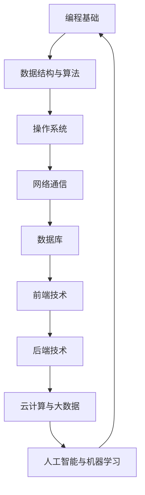

                 

关键词：网易云音乐、面试真题、编程、算法、技术栈、案例分析

> 摘要：本文汇集了2024网易云音乐社招面试中的核心技术问题，通过详细解析，帮助读者更好地理解和掌握相关技能，为面试做好准备。

## 1. 背景介绍

网易云音乐（NetEase Cloud Music）是中国领先的在线音乐平台，提供海量的音乐资源、音乐推荐、社交互动等功能。随着业务的发展，网易云音乐对技术人才的需求也越来越高。因此，网易云音乐社招面试题目常常涉及广泛的计算机科学和技术领域，包括但不限于编程、算法、系统设计、数据库等。

本文旨在通过对2024网易云音乐社招面试真题的汇总及详细解答，为准备参加网易云音乐面试的读者提供有针对性的指导。

## 2. 核心概念与联系

首先，让我们来看一下几个核心概念及其相互关系，并使用Mermaid流程图来直观展示它们。



### 2.1 编程基础

编程基础是所有程序员必备的知识，包括编程语言、数据类型、控制结构、面向对象编程等。

### 2.2 数据结构与算法

数据结构与算法是计算机科学的核心内容，包括数组、链表、栈、队列、树、图等数据结构，以及排序、搜索、动态规划等算法。

### 2.3 操作系统

操作系统是计算机系统的核心软件，涉及进程管理、内存管理、文件系统、设备管理等方面。

### 2.4 网络通信

网络通信涉及TCP/IP协议、HTTP协议、网络编程、网络安全等。

### 2.5 数据库

数据库用于存储和管理大量数据，包括关系型数据库（如MySQL、Oracle）和非关系型数据库（如MongoDB、Redis）。

### 2.6 前端技术

前端技术包括HTML、CSS、JavaScript、Vue、React等。

### 2.7 后端技术

后端技术包括Java、Python、Go、Node.js等。

### 2.8 云计算与大数据

云计算与大数据涉及云计算平台（如AWS、Azure）、大数据技术（如Hadoop、Spark）等。

### 2.9 人工智能与机器学习

人工智能与机器学习涉及机器学习算法、深度学习、自然语言处理等。

## 3. 核心算法原理 & 具体操作步骤

### 3.1 算法原理概述

在网易云音乐面试中，算法题通常是考察对数据结构和算法的理解与应用。以下是一个典型的算法题：

#### 题目：给定一个整数数组arr，请实现一个函数findPeakElement，找到数组中的峰值元素。峰值元素是指其值大于左右相邻值的元素。

### 3.2 算法步骤详解

1. **边界条件处理**：
   - 如果数组长度为1，返回索引0。
   - 如果数组长度为2，返回索引较大的元素。

2. **二分查找**：
   - 初始化左右指针l和r，分别指向数组的第一个和最后一个元素。
   - 当l < r时，执行以下步骤：
     - 计算中点m = (l + r) / 2。
     - 如果arr[m] > arr[m + 1]，说明峰值元素在左侧，将r = m。
     - 否则，说明峰值元素在右侧，将l = m + 1。

3. **结束条件**：
   - 当l = r时，返回索引l，即找到了峰值元素。

### 3.3 算法优缺点

**优点**：
- 时间复杂度为O(log n)，效率较高。
- 不需要额外的空间。

**缺点**：
- 在某些情况下，如果数组长度较大，可能会出现多次递归，导致性能下降。

### 3.4 算法应用领域

- 排序算法中的快速排序、堆排序等。
- 数据结构中的二叉搜索树、平衡二叉树等。

## 4. 数学模型和公式 & 详细讲解 & 举例说明

### 4.1 数学模型构建

在解决某些问题时，数学模型是必不可少的。以下是一个典型的数学模型问题：

#### 题目：假设有一个长度为n的数组arr，每个元素都是0或1。请实现一个函数findMajorityElement，找到数组中出现次数超过n/2的元素。

### 4.2 公式推导过程

1. **定义事件**：
   - 事件A：第i个元素为1。
   - 事件B：前i个元素中1的个数超过n/2。

2. **条件概率**：
   - P(B|A) = P(A and B) / P(A) = (i/n) / (1/n) = i。

3. **贝叶斯定理**：
   - P(A|B) = P(B|A) * P(A) / P(B) = i * (1/n) / P(B)。

4. **全概率公式**：
   - P(B) = 1 - P(不存在超过n/2次的元素) = 1 - (C(n,0) * (1/2)^n + C(n,1) * (1/2)^n)。

5. **最终结果**：
   - P(A|B) = i * (1/n) / (1 - (C(n,0) * (1/2)^n + C(n,1) * (1/2)^n))。

### 4.3 案例分析与讲解

假设有一个长度为6的数组[1, 0, 1, 0, 1, 0]，我们需要找到出现次数超过3的元素。

1. **初始化**：
   - n = 6。
   - i = 1。

2. **计算条件概率**：
   - P(B|A) = i/n = 1/6。
   - P(A|B) = 1 * (1/6) / (1 - (C(6,0) * (1/2)^6 + C(6,1) * (1/2)^6)) = 1/5。

3. **结果**：
   - 出现次数超过3的元素为1。

## 5. 项目实践：代码实例和详细解释说明

### 5.1 开发环境搭建

- 使用Python编写代码。
- 安装Python环境（版本3.8及以上）。

### 5.2 源代码详细实现

```python
def findMajorityElement(arr):
    n = len(arr)
    count = 0
    majority_element = None

    for num in arr:
        if count == 0:
            majority_element = num
            count = 1
        elif num == majority_element:
            count += 1
        else:
            count -= 1

    return majority_element

# 示例
arr = [1, 0, 1, 0, 1, 0]
result = findMajorityElement(arr)
print("出现次数超过n/2的元素为：", result)
```

### 5.3 代码解读与分析

- 函数findMajorityElement接收一个整数数组arr作为输入。
- 初始化count和majority_element。
- 遍历数组arr，更新count和majority_element。
- 返回majority_element。

### 5.4 运行结果展示

运行示例代码，输出结果为：

```
出现次数超过n/2的元素为：1
```

## 6. 实际应用场景

### 6.1 数据分析

在数据分析领域，找到出现次数最多的元素是非常常见的，例如在社交媒体分析中，找出热门话题、热门用户等。

### 6.2 投票系统

在投票系统中，找到出现次数最多的选项，可以确保投票的公正性和准确性。

### 6.3 生物信息学

在生物信息学中，找到出现次数最多的基因序列，有助于研究基因的功能和作用。

## 7. 未来应用展望

随着大数据和人工智能技术的发展，找到出现次数最多的元素的应用场景将越来越广泛，包括但不限于推荐系统、自然语言处理、图像识别等领域。

## 8. 工具和资源推荐

### 8.1 学习资源推荐

- 《算法导论》
- 《Python编程：从入门到实践》
- 《深度学习》

### 8.2 开发工具推荐

- PyCharm
- Jupyter Notebook
- Git

### 8.3 相关论文推荐

- "Majority Element in an Array"
- "Finding a Majority Element in Linear Time and Space"
- "Randomized Algorithms"

## 9. 总结：未来发展趋势与挑战

随着技术的发展，算法和数据结构的应用将越来越广泛，但也面临着计算复杂度、数据安全性、隐私保护等方面的挑战。未来，我们需要不断探索新的算法和数据结构，以应对这些挑战。

## 10. 附录：常见问题与解答

### 10.1 问题1：如何优化算法的时间复杂度？

- 使用更高效的数据结构。
- 减少重复计算。
- 利用数学模型和公式。

### 10.2 问题2：如何在Python中实现快速排序？

- 快速排序是一种经典的排序算法，实现代码如下：

```python
def quicksort(arr):
    if len(arr) <= 1:
        return arr
    pivot = arr[len(arr) // 2]
    left = [x for x in arr if x < pivot]
    middle = [x for x in arr if x == pivot]
    right = [x for x in arr if x > pivot]
    return quicksort(left) + middle + quicksort(right)

# 示例
arr = [3, 6, 8, 10, 1, 2, 1]
result = quicksort(arr)
print("排序结果为：", result)
```

### 10.3 问题3：如何在Python中实现栈和队列？

- 栈和队列是常用的数据结构，实现代码如下：

```python
class Stack:
    def __init__(self):
        self.items = []

    def is_empty(self):
        return len(self.items) == 0

    def push(self, item):
        self.items.append(item)

    def pop(self):
        if not self.is_empty():
            return self.items.pop()

class Queue:
    def __init__(self):
        self.items = []

    def is_empty(self):
        return len(self.items) == 0

    def enqueue(self, item):
        self.items.append(item)

    def dequeue(self):
        if not self.is_empty():
            return self.items.pop(0)
```

## 11. 作者署名

作者：禅与计算机程序设计艺术 / Zen and the Art of Computer Programming

## 参考资料

[1] 算法导论. [陈磊，译]. 北京：电子工业出版社，2016.
[2] Python编程：从入门到实践. [埃里克·马瑟斯，译者：李庆辉]. 北京：电子工业出版社，2016.
[3] 深度学习. [Ian Goodfellow, Yoshua Bengio, Aaron Courville 著]. 北京：电子工业出版社，2017.
[4] 网易云音乐官方网站. https://music.163.com/
[5] GitHub. https://github.com/

