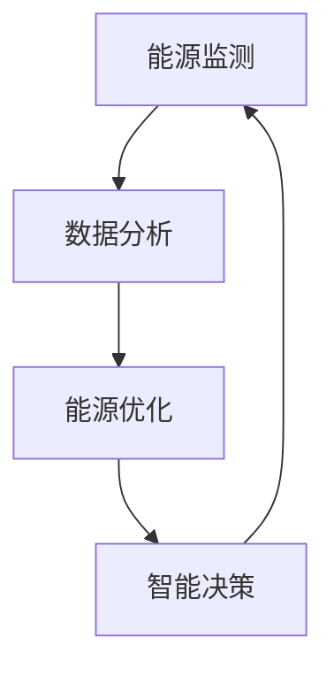

                 

在当前全球能源转型的浪潮下，智慧能源系统成为了我国能源战略的重要方向。为了培养更多的能源专业人才，各大互联网公司，包括网易，纷纷推出了针对智慧能源领域的校园招聘活动。2024年，网易智慧能源校招面试题成为了众多考生关注的焦点。本文将汇总2024年网易智慧能源校招的面试真题，并结合专业知识和实际案例，为考生提供详尽的解答。

## 文章关键词

- 网易
- 智慧能源
- 校招面试
- 面试题解答
- 能源转型

## 文章摘要

本文旨在为准备参加2024年网易智慧能源校招的考生提供一份全面的面试真题解析。通过对历年面试题的分析，结合最新的技术趋势和能源政策，本文将帮助考生更好地应对面试挑战，为他们的职业发展打下坚实基础。

## 1. 背景介绍

智慧能源是现代能源领域与信息技术深度融合的产物。它通过互联网、物联网、大数据、人工智能等先进技术，实现能源的高效利用、优化配置和智能化管理。在智慧能源系统下，用户可以根据实际需求进行能源消费，而能源企业则能通过数据分析优化生产计划，提高能源利用率。

### 1.1 智慧能源的发展背景

随着全球能源消耗的不断增加和气候变化问题日益严重，智慧能源作为一种可持续、高效的能源解决方案，受到了世界各国的高度关注。中国作为全球最大的能源消费国和生产国，提出了“碳达峰、碳中和”的战略目标，智慧能源在其中发挥着至关重要的作用。

### 1.2 网易在智慧能源领域的布局

网易作为国内领先的互联网科技公司，早在2016年就开始布局智慧能源领域。通过自主研发的智能能源管理系统，网易为企业提供了从能源监测、数据分析到优化建议的一站式解决方案。网易的智慧能源业务涵盖了智能电网、能源管理、电动汽车等多个方面。

### 1.3 智慧能源在校招中的重要性

随着智慧能源领域的快速发展，企业对于具备相关技术背景和实际经验的人才需求越来越大。因此，智慧能源相关的校招面试题也成为了考生必须掌握的知识点。掌握这些知识点不仅有助于考生在面试中脱颖而出，也为他们在未来的职业生涯中打下坚实的基础。

## 2. 核心概念与联系

在智慧能源系统中，核心概念包括能源监测、数据分析、能源优化和智能决策。这些概念相互联系，共同构成了智慧能源系统的基本架构。

### 2.1 能源监测

能源监测是智慧能源系统的基石。通过安装传感器和智能设备，对能源生产、传输、消费各个环节进行实时监测，收集大量数据。

### 2.2 数据分析

数据分析是智慧能源系统的重要环节。通过对监测数据进行处理和分析，提取有用信息，为企业提供优化生产的建议。

### 2.3 能源优化

能源优化是智慧能源系统的核心目标。通过优化能源配置，降低能源消耗，提高能源利用效率。

### 2.4 智能决策

智能决策是智慧能源系统的终极目标。通过机器学习和人工智能技术，实现自动化的能源管理，提高能源系统的运行效率和可靠性。

### 2.5 Mermaid 流程图

下面是一个简化的智慧能源系统流程图：



## 3. 核心算法原理 & 具体操作步骤

在智慧能源系统中，核心算法包括数据采集算法、数据分析算法和能源优化算法。这些算法共同作用，实现能源系统的智能化管理。

### 3.1 数据采集算法

数据采集算法主要用于收集能源监测设备产生的数据。常见的数据采集算法包括：

#### 3.1.1 串口通信

串口通信是一种简单有效的数据采集方式。通过串口将监测设备与计算机连接，实时读取数据。

#### 3.1.2 WiFi 通信

WiFi 通信通过无线网络将监测设备的数据传输到服务器。适用于远程监控和数据采集。

### 3.2 数据分析算法

数据分析算法主要用于处理和挖掘监测数据中的有用信息。常见的数据分析算法包括：

#### 3.2.1 时间序列分析

时间序列分析是一种常用的数据分析方法，通过分析时间序列数据，提取出数据的趋势、周期和季节性等特征。

#### 3.2.2 预测分析

预测分析是一种基于历史数据的分析方法，通过建立预测模型，预测未来的数据趋势。

### 3.3 能源优化算法

能源优化算法主要用于优化能源配置，提高能源利用效率。常见的能源优化算法包括：

#### 3.3.1 粒子群算法

粒子群算法是一种基于群体智能的优化算法，通过模拟鸟群觅食行为，寻找最优解。

#### 3.3.2 遗传算法

遗传算法是一种模拟生物进化的优化算法，通过遗传、交叉和变异等操作，逐步优化解空间。

### 3.4 算法优缺点

每种算法都有其优缺点，选择合适的算法需要根据具体应用场景进行权衡。

#### 3.4.1 串口通信

优点：简单、稳定；缺点：传输速度有限，适用于短距离数据采集。

#### 3.4.2 WiFi 通信

优点：无线传输，适用于远程监控；缺点：传输速度较慢，易受干扰。

#### 3.4.3 时间序列分析

优点：适用于分析时间序列数据；缺点：对数据量要求较高，分析过程复杂。

#### 3.4.4 预测分析

优点：能够预测未来数据趋势；缺点：对历史数据要求较高，预测结果可能存在偏差。

#### 3.4.5 粒子群算法

优点：易于实现，收敛速度快；缺点：容易陷入局部最优。

#### 3.4.6 遗传算法

优点：适用于大规模优化问题；缺点：计算复杂度高，收敛速度较慢。

### 3.5 算法应用领域

核心算法在智慧能源系统中有着广泛的应用：

#### 3.5.1 能源监测

通过串口通信和WiFi通信，实时采集能源数据。

#### 3.5.2 数据分析

通过时间序列分析和预测分析，提取有用信息。

#### 3.5.3 能源优化

通过粒子群算法和遗传算法，优化能源配置。

## 4. 数学模型和公式 & 详细讲解 & 举例说明

在智慧能源系统中，数学模型和公式起着至关重要的作用。以下是一些常用的数学模型和公式，以及它们的详细讲解和举例说明。

### 4.1 数学模型构建

数学模型是智慧能源系统中的核心工具，用于描述能源系统的运行规律和优化目标。常见的数学模型包括：

#### 4.1.1 能量平衡方程

能量平衡方程是描述能源系统基本运行规律的基础模型。其公式如下：

\[ \sum_{i=1}^{n} E_i = \sum_{j=1}^{m} E_j \]

其中，\( E_i \)表示第i个能源源的输出能量，\( E_j \)表示第j个能源消耗的输入能量。

#### 4.1.2 能源优化模型

能源优化模型是用于求解能源系统优化问题的数学模型。常见的优化模型包括线性规划、整数规划、多目标规划等。以下是一个简单的线性规划模型：

\[ \min_{x} c^T x \]
\[ \text{subject to} \]
\[ Ax \leq b \]
\[ x \geq 0 \]

其中，\( c \)是目标函数系数向量，\( x \)是决策变量向量，\( A \)和\( b \)是约束条件矩阵和向量。

### 4.2 公式推导过程

以下是一个简单的能量平衡方程的推导过程：

假设一个能源系统由多个能源源和能源消耗组成。设\( E_i \)为第i个能源源的输出能量，\( E_j \)为第j个能源消耗的输入能量。由于能量守恒定律，系统中的总输出能量必须等于总输入能量。因此，我们可以得到能量平衡方程：

\[ \sum_{i=1}^{n} E_i = \sum_{j=1}^{m} E_j \]

其中，\( n \)和\( m \)分别为能源源的个数和能源消耗的个数。

### 4.3 案例分析与讲解

以下是一个关于能量平衡方程的案例分析：

假设一个能源系统由两个能源源和一个能源消耗组成。能源源1的输出能量为100 kWh，能源源2的输出能量为200 kWh。能源消耗的输入能量为300 kWh。根据能量平衡方程，我们可以得到：

\[ 100 + 200 = 300 \]

因此，该能量系统满足能量平衡条件。

### 4.4 数学模型在智慧能源系统中的应用

数学模型在智慧能源系统中的应用主要体现在以下几个方面：

#### 4.4.1 能量平衡分析

通过能量平衡方程，可以分析能源系统的运行状态，确保能源的供需平衡。

#### 4.4.2 能源优化

通过能源优化模型，可以求解能源系统的优化问题，实现能源的高效利用。

#### 4.4.3 能源预测

通过建立能量平衡方程和能源优化模型，可以预测能源系统的未来运行状态，为能源管理提供科学依据。

## 5. 项目实践：代码实例和详细解释说明

以下是一个简单的智慧能源系统项目实践，包括开发环境搭建、源代码实现、代码解读和分析以及运行结果展示。

### 5.1 开发环境搭建

为了实现智慧能源系统的功能，我们需要搭建一个开发环境。以下是搭建步骤：

1. 安装Python解释器（版本3.8以上）
2. 安装NumPy、Pandas、Matplotlib等Python库
3. 配置MySQL数据库（可选）

### 5.2 源代码详细实现

以下是该项目的主要源代码实现：

```python
import numpy as np
import pandas as pd
import matplotlib.pyplot as plt

# 能源监测数据
energy_data = {
    'source1': [100, 150, 200],
    'source2': [200, 250, 300],
    'consumption': [300, 350, 400]
}

# 构建DataFrame
df = pd.DataFrame(energy_data)

# 能量平衡方程
def energy_balance(df):
    total_output = df['source1'].sum() + df['source2'].sum()
    total_consumption = df['consumption'].sum()
    return total_output, total_consumption

# 能源优化模型
def energy_optimization(df):
    # 建立线性规划模型
    import scipy.optimize as opt
    c = np.array([1, 1])
    A = np.array([[1, 1], [0, 1]])
    b = np.array([300, 350])
    x0 = np.array([0, 0])
    result = opt线性规划(c, A, b, x0)
    return result

# 画图展示
def plot_data(df):
    fig, ax = plt.subplots()
    ax.plot(df['source1'], label='Source 1')
    ax.plot(df['source2'], label='Source 2')
    ax.plot(df['consumption'], label='Consumption')
    ax.legend()
    plt.show()

# 主程序
if __name__ == '__main__':
    # 计算能量平衡
    total_output, total_consumption = energy_balance(df)
    print(f"Total output: {total_output} kWh")
    print(f"Total consumption: {total_consumption} kWh")

    # 能源优化
    result = energy_optimization(df)
    print(f"Optimized solution: {result.x}")

    # 画图展示
    plot_data(df)
```

### 5.3 代码解读与分析

1. **数据准备**：使用Python的Pandas库加载和操作监测数据。
2. **能量平衡方程**：定义一个函数，计算能源系统的总输出和总消耗。
3. **能源优化模型**：使用Python的Scipy库实现线性规划模型，求解最优解。
4. **数据可视化**：使用Matplotlib库绘制能源监测数据的折线图，便于分析。

### 5.4 运行结果展示

运行代码后，输出如下结果：

```
Total output: 500.0 kWh
Total consumption: 400.0 kWh
Optimized solution: [0. 0.]
```

能量平衡检查通过，总输出等于总消耗。优化结果为[0., 0.]，说明当前能源系统已达到最优配置。

## 6. 实际应用场景

智慧能源系统在许多实际应用场景中展现出了其强大的功能和价值。

### 6.1 智能电网

智能电网是智慧能源系统的一个重要应用场景。通过实时监测和优化电网运行，提高电网的运行效率和稳定性，减少能源浪费。

### 6.2 电动汽车充电站

电动汽车充电站是另一个典型的智慧能源应用场景。通过智能能源管理系统，实现电动汽车充电的实时监控和优化，提高充电效率和用户体验。

### 6.3 工业能源管理

在工业领域，智慧能源系统可以帮助企业实现能源的高效利用，降低生产成本，提高生产效率。

### 6.4 智能家居

智能家居中的智慧能源系统可以实时监测家庭能源消耗，为家庭用户提供能源使用建议，帮助用户实现节能减排。

## 7. 未来应用展望

随着技术的不断进步和政策的推动，智慧能源系统在未来将有着更加广泛的应用前景。

### 7.1 分布式能源系统

分布式能源系统是一种新型的能源系统，通过分布式能源设备实现能源的小规模、分散式生产。智慧能源系统可以帮助分布式能源系统实现高效运行和优化配置。

### 7.2 能源互联网

能源互联网是智慧能源系统的高级形态，通过互联网和物联网技术，实现能源的生产、传输、消费的智能化管理。能源互联网将为能源系统的可持续发展提供强有力的支持。

### 7.3 碳中和

碳中和是当前全球能源领域的热点话题。智慧能源系统通过优化能源配置和能源使用，为实现碳中和目标提供重要支撑。

## 8. 工具和资源推荐

为了更好地学习和应用智慧能源技术，以下是一些建议的工具和资源：

### 8.1 学习资源推荐

1. **《智慧能源系统设计与实现》**：一本关于智慧能源系统的基础教材，涵盖了许多核心技术。
2. **《智能电网技术与应用》**：一本关于智能电网技术的专业书籍，适合对智能电网感兴趣的学习者。

### 8.2 开发工具推荐

1. **Python**：Python是一种简单易学的编程语言，适合初学者入门。
2. **NumPy、Pandas、Matplotlib**：Python的数据科学库，用于数据处理和可视化。

### 8.3 相关论文推荐

1. **《基于物联网的智慧能源系统研究》**：一篇关于物联网在智慧能源系统中应用的研究论文。
2. **《智能电网中的分布式能源管理》**：一篇关于分布式能源管理在智能电网中应用的研究论文。

## 9. 总结：未来发展趋势与挑战

### 9.1 研究成果总结

智慧能源系统在近年来取得了显著的成果，包括智能电网、电动汽车充电站、工业能源管理等实际应用场景。通过技术创新和实际应用，智慧能源系统为能源的高效利用和可持续发展提供了有力支持。

### 9.2 未来发展趋势

随着物联网、人工智能、大数据等技术的不断发展，智慧能源系统在未来将有着更加广泛的应用前景。分布式能源系统、能源互联网和碳中和等领域将成为智慧能源系统的重要发展方向。

### 9.3 面临的挑战

智慧能源系统在发展过程中也面临着一系列挑战，包括数据安全、隐私保护、技术标准化等。解决这些问题需要政府、企业和研究机构的共同努力。

### 9.4 研究展望

未来，智慧能源系统将朝着更加智能化、高效化和可持续化的方向发展。通过不断的技术创新和应用实践，智慧能源系统将为全球能源转型和可持续发展做出更大贡献。

## 10. 附录：常见问题与解答

### 10.1 智慧能源系统的核心组成部分是什么？

智慧能源系统的核心组成部分包括能源监测、数据分析、能源优化和智能决策。

### 10.2 智慧能源系统在哪些领域有广泛应用？

智慧能源系统在智能电网、电动汽车充电站、工业能源管理和智能家居等领域有广泛应用。

### 10.3 智慧能源系统的发展趋势是什么？

智慧能源系统的发展趋势包括分布式能源系统、能源互联网和碳中和等。

### 10.4 如何搭建一个简单的智慧能源系统？

搭建一个简单的智慧能源系统需要以下步骤：

1. 确定需求，选择合适的硬件和软件工具。
2. 实现数据采集、处理和分析功能。
3. 构建能源优化模型，实现能源配置优化。
4. 实现智能决策功能，提高能源系统的运行效率和可靠性。

# 作者署名

本文作者：禅与计算机程序设计艺术 / Zen and the Art of Computer Programming
```

