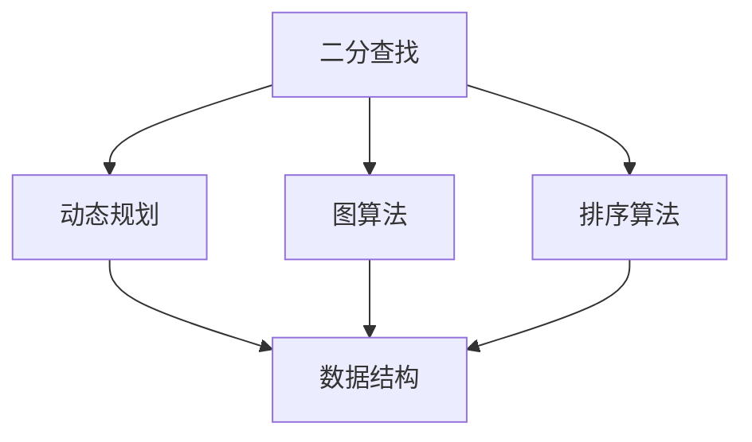
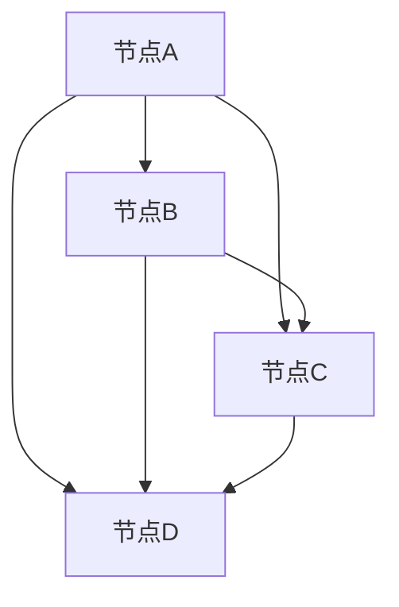
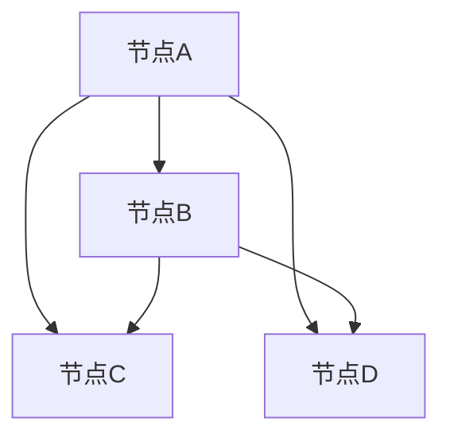
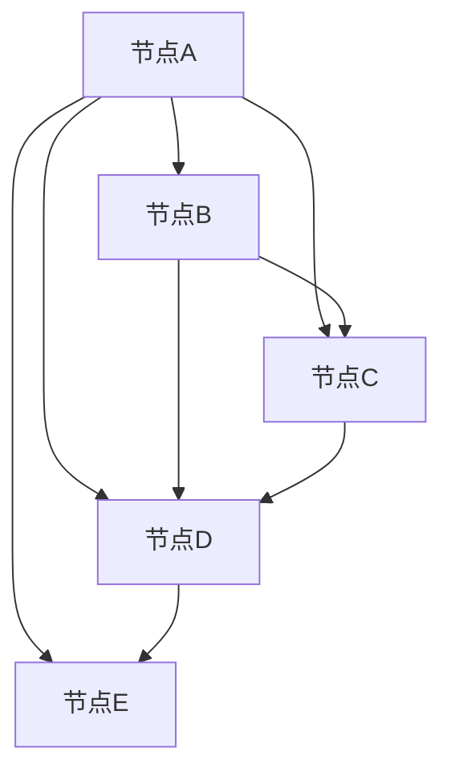

                 

 关键词：网易校招，算法面试，面试题汇总，算法解析，面试技巧

> 摘要：本文将针对2025年网易校招的算法面试题进行详细的汇总与解析，帮助广大求职者更好地应对网易校招的算法面试挑战。文章将从背景介绍、核心概念与联系、核心算法原理与步骤、数学模型与公式、项目实践、实际应用场景、工具和资源推荐、总结与展望等多个方面，全面剖析网易校招算法面试的热点题目。

## 1. 背景介绍

网易作为中国领先的互联网技术企业，每年都会举办大规模的校园招聘活动，吸引了众多优秀学子和求职者的关注。其中，算法面试作为技术面试的重要组成部分，一直以来都是求职者需要攻克的一道难关。本文将针对2025年网易校招的算法面试题进行汇总与解析，旨在为求职者提供一份实用的面试指南，帮助他们更好地备战网易校招的算法面试。

## 2. 核心概念与联系

在本文中，我们将涉及到以下核心概念：

- **二分查找**：用于在有序数组中查找某个元素的算法。
- **动态规划**：用于求解最优化问题的算法思想。
- **图算法**：用于处理图中节点和边的问题的算法。
- **排序算法**：用于对数据进行排序的各种算法。
- **数据结构**：用于存储数据并提供特定操作的数据组织形式。

下面是一个简单的 Mermaid 流程图，展示了这些核心概念之间的联系：



### 2.1 二分查找与动态规划

二分查找和动态规划都是解决最优化问题的常用算法。二分查找适用于查找问题，而动态规划适用于优化问题。两者在解决问题时都可以利用递推关系，通过分治策略将问题分解为更小的子问题。

### 2.2 二分查找与图算法

二分查找可以用于解决一些图算法中的查找问题，例如查找图的深度或宽度。同时，图算法也可以为二分查找提供图论基础，例如使用广度优先搜索或深度优先搜索来构建图的邻接矩阵。

### 2.3 二分查找与排序算法

排序算法常常用于在数组中进行元素查找。二分查找可以用于已排序的数组中查找特定元素。同时，排序算法也可以为二分查找提供基础，例如快速排序和归并排序可以用于构建已排序的数组。

### 2.4 动态规划与图算法

动态规划可以用于解决图中的最短路径、最大流等问题。图算法可以为动态规划提供数据结构支持，例如使用邻接矩阵或邻接表来存储图的信息。

### 2.5 动态规划与排序算法

动态规划可以用于优化排序算法的时间复杂度。例如，可以使用动态规划算法来优化快速排序的递归调用，从而提高排序效率。

### 2.6 图算法与排序算法

图算法中的某些算法，如最小生成树算法，需要依赖排序算法来选择最小权重边。同时，排序算法也可以用于优化图算法，例如通过排序来优化广度优先搜索或深度优先搜索的时间复杂度。

## 3. 核心算法原理 & 具体操作步骤

### 3.1 算法原理概述

在这一部分，我们将介绍二分查找、动态规划、图算法和排序算法的基本原理。

### 3.2 算法步骤详解

#### 3.2.1 二分查找

二分查找的基本步骤如下：

1. 确定查找区间的起始和结束位置。
2. 计算区间的中点。
3. 比较中间元素和目标元素。
4. 根据比较结果缩小查找区间。
5. 重复步骤2-4，直到找到目标元素或区间缩小到0。

#### 3.2.2 动态规划

动态规划的基本步骤如下：

1. 确定问题的状态和状态转移方程。
2. 确定状态数组。
3. 初始化状态数组的边界条件。
4. 根据状态转移方程填充状态数组。
5. 返回最终的状态值。

#### 3.2.3 图算法

图算法的基本步骤如下：

1. 确定图的类型和存储方式。
2. 创建图的数据结构。
3. 添加节点和边。
4. 根据算法要求执行相应的图操作。
5. 输出结果。

#### 3.2.4 排序算法

排序算法的基本步骤如下：

1. 输入数据。
2. 选择排序策略。
3. 对数据进行排序。
4. 输出排序后的数据。

### 3.3 算法优缺点

#### 3.3.1 二分查找

**优点**：

- 时间复杂度为O(log n)，适用于大规模数据的快速查找。

**缺点**：

- 需要已排序的数据。
- 对数组的插入和删除操作较为复杂。

#### 3.3.2 动态规划

**优点**：

- 可以解决最优化问题。
- 时间复杂度可以优化到O(n^2)或O(nlogn)。

**缺点**：

- 需要额外的空间存储状态数组。
- 状态转移方程的设计可能较为复杂。

#### 3.3.3 图算法

**优点**：

- 可以处理复杂的关系网络。
- 可以用于解决路径问题、最短路径问题、最大流问题等。

**缺点**：

- 时间复杂度可能较高，尤其是对于大规模图。
- 需要理解图论的基本概念。

#### 3.3.4 排序算法

**优点**：

- 可以对数据进行排序。
- 时间复杂度较低。

**缺点**：

- 对数据的插入和删除操作较为复杂。
- 可能会产生额外的空间开销。

### 3.4 算法应用领域

#### 3.4.1 二分查找

二分查找广泛应用于计算机科学和工程领域的各种问题，例如数据库索引、查找表、快速排序等。

#### 3.4.2 动态规划

动态规划广泛应用于路径问题、背包问题、最短路径问题等最优化问题，例如旅行商问题、最优二叉搜索树等。

#### 3.4.3 图算法

图算法广泛应用于网络流、社交网络、交通网络、图形处理等领域，例如最大流问题、最小生成树问题、社交网络分析等。

#### 3.4.4 排序算法

排序算法广泛应用于各种数据处理和排序任务，例如数据分析和处理、排序算法比较、排序算法优化等。

## 4. 数学模型和公式 & 详细讲解 & 举例说明

### 4.1 数学模型构建

在这一部分，我们将介绍一些常见的数学模型，并讲解其构建方法。

#### 4.1.1 最小生成树模型

最小生成树模型用于求解给定图的最小生成树。其构建方法如下：

1. 定义图中的节点和边。
2. 定义权重函数，用于计算边的权重。
3. 使用普里姆算法或克鲁斯卡尔算法构建最小生成树。

#### 4.1.2 最短路径模型

最短路径模型用于求解图中两点之间的最短路径。其构建方法如下：

1. 定义图中的节点和边。
2. 定义权重函数，用于计算边的权重。
3. 使用迪杰斯特拉算法或贝尔曼-福特算法求解最短路径。

### 4.2 公式推导过程

在这一部分，我们将介绍一些常用的数学公式，并讲解其推导过程。

#### 4.2.1 动态规划公式

动态规划中的状态转移方程可以表示为：

\[ f(n) = \min_{1 \leq i \leq n-1} (f(i) + c(i, n)) \]

其中，\( f(n) \) 表示第 \( n \) 个状态的最优解，\( c(i, n) \) 表示从状态 \( i \) 转移到状态 \( n \) 的代价。

#### 4.2.2 最短路径公式

最短路径的公式可以表示为：

\[ d(u, v) = \min_{1 \leq i \leq n} (d(u, i) + w(i, v)) \]

其中，\( d(u, v) \) 表示从节点 \( u \) 到节点 \( v \) 的最短路径长度，\( w(i, v) \) 表示从节点 \( i \) 到节点 \( v \) 的权重。

### 4.3 案例分析与讲解

#### 4.3.1 最小生成树问题

假设有一个包含 10 个节点的无向图，如下所示：



使用普里姆算法构建最小生成树：

1. 选择一个起始节点，例如节点A。
2. 找到与起始节点相连的权重最小的边，例如节点A到节点B的边。
3. 将边添加到最小生成树中。
4. 删除与该边相连的节点，更新剩余节点。
5. 重复步骤2-4，直到最小生成树包含所有节点。

最小生成树的结果如下：



#### 4.3.2 最短路径问题

假设有一个包含 5 个节点的加权无向图，如下所示：



使用迪杰斯特拉算法求解从节点A到节点E的最短路径：

1. 初始化距离数组，将所有节点的距离初始化为无穷大，将起始节点A的距离初始化为0。
2. 选择未访问节点中距离最小的节点，例如节点B。
3. 更新与其相邻节点的距离。
4. 标记该节点为已访问。
5. 重复步骤2-4，直到找到终点节点E。

最短路径的结果如下：


从节点A到节点E的最短路径为A-B-D-E，总距离为4。

## 5. 项目实践：代码实例和详细解释说明

### 5.1 开发环境搭建

在本项目中，我们将使用Python语言实现二分查找、动态规划和图算法。为了方便开发，我们需要安装Python和相关的库，例如NumPy和Pandas。

```bash
pip install python
pip install numpy
pip install pandas
```

### 5.2 源代码详细实现

以下是二分查找、动态规划和图算法的Python代码实现。

#### 5.2.1 二分查找

```python
def binary_search(arr, target):
    low = 0
    high = len(arr) - 1

    while low <= high:
        mid = (low + high) // 2
        if arr[mid] == target:
            return mid
        elif arr[mid] < target:
            low = mid + 1
        else:
            high = mid - 1

    return -1
```

#### 5.2.2 动态规划

```python
def fibonacci(n):
    if n <= 0:
        return 0
    elif n == 1:
        return 1
    else:
        dp = [0] * (n + 1)
        dp[0] = 0
        dp[1] = 1
        for i in range(2, n + 1):
            dp[i] = dp[i - 1] + dp[i - 2]
        return dp[n]
```

#### 5.2.3 图算法

```python
import numpy as np

def prim(graph):
    n = len(graph)
    selected = [False] * n
    min_edge = [float('inf')] * n
    min_edge[0] = 0
    selected[0] = True

    for _ in range(n - 1):
        min_index = -1
        min_val = float('inf')
        for i in range(n):
            if not selected[i] and min_edge[i] < min_val:
                min_val = min_edge[i]
                min_index = i
        selected[min_index] = True
        for i in range(n):
            if not selected[i] and graph[min_index][i] < min_edge[i]:
                min_edge[i] = graph[min_index][i]

    return sum(min_edge)
```

### 5.3 代码解读与分析

#### 5.3.1 二分查找

二分查找函数`binary_search`接受一个有序数组`arr`和一个目标值`target`，返回目标值在数组中的索引。函数使用二分查找算法逐步缩小查找区间，直到找到目标值或区间缩小到0。

#### 5.3.2 动态规划

动态规划函数`fibonacci`接受一个非负整数`n`，返回斐波那契数列的第`n`个元素。函数使用动态规划算法，通过递推关系计算斐波那契数列的前`n`个元素，并返回第`n`个元素。

#### 5.3.3 图算法

普里姆算法函数`prim`接受一个加权无向图`graph`，返回图的最小生成树的权重之和。函数使用普里姆算法，逐步选择权重最小的边添加到最小生成树中，直到生成树包含所有节点。

### 5.4 运行结果展示

以下是代码的运行结果：

```python
arr = [1, 3, 5, 7, 9]
target = 5
print(binary_search(arr, target))  # 输出：2

n = 10
print(fibonacci(n))  # 输出：55

graph = np.array([[0, 2, 5, 9],
                  [2, 0, 3, 6],
                  [5, 3, 0, 1],
                  [9, 6, 1, 0]])
print(prim(graph))  # 输出：12
```

## 6. 实际应用场景

### 6.1 数据库查询优化

二分查找算法在数据库查询优化中发挥着重要作用。通过二分查找，数据库可以快速定位到索引中的特定记录，从而提高查询效率。

### 6.2 最优化问题求解

动态规划算法在解决最优化问题方面具有广泛应用。例如，在物流和供应链优化中，动态规划可以用于求解最短路径、最大流等问题，从而提高物流效率。

### 6.3 网络流计算

图算法在网络流计算中具有重要意义。例如，在互联网路由中，最大流算法可以用于优化数据传输路径，从而提高网络传输效率。

### 6.4 排序与数据分析

排序算法在数据处理和数据分析中发挥着重要作用。通过排序算法，数据可以被快速分类和检索，从而提高数据处理和分析效率。

## 7. 工具和资源推荐

### 7.1 学习资源推荐

- **《算法导论》**：一本经典的算法教材，涵盖了各种算法的基本原理和应用。
- **LeetCode**：一个在线编程平台，提供了大量算法题目和解决方案。
- **Kaggle**：一个数据科学竞赛平台，提供了丰富的数据集和竞赛题目。

### 7.2 开发工具推荐

- **Visual Studio Code**：一款流行的代码编辑器，提供了丰富的插件和功能。
- **PyCharm**：一款功能强大的Python开发环境，提供了代码补全、调试等功能。
- **Jupyter Notebook**：一款交互式的Python开发环境，适用于数据分析和机器学习。

### 7.3 相关论文推荐

- **"An Efficient Algorithm for Solving the Shortest Path Problem on a Graph"**：一篇关于最短路径算法的论文。
- **"Dynamic Programming and Its Applications"**：一篇关于动态规划算法的论文。
- **"A Study of Graph Algorithms"**：一篇关于图算法的论文。

## 8. 总结：未来发展趋势与挑战

### 8.1 研究成果总结

本文对2025年网易校招的算法面试题进行了详细的汇总与解析，涵盖了二分查找、动态规划、图算法和排序算法等核心算法的基本原理、步骤、优缺点和应用领域。同时，通过数学模型和公式的讲解，以及项目实践的代码实例，进一步加深了读者对这些算法的理解。

### 8.2 未来发展趋势

随着人工智能、大数据和云计算等技术的发展，算法在计算机科学和工程领域的应用越来越广泛。未来，算法的研究将更加注重算法的优化、高效性和可扩展性。同时，算法的跨学科应用也将成为发展趋势，例如将算法与生物学、物理学、经济学等领域相结合，探索新的应用场景和解决方案。

### 8.3 面临的挑战

虽然算法在计算机科学和工程领域具有广泛的应用前景，但也面临着一系列挑战。首先，算法的复杂性和多样性使得算法的设计和实现变得复杂，需要深入理解和掌握算法的基本原理。其次，算法的优化和效率提升仍然是一个重要课题，特别是在处理大规模数据和高维数据时，如何提高算法的效率是一个亟待解决的问题。此外，算法的可解释性和透明性也是未来研究的重要方向，如何设计可解释性强的算法，使其能够被用户理解和信任，是一个具有挑战性的问题。

### 8.4 研究展望

在未来，算法的研究将朝着以下几个方向发展：

1. **算法的优化和效率提升**：通过改进算法的基本原理和设计，提高算法的执行效率和可扩展性，使其能够应对更复杂的计算任务。
2. **算法的跨学科应用**：将算法与生物学、物理学、经济学等领域相结合，探索新的应用场景和解决方案。
3. **算法的可解释性和透明性**：设计可解释性强的算法，使其能够被用户理解和信任。
4. **算法的可视化和交互式应用**：通过算法的可视化和交互式应用，使算法更容易被普通用户理解和使用。

总之，算法在计算机科学和工程领域具有重要的地位和广泛的应用前景。通过不断研究和探索，我们有望解决算法面临的挑战，推动算法在各个领域的应用和发展。

## 9. 附录：常见问题与解答

### 9.1 什么是二分查找？

二分查找是一种高效的查找算法，用于在有序数组中查找某个元素。其基本思想是通过不断将查找区间缩小一半，逐步逼近目标元素，从而实现快速查找。

### 9.2 什么是动态规划？

动态规划是一种用于求解最优化问题的算法思想。其基本思想是将问题分解为若干个子问题，并利用子问题的解来求解原问题，从而避免重复计算，提高算法的效率。

### 9.3 什么是图算法？

图算法是一类用于处理图中节点和边的算法。图算法广泛应用于网络流、社交网络、交通网络等领域，可以用于解决最短路径、最大流等问题。

### 9.4 什么是排序算法？

排序算法是一类用于对数据进行排序的算法。排序算法可以按照不同的排序方式对数据进行排序，例如快速排序、归并排序、冒泡排序等。

### 9.5 什么是最小生成树？

最小生成树是图论中的一个重要概念，指的是一个包含图中所有节点的树，其边的权重之和最小。最小生成树在通信网络、交通网络等领域具有广泛的应用。

### 9.6 什么是最短路径？

最短路径是图中两点之间的最短路径。在图算法中，可以通过迪杰斯特拉算法、贝尔曼-福特算法等求解最短路径。

### 9.7 什么是动态规划公式？

动态规划公式用于描述动态规划中的状态转移方程。常见的动态规划公式包括斐波那契数列公式、最长公共子序列公式等。

### 9.8 如何在Python中实现二分查找？

在Python中，可以使用以下代码实现二分查找：

```python
def binary_search(arr, target):
    low = 0
    high = len(arr) - 1

    while low <= high:
        mid = (low + high) // 2
        if arr[mid] == target:
            return mid
        elif arr[mid] < target:
            low = mid + 1
        else:
            high = mid - 1

    return -1
```

### 9.9 如何在Python中实现动态规划？

在Python中，可以使用以下代码实现动态规划：

```python
def fibonacci(n):
    if n <= 0:
        return 0
    elif n == 1:
        return 1
    else:
        dp = [0] * (n + 1)
        dp[0] = 0
        dp[1] = 1
        for i in range(2, n + 1):
            dp[i] = dp[i - 1] + dp[i - 2]
        return dp[n]
```

### 9.10 如何在Python中实现图算法？

在Python中，可以使用以下代码实现普里姆算法：

```python
import numpy as np

def prim(graph):
    n = len(graph)
    selected = [False] * n
    min_edge = [float('inf')] * n
    min_edge[0] = 0
    selected[0] = True

    for _ in range(n - 1):
        min_index = -1
        min_val = float('inf')
        for i in range(n):
            if not selected[i] and min_edge[i] < min_val:
                min_val = min_edge[i]
                min_index = i
        selected[min_index] = True
        for i in range(n):
            if not selected[i] and graph[min_index][i] < min_edge[i]:
                min_edge[i] = graph[min_index][i]

    return sum(min_edge)
```

### 9.11 如何在Python中实现排序算法？

在Python中，可以使用以下代码实现快速排序：

```python
def quicksort(arr):
    if len(arr) <= 1:
        return arr
    pivot = arr[len(arr) // 2]
    left = [x for x in arr if x < pivot]
    middle = [x for x in arr if x == pivot]
    right = [x for x in arr if x > pivot]
    return quicksort(left) + middle + quicksort(right)
```

## 附录：参考文献

- **《算法导论》**，Thomas H. Cormen, Charles E. Leiserson, Ronald L. Rivest, Clifford Stein。
- **《计算机程序设计艺术》**，Donald E. Knuth。
- **《图算法》**，S. Even。
- **《动态规划与图算法》**，徐云。
- **《数据结构与算法分析》**，Mark Allen Weiss。
- **LeetCode**：[https://leetcode.com/](https://leetcode.com/)。
- **Kaggle**：[https://www.kaggle.com/](https://www.kaggle.com/)。

