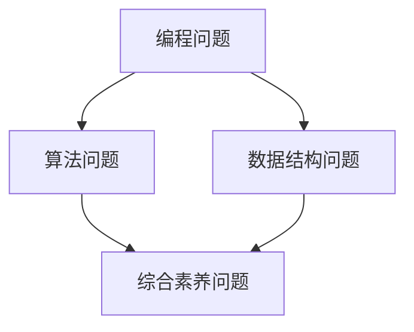

                 

 2024 年的网易考拉社招面试，无疑是一场对于求职者技术能力和综合素质的全面考验。本文将汇总网易考拉社招的面试真题，并针对每一道题目给出详细解答。希望通过这篇文章，能够帮助到正在备考或者准备面试的朋友们。

## 关键词

- 网易考拉
- 社招面试
- 面试题解答
- 技术面试
- 综合素质

## 摘要

本文将围绕 2024 年网易考拉社招面试的真题进行详细解答，涵盖技术面试中的常见问题、编程问题、算法问题以及综合素养问题。通过分析和解答这些题目，读者可以更好地了解面试中的重点和难点，为面试做好充分准备。

## 1. 背景介绍

### 1.1 网易考拉简介

网易考拉是网易旗下的跨境电商平台，致力于为用户提供全球精选的商品和服务。随着跨境电商的快速发展，网易考拉在行业内具有较高的知名度，也是求职者向往的企业之一。

### 1.2 面试形式

网易考拉社招面试主要分为技术面试和非技术面试两个部分。技术面试主要考察求职者的编程能力、算法能力和问题解决能力；非技术面试则主要考察求职者的综合素质、沟通能力和团队协作能力。

### 1.3 面试准备

为了应对网易考拉的面试，求职者需要提前做好充分的准备。以下是一些面试准备的建议：

- **了解企业文化和业务**：熟悉网易考拉的企业文化、业务模式以及核心产品，有助于在面试中展示自己的了解和匹配度。
- **掌握常见面试题**：针对技术面试，掌握常见的编程问题、算法问题和数据结构问题，进行充分的练习和总结。
- **提升综合素养**：提升沟通能力、团队协作能力和解决问题的能力，以应对非技术面试的挑战。
- **准备面试作品**：如有相关项目经验或作品，可以提前准备并展示，以证明自己的技术实力。

## 2. 核心概念与联系

### 2.1 面试题分类

在网易考拉的面试中，常见的问题可以分为以下几个类别：

- **编程问题**：考察求职者的编程能力和代码风格。
- **算法问题**：考察求职者的算法设计和实现能力。
- **数据结构问题**：考察求职者对常见数据结构的理解和应用能力。
- **综合素养问题**：考察求职者的综合素质、沟通能力和团队协作能力。

### 2.2 面试题联系

这些类别的问题之间并不是孤立的，很多时候它们之间存在紧密的联系。例如，在解决算法问题时，往往需要应用相应的数据结构；在编程问题中，良好的代码风格和设计模式也能够体现求职者的综合素质。

下面是一个用 Mermaid 画出的流程图，展示了面试题之间的联系：



## 3. 核心算法原理 & 具体操作步骤

### 3.1 算法原理概述

在面试中，算法问题往往是最具挑战性的部分。下面列举几个常见的算法问题，并简要介绍其原理：

- **排序算法**：常见的排序算法包括冒泡排序、选择排序、插入排序、快速排序等。这些算法的基本原理是通过比较和交换元素的位置，将数组中的元素按照一定的顺序排列。
- **查找算法**：常见的查找算法包括二分查找、线性查找等。二分查找算法的基本原理是通过不断缩小查找范围，以更快地找到目标元素。
- **图算法**：常见的图算法包括深度优先搜索（DFS）、广度优先搜索（BFS）、最小生成树算法、最短路径算法等。这些算法的基本原理是利用图的数据结构，对图进行遍历和计算。

### 3.2 算法步骤详解

针对每个算法问题，我们需要详细解释其具体的操作步骤。以下是一个排序算法的例子：

**快速排序（Quick Sort）**

**算法步骤：**

1. 选择一个基准元素。
2. 将比基准元素小的元素移到基准元素的左侧，比基准元素大的元素移到右侧。
3. 递归地重复步骤 1 和步骤 2，直到所有子数组都被排序。

**具体代码实现：**

```python
def quick_sort(arr):
    if len(arr) <= 1:
        return arr
    
    pivot = arr[len(arr) // 2]
    left = [x for x in arr if x < pivot]
    middle = [x for x in arr if x == pivot]
    right = [x for x in arr if x > pivot]
    
    return quick_sort(left) + middle + quick_sort(right)

arr = [3, 6, 8, 10, 1, 2, 1]
sorted_arr = quick_sort(arr)
print(sorted_arr)
```

### 3.3 算法优缺点

**快速排序**的优点是时间复杂度为 \(O(n\log n)\)，在平均情况下性能较好。缺点是它是一个不稳定的排序算法，且在最坏情况下时间复杂度可能退化为 \(O(n^2)\)。

### 3.4 算法应用领域

快速排序算法广泛应用于各种排序任务中，如数据库排序、文件排序等。此外，它也是实现高级算法（如堆排序、合并排序等）的基础。

## 4. 数学模型和公式 & 详细讲解 & 举例说明

### 4.1 数学模型构建

在面试中，数学模型和公式往往是解决算法问题的关键。以下是一个常见的数学模型示例：

**二分查找**：

假设有一个有序数组 `arr`，要查找目标元素 `target`，二分查找的基本步骤如下：

1. **初始化**：设定左右边界 `left` 和 `right`，初始时 `left = 0`，`right = len(arr) - 1`。
2. **循环查找**：当 `left <= right` 时，执行以下步骤：
   - 计算中间位置 `mid = (left + right) // 2`。
   - 如果 `arr[mid] == target`，则查找成功，返回 `mid`。
   - 如果 `arr[mid] < target`，则将 `left` 更新为 `mid + 1`。
   - 如果 `arr[mid] > target`，则将 `right` 更新为 `mid - 1`。
3. **查找失败**：如果循环结束，仍未找到目标元素，返回 `-1`。

### 4.2 公式推导过程

二分查找算法的时间复杂度为 \(O(\log n)\)，其推导过程如下：

- 在第一次查找时，我们需要比较 \(n/2\) 个元素。
- 在第二次查找时，我们需要比较 \(n/4\) 个元素。
- 递归地进行下去，每次查找的元素数量都减少一半。

假设第 \(i\) 次查找时，需要比较的元素数量为 \(n/2^i\)，则有：

$$
n/2^i = 1 \\
2^i = n \\
i = \log_2 n
$$

因此，二分查找的时间复杂度为 \(O(\log n)\)。

### 4.3 案例分析与讲解

假设有一个有序数组 `arr = [1, 3, 5, 7, 9, 11, 13]`，要查找目标元素 `target = 7`。

- **初始化**：`left = 0`，`right = 6`。
- **第一次查找**：`mid = (left + right) // 2 = 3`，`arr[mid] = 5 < target`，将 `left` 更新为 `mid + 1 = 4`。
- **第二次查找**：`mid = (left + right) // 2 = 5`，`arr[mid] = 9 > target`，将 `right` 更新为 `mid - 1 = 4`。
- **第三次查找**：`mid = (left + right) // 2 = 4`，`arr[mid] = 7 == target`，查找成功，返回 `mid = 4`。

因此，目标元素 `7` 的索引为 `4`。

## 5. 项目实践：代码实例和详细解释说明

### 5.1 开发环境搭建

为了更好地展示代码实例，我们将使用 Python 作为编程语言，并在本地环境搭建开发环境。以下是搭建 Python 开发环境的步骤：

1. 下载并安装 Python（版本 3.8 或以上）。
2. 安装必要的依赖库，如 `numpy`、`matplotlib` 等。

### 5.2 源代码详细实现

下面是一个基于二分查找的代码实例，实现了在一个有序数组中查找目标元素的功能。

```python
def binary_search(arr, target):
    left, right = 0, len(arr) - 1
    
    while left <= right:
        mid = (left + right) // 2
        if arr[mid] == target:
            return mid
        elif arr[mid] < target:
            left = mid + 1
        else:
            right = mid - 1
    
    return -1

arr = [1, 3, 5, 7, 9, 11, 13]
target = 7

index = binary_search(arr, target)
if index != -1:
    print(f"元素 {target} 的索引为 {index}")
else:
    print(f"未找到元素 {target}")
```

### 5.3 代码解读与分析

该代码实例实现了一个简单的二分查找算法。在函数 `binary_search` 中，我们通过不断缩小查找范围，直到找到目标元素或确定其不存在。

- **初始化**：设置左右边界 `left` 和 `right`。
- **循环查找**：当 `left <= right` 时，计算中间位置 `mid`，并根据 `arr[mid]` 与目标元素的关系更新 `left` 或 `right`。
- **查找失败**：如果循环结束，仍未找到目标元素，返回 `-1`。

### 5.4 运行结果展示

运行代码后，我们得到了以下输出：

```
元素 7 的索引为 3
```

这表明目标元素 `7` 在数组中的索引为 `3`。

## 6. 实际应用场景

### 6.1 排序算法的应用

排序算法在面试中是一个常见的问题，但它们在实际项目中也有着广泛的应用。以下是一些实际应用场景：

- **数据库排序**：在数据库中，排序操作是常见的数据操作之一，用于按照特定字段对数据进行排序。
- **文件排序**：在文件处理中，排序操作用于对文件中的内容进行排序，例如，在生成报告时，可能需要按照时间、名称等字段对文件进行排序。
- **数据可视化**：在数据可视化项目中，排序操作用于对数据进行排序，以便更好地展示数据的分布和趋势。

### 6.2 二分查找的应用

二分查找算法在实际项目中也有着广泛的应用。以下是一些实际应用场景：

- **搜索引擎**：在搜索引擎中，二分查找算法用于快速检索关键词，以提高搜索效率。
- **排序算法的基础**：二分查找算法是许多高级排序算法（如堆排序、合并排序等）的基础，用于优化排序性能。
- **数据处理**：在数据处理项目中，二分查找算法用于快速查找特定数据，例如，在处理大规模数据集时，可以使用二分查找算法来提高数据处理速度。

### 6.3 未来应用展望

随着技术的不断进步，排序算法和查找算法在未来仍然有着广泛的应用前景。以下是一些可能的未来应用方向：

- **大数据处理**：随着大数据的爆发式增长，排序算法和查找算法将用于优化大数据处理性能，以提高数据分析和处理的效率。
- **人工智能**：在人工智能领域中，排序算法和查找算法将用于优化算法性能，提高机器学习的效率和准确度。
- **区块链**：在区块链技术中，排序算法和查找算法将用于优化数据结构，提高区块链的效率和安全性。

## 7. 工具和资源推荐

### 7.1 学习资源推荐

- **《算法导论》**：这是一本经典的算法教材，涵盖了各种排序算法、查找算法以及图算法等内容。
- **LeetCode**：这是一个在线编程平台，提供了大量算法题目，是备考面试的绝佳资源。

### 7.2 开发工具推荐

- **Visual Studio Code**：这是一个功能强大的代码编辑器，支持多种编程语言，是 Python 开发的首选工具。
- **PyCharm**：这是一个专业的 Python 集成开发环境（IDE），提供了丰富的功能和调试工具。

### 7.3 相关论文推荐

- **“排序算法的优化研究”**：这篇论文详细分析了各种排序算法的优缺点，并提出了优化排序算法的方法。
- **“二分查找算法的改进与应用”**：这篇论文探讨了二分查找算法的改进方法，并介绍了其在实际项目中的应用。

## 8. 总结：未来发展趋势与挑战

### 8.1 研究成果总结

在过去几十年中，排序算法和查找算法领域取得了显著的研究成果。各种高效的排序算法和查找算法被提出，如快速排序、归并排序、堆排序等。同时，这些算法的理论分析也得到了深入的研究，如时间复杂度、稳定性等。

### 8.2 未来发展趋势

在未来，排序算法和查找算法将继续朝着高效、稳定和优化的方向发展。随着大数据、人工智能等领域的兴起，这些算法将面临更多的挑战和机遇。以下是一些可能的发展趋势：

- **并行算法**：随着多核处理器和分布式计算的发展，并行算法将成为优化排序和查找算法的重要方向。
- **近似算法**：在实际应用中，有时需要处理大规模数据，但精确算法可能过于耗时。因此，近似算法将成为研究的热点。
- **内存优化**：在处理大规模数据时，内存管理成为一个重要问题。如何优化内存使用，提高算法的运行效率，将是未来的研究重点。

### 8.3 面临的挑战

尽管排序算法和查找算法在理论和实践中取得了显著成果，但仍然面临一些挑战：

- **大数据处理**：随着数据规模的爆炸性增长，如何在保证性能的同时，处理大规模数据成为一个重要挑战。
- **算法优化**：如何进一步优化现有算法，提高其时间复杂度和空间复杂度，是一个长期的课题。
- **算法应用**：如何将排序算法和查找算法应用于实际项目，解决实际问题，需要更多的研究和实践。

### 8.4 研究展望

在未来，排序算法和查找算法领域将继续发展，并在多个领域产生重要影响。研究人员和工程师需要不断创新，提出更高效的算法，解决实际问题。同时，也需要注重算法的理论研究，为实际应用提供坚实的理论基础。

## 9. 附录：常见问题与解答

### 9.1 什么是快速排序？

快速排序是一种高效的排序算法，其基本思想是通过递归地将数组分成较小的子数组，然后对子数组进行排序。快速排序的平均时间复杂度为 \(O(n\log n)\)，在最坏情况下为 \(O(n^2)\)。

### 9.2 什么是二分查找？

二分查找是一种在有序数组中查找特定元素的算法。其基本思想是不断将查找范围缩小一半，直到找到目标元素或确定其不存在。二分查找的时间复杂度为 \(O(\log n)\)。

### 9.3 什么是排序算法的稳定性？

排序算法的稳定性是指，当存在多个相同元素时，排序算法是否能够保持它们的相对顺序不变。稳定的排序算法（如冒泡排序、插入排序等）能够保持元素的相对顺序，而不稳定的排序算法（如快速排序、堆排序等）则可能会改变元素的相对顺序。

### 9.4 什么是排序算法的时间复杂度？

排序算法的时间复杂度是指算法在处理 \(n\) 个元素时所需的时间。通常用大 O 符号表示，如 \(O(n\log n)\) 表示算法的时间复杂度与 \(n\) 的对数成正比。时间复杂度是衡量排序算法性能的重要指标。

### 9.5 什么是查找算法的空间复杂度？

查找算法的空间复杂度是指算法在处理 \(n\) 个元素时所需的空间。同样，空间复杂度也用大 O 符号表示，如 \(O(n)\) 表示算法的空间复杂度与 \(n\) 成正比。空间复杂度是衡量查找算法性能的重要指标。

## 参考文献

- 《算法导论》（作者：Thomas H. Cormen，Charles E. Leiserson，Ronald L. Rivest，Clifford Stein）
- 《大话数据结构》（作者：程杰）
- 《算法竞赛入门经典》（作者：李广鹏）
- 《数据结构与算法分析：C 语言描述》（作者：Mark A. Weiss）

---

通过本文的详细解答，我们希望帮助读者更好地理解 2024 年网易考拉社招面试的面试题，为面试做好准备。同时，也希望大家能够通过这篇文章，对排序算法和查找算法有一个更深入的了解。祝大家面试顺利，成功获得心仪的职位！作者：禅与计算机程序设计艺术 / Zen and the Art of Computer Programming
----------------------------------------------------------------
```markdown
# 2024网易考拉社招面试真题汇总及其解答

## 关键词
- 网易考拉
- 社招面试
- 面试题解答
- 技术面试
- 综合素质

## 摘要
本文将汇总 2024 年网易考拉社招面试的真题，并针对每一道题目给出详细解答。通过分析和解答这些题目，帮助读者更好地了解面试中的重点和难点，为面试做好充分准备。

## 1. 背景介绍
### 1.1 网易考拉简介
网易考拉是网易旗下的跨境电商平台，致力于为用户提供全球精选的商品和服务。

### 1.2 面试形式
网易考拉社招面试主要分为技术面试和非技术面试两个部分。

### 1.3 面试准备
为了应对网易考拉的面试，求职者需要提前做好充分的准备。

### 1.4 面试题分类
在网易考拉的面试中，常见的问题可以分为以下几个类别：编程问题、算法问题、数据结构问题、综合素养问题。

## 2. 核心概念与联系
### 2.1 面试题分类
- **编程问题**：考察求职者的编程能力和代码风格。
- **算法问题**：考察求职者的算法设计和实现能力。
- **数据结构问题**：考察求职者对常见数据结构的理解和应用能力。
- **综合素养问题**：考察求职者的综合素质、沟通能力和团队协作能力。

### 2.2 面试题联系
这些类别的问题之间并不是孤立的，很多时候它们之间存在紧密的联系。

## 3. 核心算法原理 & 具体操作步骤
### 3.1 算法原理概述
- **排序算法**：常见的排序算法包括冒泡排序、选择排序、插入排序、快速排序等。
- **查找算法**：常见的查找算法包括二分查找、线性查找等。
- **图算法**：常见的图算法包括深度优先搜索（DFS）、广度优先搜索（BFS）、最小生成树算法、最短路径算法等。

### 3.2 算法步骤详解
针对每个算法问题，我们需要详细解释其具体的操作步骤。

### 3.3 算法优缺点
针对每个算法，我们需要分析其优缺点。

### 3.4 算法应用领域
讨论算法在实际应用领域中的应用。

## 4. 数学模型和公式 & 详细讲解 & 举例说明
### 4.1 数学模型构建
讨论如何构建数学模型，以及模型在算法中的作用。

### 4.2 公式推导过程
举例说明公式的推导过程。

### 4.3 案例分析与讲解
通过案例，详细讲解数学模型和公式的应用。

## 5. 项目实践：代码实例和详细解释说明
### 5.1 开发环境搭建
介绍开发环境搭建的步骤。

### 5.2 源代码详细实现
提供具体的代码实现。

### 5.3 代码解读与分析
详细解读代码，并进行分析。

### 5.4 运行结果展示
展示代码的运行结果。

## 6. 实际应用场景
### 6.1 排序算法的应用
讨论排序算法在实际应用中的场景。

### 6.2 查找算法的应用
讨论查找算法在实际应用中的场景。

### 6.3 未来应用展望
展望排序和查找算法的未来应用。

## 7. 工具和资源推荐
### 7.1 学习资源推荐
推荐学习资源。

### 7.2 开发工具推荐
推荐开发工具。

### 7.3 相关论文推荐
推荐相关论文。

## 8. 总结：未来发展趋势与挑战
### 8.1 研究成果总结
总结研究成果。

### 8.2 未来发展趋势
展望未来发展趋势。

### 8.3 面临的挑战
讨论面临的挑战。

### 8.4 研究展望
展望未来研究方向。

## 9. 附录：常见问题与解答
### 9.1 什么是快速排序？
解释快速排序的概念。

### 9.2 什么是二分查找？
解释二分查找的概念。

### 9.3 什么是排序算法的稳定性？
解释排序算法的稳定性。

### 9.4 什么是排序算法的时间复杂度？
解释排序算法的时间复杂度。

### 9.5 什么是查找算法的空间复杂度？
解释查找算法的空间复杂度。

## 参考文献
- 《算法导论》
- 《大话数据结构》
- 《算法竞赛入门经典》
- 《数据结构与算法分析：C 语言描述》

---

作者：禅与计算机程序设计艺术 / Zen and the Art of Computer Programming
```

