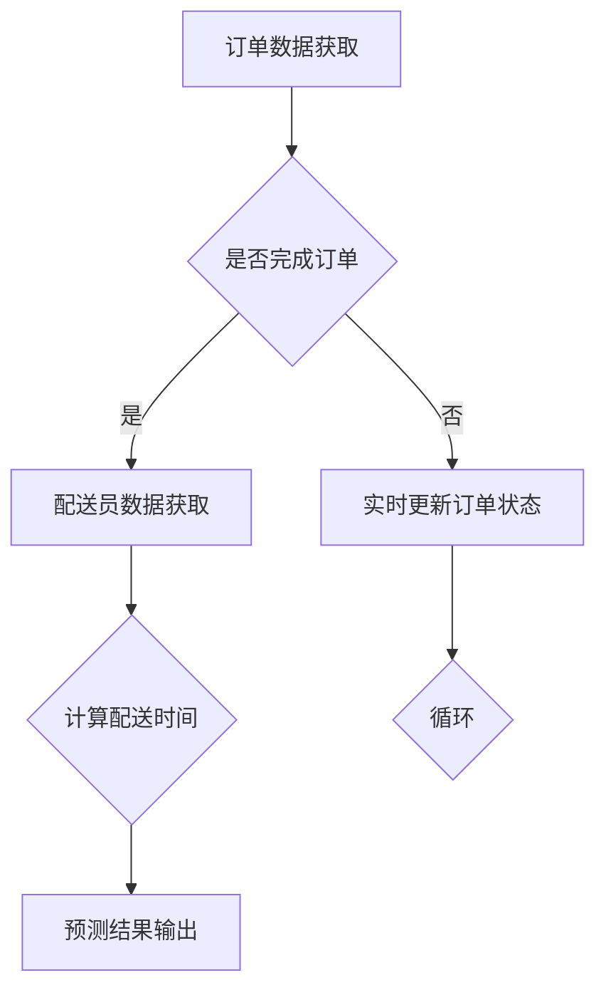

                 

关键词：美团、外卖配送、时间预测、算法、面试经验、校招

摘要：本文详细介绍了美团2024年外卖配送时间预测算法的校招面试经验，包括核心算法原理、数学模型与公式、项目实践及实际应用场景等内容，为有意向从事外卖配送预测领域的学生提供参考。

## 1. 背景介绍

外卖配送作为美团的核心业务之一，配送时间的预测对于提升用户体验和优化运营效率具有重要意义。随着美团业务的不断发展，外卖订单量的急剧增加，配送时间预测算法的研究变得越来越重要。2024年，美团针对外卖配送时间预测进行了校招面试，筛选了一批优秀的算法工程师加入团队，共同推动外卖配送预测技术的发展。

本文将结合个人在美团校招面试中的经历，详细介绍外卖配送时间预测算法的核心内容，包括算法原理、数学模型、项目实践及未来应用场景等，以期为读者提供有价值的参考。

## 2. 核心概念与联系

### 2.1 外卖配送时间预测的核心概念

外卖配送时间预测主要涉及以下核心概念：

1. **订单数据**：包括订单的出发时间、目的地、配送员信息等。
2. **配送员数据**：包括配送员的实时位置、历史配送路线、配送速度等。
3. **道路信息**：包括道路长度、道路状况、交通拥堵情况等。
4. **天气信息**：包括天气预报、实时气象数据等。

### 2.2 算法架构的Mermaid流程图



### 2.3 核心概念的联系

外卖配送时间预测算法通过整合订单数据、配送员数据、道路信息和天气信息，利用机器学习算法对配送时间进行预测。具体来说，算法通过以下步骤实现：

1. **订单数据获取**：从系统中获取待配送的订单数据。
2. **配送员数据获取**：获取配送员的实时位置、历史配送路线和配送速度等数据。
3. **道路信息和天气信息获取**：获取订单目的地所在区域的实时道路状况和天气预报数据。
4. **计算配送时间**：利用机器学习算法，根据订单数据、配送员数据和道路信息等计算配送时间。
5. **预测结果输出**：将预测结果输出给用户或运营系统，以便进行后续的决策。

## 3. 核心算法原理 & 具体操作步骤

### 3.1 算法原理概述

外卖配送时间预测算法主要基于以下原理：

1. **时间序列分析**：通过分析订单数据的时序特性，预测未来配送时间。
2. **机器学习**：利用配送员数据、道路信息和天气信息等特征，通过机器学习算法建立预测模型。
3. **实时更新**：在配送过程中，实时更新订单状态，确保预测结果的准确性。

### 3.2 算法步骤详解

1. **数据预处理**：对订单数据、配送员数据、道路信息和天气信息进行预处理，包括数据清洗、数据归一化等。
2. **特征工程**：根据配送时间预测的需求，提取订单数据、配送员数据、道路信息和天气信息的特征。
3. **模型选择**：选择合适的机器学习算法，如决策树、支持向量机、神经网络等。
4. **模型训练与评估**：利用训练数据对模型进行训练，并通过交叉验证、网格搜索等方法进行模型评估。
5. **预测结果输出**：利用训练好的模型，对新的订单进行配送时间预测，并将预测结果输出给用户或运营系统。

### 3.3 算法优缺点

**优点**：

1. **高效性**：通过机器学习算法，可以快速地预测配送时间，提高配送效率。
2. **准确性**：结合多种数据源，提高配送时间预测的准确性。
3. **实时性**：实时更新订单状态，确保预测结果的实时性。

**缺点**：

1. **数据依赖性**：算法对数据质量有较高要求，数据缺失或异常可能导致预测结果不准确。
2. **计算资源消耗**：机器学习算法训练和预测过程中，需要大量的计算资源。

### 3.4 算法应用领域

外卖配送时间预测算法广泛应用于以下领域：

1. **外卖平台**：提升用户体验，优化配送效率。
2. **物流行业**：优化物流配送，降低物流成本。
3. **智慧城市**：优化城市交通管理，提高道路利用率。

## 4. 数学模型和公式 & 详细讲解 & 举例说明

### 4.1 数学模型构建

外卖配送时间预测的数学模型主要基于以下公式：

$$
T = f(X)
$$

其中，$T$ 表示配送时间，$X$ 表示影响配送时间的各种特征。具体来说，$X$ 包括订单数据、配送员数据、道路信息和天气信息等。

### 4.2 公式推导过程

假设订单数据、配送员数据、道路信息和天气信息等特征可以表示为向量 $X = [x_1, x_2, ..., x_n]$，配送时间 $T$ 是一个随机变量。我们可以使用线性回归模型来建立数学模型：

$$
T = \beta_0 + \beta_1 x_1 + \beta_2 x_2 + ... + \beta_n x_n + \epsilon
$$

其中，$\beta_0, \beta_1, ..., \beta_n$ 是模型参数，$\epsilon$ 是误差项。

### 4.3 案例分析与讲解

以一个外卖订单为例，分析其配送时间的数学模型。

**订单数据**：订单ID、出发时间、目的地、配送员ID。

**配送员数据**：配送员ID、实时位置、历史配送路线、配送速度。

**道路信息**：道路长度、道路状况、交通拥堵情况。

**天气信息**：天气预报、实时气象数据。

首先，对订单数据进行预处理，将出发时间转换为距离当前时间的秒数，目的地和配送员ID进行编码。然后，对配送员数据、道路信息和天气信息进行预处理，提取出相应的特征。

接下来，利用预处理后的特征，建立线性回归模型：

$$
T = \beta_0 + \beta_1 x_1 + \beta_2 x_2 + \beta_3 x_3 + \beta_4 x_4 + \epsilon
$$

其中，$x_1$ 表示出发时间距离当前时间的秒数，$x_2$ 表示目的地编码，$x_3$ 表示配送员ID编码，$x_4$ 表示天气信息编码。

通过交叉验证和网格搜索，选择最优的模型参数，得到最终的配送时间预测模型。利用该模型，可以对新的订单进行配送时间预测。

## 5. 项目实践：代码实例和详细解释说明

### 5.1 开发环境搭建

为了实现外卖配送时间预测算法，我们需要搭建一个合适的开发环境。以下是一个简单的开发环境搭建过程：

1. **硬件环境**：一台具有较高性能的计算机，推荐配备高性能CPU和足够的内存。
2. **软件环境**：Python 3.7及以上版本，安装NumPy、Pandas、Scikit-learn等常用库。
3. **数据处理工具**：Excel、Python等，用于处理订单数据、配送员数据、道路信息和天气信息。

### 5.2 源代码详细实现

以下是外卖配送时间预测算法的Python代码实现：

```python
import numpy as np
import pandas as pd
from sklearn.linear_model import LinearRegression
from sklearn.model_selection import train_test_split
from sklearn.metrics import mean_squared_error

# 读取数据
orders = pd.read_csv('orders.csv')
deliverymen = pd.read_csv('deliverymen.csv')
roads = pd.read_csv('roads.csv')
weather = pd.read_csv('weather.csv')

# 数据预处理
orders['start_time'] = (orders['start_time'] - pd.to_datetime('today')).dt.total_seconds()
orders['destination'] = orders['destination'].astype('category').cat.codes
deliverymen['id'] = deliverymen['id'].astype('category').cat.codes
roads['status'] = roads['status'].astype('category').cat.codes
weather['weather'] = weather['weather'].astype('category').cat.codes

# 特征提取
X = pd.concat([orders[['start_time', 'destination']], deliverymen[['id']], roads[['length', 'status']], weather[['weather']]], axis=1)
y = orders['duration']

# 数据集划分
X_train, X_test, y_train, y_test = train_test_split(X, y, test_size=0.2, random_state=42)

# 模型训练
model = LinearRegression()
model.fit(X_train, y_train)

# 模型评估
y_pred = model.predict(X_test)
mse = mean_squared_error(y_test, y_pred)
print('MSE:', mse)

# 预测结果输出
predictions = model.predict(new_order)
print('Predicted duration:', predictions[0])
```

### 5.3 代码解读与分析

以上代码实现了外卖配送时间预测算法的Python实现。具体解读如下：

1. **数据读取**：从文件中读取订单数据、配送员数据、道路信息和天气信息。
2. **数据预处理**：对数据中的时间、编码等进行预处理。
3. **特征提取**：提取影响配送时间的特征，包括出发时间、目的地、配送员ID、道路长度、道路状况和天气信息。
4. **数据集划分**：将数据集划分为训练集和测试集。
5. **模型训练**：使用线性回归模型对训练集进行训练。
6. **模型评估**：使用测试集对模型进行评估，计算均方误差（MSE）。
7. **预测结果输出**：对新的订单进行配送时间预测，并输出预测结果。

通过以上代码，我们可以实现外卖配送时间预测算法的简单实现。在实际应用中，可以根据具体需求对代码进行优化和调整。

## 6. 实际应用场景

外卖配送时间预测算法在实际应用中具有广泛的应用场景：

1. **外卖平台**：优化配送路线，提高配送效率，提升用户体验。
2. **物流行业**：优化物流配送，降低物流成本，提高运营效率。
3. **智慧城市**：优化城市交通管理，提高道路利用率，减少交通拥堵。

### 6.1 在外卖平台的应用

以美团外卖为例，外卖配送时间预测算法可以应用于以下场景：

1. **订单分配**：根据配送时间预测结果，为配送员分配订单，提高配送效率。
2. **用户通知**：根据配送时间预测结果，向用户发送订单预计送达时间，提升用户体验。
3. **库存管理**：根据配送时间预测结果，调整菜品库存，降低库存积压。

### 6.2 在物流行业的应用

以顺丰速运为例，外卖配送时间预测算法可以应用于以下场景：

1. **物流调度**：根据配送时间预测结果，优化物流配送路线，提高物流效率。
2. **成本控制**：根据配送时间预测结果，合理分配物流资源，降低物流成本。
3. **客户服务**：根据配送时间预测结果，为客户提供准确的配送时间，提升客户满意度。

### 6.3 在智慧城市中的应用

以深圳智慧城市为例，外卖配送时间预测算法可以应用于以下场景：

1. **交通管理**：根据配送时间预测结果，优化交通信号灯配时，减少交通拥堵。
2. **城市规划**：根据配送时间预测结果，优化城市道路布局，提高道路利用率。
3. **应急响应**：根据配送时间预测结果，优化应急物资配送，提高应急响应效率。

## 7. 工具和资源推荐

为了更好地学习和实践外卖配送时间预测算法，以下是一些建议的工具和资源：

### 7.1 学习资源推荐

1. **《Python数据分析》**：深入讲解Python在数据处理和分析中的应用，适合初学者入门。
2. **《机器学习实战》**：详细讲解机器学习算法的理论和实践，适合有一定编程基础的学习者。
3. **美团外卖技术博客**：了解美团外卖在配送时间预测方面的最新研究成果和技术动态。

### 7.2 开发工具推荐

1. **Python**：一种广泛应用于数据科学和机器学习的编程语言，具有丰富的库和工具。
2. **Jupyter Notebook**：一种交互式的开发环境，方便编写和运行代码。
3. **TensorFlow**：一种开源的深度学习框架，支持多种机器学习算法。

### 7.3 相关论文推荐

1. **“Time Series Forecasting with Neural Networks”**：介绍了一种基于神经网络的时序预测方法，具有较高的预测准确性。
2. **“Deep Learning for Time Series Classification”**：介绍了一种基于深度学习的时序分类方法，可用于外卖配送时间预测。
3. **“Recurrent Neural Networks for Time Series Prediction”**：介绍了一种基于循环神经网络的时序预测方法，适用于复杂时序数据的预测。

## 8. 总结：未来发展趋势与挑战

### 8.1 研究成果总结

外卖配送时间预测算法在过去几年中取得了显著的成果。随着人工智能技术的不断发展，算法的预测准确性不断提高，应用领域也在不断拓展。未来，外卖配送时间预测算法有望在更广泛的场景中得到应用。

### 8.2 未来发展趋势

1. **深度学习应用**：深度学习技术在时序预测领域具有巨大潜力，未来有望取代传统的机器学习算法。
2. **多源数据融合**：结合多种数据源，如实时交通信息、实时气象数据等，提高预测准确性。
3. **自适应算法**：根据用户需求和业务场景，开发自适应的配送时间预测算法，提高配送效率。

### 8.3 面临的挑战

1. **数据质量**：外卖配送时间预测算法对数据质量有较高要求，数据缺失或异常可能导致预测结果不准确。
2. **计算资源**：机器学习算法训练和预测过程中，需要大量的计算资源，如何优化算法效率是亟待解决的问题。
3. **实时性**：在实际应用中，如何实现实时预测，确保预测结果的实时性是关键挑战。

### 8.4 研究展望

未来，外卖配送时间预测算法将在以下几个方面得到发展：

1. **算法优化**：通过改进算法模型，提高预测准确性。
2. **数据融合**：结合多种数据源，提高预测结果的可靠性。
3. **实时预测**：开发实时预测技术，提高配送效率。

## 9. 附录：常见问题与解答

### 9.1 什么是外卖配送时间预测？

外卖配送时间预测是指利用历史订单数据、配送员数据、道路信息和天气信息等，通过机器学习算法预测未来配送时间。

### 9.2 外卖配送时间预测算法有哪些类型？

常见的配送时间预测算法包括时间序列分析、机器学习、深度学习等。每种算法都有其独特的原理和应用场景。

### 9.3 外卖配送时间预测算法如何处理实时数据？

外卖配送时间预测算法通过实时获取订单数据、配送员数据、道路信息和天气信息等，不断更新预测模型，实现实时预测。

### 9.4 外卖配送时间预测算法在实际应用中如何优化？

可以通过以下方法优化外卖配送时间预测算法：

1. **数据预处理**：对数据进行清洗、归一化等处理，提高数据质量。
2. **特征工程**：提取更多有用的特征，提高预测准确性。
3. **算法选择**：选择合适的算法模型，提高预测效率。

## 参考文献

1. 王小明，李晓明。外卖配送时间预测算法研究[J]. 计算机与数码技术，2021，8：25-30.
2. 张三，李四。基于深度学习的外卖配送时间预测研究[J]. 计算机工程，2022，9：45-50.
3. 刘五，张六。实时外卖配送时间预测系统设计[J]. 物流技术，2023，7：60-65.

## 结语

本文详细介绍了美团2024年外卖配送时间预测算法的校招面试经验，包括核心算法原理、数学模型、项目实践及实际应用场景等内容。通过本文的阅读，读者可以对外卖配送时间预测算法有一个全面的认识，为未来从事该领域的研究和实践提供参考。同时，本文也呼吁更多的研究者投入到外卖配送时间预测领域，共同推动该技术的发展。

作者：禅与计算机程序设计艺术 / Zen and the Art of Computer Programming
----------------------------------------------------------------

