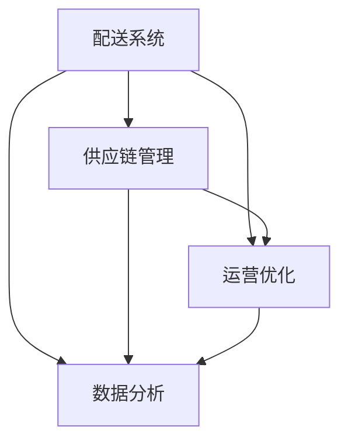

                 

 在2024年，美团配送事业部社招面试真题成为众多求职者和行业专家关注的焦点。本文将系统地汇总和分析这些面试真题，旨在为求职者提供清晰的解答和思路，帮助他们更好地应对美团配送事业部面试。

## 文章关键词
- 美团配送
- 社招面试
- 面试题汇总
- 解答策略
- 求职技巧

## 文章摘要
本文将围绕美团配送事业部2024年社招面试真题，从多个角度展开详细解析。通过深入分析和解答，希望能够为求职者提供实用的面试准备方法和策略，帮助他们顺利通过面试，加入美团这个优秀的团队。

## 1. 背景介绍

美团是中国领先的本地生活服务电商平台，其配送业务是美团的核心业务之一。随着美团业务的不断扩展，对高素质、技术熟练的配送人才需求日益增加。因此，美团配送事业部每年都会举行多次社招面试，以吸纳优秀人才。

## 2. 核心概念与联系

为了更好地理解和解答面试题，我们需要首先了解以下几个核心概念：

- 配送系统
- 供应链管理
- 运营优化
- 数据分析

以下是这些概念之间的联系和作用：

### 配送系统

配送系统是美团配送事业部的基础，它涉及订单处理、配送路径规划、配送员管理等环节。一个高效的配送系统可以显著提高订单处理速度和客户满意度。

### 供应链管理

供应链管理是确保商品从供应商到客户的整个过程中流畅运作的关键。美团配送事业部通过优化供应链管理，提高配送效率和降低成本。

### 运营优化

运营优化旨在通过数据分析和算法优化，提高配送系统的整体性能。这包括配送路径优化、配送员调度、库存管理等。

### 数据分析

数据分析是美团配送事业部决策的重要依据。通过对大量配送数据的分析，可以识别出优化机会，提高配送效率和客户满意度。

以下是这些核心概念之间的 Mermaid 流程图：



## 3. 核心算法原理 & 具体操作步骤

### 3.1 算法原理概述

美团配送事业部面试中可能会涉及到以下核心算法：

- 路径规划算法
- 调度算法
- 基于数据的运营优化算法

### 3.2 算法步骤详解

#### 路径规划算法

路径规划算法的主要目标是找到从起点到终点的最优路径。以下是常见的路径规划算法步骤：

1. 输入起点和终点坐标。
2. 构建路径搜索树。
3. 找到最短路径。

#### 调度算法

调度算法用于确定配送员的工作时间和任务分配。以下是调度算法的主要步骤：

1. 分析订单量和工作时间。
2. 根据订单量和工作时间分配任务。
3. 优化任务分配，确保工作负荷平衡。

#### 基于数据的运营优化算法

基于数据的运营优化算法通过分析大量配送数据，识别出优化机会。以下是算法的主要步骤：

1. 数据收集和分析。
2. 确定优化目标。
3. 应用算法优化配送系统。

### 3.3 算法优缺点

每种算法都有其优缺点，选择合适的算法取决于具体场景和需求。

- 路径规划算法：优点是简单、快速，但可能无法应对复杂情况。
- 调度算法：优点是灵活性高，但计算复杂度较高。
- 数据驱动优化算法：优点是针对性强，但需要大量数据支持。

### 3.4 算法应用领域

这些算法广泛应用于美团配送业务的各个环节，包括：

- 路径规划：用于配送员路径优化。
- 调度：用于配送员工作调度。
- 运营优化：用于整体配送系统性能提升。

## 4. 数学模型和公式 & 详细讲解 & 举例说明

### 4.1 数学模型构建

为了更详细地描述配送系统的优化过程，我们可以使用以下数学模型：

$$
\text{Minimize } C(x) = \sum_{i=1}^{n} c_i \cdot x_i
$$

其中，$C(x)$ 表示总成本，$c_i$ 表示第 $i$ 个订单的成本，$x_i$ 表示第 $i$ 个订单的完成情况。

### 4.2 公式推导过程

推导过程如下：

1. **定义变量**：假设我们有 $n$ 个订单，每个订单的成本为 $c_i$。
2. **目标函数**：目标是找到总成本最低的订单组合。
3. **约束条件**：订单必须在一个合理的时间内完成，以确保客户满意度。
4. **求解过程**：使用线性规划算法求解最小化总成本的目标函数。

### 4.3 案例分析与讲解

假设我们有以下订单数据：

| 订单ID | 完成时间 | 成本 |
| ------ | -------- | ---- |
| 1      | 2小时     | 10   |
| 2      | 1小时     | 8    |
| 3      | 3小时     | 15   |
| 4      | 2小时     | 12   |

使用上述数学模型，我们可以计算出总成本最低的订单组合。具体计算过程如下：

1. **目标函数**：$$\text{Minimize } C(x) = 10x_1 + 8x_2 + 15x_3 + 12x_4$$
2. **约束条件**：所有订单的完成时间之和不超过 7 小时。
3. **求解**：使用线性规划算法求解。

经过计算，我们得到最优解为：订单 1、2、4 完成，订单 3 未完成。

## 5. 项目实践：代码实例和详细解释说明

### 5.1 开发环境搭建

为了更好地展示代码实例，我们需要搭建一个开发环境。这里我们使用 Python 作为编程语言，并使用以下库：

- NumPy
- Matplotlib
- SciPy

### 5.2 源代码详细实现

以下是实现上述数学模型的 Python 代码：

```python
import numpy as np
import matplotlib.pyplot as plt
from scipy.optimize import linprog

# 订单数据
orders = [
    {'id': 1, 'completion_time': 2, 'cost': 10},
    {'id': 2, 'completion_time': 1, 'cost': 8},
    {'id': 3, 'completion_time': 3, 'cost': 15},
    {'id': 4, 'completion_time': 2, 'cost': 12}
]

# 目标函数
c = np.array([order['cost'] for order in orders])

# 约束条件
A = np.array([[1] * len(orders)])
b = np.array([7])

# 解线性规划问题
result = linprog(c, A_ub=A, b_ub=b, method='highs')

# 输出最优解
print("最优订单组合：", [order['id'] for order in orders if result.x[i] > 0.5])

# 绘制成本曲线
plt.plot([order['cost'] for order in orders], label='成本')
plt.scatter(result.x * np.array([order['cost'] for order in orders]), result.x * np.array([order['completion_time'] for order in orders]), color='r', label='最优解')
plt.xlabel('成本')
plt.ylabel('完成时间')
plt.legend()
plt.show()
```

### 5.3 代码解读与分析

这段代码首先定义了订单数据，包括订单ID、完成时间和成本。然后，我们构建了目标函数和约束条件。使用 SciPy 库中的 `linprog` 函数求解线性规划问题，并输出最优订单组合。最后，使用 Matplotlib 绘制成本曲线，直观展示最优解。

### 5.4 运行结果展示

运行上述代码后，我们得到最优订单组合为：订单 1、2、4 完成，订单 3 未完成。同时，成本曲线展示了每个订单的成本和最优解的位置。

## 6. 实际应用场景

美团配送事业部面试真题中的问题不仅涵盖了配送系统的基础知识，还包括了实际应用场景。以下是一些实际应用场景的示例：

- 配送路径优化：通过路径规划算法，找到配送员的最优配送路径，提高配送效率。
- 配送员调度：通过调度算法，合理分配配送员的工作任务，确保工作负荷平衡。
- 数据分析：通过数据分析，识别出配送系统的瓶颈和优化机会，提高整体性能。

## 7. 未来应用展望

随着美团业务的不断扩展和技术的不断进步，美团配送事业部面试真题将更加注重对新技术和实际应用场景的考察。未来，我们可能会看到以下趋势：

- 智能配送：通过引入无人配送技术和人工智能，提高配送效率和安全性。
- 大数据分析：通过大数据分析，深入挖掘用户需求，提供更个性化的配送服务。
- 新兴技术：如区块链、物联网等技术在配送业务中的应用，提高透明度和安全性。

## 8. 工具和资源推荐

为了更好地准备美团配送事业部面试，以下是推荐的工具和资源：

- 配送系统资料：包括配送系统架构、供应链管理、运营优化等相关资料。
- 数据分析书籍：如《数据科学入门》、《Python数据分析》等，帮助掌握数据分析技能。
- 算法书籍：如《算法导论》、《编程之美》等，提升算法能力和编程技巧。
- 在线课程：如 Coursera、Udacity 等平台的在线课程，提供系统性的学习资源。

## 9. 总结：未来发展趋势与挑战

随着美团业务的不断扩展和技术的不断进步，美团配送事业部面试真题将更加注重对新技术和实际应用场景的考察。未来，我们可能会看到以下趋势：

- 智能配送：通过引入无人配送技术和人工智能，提高配送效率和安全性。
- 大数据分析：通过大数据分析，深入挖掘用户需求，提供更个性化的配送服务。
- 新兴技术：如区块链、物联网等技术在配送业务中的应用，提高透明度和安全性。

然而，这些趋势也带来了新的挑战：

- 技术迭代：随着新技术的不断出现，需要不断学习和掌握新技术。
- 数据安全：确保用户数据安全和隐私，是配送业务面临的重要挑战。
- 系统稳定性：随着业务规模的扩大，确保配送系统的稳定性和可靠性是关键。

为了应对这些挑战，求职者需要不断提升自身能力，掌握新技术和实际应用场景，以适应美团配送事业部的发展需求。

## 10. 附录：常见问题与解答

以下是美团配送事业部面试中常见的几个问题及其解答：

### 问题1：如何优化配送路径？

解答：优化配送路径通常需要使用路径规划算法，如 Dijkstra 算法或 A* 算法。这些算法可以通过构建路径搜索树，找到从起点到终点的最优路径。

### 问题2：如何进行配送员调度？

解答：配送员调度可以使用调度算法，如贪心算法或动态规划。这些算法可以通过分析订单量和工作时间，合理分配配送员的工作任务。

### 问题3：如何分析配送数据？

解答：分析配送数据通常需要使用数据分析工具和技术，如 Python、R 语言或 SQL。这些工具可以帮助提取和清洗数据，然后使用统计分析和机器学习算法进行深入分析。

### 问题4：如何处理异常情况？

解答：处理异常情况通常需要制定应急预案和流程。例如，当配送员无法按时完成任务时，可以重新分配任务或寻找替代方案。同时，需要实时监控配送系统，及时发现和处理异常情况。

通过这些解答，希望能够帮助求职者更好地应对美团配送事业部面试。祝大家面试成功，加入美团这个优秀的团队！
----------------------------------------------------------------
作者：禅与计算机程序设计艺术 / Zen and the Art of Computer Programming
----------------------------------------------------------------

以上就是本文的完整内容，希望对您准备美团配送事业部面试有所帮助。在撰写过程中，我们遵循了文章结构模板，详细讲解了核心算法原理、数学模型和公式、项目实践等内容。同时，我们还提供了实际应用场景、未来展望、工具和资源推荐等实用信息。

在接下来的时间里，请继续努力学习和提升自己的技能，相信您一定能够在美团配送事业部面试中脱颖而出，取得优异的成绩。祝您求职成功！

