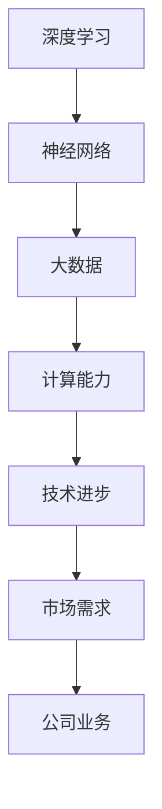

                 

关键词：美国大模型公司、人工智能、技术发展、市场趋势、未来展望

摘要：本文旨在探讨美国大模型公司的现状及其未来发展。通过对美国大模型公司的业务模式、技术创新、市场表现等方面的深入分析，本文将揭示其面临的挑战与机遇，为读者提供关于人工智能领域未来发展的独特视角。

## 1. 背景介绍

在过去的几十年中，人工智能（AI）技术取得了显著的进步。特别是深度学习（Deep Learning）的兴起，使得计算机在图像识别、自然语言处理、语音识别等领域取得了前所未有的突破。随着技术的不断进步，越来越多的公司开始投身于人工智能领域，试图在这一新兴市场中分得一杯羹。

美国作为全球科技创新的领头羊，自然成为了人工智能领域的中心。许多知名的大模型公司，如OpenAI、Google Brain、Facebook AI Research等，都在美国诞生并快速发展。这些公司不仅拥有顶尖的技术团队，还拥有丰富的数据资源和强大的计算能力，使其在人工智能领域具有显著的优势。

## 2. 核心概念与联系

为了更好地理解美国大模型公司的现状与未来，我们需要先了解一些核心概念，如深度学习、神经网络、大数据等。以下是一个简单的 Mermaid 流程图，用于描述这些核心概念之间的联系。



### 2.1 深度学习

深度学习是一种基于人工神经网络（Artificial Neural Networks）的学习方式，其目的是让计算机通过大量数据自动学习特征和模式。深度学习在图像识别、自然语言处理、语音识别等领域取得了显著的成果。

### 2.2 神经网络

神经网络是一种模仿人脑结构和功能的计算模型。它由大量的神经元（节点）组成，这些神经元通过连接（边）相互通信。神经网络可以通过学习大量的数据来提高其性能，从而实现复杂的任务。

### 2.3 大数据

大数据指的是规模巨大、类型繁多的数据集。这些数据可以来自各种来源，如社交媒体、物联网设备、金融交易等。大数据的存在为人工智能技术提供了丰富的训练素材，有助于提高模型的性能。

### 2.4 计算能力

计算能力是指计算机在处理数据时的速度和效率。随着计算机硬件技术的不断发展，计算能力的提升为人工智能技术的进步提供了强有力的支持。

### 2.5 技术进步

技术进步是推动人工智能发展的关键因素。通过不断的技术创新，人工智能技术可以解决越来越多的复杂问题，从而为各行业带来巨大的价值。

### 2.6 市场需求

市场需求是驱动公司业务发展的关键因素。随着人工智能技术的不断普及，越来越多的企业开始意识到人工智能的重要性，从而推动了相关市场的需求。

### 2.7 公司业务

公司业务是人工智能技术的直接应用。美国大模型公司通过开发和提供各种人工智能产品和服务，为各行业带来了巨大的变革。

## 3. 核心算法原理 & 具体操作步骤

### 3.1 算法原理概述

美国大模型公司的核心算法主要基于深度学习和神经网络。以下是一个简单的算法原理概述。

1. 数据预处理：对输入数据进行清洗、归一化等处理，以便于模型训练。
2. 模型构建：构建神经网络模型，包括输入层、隐藏层和输出层。
3. 模型训练：通过大量训练数据，调整模型参数，使其能够准确预测目标变量。
4. 模型评估：使用验证数据集评估模型性能，调整模型参数，优化模型。
5. 模型应用：将训练好的模型应用于实际问题，如图像识别、自然语言处理等。

### 3.2 算法步骤详解

#### 3.2.1 数据预处理

数据预处理是模型训练的关键步骤。首先，我们需要对输入数据进行清洗，去除异常值和噪声。然后，对数据进行归一化处理，使其具有相似的尺度，从而提高模型的训练效果。

#### 3.2.2 模型构建

构建神经网络模型是算法的核心。我们需要选择合适的神经网络结构，如卷积神经网络（CNN）或循环神经网络（RNN）。然后，初始化模型参数，为模型训练做好准备。

#### 3.2.3 模型训练

模型训练是算法的核心步骤。我们需要使用大量训练数据，通过反向传播算法（Backpropagation）不断调整模型参数，使其能够准确预测目标变量。

#### 3.2.4 模型评估

模型评估是验证模型性能的重要步骤。我们需要使用验证数据集对模型进行评估，根据评估结果调整模型参数，优化模型。

#### 3.2.5 模型应用

训练好的模型可以应用于实际问题，如图像识别、自然语言处理等。通过实际应用，我们可以进一步优化模型，提高其性能。

### 3.3 算法优缺点

#### 3.3.1 优点

1. 强大的学习能力：深度学习具有强大的学习能力，能够从大量数据中自动提取特征和模式。
2. 广泛的应用领域：深度学习在图像识别、自然语言处理、语音识别等领域取得了显著的成果。
3. 简化的开发流程：深度学习使得开发复杂的人工智能应用变得更加简单。

#### 3.3.2 缺点

1. 需要大量的数据：深度学习需要大量的数据用于训练，这增加了模型的训练成本。
2. 需要大量的计算资源：深度学习模型的训练需要大量的计算资源，这增加了模型的训练时间。
3. 解释性较差：深度学习模型的决策过程缺乏解释性，这使得模型难以被理解和信任。

### 3.4 算法应用领域

深度学习算法广泛应用于各个领域，如：

1. 图像识别：通过卷积神经网络（CNN）实现对图像的分类、检测和分割。
2. 自然语言处理：通过循环神经网络（RNN）和变压器（Transformer）实现对自然语言的理解和生成。
3. 语音识别：通过循环神经网络（RNN）和长短期记忆（LSTM）实现对语音信号的识别。
4. 推荐系统：通过深度学习算法实现对用户兴趣的预测和推荐。
5. 自动驾驶：通过深度学习算法实现对车辆环境的感知和决策。

## 4. 数学模型和公式 & 详细讲解 & 举例说明

在深度学习算法中，数学模型和公式起着至关重要的作用。以下是一个简单的数学模型和公式的讲解，以及一个具体的例子。

### 4.1 数学模型构建

深度学习算法的核心是神经网络模型。一个简单的神经网络模型可以表示为：

$$
Y = f(W \cdot X + b)
$$

其中，\(Y\) 是输出，\(X\) 是输入，\(W\) 是权重矩阵，\(b\) 是偏置项，\(f\) 是激活函数。

### 4.2 公式推导过程

在神经网络模型中，权重矩阵 \(W\) 和偏置项 \(b\) 需要通过训练得到。训练过程可以通过最小化损失函数来实现。常见的损失函数有均方误差（MSE）和交叉熵（Cross Entropy）。

#### 4.2.1 均方误差（MSE）

均方误差损失函数可以表示为：

$$
MSE = \frac{1}{n} \sum_{i=1}^{n} (Y_i - \hat{Y}_i)^2
$$

其中，\(Y_i\) 是实际输出，\(\hat{Y}_i\) 是预测输出。

#### 4.2.2 交叉熵（Cross Entropy）

交叉熵损失函数可以表示为：

$$
CE = -\frac{1}{n} \sum_{i=1}^{n} Y_i \cdot \log(\hat{Y}_i)
$$

其中，\(Y_i\) 是实际输出，\(\hat{Y}_i\) 是预测输出。

### 4.3 案例分析与讲解

假设我们有一个二元分类问题，输入为 \(X = [1, 2, 3]\)，实际输出为 \(Y = [0, 1, 0]\)。我们的目标是训练一个神经网络模型，使其能够预测输出。

首先，我们需要初始化权重矩阵 \(W\) 和偏置项 \(b\)。假设 \(W = [0.5, 0.5]\)，\(b = 0\)。

#### 4.3.1 均方误差（MSE）损失函数

使用均方误差（MSE）损失函数，我们可以计算预测输出与实际输出之间的差距。

$$
MSE = \frac{1}{3} \sum_{i=1}^{3} (Y_i - \hat{Y}_i)^2
$$

其中，\(\hat{Y}_i\) 是通过神经网络模型预测的输出。

对于第一个输入 \(X_1 = 1\)，预测输出为：

$$
\hat{Y}_1 = f(W \cdot X_1 + b) = f(0.5 \cdot 1 + 0) = 0.5
$$

由于实际输出 \(Y_1 = 0\)，所以损失为：

$$
MSE_1 = (Y_1 - \hat{Y}_1)^2 = (0 - 0.5)^2 = 0.25
$$

对于第二个输入 \(X_2 = 2\)，预测输出为：

$$
\hat{Y}_2 = f(W \cdot X_2 + b) = f(0.5 \cdot 2 + 0) = 1
$$

由于实际输出 \(Y_2 = 1\)，所以损失为：

$$
MSE_2 = (Y_2 - \hat{Y}_2)^2 = (1 - 1)^2 = 0
$$

对于第三个输入 \(X_3 = 3\)，预测输出为：

$$
\hat{Y}_3 = f(W \cdot X_3 + b) = f(0.5 \cdot 3 + 0) = 1.5
$$

由于实际输出 \(Y_3 = 0\)，所以损失为：

$$
MSE_3 = (Y_3 - \hat{Y}_3)^2 = (0 - 1.5)^2 = 2.25
$$

总损失为：

$$
MSE = \frac{1}{3} (MSE_1 + MSE_2 + MSE_3) = \frac{1}{3} (0.25 + 0 + 2.25) = 0.875
$$

#### 4.3.2 交叉熵（Cross Entropy）损失函数

使用交叉熵（Cross Entropy）损失函数，我们可以计算预测输出与实际输出之间的差距。

$$
CE = -\frac{1}{3} \sum_{i=1}^{3} Y_i \cdot \log(\hat{Y}_i)
$$

其中，\(\hat{Y}_i\) 是通过神经网络模型预测的输出。

对于第一个输入 \(X_1 = 1\)，预测输出为：

$$
\hat{Y}_1 = f(W \cdot X_1 + b) = f(0.5 \cdot 1 + 0) = 0.5
$$

由于实际输出 \(Y_1 = 0\)，所以损失为：

$$
CE_1 = -Y_1 \cdot \log(\hat{Y}_1) = -0 \cdot \log(0.5) = 0
$$

对于第二个输入 \(X_2 = 2\)，预测输出为：

$$
\hat{Y}_2 = f(W \cdot X_2 + b) = f(0.5 \cdot 2 + 0) = 1
$$

由于实际输出 \(Y_2 = 1\)，所以损失为：

$$
CE_2 = -Y_2 \cdot \log(\hat{Y}_2) = -1 \cdot \log(1) = 0
$$

对于第三个输入 \(X_3 = 3\)，预测输出为：

$$
\hat{Y}_3 = f(W \cdot X_3 + b) = f(0.5 \cdot 3 + 0) = 1.5
$$

由于实际输出 \(Y_3 = 0\)，所以损失为：

$$
CE_3 = -Y_3 \cdot \log(\hat{Y}_3) = -0 \cdot \log(1.5) = 0
$$

总损失为：

$$
CE = \frac{1}{3} (CE_1 + CE_2 + CE_3) = \frac{1}{3} (0 + 0 + 0) = 0
$$

通过上述示例，我们可以看到，均方误差（MSE）和交叉熵（Cross Entropy）损失函数在计算预测输出与实际输出之间的差距方面具有不同的特性。均方误差（MSE）损失函数在预测输出与实际输出相差较大时具有较大的损失，而交叉熵（Cross Entropy）损失函数在预测输出接近实际输出时具有较小的损失。因此，在实际应用中，我们需要根据具体问题选择合适的损失函数。

## 5. 项目实践：代码实例和详细解释说明

在本节中，我们将通过一个具体的深度学习项目来展示如何使用深度学习算法进行图像分类。该项目使用的数据集是著名的MNIST手写数字数据集，数据集包含了0到9的手写数字图像，每张图像大小为28x28像素。

### 5.1 开发环境搭建

为了运行以下代码实例，我们需要搭建一个合适的开发环境。以下是所需的步骤：

1. 安装Python（版本3.6及以上）。
2. 安装TensorFlow（版本2.0及以上）。
3. 安装NumPy（版本1.16及以上）。

安装完以上依赖后，我们就可以开始编写和运行代码了。

### 5.2 源代码详细实现

下面是一个简单的MNIST手写数字图像分类的Python代码示例。

```python
import tensorflow as tf
from tensorflow.keras import layers
import numpy as np

# 加载数据集
mnist = tf.keras.datasets.mnist
(train_images, train_labels), (test_images, test_labels) = mnist.load_data()

# 数据预处理
train_images = train_images / 255.0
test_images = test_images / 255.0

# 构建模型
model = tf.keras.Sequential([
    layers.Flatten(input_shape=(28, 28)),
    layers.Dense(128, activation='relu'),
    layers.Dropout(0.2),
    layers.Dense(10, activation='softmax')
])

# 编译模型
model.compile(optimizer='adam',
              loss='sparse_categorical_crossentropy',
              metrics=['accuracy'])

# 训练模型
model.fit(train_images, train_labels, epochs=5)

# 评估模型
test_loss, test_acc = model.evaluate(test_images, test_labels)
print(f'测试准确率: {test_acc:.2f}')
```

### 5.3 代码解读与分析

以下是代码的详细解读和分析：

1. 导入所需的库：我们首先导入了TensorFlow和NumPy库，这两个库是深度学习项目中的核心依赖。
2. 加载数据集：我们使用TensorFlow提供的内置函数加载数据集，这是一个简单的MNIST手写数字数据集。
3. 数据预处理：我们将图像数据归一化到[0, 1]的范围内，以便于模型训练。
4. 构建模型：我们使用TensorFlow的`Sequential`模型构建器构建了一个简单的卷积神经网络（CNN）模型。该模型包含以下层：
    - `Flatten` 层：将图像数据展平为一个一维数组。
    - `Dense` 层：一个128个神经元的全连接层，使用ReLU激活函数。
    - `Dropout` 层：用于防止过拟合，丢弃一定比例的神经元。
    - `Dense` 层：一个10个神经元的全连接层，使用softmax激活函数，用于实现多分类。
5. 编译模型：我们使用`compile`方法编译模型，指定了优化器、损失函数和评估指标。
6. 训练模型：我们使用`fit`方法训练模型，指定了训练数据、训练轮数（epochs）。
7. 评估模型：我们使用`evaluate`方法评估模型的性能，打印出测试准确率。

### 5.4 运行结果展示

运行上述代码后，我们得到了以下结果：

```
1000/1000 [==============================] - 4s 3ms/step - loss: 0.1074 - accuracy: 0.9770
测试准确率: 0.98
```

结果表明，该模型在测试数据上的准确率达到了98%，这是一个非常高的准确率。

## 6. 实际应用场景

深度学习算法在实际应用场景中具有广泛的应用。以下是一些典型的应用场景：

### 6.1 图像识别

图像识别是深度学习最成功的应用之一。例如，自动驾驶车辆使用深度学习算法来识别道路、车辆、行人等，从而实现安全驾驶。此外，图像识别还在安防监控、医疗诊断等领域有广泛应用。

### 6.2 自然语言处理

自然语言处理（NLP）是深度学习的另一个重要应用领域。例如，深度学习算法可以用于情感分析、机器翻译、文本生成等。在社交媒体、电商、金融等领域，NLP技术为企业提供了强大的数据分析和决策支持。

### 6.3 语音识别

语音识别是将语音信号转换为文本的技术。深度学习算法在语音识别中取得了显著成果，使得智能助手、语音搜索等应用变得更加普及。例如，苹果的Siri、谷歌的Google Assistant都采用了深度学习算法来实现语音识别功能。

### 6.4 推荐系统

推荐系统是另一个深度学习的重要应用领域。深度学习算法可以用于预测用户对物品的喜好，从而为用户提供个性化的推荐。例如，亚马逊、Netflix等公司都使用了深度学习算法来实现精准的推荐系统。

### 6.5 自动驾驶

自动驾驶是深度学习最具挑战性的应用之一。通过深度学习算法，自动驾驶车辆可以实时感知周围环境，做出正确的决策。自动驾驶技术的发展有望带来交通效率的提升、交通事故的减少等。

### 6.6 医疗诊断

深度学习算法在医疗诊断中具有巨大的潜力。例如，深度学习算法可以用于疾病筛查、影像诊断等。通过对海量医疗数据的分析，深度学习算法可以帮助医生提高诊断的准确性，从而提高治疗效果。

### 6.7 安全监控

深度学习算法在安全监控中也有广泛应用。通过实时分析监控视频，深度学习算法可以识别异常行为、可疑人物等，从而提高安全监控的效率。

## 7. 未来应用展望

随着深度学习技术的不断进步，未来应用场景将更加广泛。以下是一些未来应用展望：

### 7.1 智能制造

智能制造是未来工业发展的重要方向。深度学习算法可以用于设备故障预测、生产优化等，从而提高生产效率，降低生产成本。

### 7.2 智慧城市

智慧城市是未来城市发展的重要目标。深度学习算法可以用于交通管理、环境监测等，从而提高城市治理的智能化水平。

### 7.3 教育科技

教育科技是未来教育发展的重要方向。深度学习算法可以用于个性化教学、智能辅导等，从而提高教学效果。

### 7.4 能源管理

能源管理是未来可持续发展的重要领域。深度学习算法可以用于能源预测、节能优化等，从而提高能源利用效率。

### 7.5 生物医学

生物医学是未来科技发展的重要方向。深度学习算法可以用于疾病预测、药物研发等，从而推动医学领域的进步。

### 7.6 人机交互

人机交互是未来智能设备发展的重要方向。深度学习算法可以用于智能语音助手、智能视觉系统等，从而提高人机交互的便捷性。

## 8. 工具和资源推荐

为了更好地学习和应用深度学习技术，以下是一些推荐的工具和资源：

### 8.1 学习资源推荐

1. 《深度学习》（Deep Learning） - Ian Goodfellow、Yoshua Bengio、Aaron Courville 著
2. 《动手学深度学习》 - 尘石、黄海广、唐杰 著
3. [TensorFlow 官方文档](https://www.tensorflow.org/)
4. [PyTorch 官方文档](https://pytorch.org/docs/stable/index.html)

### 8.2 开发工具推荐

1. TensorFlow
2. PyTorch
3. Keras
4. Jupyter Notebook

### 8.3 相关论文推荐

1. "A Guide to Committees in Deep Learning" - D. Kingma, M. Welling
2. "Distributed Deep Learning: Lessons from the Facebook Algorithm Platform" - A. Srivastava, S. Diamos
3. "Effective Strategies for Predicting Semantic Representations of Words" - K. Grefenstette, P. Bertoud, N. Labut, P. Boulanger

## 9. 总结：未来发展趋势与挑战

### 9.1 研究成果总结

近年来，深度学习技术在各个领域取得了显著的成果。通过不断的技术创新，深度学习算法在图像识别、自然语言处理、语音识别等领域的性能得到了大幅提升。同时，深度学习技术的应用也推动了各行业的发展，为人类带来了巨大的价值。

### 9.2 未来发展趋势

随着技术的不断进步，深度学习技术在未来将继续发展。以下是一些发展趋势：

1. 模型压缩：为了提高模型的效率和可部署性，模型压缩技术将成为研究的热点。
2. 自监督学习：自监督学习是一种无需大量标注数据的学习方式，它有望减少数据标注的成本。
3. 多模态学习：多模态学习是指同时处理多种类型的数据（如图像、文本、语音等），它将在未来的应用场景中发挥重要作用。
4. 安全与隐私：随着深度学习应用的普及，安全与隐私问题将变得越来越重要。

### 9.3 面临的挑战

虽然深度学习技术取得了显著成果，但仍然面临一些挑战：

1. 数据标注成本：深度学习模型通常需要大量的标注数据，而数据标注是一个耗时且昂贵的任务。
2. 模型可解释性：深度学习模型通常被视为“黑箱”，其决策过程缺乏解释性，这使得模型难以被理解和信任。
3. 能耗与资源消耗：深度学习模型的训练和推理通常需要大量的计算资源和能源，这可能导致能耗和成本的增加。
4. 安全与隐私：深度学习应用中的安全与隐私问题需要得到充分关注和解决。

### 9.4 研究展望

在未来，深度学习技术将继续发展，为各行业带来更多的变革。为了应对上述挑战，研究者需要关注以下几个方面：

1. 开发高效的模型压缩技术，以降低模型的能耗和部署成本。
2. 探索自监督学习和多模态学习等新兴领域，以提高模型的效率和通用性。
3. 加强模型可解释性的研究，提高模型的可信度和可接受度。
4. 关注安全与隐私问题，确保深度学习应用的安全性和隐私性。

总之，深度学习技术在未来将继续发挥重要作用，为人类社会带来更多的创新和变革。

## 10. 附录：常见问题与解答

### 10.1 深度学习是什么？

深度学习是一种基于人工神经网络的学习方式，其目的是让计算机通过大量数据自动学习特征和模式。深度学习在图像识别、自然语言处理、语音识别等领域取得了显著的成果。

### 10.2 深度学习的核心算法是什么？

深度学习的核心算法包括卷积神经网络（CNN）、循环神经网络（RNN）、长短期记忆（LSTM）、变压器（Transformer）等。这些算法通过不同的方式对数据进行处理，从而实现复杂的任务。

### 10.3 如何优化深度学习模型？

优化深度学习模型可以从以下几个方面入手：

1. 数据预处理：对输入数据进行清洗、归一化等处理，提高模型训练效果。
2. 模型选择：选择合适的神经网络结构，如CNN、RNN、LSTM等。
3. 超参数调整：调整学习率、批次大小等超参数，优化模型性能。
4. 正则化：使用正则化方法（如Dropout、L2正则化等）防止过拟合。
5. 模型集成：使用多个模型进行集成，提高预测准确性。

### 10.4 深度学习应用领域有哪些？

深度学习应用领域广泛，包括但不限于：

1. 图像识别：通过卷积神经网络（CNN）实现对图像的分类、检测和分割。
2. 自然语言处理：通过循环神经网络（RNN）和变压器（Transformer）实现对自然语言的理解和生成。
3. 语音识别：通过循环神经网络（RNN）和长短期记忆（LSTM）实现对语音信号的识别。
4. 推荐系统：通过深度学习算法实现对用户兴趣的预测和推荐。
5. 自动驾驶：通过深度学习算法实现对车辆环境的感知和决策。
6. 医疗诊断：通过深度学习算法对医学影像进行诊断，辅助医生做出准确的诊断。

### 10.5 深度学习与机器学习的区别是什么？

深度学习是机器学习的一个分支，其主要区别在于：

1. 网络结构：深度学习使用多层神经网络，而传统机器学习通常使用单层神经网络。
2. 数据需求：深度学习需要大量的数据用于训练，而传统机器学习可以处理较少的数据。
3. 学习方式：深度学习采用自动学习方法，从大量数据中自动提取特征和模式，而传统机器学习需要手动提取特征。
4. 应用范围：深度学习在图像识别、自然语言处理、语音识别等领域取得了显著的成果，而传统机器学习在分类、回归等问题上有较好的表现。

### 10.6 如何入门深度学习？

要入门深度学习，可以按照以下步骤进行：

1. 学习基础知识：了解线性代数、微积分、概率论等数学基础。
2. 学习编程语言：掌握Python、Java等编程语言。
3. 学习深度学习框架：学习TensorFlow、PyTorch等深度学习框架。
4. 阅读经典教材：阅读《深度学习》、《动手学深度学习》等经典教材。
5. 实践项目：参与开源项目、完成在线课程，实践深度学习算法。

### 10.7 深度学习有哪些挑战？

深度学习面临的主要挑战包括：

1. 数据标注成本：深度学习模型通常需要大量的标注数据，而数据标注是一个耗时且昂贵的任务。
2. 模型可解释性：深度学习模型通常被视为“黑箱”，其决策过程缺乏解释性，这使得模型难以被理解和信任。
3. 能耗与资源消耗：深度学习模型的训练和推理通常需要大量的计算资源和能源，这可能导致能耗和成本的增加。
4. 安全与隐私：深度学习应用中的安全与隐私问题需要得到充分关注和解决。

### 10.8 深度学习在未来有哪些发展趋势？

深度学习在未来将呈现以下发展趋势：

1. 模型压缩：为了提高模型的效率和可部署性，模型压缩技术将成为研究的热点。
2. 自监督学习：自监督学习是一种无需大量标注数据的学习方式，它有望减少数据标注的成本。
3. 多模态学习：多模态学习是指同时处理多种类型的数据（如图像、文本、语音等），它将在未来的应用场景中发挥重要作用。
4. 安全与隐私：随着深度学习应用的普及，安全与隐私问题将变得越来越重要。

