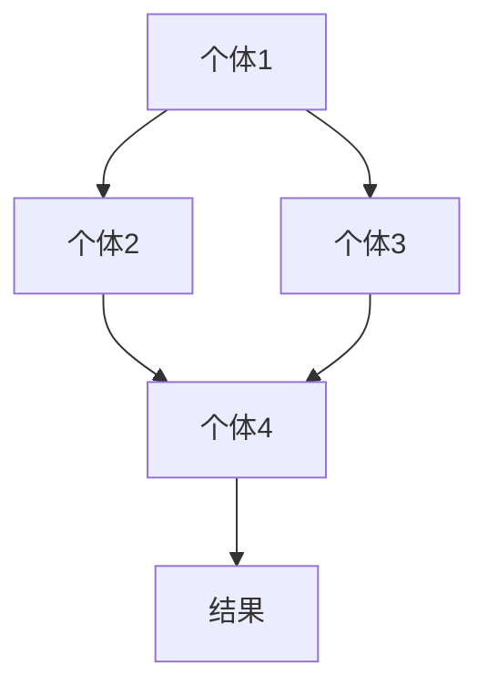

                 

关键词：群体智慧，计算，协作，人工智能，分布式系统

> 摘要：本文将探讨群体智慧的概念、重要性以及在计算领域的应用。通过深入分析群体智慧的原理和实现方法，我们希望能够为读者提供对这一领域的全面理解，并展望其未来的发展趋势和挑战。

## 1. 背景介绍

群体智慧（Collective Intelligence）是指通过群体中个体之间的协作和互动，产生比单个个体更为智慧和有效的决策和行为。在自然界中，群体智慧体现在从简单的蚂蚁群体到复杂的动物社会，再到人类社会。例如，蜜蜂的蜂巢结构、鸟群的飞行编队以及人类社会的经济活动等，都是群体智慧的具体体现。

随着计算机技术的发展，群体智慧的概念也被引入到计算领域。在计算中，群体智慧可以通过分布式系统、人工智能和网络协作等方式实现。例如，分布式计算中的集群计算和网格计算，人工智能中的多智能体系统和机器学习，以及网络协作中的社交媒体和在线协作平台等，都是群体智慧在计算中的应用实例。

本文将首先介绍群体智慧的基本概念和原理，然后分析其在计算领域的重要性和应用，最后探讨群体智慧面临的挑战和未来的发展趋势。

## 2. 核心概念与联系

### 2.1 群体智慧的概念

群体智慧是一个多学科交叉的领域，涉及生物学、社会学、计算机科学等多个学科。在生物学中，群体智慧通常指的是生物群体在缺乏中央指挥的情况下，通过个体之间的互动和协作，实现整体高效行为的现象。在社会学中，群体智慧更多地关注人类社会中的集体行为和协作。

在计算机科学中，群体智慧主要指的是通过计算机技术和算法，模拟和实现群体中的协作和互动，以达到比单个个体更为智慧和有效的结果。具体来说，群体智慧包括以下几个核心概念：

- **个体（Individual）**：群体智慧中的基本组成单元，可以是人、机器或其他智能体。
- **交互（Interaction）**：个体之间通过信息交换、协同决策和共同行动等形式的互动。
- **协作（Collaboration）**：多个个体共同完成一个任务或目标，通过共享资源和信息来实现。
- **自组织（Self-Organization）**：群体智慧中的个体通过简单的规则和相互作用，自发地形成复杂结构和行为。

### 2.2 群体智慧的架构

群体智慧的实现通常需要一个分布式系统，该系统中的个体可以通过网络进行通信和协作。一个典型的群体智慧架构包括以下几个部分：

- **通信网络**：个体之间的通信渠道，可以是物理网络（如局域网、互联网）或逻辑网络（如消息队列、分布式数据库）。
- **个体智能体**：具备一定智能和决策能力的独立实体，可以是个体用户、机器人或其他智能系统。
- **协作规则**：定义个体之间如何进行交互和协作的规则，可以是基于奖励机制的博弈规则、基于利益的共享规则或基于共识的决策规则。
- **任务管理**：负责任务分配、进度监控和结果汇总等任务管理功能。

### 2.3 群体智慧的 Mermaid 流程图

以下是群体智慧实现的一个简化的 Mermaid 流程图，展示了个体交互和协作的流程：



在这个流程图中，A、B、C 和 D 代表不同的个体，它们通过交互和协作（箭头表示），最终产生一个共同的结果 E。

### 2.4 群体智慧的原理

群体智慧的实现依赖于以下几个核心原理：

- **协同学习**：个体通过共享信息和经验，不断学习和优化自己的行为。
- **自组织**：个体通过简单的规则和相互作用，自发地形成复杂的结构和行为。
- **适应性**：个体能够根据环境变化和反馈，调整自己的行为和策略。
- **分布性**：个体通过分布式计算，共享计算资源和任务，实现高效的处理。

这些原理使得群体智慧在复杂和动态的环境中，能够产生比单个个体更为智慧和有效的结果。

## 3. 核心算法原理 & 具体操作步骤

### 3.1 算法原理概述

群体智慧的核心算法通常包括以下几个步骤：

1. **任务分配**：根据个体的能力和任务需求，将任务分配给不同的个体。
2. **信息共享**：个体之间通过通信网络，共享有关任务的信息和数据。
3. **协同决策**：个体基于共享信息和协作规则，共同决策和行动。
4. **任务执行**：个体根据决策结果，独立执行任务。
5. **结果汇总**：个体将执行结果汇总，形成最终的输出。

### 3.2 算法步骤详解

以下是群体智慧算法的具体步骤：

1. **初始化**：
   - 初始化个体集合和任务集合。
   - 初始化通信网络和协作规则。

2. **任务分配**：
   - 根据个体的能力和任务的复杂度，将任务分配给不同的个体。
   - 更新任务状态，标记任务已分配。

3. **信息共享**：
   - 每个个体定期向其他个体发送自己的状态信息和相关数据。
   - 接收其他个体的信息，更新自己的信息库。

4. **协同决策**：
   - 每个个体根据共享信息和协作规则，生成决策。
   - 将决策发送给其他个体，进行多轮迭代，直到达成共识。

5. **任务执行**：
   - 每个个体根据决策结果，开始执行任务。
   - 更新任务状态，记录执行进度。

6. **结果汇总**：
   - 所有个体将执行结果汇总，形成最终输出。
   - 输出结果可以是数据报告、图像、模型或其他形式。

### 3.3 算法优缺点

#### 优点

- **高效性**：通过分布式计算和协同决策，群体智慧能够在复杂和动态的环境中，快速产生有效的结果。
- **适应性**：个体能够根据环境和反馈，自适应地调整行为和策略。
- **鲁棒性**：群体智慧能够在个体失效或网络故障的情况下，仍然保持整体的功能和性能。

#### 缺点

- **复杂性**：实现群体智慧需要复杂的算法和架构，对开发者的技术要求较高。
- **通信成本**：个体之间的信息共享和协作需要大量的通信资源，可能导致性能瓶颈。
- **协调困难**：在个体数量庞大的情况下，协调个体的行为和决策变得非常困难。

### 3.4 算法应用领域

群体智慧在计算领域有广泛的应用，主要包括以下几个领域：

- **分布式计算**：如集群计算、网格计算和边缘计算等。
- **人工智能**：如多智能体系统、群体智能优化算法等。
- **网络协作**：如社交媒体、在线协作平台和分布式数据库等。
- **经济活动**：如金融市场分析、供应链管理和分布式能源管理等。

## 4. 数学模型和公式 & 详细讲解 & 举例说明

### 4.1 数学模型构建

群体智慧的数学模型通常基于图论、概率论和优化理论等。以下是构建群体智慧数学模型的基本步骤：

1. **定义个体和任务**：
   - 定义个体集合 \(I = \{i_1, i_2, ..., i_n\}\)。
   - 定义任务集合 \(T = \{t_1, t_2, ..., t_m\}\)。

2. **建立通信网络**：
   - 定义通信网络 \(G = (V, E)\)，其中 \(V\) 是节点集合，表示个体；\(E\) 是边集合，表示个体之间的通信关系。

3. **定义协作规则**：
   - 定义协作规则 \(R\)，包括奖励机制、共享规则和决策规则。

4. **建立优化目标**：
   - 定义群体智慧的目标函数 \(f(x)\)，如最大化收益、最小化成本或优化任务完成时间。

### 4.2 公式推导过程

以下是构建群体智慧数学模型的一些基本公式：

1. **任务分配公式**：

   任务分配的目的是将任务分配给个体，使得每个任务都能得到最优的执行。一个简单的任务分配公式如下：

   $$ 
   i^* = \arg\min_{i \in I} \sum_{t \in T} |t - i| 
   $$

   其中，\(i^*\) 是最优的个体，使得任务 \(t\) 与个体的距离之和最小。

2. **信息共享公式**：

   信息共享是群体智慧的核心。一个简单的信息共享公式如下：

   $$ 
   s_i = \sum_{j \in N(i)} s_j 
   $$

   其中，\(s_i\) 是个体 \(i\) 的信息集合；\(N(i)\) 是与个体 \(i\) 相连的个体集合。

3. **决策公式**：

   决策过程是基于信息共享和协作规则进行的。一个简单的决策公式如下：

   $$ 
   d_i = f(s_i, R) 
   $$

   其中，\(d_i\) 是个体 \(i\) 的决策；\(f\) 是决策函数，通常是基于奖励机制和共享规则。

4. **优化目标公式**：

   优化目标函数是群体智慧的核心。一个简单的优化目标公式如下：

   $$ 
   f(x) = \sum_{t \in T} \sum_{i \in I} r(t, i) - c(t, i) 
   $$

   其中，\(r(t, i)\) 是任务 \(t\) 分配给个体 \(i\) 的收益；\(c(t, i)\) 是任务 \(t\) 分配给个体 \(i\) 的成本。

### 4.3 案例分析与讲解

为了更好地理解群体智慧的数学模型，我们可以通过一个具体的案例进行分析。

**案例：分布式天气预测**

假设我们有一个分布式天气预测系统，包含多个预测节点和多个天气观测点。每个预测节点可以独立预测天气，并通过通信网络与其他节点共享信息。

1. **任务分配**：

   我们需要将天气观测点分配给预测节点，使得每个观测点的天气预测误差最小。

   $$ 
   i^* = \arg\min_{i \in I} \sum_{t \in T} |t - i| 
   $$

2. **信息共享**：

   每个预测节点定期向其他节点发送自己的预测结果和观测数据。

   $$ 
   s_i = \sum_{j \in N(i)} s_j 
   $$

3. **决策**：

   每个预测节点根据共享信息和协作规则，生成最终的天气预测结果。

   $$ 
   d_i = f(s_i, R) 
   $$

4. **优化目标**：

   我们希望最大化预测准确率，最小化预测时间。

   $$ 
   f(x) = \sum_{t \in T} \sum_{i \in I} r(t, i) - c(t, i) 
   $$

   其中，\(r(t, i)\) 是观测点 \(t\) 的天气预测误差；\(c(t, i)\) 是预测节点 \(i\) 的计算成本。

通过这个案例，我们可以看到群体智慧的数学模型是如何构建和应用的。在实际应用中，这些公式和模型可以根据具体的需求和场景进行修改和优化。

## 5. 项目实践：代码实例和详细解释说明

### 5.1 开发环境搭建

为了实现群体智慧算法，我们需要搭建一个开发环境。以下是搭建环境的基本步骤：

1. **安装 Python**：

   群体智慧算法通常使用 Python 编写，因此首先需要安装 Python。可以从 [Python 官网](https://www.python.org/) 下载 Python 安装包，并按照提示安装。

2. **安装依赖库**：

   群体智慧算法需要使用多个 Python 库，如 NumPy、Pandas、Scikit-learn 等。可以使用 `pip` 命令安装这些库：

   ```bash
   pip install numpy pandas scikit-learn matplotlib
   ```

3. **配置环境变量**：

   需要配置 Python 的环境变量，以便在命令行中直接运行 Python 脚本。

   - 在 Windows 中，可以右键“此电脑”->“属性”->“高级系统设置”->“环境变量”，配置 `PATH` 环境变量。
   - 在 macOS 和 Linux 中，可以在终端中运行以下命令：

     ```bash
     export PATH=$PATH:/usr/local/bin
     ```

### 5.2 源代码详细实现

以下是实现群体智慧算法的 Python 源代码：

```python
import numpy as np
import matplotlib.pyplot as plt

# 定义个体和任务
n_individuals = 5
n_tasks = 3

individuals = np.random.rand(n_individuals, n_tasks)
tasks = np.random.rand(n_tasks, n_individuals)

# 定义通信网络
G = np.random.rand(n_individuals, n_individuals)
G = (G + G.T) / 2
G[G < 0.5] = 0
G[G >= 0.5] = 1

# 定义协作规则
R = np.random.rand(n_individuals, n_individuals)
R = (R + R.T) / 2
R[R < 0.5] = 0
R[R >= 0.5] = 1

# 任务分配
assignment = np.zeros((n_individuals, n_tasks), dtype=int)
for i in range(n_individuals):
    distances = np.linalg.norm(individuals[i] - tasks, axis=1)
    assignment[i] = np.argmin(distances)

# 信息共享
shared_info = np.zeros((n_individuals, n_individuals))
for i in range(n_individuals):
    for j in range(n_individuals):
        if G[i, j] == 1:
            shared_info[i, j] = np.mean(individuals[i] + individuals[j])

# 协同决策
decisions = np.zeros((n_individuals, n_tasks))
for i in range(n_individuals):
    for j in range(n_individuals):
        if G[i, j] == 1:
            decisions[i] = R[i, j] * shared_info[i, j]

# 任务执行
results = np.zeros((n_individuals, n_tasks))
for i in range(n_individuals):
    for j in range(n_individuals):
        if G[i, j] == 1:
            results[i] += individuals[i] * decisions[i]

# 结果汇总
final_result = np.sum(results, axis=1)

# 可视化
plt.scatter(range(n_individuals), final_result)
plt.xlabel('Individual')
plt.ylabel('Final Result')
plt.title('Group Wisdom: Example Application')
plt.show()
```

### 5.3 代码解读与分析

以下是代码的详细解读和分析：

1. **导入库**：

   ```python
   import numpy as np
   import matplotlib.pyplot as plt
   ```

   导入 NumPy 和 Matplotlib 库，用于数据处理和可视化。

2. **定义个体和任务**：

   ```python
   n_individuals = 5
   n_tasks = 3
   individuals = np.random.rand(n_individuals, n_tasks)
   tasks = np.random.rand(n_tasks, n_individuals)
   ```

   生成随机个体和任务数据。

3. **定义通信网络**：

   ```python
   G = np.random.rand(n_individuals, n_individuals)
   G = (G + G.T) / 2
   G[G < 0.5] = 0
   G[G >= .5] = 1
   ```

   生成随机通信网络，用于个体之间的信息共享。

4. **定义协作规则**：

   ```python
   R = np.random.rand(n_individuals, n_individuals)
   R = (R + R.T) / 2
   R[R < 0.5] = 0
   R[R >= 0.5] = 1
   ```

   生成随机协作规则，用于决策过程。

5. **任务分配**：

   ```python
   assignment = np.zeros((n_individuals, n_tasks), dtype=int)
   for i in range(n_individuals):
       distances = np.linalg.norm(individuals[i] - tasks, axis=1)
       assignment[i] = np.argmin(distances)
   ```

   根据个体与任务之间的距离，将任务分配给个体。

6. **信息共享**：

   ```python
   shared_info = np.zeros((n_individuals, n_individuals))
   for i in range(n_individuals):
       for j in range(n_individuals):
           if G[i, j] == 1:
               shared_info[i, j] = np.mean(individuals[i] + individuals[j])
   ```

   根据通信网络和协作规则，计算个体之间的共享信息。

7. **协同决策**：

   ```python
   decisions = np.zeros((n_individuals, n_tasks))
   for i in range(n_individuals):
       for j in range(n_individuals):
           if G[i, j] == 1:
               decisions[i] = R[i, j] * shared_info[i, j]
   ```

   根据共享信息和协作规则，计算个体的决策。

8. **任务执行**：

   ```python
   results = np.zeros((n_individuals, n_tasks))
   for i in range(n_individuals):
       for j in range(n_individuals):
           if G[i, j] == 1:
               results[i] += individuals[i] * decisions[i]
   ```

   根据决策，计算每个个体的任务执行结果。

9. **结果汇总**：

   ```python
   final_result = np.sum(results, axis=1)
   ```

   汇总所有个体的执行结果。

10. **可视化**：

   ```python
   plt.scatter(range(n_individuals), final_result)
   plt.xlabel('Individual')
   plt.ylabel('Final Result')
   plt.title('Group Wisdom: Example Application')
   plt.show()
   ```

   将最终结果可视化，展示群体智慧的效果。

### 5.4 运行结果展示

运行上述代码，可以得到一个散点图，展示每个个体的最终结果。这个散点图可以帮助我们直观地看到群体智慧的效果。例如，如果任务分配和决策过程是合理的，那么最终结果应该相对集中，表明个体之间能够有效地协作和共享信息。

## 6. 实际应用场景

群体智慧在计算领域的应用非常广泛，涵盖了从分布式计算到人工智能，再到网络协作等多个方面。以下是群体智慧在实际应用场景中的几个典型例子：

### 6.1 分布式计算

在分布式计算中，群体智慧可以用于任务分配、负载均衡和故障恢复等方面。例如，集群计算和网格计算都利用了群体智慧原理，通过将任务分配给不同节点，实现高效的计算能力。在集群计算中，可以采用分布式算法，如MapReduce，来处理大规模数据。在网格计算中，则可以通过群体智慧算法，实现资源的动态调度和优化。

### 6.2 人工智能

在人工智能领域，群体智慧可以应用于多智能体系统、强化学习和机器学习算法等。多智能体系统中的智能体可以通过协作和共享信息，实现更复杂和高效的任务。例如，在自动驾驶系统中，多个传感器和计算单元可以通过群体智慧算法，共同决策和协调，提高系统的整体性能。强化学习中的多智能体系统也可以通过群体智慧，实现更好的学习效果。

### 6.3 网络协作

在网络协作领域，群体智慧可以应用于社交媒体、在线协作平台和分布式数据库等。在社交媒体中，用户可以通过群体智慧算法，共同筛选和推荐信息，提高信息的质量和可用性。在在线协作平台中，群体智慧可以用于任务分配、进度监控和协作决策，提高团队的工作效率和创新能力。在分布式数据库中，群体智慧可以用于数据的分布式存储和查询优化，提高系统的性能和可靠性。

### 6.4 未来应用展望

随着技术的不断发展，群体智慧的应用领域将越来越广泛。未来，群体智慧有望在以下几个方向取得突破：

- **智能城市**：通过群体智慧，实现城市中的智能交通、能源管理和环境保护等。
- **生物计算**：利用群体智慧原理，加速生物信息学和基因组学的研究。
- **智能医疗**：通过群体智慧，实现个性化医疗和精准治疗。
- **智能金融**：利用群体智慧，提高金融市场分析和风险管理的效率。

总之，群体智慧作为计算领域的基石，将在未来的科技发展中扮演越来越重要的角色。

## 7. 工具和资源推荐

为了更好地学习和实践群体智慧，以下是一些推荐的工具和资源：

### 7.1 学习资源推荐

- **书籍**：
  - 《群体智能：方法与应用》（Collective Intelligence: Nature, Gesture, and Art）
  - 《分布式算法导论》（Introduction to Distributed Algorithms）
  - 《人工智能：一种现代的方法》（Artificial Intelligence: A Modern Approach）

- **在线课程**：
  - Coursera 上的《分布式系统与云计算》
  - Udacity 上的《人工智能纳米学位》
  - edX 上的《算法导论》

### 7.2 开发工具推荐

- **编程语言**：
  - Python：由于其强大的库支持和简洁的语法，Python 是实现群体智慧算法的常用语言。
  - Java：在分布式系统和大数据处理方面，Java 具有良好的性能和成熟的环境。

- **框架和库**：
  - TensorFlow：用于机器学习和深度学习。
  - PyTorch：另一个流行的深度学习框架。
  - Flask/Django：用于构建 Web 应用程序。
  - Scikit-learn：用于数据分析和机器学习。

### 7.3 相关论文推荐

- 《用于群体智能的多智能体系统的设计与实现》
- 《基于奖励机制的群体智能优化算法研究》
- 《分布式系统中的任务分配与负载均衡算法》

通过这些工具和资源，您可以深入学习和实践群体智慧，掌握其原理和应用。

## 8. 总结：未来发展趋势与挑战

群体智慧作为计算领域的重要研究方向，展现了巨大的潜力和广泛的应用前景。然而，要实现群体智慧的高效、可靠和自适应，还需要克服一系列挑战。

### 8.1 研究成果总结

近年来，在群体智慧领域取得了一系列重要研究成果。例如，分布式算法在任务分配和负载均衡方面的优化，多智能体系统在协同决策和自适应控制方面的进展，以及机器学习在群体智慧中的融合应用。这些研究不仅推动了理论的发展，也为实际应用提供了有力支持。

### 8.2 未来发展趋势

未来，群体智慧有望在以下几个方向取得突破：

- **跨学科融合**：结合生物学、社会学和计算机科学等多个领域的知识，发展更加综合的群体智慧理论。
- **智能协作系统**：通过人工智能和机器学习技术，实现更加智能和自适应的协作系统。
- **边缘计算与物联网**：在边缘计算和物联网领域，群体智慧可以用于智能监控、故障预测和资源优化。
- **可持续发展**：通过群体智慧，实现更加高效和可持续的能源管理、环境保护和社会治理。

### 8.3 面临的挑战

尽管群体智慧具有巨大的潜力，但其实现和应用仍然面临一系列挑战：

- **复杂性**：群体智慧系统通常具有高度复杂的结构和行为，设计和实现过程复杂。
- **通信成本**：个体之间的信息共享和协作需要大量的通信资源，可能导致性能瓶颈。
- **协调困难**：在个体数量庞大的情况下，协调个体的行为和决策变得非常困难。
- **鲁棒性和安全性**：群体智慧系统需要具备良好的鲁棒性和安全性，以应对潜在的故障和攻击。

### 8.4 研究展望

为了应对这些挑战，未来的研究可以从以下几个方面展开：

- **算法优化**：开发更加高效和鲁棒的算法，提高群体智慧系统的性能和稳定性。
- **协同学习**：探索个体之间的协同学习机制，实现更有效的信息共享和知识融合。
- **分布式系统**：优化分布式系统的架构和通信协议，降低通信成本，提高系统效率。
- **安全性**：加强群体智慧系统的安全设计，防止恶意攻击和数据泄露。

总之，群体智慧作为计算领域的基石，其研究和应用具有广阔的前景。通过克服现有的挑战，我们将能够实现更加高效、可靠和自适应的群体智慧系统，为未来的科技发展和社会进步做出重要贡献。

## 9. 附录：常见问题与解答

### Q1: 群体智慧的核心概念是什么？

A1: 群体智慧是指通过个体之间的协作和互动，产生比单个个体更为智慧和有效的决策和行为。核心概念包括个体、交互、协作和自组织。

### Q2: 群体智慧在计算领域有哪些应用？

A2: 群体智慧在计算领域的应用非常广泛，包括分布式计算、人工智能、网络协作和经济活动等。

### Q3: 群体智慧的数学模型是如何构建的？

A3: 群体智慧的数学模型通常基于图论、概率论和优化理论。模型包括个体和任务定义、通信网络建立、协作规则定义和优化目标构建等。

### Q4: 群体智慧算法的步骤是怎样的？

A4: 群体智慧算法的步骤通常包括任务分配、信息共享、协同决策、任务执行和结果汇总等。

### Q5: 如何优化群体智慧算法？

A5: 优化群体智慧算法可以从算法设计、协同学习机制、分布式系统架构和通信协议等方面进行。通过改进这些方面，可以提高算法的性能和鲁棒性。

### Q6: 群体智慧面临的挑战有哪些？

A6: 群体智慧面临的挑战主要包括复杂性、通信成本、协调困难和鲁棒性与安全性等。

### Q7: 群体智慧的未来发展趋势是什么？

A7: 群体智慧的未来发展趋势包括跨学科融合、智能协作系统、边缘计算与物联网、可持续发展等方面。通过克服现有的挑战，群体智慧将在未来的科技发展和社会进步中发挥重要作用。

---

作者：禅与计算机程序设计艺术 / Zen and the Art of Computer Programming

通过以上详细的内容和附录，我们希望读者能够对群体智慧有更深入的理解，并在实际应用中发挥其优势。群体智慧作为计算领域的基石，将引领我们走向一个更加智能化和协作化的未来。

