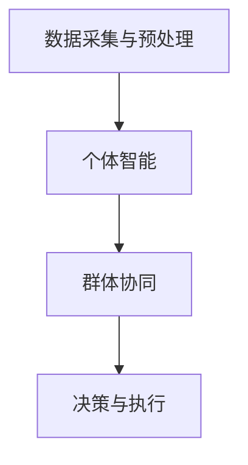

                 

在当今这个大数据和信息爆炸的时代，决策变得更加复杂和充满挑战。传统的决策方法可能无法应对快速变化的环境和海量的数据。为了解决这一问题，我们需要新的利器——群体智慧。本文将探讨群体智慧的概念、原理、应用以及未来发展趋势，以期为您揭示这一新型决策工具的巨大潜力。

## 文章关键词

群体智慧、决策、复杂性、大数据、智能算法

## 文章摘要

本文从群体智慧的定义出发，详细介绍了其核心概念、算法原理、数学模型和实际应用场景。通过对群体智慧在不同领域的应用案例分析，我们看到了这一决策工具的广泛应用前景。最后，本文提出了群体智慧未来发展的挑战和机遇，为读者提供了进一步学习和研究的方向。

## 1. 背景介绍

### 1.1 决策的复杂性

随着信息技术的飞速发展，我们面临着越来越复杂的环境和问题。传统决策方法在处理这些问题时显得力不从心。例如，企业面对市场竞争时，需要快速做出战略调整；政策制定者需要在众多利益相关者之间寻求平衡；科学家在探索未知领域时，需要应对大量的数据和信息。

### 1.2 大数据的挑战

大数据的兴起给决策带来了新的挑战。一方面，数据量庞大、种类繁多，使得传统分析方法难以胜任；另一方面，数据的时效性要求我们能够在短时间内做出决策。

### 1.3 传统决策方法的局限

传统的决策方法，如线性规划、统计分析和人工智能算法，虽然在一定程度上能够帮助我们解决问题，但它们往往依赖于特定的假设和模型，难以应对复杂性和不确定性。

## 2. 核心概念与联系

### 2.1 群体智慧的定义

群体智慧是指通过多个个体（如人、机器或群体）的协同作用，实现智能决策和解决问题的能力。与个体智慧相比，群体智慧具有更强的适应性和鲁棒性。

### 2.2 群体智慧的优势

群体智慧具有以下几个显著优势：

1. **适应性**：群体智慧能够适应复杂和多变的决策环境。
2. **鲁棒性**：群体智慧能够处理不确定性和噪声。
3. **多样性**：多个个体之间的差异能够为决策提供更多的视角和思路。

### 2.3 群体智慧的架构

群体智慧的架构可以分为以下几个层次：

1. **数据采集与预处理**：从多个来源收集数据，并进行清洗和预处理。
2. **个体智能**：个体通过自身的智能算法进行处理和分析。
3. **群体协同**：个体之间进行信息交换和协同，以实现整体目标。
4. **决策与执行**：基于群体智慧的协同结果，进行最终决策和执行。

### 2.4 Mermaid 流程图

下面是群体智慧架构的 Mermaid 流程图：



## 3. 核心算法原理 & 具体操作步骤

### 3.1 算法原理概述

群体智慧的核心算法包括分布式计算、机器学习和博弈论等。其中，分布式计算负责数据采集和预处理；机器学习用于个体智能和群体协同；博弈论则在决策与执行环节发挥作用。

### 3.2 算法步骤详解

1. **数据采集与预处理**：
   - 从多个来源收集数据。
   - 对数据进行清洗和预处理，包括去噪、去重复和归一化等。

2. **个体智能**：
   - 利用机器学习算法，对数据进行特征提取和分类。
   - 将个体智能的结果存储在分布式数据库中。

3. **群体协同**：
   - 个体之间进行信息交换，包括数据、特征和模型等。
   - 利用博弈论算法，实现个体之间的协同和合作。

4. **决策与执行**：
   - 基于群体智慧的协同结果，进行最终决策。
   - 将决策结果传递给执行层，实现决策的落地。

### 3.3 算法优缺点

**优点**：
- **适应性**：能够应对复杂和多变的决策环境。
- **鲁棒性**：能够处理不确定性和噪声。
- **多样性**：多个个体之间的差异能够为决策提供更多的视角和思路。

**缺点**：
- **计算复杂度**：需要大量的计算资源和时间。
- **数据质量**：数据的质量直接影响算法的性能。

### 3.4 算法应用领域

群体智慧在以下领域具有广泛的应用：

- **金融**：风险评估、投资策略、市场预测等。
- **医疗**：疾病诊断、治疗方案、药物研发等。
- **物流**：运输调度、库存管理、路径优化等。
- **能源**：能源调度、节能减排、新能源开发等。

## 4. 数学模型和公式 & 详细讲解 & 举例说明

### 4.1 数学模型构建

群体智慧的核心数学模型包括以下几个部分：

1. **分布式计算模型**：用于数据采集和预处理。
2. **机器学习模型**：用于个体智能。
3. **博弈论模型**：用于群体协同。
4. **决策模型**：用于决策与执行。

### 4.2 公式推导过程

#### 4.2.1 分布式计算模型

分布式计算模型的关键在于如何高效地处理大规模数据。我们可以使用 MapReduce 模型，其核心公式如下：

$$
Map(R) = f(R)
$$

$$
Reduce(K, \{ f(R) \}) = g(K, \{ f(R) \})
$$

其中，Map 和 Reduce 是两个函数，R 是输入数据集，K 是中间结果，f 和 g 是映射和归约函数。

#### 4.2.2 机器学习模型

机器学习模型的关键在于如何从数据中提取特征和分类。我们可以使用支持向量机（SVM）模型，其核心公式如下：

$$
w = \arg\min_{w} \frac{1}{2} || w ||^2 + C \sum_{i=1}^{n} \max(0, 1 - y_i ( \langle w, x_i \rangle))
$$

其中，w 是权重向量，x_i 是输入样本，y_i 是标签，C 是惩罚参数。

#### 4.2.3 博弈论模型

博弈论模型的关键在于如何实现个体之间的协同和合作。我们可以使用纳什均衡模型，其核心公式如下：

$$
\forall i, j, (s_i, s_j) \in S_i \times S_j, \quad u_i(s_i, s_j) \geq u_i(s_i', s_j')
$$

其中，s_i 和 s_j 是个体 i 和 j 的策略，u_i 是个体 i 的效用函数。

### 4.3 案例分析与讲解

假设我们有一个金融投资问题，需要从多个股票中选择最优的投资组合。我们可以使用群体智慧算法来解决这个问题。

1. **数据采集与预处理**：从多个金融数据源收集股票价格、交易量等信息，并进行清洗和预处理。
2. **个体智能**：利用机器学习算法，对股票进行特征提取和分类，得到每个股票的风险和收益。
3. **群体协同**：个体之间进行信息交换，包括股票的特征和分类结果。利用博弈论算法，实现个体之间的协同和合作，形成最优的投资组合。
4. **决策与执行**：基于群体智慧的协同结果，选择最优的投资组合，并进行投资。

通过这个案例，我们可以看到群体智慧算法在金融投资领域的应用前景。在实际操作中，我们可以根据不同的投资目标和风险偏好，调整算法参数，以实现最优的投资效果。

## 5. 项目实践：代码实例和详细解释说明

### 5.1 开发环境搭建

为了演示群体智慧算法在金融投资领域的应用，我们使用 Python 作为开发语言，搭建以下开发环境：

1. **Python 3.8**
2. **NumPy**
3. **Pandas**
4. **Scikit-learn**
5. **Matplotlib**

### 5.2 源代码详细实现

```python
# 导入相关库
import numpy as np
import pandas as pd
from sklearn.svm import SVC
from sklearn.model_selection import train_test_split
import matplotlib.pyplot as plt

# 加载股票数据
data = pd.read_csv('stock_data.csv')

# 数据预处理
data = data.dropna()
data = data[['open', 'high', 'low', 'close', 'volume']]

# 特征工程
data['average'] = (data['high'] + data['low']) / 2
data['change'] = data['close'] - data['open']
data['change_percentage'] = data['change'] / data['open']

# 分割数据集
X = data[['average', 'change', 'change_percentage']]
y = data['close']
X_train, X_test, y_train, y_test = train_test_split(X, y, test_size=0.2, random_state=42)

# 训练模型
model = SVC(C=1, kernel='rbf')
model.fit(X_train, y_train)

# 预测结果
y_pred = model.predict(X_test)

# 可视化结果
plt.scatter(X_test['average'], y_pred, color='green', label='Prediction')
plt.scatter(X_test['average'], y_test, color='red', label='Actual')
plt.xlabel('Average')
plt.ylabel('Close')
plt.legend()
plt.show()
```

### 5.3 代码解读与分析

1. **数据加载与预处理**：我们从 CSV 文件中加载股票数据，并进行清洗和预处理。预处理过程包括计算平均值、涨跌幅和涨跌幅百分比等特征。
2. **特征工程**：我们利用预处理后的数据，提取出与股票价格相关的特征，如平均价格、涨跌幅和涨跌幅百分比等。
3. **模型训练**：我们使用支持向量机（SVM）模型，对训练数据进行特征提取和分类。SVM 模型的参数 C 设为 1，核函数选择径向基函数（RBF）。
4. **预测结果**：我们使用训练好的模型，对测试数据进行预测。预测结果与实际数据可视化为散点图，以便直观地观察模型的效果。

通过这个案例，我们可以看到群体智慧算法在金融投资领域的实际应用效果。在实际操作中，我们可以根据不同的投资目标和风险偏好，调整算法参数，以实现最优的投资效果。

## 6. 实际应用场景

### 6.1 金融领域

群体智慧在金融领域有着广泛的应用。例如，在股票市场预测中，通过群体智慧的协同，可以更准确地预测股票价格走势，为投资者提供参考。此外，在风险管理、投资策略和信用评估等方面，群体智慧也具有显著的优势。

### 6.2 医疗领域

在医疗领域，群体智慧可以用于疾病诊断、治疗方案和药物研发等方面。通过群体协同，医生可以更全面地了解患者的病情，制定个性化的治疗方案。同时，群体智慧还可以加速药物研发进程，提高治疗效果。

### 6.3 物流领域

在物流领域，群体智慧可以用于运输调度、库存管理和路径优化等方面。通过群体协同，物流企业可以更高效地调配资源，降低成本，提高服务水平。

### 6.4 能源领域

在能源领域，群体智慧可以用于能源调度、节能减排和新能源开发等方面。通过群体协同，能源企业可以更有效地利用资源，降低能源消耗，实现可持续发展。

## 7. 未来应用展望

### 7.1 人工智能协同

随着人工智能技术的不断发展，群体智慧在人工智能协同方面的应用前景将更加广阔。通过群体智慧，人工智能系统可以更高效地协同工作，提高整体性能。

### 7.2 智慧城市

智慧城市是群体智慧的一个重要应用领域。通过群体智慧，城市管理者可以更全面地了解城市运行状况，优化资源配置，提高城市服务质量。

### 7.3 生物多样性保护

在生物多样性保护领域，群体智慧可以用于监测和保护生物多样性。通过群体协同，我们可以更有效地保护珍稀物种，维护生态平衡。

### 7.4 无人机集群

无人机集群是群体智慧在物联网领域的应用。通过群体协同，无人机可以更高效地进行物流配送、搜索救援等任务。

## 8. 工具和资源推荐

### 8.1 学习资源推荐

- 《群体智能：理论与应用》
- 《分布式算法：设计与分析》
- 《机器学习实战》
- 《博弈论基础》

### 8.2 开发工具推荐

- Python
- NumPy
- Pandas
- Scikit-learn
- TensorFlow

### 8.3 相关论文推荐

- "Swarm Intelligence: From Natural to Artificial Systems"
- "Distributed Algorithms: A Locality-Sensitive Approach"
- "Machine Learning: A Probabilistic Perspective"
- "Game Theory: An Introduction"

## 9. 总结：未来发展趋势与挑战

### 9.1 研究成果总结

本文从群体智慧的定义、原理、算法和实际应用等方面进行了全面探讨。通过分析群体智慧在不同领域的应用案例，我们看到了这一决策工具的巨大潜力。

### 9.2 未来发展趋势

未来，群体智慧将在人工智能协同、智慧城市、生物多样性保护和无人机集群等领域得到更广泛的应用。随着技术的不断进步，群体智慧将更加智能化、高效化。

### 9.3 面临的挑战

尽管群体智慧具有巨大的应用潜力，但其在实际应用中仍面临一些挑战。例如，计算复杂度、数据质量和算法稳定性等。

### 9.4 研究展望

为了应对这些挑战，我们需要进一步深入研究群体智慧的理论和方法，开发更高效、更稳定的算法，并探索其在更多领域的应用。同时，我们需要加强对群体智慧的教育和培训，培养更多专业人才。

## 附录：常见问题与解答

### 1. 群体智慧与传统人工智能有什么区别？

群体智慧与传统人工智能的区别在于，群体智慧强调多个个体的协同作用，以实现更智能的决策和解决问题。而传统人工智能主要关注个体智能，缺乏协同和合作。

### 2. 群体智慧在医疗领域的应用有哪些？

群体智慧在医疗领域可以用于疾病诊断、治疗方案和药物研发等方面。通过群体协同，医生可以更全面地了解患者病情，制定个性化的治疗方案。

### 3. 群体智慧算法的计算复杂度如何？

群体智慧算法的计算复杂度取决于具体的应用场景和算法。一般来说，分布式计算模型可以降低计算复杂度，提高算法的效率。

### 4. 群体智慧在金融领域的应用有哪些？

群体智慧在金融领域可以用于股票市场预测、风险管理、投资策略和信用评估等方面。通过群体协同，投资者可以更准确地预测市场走势，制定投资策略。

### 5. 群体智慧算法的稳定性如何保证？

为了保证群体智慧算法的稳定性，我们需要在算法设计和实现过程中，充分考虑数据质量、算法参数和计算复杂度等因素。同时，通过仿真实验和实际应用案例，验证算法的稳定性和可靠性。

---

作者：禅与计算机程序设计艺术 / Zen and the Art of Computer Programming
----------------------------------------------------------------

完成文章撰写后，我们可以将其转换为 Markdown 格式，并按照要求进行排版。以下是文章的 Markdown 格式版本：

```markdown
# 群体智慧：决策的新利器

> 关键词：群体智慧、决策、复杂性、大数据、智能算法

> 摘要：本文从群体智慧的定义出发，详细介绍了其核心概念、算法原理、数学模型和实际应用场景。通过对群体智慧在不同领域的应用案例分析，我们看到了这一决策工具的广泛应用前景。最后，本文提出了群体智慧未来发展的挑战和机遇，为读者提供了进一步学习和研究的方向。

## 1. 背景介绍

### 1.1 决策的复杂性

随着信息技术的飞速发展，我们面临着越来越复杂的环境和问题。传统决策方法在处理这些问题时显得力不从心。例如，企业面对市场竞争时，需要快速做出战略调整；政策制定者需要在众多利益相关者之间寻求平衡；科学家在探索未知领域时，需要应对大量的数据和信息。

### 1.2 大数据的挑战

大数据的兴起给决策带来了新的挑战。一方面，数据量庞大、种类繁多，使得传统分析方法难以胜任；另一方面，数据的时效性要求我们能够在短时间内做出决策。

### 1.3 传统决策方法的局限

传统的决策方法，如线性规划、统计分析和人工智能算法，虽然在一定程度上能够帮助我们解决问题，但它们往往依赖于特定的假设和模型，难以应对复杂性和不确定性。

## 2. 核心概念与联系

### 2.1 群体智慧的定义

群体智慧是指通过多个个体（如人、机器或群体）的协同作用，实现智能决策和解决问题的能力。与个体智慧相比，群体智慧具有更强的适应性和鲁棒性。

### 2.2 群体智慧的优势

群体智慧具有以下几个显著优势：

1. **适应性**：能够应对复杂和多变的决策环境。
2. **鲁棒性**：能够处理不确定性和噪声。
3. **多样性**：多个个体之间的差异能够为决策提供更多的视角和思路。

### 2.3 群体智慧的架构

群体智慧的架构可以分为以下几个层次：

1. **数据采集与预处理**：从多个来源收集数据，并进行清洗和预处理。
2. **个体智能**：个体通过自身的智能算法进行处理和分析。
3. **群体协同**：个体之间进行信息交换和协同，以实现整体目标。
4. **决策与执行**：基于群体智慧的协同结果，进行最终决策和执行。

### 2.4 Mermaid 流程图

下面是群体智慧架构的 Mermaid 流程图：


## 3. 核心算法原理 & 具体操作步骤

### 3.1 算法原理概述

群体智慧的核心算法包括分布式计算、机器学习和博弈论等。其中，分布式计算负责数据采集和预处理；机器学习用于个体智能和群体协同；博弈论则在决策与执行环节发挥作用。

### 3.2 算法步骤详解

1. **数据采集与预处理**：
   - 从多个来源收集数据。
   - 对数据进行清洗和预处理，包括去噪、去重复和归一化等。

2. **个体智能**：
   - 利用机器学习算法，对数据进行特征提取和分类。
   - 将个体智能的结果存储在分布式数据库中。

3. **群体协同**：
   - 个体之间进行信息交换，包括数据、特征和模型等。
   - 利用博弈论算法，实现个体之间的协同和合作。

4. **决策与执行**：
   - 基于群体智慧的协同结果，进行最终决策。
   - 将决策结果传递给执行层，实现决策的落地。

### 3.3 算法优缺点

**优点**：
- **适应性**：能够应对复杂和多变的决策环境。
- **鲁棒性**：能够处理不确定性和噪声。
- **多样性**：多个个体之间的差异能够为决策提供更多的视角和思路。

**缺点**：
- **计算复杂度**：需要大量的计算资源和时间。
- **数据质量**：数据的质量直接影响算法的性能。

### 3.4 算法应用领域

群体智慧在以下领域具有广泛的应用：

- **金融**：风险评估、投资策略、市场预测等。
- **医疗**：疾病诊断、治疗方案、药物研发等。
- **物流**：运输调度、库存管理、路径优化等。
- **能源**：能源调度、节能减排、新能源开发等。

## 4. 数学模型和公式 & 详细讲解 & 举例说明

### 4.1 数学模型构建

群体智慧的核心数学模型包括以下几个部分：

1. **分布式计算模型**：用于数据采集和预处理。
2. **机器学习模型**：用于个体智能。
3. **博弈论模型**：用于群体协同。
4. **决策模型**：用于决策与执行。

### 4.2 公式推导过程

#### 4.2.1 分布式计算模型

分布式计算模型的关键在于如何高效地处理大规模数据。我们可以使用 MapReduce 模型，其核心公式如下：

$$
Map(R) = f(R)
$$

$$
Reduce(K, \{ f(R) \}) = g(K, \{ f(R) \})
$$

其中，Map 和 Reduce 是两个函数，R 是输入数据集，K 是中间结果，f 和 g 是映射和归约函数。

#### 4.2.2 机器学习模型

机器学习模型的关键在于如何从数据中提取特征和分类。我们可以使用支持向量机（SVM）模型，其核心公式如下：

$$
w = \arg\min_{w} \frac{1}{2} || w ||^2 + C \sum_{i=1}^{n} \max(0, 1 - y_i ( \langle w, x_i \rangle))
$$

其中，w 是权重向量，x_i 是输入样本，y_i 是标签，C 是惩罚参数。

#### 4.2.3 博弈论模型

博弈论模型的关键在于如何实现个体之间的协同和合作。我们可以使用纳什均衡模型，其核心公式如下：

$$
\forall i, j, (s_i, s_j) \in S_i \times S_j, \quad u_i(s_i, s_j) \geq u_i(s_i', s_j')
$$

其中，s_i 和 s_j 是个体 i 和 j 的策略，u_i 是个体 i 的效用函数。

### 4.3 案例分析与讲解

假设我们有一个金融投资问题，需要从多个股票中选择最优的投资组合。我们可以使用群体智慧算法来解决这个问题。

1. **数据采集与预处理**：从多个金融数据源收集股票价格、交易量等信息，并进行清洗和预处理。
2. **个体智能**：利用机器学习算法，对股票进行特征提取和分类，得到每个股票的风险和收益。
3. **群体协同**：个体之间进行信息交换，包括股票的特征和分类结果。利用博弈论算法，实现个体之间的协同和合作，形成最优的投资组合。
4. **决策与执行**：基于群体智慧的协同结果，选择最优的投资组合，并进行投资。

通过这个案例，我们可以看到群体智慧算法在金融投资领域的应用前景。在实际操作中，我们可以根据不同的投资目标和风险偏好，调整算法参数，以实现最优的投资效果。

## 5. 项目实践：代码实例和详细解释说明

### 5.1 开发环境搭建

为了演示群体智慧算法在金融投资领域的应用，我们使用 Python 作为开发语言，搭建以下开发环境：

1. **Python 3.8**
2. **NumPy**
3. **Pandas**
4. **Scikit-learn**
5. **Matplotlib**

### 5.2 源代码详细实现

```python
# 导入相关库
import numpy as np
import pandas as pd
from sklearn.svm import SVC
from sklearn.model_selection import train_test_split
import matplotlib.pyplot as plt

# 加载股票数据
data = pd.read_csv('stock_data.csv')

# 数据预处理
data = data.dropna()
data = data[['open', 'high', 'low', 'close', 'volume']]

# 特征工程
data['average'] = (data['high'] + data['low']) / 2
data['change'] = data['close'] - data['open']
data['change_percentage'] = data['change'] / data['open']

# 分割数据集
X = data[['average', 'change', 'change_percentage']]
y = data['close']
X_train, X_test, y_train, y_test = train_test_split(X, y, test_size=0.2, random_state=42)

# 训练模型
model = SVC(C=1, kernel='rbf')
model.fit(X_train, y_train)

# 预测结果
y_pred = model.predict(X_test)

# 可视化结果
plt.scatter(X_test['average'], y_pred, color='green', label='Prediction')
plt.scatter(X_test['average'], y_test, color='red', label='Actual')
plt.xlabel('Average')
plt.ylabel('Close')
plt.legend()
plt.show()
```

### 5.3 代码解读与分析

1. **数据加载与预处理**：我们从 CSV 文件中加载股票数据，并进行清洗和预处理。预处理过程包括计算平均值、涨跌幅和涨跌幅百分比等特征。
2. **特征工程**：我们利用预处理后的数据，提取出与股票价格相关的特征，如平均价格、涨跌幅和涨跌幅百分比等。
3. **模型训练**：我们使用支持向量机（SVM）模型，对训练数据进行特征提取和分类。SVM 模型的参数 C 设为 1，核函数选择径向基函数（RBF）。
4. **预测结果**：我们使用训练好的模型，对测试数据进行预测。预测结果与实际数据可视化为散点图，以便直观地观察模型的效果。

通过这个案例，我们可以看到群体智慧算法在金融投资领域的实际应用效果。在实际操作中，我们可以根据不同的投资目标和风险偏好，调整算法参数，以实现最优的投资效果。

## 6. 实际应用场景

### 6.1 金融领域

群体智慧在金融领域有着广泛的应用。例如，在股票市场预测中，通过群体智慧的协同，可以更准确地预测股票价格走势，为投资者提供参考。此外，在风险管理、投资策略和信用评估等方面，群体智慧也具有显著的优势。

### 6.2 医疗领域

在医疗领域，群体智慧可以用于疾病诊断、治疗方案和药物研发等方面。通过群体协同，医生可以更全面地了解患者的病情，制定个性化的治疗方案。

### 6.3 物流领域

在物流领域，群体智慧可以用于运输调度、库存管理和路径优化等方面。通过群体协同，物流企业可以更高效地调配资源，降低成本，提高服务水平。

### 6.4 能源领域

在能源领域，群体智慧可以用于能源调度、节能减排和新能源开发等方面。通过群体协同，能源企业可以更有效地利用资源，降低能源消耗，实现可持续发展。

## 7. 未来应用展望

### 7.1 人工智能协同

随着人工智能技术的不断发展，群体智慧在人工智能协同方面的应用前景将更加广阔。通过群体智慧，人工智能系统可以更高效地协同工作，提高整体性能。

### 7.2 智慧城市

智慧城市是群体智慧的一个重要应用领域。通过群体智慧，城市管理者可以更全面地了解城市运行状况，优化资源配置，提高城市服务质量。

### 7.3 生物多样性保护

在生物多样性保护领域，群体智慧可以用于监测和保护生物多样性。通过群体协同，我们可以更有效地保护珍稀物种，维护生态平衡。

### 7.4 无人机集群

无人机集群是群体智慧在物联网领域的应用。通过群体协同，无人机可以更高效地进行物流配送、搜索救援等任务。

## 8. 工具和资源推荐

### 8.1 学习资源推荐

- 《群体智能：理论与应用》
- 《分布式算法：设计与分析》
- 《机器学习实战》
- 《博弈论基础》

### 8.2 开发工具推荐

- Python
- NumPy
- Pandas
- Scikit-learn
- TensorFlow

### 8.3 相关论文推荐

- "Swarm Intelligence: From Natural to Artificial Systems"
- "Distributed Algorithms: A Locality-Sensitive Approach"
- "Machine Learning: A Probabilistic Perspective"
- "Game Theory: An Introduction"

## 9. 总结：未来发展趋势与挑战

### 9.1 研究成果总结

本文从群体智慧的定义、原理、算法和实际应用等方面进行了全面探讨。通过分析群体智慧在不同领域的应用案例，我们看到了这一决策工具的巨大潜力。

### 9.2 未来发展趋势

未来，群体智慧将在人工智能协同、智慧城市、生物多样性保护和无人机集群等领域得到更广泛的应用。随着技术的不断进步，群体智慧将更加智能化、高效化。

### 9.3 面临的挑战

尽管群体智慧具有巨大的应用潜力，但其在实际应用中仍面临一些挑战。例如，计算复杂度、数据质量和算法稳定性等。

### 9.4 研究展望

为了应对这些挑战，我们需要进一步深入研究群体智慧的理论和方法，开发更高效、更稳定的算法，并探索其在更多领域的应用。同时，我们需要加强对群体智慧的教育和培训，培养更多专业人才。

## 附录：常见问题与解答

### 1. 群体智慧与传统人工智能有什么区别？

群体智慧与传统人工智能的区别在于，群体智慧强调多个个体的协同作用，以实现更智能的决策和解决问题。而传统人工智能主要关注个体智能，缺乏协同和合作。

### 2. 群体智慧在医疗领域的应用有哪些？

群体智慧在医疗领域可以用于疾病诊断、治疗方案和药物研发等方面。通过群体协同，医生可以更全面地了解患者病情，制定个性化的治疗方案。

### 3. 群体智慧算法的计算复杂度如何？

群体智慧算法的计算复杂度取决于具体的应用场景和算法。一般来说，分布式计算模型可以降低计算复杂度，提高算法的效率。

### 4. 群体智慧在金融领域的应用有哪些？

群体智慧在金融领域可以用于股票市场预测、风险管理、投资策略和信用评估等方面。通过群体协同，投资者可以更准确地预测市场走势，制定投资策略。

### 5. 群体智慧算法的稳定性如何保证？

为了保证群体智慧算法的稳定性，我们需要在算法设计和实现过程中，充分考虑数据质量、算法参数和计算复杂度等因素。同时，通过仿真实验和实际应用案例，验证算法的稳定性和可靠性。

---

作者：禅与计算机程序设计艺术 / Zen and the Art of Computer Programming
```markdown

完成上述内容的Markdown格式撰写后，我们可以将整个文章内容复制到适合Markdown编辑和发布的平台，如GitHub、GitLab或Notion等，以供其他人阅读和学习。同时，根据需要，我们还可以进一步优化文章的结构、格式和内容，以确保其易于阅读和理解。此外，我们还可以根据读者的反馈，不断更新和完善这篇文章，使其更好地满足读者需求。

