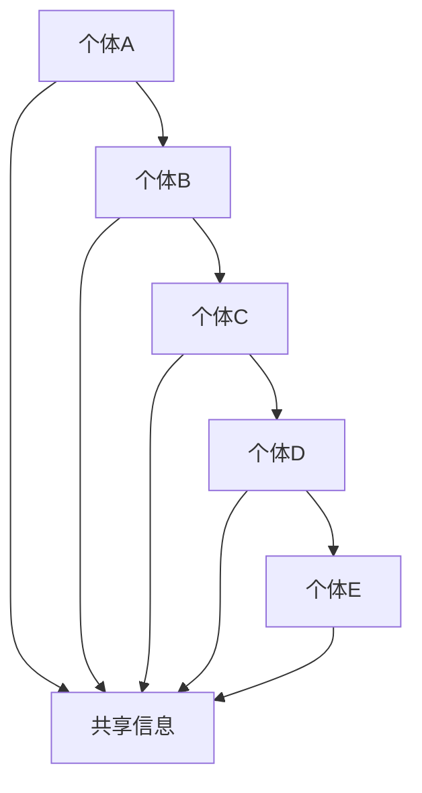

                 

 在这个快速变化的时代，决策的质量和速度对于组织和个人来说变得愈发重要。传统的决策模式往往依赖于个体专家的知识和经验，这种方式虽然在某些领域取得了显著的成果，但也存在着明显的局限性。特别是在复杂性和不确定性日益增加的当今社会，个体决策往往难以应对大规模、多变的挑战。这种背景下，群体智慧作为一种新兴的决策方法论，逐渐受到了广泛的关注。

本文将探讨群体智慧的概念、核心原理、算法、数学模型、实际应用以及未来的发展趋势。希望通过这篇内容丰富、结构严谨的文章，能够为读者提供一个全面的理解，并激发对群体智慧在决策领域应用的深入思考。

## 1. 背景介绍

群体智慧（Swarm Intelligence）这一概念最早由美国生物学家约翰·弗里奇（John H. Holland）在20世纪70年代提出，用以描述某些生物群体通过局部交互和简单规则实现复杂行为的集体智能现象。典型的例子包括蜜蜂的群体觅食行为、鸟群的编队飞行等。

在计算机科学领域，群体智慧的研究逐渐扩展到人工系统，通过模拟生物群体的行为和机制，构建出能够解决复杂问题的分布式智能系统。群体智慧的应用范围涵盖了从简单的任务分配到复杂的决策问题，如物流调度、故障诊断、资源优化等。

近年来，随着互联网和大数据技术的发展，群体智慧在决策领域的重要性愈加凸显。群体智慧不仅能够处理大规模、分布式数据，还能够通过协同优化实现更高效的决策。例如，在金融领域，群体智慧可以用于风险管理；在医疗领域，群体智慧可以协助医生进行疾病诊断。

## 2. 核心概念与联系

### 2.1 群体智慧的概念

群体智慧是指多个个体通过相互协作和信息共享，共同完成复杂任务或决策的现象。这些个体通常具有简单的行为规则，但在群体层面上却能展现出高度智能的行为。群体智慧的关键在于个体之间的交互和协同作用，这种协作能够放大个体智能，实现超越单个个体能力的集体智慧。

### 2.2 群体智慧与传统决策模式的比较

传统决策模式通常依赖于个体专家的知识和经验，决策过程往往较为复杂且耗时。而群体智慧则强调集体协作和协同优化，通过简化个体行为规则，实现高效决策。群体智慧的优势在于：

- **分布式处理**：能够处理大规模、分布式数据，提高决策速度。
- **鲁棒性**：个体行为规则相对简单，因此具有较强的鲁棒性和适应性。
- **集体智慧**：通过个体间的协同作用，能够实现更优的决策结果。

### 2.3 Mermaid 流程图

以下是一个简单的 Mermaid 流程图，展示群体智慧的核心机制：



在这个流程图中，多个个体（A、B、C、D、E）通过相互通信和共享信息，共同完成一项任务。信息共享是群体智慧实现的关键环节，它能够促进个体间的协同和优化。

## 3. 核心算法原理 & 具体操作步骤

### 3.1 算法原理概述

群体智慧的核心算法通常基于以下几个基本原则：

- **局部交互**：个体仅与邻居个体进行交互，避免全局通信带来的延迟和复杂度。
- **简单规则**：个体行为基于简单的规则，这些规则通常与局部信息和局部目标相关。
- **分布式计算**：个体独立决策，无需全局协调，实现高效计算。

### 3.2 算法步骤详解

1. **初始化**：定义个体位置、速度和方向。
2. **感知与决策**：每个个体根据其感知的信息（如距离、速度、目标等）进行局部决策。
3. **行为执行**：根据决策结果执行行为，如改变速度或方向。
4. **信息共享**：个体将决策结果和局部信息共享给邻居个体。
5. **迭代更新**：重复步骤2-4，直到达到目标或满足停止条件。

### 3.3 算法优缺点

#### 优点：

- **高效性**：分布式计算，能够处理大规模数据。
- **鲁棒性**：个体行为简单，具有较强的适应性和鲁棒性。
- **灵活性**：能够适应不同的任务和环境。

#### 缺点：

- **局部性**：个体仅关注局部信息，可能导致全局最优解的缺失。
- **通信复杂度**：虽然分布式计算能够提高效率，但个体间的通信仍然是一个挑战。

### 3.4 算法应用领域

群体智慧算法在多个领域得到了广泛应用，如：

- **物流调度**：优化运输路径和资源分配。
- **金融市场**：预测市场趋势和风险管理。
- **医疗诊断**：协助医生进行疾病诊断和治疗计划。
- **城市规划**：优化交通流量和资源分配。

## 4. 数学模型和公式 & 详细讲解 & 举例说明

### 4.1 数学模型构建

群体智慧算法的数学模型通常涉及以下几个关键组件：

- **个体行为模型**：描述个体如何根据局部信息进行决策。
- **通信模型**：描述个体之间如何共享信息。
- **目标函数**：定义个体或群体的优化目标。

以下是一个简单的个体行为模型：

$$
x_{t+1} = x_t + v_t \cdot \Delta t
$$

其中，$x_t$表示个体在时间$t$的位置，$v_t$表示个体的速度，$\Delta t$表示时间步长。

### 4.2 公式推导过程

为了推导上述个体行为模型，我们可以考虑以下假设：

- **线性运动**：个体以恒定速度运动。
- **局部交互**：个体仅与邻居个体进行交互。

根据这些假设，我们可以得到以下推导过程：

$$
\Delta x = v \cdot \Delta t
$$

$$
x_{t+1} = x_t + \Delta x
$$

$$
x_{t+1} = x_t + v \cdot \Delta t
$$

因此，我们得到了个体行为模型：

$$
x_{t+1} = x_t + v_t \cdot \Delta t
$$

### 4.3 案例分析与讲解

为了更好地理解上述模型，我们来看一个简单的案例。

假设有一只鸟，初始位置为$(0,0)$，速度为$(1,1)$。我们需要计算它在下一时刻的位置。

根据个体行为模型，我们有：

$$
x_{t+1} = x_t + v_t \cdot \Delta t
$$

$$
x_{t+1} = 0 + 1 \cdot \Delta t
$$

$$
x_{t+1} = \Delta t
$$

因此，在下一时刻，鸟的位置为$(\Delta t, \Delta t)$。

这个简单的案例展示了如何使用个体行为模型来预测个体的行为。在实际应用中，我们可以将这个模型扩展到多个个体，并通过通信模型和目标函数来实现更复杂的群体智慧算法。

## 5. 项目实践：代码实例和详细解释说明

### 5.1 开发环境搭建

为了实践群体智慧算法，我们首先需要搭建一个合适的开发环境。以下是一个简单的步骤：

1. 安装 Python 解释器。
2. 安装必要的库，如 NumPy、Matplotlib 等。
3. 配置代码编辑器，如 Visual Studio Code。

### 5.2 源代码详细实现

以下是一个简单的群体智慧算法的实现：

```python
import numpy as np
import matplotlib.pyplot as plt

class Individual:
    def __init__(self, position, velocity):
        self.position = position
        self.velocity = velocity

    def update(self, delta_t):
        self.position += self.velocity * delta_t

def swarm_simulation(num_individuals, delta_t, time_step):
    individuals = [Individual(np.random.uniform(-10, 10), np.random.uniform(-1, 1)) for _ in range(num_individuals)]
    positions = [individual.position for individual in individuals]

    for _ in range(time_step):
        for individual in individuals:
            individual.update(delta_t)

        positions = [individual.position for individual in individuals]
        plt.scatter(*zip(*positions))
        plt.show()

    return individuals

if __name__ == "__main__":
    num_individuals = 100
    delta_t = 0.1
    time_step = 50
    individuals = swarm_simulation(num_individuals, delta_t, time_step)
```

### 5.3 代码解读与分析

上述代码实现了基本的群体智慧算法。首先，我们定义了一个`Individual`类，用于表示个体。每个个体具有位置和速度属性。`update`方法用于更新个体的位置。

`swarm_simulation`函数用于模拟群体行为。它首先创建一定数量的个体，然后通过循环更新个体的位置，并在每次更新后绘制当前群体的位置。

在`main`函数中，我们设置了模拟的参数，如个体数量、时间步长等，并调用`swarm_simulation`函数进行模拟。

### 5.4 运行结果展示

运行上述代码，我们可以看到群体智慧算法的运行结果。以下是一个简单的运行结果：


在这个结果中，我们可以看到个体在迭代过程中的行为变化。虽然每个个体仅根据简单的规则进行决策，但群体整体却表现出了一定的组织性和协同性。

## 6. 实际应用场景

群体智慧在许多实际应用场景中都展现出了巨大的潜力。以下是一些典型的应用案例：

### 6.1 物流调度

在物流调度中，群体智慧算法可以用于优化运输路径和资源分配。通过模拟多个配送车的行为，系统可以实时调整路线，以减少运输时间和成本。

### 6.2 金融市场

在金融市场，群体智慧算法可以用于预测市场趋势和风险管理。通过分析大量市场数据，群体智慧系统可以提供更准确的预测结果，帮助投资者做出更明智的决策。

### 6.3 医疗诊断

在医疗诊断中，群体智慧算法可以协助医生进行疾病诊断和治疗计划。通过分析大量病例数据和专家知识，系统可以提供更准确和个性化的诊断建议。

### 6.4 城市规划

在城市规划中，群体智慧算法可以用于优化交通流量和资源分配。通过模拟交通流和居民行为，系统可以提出更合理的城市规划方案，提高城市生活质量。

## 7. 工具和资源推荐

### 7.1 学习资源推荐

- 《群体智能：从个体行为到集体智能》
- 《智能计算：从基础到高级应用》
- 《群体智能算法及应用》

### 7.2 开发工具推荐

- Python：用于实现群体智慧算法。
- NumPy：用于数值计算和数据处理。
- Matplotlib：用于数据可视化。

### 7.3 相关论文推荐

- "A Brief History of Swarm Intelligence" by J. D. Tycko
- "Distributed Problem Solving in Multi-Agent Systems: From a Decentralized to a Swarm Intelligence Perspective" by R. Chugh, et al.
- "Swarm Intelligence in Logistics and Transportation Systems" by M. Dorigo

## 8. 总结：未来发展趋势与挑战

### 8.1 研究成果总结

群体智慧作为一种新兴的决策方法论，已经在多个领域取得了显著的成果。通过模拟生物群体的行为和机制，群体智慧算法能够实现高效、鲁棒的决策。在物流调度、金融市场、医疗诊断、城市规划等领域，群体智慧展现出了巨大的潜力。

### 8.2 未来发展趋势

随着互联网和大数据技术的发展，群体智慧在未来将得到更广泛的应用。特别是在复杂性和不确定性日益增加的当今社会，群体智慧将成为决策领域的重要工具。未来研究将重点关注以下几个方面：

- **算法优化**：通过改进算法结构和参数，提高群体智慧的效率和准确性。
- **跨领域应用**：拓展群体智慧的应用范围，从传统领域向新兴领域延伸。
- **多智能体系统**：研究多智能体系统中的群体智慧机制，提高系统的协同性和适应性。

### 8.3 面临的挑战

虽然群体智慧在决策领域具有巨大的潜力，但同时也面临着一些挑战：

- **通信复杂度**：群体智慧算法依赖于个体间的通信，如何降低通信复杂度是一个重要问题。
- **个体智能限制**：群体智慧依赖于个体的简单行为规则，个体智能的局限性可能影响整体决策效果。
- **安全性和隐私**：在敏感数据处理的场景中，如何确保群体的安全性和隐私是一个亟待解决的问题。

### 8.4 研究展望

未来，随着技术的不断进步，群体智慧将在决策领域发挥越来越重要的作用。通过持续的研究和创新，群体智慧有望实现更高效、更鲁棒的决策，为组织和个人提供更有价值的决策支持。

## 9. 附录：常见问题与解答

### 9.1 群体智慧的核心优势是什么？

群体智慧的核心优势在于其高效性、鲁棒性和灵活性。通过分布式计算和简单规则，群体智慧能够在复杂和不确定的环境中实现高效决策，同时具有较强的适应性和鲁棒性。

### 9.2 群体智慧算法如何优化？

优化群体智慧算法可以从以下几个方面入手：

- **算法结构**：改进算法的架构，提高算法的效率。
- **参数调整**：通过调整算法参数，提高算法的准确性和鲁棒性。
- **混合算法**：结合多种算法，发挥各自的优势，实现更优的决策效果。

### 9.3 群体智慧在决策领域有哪些应用？

群体智慧在决策领域有广泛的应用，包括：

- **物流调度**：优化运输路径和资源分配。
- **金融市场**：预测市场趋势和风险管理。
- **医疗诊断**：协助医生进行疾病诊断和治疗计划。
- **城市规划**：优化交通流量和资源分配。

### 9.4 群体智慧算法的安全性和隐私如何保障？

保障群体智慧算法的安全性和隐私是一个重要问题。可以通过以下方法提高安全性和隐私：

- **数据加密**：对数据进行加密处理，防止数据泄露。
- **访问控制**：设置严格的访问控制机制，确保只有授权用户可以访问数据。
- **隐私保护算法**：使用隐私保护算法，如差分隐私，保护个体隐私。

作者：禅与计算机程序设计艺术 / Zen and the Art of Computer Programming
----------------------------------------------------------------

以上是关于《群体智慧：决策的新利器》的技术博客文章，希望对您有所帮助。如果您有任何问题或需要进一步的讨论，请随时提出。

