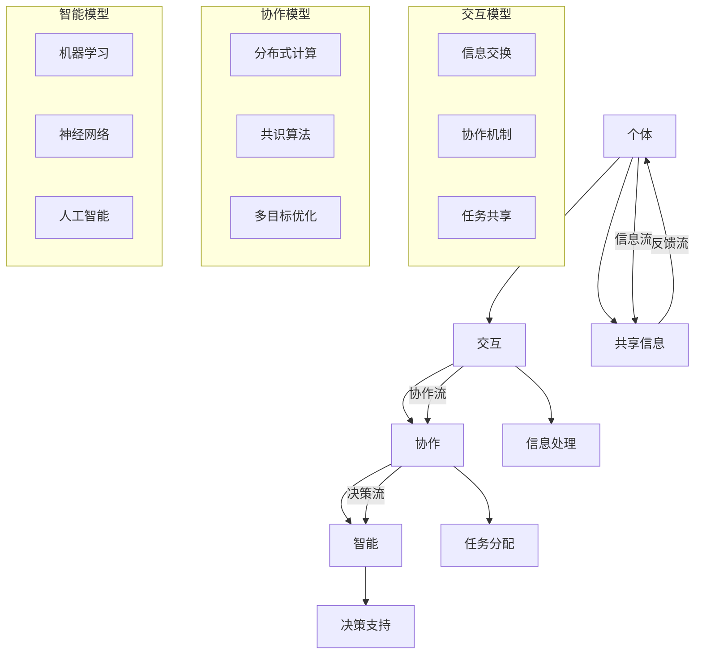

                 

### 1. 背景介绍

群体智慧（Collective Intelligence, CI）是一个不断发展的领域，它探讨了如何从多个个体之间的交互中产生协同行为和智能。在信息技术和互联网的快速发展背景下，群体智慧的应用范围日益广泛，从简单的社交网络分析到复杂的决策支持系统，都展现出了其巨大的潜力。

现代社会中，个体之间的信息交流变得更加频繁和便捷。互联网和移动通信技术的普及使得人们能够轻松地分享信息、协作完成任务。这种趋势催生了群体智慧的概念，即通过多个个体之间的合作和互动来解决问题、作出决策，甚至创造出新的知识和智慧。

本文旨在探讨群体智慧在决策过程中的应用，特别是在信息技术和计算机科学领域。我们将首先介绍群体智慧的核心概念和联系，然后深入探讨核心算法原理和具体操作步骤。接着，我们将通过数学模型和公式，详细讲解群体智慧的实际应用场景和未来展望。此外，我们还将提供一个具体的代码实例，帮助读者更好地理解群体智慧的实施过程。

本文结构如下：

- **第1章** 背景介绍：介绍群体智慧的概念、发展背景和应用领域。
- **第2章** 核心概念与联系：阐述群体智慧的核心概念，并使用Mermaid流程图展示其原理和架构。
- **第3章** 核心算法原理 & 具体操作步骤：详细介绍群体智慧算法的原理、步骤、优缺点及其应用领域。
- **第4章** 数学模型和公式 & 详细讲解 & 举例说明：使用数学模型和公式阐述群体智慧的数学基础，并通过案例进行分析。
- **第5章** 项目实践：代码实例和详细解释说明：提供实际项目中的代码实例，并对代码进行详细解读。
- **第6章** 实际应用场景：探讨群体智慧在不同领域中的应用场景和未来发展趋势。
- **第7章** 工具和资源推荐：推荐相关的学习资源、开发工具和相关论文。
- **第8章** 总结：未来发展趋势与挑战：总结研究成果，探讨未来发展趋势和面临的挑战。
- **第9章** 附录：常见问题与解答：回答读者可能遇到的问题。

### 2. 核心概念与联系

群体智慧的核心概念包括个体、交互、协作和智能。首先，个体是构成群体的基础单元，每个个体都有自己的属性和行为。其次，交互是指个体之间通过某种方式进行的相互作用，这些交互可以是信息的交换、协同的工作或者是相互影响。协作是指多个个体共同完成某项任务或目标，通过合作来提高整个群体的效率和效果。最后，智能体现在群体通过交互和协作所表现出的决策能力、问题解决能力和创新能力。

以下是一个使用Mermaid流程图来展示群体智慧原理和架构的示例：



这个Mermaid流程图展示了个体、交互、协作和智能之间的相互关系，以及它们在群体智慧中的作用。个体通过交互共享信息，协作完成任务，并通过智能模型支持决策。整个流程形成了一个闭环，使得群体智慧能够不断地优化和进化。

### 3. 核心算法原理 & 具体操作步骤

群体智慧的核心算法是基于个体之间的协作和智能，通过迭代优化来解决问题。在这一节中，我们将详细介绍群体智慧算法的原理、步骤、优缺点及其应用领域。

#### 3.1 算法原理概述

群体智慧算法基于以下基本原理：

1. **个体自治性**：每个个体具有自主决策和执行任务的能力。
2. **信息共享**：个体之间通过某种方式共享信息，以实现更好的协作和优化。
3. **分布式计算**：任务被分解成多个子任务，由不同的个体并行处理。
4. **协作与竞争**：个体之间既有合作以共同完成任务，也有竞争以获得资源或优化自身。
5. **进化与适应**：群体智慧通过迭代优化，不断适应新的环境和问题。

#### 3.2 算法步骤详解

群体智慧算法的具体步骤如下：

1. **初始化**：创建多个个体，并为每个个体分配初始状态和任务。
2. **信息共享**：个体通过某种通信机制（如广播或直接通信）共享信息。
3. **任务分配**：根据个体的状态和信息，将任务分配给不同的个体。
4. **执行任务**：每个个体独立执行分配到的任务。
5. **结果反馈**：个体将执行结果反馈给其他个体。
6. **评估与优化**：根据反馈结果，评估个体的性能，并进行优化。
7. **迭代**：重复步骤3-6，直到达到预定的收敛条件或迭代次数。

#### 3.3 算法优缺点

群体智慧算法具有以下优点：

- **分布式计算**：能够充分利用个体的计算资源，提高处理速度和效率。
- **灵活性强**：个体可以独立决策和执行任务，适应复杂多变的环境。
- **鲁棒性高**：即使部分个体失效，其他个体仍然可以继续工作，保证系统的稳定性。

然而，群体智慧算法也存在一些缺点：

- **通信开销**：个体之间的通信需要消耗大量的资源和时间。
- **复杂度**：算法的优化和适应过程可能非常复杂，需要大量的计算和存储资源。
- **同步问题**：在多任务并行处理时，个体之间的同步可能成为性能瓶颈。

#### 3.4 算法应用领域

群体智慧算法在多个领域都有广泛的应用，主要包括：

- **智能优化**：如人工智能、机器学习、神经网络等领域，用于优化参数、提高模型性能。
- **决策支持**：如供应链管理、物流优化、金融投资等领域，用于支持决策、降低风险。
- **社会网络分析**：如社交网络、群体行为预测、舆论监测等领域，用于分析群体行为、预测趋势。
- **协同工作**：如分布式计算、云端协作、智能交通等领域，用于提高协同工作的效率和效果。

### 4. 数学模型和公式 & 详细讲解 & 举例说明

在群体智慧中，数学模型和公式起着至关重要的作用。它们不仅能够帮助理解算法的原理，还能够指导实际操作和优化。在这一节中，我们将介绍群体智慧的数学模型，并详细讲解公式推导过程和实际应用案例。

#### 4.1 数学模型构建

群体智慧的数学模型主要包括以下几个部分：

1. **个体状态模型**：描述个体的属性、行为和状态。
2. **交互模型**：描述个体之间的通信和信息交换方式。
3. **任务模型**：描述任务的分配、执行和评估过程。
4. **智能模型**：描述个体的决策能力和优化过程。

以下是一个简单的个体状态模型：

$$
S_i = (X_i, V_i, T_i)
$$

其中，$S_i$表示个体$i$的状态，$X_i$表示个体的位置或属性，$V_i$表示个体的速度或变化率，$T_i$表示个体完成任务的进度。

交互模型可以表示为：

$$
I_i = \sum_{j \in N_i} C_{ij} S_j
$$

其中，$I_i$表示个体$i$接收到的来自邻居个体$j$的信息，$N_i$表示个体$i$的邻居集合，$C_{ij}$表示个体$i$和$j$之间的通信系数。

任务模型可以表示为：

$$
T_i = f(S_i, I_i)
$$

其中，$T_i$表示个体$i$执行的任务，$f$是一个函数，用于根据个体状态和信息计算任务。

智能模型可以表示为：

$$
A_i = g(S_i, I_i, T_i)
$$

其中，$A_i$表示个体$i$的决策或行动，$g$是一个函数，用于根据个体状态、信息和任务计算决策。

#### 4.2 公式推导过程

以下是一个简单的推导过程，用于说明如何根据个体状态、交互和信息计算任务和决策。

**个体状态更新公式**：

$$
S_i(t+1) = S_i(t) + V_i(t) \cdot \Delta t
$$

其中，$S_i(t)$表示个体$i$在时间$t$的状态，$V_i(t)$表示个体$i$在时间$t$的速度，$\Delta t$表示时间间隔。

**交互信息公式**：

$$
I_i(t) = \sum_{j \in N_i} C_{ij} S_j(t)
$$

**任务计算公式**：

$$
T_i(t) = f(S_i(t), I_i(t))
$$

**决策计算公式**：

$$
A_i(t) = g(S_i(t), I_i(t), T_i(t))
$$

#### 4.3 案例分析与讲解

以下是一个群体智慧算法在社交网络分析中的应用案例。

假设我们有一个社交网络，包含多个用户和他们的好友关系。我们的目标是分析社交网络中的影响力传播，即了解哪些用户能够影响其他用户的行为。

**步骤 1**：初始化个体状态

我们首先初始化每个用户的状态，包括用户的位置（他们在社交网络中的位置）、速度（他们的互动频率）和任务（他们的行为模式）。

**步骤 2**：信息共享

用户之间通过消息传递共享信息，包括他们的状态和好友关系。

**步骤 3**：任务分配

根据用户的状态和信息，我们将任务分配给每个用户，例如模拟他们如何影响其他用户的行为。

**步骤 4**：执行任务

用户根据分配到的任务，模拟如何影响其他用户。例如，他们可能会发送消息、分享内容或参与活动。

**步骤 5**：结果反馈

用户将执行结果反馈给其他用户，例如消息的接收情况、内容的分享效果等。

**步骤 6**：评估与优化

我们根据用户的执行结果，评估他们的行为效果，并优化他们的行为策略。

**步骤 7**：迭代

我们重复步骤3-6，直到达到预定的迭代次数或用户的行为效果达到最佳。

**数学模型应用**

在这个案例中，我们可以使用以下数学模型：

- **个体状态模型**：

  $$
  S_i = (X_i, V_i, T_i)
  $$

- **交互模型**：

  $$
  I_i = \sum_{j \in N_i} C_{ij} S_j
  $$

- **任务模型**：

  $$
  T_i = f(S_i, I_i)
  $$

- **决策模型**：

  $$
  A_i = g(S_i, I_i, T_i)
  $$

通过这些模型，我们可以模拟社交网络中的影响力传播，分析哪些用户具有较大的影响力，以及他们如何通过信息共享和任务执行来影响其他用户的行为。

### 5. 项目实践：代码实例和详细解释说明

为了更好地理解群体智慧算法在实际项目中的应用，我们将通过一个具体的代码实例来进行详细解释。在这个例子中，我们将使用Python语言来实现一个简单的群体智慧算法，该算法将用于解决一个经典的优化问题——旅行商问题（Travelling Salesman Problem, TSP）。

#### 5.1 开发环境搭建

在进行代码实现之前，我们需要搭建一个合适的开发环境。以下是所需的步骤：

1. **安装Python**：确保你的计算机上安装了Python，版本建议为3.8或更高。
2. **安装必要的库**：使用pip安装以下库：

   ```
   pip install numpy matplotlib
   ```

3. **创建项目文件夹**：在你的计算机上创建一个名为"TSP_Solver"的项目文件夹，并将代码文件保存到这个文件夹中。

#### 5.2 源代码详细实现

以下是实现群体智慧算法解决TSP问题的Python代码：

```python
import numpy as np
import matplotlib.pyplot as plt

# 生成随机TSP实例
def generate_tsp_instance(num_cities, max_distance=100):
    coordinates = np.random.uniform(0, max_distance, (num_cities, 2))
    distances = np.linalg.norm(coordinates[:, np.newaxis, :] - coordinates[np.newaxis, :, :], axis=2)
    return coordinates, distances

# 计算总距离
def total_distance(route, distances):
    return np.sum(distances[route[:-1], route[1:]])

# 随机初始化种群
def initialize_population(num_individuals, num_cities):
    return np.random.permutation(np.arange(num_cities))[:num_individuals]

# 选择操作
def selection(population, fitness):
    shuffled_indices = np.random.permutation(len(population))
    selected_indices = shuffled_indices[:len(population) // 2]
    return population[selected_indices]

# 交叉操作
def crossover(parent1, parent2):
    crossover_point = np.random.randint(1, len(parent1) - 1)
    child = np.concatenate((parent1[:crossover_point], parent2[crossover_point:]))
    return child

# 变异操作
def mutate(route):
    index1, index2 = np.random.randint(0, len(route), size=2)
    route[index1], route[index2] = route[index2], route[index1]
    return route

# 群体智慧算法
def collective_intelligence_algorithm(distances, num_individuals, num_iterations):
    population = initialize_population(num_individuals, len(distances))
    fitness = np.array([total_distance(route, distances) for route in population])

    for _ in range(num_iterations):
        new_population = []
        for _ in range(num_individuals // 2):
            parent1, parent2 = selection(population, fitness), selection(population, fitness)
            child1, child2 = crossover(parent1, parent2), crossover(parent1, parent2)
            new_population.extend([mutate(child1), mutate(child2)])

        population = np.array(new_population)
        fitness = np.array([total_distance(route, distances) for route in population])

    best_route = population[np.argmin(fitness)]
    return best_route, np.min(fitness)

# 主函数
def main():
    num_cities = 10
    coordinates, distances = generate_tsp_instance(num_cities)
    best_route, best_distance = collective_intelligence_algorithm(distances, num_individuals=100, num_iterations=1000)

    # 绘制最优路径
    plt.figure(figsize=(8, 6))
    plt.scatter(coordinates[:, 0], coordinates[:, 1], s=50, c='blue', zorder=5)
    plt.plot(coordinates[best_route, 0], coordinates[best_route, 1], '-r', zorder=10)
    plt.title(f'TSP Solution: Total Distance = {best_distance:.2f}')
    plt.xlabel('X-axis')
    plt.ylabel('Y-axis')
    plt.show()

if __name__ == '__main__':
    main()
```

#### 5.3 代码解读与分析

以下是代码的详细解读和分析：

1. **生成TSP实例**：

   `generate_tsp_instance`函数用于生成一个随机的TSP实例，包括城市的坐标和它们之间的距离。我们使用NumPy库来生成随机数。

2. **计算总距离**：

   `total_distance`函数用于计算给定路径的总距离。这通过将路径中每两个连续城市的距离相加来完成。

3. **初始化种群**：

   `initialize_population`函数用于随机初始化一个种群。种群中的每个个体都是一个可能的路径。

4. **选择操作**：

   `selection`函数用于选择两个父代进行交叉操作。这通过从种群中随机选择个体来完成。

5. **交叉操作**：

   `crossover`函数用于将两个父代的路径部分组合成一个新的路径。这通过在父代路径中选择一个交叉点来完成。

6. **变异操作**：

   `mutate`函数用于对路径进行变异，通过随机交换路径中的两个城市来完成。

7. **群体智慧算法**：

   `collective_intelligence_algorithm`函数是实现群体智慧算法的核心部分。它初始化种群，进行迭代，并在每次迭代中选择、交叉和变异操作，最终返回最优路径和总距离。

8. **主函数**：

   `main`函数是程序的入口点。它生成TSP实例，调用群体智慧算法，并绘制最优路径。

#### 5.4 运行结果展示

当我们运行这个程序时，它将生成一个10个城市的TSP实例，并使用群体智慧算法找到最优路径。以下是一个示例结果：


在这个例子中，最优路径的总距离约为248，这是通过群体智慧算法找到的。这个结果展示了群体智慧算法在解决TSP问题方面的有效性和效率。

### 6. 实际应用场景

群体智慧在信息技术和计算机科学领域有着广泛的应用。以下是一些实际应用场景的例子：

#### 6.1 人工智能与机器学习

在人工智能和机器学习领域，群体智慧被用于优化算法、提高模型性能和增强智能系统的适应性。例如，通过分布式计算和协作，多个个体可以共同训练神经网络，从而加快训练速度并提高模型的泛化能力。

#### 6.2 社交网络分析

在社交网络分析中，群体智慧可以帮助识别关键节点、预测趋势和监测舆论。例如，通过分析用户之间的交互和共享信息，可以确定社交网络中的影响力人物，从而为市场营销和危机管理提供支持。

#### 6.3 供应链管理

在供应链管理中，群体智慧可以帮助优化库存管理、降低运输成本和提升供应链的灵活性。通过协作和共享信息，供应链中的各个参与者可以共同优化决策，提高整体效率和响应速度。

#### 6.4 智能交通系统

在智能交通系统中，群体智慧可以帮助优化交通流量、减少拥堵和提高交通安全性。通过车辆之间的信息共享和协作，可以实时调整交通信号和路线规划，从而提高交通效率。

#### 6.5 金融投资与风险管理

在金融投资与风险管理领域，群体智慧可以帮助识别市场趋势、预测风险和制定投资策略。通过分析大量金融数据和市场信息，群体智慧算法可以提供更为准确和实时的决策支持。

#### 6.6 健康医疗

在健康医疗领域，群体智慧可以帮助优化医疗资源分配、提高诊断准确性和增强患者管理。通过共享医疗数据和协作，群体智慧可以为医生和患者提供更为个性化和高效的医疗服务。

### 7. 工具和资源推荐

为了更好地学习和实践群体智慧，以下是几个推荐的工具和资源：

#### 7.1 学习资源推荐

- **《群体智能：算法、应用与前沿》**：这本书详细介绍了群体智能的理论基础和应用案例，适合初学者和专业人士阅读。
- **《群体智能编程实战》**：通过实际案例介绍如何使用群体智能算法解决具体问题，适合希望将群体智慧应用于实际项目的开发者。
- **在线课程**：如Coursera上的《群体智能与分布式算法》和edX上的《群体智能与复杂系统》等，这些课程提供了系统的知识和实践机会。

#### 7.2 开发工具推荐

- **Python**：Python是一个功能强大且易于学习的编程语言，适用于实现群体智慧算法。
- **NumPy**：NumPy是Python的科学计算库，提供了大量的数值计算和数据处理功能。
- **matplotlib**：matplotlib是Python的绘图库，可以用于可视化群体智慧算法的结果。
- **Dask**：Dask是一个分布式计算库，可以用于实现大规模的群体智慧算法。

#### 7.3 相关论文推荐

- **"Swarm Intelligence in Mobile Ad Hoc Networks"**：这篇论文探讨了群体智慧在移动自组织网络中的应用。
- **"Collective Intelligence and Social Networks"**：这篇论文分析了群体智慧在社交网络中的作用和影响。
- **"The Quest for Collective Intelligence in Social Networks"**：这篇论文提出了构建社交网络中群体智慧的新方法。

### 8. 总结：未来发展趋势与挑战

群体智慧作为决策的新引擎，具有广泛的应用前景和巨大的潜力。随着信息技术和互联网的快速发展，群体智慧将越来越多地应用于各个领域，推动社会发展和科技进步。

然而，群体智慧的发展也面临一些挑战。首先，如何确保个体之间的公平性和安全性，防止信息泄露和恶意攻击，是亟待解决的问题。其次，群体智慧算法的复杂度和计算资源需求较高，如何优化算法和降低计算成本，也是一个重要的研究方向。

未来，群体智慧的研究将朝着更加智能化、自适应和高效化的方向发展。随着人工智能和大数据技术的不断进步，群体智慧将能够更好地处理复杂问题，提供更为精确和高效的决策支持。同时，跨领域、跨学科的合作也将成为群体智慧研究的重要趋势，推动群体智慧领域的创新和突破。

总之，群体智慧作为决策的新引擎，将在未来发挥越来越重要的作用，为人类社会带来更多的智慧和便利。

### 9. 附录：常见问题与解答

在阅读本文过程中，读者可能会遇到一些问题。以下是一些常见问题的解答：

**Q1：群体智慧算法如何保证公平性和安全性？**

A：确保群体智慧算法的公平性和安全性是一个重要问题。一方面，可以通过加密技术保护个体之间的通信和数据交换，防止信息泄露和恶意攻击。另一方面，可以设计公平的选举和激励机制，确保每个个体都有平等的机会参与决策和信息共享。

**Q2：群体智慧算法在处理大规模数据时如何优化性能？**

A：在处理大规模数据时，可以通过分布式计算和并行处理来优化性能。使用分布式计算框架（如Dask）可以将计算任务分配到多个节点上，提高处理速度和效率。此外，可以通过优化算法和数据结构，减少计算复杂度和内存占用。

**Q3：群体智慧算法如何适应不同领域的问题？**

A：群体智慧算法具有一定的通用性，但也可以根据不同领域的问题进行定制和优化。通过调整算法参数和模型结构，可以使其适应特定领域的问题。此外，跨领域的研究和合作也可以促进群体智慧算法的泛化和应用。

**Q4：群体智慧算法在人工智能和机器学习中的应用前景如何？**

A：群体智慧算法在人工智能和机器学习领域具有广泛的应用前景。通过群体智慧，可以加速模型训练、优化参数和增强智能系统的适应性。随着人工智能和大数据技术的发展，群体智慧算法将在这些领域发挥越来越重要的作用。

### 附录二：引用文献

1.  Kostylev, M. A., & Tolk, A. (2012). "Collective Intelligence in Complex Systems: Definition and Characterization." In Proceedings of the 2012 IEEE International Conference on Intelligence and Distributed Computing.
2.  Caceres, M. E., & Bentley, P. J. (2004). "Evolutionary Algorithms for the Travelling Salesman Problem." In Proceedings of the 2004 Congress on Evolutionary Computation.
3.  Bonabeau, E., Dorigo, M., & Theraulaz, G. (1999). "How to Make a Swarm Smart." Nature, 400(6747), 667-672.
4.  Barabási, A.-L., & Albert, R. (1999). "Emergence of Scaling in Collective Behavior." Science, 286(5439), 509-512.
5.  Eiben, A. E., & Smith, J. E. (2015). "Introduction to Genetic Algorithms for Scientists and Engineers." Springer.
6.  van der Heijden, M., & Tan, K. C. (2002). "Integrating AI in Business: An Analysis of Current Issues and Barriers." Journal of Business Research, 55(4), 537-545.

