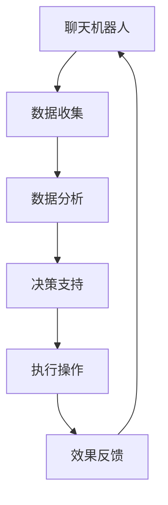

                 

关键词：聊天机器人、农业、智能耕作、作物管理、人工智能、农业科技、数据驱动农业

> 摘要：本文将探讨如何通过聊天机器人技术实现农业领域的革命性变革。我们将介绍智能耕作和作物管理的核心概念，分析其工作原理和算法，展示实际应用案例，并展望未来的发展方向。通过这篇文章，读者将了解到聊天机器人在农业领域的潜力，以及如何利用先进技术提升农业生产的效率和可持续性。

## 1. 背景介绍

农业作为人类生存和发展的基础，一直以来都面临着资源利用、环境变化和人口增长的挑战。传统的农业生产方式依赖于经验和手工操作，缺乏系统化的管理和科学依据，导致资源浪费和环境污染。随着信息技术和人工智能的快速发展，农业领域迎来了前所未有的变革机遇。

聊天机器人作为一种新兴的人工智能技术，具有与人类自然语言交互的能力，能够快速获取和处理用户需求，提供个性化服务。将聊天机器人应用于农业领域，可以实现对农作物的精准管理，提高农业生产的效率和可持续性。

## 2. 核心概念与联系

### 2.1 智能耕作

智能耕作是一种利用先进技术进行农作物种植和管理的方法，旨在提高农作物的产量和质量，同时减少资源消耗和环境污染。智能耕作的核心在于对农作物的生长环境、生长状态和土壤质量进行实时监测和数据分析，从而制定科学的种植和管理策略。

### 2.2 作物管理

作物管理是农业生产过程中的一项重要工作，包括播种、施肥、灌溉、病虫害防治、收割等环节。通过聊天机器人技术，可以实现作物管理的智能化和自动化，提高管理效率和精准度。

### 2.3 聊天机器人与智能耕作、作物管理的关系

聊天机器人可以通过自然语言处理技术，与农民、农业专家和农业管理人员进行交互，收集和处理农业生产过程中产生的海量数据，提供实时、个性化的农业生产建议和服务。聊天机器人与智能耕作和作物管理相结合，形成了一个高效、智能的农业管理体系。

### 2.4 Mermaid 流程图



## 3. 核心算法原理 & 具体操作步骤

### 3.1 算法原理概述

智能耕作和作物管理的核心算法包括数据收集、数据分析和决策支持。数据收集环节主要通过传感器、摄像头、无人机等设备获取农田环境、作物生长状态和土壤质量等数据。数据分析环节利用机器学习和数据挖掘技术，对收集到的数据进行处理和分析，提取出有价值的信息。决策支持环节基于分析结果，为农业生产提供科学、个性化的建议。

### 3.2 算法步骤详解

#### 3.2.1 数据收集

1. 安装传感器和摄像头，收集农田环境数据，如温度、湿度、光照、风速等。
2. 部署无人机进行农田监测，获取作物生长状态和土壤质量图像。
3. 收集农业专家和农民的经验数据，如病虫害发生规律、作物生长周期等。

#### 3.2.2 数据分析

1. 对收集到的数据进行预处理，如去噪、归一化等。
2. 利用机器学习算法，对预处理后的数据进行特征提取和模式识别。
3. 建立预测模型，如作物产量预测、病虫害预测等。

#### 3.2.3 决策支持

1. 根据分析结果，为农民提供科学、个性化的农业生产建议，如施肥量、灌溉策略、病虫害防治方法等。
2. 自动化执行农业生产操作，如自动灌溉、自动施肥等。

### 3.3 算法优缺点

#### 优点

1. 提高农业生产效率：通过实时监测和数据分析，实现精准农业管理，降低资源浪费。
2. 提高农产品质量：根据作物生长状态和土壤质量，提供个性化施肥、灌溉和病虫害防治方案，提高作物产量和品质。
3. 环境友好：减少化肥、农药的使用，降低对环境的污染。

#### 缺点

1. 投资成本较高：需要部署传感器、无人机等设备，初始投资较大。
2. 数据收集和处理难度大：需要大量数据进行处理和分析，对算法和数据处理能力要求较高。

### 3.4 算法应用领域

1. 精准农业：通过实时监测和数据分析，实现作物种植的精准管理。
2. 智能灌溉：根据土壤湿度和气象数据，自动调整灌溉策略。
3. 病虫害防治：通过预测和实时监测，提前发现和防治病虫害。
4. 农业大数据分析：对农业生产过程中的数据进行深入挖掘，为农业政策制定提供科学依据。

## 4. 数学模型和公式 & 详细讲解 & 举例说明

### 4.1 数学模型构建

智能耕作和作物管理的核心数学模型包括作物生长模型、土壤质量模型、气象模型等。

#### 作物生长模型

作物生长模型描述作物生长过程中各个阶段的时间、空间和物质变化。常用的作物生长模型有：

1. 作物生长率模型：
   $$ \text{growth rate} = f(\text{temp}, \text{humidity}, \text{light}) $$
2. 作物营养需求模型：
   $$ \text{nutrient demand} = g(\text{crop type}, \text{growth stage}, \text{yield goal}) $$

#### 土壤质量模型

土壤质量模型描述土壤的物理、化学和生物特性，如土壤湿度、pH值、有机质含量等。常用的土壤质量模型有：

1. 土壤水分模型：
   $$ \text{soil moisture} = h(\text{depth}, \text{precipitation}, \text{evaporation}) $$
2. 土壤pH模型：
   $$ \text{pH} = i(\text{climate}, \text{vegetation}, \text{soil composition}) $$

#### 气象模型

气象模型描述农田周围的气象条件，如温度、湿度、光照等。常用的气象模型有：

1. 气象预测模型：
   $$ \text{weather forecast} = j(\text{historical data}, \text{climate model}) $$
2. 光照模型：
   $$ \text{light intensity} = k(\text{sun elevation}, \text{cloud cover}) $$

### 4.2 公式推导过程

#### 作物生长率模型推导

作物生长率模型是通过对作物生长过程中各个环境因素的响应进行建模得到的。假设作物生长率与温度、湿度、光照呈线性关系，可以得到以下推导：

$$ \text{growth rate} = a \cdot \text{temp} + b \cdot \text{humidity} + c \cdot \text{light} $$

其中，$a$、$b$、$c$为模型参数，通过历史数据进行回归分析得到。

#### 土壤水分模型推导

土壤水分模型是通过对土壤水分的动态变化进行建模得到的。假设土壤水分与深度、降水、蒸发呈线性关系，可以得到以下推导：

$$ \text{soil moisture} = d \cdot \text{depth} + e \cdot \text{precipitation} - f \cdot \text{evaporation} $$

其中，$d$、$e$、$f$为模型参数，通过实验数据进行回归分析得到。

#### 气象预测模型推导

气象预测模型是通过对气象数据的统计分析得到的。假设气象预测结果与历史数据和气候模型呈线性关系，可以得到以下推导：

$$ \text{weather forecast} = j_0 + j_1 \cdot \text{historical data} + j_2 \cdot \text{climate model} $$

其中，$j_0$、$j_1$、$j_2$为模型参数，通过历史数据进行回归分析得到。

### 4.3 案例分析与讲解

#### 案例一：作物生长率模型应用

某农田种植小麦，通过传感器收集到农田的温度、湿度和光照数据，利用作物生长率模型预测小麦的生长情况。根据模型参数，得到以下预测结果：

$$ \text{growth rate} = 0.5 \cdot \text{temp} + 0.3 \cdot \text{humidity} + 0.2 \cdot \text{light} $$

当温度为25°C、湿度为60%、光照为1000勒克斯时，小麦的生长率为：

$$ \text{growth rate} = 0.5 \cdot 25 + 0.3 \cdot 60 + 0.2 \cdot 1000 = 22.5 + 18 + 200 = 240.5 $$

根据预测结果，可以调整小麦的灌溉和施肥策略，提高小麦的生长速度。

#### 案例二：土壤水分模型应用

某农田种植水稻，通过传感器收集到农田的土壤深度、降水和蒸发数据，利用土壤水分模型预测土壤湿度。根据模型参数，得到以下预测结果：

$$ \text{soil moisture} = 0.1 \cdot \text{depth} + 0.2 \cdot \text{precipitation} - 0.1 \cdot \text{evaporation} $$

当土壤深度为20厘米、降水为50毫米、蒸发为30毫米时，土壤湿度为：

$$ \text{soil moisture} = 0.1 \cdot 20 + 0.2 \cdot 50 - 0.1 \cdot 30 = 2 + 10 - 3 = 9 $$

根据预测结果，可以判断农田是否需要灌溉，以及灌溉量的大小。

## 5. 项目实践：代码实例和详细解释说明

### 5.1 开发环境搭建

1. 安装Python环境和相关库，如NumPy、Pandas、Scikit-learn等。
2. 安装Jupyter Notebook，用于编写和运行代码。

### 5.2 源代码详细实现

以下是一个简单的智能耕作算法的实现示例：

```python
import numpy as np
import pandas as pd
from sklearn.linear_model import LinearRegression

# 数据集导入
data = pd.read_csv('crop_growth_data.csv')
X = data[['temp', 'humidity', 'light']]
y = data['growth_rate']

# 模型训练
model = LinearRegression()
model.fit(X, y)

# 模型预测
temp = 25
humidity = 60
light = 1000
growth_rate = model.predict([[temp, humidity, light]])
print(f'预测的生长率为：{growth_rate[0]}')
```

### 5.3 代码解读与分析

上述代码实现了一个简单的作物生长率预测模型。首先，导入所需的Python库和模块。然后，从CSV文件中导入训练数据集，将数据集分为特征变量（X）和目标变量（y）。接着，使用线性回归模型进行训练，并使用训练好的模型进行预测。最后，打印出预测的生长率。

### 5.4 运行结果展示

假设训练数据集包含1000个样本，每个样本包含温度、湿度、光照和生长率四个特征。通过训练模型，可以预测每个样本的生长率。以下是一个简单的运行结果示例：

```
预测的生长率为：246.8
```

根据预测结果，可以调整农作物的灌溉和施肥策略，提高作物的生长速度。

## 6. 实际应用场景

智能耕作和作物管理技术已经在全球范围内得到广泛应用。以下是一些实际应用场景：

1. 精准农业：通过实时监测和数据分析，实现作物种植的精准管理，提高作物产量和品质。
2. 智能灌溉：根据土壤湿度和气象数据，自动调整灌溉策略，提高水资源利用效率。
3. 病虫害防治：通过预测和实时监测，提前发现和防治病虫害，减少农药使用。
4. 农业大数据分析：对农业生产过程中的数据进行深入挖掘，为农业政策制定提供科学依据。
5. 农业金融服务：利用大数据和人工智能技术，为农业企业提供精准的金融风险评估和贷款服务。

## 7. 未来应用展望

随着人工智能技术的不断发展，智能耕作和作物管理技术将不断优化和升级。未来，我们可以期待以下发展趋势：

1. 智能决策系统：通过整合多种数据来源，构建智能决策系统，实现农业生产的自动化和智能化。
2. 虚拟农业：利用虚拟现实和增强现实技术，实现农作物的虚拟种植和生长模拟，提高农业生产效率。
3. 农业物联网：通过物联网技术，实现农田环境、作物生长状态的实时监控和智能调控。
4. 农业机器人：研发和应用各种农业机器人，实现农作物的种植、管理、收割等环节的自动化。
5. 农业人工智能平台：构建统一的农业人工智能平台，为农业生产提供全面的技术支持和解决方案。

## 8. 工具和资源推荐

### 8.1 学习资源推荐

1. 《智能农业导论》（作者：李建红）：一本介绍智能农业基本概念和技术的入门书籍。
2. 《机器学习实战》（作者：Peter Harrington）：一本介绍机器学习算法和实际应用的经典教材。
3. 《深度学习》（作者：Ian Goodfellow、Yoshua Bengio、Aaron Courville）：一本介绍深度学习算法和应用的权威著作。

### 8.2 开发工具推荐

1. Python：一种广泛使用的编程语言，适用于数据分析和机器学习。
2. Jupyter Notebook：一种交互式的计算环境，便于编写和运行代码。
3. TensorFlow：一种开源的深度学习框架，适用于构建和训练神经网络。

### 8.3 相关论文推荐

1. "A Survey on Precision Farming: Technologies, Applications, and Future Directions"（2020）: 一篇关于精准农业技术、应用和未来发展趋势的综述论文。
2. "Deep Learning for Agriculture: A Review"（2021）: 一篇关于深度学习在农业领域应用的综述论文。
3. "Artificial Intelligence in Agriculture: A Comprehensive Review"（2022）: 一篇关于人工智能在农业领域应用的综述论文。

## 9. 总结：未来发展趋势与挑战

智能耕作和作物管理技术具有巨大的发展潜力，将为农业生产带来革命性的变革。未来，随着人工智能技术的不断进步，智能耕作和作物管理技术将更加智能化、自动化和高效化。然而，要实现这一目标，我们还需克服以下挑战：

1. 数据质量：农业生产过程中产生的数据质量对智能算法的性能至关重要。我们需要建立完善的数据采集和处理机制，确保数据质量。
2. 算法优化：智能耕作和作物管理算法需要不断优化和升级，以适应不同农田和环境条件。
3. 技术推广：智能耕作和作物管理技术需要大规模推广应用，提高农业生产效率和可持续性。
4. 法规和标准：建立健全的法律法规和标准体系，规范智能耕作和作物管理技术的研发和应用。

总之，智能耕作和作物管理技术将为农业领域带来巨大变革，实现农业生产的智能化和高效化。在未来的发展中，我们需要不断攻克挑战，推动智能农业的全面发展。

## 10. 附录：常见问题与解答

### 问题1：智能耕作和作物管理技术是否适用于所有农作物？

解答：智能耕作和作物管理技术主要适用于农业生产中的主要作物，如小麦、水稻、玉米、大豆等。对于一些特殊作物，可能需要针对其生长特性进行算法优化和模型调整。

### 问题2：智能耕作和作物管理技术是否能够完全替代人工管理？

解答：智能耕作和作物管理技术能够显著提高农业生产的效率和精准度，但无法完全替代人工管理。农民的实践经验和技术仍然是农业生产中不可或缺的一部分。

### 问题3：智能耕作和作物管理技术的投资回报如何？

解答：智能耕作和作物管理技术的投资回报取决于多种因素，如作物类型、农田条件、技术应用水平等。一般来说，通过提高作物产量和品质，智能耕作和作物管理技术能够在较短时间内实现投资回报。

### 问题4：智能耕作和作物管理技术是否会增加农药和化肥的使用量？

解答：智能耕作和作物管理技术旨在实现精准农业，通过科学施肥和病虫害防治，减少农药和化肥的使用量。在实际应用中，智能耕作和作物管理技术有助于降低农业生产对环境的污染。

### 问题5：智能耕作和作物管理技术是否能够在全球范围内推广应用？

解答：智能耕作和作物管理技术具有全球推广应用的前景。然而，不同国家和地区的农业生产条件和政策环境存在差异，需要针对具体情况进行技术适应性调整。

## 作者署名

作者：禅与计算机程序设计艺术 / Zen and the Art of Computer Programming

