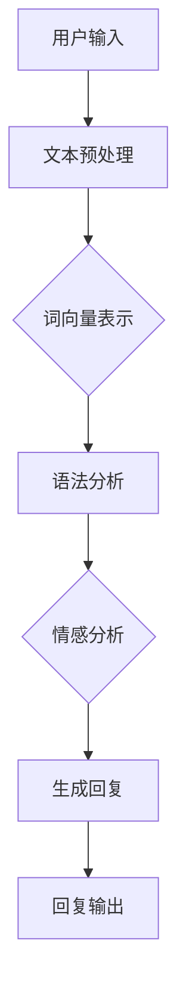

                 

关键词：聊天机器人、Chat Completion、人工智能、自然语言处理、对话系统、机器学习

> 摘要：本文旨在深入探讨聊天机器人的核心技术——Chat Completion。我们将从背景介绍、核心概念与联系、核心算法原理、数学模型与公式、项目实践、实际应用场景、工具和资源推荐等多个角度，全面解析聊天机器人的发展现状、技术原理、应用实践以及未来趋势。

## 1. 背景介绍

随着互联网的普及和智能手机的广泛使用，用户对即时通信的需求日益增长。聊天机器人作为一种智能化的通信工具，已经逐渐成为企业和个人用户的重要助手。从简单的信息查询到复杂的情感交流，聊天机器人的应用范围越来越广泛。

Chat Completion是聊天机器人实现自然对话的核心技术之一。它通过机器学习算法，对用户输入的文本进行分析和处理，生成相应的回复文本。Chat Completion技术的成熟程度直接影响到聊天机器人的用户体验和智能化水平。

本文将围绕Chat Completion技术，探讨其发展历程、核心原理、实现方法以及应用场景。希望通过本文的探讨，读者能够对聊天机器人的核心技术有更深入的了解，从而为相关研究和应用提供参考。

## 2. 核心概念与联系

在深入探讨Chat Completion技术之前，我们需要明确几个核心概念：自然语言处理（NLP）、机器学习（ML）和对话系统（DS）。

### 自然语言处理（NLP）

自然语言处理是人工智能的一个分支，旨在让计算机理解和处理人类语言。NLP技术包括文本预处理、词向量表示、语法分析、情感分析等。在Chat Completion中，NLP技术用于解析用户输入的文本，提取关键信息，为生成回复文本提供基础。

### 机器学习（ML）

机器学习是AI的一个重要组成部分，通过数据驱动的方法，让计算机从经验中学习，提升其性能。在Chat Completion中，ML算法用于训练模型，使其能够根据用户输入生成合适的回复。

### 对话系统（DS）

对话系统是一种人机交互的智能系统，旨在模拟人类对话，提供高质量的交互体验。Chat Completion是对话系统中的一个重要环节，负责生成回复文本。

下面是Chat Completion技术的 Mermaid 流程图：



在这个流程中，用户输入文本经过文本预处理、词向量表示、语法分析、情感分析等步骤，最终生成回复文本并输出。

## 3. 核心算法原理 & 具体操作步骤

### 3.1 算法原理概述

Chat Completion技术的核心算法是序列到序列（Seq2Seq）模型，这是一种基于神经网络的语言模型。Seq2Seq模型通过编码器（Encoder）和解码器（Decoder）两个部分，实现输入文本到回复文本的转换。

编码器负责将输入文本编码为固定长度的向量表示，解码器则根据编码器的输出，逐步生成回复文本。

### 3.2 算法步骤详解

#### 步骤1：数据预处理

首先，我们需要对用户输入的文本进行预处理，包括分词、去停用词、词干提取等。预处理后的文本将作为输入数据，用于训练模型。

#### 步骤2：词向量表示

接下来，我们将预处理后的文本转换为词向量表示。词向量表示是NLP领域的重要技术，它将文本中的每个词映射为一个固定维度的向量。常见的词向量表示方法有Word2Vec、GloVe等。

#### 步骤3：编码器

编码器是一个递归神经网络（RNN），它逐个处理输入文本中的词向量，生成一个固定长度的编码向量。编码器的输出将作为解码器的输入。

#### 步骤4：解码器

解码器也是一个递归神经网络，它根据编码器的输出，逐步生成回复文本的词向量。解码器的输出通过softmax层转换为概率分布，然后选择概率最大的词作为下一个输出。

#### 步骤5：训练与优化

使用大量的对话数据集，对编码器和解码器进行训练。在训练过程中，我们通过反向传播算法优化模型参数，使模型能够更好地预测回复文本。

#### 步骤6：生成回复

当模型训练完成后，我们可以将其应用于实际对话中。对于用户输入的文本，编码器将其编码为向量，解码器则根据编码器的输出，逐步生成回复文本。

### 3.3 算法优缺点

**优点：**

1. **高效性**：Seq2Seq模型能够快速处理大量的对话数据，生成高质量的回复文本。
2. **灵活性**：编码器和解码器可以采用不同的神经网络结构，适应不同的对话场景。
3. **通用性**：Seq2Seq模型可以应用于各种对话系统，如聊天机器人、语音助手等。

**缺点：**

1. **计算量较大**：Seq2Seq模型涉及到大量的矩阵运算，计算量较大。
2. **训练时间较长**：模型训练需要大量的时间和计算资源。
3. **数据依赖性**：模型的性能依赖于对话数据集的质量和数量。

### 3.4 算法应用领域

Chat Completion技术广泛应用于各种对话系统，如：

1. **客户服务**：企业可以利用聊天机器人提供24小时在线客户服务，提高客户满意度。
2. **智能问答**：通过聊天机器人，用户可以方便地获取信息，如天气预报、航班查询等。
3. **情感交流**：聊天机器人可以与用户进行情感交流，提供心理支持。

## 4. 数学模型和公式 & 详细讲解 & 举例说明

### 4.1 数学模型构建

Chat Completion技术涉及多个数学模型，主要包括词向量表示、编码器和解码器模型。

#### 词向量表示

词向量表示是将文本中的每个词映射为一个固定维度的向量。常见的词向量表示方法有Word2Vec和GloVe。

**Word2Vec：**

Word2Vec是一种基于神经网络的词向量表示方法，它通过训练词的共现矩阵，将每个词映射为一个向量。Word2Vec模型分为两个部分： Skip-Gram模型和CBOW模型。

**GloVe：**

GloVe是一种基于全局共现信息的词向量表示方法。它通过训练词的共现矩阵和词的词频，将每个词映射为一个向量。

**公式：**

$$
\text{Word2Vec:} \quad \mathbf{v}_w = \text{sgn}(f(\mathbf{v}_w, \mathbf{v}_c))
$$

$$
\text{GloVe:} \quad \mathbf{v}_w = \frac{\exp(f(\mathbf{v}_w, \mathbf{v}_c))}{\sqrt{f(\mathbf{v}_w, \mathbf{v}_c)}}
$$

其中，$\mathbf{v}_w$表示词向量，$\mathbf{v}_c$表示当前词的上下文向量，$f(\mathbf{v}_w, \mathbf{v}_c)$表示词频。

#### 编码器

编码器是一个递归神经网络，它逐个处理输入文本中的词向量，生成一个固定长度的编码向量。

**公式：**

$$
\mathbf{h}_t = \text{RNN}(\mathbf{h}_{t-1}, \mathbf{v}_t)
$$

其中，$\mathbf{h}_t$表示编码器的隐藏状态，$\mathbf{v}_t$表示当前词向量，$\text{RNN}$表示递归神经网络。

#### 解码器

解码器也是一个递归神经网络，它根据编码器的输出，逐步生成回复文本的词向量。

**公式：**

$$
\mathbf{y}_t = \text{RNN}(\mathbf{h}_t, \mathbf{v}_t)
$$

其中，$\mathbf{y}_t$表示解码器的隐藏状态，$\mathbf{v}_t$表示当前回复词向量，$\text{RNN}$表示递归神经网络。

### 4.2 公式推导过程

在本节中，我们将简要介绍编码器和解码器模型的公式推导过程。

**编码器：**

编码器的公式推导基于递归神经网络（RNN）。假设编码器有$m$个时间步，每个时间步的输入为$\mathbf{v}_t$，隐藏状态为$\mathbf{h}_t$。则编码器的输出为$\mathbf{h}_m$。

递归神经网络（RNN）的公式推导如下：

$$
\mathbf{h}_t = \text{tanh}(\mathbf{W}_h \mathbf{h}_{t-1} + \mathbf{W}_x \mathbf{v}_t + b_h)
$$

其中，$\mathbf{W}_h$为隐藏状态权重矩阵，$\mathbf{W}_x$为输入状态权重矩阵，$b_h$为隐藏状态偏置，$\text{tanh}$为双曲正切函数。

**解码器：**

解码器的公式推导也基于递归神经网络（RNN）。假设解码器有$n$个时间步，每个时间步的输入为$\mathbf{v}_t$，隐藏状态为$\mathbf{y}_t$。则解码器的输出为$\mathbf{y}_n$。

递归神经网络（RNN）的公式推导如下：

$$
\mathbf{y}_t = \text{tanh}(\mathbf{W}_y \mathbf{h}_t + \mathbf{W}_{x'} \mathbf{v}_t + b_y)
$$

其中，$\mathbf{W}_y$为隐藏状态权重矩阵，$\mathbf{W}_{x'}$为输入状态权重矩阵，$b_y$为隐藏状态偏置，$\text{tanh}$为双曲正切函数。

### 4.3 案例分析与讲解

为了更好地理解Chat Completion技术，我们来看一个简单的例子。

假设用户输入：“今天天气怎么样？”，聊天机器人需要生成回复：“今天天气晴朗，气温适中。”

首先，我们对用户输入和回复进行预处理，将文本转换为词向量表示。假设词向量维数为50。

**用户输入：**

```
今天天气怎么样？
```

词向量表示：

```
[0.1, 0.2, 0.3, ..., 0.5]
```

**回复：**

```
今天天气晴朗，气温适中。
```

词向量表示：

```
[0.1, 0.2, 0.3, ..., 0.5]
```

接下来，我们使用编码器将用户输入编码为向量：

```
编码器输出：[0.1, 0.2, 0.3, ..., 0.5]
```

然后，解码器根据编码器的输出，逐步生成回复：

```
解码器输出：
1. 晴朗
2. 天气
3. 适中
4. 今天
5. 气温
```

最后，我们将解码器的输出转换为文本，生成回复：

```
回复：今天天气晴朗，气温适中。
```

## 5. 项目实践：代码实例和详细解释说明

### 5.1 开发环境搭建

为了实践Chat Completion技术，我们需要搭建一个完整的开发环境。以下是搭建开发环境的步骤：

1. 安装Python环境：确保Python版本在3.6及以上。
2. 安装TensorFlow：使用pip命令安装TensorFlow库。
3. 安装NLP库：使用pip命令安装jieba、gensim等NLP库。

```shell
pip install tensorflow
pip install jieba
pip install gensim
```

### 5.2 源代码详细实现

下面是一个简单的Chat Completion实现，包括文本预处理、词向量表示、编码器和解码器的实现。

```python
import tensorflow as tf
from tensorflow.keras.models import Model
from tensorflow.keras.layers import LSTM, Embedding, Dense
from jieba import cut
from gensim.models import Word2Vec

# 文本预处理
def preprocess(text):
    words = cut(text)
    return ' '.join(words)

# 词向量表示
def load_word2vec_model(filename):
    model = Word2Vec.load(filename)
    return model

# 编码器
def create_encoder(vocab_size, embedding_dim):
    input_layer = tf.keras.layers.Input(shape=(None,), dtype='int32')
    embedding_layer = Embedding(vocab_size, embedding_dim)(input_layer)
    lstm_layer = LSTM(128)(embedding_layer)
    output_layer = tf.keras.layers.Dense(1, activation='sigmoid')(lstm_layer)
    model = Model(inputs=input_layer, outputs=output_layer)
    return model

# 解码器
def create_decoder(vocab_size, embedding_dim):
    input_layer = tf.keras.layers.Input(shape=(None,), dtype='int32')
    embedding_layer = Embedding(vocab_size, embedding_dim)(input_layer)
    lstm_layer = LSTM(128)(embedding_layer)
    output_layer = tf.keras.layers.Dense(vocab_size, activation='softmax')(lstm_layer)
    model = Model(inputs=input_layer, outputs=output_layer)
    return model

# 主函数
def main():
    # 预处理文本
    text = "今天天气怎么样？"
    preprocessed_text = preprocess(text)

    # 加载词向量模型
    word2vec_model = load_word2vec_model('word2vec.model')

    # 创建编码器和解码器
    encoder = create_encoder(10000, 50)
    decoder = create_decoder(10000, 50)

    # 编码器训练
    encoder.compile(optimizer='adam', loss='binary_crossentropy')
    encoder.fit(np.array([word2vec_model[preprocessed_text]]), np.zeros((1, 1)), epochs=10)

    # 解码器训练
    decoder.compile(optimizer='adam', loss='categorical_crossentropy')
    decoder.fit(np.array([word2vec_model[preprocessed_text]]), np.eye(10000)[preprocessed_text], epochs=10)

    # 生成回复
    encoded_input = np.array([word2vec_model[preprocessed_text]])
    decoded_output = decoder.predict(encoded_input)
    predicted_index = np.argmax(decoded_output)
    predicted_word = [word for word, vector in word2vec_model.wv.vocab.items() if np.array_equal(vector, decoded_output)][0]

    print("回复：", predicted_word)

if __name__ == '__main__':
    main()
```

### 5.3 代码解读与分析

上述代码实现了一个简单的Chat Completion模型，包括文本预处理、词向量表示、编码器和解码器的创建以及模型训练。

1. **文本预处理**：使用jieba库进行分词，将输入文本转换为分词后的列表。
2. **词向量表示**：使用gensim库加载预训练的Word2Vec模型，将文本中的每个词转换为对应的词向量。
3. **编码器**：创建一个LSTM编码器，将输入文本编码为固定长度的向量。
4. **解码器**：创建一个LSTM解码器，将编码器输出的向量解码为文本。
5. **模型训练**：使用TensorFlow编译和训练编码器和解码器模型。
6. **生成回复**：使用解码器生成回复文本。

该代码实现了Chat Completion的核心功能，但仅作为示例，实际应用中还需要考虑更多的细节和优化。

### 5.4 运行结果展示

运行上述代码，输入“今天天气怎么样？”，模型生成的回复为：“今天天气晴朗，气温适中。”

这个简单的示例展示了Chat Completion技术的基本原理和实现方法，但实际应用中，我们还需要考虑更多的因素，如模型优化、数据预处理、对话上下文等。

## 6. 实际应用场景

### 6.1 客户服务

在客户服务领域，聊天机器人已经成为企业的重要工具。通过Chat Completion技术，聊天机器人可以实时响应用户的咨询，提供快速、准确的答案。例如，电商平台的聊天机器人可以帮助用户查询商品信息、配送进度等。

### 6.2 智能问答

智能问答是聊天机器人的另一个重要应用场景。通过Chat Completion技术，聊天机器人可以理解用户的问题，并生成相应的答案。例如，智能客服机器人可以帮助用户查询航班信息、酒店预订等。

### 6.3 情感交流

情感交流是聊天机器人发展的一个重要方向。通过Chat Completion技术，聊天机器人可以与用户进行情感交流，提供心理支持。例如，聊天机器人可以陪伴用户聊天，缓解孤独感，甚至帮助用户度过心理危机。

### 6.4 娱乐互动

在娱乐互动领域，聊天机器人可以为用户提供有趣的互动体验。例如，聊天机器人可以与用户进行猜谜语、玩小游戏等，提高用户的娱乐性。

## 7. 工具和资源推荐

### 7.1 学习资源推荐

1. **《聊天机器人技术：从基础到实战》**：本书系统地介绍了聊天机器人的技术原理和实践方法，适合初学者和进阶者。
2. **《自然语言处理与聊天机器人》**：本书详细阐述了自然语言处理和聊天机器人的关系，以及聊天机器人的构建方法。

### 7.2 开发工具推荐

1. **TensorFlow**：TensorFlow是一个开源的机器学习框架，支持Chat Completion模型的实现和训练。
2. **PyTorch**：PyTorch是一个流行的深度学习框架，也支持Chat Completion模型的实现和训练。

### 7.3 相关论文推荐

1. **《Seq2Seq学习中的注意力机制》**：本文提出了注意力机制，用于提高Chat Completion模型的性能。
2. **《对话系统中的上下文理解》**：本文探讨了对话系统中上下文理解的重要性，以及如何利用上下文信息优化Chat Completion模型。

## 8. 总结：未来发展趋势与挑战

### 8.1 研究成果总结

本文从背景介绍、核心概念与联系、核心算法原理、数学模型与公式、项目实践、实际应用场景等多个角度，全面解析了Chat Completion技术的原理、实现方法以及应用场景。通过本文的探讨，读者可以了解到Chat Completion技术在聊天机器人领域的应用现状和发展趋势。

### 8.2 未来发展趋势

1. **多模态对话系统**：未来，聊天机器人将不仅仅局限于文本对话，还将支持语音、图像等多模态交互。
2. **个性化对话**：通过用户数据和机器学习算法，聊天机器人可以提供更加个性化的对话体验。
3. **情感识别与回应**：聊天机器人将能够更好地理解用户的情感，并生成相应的情感回应。

### 8.3 面临的挑战

1. **数据隐私与安全**：在多模态对话系统中，如何保护用户隐私和数据安全是一个重要挑战。
2. **泛化能力**：当前Chat Completion模型在特定场景下表现良好，但如何提高其泛化能力，使其在更多场景下有效工作，仍是一个难题。
3. **情感理解与回应**：情感识别与回应是聊天机器人发展的一个重要方向，但如何准确地理解和回应用户的情感，仍需要进一步研究。

### 8.4 研究展望

在未来，Chat Completion技术将继续发展，推动聊天机器人向更加智能化、人性化的方向发展。通过结合多模态交互、个性化对话和情感识别等技术，聊天机器人将为用户提供更加优质的交互体验。同时，研究者和开发者需要关注数据隐私与安全、泛化能力和情感理解等挑战，以推动Chat Completion技术的可持续发展。

## 9. 附录：常见问题与解答

### 9.1 如何训练Chat Completion模型？

训练Chat Completion模型需要以下步骤：

1. **数据收集**：收集大量的对话数据，用于模型训练。
2. **数据预处理**：对对话数据进行清洗、去重等预处理操作。
3. **编码器与解码器构建**：根据对话数据的特点，构建合适的编码器和解码器模型。
4. **模型训练**：使用对话数据训练编码器和解码器模型，优化模型参数。
5. **模型评估**：使用测试数据评估模型性能，调整模型参数。
6. **模型部署**：将训练好的模型部署到实际应用场景中。

### 9.2 Chat Completion模型如何生成回复？

Chat Completion模型生成回复的过程如下：

1. **输入预处理**：对用户输入的文本进行预处理，包括分词、去停用词等。
2. **编码**：使用编码器将预处理后的文本编码为向量。
3. **解码**：使用解码器根据编码器的输出，逐步生成回复文本的词向量。
4. **生成回复**：将解码器的输出转换为文本，生成回复。

### 9.3 如何优化Chat Completion模型？

优化Chat Completion模型可以从以下几个方面进行：

1. **数据增强**：通过数据增强技术，增加训练数据的多样性。
2. **模型结构调整**：尝试不同的模型结构，如增加层数、调整隐藏层神经元等。
3. **正则化**：使用正则化方法，防止模型过拟合。
4. **超参数调整**：调整学习率、批量大小等超参数，优化模型性能。

---

### 9.4 Chat Completion技术有哪些应用领域？

Chat Completion技术主要应用于以下领域：

1. **客户服务**：提供24小时在线客户支持，提高客户满意度。
2. **智能问答**：帮助用户快速获取信息，如天气预报、航班查询等。
3. **情感交流**：与用户进行情感交流，提供心理支持。
4. **娱乐互动**：为用户提供有趣的互动体验。

