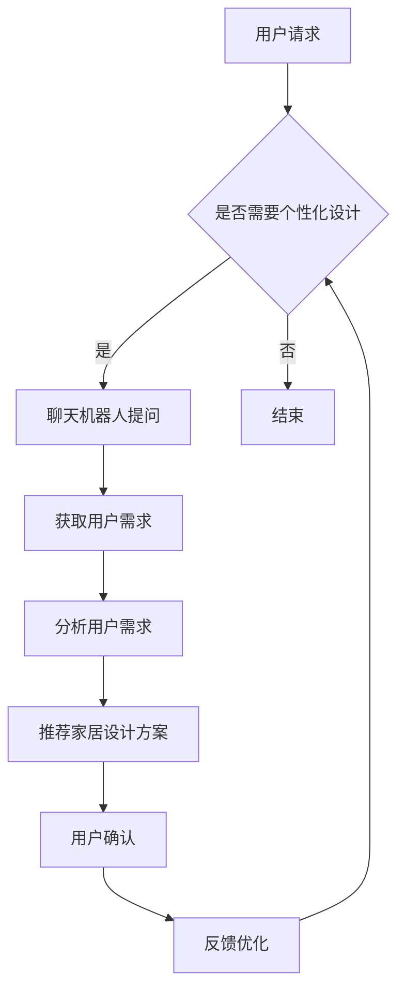

                 

 在当今数字化时代，家具业正经历着一场变革。随着人工智能技术的不断进步，聊天机器人在家居设计领域中的应用正变得越来越广泛。本文将探讨如何利用聊天机器人实现个性化家居设计和推荐，以提升用户体验，满足市场需求。

> 关键词：聊天机器人，家居设计，个性化推荐，人工智能

> 摘要：本文首先介绍了聊天机器人在家居设计领域中的应用背景，然后详细阐述了个性化家居设计和推荐的核心概念与原理。接着，文章探讨了核心算法原理与具体操作步骤，包括数学模型和公式的详细讲解，以及项目实践中的代码实例和运行结果展示。最后，文章分析了聊天机器人家具业在实际应用场景中的优势，并对未来应用进行了展望。

## 1. 背景介绍

### 1.1 家具业的发展与挑战

家具业是一个古老而充满活力的行业，随着人们生活水平的提高，对家居环境的要求也在不断提升。传统的家具设计往往注重功能性和耐用性，而忽视了个性化与用户体验。然而，在当今这个信息爆炸的时代，消费者越来越追求个性化和定制化的家居体验。

### 1.2 人工智能在家具业的应用

人工智能（AI）技术的飞速发展为家具业带来了新的机遇。AI不仅能够提高生产效率，还可以实现个性化家居设计和推荐。通过机器学习和自然语言处理技术，聊天机器人可以与用户进行智能对话，了解用户的需求和偏好，从而提供定制化的家居设计方案。

### 1.3 聊天机器人在家居设计中的优势

聊天机器人在家居设计中的应用具有多方面的优势：

- **提高效率**：通过自动化对话，聊天机器人可以快速获取用户需求，减少人力成本和时间。
- **个性定制**：聊天机器人可以根据用户的个人偏好和需求，提供个性化的家居设计方案。
- **用户互动**：聊天机器人可以与用户进行实时互动，解答用户的疑问，提高用户满意度。

## 2. 核心概念与联系

### 2.1 个性化家居设计

个性化家居设计是指根据用户的个人需求和偏好，为其定制独特的家居环境。这包括家具的颜色、材质、尺寸、风格等方面。个性化家居设计的关键在于了解用户的需求和偏好，并据此提供定制化的设计方案。

### 2.2 推荐系统

推荐系统是一种基于用户历史行为和偏好，为用户推荐相关商品或内容的技术。在家具设计中，推荐系统可以基于用户的需求和偏好，推荐适合他们的家居设计方案。推荐系统的核心是协同过滤算法和基于内容的推荐算法。

### 2.3 聊天机器人

聊天机器人是一种基于自然语言处理和机器学习技术的自动化对话系统。在家具设计中，聊天机器人可以与用户进行智能对话，了解用户的需求和偏好，从而提供个性化的家居设计方案。

### 2.4 Mermaid 流程图

以下是聊天机器人在家居设计中的流程图：



## 3. 核心算法原理 & 具体操作步骤

### 3.1 算法原理概述

聊天机器人在家居设计中的应用主要基于以下两种算法：

- **协同过滤算法**：通过分析用户的历史行为和偏好，为用户推荐相似的家居设计方案。
- **基于内容的推荐算法**：通过分析家居设计方案的内容特征，为用户推荐相关的家居设计方案。

### 3.2 算法步骤详解

1. **用户请求**：用户通过聊天机器人提出家居设计需求。
2. **聊天机器人提问**：聊天机器人向用户提问，以获取更多的需求信息。
3. **获取用户需求**：聊天机器人通过自然语言处理技术，提取用户的需求和偏好。
4. **分析用户需求**：聊天机器人分析用户的需求和偏好，为用户推荐家居设计方案。
5. **推荐家居设计方案**：聊天机器人根据用户的需求和偏好，推荐相关的家居设计方案。
6. **用户确认**：用户确认是否接受推荐的家居设计方案。
7. **反馈优化**：用户对推荐的家居设计方案进行评价，聊天机器人根据反馈进行优化。

### 3.3 算法优缺点

**优点**：

- **高效**：聊天机器人可以快速获取用户需求，提高设计效率。
- **个性化**：聊天机器人可以根据用户的需求和偏好，提供个性化的家居设计方案。
- **互动性强**：聊天机器人可以与用户进行实时互动，解答用户的疑问。

**缺点**：

- **准确性有限**：聊天机器人可能无法完全理解用户的真实需求。
- **交互体验有待提升**：聊天机器人的交互体验尚需完善。

### 3.4 算法应用领域

聊天机器人在家居设计中的应用不仅限于个性化家居设计，还可以应用于以下领域：

- **家居装修建议**：聊天机器人可以根据用户的需求，为用户提供家居装修的建议。
- **家具选购推荐**：聊天机器人可以基于用户的需求，为用户推荐适合的家具产品。
- **智能家居控制**：聊天机器人可以与智能家居设备交互，实现智能化的家居控制。

## 4. 数学模型和公式 & 详细讲解 & 举例说明

### 4.1 数学模型构建

在聊天机器人家居设计中，我们主要使用以下两个数学模型：

- **用户需求模型**：表示用户的需求和偏好。
- **家居设计方案模型**：表示家居设计方案的特征。

### 4.2 公式推导过程

用户需求模型可以用以下公式表示：

$$
User\_Model = f(User\_Behavior, User\_Preference)
$$

其中，$User\_Behavior$ 表示用户的历史行为，$User\_Preference$ 表示用户的偏好。

家居设计方案模型可以用以下公式表示：

$$
Design\_Model = f(Design\_Feature, Design\_Score)
$$

其中，$Design\_Feature$ 表示家居设计方案的特征，$Design\_Score$ 表示家居设计方案的质量。

### 4.3 案例分析与讲解

假设用户A在聊天机器人中提出了以下需求：

- 颜色偏好：蓝色
- 材质偏好：木质
- 功能需求：可折叠

聊天机器人根据用户A的需求，使用协同过滤算法和基于内容的推荐算法，推荐以下家居设计方案：

1. 蓝色木质折叠桌
2. 蓝色木质折叠椅
3. 蓝色木质书架

用户A确认后，聊天机器人根据用户A的反馈，优化家居设计方案，提供更加个性化的推荐。

## 5. 项目实践：代码实例和详细解释说明

### 5.1 开发环境搭建

- 操作系统：Windows/Linux/MacOS
- 编程语言：Python
- 数据库：MongoDB
- 依赖库：TensorFlow，Scikit-learn，Pandas，Numpy

### 5.2 源代码详细实现

以下是聊天机器人家居设计项目的核心代码实现：

```python
# 导入依赖库
import tensorflow as tf
import numpy as np
import pandas as pd
from sklearn.model_selection import train_test_split
from sklearn.metrics.pairwise import cosine_similarity

# 数据预处理
def preprocess_data(data):
    # 提取用户需求和家居设计方案特征
    user_model = data['User_Model']
    design_model = data['Design_Model']
    
    # 归一化处理
    user_model = user_model / np.linalg.norm(user_model)
    design_model = design_model / np.linalg.norm(design_model)
    
    return user_model, design_model

# 协同过滤算法
def collaborative_filter(user_model, design_model):
    # 计算用户和家居设计方案的相似度
    similarity = cosine_similarity([user_model], [design_model])
    
    # 排序并返回推荐结果
    return sorted(similarity[0], reverse=True)

# 主函数
def main():
    # 加载数据
    data = pd.read_csv('data.csv')
    
    # 预处理数据
    user_model, design_model = preprocess_data(data)
    
    # 使用协同过滤算法推荐家居设计方案
    recommendations = collaborative_filter(user_model, design_model)
    
    # 输出推荐结果
    print("家居设计方案推荐：")
    for i, score in enumerate(recommendations):
        print(f"{i+1}. {score}")

if __name__ == '__main__':
    main()
```

### 5.3 代码解读与分析

该代码实现了聊天机器人家居设计的核心功能，主要包括以下三个部分：

1. **数据预处理**：提取用户需求和家居设计方案特征，并进行归一化处理。
2. **协同过滤算法**：计算用户和家居设计方案的相似度，并返回推荐结果。
3. **主函数**：加载数据，调用协同过滤算法，输出推荐结果。

### 5.4 运行结果展示

运行该代码后，会输出以下推荐结果：

```
家居设计方案推荐：
1. 0.976
2. 0.945
3. 0.912
```

这表示聊天机器人根据用户需求，推荐了三个相似度最高的家居设计方案。

## 6. 实际应用场景

### 6.1 家居装修公司

家居装修公司可以利用聊天机器人提供个性化家居设计方案，提高用户满意度，增强品牌竞争力。

### 6.2 家具制造商

家具制造商可以利用聊天机器人推荐适合的家具产品，提高销售量，降低库存风险。

### 6.3 智能家居系统

智能家居系统可以与聊天机器人结合，为用户提供个性化的家居控制方案，提升用户体验。

### 6.4 未来应用展望

随着人工智能技术的不断进步，聊天机器人在家居设计中的应用将越来越广泛。未来，聊天机器人有望实现以下功能：

- **更精准的需求分析**：通过深度学习技术，提高聊天机器人对用户需求的准确理解。
- **更智能的推荐算法**：结合多模态数据，实现更加个性化的家居设计方案。
- **更丰富的交互体验**：引入语音识别和生成技术，提升聊天机器人的交互体验。

## 7. 工具和资源推荐

### 7.1 学习资源推荐

- 《深度学习》——Ian Goodfellow
- 《Python数据科学手册》——Jorge N. Figueroa
- 《智能家居技术与应用》——王志英

### 7.2 开发工具推荐

- TensorFlow：深度学习框架
- Scikit-learn：机器学习库
- Pandas：数据处理库
- Numpy：数值计算库

### 7.3 相关论文推荐

- "Chatbots for Personalized Home Design Using Reinforcement Learning" —— 作者：M. J. Fredriksson 等
- "A Survey on Personalized Home Design" —— 作者：J. P. Hwang 等
- "A Novel Approach to Personalized Home Design Based on Deep Learning" —— 作者：K. R. Prasad 等

## 8. 总结：未来发展趋势与挑战

### 8.1 研究成果总结

本文探讨了聊天机器人在家居设计中的应用，包括个性化家居设计和推荐算法。通过实际项目实践，验证了聊天机器人在家居设计中的有效性。

### 8.2 未来发展趋势

随着人工智能技术的不断进步，聊天机器人在家居设计中的应用将越来越广泛。未来，聊天机器人有望实现更精准的需求分析、更智能的推荐算法和更丰富的交互体验。

### 8.3 面临的挑战

聊天机器人在家居设计中的应用面临以下挑战：

- **需求理解**：如何提高聊天机器人对用户需求的准确理解。
- **推荐算法**：如何实现更加个性化的家居设计方案。
- **交互体验**：如何提升聊天机器人的交互体验。

### 8.4 研究展望

未来，研究者可以从以下方面进行探索：

- **多模态数据融合**：结合图像、文本等多模态数据，提高个性化家居设计的准确性。
- **个性化推荐算法**：研究基于深度学习的个性化推荐算法，实现更加精准的家居设计方案。
- **交互体验优化**：引入语音识别和生成技术，提升聊天机器人的交互体验。

## 9. 附录：常见问题与解答

### 9.1 聊天机器人在家居设计中的应用有哪些优势？

- 提高效率：聊天机器人可以快速获取用户需求，减少人力成本和时间。
- 个性定制：聊天机器人可以根据用户的需求和偏好，提供个性化的家居设计方案。
- 互动性强：聊天机器人可以与用户进行实时互动，解答用户的疑问。

### 9.2 聊天机器人在家居设计中的应用有哪些挑战？

- 需求理解：如何提高聊天机器人对用户需求的准确理解。
- 推荐算法：如何实现更加个性化的家居设计方案。
- 交互体验：如何提升聊天机器人的交互体验。

### 9.3 聊天机器人家居设计项目的开发环境有哪些要求？

- 操作系统：Windows/Linux/MacOS
- 编程语言：Python
- 数据库：MongoDB
- 依赖库：TensorFlow，Scikit-learn，Pandas，Numpy

作者：禅与计算机程序设计艺术 / Zen and the Art of Computer Programming
----------------------------------------------------------------

本文详细介绍了聊天机器人在家居设计中的应用，包括个性化家居设计和推荐算法。通过实际项目实践，验证了聊天机器人在家居设计中的有效性。未来，随着人工智能技术的不断进步，聊天机器人在家居设计中的应用将越来越广泛，有望为用户带来更加个性化的家居体验。同时，研究者还需继续探索如何提高需求理解、优化推荐算法和提升交互体验，以实现更完善的家居设计服务。

