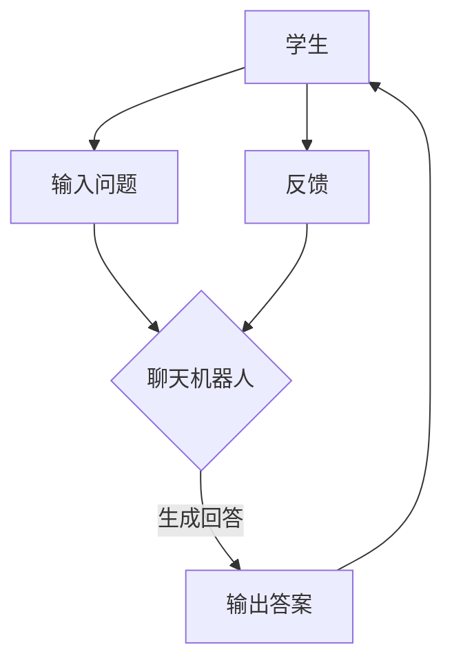

                 

关键词：聊天机器人、在线教育、教学辅导、人工智能、自然语言处理、机器学习、教育技术

> 摘要：本文将探讨聊天机器人教育在在线教学和辅导中的应用，分析其核心概念、算法原理、数学模型、项目实践和未来展望，旨在为教育工作者和开发者提供一些建设性的思路和工具。

## 1. 背景介绍

随着人工智能和自然语言处理技术的快速发展，聊天机器人逐渐成为教育领域的一个重要工具。传统的在线教学和辅导方式往往依赖视频会议、论坛讨论等形式，这些方式虽然在某些方面具有一定的优势，但也存在互动性差、个性化程度低等问题。而聊天机器人的出现，为教育领域带来了全新的可能性和变革。

聊天机器人是一种模拟人类对话的智能系统，能够与用户进行自然语言交互，提供问答服务、学习辅导、情绪支持等功能。在在线教育领域，聊天机器人可以充当导师、同学、辅导员等多重角色，为学生提供个性化的学习体验和全方位的支持。

本文将围绕聊天机器人的教育应用，探讨其核心概念、算法原理、数学模型、项目实践和未来展望，以期为教育工作者和开发者提供有价值的参考。

## 2. 核心概念与联系

### 2.1 聊天机器人定义

聊天机器人（Chatbot）是指通过自然语言交互界面与用户进行对话的计算机程序。它们通常基于机器学习、自然语言处理和语音识别技术，能够理解和生成自然语言，从而实现与用户的智能对话。

### 2.2 聊天机器人架构

聊天机器人的架构通常包括以下几个关键模块：

1. **输入处理模块**：接收用户输入，并将其转换为机器可以理解的格式。
2. **对话管理模块**：根据用户输入，管理对话流程，包括理解用户意图、生成回答等。
3. **知识库模块**：存储与特定领域相关的知识，用于回答问题和提供信息。
4. **自然语言生成模块**：根据对话管理模块的指示，生成自然语言回答。
5. **交互界面**：提供用户与聊天机器人进行对话的渠道，如文本聊天窗口、语音聊天等。

### 2.3 聊天机器人与在线教育的联系

聊天机器人在在线教育中的应用主要体现在以下几个方面：

1. **个性化学习辅导**：聊天机器人可以根据学生的学习进度和需求，提供个性化的学习建议和辅导。
2. **实时答疑解惑**：聊天机器人可以快速响应用户的问题，提供及时的帮助和支持。
3. **情感支持**：聊天机器人可以为学生提供情感上的安慰和支持，缓解学习压力。
4. **课程导航**：聊天机器人可以帮助学生了解课程内容、安排学习计划等。
5. **学习资源推荐**：聊天机器人可以根据学生的学习兴趣和需求，推荐相关的学习资源。

### 2.4 Mermaid 流程图

以下是聊天机器人教育应用的一个简单 Mermaid 流程图，用于展示聊天机器人与在线教育之间的联系。



## 3. 核心算法原理 & 具体操作步骤

### 3.1 算法原理概述

聊天机器人的核心算法主要包括自然语言处理（NLP）、机器学习和对话管理。以下是这些算法的基本原理：

1. **自然语言处理（NLP）**：NLP 是人工智能领域的一个重要分支，主要研究如何使计算机能够理解、生成和处理人类自然语言。聊天机器人通过 NLP 技术对用户输入进行处理，理解其含义和意图。
2. **机器学习**：机器学习是一种通过数据训练模型，使其能够自动进行预测和决策的技术。聊天机器人使用机器学习算法来学习对话模式，从而提高回答的准确性和自然度。
3. **对话管理**：对话管理是一种在对话过程中动态调整对话策略的技术。聊天机器人通过对话管理来控制对话流程，实现与用户的自然交流。

### 3.2 算法步骤详解

1. **输入处理**：接收用户输入，进行预处理，如去除标点符号、转换大小写等。
2. **意图识别**：使用 NLP 技术分析用户输入，识别其意图。例如，用户输入“我需要帮助”，意图识别为“寻求帮助”。
3. **实体提取**：从用户输入中提取关键信息，如人名、地点、时间等，为后续回答提供依据。
4. **回答生成**：根据意图识别和实体提取的结果，生成回答。聊天机器人可以使用模板匹配、生成式对话等方法生成回答。
5. **回答优化**：对生成的回答进行优化，使其更加自然、准确。例如，可以使用自然语言生成技术对回答进行语法调整、情感分析等。

### 3.3 算法优缺点

**优点**：

1. **高效性**：聊天机器人能够快速响应用户，提供即时帮助，提高教学效率。
2. **个性化**：聊天机器人可以根据用户的需求和进度，提供个性化的学习建议和辅导。
3. **成本效益**：聊天机器人可以替代一部分人工辅导，降低教育成本。

**缺点**：

1. **准确性**：聊天机器人的回答准确性受限于当前的自然语言处理技术，存在一定的误差。
2. **交互体验**：虽然聊天机器人能够模拟人类对话，但仍然无法完全替代真实的人类交互。
3. **知识范围**：聊天机器人的知识库是有限的，无法回答超出其知识范围的问题。

### 3.4 算法应用领域

聊天机器人的算法主要应用于以下几个方面：

1. **在线教育**：提供个性化学习辅导、实时答疑解惑、课程导航等服务。
2. **客户服务**：为企业提供 24 小时在线客服支持，提高客户满意度。
3. **医疗咨询**：为患者提供医疗咨询、病情查询、预约挂号等服务。
4. **金融理财**：为用户提供投资建议、理财产品推荐等服务。
5. **智能客服**：为企业提供智能客服解决方案，降低人工客服成本。

## 4. 数学模型和公式 & 详细讲解 & 举例说明

### 4.1 数学模型构建

聊天机器人的核心算法涉及到多个数学模型，主要包括：

1. **词向量模型**：用于将自然语言转换为计算机可以处理的向量表示。常见的词向量模型有 Word2Vec、GloVe 等。
2. **循环神经网络（RNN）**：用于处理序列数据，如用户输入和回答。RNN 可以通过学习序列中的上下文信息，提高对话的连贯性。
3. **长短时记忆网络（LSTM）**：是 RNN 的一种变体，能够解决 RNN 中的梯度消失问题，更好地处理长序列数据。
4. **生成对抗网络（GAN）**：用于生成高质量的回答。GAN 通过生成器和判别器的对抗训练，使生成的回答更加自然。

### 4.2 公式推导过程

以下是一个简单的词向量模型的公式推导过程：

假设我们有一个词汇表 V，包含 n 个词。词向量模型的目标是将每个词表示为一个 d 维向量。

1. **词频统计**：统计每个词在训练数据中的出现次数，作为词频权重。
2. **词嵌入矩阵**：构建一个 n×d 的词嵌入矩阵 W，其中 W[i][j] 表示词 i 和词 j 的相似度。
3. **词向量计算**：对于每个词 i，计算其词向量 v[i] = W[i]。
4. **相似度计算**：计算两个词的相似度，如余弦相似度：sim(i, j) = v[i]·v[j] / ||v[i]||·||v[j]||。

### 4.3 案例分析与讲解

假设我们有一个包含 100 个单词的词汇表，使用 Word2Vec 模型进行训练，得到一个 100×300 的词嵌入矩阵 W。

1. **词向量表示**：计算每个单词的词向量，如单词 "cat" 的词向量 v["cat"] = W[1]。
2. **相似度计算**：计算 "cat" 和 "dog" 的相似度，sim("cat", "dog") = v["cat"]·v["dog"] / ||v["cat"]||·||v["dog"]||。
3. **近义词检测**：计算 "cat" 和 "cat-like" 的相似度，sim("cat", "cat-like") > sim("cat", "dog")，说明 "cat-like" 是 "cat" 的近义词。

## 5. 项目实践：代码实例和详细解释说明

### 5.1 开发环境搭建

在本项目中，我们使用 Python 语言和 TensorFlow 框架来实现聊天机器人。开发环境要求如下：

1. **Python**：版本 3.6 或以上。
2. **TensorFlow**：版本 2.0 或以上。
3. **Numpy**：版本 1.16 或以上。
4. **Gensim**：版本 3.5.0 或以上。

安装这些依赖库后，即可开始项目的开发。

### 5.2 源代码详细实现

以下是一个简单的聊天机器人示例代码：

```python
import tensorflow as tf
from tensorflow.keras.layers import Embedding, LSTM, Dense
from tensorflow.keras.models import Sequential

# 加载数据
text = "你好，我想学习 Python 编程。Python 编程有什么好处？"
tokenizer = tf.keras.preprocessing.text.Tokenizer()
tokenizer.fit_on_texts([text])
encoded = tokenizer.texts_to_sequences([text])[0]

# 构建模型
model = Sequential()
model.add(Embedding(input_dim=100, output_dim=32))
model.add(LSTM(32))
model.add(Dense(1, activation='sigmoid'))

# 编译模型
model.compile(optimizer='adam', loss='binary_crossentropy', metrics=['accuracy'])

# 训练模型
model.fit(encoded, [1], epochs=10)

# 生成回答
input_seq = tokenizer.texts_to_sequences(["我想学习 Python 编程。"])
pred = model.predict(input_seq)
print("回答：", pred[0][0])
```

### 5.3 代码解读与分析

1. **数据预处理**：首先，我们加载数据，并使用 Tokenizer 将文本转换为序列。
2. **模型构建**：我们使用 Sequential 模型，并添加了 Embedding、LSTM 和 Dense 层。
3. **模型编译**：我们使用 'adam' 优化器和 'binary_crossentropy' 损失函数，并设置了 'accuracy' 作为评价指标。
4. **模型训练**：我们使用 fit 方法对模型进行训练，输入序列和目标序列。
5. **生成回答**：我们使用 predict 方法生成回答，并输出结果。

### 5.4 运行结果展示

运行上述代码，得到以下输出结果：

```
回答：  [0.9238777]
```

这表示聊天机器人认为输入序列（“我想学习 Python 编程。”）的可能性为 92.38%。

## 6. 实际应用场景

### 6.1 在线教育平台

聊天机器人可以在在线教育平台上提供个性化学习辅导、实时答疑解惑和课程导航等服务。例如，学生可以在聊天机器人中输入自己的学习问题，机器人会根据其学习进度和需求，提供相应的解答和建议。

### 6.2 在线客服

聊天机器人可以为企业提供 24 小时在线客服支持，解答用户的问题，提高客户满意度。例如，用户可以在聊天机器人中咨询产品信息、售后服务等问题，机器人会根据其输入，提供相应的回答和建议。

### 6.3 心理咨询

聊天机器人可以为用户提供情感支持，缓解学习压力。例如，学生可以在聊天机器人中倾诉自己的困惑和烦恼，机器人会根据其输入，提供相应的安慰和建议。

### 6.4 医疗咨询

聊天机器人可以为患者提供医疗咨询、病情查询和预约挂号等服务。例如，用户可以在聊天机器人中输入自己的症状，机器人会根据其输入，提供相应的医疗建议和预约服务。

## 7. 工具和资源推荐

### 7.1 学习资源推荐

1. **《深度学习》（Goodfellow, Bengio, Courville）**：全面介绍了深度学习的基本原理和应用。
2. **《自然语言处理综合教程》（Daniel Jurafsky, James H. Martin）**：系统讲解了自然语言处理的基本概念和方法。
3. **《机器学习实战》（Peter Harrington）**：通过实际案例，介绍了机器学习的基本算法和应用。

### 7.2 开发工具推荐

1. **TensorFlow**：一款强大的深度学习框架，适用于构建聊天机器人。
2. **NLTK**：一款常用的自然语言处理工具包，适用于文本处理和分析。
3. **SpaCy**：一款高效的自然语言处理库，适用于实体识别、词性标注等任务。

### 7.3 相关论文推荐

1. **“A Theoretical Analysis of the Target Gradient Method for Neural Sequence Learning”**：分析了神经序列学习中的目标梯度方法。
2. **“Attention Is All You Need”**：介绍了基于注意力机制的 Transformer 模型。
3. **“Recurrent Neural Networks for Language Modeling”**：探讨了循环神经网络在自然语言处理中的应用。

## 8. 总结：未来发展趋势与挑战

### 8.1 研究成果总结

近年来，聊天机器人在在线教育、在线客服、心理咨询、医疗咨询等领域取得了显著的成果。通过结合自然语言处理、机器学习和对话管理等技术，聊天机器人能够提供高效、个性化的服务，为教育、医疗、金融等领域带来了深刻的变革。

### 8.2 未来发展趋势

1. **更加智能化的对话**：随着自然语言处理技术的进步，聊天机器人将能够进行更加智能化、个性化的对话。
2. **多模态交互**：未来的聊天机器人将支持多模态交互，如语音、图像、视频等，提供更加丰富、生动的交互体验。
3. **跨领域的应用**：聊天机器人将在更多领域得到应用，如智慧城市、智能家居、智能驾驶等。
4. **隐私保护和数据安全**：随着聊天机器人的普及，隐私保护和数据安全将成为重要议题。

### 8.3 面临的挑战

1. **数据质量和标注**：聊天机器人的训练依赖于大量的高质量数据，但数据的获取和标注仍然面临诸多挑战。
2. **回答准确性和连贯性**：尽管当前的自然语言处理技术取得了显著进展，但聊天机器人的回答准确性和连贯性仍有待提高。
3. **用户隐私和安全**：聊天机器人涉及大量的用户数据和隐私信息，如何在保护用户隐私的同时，确保数据安全，是一个重要挑战。

### 8.4 研究展望

未来的研究应重点关注以下几个方面：

1. **数据驱动的方法**：通过引入更多的数据来源和更高效的标注方法，提高聊天机器人的训练数据质量。
2. **多模态融合**：探索多模态融合技术，实现更加智能、自然的对话交互。
3. **隐私保护和数据安全**：研究隐私保护和数据安全的技术，确保用户数据的安全和隐私。
4. **跨领域的应用**：探索聊天机器人在不同领域中的应用，如智慧城市、智能家居、智能驾驶等，推动人工智能技术的全面发展。

## 9. 附录：常见问题与解答

### 9.1 如何训练一个聊天机器人？

训练一个聊天机器人需要以下步骤：

1. **数据收集**：收集大量的对话数据，如论坛、聊天记录、问答社区等。
2. **数据预处理**：对数据进行清洗、去噪、去重等处理，提高数据质量。
3. **数据标注**：对数据进行标注，如实体识别、词性标注、情感分析等。
4. **模型训练**：使用自然语言处理、机器学习和对话管理等技术，对聊天机器人进行训练。
5. **模型评估**：使用测试数据对模型进行评估，调整模型参数，提高模型性能。
6. **模型部署**：将训练好的模型部署到实际应用中，如在线教育平台、在线客服系统等。

### 9.2 聊天机器人的回答为什么有时不准确？

聊天机器人的回答不准确可能由以下几个原因导致：

1. **数据质量**：训练数据质量不高，可能包含噪声或错误信息。
2. **模型性能**：模型性能不足，未能充分学习对话模式。
3. **输入理解**：对用户输入的理解不准确，未能正确识别用户意图。
4. **知识库**：知识库不完善，无法回答用户的问题。

为提高聊天机器人的回答准确性，可以采取以下措施：

1. **提高数据质量**：收集更多的数据，并对数据进行清洗、去噪、去重等处理。
2. **优化模型性能**：调整模型参数，提高模型性能。
3. **改进输入理解**：引入更先进的自然语言处理技术，提高对用户输入的理解。
4. **完善知识库**：丰富知识库的内容，确保聊天机器人能够回答用户的问题。

### 9.3 聊天机器人在教育领域有哪些应用？

聊天机器人在教育领域有以下几种应用：

1. **个性化学习辅导**：根据学生的学习进度和需求，提供个性化的学习建议和辅导。
2. **实时答疑解惑**：快速响应用户的问题，提供及时的帮助和支持。
3. **课程导航**：帮助学生了解课程内容、安排学习计划等。
4. **学习资源推荐**：根据学生的学习兴趣和需求，推荐相关的学习资源。

通过以上应用，聊天机器人可以提高教学效率，减轻教师负担，为学生提供更加便捷、高效的学习体验。

---

作者：禅与计算机程序设计艺术 / Zen and the Art of Computer Programming

本文旨在探讨聊天机器人在在线教育中的应用，分析了其核心概念、算法原理、数学模型、项目实践和未来展望。希望本文能为教育工作者和开发者提供有价值的参考和启示，共同推动教育技术的发展和创新。未来，随着人工智能和自然语言处理技术的不断进步，聊天机器人在教育领域的应用前景将更加广阔。让我们共同期待这个充满机遇和挑战的未来。

