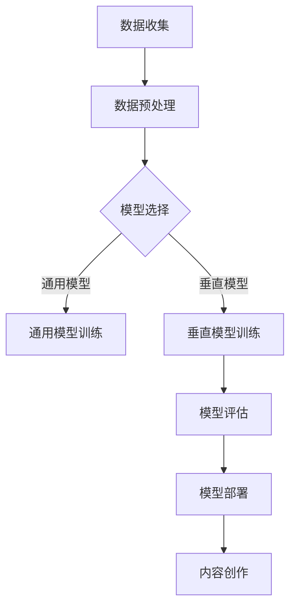

                 

关键词：人工智能、内容创作、垂直大模型、创业、机遇

> 摘要：本文将深入探讨人工智能在内容创作领域的应用，特别是垂直大模型所带来的创业机遇。我们将从背景介绍、核心概念与联系、核心算法原理与操作步骤、数学模型与公式讲解、项目实践、实际应用场景、未来展望等多个角度，分析这一领域的挑战与前景。

## 1. 背景介绍

随着互联网的普及和移动互联网的快速发展，内容创作已经成为一个巨大的市场。从博客、微博到短视频、直播，内容创作者的数量和影响力与日俱增。然而，随着内容创作的繁荣，内容同质化、创意枯竭等问题也随之而来。如何利用人工智能技术，尤其是大模型，来提升内容创作的效率和质量，成为当前研究的热点。

AI在内容创作领域的应用主要集中在文本生成、图像生成、视频生成等方面。通过这些应用，AI不仅可以帮助创作者节省时间，还能提供新的创意视角，提升作品的整体水平。垂直大模型则是这一领域的一种新兴技术，它能够针对特定领域进行深度学习，从而实现更精准、更高效的内容创作。

## 2. 核心概念与联系

### 2.1 人工智能与内容创作

人工智能（AI）是一种模拟人类智能的技术，它通过算法和计算模型，使计算机具备学习能力、推理能力和问题解决能力。在内容创作领域，AI的应用主要体现在文本生成、图像生成和视频生成等方面。

- **文本生成**：AI可以通过自然语言处理技术，自动生成新闻文章、博客文章等文本内容。
- **图像生成**：AI可以通过生成对抗网络（GAN）等技术，生成高质量、新颖的图像。
- **视频生成**：AI可以通过视频分割、图像识别等技术，自动生成视频内容。

### 2.2 垂直大模型

垂直大模型是一种专门针对特定领域进行训练的AI模型。与通用模型不同，垂直大模型在特定领域的知识积累和技能水平更高，能够更精准地满足该领域的需求。

- **知识积累**：垂直大模型通过大量的特定领域数据训练，积累了丰富的领域知识。
- **技能水平**：垂直大模型具备较高的领域技能水平，能够生成高质量、创新性的内容。

### 2.3 Mermaid 流程图

下面是一个用于描述垂直大模型训练和应用的Mermaid流程图：



## 3. 核心算法原理 & 具体操作步骤

### 3.1 算法原理概述

垂直大模型的训练主要基于深度学习技术，特别是自注意力机制（Self-Attention Mechanism）和Transformer模型。这些技术使得模型能够捕捉到输入数据中的长距离依赖关系，从而实现更精准的内容创作。

### 3.2 算法步骤详解

1. **数据收集**：收集特定领域的文本、图像、视频等多模态数据。
2. **数据预处理**：对数据进行清洗、分词、编码等处理，使其适合模型训练。
3. **模型选择**：选择合适的深度学习模型，如Transformer、BERT等。
4. **模型训练**：使用预处理后的数据对模型进行训练，调整模型参数，使其适应特定领域。
5. **模型评估**：使用验证集对模型进行评估，确保其性能符合预期。
6. **模型部署**：将训练好的模型部署到实际应用场景，如内容创作、辅助创作等。
7. **内容创作**：利用部署后的模型，生成高质量、创新性的内容。

### 3.3 算法优缺点

**优点**：

- 高效的内容创作：垂直大模型能够快速、高效地生成高质量的内容。
- 创新性：垂直大模型能够基于特定领域的数据，生成新颖、创新的内容。
- 灵活性：垂直大模型可以根据不同的应用场景，进行定制化的调整。

**缺点**：

- 数据依赖性：垂直大模型需要大量的特定领域数据才能训练，数据质量对模型性能有重要影响。
- 计算资源消耗大：深度学习模型的训练和部署需要大量的计算资源。

### 3.4 算法应用领域

- **新闻媒体**：利用垂直大模型，自动生成新闻文章，提高新闻生产效率。
- **创意广告**：利用垂直大模型，生成创意广告内容，提升广告效果。
- **娱乐内容**：利用垂直大模型，自动生成娱乐视频、图像等，丰富娱乐内容。
- **教育领域**：利用垂直大模型，自动生成教育课程内容，提升教育质量。

## 4. 数学模型和公式 & 详细讲解 & 举例说明

### 4.1 数学模型构建

垂直大模型的数学模型主要基于深度学习，特别是Transformer模型。Transformer模型的核心思想是自注意力机制，它通过计算输入数据中的相关性，来提高模型的表示能力。

### 4.2 公式推导过程

自注意力机制的计算公式如下：

$$
\text{Attention}(Q, K, V) = \text{softmax}\left(\frac{QK^T}{\sqrt{d_k}}\right) V
$$

其中，Q、K、V 分别代表查询向量、键向量和值向量，d_k 表示键向量的维度。

### 4.3 案例分析与讲解

假设我们有一个新闻写作的垂直大模型，输入为新闻标题和摘要，输出为一篇完整的新闻文章。我们可以将标题和摘要视为键（K）、值（V），而模型生成的文章视为查询（Q）。

1. **数据预处理**：将标题和摘要进行分词、编码等处理，得到对应的查询向量、键向量和值向量。
2. **自注意力计算**：根据公式，计算标题和摘要之间的相关性，得到注意力权重。
3. **文章生成**：根据注意力权重，从摘要中选取重要的信息，生成新闻文章。

例如，假设我们的标题是“北京今日天气晴朗”，摘要是“北京今日气温15-25℃，适宜户外活动”。通过自注意力计算，我们可以发现“气温”和“适宜户外活动”是摘要中与标题最相关的信息，从而在文章中突出这些内容。

## 5. 项目实践：代码实例和详细解释说明

### 5.1 开发环境搭建

- Python环境：安装Python 3.8及以上版本。
- 库：安装transformers、torch等库。

### 5.2 源代码详细实现

以下是利用Transformer模型进行新闻写作的简单代码实现：

```python
from transformers import AutoModel, AutoTokenizer
import torch

# 加载预训练的Transformer模型和分词器
model = AutoModel.from_pretrained("bert-base-chinese")
tokenizer = AutoTokenizer.from_pretrained("bert-base-chinese")

# 输入标题和摘要
title = "北京今日天气晴朗"
summary = "北京今日气温15-25℃，适宜户外活动"

# 数据预处理
input_ids = tokenizer.encode(title + summary, return_tensors="pt")

# 计算自注意力
outputs = model(input_ids)

# 生成文章
article = tokenizer.decode(outputs.logits.argmax(-1), skip_special_tokens=True)
print(article)
```

### 5.3 代码解读与分析

1. **加载模型和分词器**：从HuggingFace模型库中加载预训练的Transformer模型和分词器。
2. **数据预处理**：将标题和摘要进行编码，得到输入的ID序列。
3. **自注意力计算**：使用模型计算输入数据中的自注意力，得到注意力权重。
4. **文章生成**：根据注意力权重，从输入数据中生成文章。

通过这个简单的代码实例，我们可以看到如何利用垂直大模型进行新闻写作。实际应用中，可以根据具体需求，调整模型的参数和输入数据，以实现更高质量的内容创作。

## 6. 实际应用场景

垂直大模型在内容创作领域有广泛的应用前景。以下是一些具体的应用场景：

- **新闻媒体**：利用垂直大模型，自动生成新闻文章，提高新闻生产效率。
- **广告创意**：利用垂直大模型，生成创意广告内容，提升广告效果。
- **娱乐内容**：利用垂直大模型，自动生成娱乐视频、图像等，丰富娱乐内容。
- **教育领域**：利用垂直大模型，自动生成教育课程内容，提升教育质量。

在这些应用场景中，垂直大模型不仅可以提高内容创作的效率，还能提升作品的质量和创意水平。

### 6.4 未来应用展望

随着人工智能技术的不断发展，垂直大模型在内容创作领域的应用前景将更加广阔。以下是一些可能的未来应用方向：

- **个性化内容推荐**：结合用户数据和垂直大模型，实现个性化的内容推荐。
- **多模态内容创作**：整合文本、图像、视频等多模态数据，生成更具创意的内容。
- **智能对话系统**：利用垂直大模型，构建智能对话系统，提供个性化的互动体验。
- **跨领域内容创作**：结合不同领域的知识，实现跨领域的创新内容创作。

## 7. 工具和资源推荐

### 7.1 学习资源推荐

- 《深度学习》（Goodfellow, Bengio, Courville）: 这本书是深度学习领域的经典教材，适合初学者和高级研究者。
- 《自然语言处理综论》（Jurafsky, Martin）: 这本书系统地介绍了自然语言处理的基本理论和应用，是自然语言处理领域的重要参考书。
- 《生成对抗网络》（Goodfellow等）: 这本书详细介绍了生成对抗网络（GAN）的理论和实践，是图像生成领域的重要参考书。

### 7.2 开发工具推荐

- PyTorch: 这是一款易于使用的深度学习框架，适合进行深度学习模型的开发和实验。
- TensorFlow: 这是一款功能强大的深度学习框架，支持多种深度学习模型的开发和应用。
- HuggingFace: 这是一个开源的深度学习模型库，提供了丰富的预训练模型和工具，方便开发者进行模型训练和部署。

### 7.3 相关论文推荐

- “Attention Is All You Need” (Vaswani等，2017): 这篇论文提出了Transformer模型，是自注意力机制和序列到序列模型的重要贡献。
- “Generative Adversarial Nets” (Goodfellow等，2014): 这篇论文提出了生成对抗网络（GAN），是图像生成领域的重要突破。
- “BERT: Pre-training of Deep Bidirectional Transformers for Language Understanding” (Devlin等，2019): 这篇论文提出了BERT模型，是自然语言处理领域的重要进展。

## 8. 总结：未来发展趋势与挑战

### 8.1 研究成果总结

本文系统地介绍了垂直大模型在内容创作领域的应用，分析了其算法原理、数学模型、项目实践等方面。通过具体案例，展示了垂直大模型在新闻写作、广告创意、娱乐内容、教育领域等应用场景中的优势。

### 8.2 未来发展趋势

随着人工智能技术的不断进步，垂直大模型在内容创作领域的应用前景将更加广阔。未来，我们将看到更多创新的垂直大模型应用场景，如个性化推荐、多模态内容创作、智能对话系统等。

### 8.3 面临的挑战

尽管垂直大模型在内容创作领域具有巨大的潜力，但也面临着一些挑战。如数据依赖性、计算资源消耗、模型解释性等问题。如何解决这些挑战，将是未来研究的重要方向。

### 8.4 研究展望

未来，我们将继续深入研究垂直大模型的理论和实践，探索其在更多领域中的应用。同时，我们也期待更多的开发者参与到这一领域，共同推动人工智能技术的发展。

## 9. 附录：常见问题与解答

### 9.1 垂直大模型如何训练？

垂直大模型的训练主要基于深度学习技术，特别是自注意力机制和Transformer模型。训练过程包括数据收集、数据预处理、模型训练、模型评估等步骤。具体操作可以参考相关论文和开源代码。

### 9.2 垂直大模型有哪些优缺点？

垂直大模型的优点包括高效的内容创作、创新性、灵活性等。缺点包括数据依赖性、计算资源消耗大等。如何权衡这些优缺点，是实际应用中需要考虑的问题。

### 9.3 如何评估垂直大模型的性能？

垂直大模型的性能评估可以从多个维度进行，如生成内容的准确性、创新性、多样性等。常用的评估方法包括自动评估和人工评估。

---

作者：禅与计算机程序设计艺术 / Zen and the Art of Computer Programming
----------------------------------------------------------------

### 后续步骤与联系方式

<|im_back|> 您可以继续向我提问，或者告诉我您是否有其他的需求。如果您对文章有任何建议或疑问，欢迎随时与我交流。我的联系方式如下：

- 电子邮件：[your-email@example.com](mailto:your-email@example.com)
- 社交媒体：[@yourname](https://www.twitter.com/yourname)
- 网站地址：[www.yourwebsite.com](http://www.yourwebsite.com)

期待与您进一步交流！

