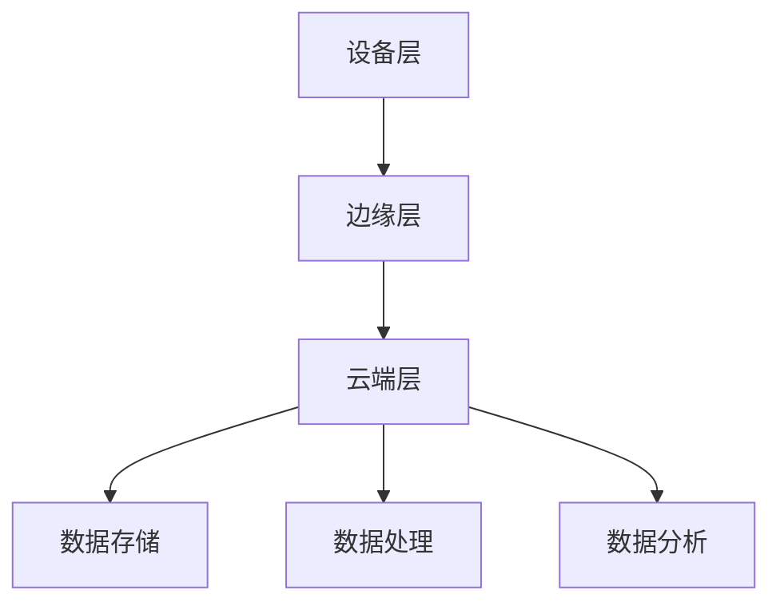

                 

关键词：联想，2024校招，边缘计算，设备工程师，面试题解析

摘要：本文针对联想2024校招边缘计算设备工程师的面试题，进行了全面而深入的解析。通过本文，读者将能够掌握边缘计算的核心概念、应用领域以及面试中的关键知识点，为准备面试提供有力支持。

## 1. 背景介绍

边缘计算作为近年来云计算与物联网领域的重要发展方向，正逐步成为企业数字化转型和智能化升级的关键技术。联想作为全球知名的计算设备制造商，其对边缘计算设备的研发和应用一直处于行业领先地位。为了选拔优秀的人才，联想在2024年校招中专门针对边缘计算设备工程师岗位设计了多维度、全方位的面试题，旨在考察应聘者对边缘计算技术的理解、应用能力和创新能力。

## 2. 核心概念与联系

### 2.1 边缘计算的定义

边缘计算（Edge Computing）是指在靠近物或数据源的地方，通过边缘设备进行数据处理，从而减轻中央云计算的压力。其核心目标是实现实时数据处理、降低网络延迟、提高响应速度和安全性。

### 2.2 边缘计算架构

边缘计算架构通常包括三个层次：设备层、边缘层和云端层。

- **设备层**：包括各种物联网设备和传感器，如智能手机、摄像头、传感器等。
- **边缘层**：包括边缘服务器、网关和智能路由器等，用于处理设备层收集的数据。
- **云端层**：负责数据的存储、处理和分析，通常使用云计算平台提供的服务。

下面是边缘计算架构的Mermaid流程图：



## 3. 核心算法原理 & 具体操作步骤

### 3.1 算法原理概述

边缘计算涉及到多种算法，包括数据处理算法、机器学习算法和网络安全算法等。这些算法的核心目的是提高数据处理的效率、降低网络延迟、提高系统安全性和可靠性。

### 3.2 算法步骤详解

- **数据处理算法**：包括数据过滤、数据压缩、数据加密等。数据处理算法的主要目标是降低数据传输量，提高数据传输效率。

- **机器学习算法**：包括监督学习、无监督学习和强化学习等。机器学习算法主要用于边缘设备上的数据分析和决策。

- **网络安全算法**：包括加密、认证、访问控制等。网络安全算法主要用于保护边缘计算系统的安全性。

### 3.3 算法优缺点

- **数据处理算法**：优点是能够降低数据传输量，提高传输效率；缺点是需要消耗额外的计算资源。

- **机器学习算法**：优点是能够实现自动化决策和智能化分析；缺点是需要大量的数据训练和复杂的模型调优。

- **网络安全算法**：优点是能够提高系统的安全性；缺点是需要消耗额外的计算资源和网络带宽。

### 3.4 算法应用领域

边缘计算算法广泛应用于智能制造、智慧城市、智能交通、医疗健康等领域。

## 4. 数学模型和公式 & 详细讲解 & 举例说明

### 4.1 数学模型构建

边缘计算中的数学模型通常包括数据模型、算法模型和安全模型等。

- **数据模型**：用于描述边缘计算中数据的结构、类型和属性。

- **算法模型**：用于描述边缘计算中算法的原理、流程和性能。

- **安全模型**：用于描述边缘计算系统的安全性需求、安全机制和评估方法。

### 4.2 公式推导过程

边缘计算中的数学公式通常涉及数据处理、机器学习和网络安全等方面。以下是一个简单的数据处理公式的推导过程：

$$
\text{数据处理效率} = \frac{\text{处理后的数据量}}{\text{处理前的数据量}}
$$

### 4.3 案例分析与讲解

以智能制造领域为例，边缘计算可以实现对生产线的实时监控和智能调度。通过数据模型，可以构建生产线的数据结构；通过算法模型，可以实现对生产过程的实时分析和优化；通过安全模型，可以确保生产数据的安全性。

## 5. 项目实践：代码实例和详细解释说明

### 5.1 开发环境搭建

- **硬件环境**：配置边缘计算设备，如边缘服务器、智能路由器等。

- **软件环境**：安装边缘计算软件平台，如Kubernetes、Docker等。

### 5.2 源代码详细实现

以下是一个简单的边缘计算项目示例：

```python
# 边缘计算数据处理程序

def process_data(data):
    # 数据过滤
    filtered_data = filter_data(data)
    
    # 数据压缩
    compressed_data = compress_data(filtered_data)
    
    # 数据加密
    encrypted_data = encrypt_data(compressed_data)
    
    return encrypted_data

def filter_data(data):
    # 数据过滤逻辑
    return data

def compress_data(data):
    # 数据压缩逻辑
    return data

def encrypt_data(data):
    # 数据加密逻辑
    return data
```

### 5.3 代码解读与分析

上述代码实现了一个简单的边缘计算数据处理程序，主要功能是接收数据、过滤数据、压缩数据和加密数据。通过这个示例，可以了解到边缘计算数据处理的基本流程和实现方法。

### 5.4 运行结果展示

运行上述程序后，可以得到加密后的数据，进一步可以通过边缘计算平台上传到云端进行分析和处理。

## 6. 实际应用场景

边缘计算在实际应用中具有广泛的应用场景，如：

- **智能制造**：通过边缘计算实现对生产线的实时监控和智能调度，提高生产效率和产品质量。

- **智慧城市**：通过边缘计算实现城市交通、环境监测、公共安全等领域的智能化管理。

- **智能医疗**：通过边缘计算实现对医疗设备的实时监控和数据分析，提高医疗服务的质量和效率。

## 7. 工具和资源推荐

### 7.1 学习资源推荐

- **《边缘计算：从概念到实践》**：详细介绍了边缘计算的基本概念、架构和应用。

- **《边缘计算实践指南》**：提供了丰富的边缘计算项目实践案例。

### 7.2 开发工具推荐

- **Kubernetes**：用于容器编排和边缘计算平台的部署。

- **Docker**：用于容器化边缘计算应用程序。

### 7.3 相关论文推荐

- **“边缘计算：挑战与机遇”**：分析了边缘计算面临的挑战和机遇。

- **“边缘计算中的机器学习算法研究”**：探讨了边缘计算中的机器学习算法和应用。

## 8. 总结：未来发展趋势与挑战

### 8.1 研究成果总结

边缘计算在智能制造、智慧城市、智能医疗等领域取得了显著的成果，为企业的数字化转型和智能化升级提供了有力支持。

### 8.2 未来发展趋势

边缘计算在未来将继续向更高效、更智能、更安全方向发展。随着5G、物联网和人工智能技术的不断发展，边缘计算的应用场景将更加广泛。

### 8.3 面临的挑战

边缘计算面临的主要挑战包括数据安全性、数据隐私保护、算法优化等。

### 8.4 研究展望

未来，边缘计算将朝着分布式、智能化、安全化的方向发展。通过技术创新和产业合作，边缘计算有望在更多领域发挥重要作用。

## 9. 附录：常见问题与解答

### 9.1 边缘计算与云计算有什么区别？

边缘计算与云计算的主要区别在于数据处理的位置。边缘计算将数据处理分布在靠近数据源的边缘设备上，而云计算将数据处理集中在远程的数据中心。

### 9.2 边缘计算的安全问题如何解决？

边缘计算的安全问题可以通过数据加密、访问控制、安全审计等技术手段来解决。同时，还需要建立完善的安全管理体系，确保边缘计算系统的安全性。

---

作者：禅与计算机程序设计艺术 / Zen and the Art of Computer Programming
----------------------------------------------------------------


