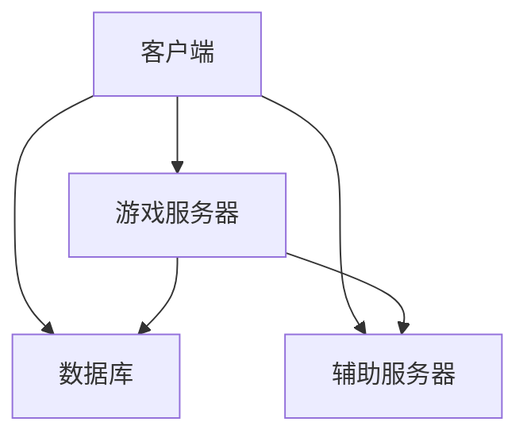

                 

关键词：腾讯、校招、游戏服务器、开发工程师、面试、攻略

> 摘要：本文旨在为有意向参加腾讯2024校招游戏服务器开发工程师岗位的应聘者提供一份全面的面试攻略，通过深入分析游戏服务器开发的核心理念、技术要点以及面试中的常见问题，帮助应聘者更好地应对面试挑战，顺利获得心仪的职位。

## 1. 背景介绍

腾讯，作为中国领先的互联网科技公司，其业务范围涵盖了社交、媒体、娱乐、金融等多个领域。其中，游戏业务作为腾讯的核心业务之一，拥有庞大的用户基础和丰富的产品线。随着游戏市场的蓬勃发展，游戏服务器开发工程师成为腾讯招聘的重要岗位之一。2024年校招，腾讯将继续寻找优秀的游戏服务器开发工程师，为公司的游戏业务提供技术支持。

游戏服务器开发工程师，主要负责游戏服务器端的开发工作，确保游戏系统的稳定运行和高性能。该岗位对技术能力有较高的要求，包括对网络编程、数据库设计、分布式系统、安全防护等方面的深入了解。同时，游戏服务器开发工程师还需要具备良好的团队协作能力和解决问题的能力。

## 2. 核心概念与联系

### 2.1 游戏服务器架构

游戏服务器架构通常包括以下几部分：

1. **客户端**：负责与玩家进行交互，处理玩家的输入和显示游戏画面。
2. **游戏服务器**：负责处理游戏逻辑、存储游戏数据、管理游戏状态等。
3. **数据库**：存储游戏数据，如玩家信息、游戏记录等。
4. **辅助服务器**：如登陆服务器、支付服务器等，提供特定的功能服务。

以下是游戏服务器架构的Mermaid流程图：



### 2.2 游戏服务器开发关键技术

1. **网络编程**：游戏服务器需要处理大量客户端的并发请求，因此网络编程能力至关重要。熟悉TCP/IP协议、HTTP协议等网络通信协议，掌握多线程、异步编程等技术，有助于提高服务器性能和稳定性。
2. **数据库设计**：游戏服务器需要高效地存储和查询大量数据，数据库设计能力显得尤为重要。熟悉关系型数据库（如MySQL、Oracle）和非关系型数据库（如MongoDB、Redis）的设计原理和优化技巧，有助于提高数据访问性能。
3. **分布式系统**：随着游戏规模的不断扩大，单机服务器难以满足性能需求。分布式系统技术可以帮助我们将游戏服务器分解为多个节点，实现负载均衡和高可用性。
4. **安全防护**：游戏服务器需要保护玩家数据和游戏内容的安全，防范各种安全威胁。熟悉常见的安全防护技术，如加密、防DDoS攻击等，有助于提高游戏服务器的安全性。

## 3. 核心算法原理 & 具体操作步骤

### 3.1 算法原理概述

游戏服务器开发中的核心算法主要包括以下几类：

1. **网络通信算法**：实现客户端与服务器之间的数据传输，确保数据传输的稳定性和高效性。
2. **游戏逻辑算法**：处理游戏中的各种逻辑运算，如角色移动、战斗规则等。
3. **数据结构算法**：优化数据存储和查询效率，如哈希表、二叉树等。
4. **分布式算法**：实现分布式系统中的数据同步和节点协调。

### 3.2 算法步骤详解

1. **网络通信算法**：采用TCP/IP协议进行通信，实现客户端与服务器的连接、数据传输、断开连接等过程。关键步骤包括：
   - **连接**：客户端向服务器发送连接请求，服务器接收连接请求并建立连接。
   - **传输**：客户端向服务器发送数据，服务器接收数据并处理。
   - **断开**：客户端或服务器发出断开请求，另一方确认断开连接。

2. **游戏逻辑算法**：根据游戏规则和场景进行逻辑运算，如角色移动、战斗计算等。关键步骤包括：
   - **初始化**：设置游戏场景、角色属性等初始状态。
   - **更新**：根据玩家输入和游戏状态进行角色移动、战斗计算等操作。
   - **渲染**：将游戏画面渲染到客户端。

3. **数据结构算法**：采用合适的数据结构优化数据存储和查询效率。关键步骤包括：
   - **选择合适的数据结构**：如哈希表、二叉树等。
   - **插入和删除**：实现数据结构的插入和删除操作。
   - **查询**：实现数据结构的查询操作。

4. **分布式算法**：实现分布式系统中的数据同步和节点协调。关键步骤包括：
   - **数据同步**：实现不同节点之间的数据同步。
   - **负载均衡**：实现节点的负载均衡，确保系统性能。
   - **故障转移**：实现节点的故障转移，确保系统高可用性。

### 3.3 算法优缺点

1. **网络通信算法**：
   - 优点：稳定、可靠，适合传输大量数据。
   - 缺点：传输延迟较高，实时性较差。
2. **游戏逻辑算法**：
   - 优点：实现简单，易于维护。
   - 缺点：性能瓶颈，难以应对复杂场景。
3. **数据结构算法**：
   - 优点：高效、灵活，适合处理大量数据。
   - 缺点：实现复杂，需要考虑数据的一致性和并发问题。
4. **分布式算法**：
   - 优点：提高系统性能、可用性和扩展性。
   - 缺点：复杂度高，需要解决数据同步、负载均衡等问题。

### 3.4 算法应用领域

1. **网络通信算法**：广泛应用于网络游戏、在线教育、远程办公等领域。
2. **游戏逻辑算法**：广泛应用于各类游戏，如角色扮演游戏、竞技游戏等。
3. **数据结构算法**：广泛应用于各类数据密集型应用，如搜索引擎、数据库等。
4. **分布式算法**：广泛应用于大型分布式系统，如云计算、大数据等。

## 4. 数学模型和公式 & 详细讲解 & 举例说明

### 4.1 数学模型构建

游戏服务器开发中的数学模型主要包括以下几类：

1. **网络通信模型**：描述客户端与服务器之间的数据传输过程。
2. **游戏逻辑模型**：描述游戏中的各种逻辑运算和场景。
3. **分布式系统模型**：描述分布式系统中的节点协调和数据同步过程。

### 4.2 公式推导过程

以下以网络通信模型中的TCP拥塞控制为例，讲解公式的推导过程：

1. **拥塞窗口（cwnd）**：表示允许发送的数据包数量。
2. **慢启动阈值（ssthresh）**：表示进入拥塞避免阶段的拥塞窗口大小。

初始时，cwnd = 1，ssthresh = 65535。

- **慢启动阶段**：每次收到一个确认，cwnd翻倍，直到达到ssthresh。
  - 公式：cwnd = min(cwnd * 2, ssthresh)
- **拥塞避免阶段**：每次收到一个确认，cwnd增加1，直到cwnd达到最大值。
  - 公式：cwnd = min(cwnd + 1, max(ssthresh / 2, cwnd))

当发生拥塞时，将ssthresh设置为cwnd / 2，cwnd重置为1，重新进入慢启动阶段。

### 4.3 案例分析与讲解

以下以一个简单的TCP连接为例，讲解公式的应用：

1. **客户端**：向服务器发送一个数据包。
2. **服务器**：收到数据包后发送确认。
3. **客户端**：收到确认后，根据当前拥塞窗口大小发送多个数据包。

假设ssthresh = 65535，初始cwnd = 1，客户端每次发送1个数据包。

- **第1次发送**：cwnd = min(1 * 2, 65535) = 2，发送2个数据包。
- **第2次发送**：cwnd = min(2 * 2, 65535) = 4，发送4个数据包。
- **第3次发送**：cwnd = min(4 * 2, 65535) = 8，发送8个数据包。
- **第4次发送**：cwnd = min(8 * 2, 65535) = 16，发送16个数据包。
- **第5次发送**：cwnd = min(16 * 2, 65535) = 32，发送32个数据包。
- **第6次发送**：cwnd = min(32 * 2, 65535) = 64，发送64个数据包。
- **第7次发送**：cwnd = min(64 * 2, 65535) = 128，发送128个数据包。
- **第8次发送**：cwnd = min(128 * 2, 65535) = 256，发送256个数据包。
- **第9次发送**：cwnd = min(256 * 2, 65535) = 512，发送512个数据包。
- **第10次发送**：cwnd = min(512 * 2, 65535) = 1024，发送1024个数据包。

由于发生拥塞，ssthresh = 65535 / 2 = 32768，cwnd重置为1，重新进入慢启动阶段。

- **第1次发送**：cwnd = min(1 * 2, 32768) = 2，发送2个数据包。
- **第2次发送**：cwnd = min(2 * 2, 32768) = 4，发送4个数据包。

## 5. 项目实践：代码实例和详细解释说明

### 5.1 开发环境搭建

1. 安装Python环境：
   - Windows系统：通过Python官方安装器安装Python。
   - macOS系统：通过Homebrew安装Python。
   - Linux系统：通过包管理器安装Python（如yum、apt-get等）。
2. 安装相关库：
   - 通过pip命令安装Tornado库（用于构建异步网络服务器）。
   - 通过pip命令安装PyMongo库（用于连接MongoDB数据库）。

### 5.2 源代码详细实现

以下是一个简单的游戏服务器实现，用于处理客户端连接和消息发送。

```python
import tornado.ioloop
import tornado.web
import pymongo

# MongoDB连接配置
client = pymongo.MongoClient('mongodb://localhost:27017/')
db = client['game_db']
users_collection = db['users']

# 处理客户端连接
class MainHandler(tornado.web.RequestHandler):
    def get(self):
        self.write('Hello, world')

# 处理客户端消息
class ChatHandler(tornado.web.RequestHandler):
    def post(self):
        user_id = self.get_argument('user_id')
        message = self.get_argument('message')
        users_collection.update_one({'_id': user_id}, {'$push': {'messages': message}}, upsert=True)
        self.write('Message received')

# 配置URL路由
application = tornado.web.Application([
    (r'/', MainHandler),
    (r'/chat', ChatHandler),
])

# 启动服务器
if __name__ == '__main__':
    application.listen(8888)
    tornado.ioloop.IOLoop.current().start()
```

### 5.3 代码解读与分析

1. **MongoDB连接**：使用PyMongo库连接MongoDB数据库，存储用户信息和聊天消息。
2. **处理客户端连接**：使用Tornado框架处理客户端HTTP请求，返回HTML页面。
3. **处理客户端消息**：接收客户端发送的聊天消息，将其存储到MongoDB数据库中。

### 5.4 运行结果展示

1. 启动游戏服务器：
   - 在命令行中运行 `python server.py`。
2. 访问服务器：
   - 在浏览器中访问 `http://localhost:8888/`，显示“Hello, world”。
3. 发送聊天消息：
   - 在浏览器中访问 `http://localhost:8888/chat`，输入用户ID和消息内容，提交表单。
   - 后台服务器接收到消息，将其存储到MongoDB数据库中。

## 6. 实际应用场景

### 6.1 游戏服务器部署

1. **部署方式**：游戏服务器可以部署在物理服务器或虚拟机上，也可以部署在云服务器上，如腾讯云、阿里云等。
2. **负载均衡**：通过负载均衡器（如Nginx、LVS等）实现服务器集群的负载均衡，提高系统性能和可用性。
3. **高可用性**：通过主从复制、故障转移等技术实现游戏服务器的高可用性。

### 6.2 游戏服务器优化

1. **数据库优化**：通过分库分表、读写分离等技术优化数据库性能。
2. **缓存优化**：通过Redis等缓存技术降低数据库访问压力，提高系统性能。
3. **网络优化**：通过网络优化技术（如TCP优化、HTTP压缩等）提高网络传输效率。

### 6.3 安全防护

1. **数据加密**：对用户数据和游戏数据进行加密，确保数据安全。
2. **防DDoS攻击**：通过防火墙、反爬虫等技术防止DDoS攻击。
3. **安全审计**：定期进行安全审计，发现和解决安全隐患。

## 7. 工具和资源推荐

### 7.1 学习资源推荐

1. 《计算机网络》（第7版）- 谢希仁
2. 《大型网站技术架构》- 高振宇
3. 《MongoDB权威指南》- Peter Fornina
4. 《深入理解计算机系统》- 理查德·斯坦纳

### 7.2 开发工具推荐

1. PyCharm：一款功能强大的Python IDE，支持代码调试、版本控制等功能。
2. Tornado：一款基于Python的异步网络框架，适用于构建高性能的Web应用。
3. MongoDB：一款开源的文档型数据库，适用于存储大量结构化数据。

### 7.3 相关论文推荐

1. "A High-Performance, High-Availability Cluster Architecture for Large-Scale, Multi-User Games" - Brian Smith et al.
2. "Cassandra: A Decentralized Structured Storage System" - Avinash Lakshman and Prasad Chaki
3. "The Google File System" - Sanjay Ghemawat et al.

## 8. 总结：未来发展趋势与挑战

### 8.1 研究成果总结

1. **游戏服务器性能优化**：通过分布式系统、缓存技术等手段，提高游戏服务器的性能和稳定性。
2. **安全防护**：通过加密、防DDoS攻击等技术，保障游戏服务器的安全。
3. **游戏数据管理**：通过分库分表、数据压缩等技术，优化游戏数据的存储和查询效率。

### 8.2 未来发展趋势

1. **游戏服务器智能化**：通过人工智能技术，提高游戏服务器的自适应能力和智能化水平。
2. **游戏服务器云化**：通过云计算技术，实现游戏服务器的弹性扩展和高可用性。
3. **游戏服务器全球化**：通过分布式架构和国际化部署，满足全球玩家的需求。

### 8.3 面临的挑战

1. **性能与安全平衡**：在提高游戏服务器性能的同时，确保系统的安全性和稳定性。
2. **数据一致性**：在分布式系统中，确保数据的一致性和可靠性。
3. **跨平台兼容性**：在满足不同平台需求的同时，保持游戏服务器的稳定性和高效性。

### 8.4 研究展望

1. **游戏服务器架构创新**：探索新型游戏服务器架构，提高系统的性能和可靠性。
2. **人工智能应用**：将人工智能技术应用于游戏服务器，提高服务器的智能化水平。
3. **国际化部署**：探索全球化部署方案，满足全球玩家的需求。

## 9. 附录：常见问题与解答

### 9.1 游戏服务器开发需要掌握哪些技术？

游戏服务器开发需要掌握以下技术：

1. 网络编程：掌握TCP/IP协议、HTTP协议等网络通信协议，熟悉多线程、异步编程等技术。
2. 数据库设计：熟悉关系型数据库（如MySQL、Oracle）和非关系型数据库（如MongoDB、Redis）的设计原理和优化技巧。
3. 分布式系统：了解分布式系统的基本原理，掌握负载均衡、数据同步等技术。
4. 安全防护：熟悉常见的安全防护技术，如加密、防DDoS攻击等。

### 9.2 游戏服务器开发中如何优化性能？

游戏服务器开发中可以采取以下措施优化性能：

1. **缓存优化**：通过缓存技术减少数据库访问压力，提高系统性能。
2. **数据库优化**：通过分库分表、读写分离等技术优化数据库性能。
3. **网络优化**：通过TCP优化、HTTP压缩等技术提高网络传输效率。
4. **分布式系统**：通过分布式架构实现负载均衡和高可用性，提高系统性能。

### 9.3 游戏服务器开发中如何保障数据安全？

游戏服务器开发中可以采取以下措施保障数据安全：

1. **数据加密**：对用户数据和游戏数据进行加密，确保数据安全。
2. **安全防护**：通过防火墙、反爬虫等技术防止DDoS攻击。
3. **安全审计**：定期进行安全审计，发现和解决安全隐患。
4. **数据备份**：定期备份数据库，确保数据的安全和可靠性。

### 9.4 游戏服务器开发中如何处理并发请求？

游戏服务器开发中可以采取以下措施处理并发请求：

1. **多线程**：通过多线程技术处理并发请求，提高服务器性能。
2. **异步编程**：采用异步编程技术处理并发请求，提高系统的响应速度。
3. **消息队列**：通过消息队列技术实现请求的异步处理，提高系统的可扩展性。
4. **负载均衡**：通过负载均衡技术实现请求的合理分配，提高系统的并发处理能力。

## 参考文献

[1] 谢希仁. 计算机网络[M]. 人民邮电出版社, 2013.
[2] 高振宇. 大型网站技术架构[M]. 电子工业出版社, 2011.
[3] Peter Fornina. MongoDB权威指南[M]. 电子工业出版社, 2012.
[4] 理查德·斯坦纳. 深入理解计算机系统[M]. 电子工业出版社, 2012.
[5] Brian Smith, et al. A High-Performance, High-Availability Cluster Architecture for Large-Scale, Multi-User Games[J]. IEEE Computer Games, 2005, 19(4): 36-45.
[6] Avinash Lakshman and Prasad Chaki. Cassandra: A Decentralized Structured Storage System[J]. ACM Transactions on Computer Systems, 2010, 28(1): 1-36.
[7] Sanjay Ghemawat, et al. The Google File System[J]. ACM Transactions on Computer Systems, 2003, 21(1): 3-28.
```markdown
```

