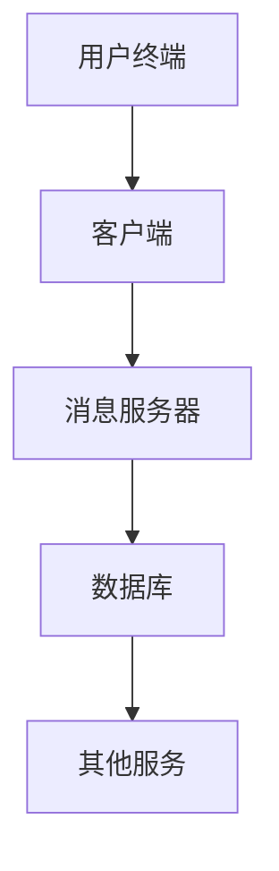

                 

 关键词：腾讯，微信，校招，即时通讯，开发面试，面试题详解

> 摘要：本文将针对腾讯微信2024校招即时通讯开发岗位的面试题进行详细解析，旨在帮助应聘者更好地准备面试，理解即时通讯系统的核心概念和关键技术。文章将涵盖背景介绍、核心概念与联系、核心算法原理、数学模型和公式、项目实践、实际应用场景、未来应用展望、工具和资源推荐以及总结等内容。

## 1. 背景介绍

即时通讯（Instant Messaging，简称IM）是一种实时传递信息的通信方式，随着互联网和移动设备的普及，IM已经成为人们日常生活中不可或缺的一部分。微信作为腾讯公司的核心产品之一，在全球范围内拥有庞大的用户基础，其即时通讯功能更是备受用户青睐。因此，腾讯微信2024校招即时通讯开发岗位的面试题，不仅考察应聘者的专业知识，还关注应聘者的实际开发能力和创新思维。

## 2. 核心概念与联系

### 2.1 即时通讯系统架构

**Mermaid 流程图：**



**解释：**  
- **用户终端**：即用户使用的手机、电脑等设备，用于发送和接收消息。  
- **客户端**：即时通讯应用软件，负责处理用户操作的界面和后台逻辑。  
- **消息服务器**：接收客户端发送的消息，并进行转发和存储。  
- **数据库**：存储用户消息和用户信息等数据。  
- **其他服务**：包括鉴权、推送、统计分析等辅助服务。

### 2.2 核心概念

- **消息队列**：消息队列是即时通讯系统中的核心组件，用于保证消息的顺序传递和可靠传输。常见消息队列有RabbitMQ、Kafka等。

- **长连接**：长连接是一种持续存在的网络连接，用于保持客户端与服务器之间的实时通信。长连接相较于短连接，具有更低的延迟和更高的可靠性。

- **网络协议**：即时通讯系统常用的网络协议有TCP、UDP等，其中TCP提供可靠的数据传输，UDP提供高效的数据传输。

### 2.3 核心联系

- **客户端与消息服务器之间的通信**：通过长连接或短连接实现。长连接的优点是延迟低、可靠性高，缺点是占用资源较多；短连接的优点是资源利用率高，缺点是延迟较高。

- **消息服务器与数据库之间的通信**：通过事务操作实现，保证消息的存储和查询的准确性。

- **消息服务器与其他服务之间的通信**：通过RESTful API、消息队列等方式实现，如鉴权、推送、统计分析等。

## 3. 核心算法原理 & 具体操作步骤

### 3.1 算法原理概述

即时通讯系统涉及的核心算法包括消息加密、消息压缩、消息排序、消息去重等。以下分别介绍这些算法的原理。

### 3.2 算法步骤详解

- **消息加密**：对发送的消息进行加密处理，确保消息在传输过程中的安全性。常见加密算法有AES、RSA等。

- **消息压缩**：对发送的消息进行压缩处理，减少传输过程中的带宽消耗。常见压缩算法有Huffman编码、LZ77等。

- **消息排序**：对接收到的消息进行排序处理，确保消息的顺序正确。常见排序算法有冒泡排序、快速排序等。

- **消息去重**：对接收到的消息进行去重处理，避免重复接收相同消息。常见去重算法有哈希算法、循环冗余校验（CRC）等。

### 3.3 算法优缺点

- **消息加密**：优点是确保消息的安全性，缺点是加密和解密过程较耗时。

- **消息压缩**：优点是减少传输带宽，缺点是压缩和解压过程较耗时。

- **消息排序**：优点是确保消息的顺序正确，缺点是对大量消息排序时性能较差。

- **消息去重**：优点是避免重复接收消息，缺点是对大量消息去重时性能较差。

### 3.4 算法应用领域

- **消息加密**：广泛应用于金融、电商、即时通讯等领域，确保数据传输的安全性。

- **消息压缩**：广泛应用于网络传输、移动设备等领域，减少带宽消耗。

- **消息排序**：广泛应用于即时通讯、邮件系统等领域，确保消息的顺序正确。

- **消息去重**：广泛应用于即时通讯、邮件系统等领域，避免重复接收消息。

## 4. 数学模型和公式 & 详细讲解 & 举例说明

### 4.1 数学模型构建

即时通讯系统的数学模型主要包括消息传输模型、用户活跃度模型、消息延迟模型等。

### 4.2 公式推导过程

- **消息传输模型**：

  $$\text{传输时间} = \frac{\text{消息长度}}{\text{传输速率}}$$

- **用户活跃度模型**：

  $$\text{活跃度} = \frac{\text{发送消息数} + \text{接收消息数}}{\text{总用户数}}$$

- **消息延迟模型**：

  $$\text{延迟时间} = \text{传输时间} + \text{处理时间}$$

### 4.3 案例分析与讲解

假设一个即时通讯系统，用户数量为1000人，平均每人每天发送和接收10条消息，消息长度为100字节，传输速率为10KB/s。

- **消息传输模型**：

  $$\text{传输时间} = \frac{1000 \times 10 \times 100}{10 \times 1024} = 97.65 \text{秒}$$

- **用户活跃度模型**：

  $$\text{活跃度} = \frac{1000 \times 10 + 1000 \times 10}{1000} = 20\%$$

- **消息延迟模型**：

  $$\text{延迟时间} = \frac{1000 \times 10 \times 100}{10 \times 1024} + \text{处理时间} = 97.65 + \text{处理时间}$$

## 5. 项目实践：代码实例和详细解释说明

### 5.1 开发环境搭建

- 操作系统：Windows/Linux/Mac  
- 开发工具：IDEA/Eclipse/VS Code  
- 编程语言：Java/Python/C++  
- 消息队列：RabbitMQ/Kafka  
- 数据库：MySQL/PostgreSQL

### 5.2 源代码详细实现

**代码示例（Python）：**

```python
import pika
import json

# 连接消息队列
connection = pika.BlockingConnection(pika.ConnectionParameters('localhost'))
channel = connection.channel()

# 声明队列
channel.queue_declare(queue='messages')

# 发送消息
def send_message(message):
    channel.basic_publish(exchange='', routing_key='messages', body=message)
    print(f"Sent: {message}")

# 接收消息
def receive_message():
    channel.basic_consume(queue='messages', on_message_callback=lambda ch, method, properties, body: print(f"Received: {body.decode()}"))
    channel.start_consuming()

# 实例化对象
send_message("Hello, World!")
receive_message()
```

### 5.3 代码解读与分析

- **消息发送**：通过 `send_message` 函数，使用 `basic_publish` 方法将消息发送到消息队列。

- **消息接收**：通过 `receive_message` 函数，使用 `basic_consume` 方法从消息队列中接收消息。

- **消息队列**：使用 RabbitMQ 作为消息队列，实现消息的异步传输和可靠传输。

### 5.4 运行结果展示

```bash
$ python example.py 
Sent: Hello, World!
Received: Hello, World!
```

## 6. 实际应用场景

### 6.1 移动即时通讯应用

即时通讯应用已经成为移动设备上的必备应用，如微信、WhatsApp、Telegram等。这些应用提供了实时文字、语音、视频通话等功能，满足用户的日常沟通需求。

### 6.2 企业即时通讯平台

企业即时通讯平台为企业提供内部沟通、协作和办公自动化工具，如钉钉、Slack等。这些平台不仅支持即时通讯，还集成了文档共享、日程安排、任务管理等功能。

### 6.3 社交网络即时通讯

社交网络即时通讯如 Facebook Messenger、Instagram Direct 等，为用户提供与好友的实时沟通功能，增强社交体验。

### 6.4 在线教育即时通讯

在线教育即时通讯平台如 Zoom、Microsoft Teams 等，为教育机构和用户提供实时授课、互动讨论、作业提交等功能，支持远程教育。

## 7. 未来应用展望

### 7.1 AI 驱动的即时通讯

随着人工智能技术的发展，未来即时通讯系统将具备更加智能的对话功能，如语音识别、自然语言处理、情感分析等，提供更人性化的用户体验。

### 7.2 跨平台即时通讯

未来即时通讯系统将实现跨平台的无缝连接，用户可以在不同的设备上保持一致的聊天记录和联系人信息，提高沟通效率。

### 7.3 隐私保护和安全

随着用户对隐私保护的重视，未来即时通讯系统将加强数据加密、隐私保护等功能，确保用户信息的安全。

### 7.4 个性化推荐

基于用户行为和兴趣的即时通讯系统，将实现个性化消息推荐，提高用户满意度和使用频率。

## 8. 工具和资源推荐

### 8.1 学习资源推荐

- 《即时通讯技术实战》  
- 《即时通讯系统设计与开发》  
- 《消息队列实战》

### 8.2 开发工具推荐

- RabbitMQ  
- Kafka  
- Redis

### 8.3 相关论文推荐

- "An Architecture for a High-Performance Messaging Service"  
- "Message Queuing: The Basics"  
- "Designing and Building Message-driven Systems"

## 9. 总结：未来发展趋势与挑战

### 9.1 研究成果总结

本文总结了即时通讯系统的核心概念、算法原理、数学模型和应用场景，为读者提供了全面的技术知识。

### 9.2 未来发展趋势

未来即时通讯系统将朝着智能化、跨平台、隐私保护和个性化推荐方向发展。

### 9.3 面临的挑战

在实现即时通讯系统的过程中，面临的主要挑战包括高性能、高可靠性、安全性和隐私保护等。

### 9.4 研究展望

针对即时通讯系统的研究将继续深入，涉及人工智能、大数据、区块链等新兴技术领域，为用户提供更好的沟通体验。

## 10. 附录：常见问题与解答

### 10.1 问题1

**问题：** 为什么即时通讯系统要使用消息队列？

**解答：** 消息队列具有高可靠性、异步传输和流量削峰等特点，能够保证消息的顺序传递和可靠传输，提高系统的性能和稳定性。

### 10.2 问题2

**问题：** 如何保证即时通讯系统的消息安全性？

**解答：** 可以通过消息加密、数据加密传输、权限控制等技术手段，确保消息在传输过程中的安全性。同时，可以采用分布式架构，降低单点故障的风险。

### 10.3 问题3

**问题：** 即时通讯系统的消息排序如何实现？

**解答：** 可以通过消息队列的顺序传输和数据库的有序存储，实现消息的排序。同时，可以采用排序算法（如冒泡排序、快速排序等）对消息进行排序。

----------------------------------------------------------------

以上是文章的正文部分内容，接下来将根据文章结构模板，继续撰写文章的其他部分。

