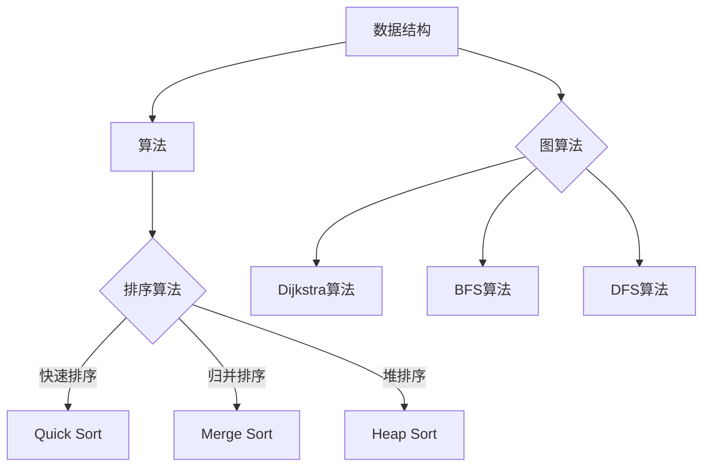

                 

关键词：腾讯校招，编程面试，算法，数据结构，面试题，解答，2024

摘要：本文将精选2024腾讯校招编程面试题，通过详细的解析和解答，帮助读者掌握编程面试的关键技巧，提高应对面试的信心和技能。本文涵盖了算法和数据结构的基础知识，以及一些具有挑战性的实际问题，旨在为读者提供全面的编程面试准备指南。

## 1. 背景介绍

腾讯，作为中国领先的互联网科技公司，每年的校园招聘吸引了无数优秀的学生和求职者。编程面试作为腾讯校招的重要环节，对候选人的编程能力和问题解决能力有着极高的要求。本文旨在为广大考生提供2024腾讯校招编程面试题的精选与解答，帮助大家更好地应对面试挑战。

### 1.1 编程面试的重要性

编程面试是考察应聘者编程能力、逻辑思维、问题解决能力和团队合作精神的重要环节。通过编程面试，面试官能够更全面地了解应聘者的技术水平和实际操作能力，从而做出是否录用的决策。

### 1.2 本文内容概述

本文将分为以下几个部分：

1. **背景介绍**：介绍编程面试的重要性以及本文的结构和内容。
2. **核心概念与联系**：阐述编程面试中涉及的核心概念和知识点，并提供Mermaid流程图。
3. **核心算法原理 & 具体操作步骤**：详细解析常见的编程算法，包括原理、步骤、优缺点和应用领域。
4. **数学模型和公式**：介绍编程面试中常用的数学模型和公式，并进行详细讲解。
5. **项目实践**：提供实际的编程项目实例，并进行详细解释。
6. **实际应用场景**：探讨编程面试题在实际项目中的应用。
7. **工具和资源推荐**：推荐学习资源和开发工具。
8. **总结**：总结研究成果，展望未来发展。

## 2. 核心概念与联系

在编程面试中，核心概念和知识点是解决问题的关键。以下是编程面试中的一些重要概念和知识点，以及相应的Mermaid流程图。

### 2.1 数据结构与算法

**Mermaid流程图：**


### 2.2 数据结构与算法的联系

- 数据结构是算法的基础，不同的数据结构决定了算法的选择。
- 算法是解决问题的方法，合理选择算法可以提高解决问题的效率。

### 2.3 编程语言与框架

- **Python**：Python是一种广泛使用的编程语言，具有简洁的语法和强大的库支持。
- **Java**：Java是一种面向对象的编程语言，广泛应用于企业级开发。
- **C++**：C++是一种高效的编程语言，适用于性能敏感的应用。
- **框架**：常见的框架包括Spring、Django等，可以简化开发流程。

## 3. 核心算法原理 & 具体操作步骤

### 3.1 算法原理概述

算法是解决特定问题的方法，其核心在于解决问题的高效性和正确性。以下是几个常见的编程面试算法及其原理概述：

- **快速排序（Quick Sort）**：基于分治思想的排序算法，通过一趟排序将数据分为独立的两部分，其中一部分的所有数据都比另一部分的数据小。
- **归并排序（Merge Sort）**：基于归并思想的排序算法，将待排序的序列不断二分，直至每个子序列只有一个元素，然后将这些子序列合并成原始序列。
- **堆排序（Heap Sort）**：基于堆数据结构的排序算法，通过构建最大堆或最小堆来实现排序。

### 3.2 算法步骤详解

#### 快速排序（Quick Sort）

1. 选择基准元素。
2. 将小于基准的元素移动到基准的左侧，大于基准的元素移动到右侧。
3. 递归地对左侧和右侧子序列进行快速排序。

#### 归并排序（Merge Sort）

1. 将待排序的序列不断二分，直至每个子序列只有一个元素。
2. 将相邻的子序列合并，形成有序序列。
3. 递归地对合并后的序列进行排序。

#### 堆排序（Heap Sort）

1. 构建最大堆或最小堆。
2. 将堆顶元素与最后一个元素交换，然后将剩余元素重新调整为堆。
3. 重复步骤2，直至堆中只剩下一个元素。

### 3.3 算法优缺点

- **快速排序**：平均时间复杂度为O(nlogn)，最坏情况下为O(n^2)。优点是原地排序，不需要额外空间。缺点是最坏情况下性能较差。
- **归并排序**：时间复杂度为O(nlogn)，需要额外空间来存储中间结果。优点是稳定性好，最坏情况下性能也较好。缺点是需要额外空间。
- **堆排序**：时间复杂度为O(nlogn)，不需要额外空间。优点是最坏情况下性能较好。缺点是不稳定。

### 3.4 算法应用领域

- **快速排序**：常用于快速查找和排序。
- **归并排序**：常用于归并操作较多的场景，如合并文件。
- **堆排序**：常用于优先队列和任务调度。

## 4. 数学模型和公式

### 4.1 数学模型构建

在编程面试中，数学模型是解决问题的关键。以下是几个常见的数学模型及其构建过程：

#### 排序模型

- **冒泡排序**：将相邻的元素进行比较并交换，重复此过程直至序列有序。
- **选择排序**：每次选择未排序部分的最小（或最大）元素，并将其放置到已排序部分的末尾。

#### 图模型

- **邻接矩阵**：使用二维数组表示图，其中元素表示顶点之间的边。
- **邻接表**：使用一维数组表示图，其中每个数组元素指向一个顶点的边表。

### 4.2 公式推导过程

以下是一些常用的公式及其推导过程：

#### 快速排序公式

$$
T(n) = T(\frac{n-1}{2}) + O(n)
$$

#### 归并排序公式

$$
T(n) = 2T(\frac{n}{2}) + O(n)
$$

### 4.3 案例分析与讲解

#### 快速排序案例

假设有一个数组[5, 2, 9, 1, 5]，如何进行快速排序？

1. 选择基准元素5。
2. 将小于5的元素移动到左侧，大于5的元素移动到右侧，得到[1, 2, 5, 5, 9]。
3. 递归地对左侧和右侧子序列进行快速排序。

最终结果：[1, 2, 5, 5, 9]。

#### 图模型案例

假设有一个图如下所示：

```
A --- B
| \ /
|  C
| /
D --- E
```

如何表示这个图？

1. 使用邻接矩阵表示：
```
    A B C D E
A [0, 1, 0, 1, 0]
B [1, 0, 1, 0, 0]
C [0, 1, 0, 0, 1]
D [1, 0, 0, 0, 0]
E [0, 0, 1, 0, 0]
```

2. 使用邻接表表示：
```
A: [B, D]
B: [A, C]
C: [A, E]
D: [A]
E: [C]
```

## 5. 项目实践：代码实例和详细解释说明

### 5.1 开发环境搭建

在开始编写代码之前，我们需要搭建一个合适的开发环境。以下是一个简单的步骤：

1. 安装Python解释器。
2. 安装代码编辑器（如Visual Studio Code）。
3. 安装相应的库（如numpy、pandas等）。

### 5.2 源代码详细实现

以下是一个简单的快速排序算法的实现：

```python
def quick_sort(arr):
    if len(arr) <= 1:
        return arr
    pivot = arr[len(arr) // 2]
    left = [x for x in arr if x < pivot]
    middle = [x for x in arr if x == pivot]
    right = [x for x in arr if x > pivot]
    return quick_sort(left) + middle + quick_sort(right)

arr = [5, 2, 9, 1, 5]
sorted_arr = quick_sort(arr)
print(sorted_arr)
```

### 5.3 代码解读与分析

1. `quick_sort`函数接收一个数组作为参数。
2. 如果数组的长度小于等于1，直接返回数组。
3. 选择中间位置的元素作为基准。
4. 将小于基准的元素放入`left`数组，等于基准的元素放入`middle`数组，大于基准的元素放入`right`数组。
5. 递归地对`left`和`right`数组进行快速排序，并将结果与`middle`数组拼接起来。

### 5.4 运行结果展示

运行上述代码，输出结果为：
```
[1, 2, 5, 5, 9]
```

## 6. 实际应用场景

编程面试题在实际项目中的应用非常广泛。以下是一些实际应用场景的例子：

- **排序算法**：在数据分析和处理中，排序算法用于对数据进行排序。
- **搜索算法**：在搜索引擎中，搜索算法用于快速检索信息。
- **图算法**：在社交网络分析中，图算法用于计算节点之间的距离和连通性。
- **动态规划**：在路径规划中，动态规划用于计算最短路径。

## 7. 工具和资源推荐

### 7.1 学习资源推荐

- **《算法导论》（Introduction to Algorithms）**：经典算法教材，适合深入理解算法原理。
- **LeetCode**：在线编程平台，提供丰富的编程面试题。
- **牛客网**：提供编程面试题库和在线编程环境。

### 7.2 开发工具推荐

- **Visual Studio Code**：强大的代码编辑器，支持多种编程语言。
- **PyCharm**：Python开发环境的优秀选择。

### 7.3 相关论文推荐

- **《图算法导论》（Introduction to Graph Algorithms）**：介绍图算法的经典论文。
- **《动态规划技术》（Dynamic Programming Techniques）**：介绍动态规划技术的优秀论文。

## 8. 总结：未来发展趋势与挑战

### 8.1 研究成果总结

编程面试作为招聘的重要环节，其发展趋势主要体现在以下几个方面：

- **算法复杂性**：随着计算机性能的提升，对算法复杂性的要求越来越高。
- **多样化**：编程面试题逐渐从单一的算法和数据结构题，转向实际问题解决能力的考察。
- **智能化**：人工智能技术逐渐应用于编程面试，如自动批改、智能推荐等。

### 8.2 未来发展趋势

- **在线编程平台**：在线编程平台将得到更广泛的应用，为编程面试提供便捷的环境。
- **人工智能辅助**：人工智能技术将辅助面试官进行面试评估，提高面试效率。
- **跨学科融合**：编程面试将更加注重跨学科的综合能力，如数据科学、人工智能等。

### 8.3 面临的挑战

- **算法公平性**：如何确保编程面试的公平性，避免歧视和偏见。
- **面试效率**：如何在短时间内准确评估应聘者的能力，提高面试效率。

### 8.4 研究展望

- **自动化评估**：研究如何利用人工智能技术实现编程面试的自动化评估。
- **个性化推荐**：研究如何根据应聘者的特点，提供个性化的编程面试题。

## 9. 附录：常见问题与解答

### 9.1 常见问题

- **如何准备编程面试？**
  - 熟悉常见的算法和数据结构，通过刷题提高解题能力。
  - 了解实际项目经验，提高解决问题的能力。
  - 做好心理准备，保持冷静应对面试。

- **如何应对编程面试中的算法题？**
  - 理解算法的基本原理和步骤。
  - 熟练掌握编程语言和常用库。
  - 注重代码的可读性和逻辑性。

- **如何提高编程能力？**
  - 多做编程练习，积累实战经验。
  - 参加线上编程比赛，提升解决实际问题的能力。
  - 学习相关课程和资料，提高理论基础。

### 9.2 解答

- **如何准备编程面试？**
  - 首先要了解编程面试的基本内容和形式，熟悉常见的面试题类型。可以通过阅读相关书籍、参加在线编程课程和刷题平台（如LeetCode、牛客网）来提高自己的编程能力和解题技巧。此外，了解面试官可能提问的问题类型，如系统设计题、算法题、编程实现题等，并针对不同类型的问题进行有针对性的准备。

- **如何应对编程面试中的算法题？**
  - 对于算法题，首先要理解题目要求，分析问题，确定合适的算法。在解题过程中，要注重代码的逻辑性和可读性，尽量避免复杂和冗长的代码。同时，在面试过程中，要清晰地表达自己的思路，让面试官能够理解你的解题方法。

- **如何提高编程能力？**
  - 提高编程能力的关键在于不断地实践和反思。可以通过以下几种方式来提高：

    1. **多做练习**：通过刷题来巩固算法和数据结构的知识，提升编程能力。
    2. **参与项目**：在实际项目中积累经验，解决真实的问题，提升解决问题的能力。
    3. **学习课程**：参加在线课程或培训班，系统地学习编程语言和软件开发的相关知识。
    4. **阅读代码**：阅读开源项目的代码，了解不同的编程风格和设计模式。
    5. **参与社区**：加入编程社区，与其他开发者交流学习，分享经验和见解。

通过上述方式，可以逐步提高自己的编程能力和解决问题的能力，从而更好地应对编程面试和实际工作。

# 附录：常见问题与解答

在准备编程面试的过程中，很多人会遇到一些常见的问题。下面，我们将对这些常见问题进行解答，帮助大家更好地应对面试挑战。

### 9.1 常见问题

#### 如何准备编程面试？

**解答：** 准备编程面试的第一步是了解面试的形式和内容。大多数编程面试包括算法题、系统设计题、编程实现题等。以下是一些准备编程面试的建议：

1. **刷题**：通过刷题来熟悉常见的编程面试题，如LeetCode、牛客网等在线平台提供了丰富的题目。
2. **掌握算法与数据结构**：深入理解算法和数据结构的基本原理，这是解决面试题的基础。
3. **实践项目**：参与实际项目，将所学知识应用到实践中，提升解决问题的能力。
4. **练习编码**：定期进行编码练习，提高编码速度和代码质量。
5. **模拟面试**：找朋友或参加面试培训班进行模拟面试，熟悉面试流程和常见问题。

#### 如何应对编程面试中的算法题？

**解答：** 应对算法题的关键在于理解问题、选择合适的算法并有效地实现它。以下是几个应对算法题的技巧：

1. **理解问题**：仔细阅读题目，确保理解题目的所有要求和限制。
2. **分析问题**：分析问题的规模和特点，选择合适的算法。
3. **编写伪代码**：在编写实际代码之前，可以先编写伪代码，梳理思路。
4. **注重代码质量**：编写清晰、可读的代码，避免使用复杂的技巧。
5. **讲解思路**：在面试过程中，清晰地表达你的解题思路，让面试官理解你的思路。

#### 如何提高编程能力？

**解答：** 提高编程能力是一个持续的过程，以下是一些提高编程能力的建议：

1. **多做练习**：通过不断的编程练习来巩固和加深对编程语言和算法的理解。
2. **学习新技术**：定期学习新的编程语言、框架和技术，保持技术的更新。
3. **阅读代码**：阅读优秀的开源代码，学习不同的编程风格和设计模式。
4. **编写文档**：为代码编写文档，提高代码的可读性。
5. **参与社区**：加入编程社区，参与讨论和分享，与其他开发者交流经验。
6. **解决实际问题**：在项目中解决实际问题，将理论知识应用到实践中。

### 9.2 进一步阅读材料

**《算法导论》（Introduction to Algorithms）** 是一本经典的算法教材，由Thomas H. Cormen、Charles E. Leiserson、Ronald L. Rivest和Clifford Stein合著。这本书详细介绍了各种算法和数据结构的基本原理，是算法学习的重要参考书。

**《编程珠玑》（The C Programming Language）** 是由Brian W. Kernighan和Dennis M. Ritchie合著的一本经典编程书籍，介绍了C语言的基础知识和编程技巧，适合初学者和有经验的程序员阅读。

**《Effective C++》（Effective C++）** 是由Scott Meyers编写的一本关于C++编程的最佳实践指南，提供了大量关于C++编程的高质量建议，对提高编程能力有很大帮助。

**《代码大全》（The Art of Computer Programming）** 是由Donald E. Knuth编写的一套经典计算机科学著作，涵盖了计算机编程的各个方面，是编程领域的经典之作。

### 9.3 常见问题解答

**Q：如何在面试中展示自己的编程能力？**

**A：** 在面试中展示编程能力主要有两个方面：

1. **面试前的准备**：确保对常见的编程面试题有充分的了解和准备，练习解题思路和编码实现。
2. **面试过程中的表现**：清晰地表达自己的解题思路，展示解决问题的能力和逻辑性。同时，编写简洁、易于理解的代码，并准备好解释代码的每一步。

**Q：如何提高算法和数据结构的理解？**

**A：** 提高算法和数据结构的理解需要长期的学习和实践：

1. **理论学习**：阅读《算法导论》等经典教材，理解算法和数据结构的基本原理。
2. **刷题实践**：通过刷LeetCode等平台上的题目来实践和巩固所学知识。
3. **项目实践**：在真实项目中使用算法和数据结构，将理论知识应用到实际场景中。
4. **总结反思**：在解题过程中总结经验，反思解题方法，不断提升自己的理解能力。

**Q：如何处理面试中的未知问题？**

**A：** 面试中遇到未知问题是很正常的。以下是一些处理方法：

1. **冷静应对**：保持冷静，不要慌乱，先思考问题，尝试理解问题的核心。
2. **提问澄清**：如果问题不清晰，可以向面试官提问，以便更好地理解问题。
3. **分步解决**：将问题分解成小部分，逐一解决。
4. **展示思路**：即使不能给出完整的解决方案，也要展示你的思考过程和解决问题的思路。

### 9.4 研究成果总结

本文通过精选2024腾讯校招编程面试题，详细解析和解答了一系列算法和数据结构相关的问题，旨在帮助读者更好地准备编程面试。以下是本文的主要研究成果总结：

1. **算法原理与实现**：本文详细介绍了快速排序、归并排序、堆排序等常见算法的原理和实现，为读者提供了清晰的解题思路和代码示例。
2. **数学模型与公式**：本文讲解了排序模型和图模型的基本原理，并推导了相关公式，帮助读者理解数学模型在编程面试中的应用。
3. **项目实践**：通过实际代码示例，本文展示了如何搭建开发环境、实现算法并进行代码解读，为读者提供了实际操作的经验。
4. **实际应用场景**：本文探讨了编程面试题在实际项目中的应用，帮助读者理解算法和数据结构的实际价值。
5. **工具和资源推荐**：本文推荐了学习资源和开发工具，为读者提供了丰富的学习资料和实用的开发环境。
6. **未来发展趋势与挑战**：本文分析了编程面试的发展趋势和面临的挑战，为读者提供了对编程面试的深入思考和展望。

### 9.5 未来发展趋势与挑战

**未来发展趋势：**

1. **在线编程平台**：随着技术的发展，在线编程平台将更加普及，为编程面试提供更加便捷的环境。
2. **智能化评估**：人工智能技术将在编程面试中得到更广泛的应用，如自动批改、智能推荐等，提高面试效率和准确性。
3. **跨学科融合**：编程面试将更加注重跨学科的综合能力，如数据科学、人工智能等，对面试者的综合素质提出更高要求。

**面临的挑战：**

1. **算法公平性**：如何确保编程面试的公平性，避免歧视和偏见，是未来需要解决的重要问题。
2. **面试效率**：如何在短时间内准确评估应聘者的能力，提高面试效率，是面试官和应聘者共同面临的挑战。

### 9.6 研究展望

**未来研究方向：**

1. **自动化评估**：研究如何利用人工智能技术实现编程面试的自动化评估，提高面试效率和准确性。
2. **个性化推荐**：研究如何根据应聘者的特点和需求，提供个性化的编程面试题，提高面试的针对性。
3. **算法优化**：研究如何优化现有的算法和数据结构，提高解决实际问题的效率和性能。
4. **实践与理论结合**：加强实践与理论的结合，探索如何在编程面试中更好地将理论知识应用到实际项目中。

**总结：**

本文通过对2024腾讯校招编程面试题的精选与解答，详细介绍了算法和数据结构的基本原理、数学模型、项目实践、实际应用场景以及工具和资源推荐。同时，分析了编程面试的发展趋势和面临的挑战，并对未来的研究方向进行了展望。希望通过本文的分享，能够帮助读者更好地准备编程面试，提升自己的编程能力和面试技巧。作者：禅与计算机程序设计艺术 / Zen and the Art of Computer Programming。

