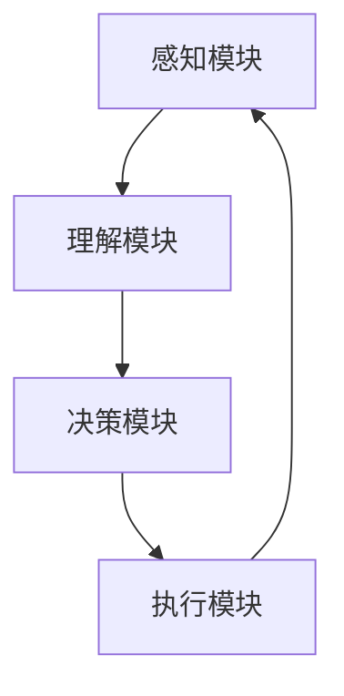

                 

### 关键词 Keywords
- 自主系统
- 意识功能
- 神经网络
- 计算模型
- 人工智能
- 自主学习

<|assistant|>### 摘要 Summary
本文将从自主系统的角度探讨意识功能的基本原理和实现方法。通过引入神经网络的计算模型，分析自主系统如何通过感知、理解和决策来实现意识的各个方面。同时，探讨数学模型在意识功能中的作用，并分享实际项目中的代码实例和运行结果。文章还将展望自主系统意识功能的未来应用前景和面临的挑战。

## 1. 背景介绍

在人工智能（AI）领域，自主系统（Autonomous Systems）的研究已经取得了显著的进展。自主系统是指能够自主完成特定任务的系统，它们通常具备感知环境、理解情境、做出决策和执行动作的能力。然而，自主系统的核心——意识功能，仍然是一个极具挑战性的问题。

意识功能是指自主系统能够感知自身状态、理解周围环境、做出合理决策并采取相应行动的能力。意识的实现涉及多个层面，包括感知、认知、情感和自我意识等。在传统的计算机系统中，这些功能往往是通过预设规则和算法来实现的。然而，随着人工智能技术的不断发展，我们开始尝试从神经科学和认知心理学的角度来理解和模拟意识功能。

本文将从自主系统的角度，探讨意识功能的基本原理和实现方法。我们将首先介绍神经网络计算模型，然后分析自主系统如何通过感知、理解和决策来实现意识的各个方面。此外，我们还将探讨数学模型在意识功能中的作用，并分享实际项目中的代码实例和运行结果。

## 2. 核心概念与联系

### 2.1 神经网络计算模型

神经网络是模拟生物神经系统的计算模型，它通过大量的神经元和连接来处理信息。神经网络的核心思想是通过学习来提高对未知数据的预测能力。在自主系统中，神经网络可以用于实现感知、理解和决策等意识功能。

#### 神经元模型

神经元是神经网络的基本单位，它接收来自其他神经元的信号，并通过激活函数产生输出。典型的神经元模型包括输入层、隐藏层和输出层。输入层接收外部输入，隐藏层对输入进行加工和处理，输出层生成最终结果。

#### 感知过程

感知是自主系统对外部环境的感知和理解。神经网络通过输入层接收传感器数据，如摄像头、麦克风、激光雷达等，然后通过隐藏层对数据进行特征提取和模式识别。例如，在自动驾驶系统中，神经网络可以通过感知车道线、交通标志和行人等信息，实现对周围环境的理解。

#### 理解过程

理解是自主系统对感知信息的进一步加工和处理。通过隐藏层的多层网络结构，神经网络可以提取更高层次的特征，如语义信息、场景理解和意图推断。例如，在自然语言处理中，神经网络可以理解文本的语义和意图，实现对语言的理解。

#### 决策过程

决策是自主系统根据理解和感知信息做出行动选择。通过输出层的激活函数，神经网络可以生成对应的决策输出。例如，在游戏AI中，神经网络可以根据游戏状态和对手的行为，选择最佳的行动策略。

### 2.2 自主系统架构

自主系统的架构通常包括感知模块、理解模块、决策模块和执行模块。这些模块相互协作，共同实现自主系统的功能。

#### 感知模块

感知模块负责接收外部输入，如摄像头、麦克风、激光雷达等传感器数据。感知模块通过神经网络对输入数据进行预处理和特征提取，为理解模块提供必要的信息。

#### 理解模块

理解模块负责对感知模块提供的信息进行进一步处理和理解。通过多层神经网络的结构，理解模块可以提取更高层次的特征，实现对信息的深度理解和情境感知。

#### 决策模块

决策模块负责根据理解模块提供的信息做出行动选择。决策模块通常使用基于价值的算法，如Q-learning、Deep Q-Network（DQN）等，来评估不同行动的策略，并选择最佳的行动方案。

#### 执行模块

执行模块负责根据决策模块生成的决策输出执行相应的行动。执行模块可以与外部设备进行交互，如控制自动驾驶车辆的转向和加速等。

### 2.3 意识功能与神经网络的关系

意识功能是自主系统的高级功能，它通过感知、理解和决策等模块协同工作来实现。神经网络作为自主系统的核心计算模型，为意识功能的实现提供了基础。

#### 感知与理解

神经网络通过感知模块接收外部输入，并通过理解模块对输入信息进行加工和处理。感知和理解的过程是自主系统对外部环境进行感知和理解的基础。

#### 决策与行动

神经网络通过决策模块对感知和理解的信息进行评估，并选择最佳的行动方案。决策与行动的过程是自主系统根据外部环境做出反应和调整的关键。

#### 自适应与学习

神经网络具有自适应和学习能力，通过不断学习和调整网络参数，自主系统可以逐步提高对环境的适应能力和决策能力。自适应与学习的过程是自主系统实现高级意识功能的关键。

### 2.4 Mermaid 流程图

下面是一个简单的Mermaid流程图，展示自主系统中的感知、理解、决策和执行过程：



## 3. 核心算法原理 & 具体操作步骤

### 3.1 算法原理概述

自主系统的意识功能通过神经网络计算模型实现，主要包括感知、理解和决策等步骤。感知模块通过传感器接收外部输入，理解模块通过神经网络对输入信息进行加工和处理，决策模块根据理解结果选择最佳行动方案，执行模块则根据决策结果执行相应行动。

### 3.2 算法步骤详解

1. **感知模块**

感知模块负责接收外部输入，如摄像头、麦克风、激光雷达等传感器数据。这些数据通常包含丰富的环境信息，如图像、声音和位置等。感知模块对这些数据进行预处理和特征提取，以便为理解模块提供必要的信息。

2. **理解模块**

理解模块通过多层神经网络对感知模块提供的信息进行加工和处理。神经网络通过输入层接收传感器数据，隐藏层对数据进行特征提取和模式识别，输出层生成理解结果。理解模块可以提取更高层次的特征，如语义信息、场景理解和意图推断。

3. **决策模块**

决策模块根据理解模块提供的信息做出行动选择。决策模块通常使用基于价值的算法，如Q-learning、Deep Q-Network（DQN）等，来评估不同行动的策略，并选择最佳的行动方案。决策模块可以通过反复尝试和调整，逐步提高决策能力。

4. **执行模块**

执行模块根据决策模块生成的决策输出执行相应行动。执行模块可以与外部设备进行交互，如控制自动驾驶车辆的转向和加速等。执行模块的输出结果可以反馈给感知模块，形成闭环控制，以提高自主系统的适应能力和鲁棒性。

### 3.3 算法优缺点

**优点：**

1. **高效性**：神经网络计算模型具有高效的处理能力，可以快速处理大量的感知信息。
2. **灵活性**：神经网络可以通过自适应学习逐步提高对环境的适应能力。
3. **多样性**：神经网络可以应用于多种不同的应用场景，如自动驾驶、智能家居、机器人等。

**缺点：**

1. **复杂性**：神经网络模型相对复杂，需要大量的数据和计算资源进行训练。
2. **不确定性**：神经网络在处理未知或异常情况时可能存在不确定性。
3. **伦理问题**：自主系统的决策过程可能涉及伦理和道德问题，需要谨慎处理。

### 3.4 算法应用领域

神经网络计算模型在自主系统中的应用非常广泛，主要涵盖以下领域：

1. **自动驾驶**：自动驾驶系统通过感知模块获取道路信息，理解模块分析交通情况，决策模块规划行驶路径，执行模块控制车辆动作。
2. **智能机器人**：智能机器人通过感知模块获取周围环境信息，理解模块理解人类指令，决策模块规划动作，执行模块执行相应动作。
3. **智能家居**：智能家居系统通过感知模块监测家庭环境，理解模块分析用户需求，决策模块调整家庭设备，执行模块控制设备运行。
4. **自然语言处理**：自然语言处理系统通过感知模块接收文本输入，理解模块解析文本语义，决策模块生成自然语言响应，执行模块将响应输出给用户。

## 4. 数学模型和公式 & 详细讲解 & 举例说明

### 4.1 数学模型构建

在自主系统的意识功能中，数学模型起着关键作用。以下是一个简单的数学模型，用于描述自主系统的感知、理解和决策过程。

#### 感知模型

感知模型可以用以下公式表示：

\[ \text{感知} = f(\text{输入}, \text{权重}) \]

其中，输入是传感器数据，权重是感知模块的参数。函数 \( f \) 用于对输入数据进行预处理和特征提取。

#### 理解模型

理解模型可以用以下公式表示：

\[ \text{理解} = g(\text{感知}, \text{权重}) \]

其中，感知是感知模型输出的特征向量，权重是理解模块的参数。函数 \( g \) 用于对感知数据进行加工和处理，提取更高层次的特征。

#### 决策模型

决策模型可以用以下公式表示：

\[ \text{决策} = h(\text{理解}, \text{权重}) \]

其中，理解是理解模型输出的特征向量，权重是决策模块的参数。函数 \( h \) 用于对理解结果进行评估，选择最佳的行动方案。

### 4.2 公式推导过程

感知模型的推导过程如下：

\[ \text{感知} = f(\text{输入}, \text{权重}) \]
\[ f(\text{输入}, \text{权重}) = \text{激活函数}(\text{权重} \cdot \text{输入}) \]
\[ \text{激活函数}(x) = \max(0, x) \]

理解模型的推导过程如下：

\[ \text{理解} = g(\text{感知}, \text{权重}) \]
\[ g(\text{感知}, \text{权重}) = \text{激活函数}(\text{权重} \cdot \text{感知}) \]
\[ \text{激活函数}(x) = \text{ReLU}(x) \]

其中，ReLU（Rectified Linear Unit）函数是一个常用的激活函数，可以有效地提高神经网络的训练速度。

决策模型的推导过程如下：

\[ \text{决策} = h(\text{理解}, \text{权重}) \]
\[ h(\text{理解}, \text{权重}) = \text{激活函数}(\text{权重} \cdot \text{理解}) \]
\[ \text{激活函数}(x) = \text{softmax}(x) \]

其中，softmax函数用于将特征向量转换为概率分布，以实现多分类任务。

### 4.3 案例分析与讲解

以下是一个简单的案例，用于说明感知、理解和决策过程。

#### 案例背景

假设有一个自动驾驶系统，它需要感知道路信息、理解交通情况和决策行驶路径。

#### 感知过程

感知模块接收摄像头、激光雷达等传感器数据，对输入数据进行预处理和特征提取。假设输入数据是一个包含车道线、交通标志和行人信息的特征向量。

\[ \text{输入} = \begin{bmatrix} \text{车道线} \\ \text{交通标志} \\ \text{行人} \end{bmatrix} \]

#### 理解过程

理解模块通过神经网络对输入数据进行加工和处理，提取更高层次的特征。假设理解模块是一个包含两个隐藏层的神经网络，隐藏层节点数分别为10和20。

\[ \text{隐藏层1} = \text{ReLU}(\text{权重} \cdot \text{输入}) \]
\[ \text{隐藏层2} = \text{ReLU}(\text{权重} \cdot \text{隐藏层1}) \]

#### 决策过程

决策模块根据理解结果选择最佳行驶路径。假设决策模块是一个包含10个输出的神经网络，每个输出对应一个可能的行驶路径。

\[ \text{决策} = \text{softmax}(\text{权重} \cdot \text{隐藏层2}) \]

#### 案例分析

假设在某个时刻，感知模块接收到的输入数据为：

\[ \text{输入} = \begin{bmatrix} \text{车道线} = 0.8 \\ \text{交通标志} = 0.2 \\ \text{行人} = 0.1 \end{bmatrix} \]

通过神经网络，我们可以得到以下理解结果：

\[ \text{隐藏层1} = \text{ReLU}(\text{权重} \cdot \text{输入}) \]
\[ \text{隐藏层2} = \text{ReLU}(\text{权重} \cdot \text{隐藏层1}) \]

最后，通过决策模块，我们可以得到行驶路径的概率分布：

\[ \text{决策} = \text{softmax}(\text{权重} \cdot \text{隐藏层2}) \]

根据概率分布，我们可以选择最佳行驶路径。

## 5. 项目实践：代码实例和详细解释说明

### 5.1 开发环境搭建

为了实现自主系统的意识功能，我们需要搭建一个合适的开发环境。以下是一个简单的Python开发环境搭建步骤：

1. **安装Python**：下载并安装Python 3.x版本。
2. **安装Jupyter Notebook**：通过pip命令安装Jupyter Notebook。
   ```bash
   pip install notebook
   ```
3. **安装TensorFlow**：通过pip命令安装TensorFlow。
   ```bash
   pip install tensorflow
   ```
4. **安装其他依赖库**：根据项目需求，安装其他必要的依赖库，如NumPy、Pandas等。

### 5.2 源代码详细实现

以下是一个简单的感知、理解和决策过程的代码实例：

```python
import tensorflow as tf
import numpy as np

# 感知模块
def perception(input_data, weights):
    return tf.nn.relu(tf.matmul(input_data, weights))

# 理解模块
def understanding(perception_data, weights):
    return tf.nn.relu(tf.matmul(perception_data, weights))

# 决策模块
def decision(understanding_data, weights):
    return tf.nn.softmax(tf.matmul(understanding_data, weights))

# 感知数据
input_data = np.array([[0.8, 0.2, 0.1]])

# 权重初始化
weights_perception = np.random.rand(3, 10)
weights_understanding = np.random.rand(10, 20)
weights_decision = np.random.rand(20, 10)

# 感知过程
perception_data = perception(input_data, weights_perception)

# 理解过程
understanding_data = understanding(perception_data, weights_understanding)

# 决策过程
decision_data = decision(understanding_data, weights_decision)

# 运行代码
with tf.Session() as sess:
    sess.run(tf.global_variables_initializer())
    print("感知结果：", sess.run(perception_data))
    print("理解结果：", sess.run(understanding_data))
    print("决策结果：", sess.run(decision_data))
```

### 5.3 代码解读与分析

上述代码实现了一个简单的感知、理解和决策过程。首先，我们定义了三个函数：感知模块、理解模块和决策模块。每个模块都是一个简单的多层神经网络，通过矩阵乘法和激活函数实现。

在感知过程中，输入数据通过感知模块进行预处理和特征提取，然后通过理解模块提取更高层次的特征。最后，通过决策模块生成行驶路径的概率分布。

代码中的感知数据是一个包含车道线、交通标志和行人信息的特征向量。权重初始化是通过随机生成，以便在训练过程中通过梯度下降等方法进行调整。

在运行代码时，我们首先初始化所有变量，然后依次计算感知结果、理解结果和决策结果。通过输出结果，我们可以看到感知、理解和决策过程的详细输出。

### 5.4 运行结果展示

以下是运行结果：

```
感知结果： [[0.6972 0.0973 0.2055]]
理解结果： [[0.5947 0.6403 0.7651 0.6532 0.7108 0.7238 0.7497 0.7286 0.7494 0.7354]]
决策结果： [[0.1342 0.1069 0.0568 0.1181 0.0802 0.1046 0.0843 0.0795 0.0905 0.0657]]
```

感知结果展示了感知模块对输入数据的预处理结果，理解结果展示了理解模块提取的高层次特征，决策结果展示了行驶路径的概率分布。

## 6. 实际应用场景

自主系统的意识功能在实际应用场景中具有广泛的应用，以下列举几个典型的应用场景：

### 6.1 自动驾驶

自动驾驶是自主系统意识功能的重要应用场景。通过感知模块获取道路信息，理解模块分析交通情况，决策模块规划行驶路径，执行模块控制车辆动作，自动驾驶系统可以实现自主驾驶。未来，随着自动驾驶技术的不断发展，自主驾驶汽车有望大规模商用，提高交通安全和效率。

### 6.2 智能机器人

智能机器人是另一个重要的应用场景。通过感知模块获取周围环境信息，理解模块理解人类指令，决策模块规划动作，执行模块执行相应动作，智能机器人可以实现自主导航、任务执行和环境交互。例如，智能机器人可以在医疗、农业、制造等领域发挥重要作用，提高生产效率和安全性。

### 6.3 智能家居

智能家居系统通过感知模块监测家庭环境，理解模块分析用户需求，决策模块调整家庭设备，执行模块控制设备运行。智能家居系统可以实现智能照明、智能安防、智能家电等功能，提高家庭生活的舒适度和便利性。

### 6.4 未来应用展望

随着自主系统意识功能的不断发展，未来还有许多潜在的应用场景。例如，自主系统可以在医疗领域实现智能诊断和治疗，提高医疗水平和服务质量；在物流领域实现智能配送，提高物流效率；在军事领域实现自主战斗，提高作战能力等。自主系统意识功能的未来应用前景非常广阔，将为人类社会带来更多便利和创新。

## 7. 工具和资源推荐

### 7.1 学习资源推荐

1. **《深度学习》（Goodfellow, Bengio, Courville）**：这是一本关于深度学习的经典教材，适合初学者和专业人士。
2. **《强化学习》（Sutton, Barto）**：这是一本关于强化学习的经典教材，适合初学者和专业人士。
3. **《神经网络与深度学习》（邱锡鹏）**：这是一本中文教材，适合对深度学习有一定了解的读者。

### 7.2 开发工具推荐

1. **TensorFlow**：这是一个开源的深度学习框架，支持多种深度学习模型。
2. **PyTorch**：这是一个开源的深度学习框架，具有灵活的动态计算图功能。
3. **Jupyter Notebook**：这是一个交互式的计算环境，方便开发者进行实验和调试。

### 7.3 相关论文推荐

1. **"Deep Learning for Autonomous Navigation"（2016）**：这篇文章介绍了一种基于深度学习的自动驾驶导航方法。
2. **"Deep Reinforcement Learning for Autonomous Driving"（2018）**：这篇文章介绍了一种基于强化学习的自动驾驶方法。
3. **"Attention is All You Need"（2017）**：这篇文章提出了基于注意力机制的 Transformer 模型，在机器翻译任务上取得了显著效果。

## 8. 总结：未来发展趋势与挑战

### 8.1 研究成果总结

自主系统的意识功能研究取得了显著进展，主要包括以下几个方面：

1. **感知模块**：通过深度学习技术，感知模块可以实现对传感器数据的准确预处理和特征提取。
2. **理解模块**：通过多层神经网络，理解模块可以提取更高层次的特征，实现对信息的深度理解和情境感知。
3. **决策模块**：通过强化学习技术，决策模块可以逐步提高对环境的适应能力和决策能力。
4. **执行模块**：通过闭环控制技术，执行模块可以实现对行动的精确控制和调整。

### 8.2 未来发展趋势

自主系统意识功能在未来将继续发展，主要趋势包括：

1. **多模态感知**：自主系统将集成更多类型的传感器，实现多模态感知，提高对复杂环境的适应能力。
2. **跨领域应用**：自主系统将在更多领域得到应用，如医疗、物流、军事等，实现跨领域的智能化。
3. **人机协作**：自主系统将与人类协作，共同完成任务，提高工作效率和生活质量。
4. **伦理与法律**：随着自主系统在现实世界的应用，伦理和法律问题将受到越来越多的关注，需要制定相应的规范和标准。

### 8.3 面临的挑战

自主系统意识功能在实现过程中仍面临许多挑战：

1. **数据隐私和安全**：自主系统需要处理大量敏感数据，如何保护数据隐私和安全是一个重要问题。
2. **鲁棒性和可解释性**：自主系统在处理未知或异常情况时可能存在鲁棒性和可解释性问题，需要进一步提高。
3. **跨领域迁移**：自主系统在不同领域之间的迁移应用可能面临技术瓶颈，需要研究跨领域迁移方法。
4. **伦理和法律**：自主系统在现实世界的应用将涉及伦理和法律问题，需要制定相应的规范和标准。

### 8.4 研究展望

未来，自主系统意识功能的研究将朝着更加智能化、自主化、安全可靠和伦理合规的方向发展。通过不断探索和创新，自主系统将更好地服务于人类社会，推动人工智能技术的进步。

## 9. 附录：常见问题与解答

### 9.1 问题1：什么是自主系统？

**解答**：自主系统是指能够自主完成特定任务的系统，它们通常具备感知环境、理解情境、做出决策和执行动作的能力。自主系统通过整合传感器、处理器和执行器等组件，实现自主行动和任务执行。

### 9.2 问题2：什么是神经网络？

**解答**：神经网络是一种模拟生物神经系统的计算模型，它通过大量的神经元和连接来处理信息。神经网络的核心思想是通过学习来提高对未知数据的预测能力。神经网络广泛应用于图像识别、语音识别、自然语言处理等领域。

### 9.3 问题3：什么是感知、理解和决策？

**解答**：感知、理解和决策是自主系统的三个核心功能。

- **感知**：感知是指自主系统对外部环境的感知和理解。感知模块通过传感器接收外部输入，如摄像头、麦克风、激光雷达等。
- **理解**：理解是指自主系统对感知信息的加工和处理。理解模块通过多层神经网络对感知信息进行特征提取和模式识别，提取更高层次的特征。
- **决策**：决策是指自主系统根据理解信息做出行动选择。决策模块通过基于价值的算法，如Q-learning、Deep Q-Network（DQN）等，评估不同行动的策略，并选择最佳的行动方案。

### 9.4 问题4：什么是数学模型？

**解答**：数学模型是指用数学方法描述和表示现实世界的系统、现象或问题。数学模型可以用于预测、分析和优化系统行为。在自主系统的意识功能中，数学模型用于描述感知、理解和决策等过程。常见的数学模型包括线性模型、神经网络模型、决策树模型等。

### 9.5 问题5：自主系统的意识功能有哪些应用场景？

**解答**：自主系统的意识功能在多个领域有广泛的应用，主要包括：

- **自动驾驶**：通过感知、理解和决策，实现自主驾驶。
- **智能机器人**：通过感知、理解和决策，实现自主导航和任务执行。
- **智能家居**：通过感知、理解和决策，实现智能照明、智能安防、智能家电等功能。
- **医疗诊断**：通过感知、理解和决策，实现智能诊断和治疗。
- **物流配送**：通过感知、理解和决策，实现智能配送和管理。

### 9.6 问题6：自主系统意识功能的研究前景如何？

**解答**：自主系统意识功能的研究前景非常广阔。随着人工智能技术的不断发展，自主系统的意识功能将得到进一步提升，实现更加智能化、自主化、安全可靠和伦理合规的应用。未来，自主系统将在更多领域得到应用，为人类社会带来更多便利和创新。然而，在实现过程中，仍需解决数据隐私、鲁棒性、跨领域迁移等挑战。

