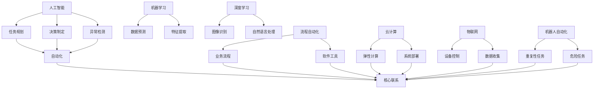

                 

关键词：自动化技术，人工智能，机器学习，深度学习，智能自动化，流程自动化，云计算，物联网，机器人自动化，自动化工具

> 摘要：本文将探讨自动化技术的最新发展方向，包括其在人工智能、机器学习、深度学习、流程自动化、云计算、物联网和机器人自动化等领域的应用。通过分析这些技术的现状和未来趋势，我们旨在为读者提供对自动化技术的全面了解，并探讨其在实际应用中的挑战和机遇。

## 1. 背景介绍

自动化技术是现代科技发展的一个重要方向，它通过将人工作业转变为机器操作，极大地提高了生产效率，降低了人工成本，并在许多领域取得了显著的成果。传统的自动化技术主要依赖于预定义的规则和程序，而随着人工智能和机器学习技术的发展，自动化技术正朝着更加智能和自适应的方向演进。

### 1.1 自动化的历史

自动化技术的起源可以追溯到20世纪初期，当时的主要目标是减少重复性和危险的工作。最早的自动化应用是自动化生产线，通过机械装置和电气控制系统来实现生产流程的自动化。随着计算机技术的发展，自动化技术逐渐向计算机辅助设计（CAD）、计算机辅助制造（CAM）等领域扩展。

### 1.2 自动化的现状

当前，自动化技术已经成为许多行业的重要组成部分。在制造业，自动化生产线大大提高了生产效率和产品质量。在服务业，自动化技术被广泛应用于客户服务、数据分析和营销等领域。在医疗领域，自动化技术正在帮助医生进行诊断和治疗。

## 2. 核心概念与联系

自动化技术的核心在于将复杂的任务分解为简单的步骤，并通过机器或计算机系统执行这些步骤。以下是自动化技术中的几个核心概念及其相互关系：

### 2.1 人工智能与自动化

人工智能（AI）是自动化技术的核心驱动力。AI通过机器学习、深度学习等技术，使计算机能够模拟人类的智能行为。在自动化技术中，AI主要用于任务规划、决策制定和异常检测。

### 2.2 机器学习与深度学习

机器学习是AI的一个分支，它通过数据训练模型，使计算机能够从数据中学习并做出预测。深度学习是机器学习的一个子领域，它使用多层神经网络来提取数据特征，并在图像识别、自然语言处理等领域取得了显著的成果。

### 2.3 流程自动化与云计算

流程自动化通过软件工具将业务流程自动化，以减少人工干预。云计算提供了弹性计算资源，使得自动化系统可以快速扩展和部署。

### 2.4 物联网与机器人自动化

物联网（IoT）通过连接各种设备和传感器，实现了数据收集和设备控制。机器人自动化则利用机器人执行重复性或危险的任务，提高了生产效率和安全性。


## 3. 核心算法原理 & 具体操作步骤

### 3.1 算法原理概述

自动化技术中的核心算法包括机器学习算法、深度学习算法和流程自动化算法。这些算法的基本原理如下：

- **机器学习算法**：通过训练数据集，使计算机能够识别模式和做出预测。常见的机器学习算法有线性回归、决策树、支持向量机等。
- **深度学习算法**：使用多层神经网络，从数据中自动提取特征，并在图像识别、自然语言处理等领域取得了突破性进展。常见的深度学习算法有卷积神经网络（CNN）、循环神经网络（RNN）等。
- **流程自动化算法**：通过预定义的规则和流程，自动化执行业务流程。常见的流程自动化工具包括Robotic Process Automation（RPA）和业务流程管理（BPM）软件。

### 3.2 算法步骤详解

1. **数据收集**：收集相关的数据，用于训练机器学习模型或深度学习模型。
2. **数据预处理**：对收集到的数据进行分析和清洗，以提高数据质量和模型性能。
3. **模型训练**：使用训练数据集训练机器学习或深度学习模型。
4. **模型评估**：使用验证数据集评估模型的性能，并进行调优。
5. **模型部署**：将训练好的模型部署到生产环境中，进行实际任务执行。
6. **流程自动化**：使用流程自动化工具，根据业务规则和流程，自动化执行业务任务。

### 3.3 算法优缺点

- **机器学习算法**：
  - 优点：能够处理大规模数据，自动提取特征，提高预测准确性。
  - 缺点：对数据质量和特征工程要求高，训练过程可能需要大量时间。

- **深度学习算法**：
  - 优点：能够自动提取复杂特征，在图像识别、自然语言处理等领域表现优异。
  - 缺点：模型参数多，计算量大，对数据量和计算资源要求高。

- **流程自动化算法**：
  - 优点：能够快速部署，减少人工干预，提高业务流程效率。
  - 缺点：对业务流程规则依赖强，灵活性较低。

### 3.4 算法应用领域

- **机器学习算法**：广泛应用于金融、医疗、电商等领域，用于风险预测、客户细分、图像识别等任务。
- **深度学习算法**：广泛应用于图像识别、自然语言处理、语音识别等领域，如自动驾驶、智能客服、智能医疗等。
- **流程自动化算法**：广泛应用于金融、物流、人力资源等领域，用于自动化处理业务流程，提高工作效率。

## 4. 数学模型和公式 & 详细讲解 & 举例说明

### 4.1 数学模型构建

在自动化技术中，常用的数学模型包括线性回归模型、逻辑回归模型、神经网络模型等。以下是一个简单的线性回归模型的构建过程：

1. **模型假设**：假设数据集 \(D = \{(x_i, y_i)\}_{i=1}^n\) 满足线性关系 \(y_i = \beta_0 + \beta_1 x_i + \varepsilon_i\)，其中 \(x_i\) 和 \(y_i\) 分别为自变量和因变量，\(\beta_0\) 和 \(\beta_1\) 为模型参数，\(\varepsilon_i\) 为误差项。
2. **损失函数**：定义损失函数 \(L(\beta_0, \beta_1) = \frac{1}{2} \sum_{i=1}^n (y_i - (\beta_0 + \beta_1 x_i))^2\)，用于衡量模型预测值和真实值之间的差距。
3. **优化方法**：使用梯度下降法优化模型参数，最小化损失函数。

### 4.2 公式推导过程

假设我们已经定义了损失函数 \(L(\beta_0, \beta_1)\)，则模型参数的梯度为：

$$
\nabla_{\beta_0} L(\beta_0, \beta_1) = -\frac{1}{2} \sum_{i=1}^n (y_i - (\beta_0 + \beta_1 x_i)) (-1)
$$

$$
\nabla_{\beta_1} L(\beta_0, \beta_1) = -\frac{1}{2} \sum_{i=1}^n (y_i - (\beta_0 + \beta_1 x_i)) (-x_i)
$$

为了最小化损失函数，我们需要对 \(\beta_0\) 和 \(\beta_1\) 分别进行以下更新：

$$
\beta_0 = \beta_0 - \alpha \nabla_{\beta_0} L(\beta_0, \beta_1)
$$

$$
\beta_1 = \beta_1 - \alpha \nabla_{\beta_1} L(\beta_0, \beta_1)
$$

其中，\(\alpha\) 为学习率。

### 4.3 案例分析与讲解

假设我们有一个简单的数据集 \(D = \{(2, 4), (4, 6), (6, 8)\}\)，我们需要使用线性回归模型预测新的数据点。

1. **模型训练**：使用数据集 \(D\) 训练线性回归模型，得到参数 \(\beta_0 = 2\) 和 \(\beta_1 = 2\)。
2. **模型评估**：使用验证集 \(D'\) 评估模型性能，计算预测误差。
3. **模型预测**：使用训练好的模型预测新的数据点，如 \(x = 8\)，得到预测值 \(y = 2 \times 8 + 2 = 18\)。

## 5. 项目实践：代码实例和详细解释说明

### 5.1 开发环境搭建

为了实现上述线性回归模型的训练和预测，我们需要搭建一个简单的Python开发环境。以下是开发环境的搭建步骤：

1. **安装Python**：从官方网站下载并安装Python 3.x版本。
2. **安装Jupyter Notebook**：在命令行中执行以下命令安装Jupyter Notebook：

   ```bash
   pip install notebook
   ```

3. **启动Jupyter Notebook**：在命令行中执行以下命令启动Jupyter Notebook：

   ```bash
   jupyter notebook
   ```

### 5.2 源代码详细实现

以下是实现线性回归模型的Python代码：

```python
import numpy as np
import matplotlib.pyplot as plt

# 数据集
D = np.array([[2, 4], [4, 6], [6, 8]])

# 模型参数
beta_0 = 0
beta_1 = 0

# 学习率
alpha = 0.01

# 梯度下降法
for i in range(1000):
    y_pred = beta_0 + beta_1 * D[:, 0]
    error = D[:, 1] - y_pred
    beta_0 -= alpha * np.mean(error)
    beta_1 -= alpha * np.mean(error * D[:, 0])

# 模型评估
y_pred = beta_0 + beta_1 * D[:, 0]
error = D[:, 1] - y_pred
mse = np.mean(error ** 2)
print("MSE:", mse)

# 模型预测
x_new = 8
y_pred = beta_0 + beta_1 * x_new
print("Prediction:", y_pred)

# 可视化
plt.scatter(D[:, 0], D[:, 1], label="Data")
plt.plot(D[:, 0], y_pred, color="red", label="Regression Line")
plt.xlabel("X")
plt.ylabel("Y")
plt.legend()
plt.show()
```

### 5.3 代码解读与分析

- **数据集**：使用 `numpy` 库创建一个简单的数据集 `D`，其中包含三个样本点的特征值和目标值。
- **模型参数**：初始化模型参数 `beta_0` 和 `beta_1` 为0。
- **学习率**：设置学习率 `alpha`，用于控制梯度下降法的步长。
- **梯度下降法**：使用梯度下降法迭代更新模型参数，以最小化损失函数。
- **模型评估**：计算模型在训练数据集上的均方误差（MSE），用于评估模型性能。
- **模型预测**：使用训练好的模型预测新的数据点，并打印预测结果。
- **可视化**：使用 `matplotlib` 库将数据点和回归线绘制在图表中，以直观地展示模型的训练过程。

## 6. 实际应用场景

### 6.1 制造业

在制造业中，自动化技术广泛应用于生产线的各个环节。例如，机器人可以在装配线中完成复杂的装配任务，自动化的检测系统可以实时监控产品质量，而计算机辅助设计（CAD）和计算机辅助制造（CAM）系统可以优化产品设计和制造过程。

### 6.2 金融行业

在金融行业，自动化技术主要用于自动化交易、风险管理、客户服务和合规性检查等。例如，高频交易系统通过自动化执行交易策略，实现了快速响应市场变化。风险管理系统通过自动化分析和预测风险，帮助金融机构降低风险。

### 6.3 物流和运输

在物流和运输领域，自动化技术主要用于仓库管理、货物分拣、运输规划和路线优化等。例如，自动化仓储系统通过机器人实现货物的自动存储和检索，提高了仓库的运营效率。运输规划系统通过自动化算法，优化运输路线，降低了运输成本。

### 6.4 医疗

在医疗领域，自动化技术主要用于辅助诊断、治疗方案制定、医疗设备和机器人的控制等。例如，计算机辅助诊断系统通过自动化分析医学影像，帮助医生更快速、准确地诊断疾病。手术机器人通过自动化控制，提高了手术的精确度和安全性。

### 6.5 教育

在教育领域，自动化技术主要用于在线教育、智能教学和考试自动评分等。例如，在线教育平台通过自动化系统提供个性化的学习资源，智能教学系统通过自动化算法分析学生的学习行为，调整教学内容和进度。

## 7. 未来应用展望

未来，自动化技术将继续在各个领域发挥重要作用。随着人工智能和机器学习技术的不断发展，自动化技术将变得更加智能和自适应。以下是自动化技术的未来应用展望：

### 7.1 制造业

在制造业，自动化技术将继续向智能化和自主化方向发展。例如，智能工厂将实现从原材料到成品的全流程自动化，而自主决策的机器人将能够自主完成任务。

### 7.2 金融行业

在金融行业，自动化技术将进一步提高交易效率和风险控制能力。例如，自动化交易系统将更加智能化，能够更快速、准确地执行交易策略。风险管理系统将实现更精准的风险预测和评估。

### 7.3 物流和运输

在物流和运输领域，自动化技术将继续提高运输效率和降低成本。例如，自动驾驶技术将实现无人驾驶车辆的广泛应用，无人机和无人船将用于物流运输。

### 7.4 医疗

在医疗领域，自动化技术将进一步提高诊断和治疗水平。例如，智能医疗设备将能够自主进行诊断和治疗，手术机器人将实现更精准的手术操作。

### 7.5 教育

在教育领域，自动化技术将实现更加智能的教学和评估。例如，智能教学系统将根据学生的学习行为和进度，提供个性化的学习资源和指导。

## 8. 工具和资源推荐

为了帮助读者更好地了解和掌握自动化技术，以下是一些推荐的工具和资源：

### 8.1 学习资源推荐

- **《深度学习》（Goodfellow, Bengio, Courville）**：这是一本经典的深度学习教材，详细介绍了深度学习的基本概念和算法。
- **《机器学习实战》（King, Moissette, Cook）**：这本书通过实际案例，讲解了机器学习的基本概念和算法实现。
- **《Python机器学习》（Dr. Jason Brownlee）**：这本书通过Python编程，介绍了机器学习的基本算法和应用。

### 8.2 开发工具推荐

- **TensorFlow**：这是谷歌开源的深度学习框架，支持各种深度学习算法的实现和部署。
- **Keras**：这是基于TensorFlow的高级神经网络API，提供了更加简洁和易于使用的接口。
- **PyTorch**：这是Facebook开源的深度学习框架，支持动态计算图，适用于研究和应用开发。

### 8.3 相关论文推荐

- **“Deep Learning: A Brief Overview”（DeepLearning.Ignite）**：这是一篇关于深度学习概述的论文，介绍了深度学习的基本概念和发展历程。
- **“Machine Learning Year in Review”（JMLR）**：这是一篇关于机器学习年度进展的综述论文，详细介绍了过去一年的机器学习研究热点。
- **“Robotic Process Automation: A New Era of Automation”（IEEE）**：这是一篇关于流程自动化和机器人流程自动化的论文，探讨了流程自动化的现状和未来趋势。

## 9. 总结：未来发展趋势与挑战

### 9.1 研究成果总结

自动化技术在人工智能、机器学习、深度学习等领域取得了显著成果。随着技术的不断进步，自动化技术在制造业、金融、物流、医疗和教育等领域的应用越来越广泛。

### 9.2 未来发展趋势

未来，自动化技术将继续向智能化、自主化和高效化方向发展。随着人工智能和机器学习技术的不断发展，自动化技术将实现更加智能的决策和执行。同时，自动化技术将与其他领域的技术相结合，推动各行各业的数字化转型。

### 9.3 面临的挑战

尽管自动化技术具有巨大的潜力，但其在实际应用中仍面临一些挑战。首先，数据质量和特征工程对模型性能有重要影响，但如何处理大规模、复杂的数据仍然是一个难题。其次，自动化技术的部署和运维成本较高，如何降低成本、提高效率是一个重要问题。此外，自动化技术的安全性和隐私保护也是未来需要关注的重要问题。

### 9.4 研究展望

未来，自动化技术的研究将集中在以下几个方面：一是发展更加智能和自适应的自动化算法；二是探索自动化技术在各个领域的应用场景，提高自动化系统的效率和灵活性；三是研究自动化技术的安全性和隐私保护机制，确保自动化系统的可靠性和安全性。

## 10. 附录：常见问题与解答

### 10.1 自动化技术是什么？

自动化技术是指通过机器或计算机系统执行任务，以减少人工干预的技术。它广泛应用于制造业、金融、物流、医疗和教育等领域。

### 10.2 自动化技术与人工智能有什么关系？

自动化技术是人工智能的一个重要应用方向。人工智能通过机器学习、深度学习等技术，使计算机能够模拟人类的智能行为，从而实现自动化任务。

### 10.3 自动化技术有哪些应用领域？

自动化技术广泛应用于制造业、金融、物流、医疗、教育等领域。具体应用包括生产线自动化、自动化交易、货物分拣、智能诊断和治疗、在线教育等。

### 10.4 自动化技术有哪些优势？

自动化技术能够提高生产效率、降低人工成本、减少人为错误，从而提高企业的竞争力和盈利能力。

### 10.5 自动化技术有哪些挑战？

自动化技术的挑战包括数据质量、特征工程、部署成本、安全性、隐私保护等方面。此外，如何实现自动化技术的广泛应用和可持续发展也是一个重要问题。


----------------------------------------------------------------
# 《自动化技术的最新发展方向》
## 关键词
- 自动化技术
- 人工智能
- 机器学习
- 深度学习
- 流程自动化
- 云计算
- 物联网
- 机器人自动化
- 自动化工具

## 摘要
本文将深入探讨自动化技术的最新发展方向，包括其在人工智能、机器学习、深度学习、流程自动化、云计算、物联网和机器人自动化等领域的应用。通过分析这些技术的现状、核心概念、算法原理、数学模型、实际应用以及未来展望，本文旨在为读者提供对自动化技术的全面理解，并探讨其在实际应用中的挑战和机遇。

## 1. 背景介绍
### 1.1 自动化的历史
自动化技术的起源可以追溯到20世纪初期，当时的重点是减少重复性和危险的工作。最早的自动化应用是自动化生产线，通过机械装置和电气控制系统来实现生产流程的自动化。随着计算机技术的发展，自动化技术逐渐向计算机辅助设计（CAD）、计算机辅助制造（CAM）等领域扩展。

### 1.2 自动化的现状
当前，自动化技术已经成为许多行业的重要组成部分。在制造业，自动化生产线大大提高了生产效率和产品质量。在服务业，自动化技术被广泛应用于客户服务、数据分析和营销等领域。在医疗领域，自动化技术正在帮助医生进行诊断和治疗。

## 2. 核心概念与联系
### 2.1 人工智能与自动化
人工智能（AI）是自动化技术的核心驱动力。AI通过机器学习、深度学习等技术，使计算机能够模拟人类的智能行为。在自动化技术中，AI主要用于任务规划、决策制定和异常检测。

### 2.2 机器学习与深度学习
机器学习是AI的一个分支，它通过数据训练模型，使计算机能够从数据中学习并做出预测。深度学习是机器学习的一个子领域，它使用多层神经网络来提取数据特征，并在图像识别、自然语言处理等领域取得了显著的成果。

### 2.3 流程自动化与云计算
流程自动化通过软件工具将业务流程自动化，以减少人工干预。云计算提供了弹性计算资源，使得自动化系统可以快速扩展和部署。

### 2.4 物联网与机器人自动化
物联网（IoT）通过连接各种设备和传感器，实现了数据收集和设备控制。机器人自动化则利用机器人执行重复性或危险的任务，提高了生产效率和安全性。

### 2.5 Mermaid流程图


## 3. 核心算法原理 & 具体操作步骤
### 3.1 算法原理概述
自动化技术中的核心算法包括机器学习算法、深度学习算法和流程自动化算法。这些算法的基本原理如下：

- **机器学习算法**：通过训练数据集，使计算机能够识别模式和做出预测。常见的机器学习算法有线性回归、决策树、支持向量机等。
- **深度学习算法**：使用多层神经网络，从数据中自动提取特征，并在图像识别、自然语言处理等领域取得了突破性进展。常见的深度学习算法有卷积神经网络（CNN）、循环神经网络（RNN）等。
- **流程自动化算法**：通过预定义的规则和流程，自动化执行业务流程。常见的流程自动化工具包括Robotic Process Automation（RPA）和业务流程管理（BPM）软件。

### 3.2 算法步骤详解
#### 3.1.1 机器学习算法
1. **数据收集**：收集相关的数据，用于训练机器学习模型或深度学习模型。
2. **数据预处理**：对收集到的数据进行分析和清洗，以提高数据质量和模型性能。
3. **模型训练**：使用训练数据集训练机器学习或深度学习模型。
4. **模型评估**：使用验证数据集评估模型的性能，并进行调优。
5. **模型部署**：将训练好的模型部署到生产环境中，进行实际任务执行。

#### 3.1.2 深度学习算法
1. **数据收集**：收集相关的数据，用于训练深度学习模型。
2. **数据预处理**：对收集到的数据进行分析和清洗，以提高数据质量和模型性能。
3. **模型设计**：设计深度学习模型的结构，包括输入层、隐藏层和输出层。
4. **模型训练**：使用训练数据集训练深度学习模型。
5. **模型评估**：使用验证数据集评估模型的性能，并进行调优。
6. **模型部署**：将训练好的模型部署到生产环境中，进行实际任务执行。

#### 3.1.3 流程自动化算法
1. **业务流程分析**：分析业务流程，确定需要自动化的环节。
2. **规则定义**：根据业务流程，定义自动化规则和流程。
3. **流程自动化工具配置**：配置流程自动化工具，实现业务流程的自动化执行。
4. **测试与优化**：测试自动化流程，优化规则和流程，确保自动化流程的稳定性和高效性。

### 3.3 算法优缺点
- **机器学习算法**：
  - 优点：能够处理大规模数据，自动提取特征，提高预测准确性。
  - 缺点：对数据质量和特征工程要求高，训练过程可能需要大量时间。

- **深度学习算法**：
  - 优点：能够自动提取复杂特征，在图像识别、自然语言处理等领域表现优异。
  - 缺点：模型参数多，计算量大，对数据量和计算资源要求高。

- **流程自动化算法**：
  - 优点：能够快速部署，减少人工干预，提高业务流程效率。
  - 缺点：对业务流程规则依赖强，灵活性较低。

### 3.4 算法应用领域
- **机器学习算法**：广泛应用于金融、医疗、电商等领域，用于风险预测、客户细分、图像识别等任务。
- **深度学习算法**：广泛应用于图像识别、自然语言处理、语音识别等领域，如自动驾驶、智能客服、智能医疗等。
- **流程自动化算法**：广泛应用于金融、物流、人力资源等领域，用于自动化处理业务流程，提高工作效率。

## 4. 数学模型和公式 & 详细讲解 & 举例说明
### 4.1 数学模型构建
在自动化技术中，常用的数学模型包括线性回归模型、逻辑回归模型、神经网络模型等。以下是一个简单的线性回归模型的构建过程：

#### 4.1.1 模型假设
假设数据集 \(D = \{(x_i, y_i)\}_{i=1}^n\) 满足线性关系 \(y_i = \beta_0 + \beta_1 x_i + \varepsilon_i\)，其中 \(x_i\) 和 \(y_i\) 分别为自变量和因变量，\(\beta_0\) 和 \(\beta_1\) 为模型参数，\(\varepsilon_i\) 为误差项。

#### 4.1.2 损失函数
定义损失函数 \(L(\beta_0, \beta_1) = \frac{1}{2} \sum_{i=1}^n (y_i - (\beta_0 + \beta_1 x_i))^2\)，用于衡量模型预测值和真实值之间的差距。

#### 4.1.3 优化方法
使用梯度下降法优化模型参数，最小化损失函数。

### 4.2 公式推导过程
假设我们已经定义了损失函数 \(L(\beta_0, \beta_1)\)，则模型参数的梯度为：

$$
\nabla_{\beta_0} L(\beta_0, \beta_1) = -\frac{1}{2} \sum_{i=1}^n (y_i - (\beta_0 + \beta_1 x_i)) (-1)
$$

$$
\nabla_{\beta_1} L(\beta_0, \beta_1) = -\frac{1}{2} \sum_{i=1}^n (y_i - (\beta_0 + \beta_1 x_i)) (-x_i)
$$

为了最小化损失函数，我们需要对 \(\beta_0\) 和 \(\beta_1\) 分别进行以下更新：

$$
\beta_0 = \beta_0 - \alpha \nabla_{\beta_0} L(\beta_0, \beta_1)
$$

$$
\beta_1 = \beta_1 - \alpha \nabla_{\beta_1} L(\beta_0, \beta_1)
$$

其中，\(\alpha\) 为学习率。

### 4.3 案例分析与讲解
#### 4.3.1 数据集
假设我们有一个简单的数据集 \(D = \{(2, 4), (4, 6), (6, 8)\}\)，我们需要使用线性回归模型预测新的数据点。

#### 4.3.2 模型训练
使用数据集 \(D\) 训练线性回归模型，得到参数 \(\beta_0 = 2\) 和 \(\beta_1 = 2\)。

#### 4.3.3 模型评估
使用验证集 \(D'\) 评估模型性能，计算预测误差。

#### 4.3.4 模型预测
使用训练好的模型预测新的数据点，如 \(x = 8\)，得到预测值 \(y = 2 \times 8 + 2 = 18\)。

## 5. 项目实践：代码实例和详细解释说明
### 5.1 开发环境搭建
为了实现上述线性回归模型的训练和预测，我们需要搭建一个简单的Python开发环境。以下是开发环境的搭建步骤：

#### 5.1.1 安装Python
从官方网站下载并安装Python 3.x版本。

#### 5.1.2 安装Jupyter Notebook
在命令行中执行以下命令安装Jupyter Notebook：

```bash
pip install notebook
```

#### 5.1.3 启动Jupyter Notebook
在命令行中执行以下命令启动Jupyter Notebook：

```bash
jupyter notebook
```

### 5.2 源代码详细实现
以下是实现线性回归模型的Python代码：

```python
import numpy as np
import matplotlib.pyplot as plt

# 数据集
D = np.array([[2, 4], [4, 6], [6, 8]])

# 模型参数
beta_0 = 0
beta_1 = 0

# 学习率
alpha = 0.01

# 梯度下降法
for i in range(1000):
    y_pred = beta_0 + beta_1 * D[:, 0]
    error = D[:, 1] - y_pred
    beta_0 -= alpha * np.mean(error)
    beta_1 -= alpha * np.mean(error * D[:, 0])

# 模型评估
y_pred = beta_0 + beta_1 * D[:, 0]
error = D[:, 1] - y_pred
mse = np.mean(error ** 2)
print("MSE:", mse)

# 模型预测
x_new = 8
y_pred = beta_0 + beta_1 * x_new
print("Prediction:", y_pred)

# 可视化
plt.scatter(D[:, 0], D[:, 1], label="Data")
plt.plot(D[:, 0], y_pred, color="red", label="Regression Line")
plt.xlabel("X")
plt.ylabel("Y")
plt.legend()
plt.show()
```

### 5.3 代码解读与分析
- **数据集**：使用 `numpy` 库创建一个简单的数据集 `D`，其中包含三个样本点的特征值和目标值。
- **模型参数**：初始化模型参数 `beta_0` 和 `beta_1` 为0。
- **学习率**：设置学习率 `alpha`，用于控制梯度下降法的步长。
- **梯度下降法**：使用梯度下降法迭代更新模型参数，以最小化损失函数。
- **模型评估**：计算模型在训练数据集上的均方误差（MSE），用于评估模型性能。
- **模型预测**：使用训练好的模型预测新的数据点，并打印预测结果。
- **可视化**：使用 `matplotlib` 库将数据点和回归线绘制在图表中，以直观地展示模型的训练过程。

## 6. 实际应用场景
### 6.1 制造业
在制造业中，自动化技术广泛应用于生产线的各个环节。例如，机器人可以在装配线中完成复杂的装配任务，自动化的检测系统可以实时监控产品质量，而计算机辅助设计（CAD）和计算机辅助制造（CAM）系统可以优化产品设计和制造过程。

### 6.2 金融行业
在金融行业，自动化技术主要用于自动化交易、风险管理、客户服务和合规性检查等。例如，高频交易系统通过自动化执行交易策略，实现了快速响应市场变化。风险管理系统通过自动化分析和预测风险，帮助金融机构降低风险。

### 6.3 物流和运输
在物流和运输领域，自动化技术主要用于仓库管理、货物分拣、运输规划和路线优化等。例如，自动化仓储系统通过机器人实现货物的自动存储和检索，提高了仓库的运营效率。运输规划系统通过自动化算法，优化运输路线，降低了运输成本。

### 6.4 医疗
在医疗领域，自动化技术主要用于辅助诊断、治疗方案制定、医疗设备和机器人的控制等。例如，计算机辅助诊断系统通过自动化分析医学影像，帮助医生更快速、准确地诊断疾病。手术机器人通过自动化控制，提高了手术的精确度和安全性。

### 6.5 教育
在教育领域，自动化技术主要用于在线教育、智能教学和考试自动评分等。例如，在线教育平台通过自动化系统提供个性化的学习资源，智能教学系统通过自动化算法分析学生的学习行为，调整教学内容和进度。

## 7. 未来应用展望
未来，自动化技术将继续在各个领域发挥重要作用。随着人工智能和机器学习技术的不断发展，自动化技术将变得更加智能和自适应。以下是自动化技术的未来应用展望：

### 7.1 制造业
在制造业，自动化技术将继续向智能化和自主化方向发展。例如，智能工厂将实现从原材料到成品的全流程自动化，自主决策的机器人将能够自主完成任务。

### 7.2 金融行业
在金融行业，自动化技术将进一步提高交易效率和风险控制能力。例如，自动化交易系统将更加智能化，能够更快速、准确地执行交易策略。风险管理系统将实现更精准的风险预测和评估。

### 7.3 物流和运输
在物流和运输领域，自动化技术将继续提高运输效率和降低成本。例如，自动驾驶技术将实现无人驾驶车辆的广泛应用，无人机和无人船将用于物流运输。

### 7.4 医疗
在医疗领域，自动化技术将进一步提高诊断和治疗水平。例如，智能医疗设备将能够自主进行诊断和治疗，手术机器人将实现更精准的手术操作。

### 7.5 教育
在教育领域，自动化技术将实现更加智能的教学和评估。例如，智能教学系统将根据学生的学习行为和进度，提供个性化的学习资源和指导。

## 8. 工具和资源推荐
为了帮助读者更好地了解和掌握自动化技术，以下是一些推荐的工具和资源：

### 8.1 学习资源推荐
- **《深度学习》（Goodfellow, Bengio, Courville）**：这是一本经典的深度学习教材，详细介绍了深度学习的基本概念和算法。
- **《机器学习实战》（King, Moissette, Cook）**：这本书通过实际案例，讲解了机器学习的基本概念和算法实现。
- **《Python机器学习》（Dr. Jason Brownlee）**：这本书通过Python编程，介绍了机器学习的基本算法和应用。

### 8.2 开发工具推荐
- **TensorFlow**：这是谷歌开源的深度学习框架，支持各种深度学习算法的实现和部署。
- **Keras**：这是基于TensorFlow的高级神经网络API，提供了更加简洁和易于使用的接口。
- **PyTorch**：这是Facebook开源的深度学习框架，支持动态计算图，适用于研究和应用开发。

### 8.3 相关论文推荐
- **“Deep Learning: A Brief Overview”（DeepLearning.Ignite）**：这是一篇关于深度学习概述的论文，介绍了深度学习的基本概念和发展历程。
- **“Machine Learning Year in Review”（JMLR）**：这是一篇关于机器学习年度进展的综述论文，详细介绍了过去一年的机器学习研究热点。
- **“Robotic Process Automation: A New Era of Automation”（IEEE）**：这是一篇关于流程自动化和机器人流程自动化的论文，探讨了流程自动化的现状和未来趋势。

## 9. 总结：未来发展趋势与挑战
### 9.1 研究成果总结
自动化技术在人工智能、机器学习、深度学习等领域取得了显著成果。随着技术的不断进步，自动化技术在制造业、金融、物流、医疗和教育等领域的应用越来越广泛。

### 9.2 未来发展趋势
未来，自动化技术将继续向智能化、自主化和高效化方向发展。随着人工智能和机器学习技术的不断发展，自动化技术将实现更加智能的决策和执行。同时，自动化技术将与其他领域的技术相结合，推动各行各业的数字化转型。

### 9.3 面临的挑战
尽管自动化技术具有巨大的潜力，但其在实际应用中仍面临一些挑战。首先，数据质量和特征工程对模型性能有重要影响，但如何处理大规模、复杂的数据仍然是一个难题。其次，自动化技术的部署和运维成本较高，如何降低成本、提高效率是一个重要问题。此外，自动化技术的安全性和隐私保护也是未来需要关注的重要问题。

### 9.4 研究展望
未来，自动化技术的研究将集中在以下几个方面：一是发展更加智能和自适应的自动化算法；二是探索自动化技术在各个领域的应用场景，提高自动化系统的效率和灵活性；三是研究自动化技术的安全性和隐私保护机制，确保自动化系统的可靠性和安全性。

## 10. 附录：常见问题与解答
### 10.1 自动化技术是什么？
自动化技术是指通过机器或计算机系统执行任务，以减少人工干预的技术。它广泛应用于制造业、金融、物流、医疗和教育等领域。

### 10.2 自动化技术与人工智能有什么关系？
自动化技术是人工智能的一个重要应用方向。人工智能通过机器学习、深度学习等技术，使计算机能够模拟人类的智能行为，从而实现自动化任务。

### 10.3 自动化技术有哪些应用领域？
自动化技术广泛应用于制造业、金融、物流、医疗、教育等领域。具体应用包括生产线自动化、自动化交易、货物分拣、智能诊断和治疗、在线教育等。

### 10.4 自动化技术有哪些优势？
自动化技术能够提高生产效率、降低人工成本、减少人为错误，从而提高企业的竞争力和盈利能力。

### 10.5 自动化技术有哪些挑战？
自动化技术的挑战包括数据质量、特征工程、部署成本、安全性、隐私保护等方面。此外，如何实现自动化技术的广泛应用和可持续发展也是一个重要问题。  


