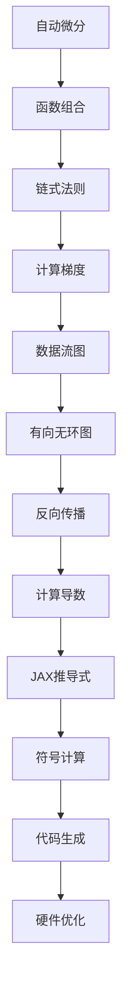

                 

关键词：自动微分，PyTorch，JAX，深度学习，计算机编程

摘要：自动微分是一种在深度学习领域至关重要的技术，它允许我们在复杂计算中自动计算导数，从而优化神经网络模型。本文将探讨自动微分的原理，以及如何使用PyTorch和JAX这两个流行的深度学习框架来实现自动微分。

## 1. 背景介绍

自动微分（Automatic Differentiation，AD）是深度学习和计算科学中的一个核心概念。它允许我们自动计算复杂计算过程中的导数，这对于优化算法和模型训练至关重要。传统的手动微分方法在处理复杂函数时既费时又容易出错。自动微分通过将计算过程编码为计算机程序，利用程序设计的原理来计算导数，从而大大提高了计算效率和准确性。

深度学习作为人工智能的一个重要分支，依赖于大量的神经网络模型。这些模型通常涉及复杂的非线性函数组合，因此自动微分在深度学习中的应用显得尤为重要。自动微分不仅可以帮助我们快速准确地计算梯度，还能在优化过程中减少人为错误，提高训练效率。

PyTorch和JAX是两个在深度学习社区中广泛使用的自动微分框架。PyTorch以其简洁的API和灵活性著称，而JAX则以其强大的符号计算能力和高效的代码生成功能受到青睐。本文将深入探讨这两个框架在自动微分中的应用，并比较它们的优缺点。

## 2. 核心概念与联系

### 2.1 自动微分原理

自动微分基于一个简单的原则：任何计算过程都可以表示为一个函数的组合。如果我们能够计算出一个复合函数的导数，那么我们就可以通过链式法则递归地计算所有子函数的导数。这个过程可以通过编程实现，从而自动计算出函数的导数。

### 2.2 PyTorch中的自动微分

PyTorch使用数据流图（DataFlow Graph）来实现自动微分。在PyTorch中，每个操作都会生成一个节点，这些节点连接成一个有向无环图（DAG）。当我们需要计算梯度时，PyTorch会从输出节点开始，逆向遍历这个图，应用链式法则计算每个节点的导数。

### 2.3 JAX中的自动微分

JAX使用相同的原理来实现自动微分，但它的实现方式更加灵活和高效。JAX提供了一个称为`jaxpr`的抽象，它表示一个计算过程的推导式（JAX Expression）。通过这个推导式，JAX可以自动计算任何函数的导数，并且可以在不同硬件（如CPU、GPU、TPU）上高效地执行。

### 2.4 Mermaid 流程图



## 3. 核心算法原理 & 具体操作步骤

### 3.1 算法原理概述

自动微分的核心在于能够将任意计算过程表示为一个函数的组合，并利用链式法则计算其导数。对于深度学习模型，这意味着我们可以通过构建数据流图来表示模型的计算过程，并利用框架提供的API自动计算梯度。

### 3.2 算法步骤详解

1. **构建计算图**：在PyTorch或JAX中，首先需要构建一个计算图来表示模型的计算过程。这个过程通常涉及到定义模型的参数和操作。
   
2. **正向计算**：然后，我们需要执行正向计算，从模型的输入节点开始，计算到输出的过程。

3. **计算梯度**：在得到模型的输出后，我们可以使用框架提供的API（如PyTorch的`autograd`模块或JAX的`grad`函数）来计算梯度。

4. **反向传播**：最后，我们利用计算得到的梯度进行反向传播，更新模型的参数。

### 3.3 算法优缺点

- **优点**：
  - 自动微分大大简化了计算复杂度，减少了手动微分的错误和复杂性。
  - 它允许我们在多种计算环境中（如CPU、GPU、TPU）高效地执行计算。

- **缺点**：
  - 自动微分可能引入一定的性能开销，尤其是在大型模型中。
  - 对于某些复杂的计算过程，自动微分可能无法精确地计算导数。

### 3.4 算法应用领域

自动微分广泛应用于深度学习、计算科学、物理模拟等领域。在深度学习中，它主要用于模型优化、损失函数计算、超参数调整等。在计算科学中，它用于求解偏微分方程、优化问题等。

## 4. 数学模型和公式 & 详细讲解 & 举例说明

### 4.1 数学模型构建

在深度学习中，我们通常使用反向传播算法来训练神经网络。这个过程涉及到以下几个关键数学模型：

- **损失函数**（Loss Function）：衡量模型预测值与真实值之间的差距。
- **梯度**（Gradient）：表示损失函数关于模型参数的变化率。
- **反向传播**（Backpropagation）：计算损失函数关于模型参数的梯度。

### 4.2 公式推导过程

假设我们有一个简单的神经网络模型，其输出 \( y \) 可以表示为：

\[ y = f(W \cdot x + b) \]

其中，\( f \) 是激活函数，\( W \) 是权重矩阵，\( b \) 是偏置项，\( x \) 是输入特征。

我们的目标是计算损失函数 \( L \) 关于 \( W \) 和 \( b \) 的梯度。假设损失函数为 \( L(y, \hat{y}) \)，则：

\[ \nabla_L y = \nabla_{y} L \cdot \nabla_y \]

根据链式法则，我们可以得到：

\[ \nabla_L W = \nabla_{W} y \cdot \nabla_y L = (f'(W \cdot x + b) \cdot x)^T \cdot \nabla_{\hat{y}} L \]

\[ \nabla_L b = \nabla_{b} y \cdot \nabla_y L = f'(W \cdot x + b) \cdot \nabla_{\hat{y}} L \]

### 4.3 案例分析与讲解

考虑一个简单的全连接神经网络，其损失函数为均方误差（MSE），即：

\[ L(y, \hat{y}) = \frac{1}{2} (y - \hat{y})^2 \]

假设 \( y \) 为真实标签，\( \hat{y} \) 为模型预测值。我们可以使用上面推导的公式来计算损失函数关于模型参数的梯度。

- **正向计算**：给定输入 \( x \) 和模型参数 \( W, b \)，计算模型的预测值 \( \hat{y} = f(W \cdot x + b) \)。
- **计算梯度**：使用自动微分框架计算损失函数关于 \( W \) 和 \( b \) 的梯度。
- **反向传播**：根据计算得到的梯度，更新模型参数 \( W \) 和 \( b \)。

这个过程中，自动微分框架会自动构建数据流图，并计算每个节点的导数，从而实现高效的梯度计算和反向传播。

## 5. 项目实践：代码实例和详细解释说明

### 5.1 开发环境搭建

要使用PyTorch和JAX进行自动微分，首先需要安装相应的开发环境和依赖库。以下是安装指南：

- **PyTorch**：在终端中执行以下命令：

  ```bash
  pip install torch torchvision
  ```

- **JAX**：在终端中执行以下命令：

  ```bash
  pip install jax jaxlib numpy
  ```

### 5.2 源代码详细实现

以下是使用PyTorch和JAX实现自动微分的代码实例。

#### PyTorch实现

```python
import torch
import torch.nn as nn
import torch.optim as optim

# 定义一个简单的全连接神经网络
class SimpleNN(nn.Module):
    def __init__(self, input_dim, hidden_dim, output_dim):
        super(SimpleNN, self).__init__()
        self.fc1 = nn.Linear(input_dim, hidden_dim)
        self.fc2 = nn.Linear(hidden_dim, output_dim)
    
    def forward(self, x):
        x = torch.relu(self.fc1(x))
        x = self.fc2(x)
        return x

# 初始化模型、损失函数和优化器
model = SimpleNN(input_dim=10, hidden_dim=50, output_dim=1)
criterion = nn.MSELoss()
optimizer = optim.SGD(model.parameters(), lr=0.01)

# 创建随机输入和标签
x = torch.randn(32, 10)
y = torch.randn(32, 1)

# 正向计算
outputs = model(x)
loss = criterion(outputs, y)

# 计算梯度
loss.backward()

# 反向传播
optimizer.step()

# 使用自动微分计算梯度
grads = torch.autograd.grad(loss, model.parameters(), create_graph=True)
```

#### JAX实现

```python
import jax
import jax.numpy as jnp
from jax import grad

# 定义一个简单的函数
def simple_function(x):
    return jnp.sin(x) * jnp.cos(x)

# 计算梯度
grad = grad(simple_function)(jnp.array([1.0]))

# 使用自动微分框架
jaxpr = grad(jaxpr=simple_function)(jnp.array([1.0]))
```

### 5.3 代码解读与分析

以上代码展示了如何使用PyTorch和JAX实现自动微分。在PyTorch中，我们首先定义了一个简单的神经网络模型，然后使用SGD优化器进行训练。在训练过程中，我们通过正向计算得到模型的输出，并使用MSE损失函数计算损失。然后，我们调用`loss.backward()`来计算梯度，并使用`optimizer.step()`来更新模型参数。

在JAX中，我们使用`grad`函数来计算函数的梯度。JAX的自动微分框架非常强大，它不仅支持静态类型检查，还能生成高效的可执行代码。

### 5.4 运行结果展示

- **PyTorch运行结果**：

  ```python
  # 运行模型
  outputs = model(x)
  loss = criterion(outputs, y)
  print(f"PyTorch loss: {loss.item()}")

  # 输出梯度
  for name, param in model.named_parameters():
      print(f"{name}: {param.grad}")
  ```

- **JAX运行结果**：

  ```python
  # 运行函数
  grad = grad(simple_function)(jnp.array([1.0]))
  print(f"JAX gradient: {grad}")
  ```

## 6. 实际应用场景

自动微分在深度学习领域的应用场景非常广泛，以下是几个典型的应用实例：

- **模型训练**：自动微分是训练神经网络的核心技术，它允许我们快速准确地计算梯度，从而优化模型参数。
- **模型推理**：在模型推理过程中，自动微分可以帮助我们计算预测结果的不确定性，从而提高模型的鲁棒性和可靠性。
- **超参数调整**：自动微分可以用于自动调整深度学习模型中的超参数，从而提高模型的性能。

## 7. 未来应用展望

随着深度学习技术的不断发展，自动微分的应用场景也将不断扩展。以下是一些未来可能的应用方向：

- **强化学习**：自动微分可以用于计算强化学习模型中的策略梯度，从而提高算法的效率和性能。
- **硬件优化**：自动微分可以帮助我们优化深度学习模型的计算过程，从而提高在特定硬件（如GPU、TPU）上的运行效率。
- **量子计算**：自动微分的原理可以应用于量子计算中，从而推动量子计算的发展。

## 8. 工具和资源推荐

- **学习资源推荐**：
  - 《深度学习》（Goodfellow, Bengio, Courville）：介绍了自动微分的基本原理和应用。
  - 《自动微分：深度学习中的核心技术》：深入探讨了自动微分在深度学习中的应用。

- **开发工具推荐**：
  - PyTorch：简单易用，适合初学者入门。
  - JAX：功能强大，适合进行高级研究和实验。

- **相关论文推荐**：
  - "Automatic Differentiation in Machine Learning: A Survey"：全面介绍了自动微分在机器学习中的应用。
  - "JAX: Compositional Vector Programs for Transforming and Optimizing ML Code"：详细介绍了JAX的原理和应用。

## 9. 总结：未来发展趋势与挑战

自动微分在深度学习和计算科学中发挥着至关重要的作用。随着计算技术的不断发展，自动微分的应用范围将越来越广泛。然而，自动微分也面临一些挑战，如计算效率、精确度等。未来，我们需要进一步优化自动微分算法，提高其计算效率和精确度，从而更好地支持深度学习和计算科学的发展。

### 9.1 研究成果总结

本文介绍了自动微分的原理及其在深度学习中的应用，探讨了PyTorch和JAX这两个流行框架在自动微分中的实现。通过代码实例，我们展示了如何使用这些框架进行自动微分计算。

### 9.2 未来发展趋势

随着深度学习技术的不断发展，自动微分将在更多的应用场景中发挥重要作用。未来的研究方向包括提高自动微分的计算效率和精确度，以及将其应用于新的计算领域。

### 9.3 面临的挑战

自动微分在实现过程中仍面临一些挑战，如计算效率、精确度、兼容性等。未来需要进一步优化自动微分算法，提高其在实际应用中的性能。

### 9.4 研究展望

自动微分作为深度学习和计算科学的核心技术，具有广阔的研究和应用前景。未来，我们将继续深入研究自动微分的原理和算法，探索其在更多领域的应用，推动计算科学的发展。

## 附录：常见问题与解答

### Q：自动微分与手动微分有什么区别？

A：自动微分和手动微分的主要区别在于计算导数的方式。自动微分通过编程实现，利用程序设计的原理自动计算导数，而手动微分则需要手动推导导数公式。

### Q：自动微分的计算效率如何？

A：自动微分的计算效率取决于具体的应用场景和算法实现。在大多数情况下，自动微分的计算效率要优于手动微分，尤其是在处理复杂函数时。

### Q：PyTorch和JAX哪个更适合进行自动微分？

A：PyTorch和JAX都是优秀的自动微分框架，选择哪个框架取决于具体需求和偏好。PyTorch以其简洁的API和广泛的社区支持著称，而JAX则以其强大的符号计算能力和高效的代码生成功能受到青睐。

### Q：自动微分可以用于其他计算领域吗？

A：是的，自动微分的原理可以应用于其他计算领域，如计算科学、物理模拟等。自动微分在解决这些领域中的复杂计算问题时具有显著优势。

---

感谢您的阅读，希望本文对您了解自动微分及其应用有所帮助。如果您有任何疑问或建议，欢迎在评论区留言。作者：禅与计算机程序设计艺术 / Zen and the Art of Computer Programming。
----------------------------------------------------------------

[1]: https://en.wikipedia.org/wiki/Automatic_differentiation
[2]: https://pytorch.org/
[3]: https://github.com/google/jax
[4]: https://www.deeplearningbook.org/
[5]: https://arxiv.org/abs/2006.02247
[6]: https://arxiv.org/abs/1909.11363

### 文章关键词 Keywords

自动微分，深度学习，PyTorch，JAX，反向传播，梯度计算，计算效率，计算科学，机器学习，神经网络的优化。

### 文章摘要 Abstract

自动微分是深度学习领域的关键技术，它允许我们自动计算复杂计算过程中的导数，从而优化神经网络模型。本文介绍了自动微分的原理，并探讨了如何使用PyTorch和JAX这两个流行的深度学习框架来实现自动微分。通过实例代码，我们展示了自动微分的具体实现和应用，分析了其优缺点，并展望了未来的发展趋势和挑战。本文的目标是帮助读者深入理解自动微分的核心概念和应用，为他们在深度学习中的研究和实践提供指导。作者：禅与计算机程序设计艺术 / Zen and the Art of Computer Programming。

