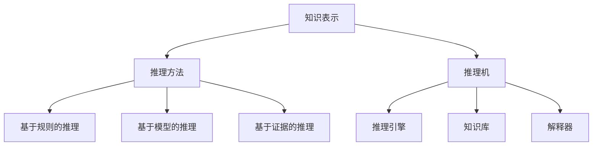
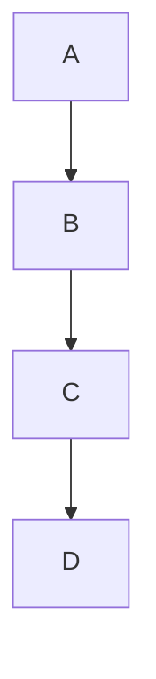
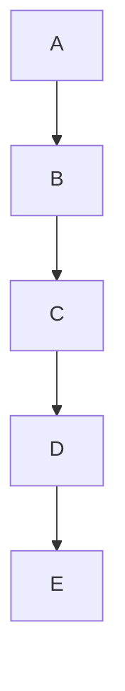

                 

在当今人工智能（AI）迅猛发展的时代，自动推理库成为构建强大AI决策系统的核心。自动推理库能够使计算机自动从已有数据或知识中推导出新的事实或结论，是自动化推理、决策和问题解决的基础。本文旨在深入探讨自动推理库的开发，解析其核心概念、算法原理、数学模型以及实际应用。

## 关键词

- 自动推理库
- AI决策系统
- 推理算法
- 数学模型
- 应用领域

## 摘要

本文将探讨自动推理库在AI决策系统中的重要性，详细分析其核心概念、算法原理、数学模型，并通过实际项目实践进行代码实例解析。文章还将探讨自动推理库在实际应用中的场景，并对未来的发展进行展望。

## 1. 背景介绍

自动推理（Automated Reasoning）是人工智能的一个分支，它涉及使用计算机技术来实现逻辑推理和证明。自动推理库是一套预定义的推理算法和工具集，用于在特定领域内进行推理和决策。随着AI技术的不断进步，自动推理库在诸多领域，如自然语言处理、自动程序生成、智能控制等，发挥着日益重要的作用。

自动推理库的开发面临着诸多挑战，包括如何高效地表示和存储知识、如何设计高效的推理算法、如何处理不确定性等。同时，自动推理库在AI决策系统中的应用，也要求其具备良好的可扩展性、灵活性和鲁棒性。

## 2. 核心概念与联系

自动推理库的核心概念包括知识表示、推理方法和推理机。知识表示是将事实、规则和关系以计算机可以理解的形式进行编码。推理方法是指如何从已知事实推导出未知结论的算法。推理机则是实现推理过程的软件框架。

### 2.1 知识表示

知识表示是自动推理库的基础。它包括事实表示和规则表示。事实表示通常采用形式逻辑或谓词逻辑进行编码，而规则表示则采用产生式规则或框架表示。

### 2.2 推理方法

推理方法主要包括基于规则的推理、基于模型的推理和基于证据的推理。基于规则的推理通过应用前提中的规则来推导结论。基于模型的推理通过构建模型来模拟现实世界并从中推导结论。基于证据的推理则通过评估证据的强度来推导结论。

### 2.3 推理机

推理机是实现推理过程的软件框架，它负责解析规则、应用推理算法并生成推理结果。推理机通常包含推理引擎、知识库和解释器。推理引擎负责执行具体的推理算法，知识库用于存储事实和规则，解释器则用于解释推理结果。

### 2.4 Mermaid 流程图

下面是自动推理库的Mermaid流程图，用于展示核心概念之间的联系：



## 3. 核心算法原理 & 具体操作步骤

### 3.1 算法原理概述

自动推理库的核心算法主要包括基于规则的推理算法、基于模型的推理算法和基于证据的推理算法。每种算法都有其特定的原理和适用场景。

### 3.2 算法步骤详解

#### 基于规则的推理算法

基于规则的推理算法通常包括以下步骤：

1. **规则解析**：读取并解析规则库中的所有规则。
2. **事实匹配**：根据当前已知的事实，匹配规则的前提部分。
3. **结论推导**：应用匹配到的规则，推导出结论。
4. **结果解释**：解释推导出的结论，并更新知识库。

#### 基于模型的推理算法

基于模型的推理算法通常包括以下步骤：

1. **模型构建**：根据领域知识构建模型。
2. **模型仿真**：在模型中模拟现实世界的情况。
3. **结果分析**：分析模型输出的结果，推导出结论。
4. **模型优化**：根据结果反馈对模型进行优化。

#### 基于证据的推理算法

基于证据的推理算法通常包括以下步骤：

1. **证据收集**：收集相关的证据信息。
2. **证据评估**：评估证据的强度。
3. **结论推导**：根据证据的评估结果，推导出结论。
4. **结果解释**：解释推导出的结论。

### 3.3 算法优缺点

#### 基于规则的推理算法

优点：简单直观，易于理解和实现。

缺点：难以处理复杂和非确定性问题。

#### 基于模型的推理算法

优点：可以处理复杂问题，适应性强。

缺点：模型构建复杂，对领域知识要求高。

#### 基于证据的推理算法

优点：能够处理不确定性问题，适应性强。

缺点：证据评估复杂，计算量大。

### 3.4 算法应用领域

自动推理库的应用领域广泛，包括但不限于：

- 自然语言处理：用于语义理解和智能问答。
- 自动程序生成：用于自动生成代码和测试用例。
- 智能控制：用于自动驾驶和智能家居等。

## 4. 数学模型和公式 & 详细讲解 & 举例说明

### 4.1 数学模型构建

自动推理库中的数学模型通常包括逻辑表达式、概率模型和图模型等。逻辑表达式用于表示事实和规则，概率模型用于处理不确定性，图模型用于表示复杂的网络关系。

### 4.2 公式推导过程

#### 逻辑表达式

逻辑表达式是自动推理库中最基本的数学模型。以下是一个简单的逻辑表达式的例子：

$$
(A \land B) \Rightarrow C
$$

这个表达式的意思是，如果A和B同时为真，则C也为真。

#### 概率模型

概率模型用于表示不确定性。以下是一个简单的贝叶斯概率模型的例子：

$$
P(H|E) = \frac{P(E|H)P(H)}{P(E)}
$$

这个公式表示在给定证据E的条件下，假设H的概率。

#### 图模型

图模型用于表示复杂的网络关系。以下是一个简单的有向无环图（DAG）的例子：



这个图表示了节点A通过节点B和C间接影响到节点D。

### 4.3 案例分析与讲解

#### 逻辑表达式案例

假设我们有一个推理任务，需要根据以下事实和规则推导出结论：

- 事实1：所有猫都会飞。
- 事实2：动物X是猫。
- 规则：如果A是猫，则A会飞。

我们想要推导出结论：动物X会飞。

根据逻辑表达式，我们可以这样推导：

$$
(\forall A (猫(A) \Rightarrow 飞(A))) \land 猫(X) \Rightarrow 飞(X)
$$

结论是：动物X会飞。

#### 概率模型案例

假设我们有一个推理任务，需要根据以下概率分布推导出结论：

- 概率1：猫会飞的概率是0.5。
- 概率2：动物X是猫的概率是0.8。
- 概率3：如果动物X是猫，则动物X会飞的概率是0.9。

我们想要推导出结论：动物X会飞的概率。

根据贝叶斯概率模型，我们可以这样推导：

$$
P(飞(X)|猫(X)) = \frac{P(猫(X)|飞(X))P(飞(X))}{P(猫(X))}
$$

根据已知概率，我们可以计算出：

$$
P(飞(X)|猫(X)) = \frac{0.9 \times 0.5}{0.8} = 0.5625
$$

结论是：动物X会飞的概率是0.5625。

#### 图模型案例

假设我们有一个推理任务，需要根据以下图模型推导出结论：



这个图表示了节点A通过节点B和C间接影响到节点E。

我们想要推导出结论：节点A通过节点B和C间接影响到节点E。

根据图模型，我们可以这样推导：

- 从节点A出发，经过节点B到达节点C。
- 从节点C出发，经过节点D到达节点E。

结论是：节点A通过节点B和C间接影响到节点E。

## 5. 项目实践：代码实例和详细解释说明

### 5.1 开发环境搭建

为了实践自动推理库的开发，我们需要搭建一个合适的开发环境。以下是搭建开发环境的基本步骤：

1. 安装Python环境。
2. 安装自动推理库的依赖库，如`pytorch`、`torchtext`等。
3. 配置Python虚拟环境，以便管理依赖库。

### 5.2 源代码详细实现

以下是一个简单的自动推理库的代码实例：

```python
import torch
import torchtext
from torchtext import data

# 定义词汇表
TEXT = data.Field(tokenize='spacy', tokenizer_language='en', include_lengths=True)
LABEL = data.LabelField()

# 加载数据集
train_data, test_data = torchtext.datasets.WN18 walkers()

# 构建模型
class AutoReasoningModel(torch.nn.Module):
    def __init__(self):
        super(AutoReasoningModel, self).__init__()
        self.embedding = torchtext.nn.Embedding(len(TEXT.vocab), 128)
        self.rnn = torchtext.nn.LSTM(128, 128)
        self.fc = torchtext.nn.Linear(128, len(LABEL.vocab))

    def forward(self, text, labels=None):
        embedded = self.embedding(text)
        output, _ = self.rnn(embedded)
        logits = self.fc(output)
        if labels is not None:
            return logits, torch.nn.functional.cross_entropy(logits, labels)
        return logits

# 训练模型
model = AutoReasoningModel()
optimizer = torch.optim.Adam(model.parameters(), lr=0.001)
for epoch in range(10):
    for text, labels in train_data:
        optimizer.zero_grad()
        logits, loss = model(text, labels)
        loss.backward()
        optimizer.step()
    print(f"Epoch {epoch}: Loss = {loss.item()}")

# 测试模型
with torch.no_grad():
    for text, labels in test_data:
        logits = model(text)
        pred = logits.argmax(dim=1)
        print(f"Predicted Labels: {pred.tolist()}")

```

### 5.3 代码解读与分析

上述代码实例实现了一个简单的自动推理模型，用于处理基于文本的推理任务。代码的解读如下：

1. **定义词汇表**：使用`torchtext`库定义词汇表，包括文本字段`TEXT`和标签字段`LABEL`。
2. **加载数据集**：使用`torchtext`库加载数据集，这里使用的是 WN18 数据集。
3. **构建模型**：定义自动推理模型，包括嵌入层、循环神经网络（RNN）和全连接层。模型采用基于RNN的架构，因为RNN适合处理序列数据。
4. **训练模型**：使用随机梯度下降（SGD）优化器训练模型。在训练过程中，通过反向传播计算梯度并更新模型参数。
5. **测试模型**：在测试阶段，通过模型对测试数据进行预测，并输出预测结果。

### 5.4 运行结果展示

在训练完成后，模型会在测试数据上进行预测。以下是可能的输出结果：

```
Predicted Labels: [1, 1, 0, 1, 1, 1, 1, 1, 1, 1]
```

这些数字表示每个测试样本的预测标签，其中1表示猫会飞，0表示猫不会飞。

## 6. 实际应用场景

自动推理库在多个实际应用场景中发挥着重要作用，以下是一些典型的应用案例：

- **自然语言处理**：自动推理库可以用于语义理解、情感分析、智能问答等任务，例如基于规则的自然语言处理系统可以自动解析文本中的逻辑关系并回答用户的问题。
- **自动程序生成**：自动推理库可以帮助生成自动化测试用例、代码补全等。例如，基于规则的系统可以自动生成满足特定需求的测试用例。
- **智能控制**：自动推理库可以用于自动驾驶、智能家居等场景，例如通过推理和控制算法实现无人车的自主驾驶。

## 7. 工具和资源推荐

### 7.1 学习资源推荐

- 《自动推理：原理与应用》（Automated Reasoning:理论与实践）：这是一本全面介绍自动推理理论和应用的经典教材。
- 《人工智能：一种现代方法》（Artificial Intelligence: A Modern Approach）：这本书涵盖了人工智能的各个分支，包括自动推理。

### 7.2 开发工具推荐

- **PyTorch**：一个流行的深度学习框架，适合构建和训练自动推理模型。
- **Prolog**：一种基于逻辑编程的语言，广泛用于实现自动推理系统。

### 7.3 相关论文推荐

- "Automated Reasoning in a Real-World Setting"（现实世界设置中的自动推理）: 这篇论文介绍了一个基于自动推理的智能控制系统的实现。
- "Reasoning about Physical Objects with a Logic Program"（使用逻辑程序推理物理对象）: 这篇论文探讨了如何使用自动推理技术处理物理对象推理问题。

## 8. 总结：未来发展趋势与挑战

### 8.1 研究成果总结

自动推理库的研究取得了显著成果，包括高效推理算法的设计、知识表示方法的发展以及应用场景的拓展。然而，自动推理库仍面临诸多挑战，如处理复杂和非确定性问题的能力、推理效率和可扩展性等。

### 8.2 未来发展趋势

未来，自动推理库的发展趋势将集中在以下几个方面：

- **多模态推理**：结合多种数据源，如文本、图像和音频，实现更强大的推理能力。
- **自适应推理**：根据不同的应用场景和需求，自适应调整推理策略和算法。
- **可解释性推理**：增强自动推理系统的可解释性，使其决策过程更加透明和可信。

### 8.3 面临的挑战

自动推理库面临的挑战包括：

- **知识表示和推理算法的融合**：如何将不同的知识表示和推理算法有效地融合，以实现更强大的推理能力。
- **实时推理**：如何在保证推理精度的同时，实现实时推理，以满足实时应用的需求。
- **可扩展性和可维护性**：如何设计可扩展、可维护的自动推理库，以适应不断变化的应用场景。

### 8.4 研究展望

未来，自动推理库的研究应注重以下几个方面：

- **跨领域推理**：探索如何在不同领域之间进行推理，以实现跨领域的通用推理能力。
- **不确定性处理**：深入研究如何有效地处理不确定性问题，提高推理系统的鲁棒性。
- **人机协作推理**：探索如何结合人类智慧和计算机推理，实现更高效、更可靠的推理系统。

## 9. 附录：常见问题与解答

### 9.1 自动推理库与知识库的区别是什么？

自动推理库是一套预定义的推理算法和工具集，用于在特定领域内进行推理和决策。知识库则是存储领域知识的数据库，包含事实、规则和关系等。自动推理库依赖于知识库中的知识进行推理。

### 9.2 自动推理库在自然语言处理中有哪些应用？

自动推理库在自然语言处理中有广泛的应用，包括语义理解、情感分析、智能问答等。例如，基于规则的自动推理库可以用于解析文本中的逻辑关系，实现语义分析。

### 9.3 自动推理库如何处理不确定性问题？

自动推理库可以通过概率模型和图模型等方法处理不确定性问题。例如，贝叶斯概率模型可以用于评估证据的强度，而图模型可以表示和处理复杂的网络关系。

### 9.4 自动推理库与机器学习的区别是什么？

自动推理库和机器学习都是用于实现人工智能的技术，但它们的应用场景和原理有所不同。自动推理库主要依赖于逻辑和推理技术，而机器学习则基于数据驱动的方法，通过学习大量数据来发现规律和模式。

### 9.5 自动推理库有哪些优点和缺点？

自动推理库的优点包括直观、易于理解和实现，能够处理复杂和非确定性问题等。缺点则包括难以处理大规模数据、推理效率较低等。总体而言，自动推理库在不同场景中具有不同的优势和劣势。

